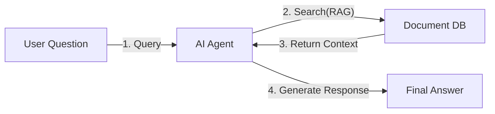

# Mermaid Diagram Guide

## 1. Basic Principles
<!-- Mermaid 다이어그램 작성의 기본 원칙 -->

- Keep the number of nodes in a single diagram to **7 or fewer** for readability.
- Use the modern **`flowchart`** keyword instead of `graph`. (better subgraph title compatibility)

## 2. Special Character Handling Rules
<!-- 괄호, 중괄호, 슬래시 등 특수문자 처리 규칙 -->

Labels containing parentheses `()`, braces `{}`, brackets `[]`, slashes `/`, line breaks `<br>`, etc. must be wrapped in **double quotes (`"`)**.

### Line Breaks
<!-- 노드 레이블 내 줄바꿈 규칙 -->

Use `<br>` for line breaks inside node labels. **Never use `\n`** — Mermaid does not support `\n`.

```
Bad:  A["Line 1\nLine 2"]        → \n is not rendered as a line break
Good: A["Line 1<br>Line 2"]      → correctly renders two lines
```

### Node Labels
<!-- 노드 레이블 규칙 -->

```
Bad:  A[Router(Decision)]        → parentheses cause parsing error
Good: A["Router(Decision)"]      → safe
```

### Edge Text (Critical)
<!-- 연결선 텍스트 핵심 규칙 -->

Edge text containing special characters frequently causes parsing errors.
**Always use the `A -- "text" --> B` format**.

```
Bad:  A -->|Process(Core)| B
Bad:  A -->|"Process(Core)"| B
Good: A -- "Process(Core)" --> B
```

### Dashed / Bold Lines
<!-- 점선과 굵은선 규칙 -->

```mermaid
A -. "dashed text (example)" .-> B
A == "bold text (example)" ==> B
```

## 3. Subgraph Rules
<!-- 서브그래프 작성 규칙 -->

- Do not use spaces or special characters in IDs.
- The standard syntax is recommended over bracket syntax for title notation.

```
Safe: subgraph SubSystem ["System Name"]
```

## 4. Bold/Italic Mixing Absolutely Prohibited (Critical Parsing Error)
<!-- 쌍따옴표 내외부에 볼드체/이탤릭체 마크다운 절대 금지 -->

Never use Markdown bold (`**`) or italic (`*`) inside or outside double quotes.
This is the most common cause of rendering failure, as the Mermaid parsing engine interprets `*` as a separate symbol.

```
Correct: subgraph step1 ["Step 1: LLM Standalone Run (Error)"]
Wrong:   subgraph step1 [**"Step 1: LLM Standalone Run (Error)"**]
Wrong:   A["**Core Concept**"] --> B
```

This rule applies equally to subgraph titles, node labels, and edge text.

## 4. Correct Examples
<!-- 올바른 Mermaid 예시 -->



## 5. Checklist
<!-- Mermaid 다이어그램 작성 체크리스트 -->

- [ ] Is the `flowchart` keyword used? (not `graph`)
- [ ] Are node labels containing parentheses wrapped in double quotes?
- [ ] Is the `-- "text" -->` format used for edge text?
- [ ] Is the number of nodes 7 or fewer?
- [ ] Are there no `**` or `*` bold/italic Markdown inside or outside double quotes?
