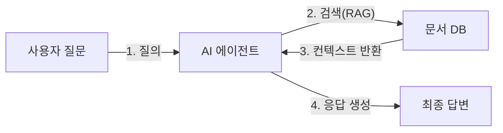

# Mermaid 다이어그램 가이드

## 1. 기본 원칙

- 하나의 다이어그램에 노드가 **7개를 넘지 않도록** 단순화하여 가독성을 확보합니다.
- `graph` 대신 최신 문법인 **`flowchart`** 키워드를 사용합니다. (서브그래프 타이틀 호환성 우수)

## 2. 특수문자 처리 규칙

괄호`()`, 중괄호`{}`, 대괄호`[]`, 슬래시`/`, 줄바꿈`<br/>` 등이 포함된 레이블은 반드시 **쌍따옴표(`"`)** 로 감쌉니다.

### 노드 레이블

```
Bad:  A[Router(판단)]        → 괄호 인식 오류 발생
Good: A["Router(판단)"]      → 안전
```

### 연결선 텍스트 (핵심)

연결선 텍스트에 특수문자가 포함되면 파싱 에러가 빈번히 발생합니다.
**반드시 `A -- "텍스트" --> B` 형식을 사용**합니다.

```
Bad:  A -->|처리(Process)| B
Bad:  A -->|"처리(Process)"| B
Good: A -- "처리(Process)" --> B
```

### 점선 / 굵은선

```mermaid
A -. "점선 텍스트(예시)" .-> B
A == "굵은선 텍스트(예시)" ==> B
```

## 3. 서브그래프 규칙

- ID에는 공백이나 특수문자를 쓰지 않습니다.
- 타이틀 표기 시 대괄호 문법보다 표준 문법을 권장합니다.

```
Safe: subgraph SubSystem ["시스템 이름"]
```

## 4. 볼드체·이탤릭체 혼용 절대 금지 (치명적 파싱 오류)

쌍따옴표 내부 또는 외부에 마크다운 볼드체(`**`)나 이탤릭체(`*`)를 절대 사용하지 않습니다.
이는 Mermaid 파싱 엔진이 `*`를 별도 기호로 해석하여 렌더링 실패를 유발하는 가장 흔한 원인입니다.

```
✅ 올바른 예시: subgraph step1 ["Step 1: LLM 단독 실행 (오류)"]
❌ 잘못된 예시: subgraph step1 [**"Step 1: LLM 단독 실행 (오류)"**]
❌ 잘못된 예시: A["**핵심 개념**"] --> B
```

이 규칙은 서브그래프 타이틀, 노드 레이블, 연결선 텍스트 모두에 동일하게 적용됩니다.

## 4. 올바른 예시



## 5. 체크리스트

- [ ] `flowchart` 키워드를 사용했는가? (`graph` 아님)
- [ ] 괄호가 포함된 노드 레이블에 쌍따옴표를 적용했는가?
- [ ] 연결선 텍스트에 `-- "텍스트" -->` 형식을 사용했는가?
- [ ] 노드 수가 7개 이하인가?
- [ ] 쌍따옴표 내부·외부에 `**` 또는 `*` 볼드/이탤릭 마크다운이 없는가?
