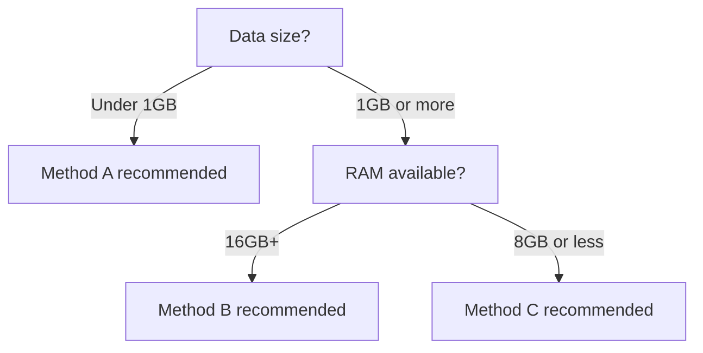

# Comparison/Contrast Concept Rules

## Core Characteristics
<!-- 비교/대조 컨셉의 핵심 구조와 특징 -->

- **Structure**: Present options → Compare by criteria → Recommend choice → Implement
- **Tone**: Objective, trade-offs explicitly stated
- **Decision support**: Provide criteria so readers can choose based on their situation
- **Theory:Practice ratio**: 5:5

## Comparison Table Pattern
<!-- 기술·방법 비교 시 반드시 표를 사용하는 패턴 -->

When comparing technologies or methods, always use a table.

```markdown
| Item | Method A | Method B | Method C |
|------|----------|----------|----------|
| Performance | High | Medium | Low |
| Implementation difficulty | High | Medium | Low |
| Memory usage | High | Medium | Low |
| Suitable scenario | {scenario} | {scenario} | {scenario} |
```

## Decision Flowchart Pattern
<!-- Mermaid flowchart로 선택 기준 시각화 -->

Visualize selection criteria with a Mermaid flowchart.



## Recommended Choice Presentation Pattern
<!-- 비교 후 명확한 권장 사항 제시 패턴 -->

After comparison, always present a clear recommendation. Vague expressions are prohibited.

```
In this book's practice environment (RAM 16GB, local LLM), we use **Method B**.
If you need higher accuracy or a production environment, consider **Method A**.
```

## Prohibited Items
<!-- 금지 사항 -->

- Ending with "it depends on the situation" is prohibited — always specify concrete recommended conditions
- If comparison items exceed 5, compress to the core 3–4

## Visual Guide
<!-- 비주얼 가이드 -->

### Image Usage Principles
<!-- 이미지 사용 원칙 -->

- **Technology comparison**: Radar chart or side-by-side comparison image
- **Decision making**: Mermaid flowchart (pattern already defined) takes priority
- **Recommended choice highlight**: An image highlighting the chosen method

### Gemini Image Style
<!-- Gemini 이미지 스타일 -->

comparison uses an **objective chart/infographic style**.

```
<!-- GEMINI_IMAGE
Prompt: Radar chart comparing {methodA}, {methodB}, {methodC} across {N} dimensions:
        {criterion1}, {criterion2}, {criterion3}, each method in different color (blue, orange, green),
        clean data visualization style, legend clearly labeled, neutral professional look
Style: radar-chart-comparison
Alt: {methodA} vs {methodB} vs {methodC} performance comparison radar chart
-->
```

### Recommended Choice Highlight Pattern
<!-- 최종 권장 선택 시각적 강조 패턴 -->

When visually emphasizing the final recommended choice:

```
<!-- GEMINI_IMAGE
Prompt: Side-by-side comparison cards for {methodA} and {methodB}, the recommended
        option ({recommended_method}) card has a green checkmark badge and subtle green glow,
        the other card is slightly grayed out, each card shows key pros/cons as
        bullet icons, flat design, professional style
Style: comparison-card-highlight
Alt: {recommended_method} recommended — {methodA} vs {methodB} comparison
-->
```

### Insertion Location Rules
<!-- 삽입 위치 규칙 -->

1. Before comparison table — radar chart or comparison card image (choose 1)
2. Decision flowchart — Mermaid flowchart required (pattern already defined)
3. After recommended choice presentation — recommended option highlight image (choose 1)
