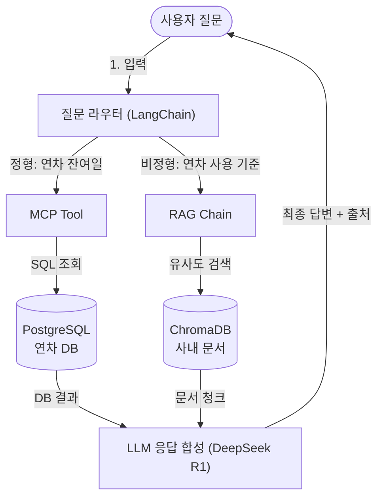

# 1. 이 책의 목표와 최종 완성본 미리보기

이 장에서는 이 책이 만드는 결과물과 그 설계 원칙을 학습합니다. 어떤 시스템을 구축하는지, 왜 그 방식을 선택했는지를 먼저 확인하여 이후 실습의 방향을 잡습니다.

<!-- [GEMINI PROMPT: 01_system-overview]
path: assets/CH01/01_system-overview.png
Minimalist flat-design infographic showing an AI office assistant system architecture overview. Components: User (browser), FastAPI backend, LangChain AgentExecutor, MCP Tool (PostgreSQL), RAG Tool (ChromaDB vector store), Ollama LLM. Data flow arrows connecting each component left to right. White background, clean line art, Korean labels, 16:9.
Style: system-architecture-flat
-->

*그림 1-1: AI 업무 비서 시스템 전체 구성 개요*

---

## 1. 이 책이 만드는 것

이 책은 **AI 업무 비서(AI Work Assistant)** 를 로컬 환경에서 처음부터 끝까지 구축하는 과정을 안내합니다. 사내 문서(PDF)와 정형 데이터베이스(PostgreSQL)를 LLM과 연결하여, 자연어 질문에 출처가 포함된 답변을 반환하는 시스템입니다.

### Fine-tuning이 아닌 RAG를 선택하는 이유

LLM에 사내 지식을 주입하는 방법은 크게 두 가지입니다. **파인튜닝(Fine-tuning)** 은 모델 가중치를 직접 학습시키는 방법이고, **검색 증강 생성(RAG, Retrieval-Augmented Generation)** 은 기존 모델에 외부 지식을 실시간으로 주입하는 방법입니다.

파인튜닝은 강력하지만 비용과 복잡도가 높습니다. 사내 규정이 업데이트될 때마다 모델을 다시 학습시켜야 하고, 학습 데이터 준비부터 GPU 자원 확보까지 진입 장벽이 높습니다. 반면 RAG는 문서를 벡터 데이터베이스에 저장해 두고 질문이 들어올 때마다 관련 문서를 검색하여 LLM에 전달합니다. 문서가 바뀌면 벡터 DB를 업데이트하면 되므로, 유지 보수 비용이 훨씬 낮습니다.

> **참고: 이 책의 대상 시나리오**
> 이 책은 "사내 문서(PDF)와 DB에 LLM을 연결하고 싶지만, 모델 재학습까지는 하지 않겠다"는 실무 요구에 최적화된 접근 방식을 다룹니다.

### LLM 제공자 선택: 로컬(기본)과 클라우드(선택)

이 책의 기본 실습 환경은 **Ollama + DeepSeek R1** 조합입니다. 로컬 LLM을 기본으로 선택하는 이유는 세 가지입니다.

1. **사내 데이터 보안**: 인사 규정, 매출 데이터 등 민감한 정보가 외부 서버로 전송되지 않습니다.
2. **API 비용 제거**: 질의 횟수에 관계없이 추가 비용이 발생하지 않습니다.
3. **네트워크 독립성**: 인터넷 연결이 불안정한 환경에서도 동작합니다.

로컬 LLM이 어려운 환경(RAM 부족, GPU 미보유)이라면 클라우드 API로도 실습이 가능합니다. `.env` 파일의 `LLM_PROVIDER` 값을 변경하는 것만으로 **OpenAI GPT-4o** 또는 **Anthropic Claude** 로 즉시 전환할 수 있습니다. 클라우드 LLM을 사용하는 경우 해당 서비스의 API 키를 발급받아 `.env`에 입력하면 됩니다.

> **주의: 하드웨어 요구사항**
> DeepSeek R1(7B 파라미터) 기준으로 최소 16GB RAM이 필요합니다. RAM이 부족한 경우 더 작은 모델(예: deepseek-r1:1.5b)로 실습하거나, 클라우드 API 방식으로 전환하십시오.

---

## 2. 시나리오로 보는 AI 업무 비서

완성된 시스템이 어떻게 동작하는지 구체적인 사용 시나리오로 먼저 확인합니다.

### 복합 질의 시나리오

인사팀 직원이 다음 질문을 AI 업무 비서에 입력합니다.

> "김철수 씨의 남은 연차가 며칠이고, 연차 사용 기준은 어떻게 되나요?"

이 질문에는 두 가지 성격이 서로 다른 정보 요구가 섞여 있습니다.

- **"남은 연차가 며칠인가"** → 데이터베이스에서 조회해야 하는 **정형(Structured)** 데이터
- **"연차 사용 기준은 어떻게 되나"** → 사내 규정 문서에서 검색해야 하는 **비정형(Unstructured)** 데이터

이 두 가지를 하나의 시스템이 처리하여 단일 답변으로 합성합니다.

### 단계별 처리 흐름

| 단계 | 동작 | 구성 요소 |
|------|------|---------|
| ① 질문 입력 | 사용자가 복합 질문을 입력 | CLI / Web UI |
| ② 질문 라우팅 | "연차 잔여일" → 정형(DB), "연차 사용 기준" → 비정형(문서)으로 분류 | 질문 라우터 |
| ③-A MCP Tool 호출 | PostgreSQL에서 김철수의 잔여 연차를 조회 | MCP Tool + PostgreSQL |
| ③-B RAG Chain 호출 | "연차 사용 기준"으로 사내 규정 문서를 벡터 검색 | ChromaDB + 임베딩 모델 |
| ④ LLM 응답 합성 | DB 결과 + 문서 청크를 컨텍스트로 DeepSeek R1이 자연어 답변 생성 | Ollama (DeepSeek R1) |
| ⑤ 최종 답변 출력 | 출처 문서명이 포함된 답변을 반환 | FastAPI 응답 |

단계 ③-A와 ③-B는 병렬로 실행됩니다. **질문 라우터(Question Router)** 가 질문을 분석하여 정형·비정형 두 경로로 동시에 요청을 보내고, 두 결과가 모이면 LLM이 최종 답변을 합성합니다.

### 최종 답변 예시

```
김철수 씨의 남은 연차는 5일입니다.

연차 사용 기준 (사내 취업규칙 v1.0, 3조 2항):
- 연차는 최소 1일 단위로 사용 가능합니다.
- 3일 이상 연속 사용 시 팀장 사전 승인이 필요합니다.
- 미사용 연차는 다음 해 3월 31일까지 이월됩니다.

[출처: HR_취업규칙_v1.0.pdf, 3페이지]
```

출처가 명시되기 때문에 담당자가 원문을 직접 확인할 수 있습니다. 이것이 RAG 방식의 핵심 장점입니다. LLM이 생성한 내용이 어느 문서 어느 페이지에 근거하는지 추적이 가능합니다.

---

## 3. 전체 아키텍처 한 장 요약

아래 다이어그램은 이 책에서 구축하는 전체 시스템의 구성도입니다. 10개 챕터를 거쳐 완성할 시스템의 최종 모습을 미리 확인하십시오.



*그림 1-2: AI 업무 비서 전체 아키텍처 다이어그램*

각 구성 요소의 역할을 정리합니다.

| 구성 요소 | 역할 |
|---------|------|
| **질문 라우터** | 사용자 질문을 분석하여 MCP Tool(정형)과 RAG Chain(비정형) 중 적절한 경로로 분기 |
| **MCP Tool** | LLM이 PostgreSQL DB를 표준 프로토콜로 호출하는 도구 |
| **RAG Chain** | 사내 문서를 벡터 DB에서 검색하여 LLM에 컨텍스트를 제공하는 체인 |
| **PostgreSQL** | 직원 정보, 연차 신청, 매출 기록 등 정형 데이터를 저장하는 관계형 DB |
| **ChromaDB** | 사내 문서(PDF)를 벡터로 변환하여 저장하는 벡터 데이터베이스 |
| **DeepSeek R1** | DB 결과와 문서 청크를 받아 자연어 답변을 생성하는 로컬 LLM |

---

## 4. 사용 기술 스택 상세

이 책에서 사용하는 모든 기술은 무료이며 로컬에서 동작합니다.

| 역할 | 기술 | 버전 | 선택 이유 |
|------|------|------|---------|
| 프로그래밍 언어 | Python | 3.11 | LangChain, ChromaDB 공식 지원 버전 |
| LLM 추론 런타임 | Ollama | 0.5+ | macOS/Linux/WSL2 네이티브, 모델 관리 단순 |
| 언어 모델 | DeepSeek R1 | latest | 오픈 웨이트, 추론 능력 우수, 무료 |
| 파이프라인 프레임워크 | LangChain | 0.3+ | LCEL 체인 문법, RAG/Agent 표준 |
| 벡터 데이터베이스 | ChromaDB | 0.5+ | 로컬 영속 모드 지원, Python 네이티브 |
| 관계형 데이터베이스 | PostgreSQL | 16 | 실무 표준, Docker Compose로 즉시 구동 |
| API 서버 | FastAPI | 0.110+ | 비동기 처리, Swagger UI 자동 제공 |
| 컨테이너 | Docker / Docker Compose | Docker 24+, Compose v2 | 환경 격리, 재현성 보장 |
| PDF 파싱 | pdfplumber | 최신 | 표·이미지가 없는 일반 PDF 처리 |
| Vision LLM | LLaVA | latest | 복합 레이아웃 PDF를 이미지로 처리 |
| MCP 서버 | FastMCP | 최신 | MCP 프로토콜을 Python으로 빠르게 구현 |

> **LLM Provider 전환**: `.env`의 `LLM_PROVIDER` 환경 변수를 변경하면 `ollama`, `openai`, `anthropic` 중 선택 가능합니다.

> **팁: LLM Provider 스위칭**
> 이 책의 모든 예제는 `.env` 파일의 `LLM_PROVIDER` 값 하나로 LLM 제공자를 전환할 수 있도록 설계되었습니다.
>
> | Provider | 설정값 | API 키 필요 여부 |
> |----------|--------|----------------|
> | Ollama (기본) | `LLM_PROVIDER=ollama` | 불필요 — 로컬 실행 |
> | OpenAI | `LLM_PROVIDER=openai` | `OPENAI_API_KEY` 설정 필요 |
> | Anthropic | `LLM_PROVIDER=anthropic` | `ANTHROPIC_API_KEY` 설정 필요 |
>
> 로컬 환경 구성이 어려운 경우(RAM 부족 등), OpenAI 또는 Anthropic API 키를 발급받아 클라우드 LLM으로 실습을 진행할 수 있습니다.

### MCP를 도입하는 이유

**MCP(Model Context Protocol)** 는 Anthropic이 제안한 오픈 프로토콜로, LLM이 외부 도구(DB, API 등)를 표준화된 방식으로 호출할 수 있게 합니다. 기존 LangChain Tool은 Python 코드에 종속되어 재사용이 어렵지만, MCP는 도구를 프로토콜 수준으로 분리하여 LLM 프레임워크에 관계없이 재사용할 수 있습니다.

이 책에서는 PostgreSQL DB 조회 기능을 MCP Tool로 구현합니다. 정형 데이터(DB)와 비정형 데이터(문서) 두 가지를 단일 에이전트에서 통합 질의하는 것이 이 아키텍처의 핵심입니다.

<!-- [GEMINI PROMPT: 01_mcp-vs-langchain]
path: assets/CH01/01_mcp-vs-langchain.png
Minimalist flat-design comparison diagram. Left side: LangChain Tool approach — Python code directly calling DB functions, tightly coupled. Right side: MCP Tool approach — standardized protocol layer separating LLM from tools, loosely coupled. Visual contrast with red (coupled) vs green (decoupled) color coding. White background, clean line art, Korean labels, 16:9.
Style: comparison-diagram-flat
-->

*그림 1-3: LangChain Tool과 MCP Tool의 구조 비교*

---

## 5. 이 책을 마치면 할 수 있는 것

10개 챕터를 완료하면 다음 역량을 갖추게 됩니다.

1. **RAG 파이프라인 구축**: PDF를 파싱하고, 청킹하고, 임베딩하여 ChromaDB에 저장하는 전체 파이프라인을 직접 구현할 수 있습니다.
2. **로컬 LLM 연동**: Ollama를 활용하여 외부 API 없이 DeepSeek R1 모델을 코드에 연결할 수 있습니다.
3. **MCP 서버 구현**: FastMCP로 PostgreSQL DB를 MCP Tool로 노출하고, LLM 에이전트가 자율적으로 DB를 조회하도록 설계할 수 있습니다.
4. **인텐트 라우팅 설계**: 사용자 질문을 분석하여 정형·비정형 데이터 경로로 분기하는 라우터를 설계할 수 있습니다.
5. **RAG 성능 튜닝**: 청킹 전략 조정, ReRanker 적용, 프롬프트 최적화로 RAG 정확도를 개선하고, 테스트셋을 통해 수치로 측정할 수 있습니다.

### 확장 가능성

이 책에서 구축한 시스템은 출발점입니다. 기반이 완성된 후에는 다음과 같이 확장할 수 있습니다.

- **Graph RAG**: 문서 간 관계를 그래프로 모델링하여 복잡한 추론 질문에 대응
- **멀티에이전트 오케스트레이션**: 여러 전문 에이전트가 협력하는 구조로 발전
- **클라우드 배포**: Docker 이미지를 AWS/GCP에 배포하여 팀 전체가 사용하는 서비스로 전환
- **실시간 문서 동기화**: 사내 문서 업데이트 시 자동으로 벡터 DB를 갱신하는 파이프라인 구축

---

## 6. 정리하며

- **RAG를 선택하는 이유**: 파인튜닝 없이 기존 모델에 외부 지식을 실시간 주입하여, 문서 업데이트 비용과 모델 재학습 복잡도를 모두 낮춥니다.
- **LLM 제공자 선택 전략**: 기본은 Ollama + DeepSeek R1(로컬, 무료, 보안)이며, `.env`의 `LLM_PROVIDER` 한 줄 변경으로 OpenAI 또는 Anthropic 클라우드 API로 전환할 수 있습니다.
- **MCP를 도입하는 이유**: 정형 DB 조회와 비정형 문서 검색을 하나의 에이전트에서 표준 프로토콜로 통합하여 복합 질의에 대응합니다.
- **전체 아키텍처**: 질문 라우터 → MCP Tool(PostgreSQL) + RAG Chain(ChromaDB) → LLM 응답 합성의 흐름으로 동작합니다.
- **이 책의 결과물**: 출처가 포함된 자연어 답변을 반환하는 AI 업무 비서를 로컬 환경에서 완성합니다.

---

1장에서 우리가 만들 시스템의 전체 그림을 확인했습니다. 이제 이 시스템을 직접 구축하기 위한 준비 단계로, 2장에서는 Ollama, PostgreSQL, Python 가상환경을 세팅합니다.
