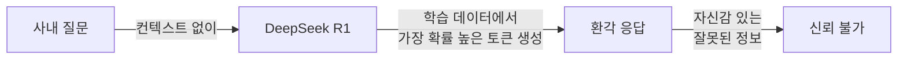
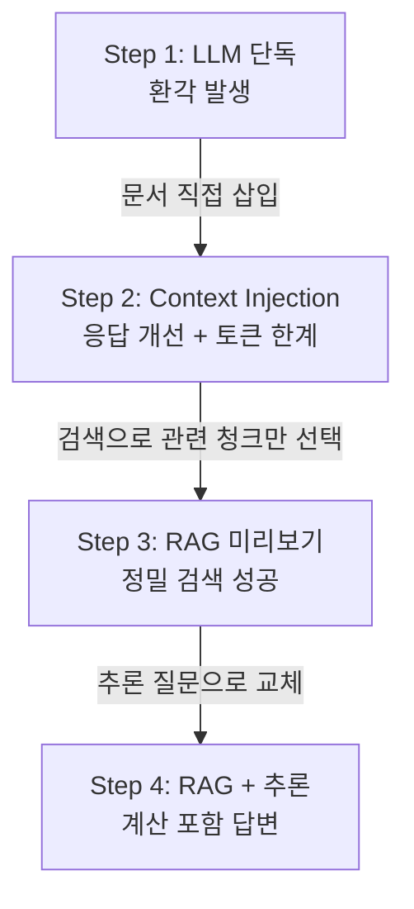

# 3. DeepSeek R1으로 체험하는 LLM의 한계와 RAG의 필요성

2장에서 Ollama, PostgreSQL, Python 가상환경을 완비했습니다. 이 장에서는 구축된 환경을 사용하여 LLM의 결정적인 약점을 직접 체험합니다.

"LLM이 이미 있는데 왜 RAG까지 필요한가?" 많은 개발자가 처음에 품는 질문입니다. 이 장은 그 질문에 코드로 답합니다. 환각(Hallucination)이 발생하는 순간을 직접 눈으로 확인하고, Context Injection으로 임시 해결을 시도한 뒤, 마지막으로 40줄의 RAG 코드가 그 한계를 어떻게 돌파하는지 4단계로 비교합니다.

<!-- [GEMINI PROMPT: 03_chapter-overview]
path: assets/CH03/03_chapter-overview.png
Minimalist flat-design infographic showing a 4-step comparison flow from left to right: Step 1 LLM Only (with red X for hallucination), Step 2 Context Injection (with yellow warning for token limit), Step 3 RAG Preview (with green check for success), Step 4 RAG + Reasoning (with blue star for advanced). Each step in a distinct box connected by arrows. White background, clean line art, Korean labels, 16:9.
Style: process-flow-flat
-->

*그림 3-1: 이 장에서 체험할 4단계 비교 흐름*

---

## 1. [실패] LLM 단독 질의의 한계

### 1.1 레포 클론 및 실행 준비

먼저 예제 레포를 클론하고 환경을 설정하십시오.

```bash
git clone https://github.com/your-org/CH03_LLM한계와RAG필요성.git
cd CH03_LLM한계와RAG필요성

cp .env.example .env
# .env 파일을 열어 OLLAMA_MODEL, OLLAMA_BASE_URL 값을 확인하십시오

pip install -r requirements.txt

# 임베딩 모델 다운로드 (3번, 4번 실험에서 필요)
ollama pull nomic-embed-text
```

> **참고: .env 기본값 확인**
> `.env.example`에는 `LLM_MODEL_NAME=deepseek-r1:1.5b`가 기본값으로 설정되어 있습니다. 사용 중인 모델명이 다르면 해당 값을 수정하십시오. `deepseek-r1:8b` 이상 모델은 추론 품질이 더 높지만 RAM을 더 많이 사용합니다.

### 1.2 실험 실행

첫 번째 실험을 실행하십시오.

```bash
python src/01_llm_only.py
```

`01_llm_only.py`는 가상의 회사 "테크컴퍼니"에 관한 세 가지 질문을 LLM에게 던집니다. 참고 문서 없이, LLM의 학습 데이터만으로 답변하도록 합니다.

```python
# src/01_llm_only.py 핵심 발췌

QUESTIONS: list[str] = [
    "우리 회사(테크컴퍼니)의 신입사원 연차 발생 규정이 어떻게 돼?",
    "2024년 4분기 마케팅팀 매출 목표는 얼마야?",
    "사내 보안 USB 정책이 어떻게 돼?",
]


def ask_llm(question: str) -> str:
    """
    ChatOllama DeepSeek R1을 단독 호출하여 응답을 반환합니다.

    Input  : 사내 정보를 묻는 질문 문자열
    Process: ChatOllama.invoke()로 컨텍스트 없이 질문을 전달
    Output : LLM 응답 문자열
    """
    # --- Process ---
    llm = ChatOllama(
        model=OLLAMA_MODEL,
        base_url=OLLAMA_BASE_URL,
        temperature=0,  # 재현 가능한 결과를 위해 고정
    )
    response = llm.invoke(question)

    # --- Output ---
    return response.content
```

#### 코드 워크플로우 (Code Workflow)

1. **입력(Input)**: `QUESTIONS` 상수에 정의된 사내 비공개 정보 질문 3개
2. **처리(Process)**: `ChatOllama.invoke(question)`으로 참고 문서 없이 질문을 그대로 LLM에 전달
3. **출력(Output)**: LLM 응답 문자열 및 환각 관찰 포인트 메시지를 터미널에 출력

실행하면 아래와 같은 응답이 출력됩니다.

> **[환각 응답 예시]**
> 질문: "우리 회사(테크컴퍼니)의 신입사원 연차 발생 규정이 어떻게 돼?"
>
> LLM 답변: "테크컴퍼니의 신입사원 연차 규정은 입사 1년 후 15일의 연차가 발생하며, 이후 매년 1일씩 추가됩니다. 첫 해에는 월 1일의 비율로 최대 11일까지 사용할 수 있습니다..."
>
> [환각 관찰 포인트]
> '테크컴퍼니'의 연차 규정은 사내 취업규칙에만 존재합니다.
> LLM이 일반적인 근로기준법 내용으로 대체하거나, 실제 규정과 다른 내용을 자신 있게 답변하면 환각입니다.

<!-- [CAPTURE NEEDED: 03_llm-only-output
  path: assets/CH03/03_llm-only-output.png
  desc: `python src/01_llm_only.py` 실행 후 터미널에 출력된 질문/답변/환각 관찰 포인트 전체
] -->

*그림 3-2: LLM 단독 질의 실행 결과 — 환각 응답 확인*

두 번째 질문("2024년 4분기 마케팅팀 매출 목표")에서 LLM은 구체적인 숫자를 제시할 가능성이 높습니다. 이 숫자는 완전한 허구입니다. 이 현상이 바로 **환각(Hallucination)** 입니다.

---

## 2. 왜 LLM은 환각을 일으키는가

방금 목격한 현상의 원인을 이해하십시오. 원인을 알아야 올바른 해결책을 선택할 수 있습니다.

### 2.1 학습 데이터 컷오프

LLM은 특정 시점까지 수집된 인터넷 데이터로 학습합니다. 이를 **학습 데이터 컷오프(Training Cutoff)** 라고 합니다. DeepSeek R1이 2023년 말까지의 데이터로 학습했다고 가정하면, 그 이후에 만들어진 사내 문서나 내부 규정은 학습 데이터에 포함되지 않습니다.

```
LLM의 지식 = 학습 데이터(인터넷 공개 데이터)
           ≠ 사내 비공개 문서
           ≠ 특정 시점 이후 데이터
```

### 2.2 확률적 언어 모델의 본질

더 근본적인 이유가 있습니다. LLM은 "다음에 올 가능성이 높은 토큰"을 예측하는 확률 모델입니다. "신입사원 연차 규정은..."이라는 프롬프트를 받으면, 학습 데이터에서 이 문맥 다음에 자주 등장한 단어들을 이어 붙입니다.

이 과정에서 LLM은 자신이 모른다는 사실을 인지하지 못합니다. 그저 확률적으로 가장 자연스러운 다음 단어를 생성할 뿐입니다. 그 결과 "틀렸지만 그럴듯한" 응답이 자신감 있게 출력됩니다.



*그림 3-3: LLM 단독 질의 흐름 — 컨텍스트 없이 확률적 토큰 생성*

> **참고: 환각은 버그가 아닌 설계 특성**
> 환각은 LLM의 결함이 아닙니다. 다음 토큰을 예측하도록 설계된 구조에서 자연스럽게 발생하는 현상입니다. 이 특성을 이해하고 RAG로 보완하는 것이 올바른 접근입니다.

---

## 3. [임시 해결] Context Injection 맛보기

환각을 일으키는 원인이 "참고 문서 부재"라면, 문서를 프롬프트에 직접 넣으면 어떨까요? 이 방법을 **컨텍스트 주입(Context Injection)** 이라고 합니다.

### 3.1 실험 실행

```bash
python src/02_context_injection.py
```

`02_context_injection.py`는 `data/sample_hr_policy.txt` 문서 전체를 프롬프트 앞에 붙여 동일한 세 가지 질문을 실행합니다.

```python
# src/02_context_injection.py 핵심 발췌

def build_prompt(question: str, context: str) -> str:
    """
    질문과 문서 전체를 하나의 프롬프트 문자열로 조합합니다.

    Input  : 사용자 질문, 참고 문서 내용 문자열
    Process: 시스템 역할 안내 + 참고 문서 + 질문을 하나의 문자열로 결합
    Output : LLM에 전달할 완성된 프롬프트 문자열
    """
    # --- Process ---
    prompt = f"""당신은 회사 내부 규정에 대해 답변하는 AI 비서입니다.
아래 [참고 문서]를 바탕으로 질문에 답변하십시오.
참고 문서에 없는 내용은 "해당 내용이 문서에 없습니다"라고 답변하십시오.
반드시 한국어로 답변하십시오.

[참고 문서]
{context}

[질문]
{question}

[답변]"""
    # --- Output ---
    return prompt


def count_tokens(text: str) -> int:
    """대략적인 토큰 수 추정 (len(text) // 4)."""
    return len(text) // 4


def ask_with_context(question: str, context: str) -> dict:
    """
    Input  : 사용자 질문 문자열, 참고 문서 내용 문자열
    Process: 프롬프트 조합 → 토큰 추정 → ChatOllama 호출
    Output : {"response": str, "token_estimate": int, "over_limit": bool}
    """
    # --- Input ---
    prompt = build_prompt(question, context)
    token_estimate = count_tokens(prompt)
    over_limit = token_estimate > TOKEN_WARNING_THRESHOLD  # 4000 초과 시

    if over_limit:
        print(f"  [토큰 경고] 추정 토큰 수: {token_estimate:,}개")
        print("             문서가 많아질수록 이 숫자는 선형으로 증가합니다.")

    # --- Process ---
    llm = ChatOllama(model=OLLAMA_MODEL, base_url=OLLAMA_BASE_URL, temperature=0)
    response = llm.invoke(prompt)

    # --- Output ---
    return {
        "response": response.content,
        "token_estimate": token_estimate,
        "over_limit": over_limit,
    }
```

#### 코드 워크플로우 (Code Workflow)

1. **입력(Input)**: `sample_hr_policy.txt` 전체 문서(약 1,500자 이상)와 질문 3개
2. **처리(Process)**: `build_prompt()`로 문서 + 질문을 단일 프롬프트로 조합 → `count_tokens()`로 토큰 추정 → `ChatOllama.invoke()`로 LLM 호출
3. **출력(Output)**: 응답 문자열, 토큰 추정치, 임계값(4,000) 초과 여부가 담긴 딕셔너리

### 3.2 응답 개선 확인과 한계 체감

응답이 눈에 띄게 개선됩니다. 연차 규정 질문에는 "테크컴퍼니" 사내 규정에 맞는 정확한 답변이 출력됩니다. 매출 목표 질문에는 "해당 내용이 문서에 없습니다"라는 올바른 거절도 확인할 수 있습니다.

그러나 터미널 출력에서 핵심 문제가 드러납니다.

```
[토큰 추정] 약 650개 (임계값 4,000개 이내)

한계 정리:
  1. 문서 1개에 이미 약 650개의 토큰을 사용합니다.
  2. 사내 문서가 수십 개라면 전체를 삽입하는 것은 불가능합니다.
  3. 문서가 많을수록 응답 속도가 선형으로 저하됩니다.
  4. LLM의 컨텍스트 한계를 초과하면 문서 내용이 잘립니다.
```

HR 정책 문서 하나만 넣어도 650개의 토큰을 소비합니다. 실제 사내 환경에는 수십, 수백 개의 문서가 있습니다. 이 모든 문서를 프롬프트에 붙이면 LLM의 컨텍스트 한도(보통 4,096~32,768 토큰)를 초과하거나, 처리 속도가 급격히 저하됩니다.

> **주의: Context Injection의 확장성 한계**
> Context Injection은 문서가 1~2개일 때는 동작하지만, 실제 사내 지식베이스처럼 수십 개의 문서가 있는 환경에서는 확장(Scale)이 불가능합니다. 질문마다 매번 모든 문서를 붙여 넣는 것은 비용과 속도 측면에서 현실적이지 않습니다.


*그림 3-4: Context Injection 흐름 — 응답은 개선되지만 토큰 소비가 선형으로 증가*

---

## 4. [성공] RAG 미리보기 + 청킹 비교

Context Injection의 핵심 문제는 "필요 없는 문서까지 전부 넣는다"는 점입니다. 해결책은 간단합니다. 질문과 관련된 부분만 정밀하게 찾아서 넣으면 됩니다. 이것이 **검색 증강 생성(RAG, Retrieval-Augmented Generation)** 입니다.

<!-- [GEMINI PROMPT: 03_rag-concept]
path: assets/CH03/03_rag-concept.png
Minimalist flat-design infographic illustrating the RAG concept. Flow: User question (left) → Vector DB search (middle, with document chunks visualized as small cards) → Only relevant chunks selected (highlighted) → Passed to LLM (right) → Accurate answer. Non-relevant chunks shown as grayed out. White background, clean line art, Korean labels, 16:9.
Style: concept-diagram-flat
-->

*그림 3-5: RAG 개념 — 관련 청크만 선별하여 LLM에 전달*

### 4.1 청킹이란 무엇인가

RAG가 "관련 부분만 찾으려면" 문서를 작은 조각으로 나누어야 합니다. 이 과정을 **청킹(Chunking)** 이라 합니다. 도서관에서 책 전체를 빌리는 것이 아니라, 관련 페이지만 복사하는 것과 같습니다.

3번 실험에서는 청킹이 없을 때와 있을 때의 검색 정밀도 차이를 동일한 문서로 나란히 비교합니다.

### 4.2 실험 실행

```bash
python src/03_rag_preview.py
```

> **참고: 처음 실행 시 임베딩 시간 소요**
> `nomic-embed-text` 모델이 처음 실행될 때 모델을 로드하는 시간이 필요합니다. 이후 실행부터는 빠르게 동작합니다.

### 4.3 Part A — 청킹 없이

```python
# src/03_rag_preview.py 핵심 발췌 — Part A

def build_vectorstore_no_chunk(doc: str) -> Chroma:
    """
    문서 전체를 단일 Document로 인메모리 ChromaDB에 저장합니다.

    Input  : 저장할 텍스트 문서 문자열
    Process: 단일 Document 생성 → OllamaEmbeddings → 인메모리 Chroma 생성
    Output : 인메모리 ChromaDB VectorStore 인스턴스
    """
    # --- Input ---
    documents = [
        Document(
            page_content=doc,
            metadata={"source": "hr_policy", "chunk_id": 0, "method": "no_chunk"},
        )
    ]
    # --- Process ---
    embeddings = OllamaEmbeddings(model=EMBED_MODEL, base_url=OLLAMA_BASE_URL)
    # persist_directory 없음 → 인메모리 전용 (재실행 시 소멸)
    vectorstore = Chroma.from_documents(documents=documents, embedding=embeddings)

    # --- Output ---
    return vectorstore
```

#### 코드 워크플로우 (Code Workflow)

1. **입력(Input)**: `LONG_DOC` — 3개 조항(연차·보안 USB·식대)이 포함된 HR 규정 전문(약 500자)
2. **처리(Process)**: 문서 전체를 단일 `Document` 객체로 만들어 `nomic-embed-text`로 임베딩 → 인메모리 `Chroma`에 저장
3. **출력(Output)**: 문서 1개가 저장된 인메모리 VectorStore

질문("신입사원 리프레시 데이 규정 알려줘")과의 유사도 검색 결과, 검색된 문서 수는 1개이며 그 내용은 연차 조항뿐만 아니라 보안 USB 조항, 식대 조항이 모두 포함됩니다.

### 4.4 Part B — 청킹 있을 때

```python
# src/03_rag_preview.py 핵심 발췌 — Part B

def chunk_text(text: str, chunk_size: int = 200, overlap: int = 20) -> list[str]:
    """
    텍스트를 chunk_size 단위로 분할합니다. overlap만큼 이전 청크와 겹칩니다.

    Input  : 분할할 텍스트 문자열, 청크 크기(자), 오버랩(자)
    Process: chunk_size 간격으로 시작점을 이동하며 슬라이싱
    Output : 청크 문자열 목록
    """
    # --- Process ---
    chunks: list[str] = []
    step = chunk_size - overlap  # 실제 이동 간격 = 청크 크기 - 오버랩
    start = 0

    while start < len(text):
        end = start + chunk_size
        chunk = text[start:end].strip()
        if chunk:
            chunks.append(chunk)
        start += step

    # --- Output ---
    return chunks
```

#### 코드 워크플로우 (Code Workflow)

1. **입력(Input)**: `LONG_DOC` 전문, `chunk_size=200`, `overlap=20`
2. **처리(Process)**: 200자 단위로 슬라이싱, 청크 간 20자 오버랩으로 문맥 단절 방지
3. **출력(Output)**: 여러 개의 청크 문자열 목록 (약 5~7개)

이 청크들이 각각 별도 `Document`로 임베딩되어 저장됩니다. 같은 질문으로 검색하면 "제1조(연차 및 리프레시 데이)" 관련 청크만 선별되어 반환됩니다.

### 4.5 LCEL RAG 체인 구성

두 실험 모두 동일한 LCEL(LangChain Expression Language) 파이프라인을 사용합니다.

```python
# src/03_rag_preview.py 핵심 발췌 — LCEL RAG 체인

def build_rag_chain(vectorstore: Chroma, k: int = 2) -> Any:
    """
    LCEL 기반 RAG 체인을 생성합니다.

    Input  : Chroma VectorStore 인스턴스, 검색할 문서 수 k
    Process: retriever 생성 → 프롬프트 정의 → LCEL | 체인 구성
    Output : 실행 가능한 LCEL Runnable 체인
    """
    # --- Input ---
    retriever = vectorstore.as_retriever(search_kwargs={"k": k})

    # --- Process ---
    prompt = ChatPromptTemplate.from_template(
        """당신은 회사 내부 규정에 대해 답변하는 AI 비서입니다.
아래 [참고 문서]를 바탕으로 질문에 답변하십시오.
참고 문서에 없는 내용은 "해당 내용이 문서에 없습니다"라고 답변하십시오.
반드시 한국어로 답변하십시오.

[참고 문서]
{context}

[질문]
{question}

[답변]"""
    )
    llm = ChatOllama(model=OLLAMA_MODEL, base_url=OLLAMA_BASE_URL, temperature=0)

    # LCEL 파이프라인: | 연산자로 검색기 → 프롬프트 → LLM → 파서를 연결
    rag_chain = (
        {
            "context": retriever | format_docs,
            "question": RunnablePassthrough(),
        }
        | prompt
        | llm
        | StrOutputParser()
    )

    # --- Output ---
    return rag_chain, retriever
```

#### 코드 워크플로우 (Code Workflow)

1. **입력(Input)**: `Chroma` VectorStore 인스턴스, 반환할 최대 문서 수 `k`
2. **처리(Process)**: `as_retriever()`로 검색기 생성 → LCEL `|` 연산자로 `{context + question}` → 프롬프트 → `ChatOllama` → `StrOutputParser` 파이프라인 구성
3. **출력(Output)**: `chain.invoke(query)` 호출로 최종 응답 문자열을 반환하는 Runnable 체인

> **팁: LCEL의 | 연산자**
> LCEL에서 `|` 연산자는 왼쪽 컴포넌트의 출력을 오른쪽 컴포넌트의 입력으로 연결합니다. `retriever | format_docs`는 "검색 결과를 format_docs 함수로 변환하라"는 의미입니다. 이 방식은 기존의 `RetrievalQA` 클래스보다 훨씬 직관적이고 유연합니다.

### 4.6 비교 결과 확인

실행 결과에서 두 파트의 차이를 확인하십시오.

```
══ Part A: 청킹 없이 ══════════════════════════════════════
   검색된 문서 수: 1개  (문서 전체 1개)
   검색 내용 미리보기: [테크컴퍼니 취업규칙 요약] 제1조 (신입사원 연차 및 리프레시 데이...

══ Part B: 청킹 있을 때 ═══════════════════════════════════
   검색된 문서 수: 2개  (관련 청크만 선택됨)
   [청크 0] [테크컴퍼니 취업규칙 요약] 제1조 (신입사원 연차 및 리프레시 데이 규정)...
   [청크 1] 제1조 ... 리프레시 데이는 해당 월에 미사용 시 다음 달로 이월되지 않는다...

── 비교 결과 ──────────────────────────────────────────────
  청킹 없음 (Part A): 검색 문서 1개, 문서 전체 내용 포함
                     → 질문과 무관한 내용(보안 정책, 식대 등)도 컨텍스트에 포함
  청킹 있음 (Part B): 검색 문서 2개, 관련 청크만 선택
                     → 제1조(연차·리프레시 데이) 관련 내용만 컨텍스트에 포함
```

<!-- [CAPTURE NEEDED: 03_rag-comparison
  path: assets/CH03/03_rag-comparison.png
  desc: `python src/03_rag_preview.py` 실행 후 Part A와 Part B 결과를 나란히 보여주는 터미널 전체 화면
] -->

*그림 3-6: RAG 미리보기 — 청킹 없음(Part A)과 청킹 있음(Part B) 비교 결과*

Part B에서 LLM이 받는 컨텍스트는 연차 관련 청크 2개뿐입니다. 보안 USB 정책이나 식대 내용은 컨텍스트에 포함되지 않으므로 LLM이 더 집중적이고 정확한 답변을 생성합니다.

> **참고: 이 장의 ChromaDB는 인메모리 전용**
> `build_vectorstore_no_chunk()`와 `build_vectorstore_with_chunk()`에서 `persist_directory` 파라미터를 지정하지 않으면 ChromaDB는 인메모리 모드로 동작합니다. 스크립트가 종료되면 저장된 데이터가 모두 소멸됩니다. 영속화(Persist)하여 재사용하는 방법은 6장(벡터 DB 구축)에서 자세히 다룹니다.

---

## 5. [심화] DeepSeek R1 추론 능력 확인

RAG는 단순히 문서를 찾아서 붙여 넣는 도구가 아닙니다. 검색된 문서를 바탕으로 LLM이 **추론(Reasoning)** 까지 수행할 수 있다는 점이 핵심입니다. 이 차이를 직접 확인하십시오.

### 5.1 실험 실행

```bash
python src/04_rag_reasoning.py
```

4번 실험은 3번과 동일한 LCEL 구조를 사용하되, 질문을 단순 정보 검색이 아닌 계산·추론이 필요한 형태로 교체합니다.

```python
# src/04_rag_reasoning.py 핵심 발췌

REASONING_QUESTION: str = (
    "입사 6개월차 신입인데 리프레시 데이 2번 썼어. "
    "몇 번 남았는지 규정 기반으로 계산해줘."
)
```

LLM이 이 질문에 답하려면 다음 단계가 필요합니다.

1. ChromaDB에서 "신입사원 리프레시 데이" 관련 규정 검색
2. 규정 확인: "매월 1회 유급 리프레시 데이를 사용할 수 있다"
3. 계산: 6개월 × 1회 = 총 6회 가능, 2회 사용 → 6 - 2 = 4회 남음
4. 답변 생성

### 5.2 추론에 특화된 프롬프트

```python
# src/04_rag_reasoning.py 핵심 발췌 — 추론 프롬프트

def build_rag_chain(vectorstore: Chroma, k: int = 2) -> tuple[Any, Any]:
    """
    추론·계산 질문에 특화된 LCEL 기반 RAG 체인을 생성합니다.

    Input  : Chroma VectorStore 인스턴스, 검색할 문서 수 k
    Process: retriever 생성 → 추론 프롬프트 정의 → LCEL | 체인 구성
    Output : (LCEL Runnable 체인, retriever) 튜플
    """
    # --- Process ---
    prompt = ChatPromptTemplate.from_template(
        """당신은 회사 내부 규정을 기반으로 계산과 추론을 수행하는 AI 비서입니다.
아래 [참고 문서]의 규정을 근거로 질문에 답변하십시오.

중요 지침:
  1. 계산이 필요한 경우 반드시 계산 과정을 단계별로 제시하십시오.
  2. 규정의 어느 조항을 근거로 답변하는지 명시하십시오.
  3. 참고 문서에 없는 내용은 "해당 내용이 문서에 없습니다"라고 답변하십시오.
  4. 반드시 한국어로 답변하십시오.

[참고 문서]
{context}

[질문]
{question}

[답변 — 규정 근거와 계산 과정을 포함하여]"""
    )
    # ...LCEL 체인 구성 (03_rag_preview.py와 동일)
```

#### 코드 워크플로우 (Code Workflow)

1. **입력(Input)**: 계산·추론이 필요한 질문 `REASONING_QUESTION`과 3개의 `HR_DOCS` 문서
2. **처리(Process)**: `build_vectorstore()`로 인사규정 청크를 임베딩 → LCEL 체인으로 "리프레시 데이" 관련 청크 검색 → 추론 프롬프트에 청크 삽입 → DeepSeek R1이 규정 기반으로 6 - 2 = 4를 계산하여 답변 생성
3. **출력(Output)**: 검색된 근거 문서 출처와 단계별 계산 과정이 포함된 최종 답변

### 5.3 실행 결과 및 DeepSeek R1의 추론 과정

실행 결과에서 핵심을 확인하십시오.

```
[검색 근거 문서] — 2개 청크가 LLM에 전달되었습니다.
-------------------------------------------------------------
  [1] 인사규정 제4조
      [인사규정] 신입사원 연차 및 리프레시 데이: 신입사원은 입사 후 3년간 법정 연...
  [2] 보안규정 제7조
      [보안규정] 보안 USB 사용 정책: 모든 임직원은 회사가 지급한 보안 인증 USB...
-------------------------------------------------------------

LLM 추론 답변:

인사규정 제4조에 따르면, 신입사원은 매월 1회 유급 리프레시 데이를 사용할 수 있습니다.

계산 과정:
1. 입사 6개월차 → 사용 가능한 총 리프레시 데이: 6개월 × 1회 = 6회
2. 이미 사용한 횟수: 2회
3. 남은 횟수: 6 - 2 = 4회

따라서 현재 리프레시 데이는 4번 남아 있습니다.
```

<!-- [CAPTURE NEEDED: 03_rag-reasoning-output
  path: assets/CH03/03_rag-reasoning-output.png
  desc: `python src/04_rag_reasoning.py` 실행 후 검색 근거 문서 + 단계별 계산 과정이 포함된 LLM 답변 전체
] -->

*그림 3-7: RAG + 추론 실행 결과 — 규정 근거와 계산 과정이 포함된 답변*

LLM이 단순히 규정을 검색해서 반환한 것이 아닙니다. 검색된 규정("매월 1회")을 바탕으로 6 × 1 - 2 = 4라는 계산을 직접 수행했습니다. 이것이 RAG와 LLM 추론 능력의 조합이 강력한 이유입니다.

> **팁: DeepSeek R1의 `<think>` 태그**
> DeepSeek R1의 일부 버전은 응답 전에 `<think>...</think>` 태그로 내부 추론 과정을 먼저 출력합니다. 이 내용은 최종 답변 전에 모델이 어떻게 생각하는지 보여주는 디버그 정보입니다. 7장(RAG Q&A 엔진)의 `LLMService`에서 이 태그를 자동으로 제거하는 처리를 구현합니다.

### 5.4 4단계 비교 정리

이 장에서 실행한 4개의 실험을 한눈에 비교하십시오.

| 실험 | 방법 | 결과 | 한계 |
|------|------|------|------|
| 1단계 `01_llm_only.py` | LLM 단독 질의 | 환각 응답 | 사내 정보 없음 |
| 2단계 `02_context_injection.py` | 문서 전체 삽입 | 응답 개선 | 토큰 한계, 확장 불가 |
| 3단계 `03_rag_preview.py` | 인메모리 RAG | 관련 청크만 검색 | 인메모리 전용 (영속화 없음) |
| 4단계 `04_rag_reasoning.py` | RAG + 추론 | 계산 포함 정확 답변 | 인메모리 전용 |



*그림 3-8: 4단계 비교 흐름 — 각 단계의 개선 포인트*

---

## 6. 정리하며

이 장에서는 4개의 실험을 통해 LLM의 한계와 RAG의 필요성을 직접 체감했습니다.

- **환각은 LLM의 구조적 특성이다**: 학습 데이터 컷오프와 확률적 토큰 예측 방식으로 인해, LLM은 사내 비공개 정보를 모르면서도 그럴듯한 응답을 자신감 있게 생성합니다. 이것이 환각이며, 운영 환경에서 LLM을 단독으로 사용하면 안 되는 이유입니다.

- **Context Injection은 임시 방편이다**: 문서를 프롬프트에 직접 삽입하면 응답은 개선되지만, 문서 수가 늘어날수록 토큰 소비가 선형으로 증가합니다. 실제 사내 지식베이스처럼 수십 개의 문서가 있는 환경에서는 확장이 불가능합니다.

- **RAG는 관련 청크만 정밀하게 선별한다**: 문서를 청크로 분할하고 임베딩 벡터로 저장한 뒤, 질문과 유사도가 높은 청크만 검색하여 LLM에 전달합니다. 이 방식은 토큰 소비를 최소화하면서 응답 정확도를 높입니다.

- **청킹은 RAG 검색 정밀도를 결정한다**: 청킹 없이 문서 전체를 저장하면 질문과 무관한 내용이 컨텍스트에 포함됩니다. 적절한 크기로 청킹하면 관련 내용만 선별되어 LLM이 더 집중적인 답변을 생성합니다.

- **RAG + LLM 추론의 조합이 핵심이다**: RAG는 단순 검색 도구가 아닙니다. 검색된 규정을 바탕으로 LLM이 계산·추론을 수행합니다. "6개월 × 1회 - 2회 = 4회"처럼, 문서에 명시되지 않은 결론도 도출할 수 있습니다.

---

다음 장에서는 이 장에서 사용한 인메모리 ChromaDB를 넘어, 사내 시스템(PostgreSQL DB + FastAPI CRUD API)을 `git clone`으로 확보합니다. RAG가 왜 필요한지 확인한 지금, 4장에서 실제 시스템 인프라를 갖추겠습니다.
