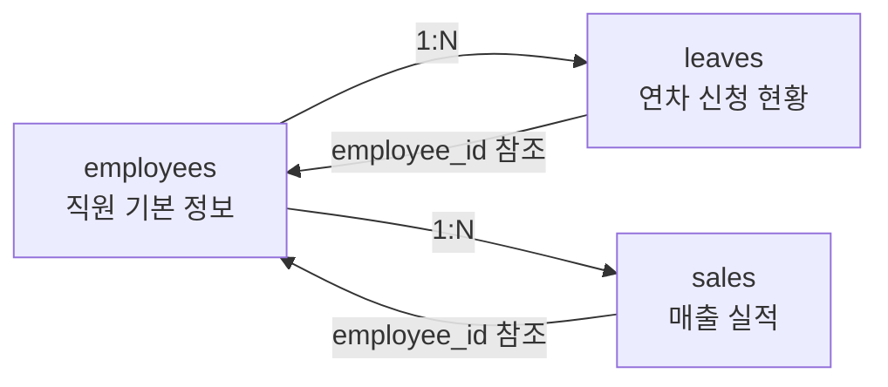
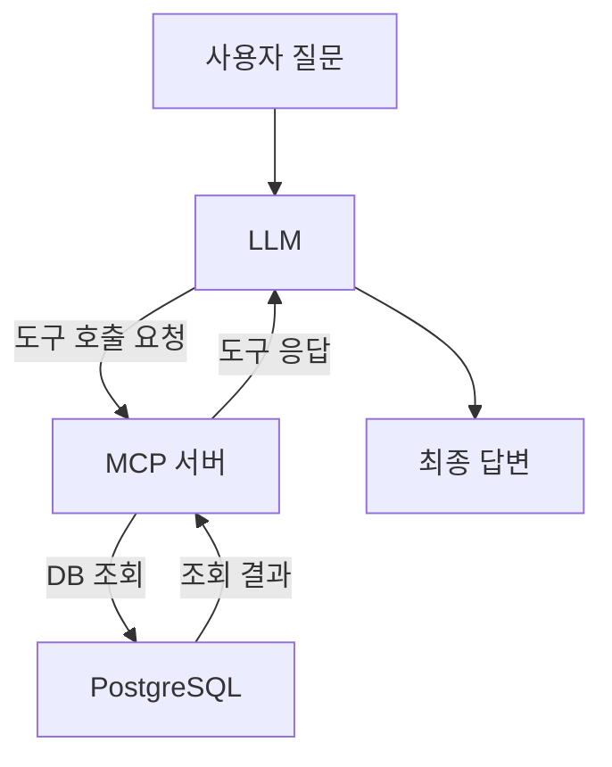
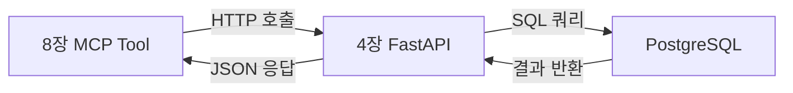

# 4. 베이스 시스템 확보

이 장에서는 RAG 파이프라인의 기반이 되는 사내 시스템 인프라를 확보합니다. PostgreSQL 데이터베이스와 FastAPI CRUD 서버를 단 하나의 명령으로 구동하고, 테이블 스키마와 API 엔드포인트 구조를 파악합니다. 또한 8장에서 본격적으로 구현할 **MCP(Model Context Protocol)** 의 개념을 미리 익혀 두겠습니다.

3장에서 LLM 단독으로는 사내 정형 데이터를 조회할 수 없다는 한계를 직접 체험했습니다. 이 장은 그 한계를 극복하기 위한 첫 번째 인프라 단계입니다. 직원 정보, 연차 현황, 매출 실적이 담긴 데이터베이스와 그것을 REST API로 노출하는 서버를 확보하고 나면, 이후 챕터에서 LLM이 이 데이터에 접근하는 방법을 단계적으로 구현할 수 있습니다.

---

## 4.1 사내 시스템 git clone으로 확보

### 왜 직접 구축하지 않는가

이 책의 핵심 주제는 RAG 파이프라인과 MCP 에이전트 구현입니다. PostgreSQL 스키마를 설계하고 FastAPI 서버를 처음부터 작성하는 데 시간을 할애하면 정작 중요한 주제에 집중하기 어렵습니다. 따라서 이 챕터는 **이미 완성된 인프라 레포를 clone하여 즉시 구동하는 방식** 을 택합니다.

인프라 코드를 미리 제공하는 데는 또 다른 이유도 있습니다. 실무에서 AI 기능을 추가할 때는 대부분 기존 시스템이 이미 운영 중입니다. "내가 직접 만들지 않은 API와 DB를 LLM과 연결하는 방법"을 익히는 것이 현실에 더 가깝습니다.

> **참고: 이 챕터의 인프라는 CH05~CH08까지 공통으로 사용됩니다.**
> CH04에서 구동한 PostgreSQL과 FastAPI 서버는 이후 챕터에서 계속 실행 상태를 유지해야 합니다. 챕터를 마칠 때 `docker-compose down`을 실행하지 마십시오.

### git clone 및 구동

아래 명령어를 순서대로 실행하십시오.

**1단계 — 레포 clone**

```bash
git clone https://github.com/rag-mcp-guide/rag-infra.git
cd rag-infra
```

> **참고: 로컬 예제 코드 사용**
> GitHub 레포 대신 이 책과 함께 제공된 예제 디렉토리를 사용하려면 `수동/examples/CH04_베이스시스템확보/` 폴더로 이동하십시오.

**2단계 — 환경 변수 설정**

```bash
cp .env.example .env
```

`.env.example` 파일에는 아래와 같은 기본값이 들어 있습니다.

```
POSTGRES_HOST=localhost
POSTGRES_PORT=5432
POSTGRES_DB=rag_db
POSTGRES_USER=rag_user
POSTGRES_PASSWORD=rag_password
```

기본값 그대로 사용해도 실습에 문제가 없습니다. 포트 충돌이 발생하는 경우에만 `POSTGRES_PORT` 값을 변경하십시오.

**3단계 — 전체 인프라 구동**

```bash
docker-compose up -d
```

#### 코드 워크플로우 (Code Workflow)

1. **입력(Input)**: `docker-compose.yml` 파일과 `.env` 환경 변수
2. **처리(Process)**: Docker가 `postgres:16-alpine` 이미지를 내려받고 컨테이너를 시작합니다. PostgreSQL 헬스체크가 통과되면 FastAPI 컨테이너 빌드를 시작합니다. `init/01_schema_and_data.sql` 파일이 최초 1회 자동으로 실행되어 테이블과 샘플 데이터가 생성됩니다.
3. **출력(Output)**: PostgreSQL 서버(포트 5432)와 FastAPI 서버(포트 8000)가 백그라운드에서 실행됩니다.

> **주의: 최초 실행은 2~5분이 소요됩니다.**
> Docker 이미지를 처음 내려받고 FastAPI 컨테이너를 빌드하는 데 시간이 걸립니다. 이미지가 캐시된 이후 실행은 30초 이내로 완료됩니다.

**4단계 — 컨테이너 상태 확인**

```bash
docker-compose ps
```

정상 구동 시 아래와 유사한 출력이 나타납니다.

```
NAME          IMAGE                COMMAND                  SERVICE    CREATED       STATUS                   PORTS
rag_fastapi   rag-infra-fastapi    "uvicorn app.main:ap…"   fastapi    2 minutes ago Up 2 minutes             0.0.0.0:8000->8000/tcp
rag_postgres  postgres:16-alpine   "docker-entrypoint.s…"   postgres   2 minutes ago Up 2 minutes (healthy)   0.0.0.0:5432->5432/tcp
```

`STATUS` 컬럼에서 `postgres`가 `healthy`, `fastapi`가 `Up` 상태인지 확인합니다. `starting` 상태라면 30초 더 기다린 후 다시 실행하십시오.

<!-- [CAPTURE NEEDED: 04_docker-compose-ps
  path: assets/CH04/04_docker-compose-ps.png
  desc: docker-compose ps 실행 후 터미널 전체 출력 (두 컨테이너 모두 Up/healthy 상태)
] -->

*그림 4-1: docker-compose ps 실행 결과 — 두 컨테이너가 정상 구동된 상태*

### docker-compose.yml 구조 이해

`docker-compose.yml`은 세 가지 서비스를 정의합니다.

```yaml
services:

  postgres:
    image: postgres:16-alpine
    container_name: rag_postgres
    environment:
      POSTGRES_DB:       ${POSTGRES_DB:-rag_db}
      POSTGRES_USER:     ${POSTGRES_USER:-rag_user}
      POSTGRES_PASSWORD: ${POSTGRES_PASSWORD:-rag_password}
    ports:
      - "${POSTGRES_PORT:-5432}:5432"
    volumes:
      - ./init:/docker-entrypoint-initdb.d:ro
      - postgres_data:/var/lib/postgresql/data
    healthcheck:
      test: ["CMD-SHELL", "pg_isready -U ${POSTGRES_USER:-rag_user}"]
      interval: 10s
      timeout: 5s
      retries: 5

  fastapi:
    build:
      context: .
      dockerfile: Dockerfile
    container_name: rag_fastapi
    depends_on:
      postgres:
        condition: service_healthy
    ports:
      - "8000:8000"
    volumes:
      - ./app:/app/app
```

#### 코드 워크플로우 (Code Workflow)

1. **입력(Input)**: `.env` 파일의 환경 변수 (DB 이름, 사용자, 비밀번호, 포트)
2. **처리(Process)**: `postgres` 서비스가 먼저 시작되고 헬스체크(`pg_isready`)를 통과할 때까지 대기합니다. `fastapi` 서비스는 `depends_on`의 `condition: service_healthy` 조건으로 PostgreSQL이 준비된 후에만 시작됩니다. `./init` 폴더는 읽기 전용(`ro`)으로 마운트되어 SQL 파일이 자동 실행됩니다.
3. **출력(Output)**: 두 컨테이너가 의존성 순서대로 안전하게 구동됩니다.

`depends_on`에 `condition: service_healthy`를 지정하는 이유는 PostgreSQL이 프로세스는 실행 중이지만 아직 연결을 받을 준비가 되지 않은 상태에서 FastAPI가 연결을 시도하는 경쟁 조건(race condition)을 막기 위해서입니다. 헬스체크를 통과한 후에만 FastAPI가 시작되도록 보장합니다.

---

## 4.2 데이터베이스 스키마 분석

이 시스템이 관리하는 데이터는 세 가지입니다: 직원 기본 정보, 연차 신청 현황, 매출 실적. 각 테이블의 구조와 관계를 파악해야 이후 장에서 MCP Tool을 설계할 때 정확한 질의를 구성할 수 있습니다.

### ER 다이어그램

세 테이블의 관계를 아래 다이어그램으로 먼저 확인하십시오.



*그림 4-2: 세 테이블의 관계 (employees 중심의 1:N 구조)*

`employees` 테이블이 중심입니다. `leaves`와 `sales` 모두 `employee_id` 외래키로 직원 정보를 참조합니다.

<!-- [GEMINI PROMPT: 04_er-diagram]
path: assets/CH04/04_er-diagram.png
Minimalist flat-design ER diagram showing three database tables: employees (id, name, department, position, hire_date), leaves (id, employee_id, type, start_date, end_date, status), sales (id, employee_id, amount, quarter, year). Foreign key relationships shown with lines connecting employee_id fields. White background, clean line art, Korean labels, 16:9.
Style: er-diagram-flat
-->

*그림 4-3: ER 다이어그램 — 컬럼 상세 포함*

### DDL 분석

`init/01_schema_and_data.sql` 파일에서 세 테이블의 DDL을 살펴봅니다.

**employees 테이블 — 직원 기본 정보**

```sql
CREATE TABLE IF NOT EXISTS employees (
    id                SERIAL PRIMARY KEY,
    name              VARCHAR(100) NOT NULL,
    department        VARCHAR(100),
    annual_leave_days INTEGER DEFAULT 15,
    used_leave_days   INTEGER DEFAULT 0
);
```

#### 코드 워크플로우 (Code Workflow)

1. **입력(Input)**: 직원 이름, 소속 부서
2. **처리(Process)**: `SERIAL` 타입으로 `id`가 자동 증가합니다. 잔여 연차는 `annual_leave_days - used_leave_days`로 계산합니다. 별도의 잔여 연차 컬럼을 두지 않고 계산으로 처리하므로 데이터 불일치가 발생하지 않습니다.
3. **출력(Output)**: 직원 1건 레코드

설계 포인트: 잔여 연차를 별도 컬럼으로 저장하지 않는 이유는 `annual_leave_days`나 `used_leave_days`가 변경될 때마다 세 컬럼을 동시에 업데이트해야 하는 번거로움과 불일치 위험을 없애기 위해서입니다.

**leaves 테이블 — 연차 신청 현황**

```sql
CREATE TABLE IF NOT EXISTS leaves (
    id          SERIAL PRIMARY KEY,
    employee_id INTEGER     REFERENCES employees(id),
    start_date  DATE,
    end_date    DATE,
    reason      TEXT,
    status      VARCHAR(20) DEFAULT 'pending'
);
```

#### 코드 워크플로우 (Code Workflow)

1. **입력(Input)**: 직원 ID, 연차 시작일, 종료일, 신청 사유
2. **처리(Process)**: `status` 컬럼은 세 가지 값을 가집니다 — `pending`(대기), `approved`(승인), `rejected`(반려). 신청 시 자동으로 `pending` 상태가 됩니다.
3. **출력(Output)**: 연차 신청 레코드 1건

**sales 테이블 — 매출 실적**

```sql
CREATE TABLE IF NOT EXISTS sales (
    id          SERIAL PRIMARY KEY,
    employee_id INTEGER        REFERENCES employees(id),
    department  VARCHAR(100),
    amount      DECIMAL(12, 2),
    sale_date   DATE,
    quarter     VARCHAR(10)
);
```

#### 코드 워크플로우 (Code Workflow)

1. **입력(Input)**: 직원 ID, 부서명, 매출 금액, 발생일
2. **처리(Process)**: `department` 컬럼이 `employees.department`와 중복됩니다. 이는 집계 쿼리 시 JOIN 없이 빠르게 `GROUP BY department`를 실행하기 위한 의도적인 비정규화입니다. `quarter` 컬럼은 `'2024-Q4'` 형식으로 분기별 집계를 용이하게 합니다.
3. **출력(Output)**: 매출 실적 레코드 1건

### 샘플 데이터 구성

실습에 사용하는 샘플 데이터는 현실감 있는 시나리오를 위해 아래와 같이 구성되어 있습니다.

| 구분 | 데이터 수 | 설명 |
|------|---------|------|
| 직원 | 5명 | 영업부 2명, 인사부 1명, 개발부 1명, 마케팅부 1명 |
| 연차 신청 | 10건 | 승인 7건, 대기 2건, 반려 1건 |
| 매출 기록 | 20건 | 2024-Q4, 2025-Q1, 2025-Q2 3개 분기 |

직원 5명의 잔여 연차는 다음과 같습니다.

| 직원 | 부서 | 연차 부여 | 연차 사용 | 잔여 |
|------|------|---------|---------|------|
| 김철수 | 영업부 | 15일 | 10일 | **5일** |
| 이영희 | 인사부 | 15일 | 8일 | 7일 |
| 박민준 | 개발부 | 15일 | 0일 | 15일 |
| 최수정 | 마케팅부 | 15일 | 5일 | 10일 |
| 정대현 | 영업부 | 15일 | 3일 | 12일 |

1장에서 등장했던 "김철수 씨의 남은 연차는 며칠인가요?"라는 질문의 답이 이 테이블에 있습니다. 이 데이터를 LLM이 조회할 수 있게 만드는 것이 8장 MCP 구현의 목표입니다.

---

## 4.3 CRUD API 구조 이해

### FastAPI 앱 구조

`app/main.py`는 FastAPI 애플리케이션의 진입점입니다.

```python
from fastapi import FastAPI
from app.routers import employees, leaves, sales

app = FastAPI(
    title="RAG 기반 AI 업무 비서 — 베이스 CRUD API",
    description=(
        "직원(employees), 연차(leaves), 매출(sales) 데이터를 "
        "조회·생성·수정하는 REST API를 제공합니다."
    ),
    version="1.0.0",
)

app.include_router(employees.router)
app.include_router(leaves.router)
app.include_router(sales.router)
```

#### 코드 워크플로우 (Code Workflow)

1. **입력(Input)**: 세 도메인 라우터 모듈 (`employees`, `leaves`, `sales`)
2. **처리(Process)**: `include_router()`로 각 라우터를 앱에 등록합니다. 각 라우터는 자체 `prefix`와 `tags`를 가지므로 Swagger UI에서 도메인별로 그룹화됩니다.
3. **출력(Output)**: 포트 8000에서 전체 엔드포인트가 활성화된 FastAPI 앱

전체 소스 코드는 GitHub 레포를 참고하십시오.

### 엔드포인트 목록

이 API가 제공하는 10개 엔드포인트는 다음과 같습니다.

| 메서드 | 경로 | 설명 |
|--------|------|------|
| GET | `/` | 서버 상태 확인 |
| GET | `/health` | 헬스체크 |
| GET | `/employees` | 직원 전체 조회 |
| GET | `/employees/{id}` | 직원 단건 조회 |
| GET | `/employees/{id}/leave-balance` | 직원 잔여 연차 조회 |
| GET | `/leaves` | 연차 전체 조회 |
| POST | `/leaves` | 연차 신청 |
| PUT | `/leaves/{id}/status` | 연차 승인/반려 |
| GET | `/sales` | 매출 전체 조회 |
| GET | `/sales/summary` | 부서별/분기별 매출 합계 |

이 중에서 `/employees/{id}/leave-balance`와 `/sales/summary` 두 엔드포인트는 8장에서 MCP Tool이 호출하는 핵심 API입니다. "김철수의 잔여 연차"와 "영업부 2025-Q1 매출 합계"를 조회하는 데 직접 사용됩니다.

### 핵심 엔드포인트 코드 분석

`/employees/{id}/leave-balance` 엔드포인트를 살펴봅니다.

```python
@router.get(
    "/{employee_id}/leave-balance",
    response_model=LeaveBalanceResponse,
    summary="직원 잔여 연차 조회",
)
def get_leave_balance(
    employee_id: int,
    db: Annotated[Session, Depends(get_db)],
) -> LeaveBalanceResponse:
    # --- Input ---
    # employee_id: URL 경로에서 추출된 직원 식별자

    # --- Process ---
    employee: Employee = _get_employee_or_404(employee_id, db)
    remaining_days: int = employee.annual_leave_days - employee.used_leave_days

    # --- Output ---
    return LeaveBalanceResponse(
        employee_id=employee.id,
        name=employee.name,
        annual_leave_days=employee.annual_leave_days,
        used_leave_days=employee.used_leave_days,
        remaining_days=remaining_days,
    )
```

#### 코드 워크플로우 (Code Workflow)

1. **입력(Input)**: URL 경로 파라미터 `employee_id` (정수)
2. **처리(Process)**: `_get_employee_or_404()` 헬퍼 함수로 직원을 조회하고, 없으면 HTTP 404를 반환합니다. 잔여 연차는 `annual_leave_days - used_leave_days`로 계산합니다.
3. **출력(Output)**: `LeaveBalanceResponse` Pydantic 스키마로 직렬화된 JSON

`/sales/summary` 엔드포인트도 확인합니다.

```python
@router.get("/summary", summary="부서별/분기별 매출 합계 조회")
def get_sales_summary(
    db: Annotated[Session, Depends(get_db)],
) -> dict:
    # --- Input ---
    # 파라미터 없음 — 전체 매출 집계 조회

    # --- Process ---
    rows = (
        db.query(
            Sale.department,
            Sale.quarter,
            func.sum(Sale.amount).label("total_amount"),
        )
        .group_by(Sale.department, Sale.quarter)
        .order_by(Sale.department, Sale.quarter)
        .all()
    )

    summary: list[dict] = [
        {
            "department": row.department,
            "quarter": row.quarter,
            "total_amount": float(row.total_amount),
        }
        for row in rows
    ]

    # --- Output ---
    return {"결과": summary}
```

#### 코드 워크플로우 (Code Workflow)

1. **입력(Input)**: 없음 (전체 매출 데이터 집계)
2. **처리(Process)**: SQLAlchemy `func.sum()`으로 `department`와 `quarter` 기준 GROUP BY 집계를 수행합니다. `Decimal` 타입은 JSON 직렬화를 위해 `float`으로 변환합니다.
3. **출력(Output)**: `{"결과": [...]}` 형식의 딕셔너리 — 부서별 분기별 매출 합계 목록

전체 소스 코드는 GitHub 레포를 참고하십시오.

### Swagger UI에서 API 테스트

브라우저에서 아래 주소로 접속하면 Swagger UI를 통해 모든 엔드포인트를 직접 테스트할 수 있습니다.

```
http://localhost:8000/docs
```

<!-- [CAPTURE NEEDED: 04_swagger-ui
  path: assets/CH04/04_swagger-ui.png
  desc: 브라우저에서 localhost:8000/docs 를 열었을 때의 Swagger UI 전체 화면 (세 도메인 그룹이 모두 표시된 상태)
] -->

*그림 4-4: Swagger UI — 세 도메인(employees, leaves, sales)의 엔드포인트 목록*

### curl / PowerShell로 API 동작 확인

터미널에서 직접 API를 호출하여 샘플 데이터가 정상적으로 반환되는지 확인합니다.

**macOS / Linux**

```bash
# 직원 전체 조회
curl http://localhost:8000/employees

# 김철수(id=1)의 잔여 연차 조회
curl http://localhost:8000/employees/1/leave-balance

# 부서별 분기별 매출 합계
curl http://localhost:8000/sales/summary
```

**Windows (PowerShell)**

```powershell
# 직원 전체 조회
Invoke-RestMethod -Uri "http://localhost:8000/employees"

# 김철수(id=1)의 잔여 연차 조회
Invoke-RestMethod -Uri "http://localhost:8000/employees/1/leave-balance"

# 부서별 분기별 매출 합계
Invoke-RestMethod -Uri "http://localhost:8000/sales/summary"
```

`GET /employees/1/leave-balance` 호출의 예상 응답입니다.

```json
{
  "employee_id": 1,
  "name": "김철수",
  "annual_leave_days": 15,
  "used_leave_days": 10,
  "remaining_days": 5
}
```

`GET /sales/summary` 호출의 예상 응답입니다.

```json
{
  "결과": [
    {"department": "개발부", "quarter": "2025-Q2", "total_amount": 7700000.0},
    {"department": "마케팅부", "quarter": "2024-Q4", "total_amount": 24600000.0},
    {"department": "마케팅부", "quarter": "2025-Q1", "total_amount": 25300000.0},
    {"department": "영업부", "quarter": "2024-Q4", "total_amount": 15800000.0},
    {"department": "영업부", "quarter": "2025-Q1", "total_amount": 14000000.0},
    {"department": "영업부", "quarter": "2025-Q2", "total_amount": 5600000.0},
    {"department": "인사부", "quarter": "2025-Q2", "total_amount": 2700000.0}
  ]
}
```

<!-- [CAPTURE NEEDED: 04_curl-leave-balance
  path: assets/CH04/04_curl-leave-balance.png
  desc: curl http://localhost:8000/employees/1/leave-balance 실행 후 터미널 출력 (JSON 응답 전체)
] -->

*그림 4-5: 잔여 연차 조회 API 응답 결과*

> **팁: ORM 계층의 역할**
> `database.py` → `models.py` → `schemas.py`의 3단 계층 구조에 주목하십시오. `database.py`가 SQLAlchemy 엔진과 세션을 관리하고, `models.py`가 테이블과 1:1 대응하는 ORM 클래스를 정의하며, `schemas.py`의 Pydantic 모델이 API 요청/응답을 직렬화합니다. 이 구조 덕분에 SQL 쿼리를 직접 작성하지 않고도 Python 객체로 DB를 조작할 수 있습니다.

### 자주 발생하는 오류 대응

| 오류 메시지 | 원인 | 해결 방법 |
|-----------|------|---------|
| `connection refused` | 컨테이너가 아직 시작 중 | `docker-compose ps` 확인 후 30초 대기 |
| `Address already in use` | 5432 또는 8000 포트 충돌 | `.env`에서 `POSTGRES_PORT` 변경, 기존 프로세스 종료 |
| `fastapi` 컨테이너만 Exited | DB 연결 실패 | `docker-compose logs fastapi`로 오류 확인 |
| 데이터 초기화 필요 | 테이블/데이터 오염 | `docker-compose down -v && docker-compose up -d` 실행 |

> **경고: docker-compose down -v는 모든 데이터를 삭제합니다.**
> `-v` 옵션을 사용하면 PostgreSQL 볼륨이 삭제되어 이후 챕터에서 저장한 데이터도 모두 사라집니다. 데이터를 초기 상태로 되돌려야 하는 명확한 이유가 없다면 `-v` 없이 `docker-compose down`만 사용하십시오.

---

## 4.4 MCP 개념 소개

인프라가 준비되었습니다. 이 절에서는 이 인프라가 8장에서 어떤 방식으로 LLM에 연결되는지 개념을 미리 살펴봅니다.

### LLM은 왜 DB를 직접 조회하지 못하는가

LLM은 텍스트 입력을 받아 텍스트를 출력하는 모델입니다. PostgreSQL에 직접 연결하거나 SQL 쿼리를 실행하는 기능이 없습니다. LLM이 "김철수의 잔여 연차"를 알려면 누군가가 DB를 조회하여 결과를 LLM에게 전달해야 합니다.

3장에서 Context Injection을 통해 문서 내용을 프롬프트에 직접 넣어 응답을 개선했던 것을 기억하십시오. 정형 데이터도 같은 방식으로 처리할 수 있습니다. 그런데 "누군가"가 데이터를 가져오는 역할을 코드로 어떻게 구현하고, LLM이 그 코드를 언제 어떻게 호출하도록 만들 것인가의 문제가 남습니다. 이 문제를 해결하는 표준 방법이 **MCP(Model Context Protocol)** 입니다.

### MCP의 정의

**MCP(Model Context Protocol)** 는 LLM이 외부 도구(데이터베이스, API, 파일 시스템 등)를 표준화된 프로토콜로 호출하기 위해 Anthropic이 제안한 오픈 프로토콜입니다. MCP를 사용하면 LLM은 어떤 외부 시스템이든 동일한 방식으로 호출할 수 있습니다.

간단하게 비유하면, MCP는 LLM과 외부 시스템 사이의 "표준 플러그와 소켓"입니다. 전자 기기가 콘센트 규격에만 맞으면 어느 나라 제품이든 연결할 수 있듯이, MCP 규격에 맞춰 만든 도구는 어느 LLM에서든 호출할 수 있습니다.



*그림 4-6: MCP를 통한 LLM-DB 연결 흐름*

### LangChain Tool과 MCP의 차이

MCP를 이해하기 위해 기존 방식인 **LangChain Tool** 과 비교해 보겠습니다.

| 항목 | LangChain Tool | MCP |
|------|--------------|-----|
| 구현 방식 | Python 함수로 직접 구현 | 표준 프로토콜로 서버 구현 |
| 종속성 | LangChain에 종속 | 언어·프레임워크 독립 |
| 배포 | 동일 프로세스 내 실행 | 별도 서버 프로세스 |
| 재사용성 | 해당 Python 코드에서만 사용 | 다른 AI 클라이언트에서도 사용 가능 |
| 사용 시점 | 빠른 프로토타입 | 운영 수준 표준화 |

LangChain Tool은 Python 함수를 `@tool` 데코레이터로 감싸는 방식이므로 빠르게 구현할 수 있지만 LangChain에 종속됩니다. MCP는 JSON-RPC 기반 프로토콜로 서버를 구현하므로 Claude, GPT, LangChain 등 어느 클라이언트에서도 동일하게 호출할 수 있습니다.

<!-- [GEMINI PROMPT: 04_mcp-vs-tool]
path: assets/CH04/04_mcp-vs-tool.png
Minimalist flat-design comparison diagram. Left: LangChain Tool — Python function directly calls database, tight coupling shown with thick arrow. Right: MCP approach — LLM communicates via standardized protocol to MCP Server subprocess, which then accesses database, loose coupling shown with thin protocol arrows. White background, clean line art, Korean labels, 16:9.
Style: comparison-diagram-flat
-->

*그림 4-7: LangChain Tool vs MCP — 아키텍처 비교*

### 이 인프라가 MCP에서 하는 역할

8장에서 구현할 MCP 서버는 이 장에서 확보한 FastAPI 엔드포인트를 호출합니다. MCP Tool의 `get_leave_balance` 도구는 `GET /employees/{id}/leave-balance`를 호출하고, `get_sales_summary` 도구는 `GET /sales/summary`를 호출합니다.

따라서 이 장에서 API 엔드포인트의 요청/응답 구조를 정확히 파악해 두는 것이 중요합니다. MCP Tool을 설계할 때 입력 파라미터와 출력 형식이 API 명세와 일치해야 합니다.



*그림 4-8: 4장 인프라와 8장 MCP Tool의 연결 구조*

> **참고: 이 책에서 MCP 서버는 FastMCP로 구현합니다.**
> 8장에서 `fastmcp` 라이브러리를 사용하여 `@mcp.tool()` 데코레이터 방식으로 MCP 서버를 구현합니다. 지금은 "LLM이 외부 API를 표준 방식으로 호출하는 메커니즘"이라는 개념적 이해로 충분합니다.

---

## 4.5 정리하며

이 장에서는 RAG + MCP 시스템의 기반이 되는 인프라를 확보했습니다.

- **Docker Compose 한 명령으로 인프라 구동**: `docker-compose up -d` 한 번으로 PostgreSQL 16과 FastAPI 서버가 동시에 구동됩니다. `depends_on`의 `condition: service_healthy`로 DB가 준비된 후에만 API 서버가 시작되도록 의존성 순서를 제어합니다.

- **세 테이블의 스키마와 관계 파악**: `employees` 테이블이 중심이며, `leaves`와 `sales`가 `employee_id` 외래키로 참조하는 1:N 구조입니다. 잔여 연차를 계산 컬럼이 아닌 API 레이어에서 처리하는 설계 의도를 이해했습니다.

- **10개 CRUD 엔드포인트 확인**: Swagger UI(`localhost:8000/docs`)와 curl로 전체 엔드포인트를 직접 테스트했습니다. `/employees/{id}/leave-balance`와 `/sales/summary`가 8장 MCP Tool의 주요 호출 대상임을 파악했습니다.

- **MCP 개념 기초 이해**: MCP는 LLM이 외부 도구를 표준 프로토콜로 호출하는 방식입니다. LangChain Tool이 Python 코드에 종속되는 것과 달리 MCP는 언어·프레임워크에 독립적으로 재사용 가능합니다.

다음 장에서는 RAG 파이프라인의 입력이 되는 사내 문서를 표준화합니다. RAG의 검색 품질은 문서 전처리 수준에 크게 좌우됩니다. "쓰레기가 들어가면 쓰레기가 나온다(GIGO)"는 원칙에 따라 수집 전략, 정규화 규칙, 메타데이터 스키마를 체계적으로 설계합니다.
