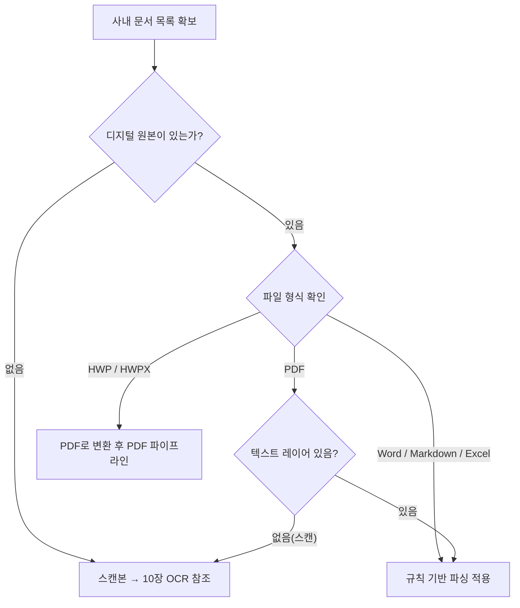

# 5. 사내 문서 표준화

4장에서 PostgreSQL과 FastAPI로 구성된 사내 인프라를 확보했습니다. 이제 RAG 시스템에 입력할 문서를 준비해야 합니다. 이 장에서는 **문서 표준화** 파이프라인을 학습합니다. 수집 전략부터 전처리 규칙, 네이밍 표준, 메타데이터 스키마 설계까지 RAG 검색 품질을 결정하는 기준을 수립합니다.

<!-- [GEMINI PROMPT: 05_chapter_overview]
path: assets/CH05/05_chapter_overview.png
Minimalist flat-design infographic showing document standardization pipeline. Left: various document types (PDF, Word, HWP icons). Middle: standardization pipeline stages (collection, preprocessing, naming, metadata). Right: clean refined documents ready for vector DB input. Arrow flow left to right. White background, clean line art, Korean labels, 16:9.
Style: pipeline-flow-flat
-->

*그림 5-1: 문서 표준화 파이프라인 전체 개요*

---

## 1. RAG 검색 품질을 결정하는 문서 기준

### 1.1 GIGO 원칙

RAG 시스템의 성능은 **LLM 모델 선택보다 입력 문서의 품질에 더 크게 좌우**됩니다. 컴퓨터 과학에서 오래전부터 전해 내려오는 원칙이 있습니다.

> **GIGO(Garbage In, Garbage Out)** — 쓰레기가 들어가면 쓰레기가 나온다.

LLM이 아무리 뛰어나도 엉망인 문서를 넣으면 엉망인 답변이 나옵니다. 반대로 잘 정제된 문서를 입력하면 작은 모델도 정확한 답변을 생성합니다.

아래 두 가지 예시를 비교해 보십시오.

**문서 A (표준화 전)**
```
사내 인사 규정 | 대외비 | 2024.01

제10조 (연차 유급휴가  부여 기준)

①  1년간  80% 이상  출근한 직원에게는   15일의
   유급휴가를  부여한다.

- 1 -

사내 인사 규정 | 대외비 | 2024.01
```

**문서 B (표준화 후)**
```markdown
## 제10조 (연차 유급휴가 부여 기준)

① 1년간 80% 이상 출근한 직원에게는 15일의 유급휴가를 부여한다.
```

문서 A에는 헤더(`사내 인사 규정 | 대외비 | 2024.01`)가 반복되고, 페이지 번호(`- 1 -`)가 섞여 있으며, 과도한 공백이 텍스트를 분열시킵니다. 이 상태로 벡터 DB에 저장하면 검색 엔진은 핵심 정보보다 헤더와 페이지 번호를 더 많이 학습하게 됩니다.

### 1.2 문서 표준화를 별도 챕터로 다루는 이유

6장(벡터 DB 구축)에서 바로 코드 구현으로 들어가면 다음 질문에 답하지 못합니다.

- "어떤 문서를 넣어야 하는가?"
- "PDF와 Word 중 어느 쪽이 더 정확하게 추출되는가?"
- "파일명은 어떤 규칙으로 지어야 나중에 메타데이터로 활용할 수 있는가?"

이 질문에 답하지 못한 채 코드를 작성하면 나중에 검색 결과가 엉망이 되었을 때 원인을 찾기 어렵습니다. 5장은 6장의 전처리 파이프라인이 올바르게 동작하기 위한 **기준을 사전에 확립**하는 챕터입니다.


*그림 5-2: 문서 표준화 흐름 — 5장에서 기준을 수립하고 6장에서 코드로 구현한다*

---

## 2. PDF, Word, Markdown, HWP 수집 전략

### 2.1 문서 유형별 수집 우선순위 매트릭스

사내에 흩어진 문서는 형식이 제각각입니다. 어떤 형식을 어떤 방법으로 수집해야 효율적인지 아래 매트릭스로 정리합니다. 이 기준은 `guides/collection_strategy.md`에 전체 내용이 담겨 있습니다.

| 유형 | 우선순위 | 수집 방법 | 전처리 난이도 | 권장 라이브러리 |
|------|---------|---------|------------|--------------|
| PDF (텍스트 레이어 있음) | 높음 | PyMuPDF | 낮음 | `pymupdf` |
| Word (.docx) | 높음 | python-docx | 낮음 | `python-docx` |
| Markdown | 높음 | 직접 읽기 | 없음 | 표준 라이브러리 |
| HWP / HWPX | 중간 | PDF 변환 후 PDF 파이프라인 위임 | 낮음 (변환 후) | `subprocess` + LibreOffice |
| 스캔 PDF (이미지) | 낮음 | OCR (10장 참조) | 높음 | `easyocr`, `llava` |
| Excel | 중간 | openpyxl | 중간 | `openpyxl`, `pandas` |

**판단 기준**: 동일한 업무 가치가 있는 문서라면, 전처리 난이도가 낮은 유형부터 수집하십시오. 스캔 PDF는 OCR 오류율이 높으므로, 같은 내용의 디지털 원본이 있다면 원본을 우선 사용하십시오.

### 2.2 규칙 기반 파싱 vs AI 기반 파싱

문서 추출 방법은 크게 두 가지로 나뉩니다.

**규칙 기반 파싱(Rule-based Parsing)** 은 `pdfplumber`, `python-docx` 같은 라이브러리가 텍스트 구조를 좌표·스타일 기반으로 추출하는 방식입니다. 빠르고 저렴하며 재현 가능합니다. 디지털 원본 PDF와 Word 문서 대부분이 여기에 해당합니다.

**AI 기반 파싱(Vision LLM)** 은 PDF 페이지를 이미지로 변환하여 멀티모달 LLM이 시각적으로 이해하고 텍스트를 생성하는 방식입니다. 복잡한 다단 레이아웃, 표가 뒤섞인 도해, 스캔 PDF처럼 규칙 기반이 실패하는 케이스에서 사용합니다.

> **팁: AI 기반 파싱은 최후 수단으로 사용하십시오**
> Vision LLM은 규칙 기반보다 처리 시간이 10배 이상 느리고 GPU 리소스를 대량 소비합니다. 먼저 규칙 기반으로 시도하고, 추출 결과가 깨진 경우에만 Vision LLM으로 전환하는 전략이 효율적입니다. 6장에서 이 판단 로직(`is_complex_layout()`)을 직접 구현합니다.

### 2.3 HWP 처리 전략

국내 공공기관과 기업에서 HWP(한컴 한글) 형식이 광범위하게 사용됩니다. HWP 처리 방법은 세 가지가 있습니다.

| 방법 | 도구 | 장점 | 단점 |
|------|------|------|------|
| A. pyhwp | `pip install pyhwp` | 설치 간단 | HWP 5.x만 지원, 표·이미지 추출 불가 |
| B. LibreOffice → DOCX | `libreoffice --convert-to docx` | HWPX 포함, 표 추출 가능 | 복잡한 레이아웃에서 표가 깨짐 |
| C. PDF로 변환 후 PDF 파이프라인 위임 | `libreoffice --convert-to pdf` | 레이아웃 보존, 이후 처리 통일 | LibreOffice 설치 필요 |

이 책에서는 **방법 C** 를 사용합니다. HWP를 PDF로 변환하면 이후 처리는 일반 PDF와 완전히 동일하기 때문입니다. 어떤 도구(한컴오피스, LibreOffice, 클라우드 변환기)로 PDF를 만들든 상관없습니다.

```
HWP 파일
    ↓  LibreOffice (또는 한컴오피스에서 직접 PDF 저장)
PDF 파일  →  CH06 extractor.py (pdfplumber / Vision LLM)  →  Markdown
```

다음은 LibreOffice를 사용하여 HWP 파일을 자동으로 PDF로 변환하는 핵심 코드입니다. 전체 코드는 `guides/collection_strategy.md`를 참고하십시오.

```python
import subprocess
from pathlib import Path

def hwp_to_pdf(hwp_path: str, output_dir: str = ".") -> str:
    """
    LibreOffice headless로 HWP/HWPX를 PDF로 변환합니다.
    사전 조건: brew install libreoffice 또는 apt install libreoffice

    Args:
        hwp_path  : .hwp 또는 .hwpx 파일 경로
        output_dir: PDF 저장 디렉토리

    Returns:
        생성된 PDF 파일 경로 (이후 CH06 파이프라인에 그대로 전달)
    """
    # --- Input ---
    result = subprocess.run(
        ["libreoffice", "--headless", "--convert-to", "pdf",
         "--outdir", output_dir, hwp_path],
        capture_output=True, text=True,
    )

    # --- Process ---
    if result.returncode != 0:
        raise RuntimeError(f"LibreOffice 변환 실패: {result.stderr}")

    # --- Output ---
    pdf_path = str(Path(output_dir) / f"{Path(hwp_path).stem}.pdf")
    return pdf_path
```

#### 코드 워크플로우 (Code Workflow)

1. **입력(Input)**: HWP 또는 HWPX 파일 경로와 PDF 저장 디렉토리
2. **처리(Process)**: LibreOffice headless 모드로 HWP를 PDF로 변환하고, 변환 실패 시 RuntimeError 발생
3. **출력(Output)**: 변환된 PDF 파일 경로 — 이 경로를 6장 `extractor.py`에 그대로 전달하십시오

### 2.4 수집 우선순위 결정 흐름



*그림 5-3: 문서 유형별 수집 방법 결정 흐름도*

> **주의: 스캔 PDF 우선순위를 높이지 마십시오**
> 스캔 PDF는 OCR 오류율이 높아 전처리 부담이 큽니다. 같은 내용의 디지털 원본(Word, 텍스트 레이어 PDF)이 존재한다면 반드시 디지털 원본을 먼저 수집하십시오. 스캔본은 원본이 없을 때만 사용하십시오.

---

## 3. 문서 전처리 및 정규화 가이드라인

### 3.1 전처리 규칙 표

수집된 문서를 그대로 벡터 DB에 넣으면 헤더·푸터·과도한 공백이 검색 품질을 떨어뜨립니다. 아래 규칙 표를 기준으로 모든 문서에 동일한 전처리를 적용하십시오. 이 규칙의 전체 내용은 `guides/preprocessing_rules.md`에 정의되어 있습니다.

| 항목 | 처리 방법 | 예시 |
|------|---------|------|
| 헤더/푸터 제거 | 정규식으로 페이지 번호, 문서명 반복 패턴 제거 | `"- 3 -"` → 삭제 |
| 인코딩 통일 | UTF-8 강제 변환 | EUC-KR → UTF-8 |
| 과도한 공백 | 2개 이상 연속 공백 → 단일 공백 | `"연차  규정"` → `"연차 규정"` |
| 중복 개행 | 3개 이상 연속 개행 → 최대 2개 | `"\n\n\n\n"` → `"\n\n"` |
| 표/이미지 | 표: 셀 내용 유지 / 이미지: 10장 OCR 참조 | `"항목 | 값"` 형식 유지 |
| 선행/후행 공백 | 각 줄의 시작·끝 공백 제거 | `"  제1조  "` → `"제1조"` |
| 특수문자 정규화 | 전각 문자 → 반각, 불필요한 특수문자 제거 | `"∙"` → `"-"` |

### 3.2 전처리 전/후 비교

1절에서 잠깐 보여준 비교를 더 상세히 살펴보겠습니다. `data/sample_raw/hr_policy_raw.txt`와 `data/sample_clean/HR_취업규칙_v1.0.md`를 나란히 비교하면 전처리 효과를 직접 확인할 수 있습니다.

**전처리 전 (sample_raw/hr_policy_raw.txt)**

```text
사내 인사 규정 | 대외비 | 2024.01


제1조 (목적)

본 규정은  주식회사 테크노바  (이하 "회사")의  임직원 인사 관리에 관한 기준을
정함으로써  조직의 효율적 운영과  구성원의 권익 보호를  목적으로 한다.


- 1 -


제2장 연차 유급휴가


제10조 (연차 유급휴가 부여 기준)

①  1년간 80% 이상 출근한 직원에게는  15일의 유급휴가를  부여한다.
```

**전처리 후 (sample_clean/HR_취업규칙_v1.0.md)**

```markdown
## 제1조 (목적)

본 규정은 주식회사 테크노바(이하 "회사")의 임직원 인사 관리에 관한 기준을
정함으로써 조직의 효율적 운영과 구성원의 권익 보호를 목적으로 한다.

---

## 제2장 연차 유급휴가

### 제10조 (연차 유급휴가 부여 기준)

① 1년간 80% 이상 출근한 직원에게는 15일의 유급휴가를 부여한다.
```

전처리를 거치면 아래 세 가지가 달라집니다.

1. **헤더/푸터 제거**: `사내 인사 규정 | 대외비 | 2024.01`과 `- 1 -` 같은 반복 패턴이 제거됩니다.
2. **공백 정규화**: 조문 사이에 흩어진 과도한 공백이 단일 공백으로 정리됩니다.
3. **Markdown 변환**: `제2장`, `제10조`가 `##`, `###` 헤더로 변환되어 청킹 기준점이 됩니다.

터미널에서 아래 명령어를 실행하면 원본과 정제본의 차이를 직접 확인할 수 있습니다.

```bash
diff data/sample_raw/hr_policy_raw.txt "data/sample_clean/HR_취업규칙_v1.0.md"
```

`-`로 시작하는 줄은 원본에서 제거된 내용(헤더·푸터·과도한 공백)이고, `+`로 시작하는 줄은 정제본에 추가된 내용(Markdown 헤더 기호)입니다.

### 3.3 최종 출력을 Markdown으로 통일하는 이유

전처리의 최종 출력 형식을 **Markdown** 으로 통일하는 이유는 세 가지입니다.

첫째, **토큰 효율**: HTML과 비교하면 Markdown은 태그가 훨씬 적습니다. `<h2>제목</h2>` 대신 `## 제목`으로 충분하기 때문에 LLM에게 전달되는 토큰 수가 줄어듭니다.

둘째, **LLM 이해도**: LLM은 GitHub, Stack Overflow 등의 인터넷 데이터로 학습되었습니다. `#` 헤더, `|` 표, `- ` 목록 기호를 네이티브로 이해합니다. HTML보다 훨씬 자연스럽게 구조를 파악합니다.

셋째, **청킹 기준점**: 6장에서 문서를 청크로 분할할 때 `#` 헤더를 기준점으로 사용합니다. `## 제2장 연차 유급휴가`와 `## 제3장 정보 보안 규정`은 의미적으로 완전히 다른 내용이므로 헤더를 경계로 분리하면 청크 품질이 높아집니다.

> **참고: 전처리 파이프라인 적용 순서**
> 전처리 함수를 적용할 때는 순서가 중요합니다. `preprocessing_rules.md`에 명시된 권장 순서는 ① 특수문자 정규화 → ② 헤더/푸터 제거 → ③ 공백 정규화입니다. 공백 정규화를 먼저 하면 헤더/푸터 패턴을 인식하기 어려울 수 있으므로 반드시 마지막에 수행하십시오.

---

## 4. 사내 문서 네이밍 표준 규칙

### 4.1 네이밍 포맷 정의

파일명 규칙이 없으면 RAG 시스템이 문서를 구분할 수 없습니다. `2025년본.pdf`, `최종수정(진짜최종).xlsx` 같은 파일이 그대로 들어가면 메타데이터가 꼬여 검색 품질이 크게 저하됩니다. 이 책에서 사용하는 네이밍 표준(Naming Convention)은 다음과 같습니다.

```
{부서}_{문서명}_{버전}.확장자
```

| 구성 요소 | 형식 | 예시 |
|----------|------|------|
| 부서 | 영문 약어 대문자 | `HR`, `FIN`, `SEC`, `OPS`, `DEV` |
| 문서명 | 한글 또는 영문, 공백 없이 | `취업규칙`, `예산기안서`, `보안규정` |
| 버전 | `v{major}.{minor}` | `v1.0`, `v2.1`, `v3.0` |
| 확장자 | 원본 형식 그대로 | `.pdf`, `.docx`, `.xlsx`, `.md` |

### 4.2 잘못된 사례 vs 올바른 사례

| 잘못된 사례 | 올바른 사례 | 개선 이유 |
|------------|------------|---------|
| `2025년본.pdf` | `HR_취업규칙_v1.0.pdf` | 부서·문서명·버전 모두 불명확 |
| `최종수정(진짜최종).xlsx` | `FIN_부서별예산기안서_v3.2.xlsx` | 특수문자, 버전 추적 불가 |
| `보안규정.docx` | `SEC_보안규정_v1.0.docx` | 부서 정보 없음 |
| `신규서비스런칭전략.pdf` | `OPS_신규서비스런칭전략_v1.0.pdf` | 부서 정보 없음 |
| `HR규정(수정중).pdf` | `HR_취업규칙_v2.0.pdf` | 괄호·한글 상태 표시 금지 |
| `연차규정final.pdf` | `HR_연차규정_v1.1.pdf` | `final` 대신 버전 번호 사용 |

### 4.3 부서별 폴더 구조

파일명뿐 아니라 폴더도 부서별로 분리합니다. 폴더명 자체가 메타데이터입니다.

```
data/docs/
├── hr/               ← HR 부서 문서
│   ├── HR_취업규칙_v1.0.pdf
│   └── HR_연차규정_v2.1.pdf
├── finance/          ← Finance 부서 문서
│   ├── FIN_부서별예산기안서_v3.2.xlsx
│   └── FIN_2024상반기매출현황_v1.0.pdf
├── ops/              ← Operations 부서 문서
│   └── OPS_신규서비스런칭전략_v1.0.pdf
└── security/         ← Security 부서 문서
    └── SEC_보안규정_v1.0.docx
```

### 4.4 네이밍 규칙이 메타데이터로 연결되는 원리

네이밍 규칙을 따르면 코드 한 줄로 메타데이터를 자동 추출할 수 있습니다. 6장에서 이 함수가 `extractor.py`에 그대로 이식됩니다.

```python
from pathlib import Path

def parse_filename_metadata(filename: str) -> dict:
    """
    네이밍 규칙 {부서}_{문서명}_{버전}.확장자에서 메타데이터를 자동 추출합니다.

    Args:
        filename: 파일명 (경로 포함 가능)

    Returns:
        {"department": str, "doc_name": str, "version": str, "source": str}

    Example:
        >>> parse_filename_metadata("HR_취업규칙_v1.0.pdf")
        {"department": "HR", "doc_name": "취업규칙", "version": "v1.0", ...}
    """
    # --- Input ---
    stem = Path(filename).stem        # HR_취업규칙_v1.0

    # --- Process ---
    parts = stem.split("_", 2)        # ["HR", "취업규칙", "v1.0"]

    # --- Output ---
    return {
        "department": parts[0] if len(parts) > 0 else "UNKNOWN",
        "doc_name":   parts[1] if len(parts) > 1 else stem,
        "version":    parts[2] if len(parts) > 2 else "v1.0",
        "source":     Path(filename).name,
    }
```

#### 코드 워크플로우 (Code Workflow)

1. **입력(Input)**: 파일명 문자열 (예: `"HR_취업규칙_v1.0.pdf"`)
2. **처리(Process)**: 파일명에서 확장자를 제거하고 언더스코어(`_`)를 최대 2회 분리하여 부서·문서명·버전 추출
3. **출력(Output)**: `{"department": "HR", "doc_name": "취업규칙", "version": "v1.0", "source": "HR_취업규칙_v1.0.pdf"}` 형태의 딕셔너리

실행 결과를 확인하면 네이밍 규칙이 얼마나 강력한지 알 수 있습니다.

```
HR_취업규칙_v1.0.pdf          → {'department': 'HR', 'doc_name': '취업규칙', 'version': 'v1.0'}
FIN_부서별예산기안서_v3.2.xlsx → {'department': 'FIN', 'doc_name': '부서별예산기안서', 'version': 'v3.2'}
SEC_보안규정_v1.0.docx         → {'department': 'SEC', 'doc_name': '보안규정', 'version': 'v1.0'}
```

파일명 하나로 `department`, `doc_name`, `version` 세 가지 메타데이터가 자동으로 추출됩니다. 사람이 수동으로 입력할 필요가 없습니다.

<!-- [GEMINI PROMPT: 05_naming_to_metadata]
path: assets/CH05/05_naming_to_metadata.png
Minimalist flat-design infographic showing filename parsing flow. Top: filename "HR_취업규칙_v1.0.pdf" in a box. Middle: underscore-based split operation with arrows pointing down. Bottom: three metadata fields — department: "HR", doc_name: "취업규칙", version: "v1.0" — each in a separate labeled box. White background, clean line art, Korean labels, 16:9.
Style: data-mapping-flat
-->

*그림 5-4: 네이밍 규칙 → 메타데이터 자동 파싱 흐름*

---

## 5. 메타데이터 스키마 설계

### 5.1 메타데이터가 필요한 이유

**메타데이터(Metadata)** 는 문서 자체가 아닌, 문서에 대한 정보입니다. 작성자, 날짜, 부서, 버전 같은 정보가 이에 해당합니다.

메타데이터 없이 RAG를 구현하면 다음 상황이 발생합니다.

- "HR 부서 문서에서만 검색해 주세요" — 필터링 불가
- "2024년 이후 작성된 문서만 검색해 주세요" — 날짜 필터링 불가
- "이 답변이 어느 문서에서 왔나요?" — 출처 표시 불가 (7장에서 필수)

메타데이터를 설계해 두면 ChromaDB에서 부서별·날짜별 필터 검색이 가능하고, 7장에서 답변과 함께 출처를 표시하는 기능을 구현할 수 있습니다.

### 5.2 메타데이터 스키마 정의

아래 스키마는 `data/metadata_schema.json`에 JSON Schema 형식으로 정의되어 있습니다.

```json
{
  "$schema": "http://json-schema.org/draft-07/schema#",
  "title": "사내 문서 메타데이터 스키마",
  "type": "object",
  "required": ["doc_id", "source_file", "department", "created_date", "version", "doc_type"],
  "properties": {
    "doc_id": {
      "type": "string",
      "description": "문서 고유 ID (UUID 형식)",
      "example": "doc-2024-hr-001"
    },
    "source_file": {
      "type": "string",
      "description": "원본 파일명 (경로 포함)",
      "example": "hr/HR_연차규정_v2.1.pdf"
    },
    "department": {
      "type": "string",
      "enum": ["HR", "기획", "마케팅", "개발", "재무", "전사"],
      "description": "문서 소유 부서"
    },
    "created_date": {
      "type": "string",
      "format": "date",
      "description": "문서 작성일 (YYYY-MM-DD)",
      "example": "2024-01-15"
    },
    "version": {
      "type": "string",
      "description": "문서 버전",
      "example": "v2.1"
    },
    "doc_type": {
      "type": "string",
      "enum": ["규정", "가이드", "보고서", "공지", "매뉴얼"],
      "description": "문서 유형"
    },
    "tags": {
      "type": "array",
      "items": {"type": "string"},
      "description": "검색 태그 (선택)",
      "example": ["연차", "휴가", "인사"]
    },
    "page_count": {
      "type": "integer",
      "description": "총 페이지 수"
    }
  }
}
```

#### 코드 워크플로우 (Code Workflow)

1. **입력(Input)**: 각 문서에 대한 정보 (파일명, 부서, 날짜 등)
2. **처리(Process)**: JSON Schema가 정의한 `required` 필드를 검증하고, `enum` 값으로 부서·문서 유형의 일관성을 강제
3. **출력(Output)**: 유효성이 검증된 메타데이터 딕셔너리 — 6장 `store.py`의 `add_documents()`에 직접 전달

### 5.3 필드별 역할과 ChromaDB 연결

각 필드가 RAG 파이프라인에서 어떤 역할을 하는지 이해하면 스키마를 더 잘 활용할 수 있습니다.

| 필드 | 역할 | 6~7장 활용 |
|------|------|---------|
| `doc_id` | 문서 식별자, 중복 저장 방지 | ChromaDB의 `ids` 파라미터에 사용 |
| `source_file` | 원본 파일 경로 | 7장 출처 표시에 사용 |
| `department` | 부서 분류 | ChromaDB `where={"department": "HR"}` 필터 |
| `created_date` | 작성 시점 | 날짜 범위 필터 (최신 문서 우선) |
| `version` | 버전 관리 | 구버전 문서 필터링 |
| `doc_type` | 문서 유형 | 규정·가이드·보고서 별도 검색 |
| `tags` | 자유 태그 | 키워드 기반 보조 검색 |

### 5.4 네이밍 규칙 → 메타데이터 자동 파싱 연결

4절의 `parse_filename_metadata()`가 추출한 값이 이 스키마 필드와 어떻게 연결되는지 확인하십시오.

```python
# 파일명에서 메타데이터 자동 추출
meta = parse_filename_metadata("HR_취업규칙_v1.0.pdf")
# → {"department": "HR", "doc_name": "취업규칙", "version": "v1.0"}

# 스키마 필드와 매핑
document_metadata = {
    "doc_id":       "doc-2024-hr-001",       # 별도 생성 (UUID)
    "source_file":  meta["source"],           # "HR_취업규칙_v1.0.pdf"
    "department":   meta["department"],       # "HR" ← 파일명 자동 추출
    "version":      meta["version"],          # "v1.0" ← 파일명 자동 추출
    "created_date": "2024-01-15",            # 별도 입력 필요
    "doc_type":     "규정",                  # 별도 입력 필요
}
```

파일명 네이밍 규칙이 잘 잡혀 있으면 `department`와 `version`은 자동으로 채워집니다. 나머지 필드(`created_date`, `doc_type`)만 사람이 입력하면 됩니다.

6장에서 이 메타데이터가 ChromaDB에 저장되는 방식을 직접 확인할 수 있습니다.

```python
# CH06 store.py에서 사용 예시
collection.add(
    documents=[chunk_text],
    metadatas=[{
        "doc_id":      "doc-2024-hr-001",
        "source_file": "hr/HR_취업규칙_v1.0.pdf",
        "department":  "HR",
        "page_count":  5
    }],
    ids=[chunk_id]
)
```

> **팁: `department` 필드를 enum으로 제한하는 이유**
> `department` 필드에 `"hr"`, `"HR"`, `"인사팀"` 처럼 같은 의미의 값이 여러 형태로 입력되면 필터 검색이 정확하게 동작하지 않습니다. JSON Schema의 `enum`으로 허용 값을 미리 고정해 두면 입력 단계에서 오류를 방지할 수 있습니다.

---

## 6. 정리하며

이 장에서는 RAG 시스템의 품질을 결정하는 **문서 표준화 파이프라인** 전체를 설계했습니다. 핵심 내용을 정리합니다.

- **GIGO 원칙**: 문서 품질이 RAG 검색 정확도를 좌우합니다. LLM 모델을 교체하기 전에 입력 문서를 먼저 점검하십시오.
- **수집 우선순위**: 디지털 원본(텍스트 레이어 PDF, Word, Markdown)을 우선 수집하고, 스캔 PDF는 최후 수단으로 남겨 두십시오. HWP는 PDF로 변환 후 동일한 PDF 파이프라인을 사용하십시오.
- **전처리 순서**: 특수문자 정규화 → 헤더/푸터 제거 → 공백 정규화 순서를 반드시 준수하십시오. 최종 출력은 Markdown으로 통일하면 LLM 이해도와 청킹 품질이 동시에 향상됩니다.
- **네이밍 표준**: `{부서}_{문서명}_{버전}.확장자` 포맷을 강제하면 파일명 파싱만으로 부서·버전 메타데이터가 자동 추출됩니다. `final`, `수정중`, 괄호 표기는 절대 사용하지 마십시오.
- **메타데이터 스키마**: `doc_id`, `source_file`, `department`, `version`, `created_date`, `doc_type` 6개 필수 필드를 설계했습니다. 이 스키마는 6장 ChromaDB 저장과 7장 출처 표시에 그대로 사용됩니다.

### 표준화 완료 체크리스트

6장으로 넘어가기 전에 아래 7가지 항목을 확인하십시오.

- [ ] 수집 대상 문서 목록이 확정되고 부서별 협조가 완료되었는가
- [ ] 모든 문서가 디지털 원본(텍스트 레이어 PDF, Word, Markdown) 또는 PDF 변환본으로 준비되었는가
- [ ] 파일명이 `{부서}_{문서명}_{버전}.확장자` 형식으로 변경되었는가
- [ ] 부서별 폴더(`hr/`, `finance/`, `ops/`, `security/`)가 생성되고 파일이 분류되었는가
- [ ] 전처리(헤더/푸터 제거, 공백 정규화, 인코딩 통일)가 완료되었는가
- [ ] 전처리 출력이 Markdown 형식으로 저장되었는가
- [ ] `metadata_schema.json`의 6개 필수 필드(`doc_id`, `source_file`, `department`, `created_date`, `version`, `doc_type`)가 각 문서에 매핑되었는가

### 다음 챕터 예고

표준화된 문서가 준비되었습니다. 6장에서는 이 문서들을 벡터 DB에 저장하는 전체 파이프라인을 구현합니다. `extractor.py`로 PDF에서 텍스트를 추출하고, `chunker.py`로 청크로 분할하며, `nomic-embed-text` 임베딩 모델로 벡터를 생성하고, `ChromaDB PersistentClient`로 영속 저장합니다. 5장에서 설계한 `parse_filename_metadata()`가 6장 코드에 그대로 이식되는 것을 확인할 수 있습니다.
