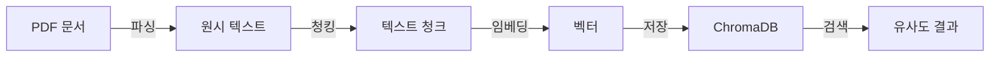
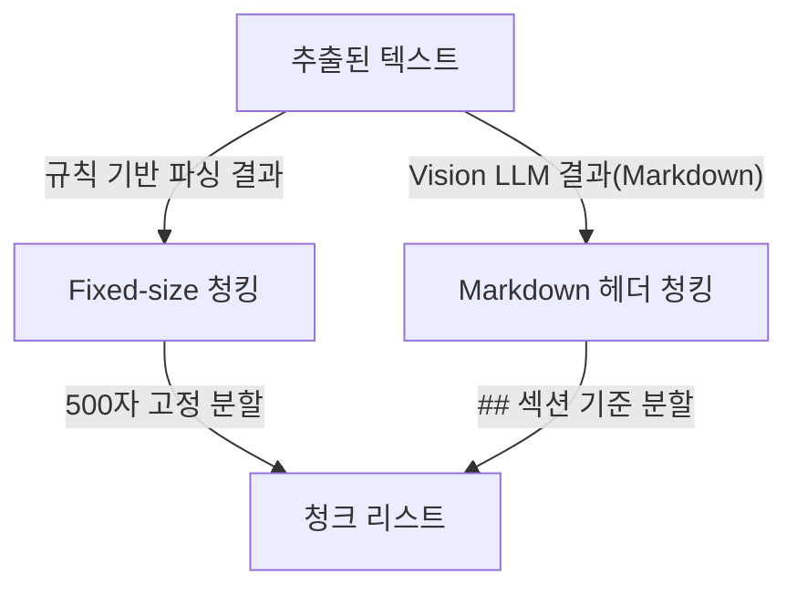

# 6. 벡터 DB 구축

이 장에서는 PDF 문서에서 출발하여 **ChromaDB** 에 벡터를 저장하기까지의 전체 파이프라인을 구축합니다.
5장에서 표준화한 사내 문서를 실제로 처리하여, AI가 의미 기반으로 검색할 수 있는 지식 저장소를 완성합니다.

<!-- [GEMINI PROMPT: 06_pipeline_overview]
path: assets/CH06/06_pipeline_overview.png
Minimalist flat-design infographic showing a 5-stage pipeline from left to right: PDF document → Parsing (text extraction) → Chunking (text splitting) → Embedding (vector conversion) → ChromaDB (vector storage). Each stage in a rounded box with an icon, connected by arrows. Stage numbers 1-5 above each box. White background, clean line art, Korean labels, 16:9.
Style: pipeline-flow-flat
-->

*그림 6-1: CH06 전체 파이프라인 개요*

---

## 1. [실습 준비] 데이터 파일 확인

### 1.1 레포지토리 Clone

먼저 이 챕터의 예제 코드를 내려받겠습니다.

```bash
git clone https://github.com/your-org/CH06_vector-db.git
cd CH06_vector-db
```

> **참고: 레포 주소**
> 실제 GitHub 주소는 이 책의 공식 페이지(README)에서 확인하십시오.

패키지를 설치하고 환경 변수를 설정합니다.

```bash
pip install -r requirements.txt
cp .env.example .env
```

`.env` 파일을 열어 필요한 항목을 확인합니다.

```bash
# LLM Provider 설정 (ollama 또는 openai)
LLM_PROVIDER=ollama

# Vision LLM 모델명 (--vision 플래그 사용 시)
LLM_MODEL_NAME=llava:7b

# Ollama 설정
OLLAMA_BASE_URL=http://localhost:11434

# 임베딩 모델
EMBED_MODEL=nomic-embed-text

# ChromaDB 설정
CHROMA_PERSIST_DIR=./outputs/chroma_db
COLLECTION_NAME=rag_docs
```

이 챕터는 외부 클라우드 API 키가 필요하지 않습니다. 로컬 Ollama 서버만 실행 중이면 됩니다. Ollama 임베딩 모델을 미리 준비하십시오.

```bash
ollama pull nomic-embed-text    # 임베딩 모델 (필수)
ollama pull llava:7b            # Vision LLM (--vision 플래그 사용 시만 필요)
```

### 1.2 데이터 파일 구조 확인

`data/docs/` 폴더에는 5장의 네이밍 규칙을 준수하는 사내 문서 샘플이 들어 있습니다.

```
data/
└── docs/
    ├── hr/
    │   ├── HR_취업규칙_v1.0.pdf         ← 규칙 기반 파싱 실습
    │   └── HR_정보보안서약서.pdf          ← 부서 필터 검색 실습
    └── ops/
        └── OPS_신규서비스_런칭전략.pdf   ← Vision LLM 실습 (복합 레이아웃)
```

파일명이 `{부서}_{문서명}_{버전}.pdf` 형식을 따르고 있음을 확인할 수 있습니다. 이 규칙 덕분에 코드가 파일명만으로 부서(`HR`, `OPS`)와 버전(`v1.0`)을 자동으로 추출합니다. 5장에서 수립한 표준화 기준이 6장 코드에 직접 연결되는 첫 번째 순간입니다.

### 1.3 파이프라인 전체 흐름 미리보기

PDF에서 ChromaDB까지는 다음 5단계로 진행됩니다.



*그림 6-2: PDF → ChromaDB 5단계 파이프라인*

각 단계는 독립된 모듈로 구현되어 있습니다. 전체를 관통하는 진입점은 `src/main.py`의 `run_pipeline()` 함수이며, `--vision` 플래그 하나로 규칙 기반 모드와 Vision LLM 모드를 전환할 수 있습니다.

---

## 2. [규칙 기반] PDF 파싱

### 2.1 pdfplumber를 선택하는 이유

PDF 파싱 라이브러리는 크게 두 가지입니다. **pdfplumber** 와 PyMuPDF(fitz)입니다.

| 항목 | pdfplumber | PyMuPDF |
|------|-----------|---------|
| 표 감지 | O (extract_tables() 내장) | X |
| 속도 | 보통 | 빠름 |
| 사용 목적 | 표 포함 PDF (취업규칙, 계약서) | 순수 텍스트 위주 PDF |

사내 문서에는 연차 규정표, 예산 집계표처럼 표 구조가 많습니다. pdfplumber는 표를 감지하여 셀 내용을 Markdown 표 형식으로 보존하므로, RAG 검색 시 표 데이터가 온전히 검색됩니다.

### 2.2 extractor.py — 핵심 함수 발췌

전체 코드는 GitHub 레포의 `src/extractor.py`를 참고하십시오. 아래에서는 핵심 함수 3개를 발췌하여 설명합니다.

**함수 1: extract_text_pdfplumber()**

```python
def extract_text_pdfplumber(pdf_path: str) -> list[dict]:
    """pdfplumber로 PDF 페이지별 텍스트를 추출합니다."""

    # --- Input ---
    source_name = Path(pdf_path).name
    pages: list[dict] = []

    # --- Process ---
    with pdfplumber.open(pdf_path) as pdf:
        for page_num, page in enumerate(pdf.pages):
            has_table = False
            text_parts: list[str] = []

            # 표 감지: 페이지에서 표 영역을 찾습니다
            tables = page.extract_tables()
            if tables:
                has_table = True
                plain_text = page.extract_text()
                if plain_text and plain_text.strip():
                    text_parts.append(plain_text.strip())

                # 각 표를 Markdown 형식으로 변환
                for table in tables:
                    md_table = _table_to_markdown(table)
                    if md_table:
                        text_parts.append(md_table)
            else:
                plain_text = page.extract_text()
                if plain_text and plain_text.strip():
                    text_parts.append(plain_text.strip())

            combined_text = "\n\n".join(text_parts).strip()
            if combined_text:
                pages.append({
                    "page": page_num + 1,
                    "text": combined_text,
                    "source": source_name,
                    "has_table": has_table,
                })

    # --- Output ---
    return pages
```

#### 코드 워크플로우 (Code Workflow)

1. **입력(Input)**: PDF 파일 경로 문자열
2. **처리(Process)**: pdfplumber로 페이지를 순회하면서 표 감지(`extract_tables()`) → 표는 Markdown 표로 변환, 일반 텍스트는 그대로 추출
3. **출력(Output)**: 페이지별 딕셔너리 리스트 `[{"page": int, "text": str, "source": str, "has_table": bool}]`

표가 있는 페이지는 `has_table=True`로 표시됩니다. 이 플래그는 나중에 청킹 전략 선택에 활용됩니다.

---

**함수 2: parse_filename_metadata()**

5장에서 수립한 네이밍 규칙(`{부서}_{문서명}_{버전}.pdf`)이 드디어 코드로 연결됩니다.

```python
def parse_filename_metadata(pdf_path: str) -> dict:
    """파일명에서 메타데이터를 자동 추출합니다.

    예: HR_취업규칙_v1.0.pdf
        → {"department": "HR", "doc_name": "취업규칙", "version": "v1.0"}
    """
    # --- Input ---
    stem = Path(pdf_path).stem  # 확장자 제외 파일명

    # --- Process ---
    parts = stem.split("_")

    if len(parts) >= 3:
        department = parts[0]
        version_candidate = parts[-1]
        if re.match(r"^v\d+(\.\d+)*$", version_candidate):
            version = version_candidate
            doc_name = "_".join(parts[1:-1])
        else:
            version = "unknown"
            doc_name = "_".join(parts[1:])
    elif len(parts) == 2:
        department, doc_name = parts[0], parts[1]
        version = "unknown"
    else:
        department = doc_name = version = "unknown"

    # --- Output ---
    return {
        "department": department,
        "doc_name": doc_name,
        "version": version,
        "source": Path(pdf_path).name,
    }
```

#### 코드 워크플로우 (Code Workflow)

1. **입력(Input)**: PDF 파일 경로 (또는 파일명)
2. **처리(Process)**: 파일명을 `_` 기준으로 분리 → 첫 세그먼트는 부서, 마지막 세그먼트가 `v숫자.숫자` 패턴이면 버전, 중간이 문서명
3. **출력(Output)**: `{"department": "HR", "doc_name": "취업규칙", "version": "v1.0", "source": "HR_취업규칙_v1.0.pdf"}`

이 함수를 통해 파일명을 사람이 직접 태그하지 않아도, 코드가 부서와 버전을 자동으로 인식합니다. ChromaDB에 이 메타데이터를 함께 저장하면 "HR 부서 문서 중에서만 검색"처럼 필터 검색이 가능합니다.

---

**함수 3: is_complex_layout()**

pdfplumber가 텍스트를 제대로 추출하지 못하는 상황을 감지합니다.

```python
def is_complex_layout(pages: list[dict], threshold: float = 0.3) -> bool:
    """규칙 기반 파싱 품질을 판단합니다.

    A4 기준 기대 글자 수(1,500자) 대비 실제 추출량이
    threshold 미만이면 Vision LLM 사용을 권장합니다.
    """
    # --- Process ---
    expected_chars_per_page = 1500
    total_chars = sum(len(p["text"]) for p in pages)
    avg_chars_per_page = total_chars / len(pages)
    ratio = avg_chars_per_page / expected_chars_per_page

    # --- Output ---
    return ratio < threshold   # True → Vision LLM 권장
```

#### 코드 워크플로우 (Code Workflow)

1. **입력(Input)**: 페이지 딕셔너리 리스트, 판단 임계값(기본 0.3)
2. **처리(Process)**: 페이지당 평균 글자 수를 A4 기대치(1,500자)와 비교하여 비율 계산
3. **출력(Output)**: `True`면 Vision LLM 사용 권장, `False`면 규칙 기반으로 충분

> **팁: threshold 값 조정**
> 기본값 0.3(30%)은 일반적인 텍스트 문서 기준입니다. 표나 양식이 많은 문서는 0.2로 낮추고, 텍스트 밀도가 높은 법령 문서는 0.5로 높여보십시오.

### 2.3 규칙 기반 파싱의 한계

다단(multi-column) 레이아웃, 스캔본, 결재란이 포함된 PDF에서 pdfplumber는 종종 텍스트를 뒤섞거나 거의 추출하지 못합니다. 이 실패 케이스가 바로 다음 섹션 Vision LLM이 등장하는 이유입니다.

`OPS_신규서비스_런칭전략.pdf`처럼 도표와 그래픽이 많은 문서를 규칙 기반으로 파싱하면 `is_complex_layout()`이 `True`를 반환하며 경고를 출력합니다.

```
[권장] OPS_신규서비스_런칭전략.pdf은 복잡한 레이아웃이 감지되었습니다.
       --vision 플래그 사용을 고려하십시오.
```

---

## 3. [AI 기반] Vision LLM으로 Markdown 변환

### 3.1 Vision LLM을 최후 수단으로 쓰는 이유

모든 PDF에 Vision LLM을 사용하면 될 것 같지만, 그렇지 않습니다.

| 항목 | 규칙 기반 | Vision LLM |
|------|---------|-----------|
| 처리 속도 | 빠름 (초 단위) | 느림 (페이지당 수십 초) |
| GPU/메모리 | 불필요 | 필요 (llava:7b 기준 8GB+ VRAM) |
| 정확도 (일반 텍스트) | 높음 | 비슷하거나 낮을 수 있음 |
| 정확도 (복합 레이아웃) | 낮음 | 높음 |

올바른 전략은 규칙 기반으로 먼저 시도하고, 복합 레이아웃이 감지되면 Vision LLM으로 폴백(fallback)하는 것입니다. 이것이 비용과 품질 사이의 최선의 트레이드오프입니다.

<!-- [GEMINI PROMPT: 06_vision_fallback]
path: assets/CH06/06_vision_fallback.png
Minimalist flat-design flowchart showing a fallback strategy. Start: PDF input. Decision diamond: "Rule-based parsing successful?" Yes path: direct text output (green). No path: Vision LLM fallback (orange) → image-based text extraction → text output. White background, clean line art, Korean labels, 16:9.
Style: flowchart-flat
-->

*그림 6-3: 규칙 기반 → Vision LLM 폴백 전략*

### 3.2 vision_extractor.py — 핵심 함수 발췌

전체 코드는 `src/vision_extractor.py`를 참고하십시오.

**함수 1: pdf_page_to_image()**

```python
def pdf_page_to_image(pdf_path: str, page_num: int, dpi: int = 150) -> bytes:
    """PDF의 특정 페이지를 PNG 이미지 바이트로 변환합니다."""

    # --- Process ---
    doc = fitz.open(pdf_path)
    page = doc[page_num]

    # DPI에 맞춰 확대 행렬 계산 (기본 72 DPI 기준)
    zoom = dpi / 72.0
    matrix = fitz.Matrix(zoom, zoom)
    pixmap = page.get_pixmap(matrix=matrix)
    image_bytes = pixmap.tobytes("png")
    doc.close()

    # --- Output ---
    return image_bytes
```

#### 코드 워크플로우 (Code Workflow)

1. **입력(Input)**: PDF 경로, 페이지 번호 (0-indexed), 해상도(DPI)
2. **처리(Process)**: PyMuPDF로 PDF 페이지를 열고 DPI 비율에 맞는 변환 행렬을 적용하여 PNG 이미지로 래스터화
3. **출력(Output)**: PNG 형식 이미지 바이트 데이터

> **팁: DPI 기본값 150의 의미**
> 150 DPI는 Vision LLM이 텍스트를 인식하기에 충분하면서 처리 시간을 합리적으로 유지하는 값입니다. 해상도를 300 DPI로 높이면 정확도가 올라가지만 처리 시간도 늘어납니다.

---

**함수 2: call_vision_llm()**

```python
def call_vision_llm(image_base64: str, page_num: int) -> str:
    """Vision LLM에 이미지를 전달하여 Markdown 텍스트로 변환합니다.

    LLM_PROVIDER 환경변수에 따라 Ollama 또는 OpenAI API를 사용합니다.
    """
    provider = _LLM_PROVIDER.lower().strip()

    # --- Process ---
    if provider == "ollama":
        markdown_text = _call_ollama_vision(image_base64)
    else:
        markdown_text = _call_openai_vision(image_base64)

    # --- Output ---
    return markdown_text
```

Ollama 방식의 실제 API 호출 코드는 다음과 같습니다.

```python
def _call_ollama_vision(image_base64: str) -> str:
    url = f"{_OLLAMA_BASE_URL}/api/generate"
    payload = {
        "model": _LLM_MODEL_NAME,   # llava:7b 등
        "prompt": _VISION_PROMPT,
        "images": [image_base64],   # base64 인코딩 이미지
        "stream": False,
    }
    response = requests.post(url, json=payload, timeout=600)
    return response.json().get("response", "").strip()
```

#### 코드 워크플로우 (Code Workflow)

1. **입력(Input)**: base64 인코딩 이미지, 페이지 번호
2. **처리(Process)**: `LLM_PROVIDER` 환경변수에 따라 Ollama(`/api/generate`) 또는 OpenAI Chat Completions API 호출. 프롬프트는 "이 PDF 페이지를 Markdown으로 변환하세요. 표는 Markdown 표로, 제목은 #으로 표현하세요."
3. **출력(Output)**: Vision LLM이 생성한 Markdown 텍스트 문자열

`LLM_PROVIDER` 환경변수 하나로 로컬 Ollama와 클라우드 OpenAI를 전환할 수 있게 설계한 이유가 있습니다. 처음에는 Ollama(무료)로 개발하고, 품질이 더 중요한 프로덕션 환경에서는 OpenAI(유료)로 교체할 때 코드를 바꿀 필요가 없습니다.

---

**함수 3: extract_pdf_to_markdown()**

PDF 전체를 처리하여 `.md` 파일로 저장하는 최상위 함수입니다.

```python
def extract_pdf_to_markdown(
    pdf_path: str,
    output_dir: str = "./outputs/markdown"
) -> str:
    """PDF 전체를 Vision LLM으로 처리하여 Markdown 파일로 저장합니다."""

    pdf_stem = Path(pdf_path).stem
    md_output_path = os.path.join(output_dir, f"{pdf_stem}.md")

    # --- Process ---
    all_markdown_parts: list[str] = []

    for page_idx in range(total_pages):
        page_num = page_idx + 1
        image_bytes = pdf_page_to_image(pdf_path, page_num=page_idx, dpi=150)
        image_base64 = image_to_base64(image_bytes)
        page_markdown = call_vision_llm(image_base64, page_num=page_num)

        page_header = f"\n\n---\n<!-- 페이지 {page_num} -->\n\n"
        all_markdown_parts.append(page_header + page_markdown)

    full_markdown = f"# {pdf_stem}\n\n" + "".join(all_markdown_parts)

    with open(md_output_path, "w", encoding="utf-8") as f:
        f.write(full_markdown)

    # --- Output ---
    return os.path.abspath(md_output_path)
```

#### 코드 워크플로우 (Code Workflow)

1. **입력(Input)**: PDF 파일 경로, 출력 디렉토리
2. **처리(Process)**: 페이지별로 이미지 변환 → Vision LLM 호출 → Markdown 조합. 페이지 구분자(`<!-- 페이지 N -->`)를 삽입하여 나중에 청킹 시 페이지 경계를 추적
3. **출력(Output)**: `outputs/markdown/HR_취업규칙_v1.0.md` 경로의 Markdown 파일

Vision LLM 처리가 완료되면 `outputs/markdown/` 폴더에 각 PDF와 동일한 이름의 `.md` 파일이 생성됩니다. 이 파일이 다음 단계 청킹의 입력이 됩니다.

> **주의: Vision LLM 처리 시간**
> llava:7b 기준 페이지당 약 30~120초 소요됩니다. 10페이지 문서라면 최대 20분이 걸릴 수 있습니다. CPU 전용 환경에서는 더 오래 걸립니다. GPU가 있는 환경에서는 5~20배 빠릅니다.

---

## 4. 청킹 전략

### 4.1 청킹이란 무엇인가

청킹(Chunking)은 긴 문서를 검색에 적합한 작은 단위로 분할하는 과정입니다. 도서관에 비유하면, 책 전체를 통째로 선반에 올리는 것이 아니라 장(chapter)별로 나눠서 색인을 만드는 것과 같습니다.

청킹이 필요한 이유는 다음 두 가지입니다.

첫째, LLM의 컨텍스트 윈도우는 유한합니다. 문서 전체를 한 번에 보낼 수 없으므로 관련 부분만 발췌하여 전달해야 합니다.

둘째, 검색 정밀도 향상입니다. "연차 신청 방법"을 질문했을 때 인사 규정 책 전체보다 "연차 사용 절차" 섹션만 반환하는 것이 훨씬 유용합니다.

### 4.2 두 가지 청킹 전략 비교

이 챕터에서는 두 가지 전략을 함께 제공하고 비교 결과를 출력합니다.



*그림 6-4: 두 가지 청킹 전략*

### 4.3 chunker.py — 핵심 함수 발췌

전체 코드는 `src/chunker.py`를 참고하십시오.

**함수 1: fixed_size_chunk()**

```python
def fixed_size_chunk(
    pages: list[dict],
    chunk_size: int = 500,
    overlap: int = 50,
) -> list[dict]:
    """고정 크기 슬라이딩 윈도우 방식으로 텍스트를 청킹합니다."""

    # --- Process ---
    for source, page_group in groupby(pages, key=lambda p: p["source"]):
        full_text = "\n".join(p["text"] for p in page_list)

        start = 0
        while start < len(full_text):
            end = start + chunk_size
            chunk_text = full_text[start:end].strip()

            if chunk_text:
                chunks.append({
                    "chunk_id": f"{source}_fs_chunk_{chunk_index}",
                    "text": chunk_text,
                    "metadata": {
                        "source": source,
                        "page": page_num,
                        "chunk_index": chunk_index,
                        "department": department,
                    },
                })
                chunk_index += 1

            step = chunk_size - overlap   # 겹침 구간만큼 뒤로 이동
            start += step

    # --- Output ---
    return chunks
```

#### 코드 워크플로우 (Code Workflow)

1. **입력(Input)**: 페이지 딕셔너리 리스트, 청크 크기(기본 500자), 겹침 크기(기본 50자)
2. **처리(Process)**: 페이지 텍스트를 하나로 연결한 후 500자씩 슬라이딩. `overlap=50`이므로 인접 청크가 50자씩 겹쳐 문장 경계에서의 정보 손실을 줄임
3. **출력(Output)**: `chunk_id`, `text`, `metadata`(source, page, department) 포함 청크 리스트

`overlap` 값이 0이면 문장 중간에서 청크가 잘릴 수 있습니다. 예를 들어 "연차는 사용 전월 말일" 이라는 핵심 정보가 두 청크에 걸쳐 분리되면, 어느 청크를 검색해도 완전한 정보를 얻지 못합니다. 50자 겹침은 이를 방지하는 안전장치입니다.

---

**함수 2: markdown_chunk()**

```python
def markdown_chunk(
    markdown_text: str,
    source: str,
    max_chunk_size: int = 500,
) -> list[dict]:
    """Markdown 헤더(##) 기준으로 텍스트를 의미 단위로 청킹합니다."""

    # --- Process ---
    # ## 헤더를 기준으로 섹션 분리
    section_pattern = re.compile(r"^(#{1,3})\s+(.+)$", re.MULTILINE)
    matches = list(section_pattern.finditer(markdown_text))

    # 헤더 기준 섹션 추출
    for i, match in enumerate(matches):
        section_title = match.group(2).strip()
        section_start = match.start()
        section_end = matches[i + 1].start() if i + 1 < len(matches) else len(markdown_text)
        section_text = markdown_text[section_start:section_end].strip()

        # max_chunk_size 초과 시 추가 분할 (섹션 제목 유지)
        if len(section_text) <= max_chunk_size:
            chunks.append({
                "chunk_id": f"{source}_mk_chunk_{chunk_index}",
                "text": section_text,
                "metadata": {
                    "source": source,
                    "section_title": section_title,  # 섹션 제목 보존
                    "department": department,
                    "chunk_index": chunk_index,
                },
            })
        # ... (초과 시 추가 분할 생략)

    # --- Output ---
    return chunks
```

#### 코드 워크플로우 (Code Workflow)

1. **입력(Input)**: Markdown 텍스트, 출처 파일명, 최대 청크 크기
2. **처리(Process)**: `##`, `###` 헤더를 섹션 경계로 인식하여 분리 → 섹션이 `max_chunk_size` 초과 시 추가 분할 → 메타데이터에 `section_title` 포함
3. **출력(Output)**: `section_title` 메타데이터가 포함된 청크 리스트

Markdown 청킹의 핵심 장점은 메타데이터에 `section_title`이 보존된다는 점입니다. "연차 사용 절차" 섹션에서 나온 청크는 검색 결과에 섹션 제목도 함께 반환되어 사용자가 출처를 정확히 파악할 수 있습니다.

---

**함수 3: compare_strategies()**

두 전략의 결과를 나란히 비교합니다.

```python
def compare_strategies(pages: list[dict], markdown_path: str) -> None:
    """Fixed-size 청킹과 Markdown 청킹 결과를 비교 출력합니다."""

    fixed_chunks = fixed_size_chunk(pages)
    with open(markdown_path, "r", encoding="utf-8") as f:
        markdown_text = f.read()
    mk_chunks = markdown_chunk(markdown_text, source=source)

    print("\n[청킹 전략 비교]")
    print("=" * 65)
    print(f"  {'항목':22s}  {'Fixed-size':>14}  {'Markdown 헤더':>14}")
    print(f"  {'청크 수':22s}  {fixed_stats['count']:>14,}  {mk_stats['count']:>14,}")
    print(f"  {'평균 길이 (문자)':22s}  {fixed_stats['avg_len']:>14.1f}  {mk_stats['avg_len']:>14.1f}")
    print(f"  {'섹션 제목 보존':22s}  {'X':>14}  {'O':>14}")
```

#### 코드 워크플로우 (Code Workflow)

1. **입력(Input)**: 페이지 리스트, Markdown 파일 경로
2. **처리(Process)**: 두 전략으로 각각 청킹하여 청크 수·평균 길이·섹션 보존 여부를 집계
3. **출력(Output)**: 표 형태의 비교 결과를 표준 출력으로 내보냄

규칙 기반으로 파싱한 경우 기본 실행 시 비교 결과가 자동으로 출력됩니다. 예상 출력은 다음과 같습니다.

```
[청킹 전략 비교]
=================================================================
  항목                      Fixed-size   Markdown 헤더
  ---------------------------------------------------------
  청크 수                           42              28
  평균 길이 (문자)               482.3           498.7
  섹션 제목 보존                    X               O
=================================================================
```

> **팁: 어떤 전략을 선택할까**
> 순수 텍스트 위주 문서(계약서, 정책 문서)는 Fixed-size 청킹으로 충분합니다. 헤더 구조가 명확한 문서(취업규칙, 기술 명세서)는 Markdown 헤더 청킹이 검색 정밀도를 높입니다. 이 챕터에서는 규칙 기반 파싱 결과에 Fixed-size를, Vision LLM 결과에 Markdown 청킹을 적용합니다.

---

## 5. 임베딩 + ChromaDB 저장

### 5.1 임베딩이란 무엇인가

임베딩(Embedding)은 텍스트를 의미를 보존하는 숫자 벡터로 변환하는 과정입니다. "연차 신청 방법"과 "휴가 사용 절차"는 문자는 다르지만 의미가 비슷하므로, 임베딩 공간에서 가까운 위치에 놓입니다. 벡터 DB는 이 거리를 기반으로 유사한 내용을 검색합니다.

<!-- [GEMINI PROMPT: 06_embedding_concept]
path: assets/CH06/06_embedding_concept.png
Minimalist flat-design infographic showing a 2D vector space visualization. Four semantic clusters shown as colored dot groups: "연차/휴가" cluster (blue dots, close together), "보안" cluster (red dots), "매출" cluster (green dots), "인사" cluster (orange dots). Each cluster labeled with representative text snippets. Axes labeled as dimensions. White background, clean line art, Korean labels, 16:9.
Style: vector-space-flat
-->

*그림 6-5: 임베딩 벡터 공간에서의 의미 군집*

이 챕터에서는 `nomic-embed-text` 모델을 사용합니다. 768차원 벡터를 생성하며, Ollama를 통해 완전히 로컬에서 실행됩니다.

### 5.2 embedder.py — 핵심 함수 발췌

전체 코드는 `src/embedder.py`를 참고하십시오.

**함수 1: embed_single()**

```python
def embed_single(text: str, model_name: str = _DEFAULT_EMBED_MODEL) -> list[float]:
    """단일 텍스트를 Ollama REST API로 임베딩 벡터로 변환합니다."""

    # --- Input ---
    url = f"{_OLLAMA_BASE_URL}/api/embeddings"
    payload = {"model": model_name, "prompt": text}

    # --- Process ---
    response = requests.post(url, json=payload, timeout=60)

    if response.status_code != 200:
        raise RuntimeError(f"Ollama API 오류: {response.text}")

    embedding = response.json().get("embedding")

    # --- Output ---
    return embedding
```

#### 코드 워크플로우 (Code Workflow)

1. **입력(Input)**: 임베딩할 텍스트 문자열, 모델명(기본: `nomic-embed-text`)
2. **처리(Process)**: Ollama REST API의 `/api/embeddings` 엔드포인트에 POST 요청. LangChain을 사용하지 않고 `requests`로 직접 호출하여 API 동작 원리를 투명하게 확인 가능
3. **출력(Output)**: 768차원 float 리스트

LangChain 없이 `requests`로 직접 호출하는 이유가 있습니다. 이 챕터는 임베딩 API의 동작 원리를 배우는 것이 목적입니다. 추상화 레이어가 없으므로 요청과 응답 구조를 직접 볼 수 있습니다. 7장에서는 LangChain `OllamaEmbeddings`를 사용하므로, 두 방식을 비교하여 이해할 수 있습니다.

---

**함수 2: embed_texts()**

```python
def embed_texts(
    texts: list[str],
    model_name: str = _DEFAULT_EMBED_MODEL,
    batch_delay: float = 0.05,
) -> list[list[float]]:
    """텍스트 리스트를 배치로 임베딩합니다."""

    # --- Process ---
    for batch_start in range(0, total, _BATCH_SIZE):
        batch_end = min(batch_start + _BATCH_SIZE, total)
        batch = texts[batch_start:batch_end]

        for idx_in_batch, text in enumerate(batch):
            embedding = embed_single(text, model_name=model_name)
            embeddings.append(embedding)

        # 진행 상황 출력
        completed = min(batch_end, total)
        print(f"    진행: {completed}/{total} ({completed / total * 100:.1f}%)")

        if batch_end < total:
            time.sleep(batch_delay)   # 서버 과부하 방지

    # --- Output ---
    return embeddings
```

#### 코드 워크플로우 (Code Workflow)

1. **입력(Input)**: 텍스트 문자열 리스트, 모델명, 배치 간 대기 시간
2. **처리(Process)**: 10개씩 배치로 나눠 순차 처리. 진행률을 실시간으로 출력. 배치 완료 후 0.05초 대기하여 Ollama 서버 과부하 방지
3. **출력(Output)**: 입력 텍스트와 동일한 순서의 임베딩 벡터 리스트

### 5.3 store.py — ChromaDB 영속 저장

전체 코드는 `src/store.py`를 참고하십시오.

> **참고: PersistentClient vs EphemeralClient**
> 3장에서는 `EphemeralClient`(인메모리)를 사용하여 프로그램 종료 시 데이터가 사라졌습니다. 이 챕터에서는 `PersistentClient`를 사용하므로 `outputs/chroma_db/` 폴더에 데이터가 디스크에 저장됩니다. 7장에서 RAG Q&A 엔진이 이 폴더를 그대로 읽어 사용합니다.

**함수 1: get_client()**

```python
def get_client(persist_dir: str = _DEFAULT_PERSIST_DIR) -> chromadb.PersistentClient:
    """ChromaDB PersistentClient를 초기화하고 반환합니다."""

    # --- Process ---
    abs_persist_dir = os.path.abspath(persist_dir)
    os.makedirs(abs_persist_dir, exist_ok=True)
    client = chromadb.PersistentClient(path=abs_persist_dir)

    # --- Output ---
    print(f"  ChromaDB 클라이언트 초기화 완료: 경로={abs_persist_dir}")
    return client
```

#### 코드 워크플로우 (Code Workflow)

1. **입력(Input)**: 영속 저장 디렉토리 경로 (환경변수 `CHROMA_PERSIST_DIR`)
2. **처리(Process)**: 디렉토리를 생성(없으면)하고 `PersistentClient`를 초기화. 이미 데이터가 있으면 기존 데이터를 그대로 사용
3. **출력(Output)**: `chromadb.PersistentClient` 인스턴스

---

**함수 2: create_collection()**

```python
def create_collection(
    client: chromadb.PersistentClient,
    name: str = _DEFAULT_COLLECTION_NAME,
) -> chromadb.Collection:
    """ChromaDB 컬렉션을 생성하거나 기존 컬렉션을 반환합니다."""

    # --- Process ---
    collection = client.get_or_create_collection(
        name=collection_name,
        metadata={"hnsw:space": "cosine"},  # 코사인 유사도 사용
    )

    # --- Output ---
    print(f"  컬렉션 '{collection_name}' 준비 완료 (현재 문서 수: {collection.count()})")
    return collection
```

#### 코드 워크플로우 (Code Workflow)

1. **입력(Input)**: `PersistentClient` 인스턴스, 컬렉션 이름
2. **처리(Process)**: 동일한 이름의 컬렉션이 있으면 재사용, 없으면 새로 생성. `hnsw:space: cosine`으로 코사인 유사도를 거리 함수로 설정
3. **출력(Output)**: `chromadb.Collection` 인스턴스

코사인 유사도를 거리 함수로 사용하는 이유가 있습니다. 코사인 유사도는 벡터의 크기(문서 길이)와 무관하게 방향(의미)만 비교합니다. 짧은 FAQ 항목과 긴 정책 문서를 공정하게 비교할 수 있어 사내 문서처럼 길이가 다양한 데이터에 적합합니다.

---

**함수 3: add_documents()**

```python
def add_documents(
    collection: chromadb.Collection,
    chunks: list[dict],
    embeddings: list[list[float]],
) -> int:
    """청크와 임베딩 벡터를 ChromaDB 컬렉션에 저장합니다."""

    # --- Process ---
    ids = [chunk["chunk_id"] for chunk in chunks]
    documents = [chunk["text"] for chunk in chunks]
    metadatas = [chunk["metadata"] for chunk in chunks]

    # ChromaDB 허용 타입(str, int, float, bool)으로 변환
    safe_metadatas = [
        {k: str(v) if not isinstance(v, (str, int, float, bool)) else v
         for k, v in meta.items()}
        for meta in metadatas
    ]

    collection.upsert(
        ids=ids,
        documents=documents,
        embeddings=embeddings,
        metadatas=safe_metadatas,
    )

    # --- Output ---
    return len(chunks)
```

#### 코드 워크플로우 (Code Workflow)

1. **입력(Input)**: ChromaDB 컬렉션, 청크 리스트, 임베딩 벡터 리스트
2. **처리(Process)**: `upsert()` 호출로 동일한 `chunk_id`가 있으면 덮어쓰고, 없으면 새로 삽입. 메타데이터 타입을 ChromaDB 허용 타입으로 안전 변환
3. **출력(Output)**: 저장된 청크 수

`insert()` 대신 `upsert()`를 사용하는 이유가 있습니다. 동일한 PDF를 다시 인제스트해도 중복이 생기지 않습니다. 문서를 수정하고 재실행하면 자동으로 최신 버전으로 교체됩니다.

---

**함수 4: search()**

```python
def search(
    collection: chromadb.Collection,
    query_embedding: list[float],
    k: int = 3,
    filter_dept: str | None = None,
) -> list[dict]:
    """쿼리 임베딩과 가장 유사한 문서를 벡터 검색합니다."""

    # --- Process ---
    # 부서 필터 설정 (metadata.department 기준)
    where_filter = {"department": filter_dept} if filter_dept else None

    query_params = {
        "query_embeddings": [query_embedding],
        "n_results": min(k, collection.count()),
        "include": ["documents", "metadatas", "distances"],
    }
    if where_filter:
        query_params["where"] = where_filter

    result = collection.query(**query_params)

    # --- Output ---
    return [
        {"text": doc, "metadata": meta, "distance": round(dist, 6)}
        for doc, meta, dist in zip(documents, metadatas, distances)
    ]
```

#### 코드 워크플로우 (Code Workflow)

1. **입력(Input)**: ChromaDB 컬렉션, 쿼리 임베딩 벡터, 반환 수(k), 부서 필터
2. **처리(Process)**: `filter_dept`가 있으면 `where` 절로 특정 부서만 필터링. `n_results`를 실제 문서 수와 min 처리하여 빈 컬렉션 오류 방지
3. **출력(Output)**: 유사도 높은 순 검색 결과 리스트 `[{"text": str, "metadata": dict, "distance": float}]`

`distance` 값이 낮을수록 쿼리와 유사한 문서입니다. 코사인 거리 기준으로 0.0이 완전 일치, 2.0이 완전 반대입니다. 일반적으로 0.3 이하면 높은 관련성으로 봅니다.

---

### 5.4 파이프라인 전체 실행

이제 전체 파이프라인을 실행할 준비가 되었습니다.

**규칙 기반 모드 (기본)**

```bash
# Ollama 서버가 실행 중인지 확인
ollama serve

# 파이프라인 실행
python src/main.py
```

<!-- [CAPTURE NEEDED: 06_pipeline-run
  path: assets/CH06/06_pipeline-run.png
  desc: `python src/main.py` 실행 후 터미널 전체 화면. [1/5]부터 [5/5]까지 진행 단계와 테스트 검색 결과 3개가 출력된 상태
] -->

*그림 6-6: 규칙 기반 파이프라인 실행 결과*

**Vision LLM 모드**

```bash
# llava 모델이 준비된 경우
python src/main.py --vision
```

`main.py`의 `run_pipeline()` 함수는 5단계로 진행 상황을 출력합니다.

```
=================================================================
  CH06 벡터 DB 구축 파이프라인
  파싱 모드: 규칙 기반 (pdfplumber)
=================================================================

[1/5] PDF 파일 확인 중...
  확인: HR_취업규칙_v1.0.pdf [부서=HR, 문서명=취업규칙, 버전=v1.0]
  확인: HR_정보보안서약서.pdf [부서=HR, 문서명=정보보안서약서, 버전=unknown]
  확인: OPS_신규서비스_런칭전략.pdf [부서=OPS, 문서명=신규서비스, 버전=unknown]
  총 3개 PDF 파일 확인 완료.

[2/5] PDF 파싱 중... (모드: 규칙 기반 (pdfplumber))
  완료: HR_취업규칙_v1.0.pdf → 5페이지 추출 (표 포함 페이지: 2개)
  완료: HR_정보보안서약서.pdf → 3페이지 추출 (표 포함 페이지: 0개)
  완료: OPS_신규서비스_런칭전략.pdf → 4페이지 추출 (표 포함 페이지: 1개)
  파싱 완료: 총 12개 페이지/섹션

[3/5] 텍스트 청킹 중...
  Fixed-size 청킹 완료: 42개 청크 생성

[청킹 전략 비교]
=================================================================
  항목                      Fixed-size   Markdown 헤더
  ---------------------------------------------------------
  청크 수                           42              28
  평균 길이 (문자)               482.3           498.7
  섹션 제목 보존                    X               O
=================================================================

[4/5] 임베딩 변환 중...
  모델: nomic-embed-text, 예상 차원: 768
  임베딩 시작: 총 42개 텍스트, 배치 크기=10, 모델=nomic-embed-text
    진행: 10/42 (23.8%)
    진행: 20/42 (47.6%)
    진행: 30/42 (71.4%)
    진행: 40/42 (95.2%)
    진행: 42/42 (100.0%)
  임베딩 완료: 42개 벡터, 차원=768

[5/5] ChromaDB 저장 및 검색 테스트 중...
  ChromaDB 클라이언트 초기화 완료: 경로=.../outputs/chroma_db
  컬렉션 'rag_docs' 준비 완료 (현재 문서 수: 0)
  42개 청크 저장 완료. 컬렉션 총 문서 수: 42

  컬렉션 통계:
    총 문서 수: 42
    부서별 분포:
      HR: 28개
      OPS: 14개

  테스트 검색 (3회):
  ------------------------------------------------------------

  검색 1: '연차 신청은 어떻게 하나요?' [전체]
    [1] 거리=0.1243 | HR_취업규칙_v1.0.pdf | 부서=HR
         연차는 사용 예정일 전월 말일까지 HR 포털을 통해 신청합니다...
    [2] 거리=0.1891 | HR_취업규칙_v1.0.pdf | 부서=HR
         제15조(연차유급휴가) 사용자는 1년간 80퍼센트 이상 출근한...
    [3] 거리=0.2317 | HR_정보보안서약서.pdf | 부서=HR
         본 서약서는 임직원의 정보 보호 의무를 규정합니다...

=================================================================
  파이프라인 완료.
  저장 경로: .../outputs/chroma_db
=================================================================
```

파이프라인이 완료되면 `outputs/chroma_db/` 폴더에 ChromaDB 데이터가 저장됩니다. 이 데이터는 7장 RAG Q&A 엔진이 그대로 이어받아 사용합니다.

> **주의: ChromaDB 데이터 재사용**
> 동일한 PDF를 다시 실행하면 기존 데이터를 덮어씁니다(`upsert`). 새 PDF를 추가하고 싶을 때는 `data/docs/` 폴더에 파일을 넣고 재실행하면 기존 데이터는 유지되고 새 파일만 추가됩니다.

---

## 6. 정리하며

이 장에서는 PDF 문서를 ChromaDB 벡터 저장소에 저장하기까지의 전체 파이프라인을 단계별로 구현했습니다.

- **규칙 기반 → AI 기반 폴백 전략**: pdfplumber로 빠르게 처리하고, `is_complex_layout()`이 복잡한 레이아웃을 감지하면 Vision LLM으로 전환합니다. 모든 PDF에 Vision LLM을 쓰는 것보다 비용과 속도 면에서 효율적입니다.

- **5장 표준화 규칙의 실증**: `parse_filename_metadata()`가 `{부서}_{문서명}_{버전}.pdf` 파일명을 파싱하여 `department`, `version` 메타데이터를 자동으로 추출합니다. 5장에서 수립한 규칙이 코드에 직접 연결되었습니다.

- **두 가지 청킹 전략 비교**: Fixed-size 청킹은 구현이 단순하고 범용적입니다. Markdown 헤더 청킹은 섹션 제목을 메타데이터로 보존하여 검색 정밀도를 높입니다. 문서 유형에 따라 전략을 선택하십시오.

- **임베딩 API 직접 호출**: LangChain 없이 `requests`로 Ollama의 `/api/embeddings` 엔드포인트를 직접 호출했습니다. API 동작 원리를 이해한 상태에서 7장에서 LangChain 추상화 레이어를 만나면 그 역할이 명확히 보입니다.

- **ChromaDB PersistentClient**: `EphemeralClient`(인메모리, 3장)와 달리 `PersistentClient`는 데이터를 디스크에 저장합니다. 프로그램을 재시작해도 임베딩 데이터가 유지되므로 재처리 비용이 없습니다. 저장된 `outputs/chroma_db/` 폴더는 7장 RAG Q&A 엔진의 입력이 됩니다.

### 자주 발생하는 오류와 해결법

| 오류 | 원인 | 해결 |
|------|------|------|
| `ConnectionRefusedError` | Ollama 서버 미실행 | `ollama serve` 실행 후 재시도 |
| `nomic-embed-text` 모델 없음 | 임베딩 모델 미다운로드 | `ollama pull nomic-embed-text` |
| `PermissionError` (ChromaDB) | 디렉토리 권한 부족 | `chmod 755 outputs/` 또는 `CHROMA_PERSIST_DIR` 경로 변경 |
| PDF 텍스트 추출량 0 | 스캔본 또는 이미지 위주 PDF | `--vision` 플래그 사용 |
| `RuntimeError: Ollama API 오류` | Vision LLM 모델 미설치 | `ollama pull llava:7b` |

---

다음 장에서는 이 ChromaDB를 연결하여 FastAPI 기반의 RAG Q&A 엔진을 구현합니다. 사용자가 질문을 입력하면 벡터 검색으로 관련 문서를 찾고, DeepSeek R1이 출처를 표시하며 답변을 생성하는 서비스가 완성됩니다.
