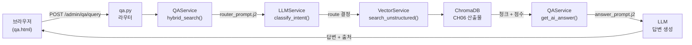
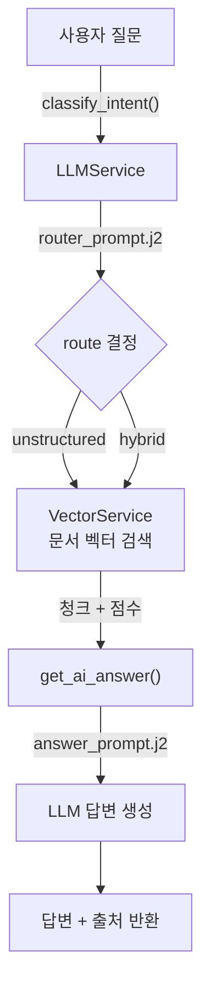

# 7. RAG Q&A 엔진 구현

이 장에서는 6장에서 구축한 ChromaDB 벡터 데이터베이스를 바탕으로 **RAG Q&A 엔진** 을 FastAPI 서비스로 완성합니다. 사용자가 브라우저에서 질문을 입력하면, LLM이 질문의 의도를 분석하여 최적의 검색 경로를 선택하고, 사내 문서에서 근거를 찾아 답변을 생성하는 전체 흐름을 구현합니다.

이 장의 핵심 질문은 다음과 같습니다.

- "ChromaDB에 저장된 문서를 어떻게 HTTP 서비스로 노출하는가?"
- "LLM이 질문의 의도를 분석하여 검색 전략을 결정하는 인텐트 라우팅(Intent Routing)은 어떻게 구현하는가?"
- "프롬프트를 코드와 분리하여 관리하면 어떤 장점이 생기는가?"

6장에서는 PDF 파싱 → 청킹 → 임베딩 → ChromaDB 저장이라는 데이터 적재 파이프라인을 완성했습니다. 이제 적재된 데이터를 조회하여 사용자에게 답변하는 서비스 계층을 구현할 차례입니다.

---



*그림 7-1: RAG Q&A 엔진 전체 요청 처리 흐름*

---

## 7.1 FastAPI로 RAG 서비스 제공하기

### FastAPI를 선택하는 이유

RAG Q&A 엔진을 구현할 때 웹 프레임워크로 **FastAPI** 를 선택합니다. 이유는 세 가지입니다.

첫째, **비동기 처리** 입니다. LLM 호출은 수 초에서 수십 초가 걸리는 블로킹 연산입니다. FastAPI는 `async/await` 기반으로 동작하므로, 한 요청이 LLM 응답을 기다리는 동안 다른 요청을 처리할 수 있습니다. 이를 통해 서버 자원을 효율적으로 사용합니다.

둘째, **Swagger UI 자동 제공** 입니다. FastAPI로 엔드포인트를 정의하면 `/docs` 경로에서 자동으로 API 문서가 생성됩니다. 코드와 문서를 별도로 관리할 필요가 없습니다.

셋째, **실무 배포 표준** 입니다. FastAPI는 uvicorn ASGI 서버와 함께 사용하여 프로덕션 환경에도 바로 배포할 수 있는 구조를 갖춥니다.

### 프로젝트 구조 확인

레포지토리를 클론하면 아래와 같은 구조를 확인할 수 있습니다.

```
CH07_RAG_QA엔진구현/
├── app/
│   ├── main.py                    ← FastAPI 앱 진입점
│   ├── routers/
│   │   ├── ui.py                  ← HTML 페이지 라우터
│   │   └── qa.py                  ← Q&A REST API
│   ├── services/
│   │   ├── llm_service.py         ← LLM 초기화 + 프롬프트 렌더링
│   │   ├── vector_service.py      ← ChromaDB 벡터 검색
│   │   └── qa_service.py          ← RAG 파이프라인 오케스트레이터
│   ├── prompts/
│   │   ├── router_prompt.j2       ← 인텐트 분류 프롬프트
│   │   └── answer_prompt.j2       ← 답변 생성 프롬프트
│   ├── templates/                 ← Jinja2 HTML 템플릿
│   └── static/                    ← CSS / JS 정적 파일
├── scripts/
│   └── ingest.py                  ← PDF → ChromaDB 인제스트 스크립트
└── data/
    ├── docs/                      ← 사내 문서 샘플 (PDF)
    └── chroma_db/                 ← ingest.py 실행 후 자동 생성
```

라우터는 `app/routers/` 아래에 기능별로 분리되어 있습니다. `ui.py`는 HTML 페이지를 렌더링하고, `qa.py`는 REST API 엔드포인트를 담당합니다. 서비스 로직은 `app/services/` 아래에 계층별로 분리되어 있습니다.

<!-- [GEMINI PROMPT: 07_app_structure]
path: assets/CH07/07_app_structure.png
Minimalist flat-design infographic showing FastAPI application layered architecture. Three horizontal layers: top layer "Routers" (admin, qa endpoints), middle layer "Services" (LLMService, VectorService, QAService), bottom layer "Prompts" (Jinja2 template files). Arrows showing dependencies between layers. Folder structure tree on the left side. White background, clean line art, Korean labels, 16:9.
Style: architecture-layer-flat
-->

*그림 7-2: CH07 FastAPI 앱 계층 구조*

### 실습 준비: 레포 클론 및 환경 설정

아래 순서대로 실습 환경을 준비하십시오.

**1단계: 레포지토리 클론**

```bash
git clone https://github.com/{repo}/CH07_RAG_QA엔진구현
cd CH07_RAG_QA엔진구현
```

**2단계: 환경 변수 설정**

`.env.example` 파일을 복사하여 `.env`를 생성하고 자신의 환경에 맞게 수정하십시오.

```bash
cp .env.example .env
```

`.env` 파일의 주요 설정값은 다음과 같습니다.

```env
# LLM Provider (ollama | openai)
LLM_PROVIDER=ollama

# LLM 모델명 (Ollama: deepseek-r1:1.5b)
LLM_MODEL_NAME=deepseek-r1:1.5b

# Ollama 서버
OLLAMA_BASE_URL=http://localhost:11434

# 임베딩 모델 (CH06과 반드시 동일)
EMBED_MODEL=nomic-embed-text

# ChromaDB 경로 (CH06 산출물 위치)
CHROMA_PERSIST_DIR=./data/chroma_db
COLLECTION_NAME=rag_docs
```

> **주의: 임베딩 모델은 CH06과 동일해야 합니다**
> `EMBED_MODEL`은 CH06에서 사용한 `nomic-embed-text`와 반드시 일치해야 합니다. 서로 다른 임베딩 모델로 저장된 벡터와 검색 쿼리를 비교하면 유사도 계산이 올바르지 않습니다.

**3단계: 패키지 설치**

```bash
python -m venv venv
source venv/bin/activate          # Windows: venv\Scripts\activate
pip install -r requirements.txt
```

`requirements.txt`에는 다음 패키지들이 포함되어 있습니다.

```
fastapi==0.115.5
uvicorn==0.32.1
jinja2==3.1.4
langchain==0.3.7
langchain-community==0.3.7
langchain-ollama==0.2.1
chromadb==0.5.23
pymupdf>=1.24.0
python-dotenv==1.0.1
```

**4단계: Ollama 모델 확인**

```bash
ollama pull deepseek-r1:1.5b
ollama pull nomic-embed-text
```

### FastAPI 앱 진입점: `app/main.py`

`app/main.py`는 FastAPI 애플리케이션의 진입점입니다. 핵심 역할은 세 가지입니다. 첫째, 라우터를 등록합니다. 둘째, 정적 파일(CSS, JS)을 마운트합니다. 셋째, 루트(`/`) 접근을 대시보드로 리다이렉트합니다.

```python
# app/main.py (핵심 부분 발췌)

from fastapi import FastAPI
from fastapi.responses import RedirectResponse
from fastapi.staticfiles import StaticFiles
from app.routers.ui import router as ui_router
from app.routers.qa import router as qa_router

app = FastAPI(
    title="RAG Q&A 엔진",
    description="CH07 — ChromaDB 기반 사내 문서 RAG Q&A 서비스",
    version="1.0.0",
)

# 정적 파일 마운트
if os.path.isdir(STATIC_DIR):
    app.mount("/static", StaticFiles(directory=STATIC_DIR), name="static")

# 라우터 등록 (qa_router를 ui_router보다 먼저 등록)
app.include_router(qa_router)
app.include_router(ui_router)

@app.get("/")
def root() -> RedirectResponse:
    return RedirectResponse(url="/admin/dashboard", status_code=302)
```

#### 코드 워크플로우 (Code Workflow)

1. **입력(Input)**: FastAPI 앱 객체가 생성되고, `app/` 하위의 라우터 모듈이 임포트됩니다.
2. **처리(Process)**: `qa_router`를 먼저 등록하여 `/admin/qa/query`(POST) 경로가 `/admin/qa`(GET) HTML 라우터보다 우선 처리됩니다. `StaticFiles`를 마운트하여 `/static` 경로로 CSS·JS를 제공합니다.
3. **출력(Output)**: `http://127.0.0.1:8000` 접속 시 `/admin/dashboard`로 자동 리다이렉트됩니다.

> **팁: 라우터 등록 순서가 중요합니다**
> FastAPI는 라우터를 등록한 순서대로 경로를 매칭합니다. `qa_router`(`POST /admin/qa/query`)를 `ui_router`(`GET /admin/qa`) 앞에 등록하지 않으면, `/admin/qa` 경로가 중복될 때 충돌이 발생할 수 있습니다.

### 서버 실행 및 첫 접속

프로젝트 루트(CH07_RAG_QA엔진구현 폴더)에서 실행하십시오.

```bash
python -m app.main
```

또는 uvicorn을 직접 실행하십시오.

```bash
uvicorn app.main:app --reload
```

서버가 정상 기동되면 아래와 같은 로그가 출력됩니다.

```
INFO:     Started server process [12345]
INFO:     Waiting for application startup.
[LLMService] 초기화 중 (제공자: ollama, 모델: deepseek-r1:1.5b)
[VectorService] 초기화 중 (임베딩 모델: nomic-embed-text, DB 경로: ./data/chroma_db)
[VectorService] ChromaDB 연결 완료.
[QAService] 오케스트레이터 초기화 완료.
INFO:     Application startup complete.
INFO:     Uvicorn running on http://127.0.0.1:8000 (Press CTRL+C to quit)
```

<!-- [CAPTURE NEEDED: 07_server_startup
  path: assets/CH07/07_server_startup.png
  desc: 서버 기동 직후 터미널 전체 화면 (LLMService, VectorService, QAService 초기화 로그 포함)
] -->

*그림 7-3: RAG Q&A 엔진 서버 기동 성공 화면*

브라우저에서 `http://127.0.0.1:8000` 에 접속하면 대시보드 화면으로 이동합니다. 대시보드에서 ChromaDB 문서 수, 사용 중인 LLM 모델, 임베딩 모델 정보를 확인할 수 있습니다.

<!-- [CAPTURE NEEDED: 07_dashboard
  path: assets/CH07/07_dashboard.png
  desc: 브라우저 대시보드 화면 (ChromaDB 문서 수, 모델 정보 카드 표시)
] -->

*그림 7-4: RAG Q&A 엔진 대시보드 화면*

---

## 7.2 LLM 서비스 계층 구성

### 서비스 계층을 분리하는 이유

RAG Q&A 엔진에서 LLM 호출 로직을 별도 클래스(`LLMService`)로 분리하는 이유는 **교체 용이성** 때문입니다. 개발 환경에서는 무료 로컬 모델(Ollama + DeepSeek R1)을 사용하다가, 상용 환경에서는 OpenAI의 GPT-4o로 전환하는 일이 잦습니다. `LLMService`가 없다면 LLM 호출 코드가 곳곳에 흩어져 전환할 때 수십 곳을 수정해야 합니다. 계층으로 분리해 두면 `.env` 파일의 `LLM_PROVIDER` 값 하나만 바꾸면 됩니다.

프롬프트도 마찬가지입니다. 프롬프트를 Python 코드 안에 문자열로 하드코딩하면, 프롬프트를 수정할 때마다 코드 파일을 열어 수정하고 재배포해야 합니다. `.j2` 확장자의 **Jinja2 템플릿 파일** 로 관리하면 개발자가 아닌 기획자나 운영자도 프롬프트를 직접 수정할 수 있으며, 버전 관리 시스템에서 프롬프트 변경 이력을 명확히 추적할 수 있습니다.

<!-- [GEMINI PROMPT: 07_llm_service_layer]
path: assets/CH07/07_llm_service_layer.png
Minimalist flat-design infographic showing LLMService layer architecture. Center: LLMService class box. Left branch: Ollama provider (local, free). Right branch: OpenAI provider (cloud, paid). Bottom: Jinja2 prompt template files (.j2) separated from code. Toggle switch icon showing provider switching pattern. White background, clean line art, Korean labels, 16:9.
Style: service-layer-flat
-->

*그림 7-5: LLMService 계층과 LLM 제공자 전환 구조*

### `LLMService` 클래스

`app/services/llm_service.py`의 `LLMService` 클래스는 네 가지 메서드를 제공합니다.

- `_init_engine()`: 환경 변수를 읽어 `ChatOllama` 또는 `ChatOpenAI` 엔진을 초기화합니다.
- `render_prompt()`: Jinja2 템플릿 파일을 렌더링하여 프롬프트 문자열을 반환합니다.
- `invoke()`: LLM을 호출하고, DeepSeek R1의 `<think>` 태그를 제거한 응답을 반환합니다.
- `generate_answer()`: `answer_prompt.j2`로 최종 답변을 생성합니다.
- `classify_intent()`: `router_prompt.j2`로 질문의 라우팅 의도를 분류합니다.

```python
# app/services/llm_service.py (핵심 부분 발췌)

class LLMService:
    """LLM 초기화 및 프롬프트 렌더링 서비스."""

    def __init__(self) -> None:
        self.provider = os.getenv("LLM_PROVIDER", "ollama").lower()
        default_model = "gpt-4o-mini" if self.provider == "openai" else "deepseek-r1:1.5b"
        self.model_name = os.getenv("LLM_MODEL_NAME", default_model)

        # Jinja2 환경: app/prompts/ 디렉토리를 로더로 사용
        base_dir = os.path.dirname(os.path.dirname(os.path.abspath(__file__)))
        template_dir = os.path.join(base_dir, "prompts")
        self.jinja_env = Environment(loader=FileSystemLoader(template_dir))
        self._init_engine()

    def invoke(self, prompt: str) -> str:
        """LLM을 호출하고 응답 문자열을 반환합니다."""
        response = self.llm.invoke(prompt)
        if hasattr(response, "content"):
            response = response.content

        # DeepSeek-R1 <think>...</think> 사고 과정 제거
        if isinstance(response, str) and "<think>" in response and "</think>" in response:
            response = response.split("</think>")[-1].strip()

        return str(response)

    def classify_intent(self, query: str) -> dict:
        """router_prompt.j2로 질문의 라우팅 의도를 분류합니다."""
        rendered_prompt = self.render_prompt("router_prompt.j2", query=query)
        response = self.invoke(rendered_prompt)

        try:
            start_idx = response.find("{")
            end_idx = response.rfind("}") + 1
            if start_idx != -1 and end_idx > start_idx:
                json_str = response[start_idx:end_idx]
                return json.loads(json_str)
            return {"route": "hybrid", "reason": "JSON 파싱 실패 — hybrid로 대체"}
        except Exception:
            return {"route": "hybrid", "reason": "인텐트 분석 오류 — hybrid로 대체"}


# 싱글톤 인스턴스
llm_service = LLMService()
```

#### 코드 워크플로우 (Code Workflow)

1. **입력(Input)**: 환경 변수 `LLM_PROVIDER`, `LLM_MODEL_NAME`, `OLLAMA_BASE_URL`을 읽어 LLM 제공자와 모델을 결정합니다.
2. **처리(Process)**: `_init_engine()`에서 `provider` 값에 따라 `ChatOllama` 또는 `ChatOpenAI` 엔진 인스턴스를 생성합니다. `invoke()` 호출 시 LLM 응답에서 `<think>...</think>` 태그를 제거하여 깔끔한 답변만 반환합니다.
3. **출력(Output)**: 모듈 하단의 `llm_service = LLMService()` 싱글톤 인스턴스를 다른 서비스가 `import`하여 사용합니다.

> **참고: DeepSeek R1의 `<think>` 태그**
> DeepSeek R1 모델은 답변 전에 내부 추론 과정을 `<think>...</think>` 태그 안에 출력합니다. 이 태그는 모델이 어떻게 생각했는지 보여주는 "사고 로그"입니다. 최종 사용자에게는 이 내용이 필요하지 않으므로, `</think>` 이후의 텍스트만 추출하여 반환합니다.

### Jinja2 프롬프트 템플릿

프롬프트 파일은 `app/prompts/` 폴더에 `.j2` 확장자로 저장됩니다. Jinja2 템플릿은 `{{ 변수명 }}` 문법으로 동적 값을 삽입합니다.

**`router_prompt.j2` — 인텐트 분류 프롬프트:**

```jinja2
{# 질문 의도 분석 — 검색 전략 결정 #}
당신은 사내 AI 비서의 질문 분석기(Router)입니다.
사용자의 [질문]을 분석하여 어떤 데이터 소스를 검색해야 할지 결정하세요.

[데이터 소스]
- unstructured: 사내 규정, 가이드라인, 정책 문서 검색이 필요한 경우
- hybrid: 명확히 구분하기 어렵거나 복합 정보가 필요한 경우

[출력 형식]
반드시 아래 JSON 형식으로만 답변하세요. 다른 설명은 생략합니다.
{"route": "unstructured|hybrid", "reason": "의도 분석 결과"}

[질문]
{{ query }}
```

**`answer_prompt.j2` — 답변 생성 프롬프트:**

```jinja2
{# 최종 답변 생성 프롬프트 #}
당신은 사내 AI 비서입니다.
아래 [컨텍스트] 정보를 바탕으로 [질문]에 친절하고 정확하게 답변하세요.

[규칙]
- 반드시 한국어로 답변하세요.
- 정보가 부족하면 아는 범위에서만 답변하고 추측하지 마세요.
- 문서 내용은 핵심을 요약하여 답변하세요.

[컨텍스트]
{{ context }}

[질문]
{{ query }}
```

두 프롬프트 파일을 코드가 아닌 별도 파일로 관리하므로, 프롬프트를 수정할 때 Python 코드를 전혀 건드릴 필요가 없습니다. 10장에서 다루는 프롬프트 튜닝 작업도 이 파일만 수정하면 적용됩니다.

> **팁: `router_prompt.j2`에서 JSON만 반환하도록 지시하는 이유**
> LLM이 자유 형식으로 답변하면 파싱이 어렵습니다. "반드시 JSON 형식으로만 답변하세요"라고 명시하면 `classify_intent()` 메서드가 응답에서 JSON을 추출하여 `route` 값을 정확히 꺼낼 수 있습니다. 파싱에 실패하더라도 기본값 `"hybrid"`로 대체하여 서비스가 중단되지 않습니다.

---

## 7.3 벡터 검색 서비스 연결

### CH06 산출물을 그대로 사용하는 이유

7장의 `VectorService`는 6장에서 구축한 ChromaDB를 그대로 활용합니다. 별도의 재임베딩 과정이 필요 없습니다. 이유는 명확합니다. ChromaDB에 문서를 저장할 때 사용한 임베딩 모델(`nomic-embed-text`)과 검색 쿼리를 임베딩할 때 사용하는 모델이 동일해야 유사도 비교가 정확합니다. 6장과 7장이 같은 모델(`nomic-embed-text`)을 사용하므로, 6장의 ChromaDB를 `data/chroma_db/` 폴더에 복사하는 것만으로 7장 실습이 가능합니다.

### 문서 인제스트: `scripts/ingest.py`

6장의 ChromaDB를 그대로 복사할 수도 있지만, 7장에서는 독립적으로 문서를 인제스트할 수 있는 `scripts/ingest.py` 스크립트도 제공합니다. `data/docs/` 폴더에 사내 PDF 문서를 넣고 아래 명령어를 실행하면 ChromaDB가 생성됩니다.

```bash
# 전체 인제스트
python scripts/ingest.py

# 파일 지정 인제스트 (저사양 환경 권장)
python scripts/ingest.py --file HR_사내규정_v1.0.pdf

# ChromaDB 초기화 후 전체 재인제스트
python scripts/ingest.py --reset
```

`ingest.py`는 5단계 파이프라인으로 동작합니다.

```
[1/5] PDF 탐색 (data/docs/ 하위 PDF 파일 목록 수집)
  ↓
[2/5] 페이지 캡처 (PyMuPDF로 PNG 저장 → data/pages/)
  ↓
[3/5] Vision 파싱 (Vision LLM으로 Markdown 변환 → data/markdown/)
  ↓
[4/5] 청킹 (## 헤더 기준 섹션 분할, 500자 초과 시 슬라이딩 분할)
  ↓
[5/5] 임베딩 + ChromaDB 저장 (nomic-embed-text → data/chroma_db/)
```

> **팁: RAM에 따른 Vision 모델 선택**
>
> | RAM | Vision 모델 | 채팅 LLM | 인제스트 예상 시간(파일당) |
> |-----|------------|---------|----------------------|
> | 8GB 이하 | `moondream` | `deepseek-r1:1.5b` | 1~2분 |
> | 16GB | `llava:7b` | `deepseek-r1:1.5b` | 3~5분 |
> | 32GB+ | `llava:13b` | `qwen2.5:7b` | 1~2분 |
>
> `.env` 파일의 `VISION_MODEL` 값을 자신의 환경에 맞게 설정하십시오.

### `VectorService` 클래스

`app/services/vector_service.py`의 `VectorService` 클래스는 ChromaDB에 연결하고 유사도 검색을 제공합니다.

```python
# app/services/vector_service.py (핵심 부분 발췌)

class VectorService:
    """ChromaDB 벡터 검색 서비스 — Ollama 임베딩 사용."""

    def __init__(self) -> None:
        ollama_url = os.getenv("OLLAMA_BASE_URL", "http://localhost:11434")
        embed_model = os.getenv("EMBED_MODEL", "nomic-embed-text")
        collection_name = os.getenv("COLLECTION_NAME", "rag_docs")

        from langchain_ollama import OllamaEmbeddings
        self.embeddings = OllamaEmbeddings(base_url=ollama_url, model=embed_model)
        self.vector_db: Chroma | None = None

        if os.path.exists(VECTOR_DB_DIR):
            self.vector_db = Chroma(
                persist_directory=VECTOR_DB_DIR,
                embedding_function=self.embeddings,
                collection_name=collection_name,
            )
            print("[VectorService] ChromaDB 연결 완료.")
        else:
            print(f"[VectorService] 경고: {VECTOR_DB_DIR} 디렉토리가 없습니다.")

    def search_unstructured(self, query: str, k: int = 3) -> list[dict]:
        """비정형 문서 유사도 검색을 수행합니다."""
        # --- Process ---
        raw_results = self.vector_db.similarity_search_with_score(query, k=k)

        # --- Output ---
        formatted = []
        for doc, distance in raw_results:
            # Chroma 거리 → 유사도 변환 (낮은 거리 = 높은 유사도)
            similarity = max(0.0, 1.0 - float(distance))
            formatted.append({
                "content": doc.page_content,
                "source": doc.metadata.get("source", "알 수 없음"),
                "score": round(similarity, 4),
            })
        return formatted


# 싱글톤 인스턴스
vector_service = VectorService()
```

#### 코드 워크플로우 (Code Workflow)

1. **입력(Input)**: 검색 쿼리 문자열과 반환할 문서 수(`k=3`)를 입력받습니다.
2. **처리(Process)**: `similarity_search_with_score(query, k=k)`로 ChromaDB에서 유사도 검색을 수행합니다. Chroma가 반환하는 `distance` 값(낮을수록 유사)을 `1.0 - distance` 수식으로 `score`(높을수록 유사)로 변환합니다.
3. **출력(Output)**: `[{"content": "...", "source": "파일명", "score": 0.87}, ...]` 형태의 리스트를 반환합니다.

> **참고: Chroma의 거리와 유사도**
> ChromaDB의 `similarity_search_with_score()`는 코사인 거리(cosine distance)를 반환합니다. 거리는 낮을수록 가깝습니다. 이를 독자가 이해하기 쉬운 유사도(similarity)로 변환하기 위해 `1.0 - distance` 공식을 사용합니다. 결과적으로 0에 가까울수록 관련성이 낮고, 1에 가까울수록 관련성이 높습니다.

**싱글톤 패턴을 사용하는 이유**: `VectorService` 초기화 시 OllamaEmbeddings 연결과 ChromaDB 로드에 시간이 걸립니다. 이를 FastAPI 요청마다 반복하면 응답 속도가 크게 저하됩니다. 모듈 하단에서 `vector_service = VectorService()`로 한 번만 생성한 후, 이후 모든 요청에서 이 인스턴스를 재사용합니다.

---

## 7.4 인텐트 라우팅과 RAG Q&A 오케스트레이션

### 인텐트 라우팅이 필요한 이유

"연차 사용 기준은 어떻게 됩니까?"와 "김철수 씨의 연차는 며칠이나 남았습니까?" — 이 두 질문은 모두 연차에 관한 것이지만, 필요한 정보의 성격이 다릅니다. 전자는 HR 규정 문서(비정형 데이터)에서 찾아야 하고, 후자는 직원 DB(정형 데이터)에서 조회해야 합니다.

모든 질문에 대해 무조건 벡터 검색을 수행하면 두 가지 문제가 생깁니다. 첫째, 정형 DB 조회 질문에 대해 문서에서 엉뚱한 내용을 찾아 답변합니다. 둘째, 불필요한 검색을 수행하여 응답 속도가 느려집니다.

**인텐트 라우팅(Intent Routing)** 은 LLM이 질문을 먼저 분석하여 "이 질문은 문서 검색으로 해결 가능한가, 아니면 DB 조회가 필요한가"를 결정하는 과정입니다. 도서관 안내 데스크 직원이 "이 책은 인문학 섹션에 있습니다" 또는 "그 데이터는 열람실 컴퓨터로 조회하십시오"라고 적절히 안내하는 것과 같습니다.



*그림 7-6: 인텐트 라우팅 흐름도*

### `QAService` 클래스

`app/services/qa_service.py`의 `QAService`는 인텐트 라우팅 → 벡터 검색 → LLM 답변 생성의 전체 파이프라인을 오케스트레이션합니다.

```python
# app/services/qa_service.py (핵심 부분 발췌)

class QAService:
    """RAG Q&A 파이프라인 오케스트레이터."""

    def hybrid_search(self, query: str) -> dict:
        """인텐트 라우팅을 적용한 문서 검색을 수행합니다."""
        # --- Input ---
        print(f"[QAService] 질문 수신: {query[:50]}...")

        # --- Process ---
        # 1. 인텐트 분류
        analysis = llm_service.classify_intent(query)
        route = analysis.get("route", "hybrid")
        print(f"[QAService] 라우팅 결정: {route} (사유: {analysis.get('reason', '-')})")

        # CH07: 비정형 문서 검색만 지원 (CH08에서 structured 경로 추가)
        if route == "structured":
            route = "hybrid"

        unstructured = []
        if route in ("unstructured", "hybrid"):
            unstructured = vector_service.search_unstructured(query)

        # --- Output ---
        return {"query": query, "unstructured": unstructured, "route": route}

    def get_ai_answer(self, query: str, search_results: dict) -> str:
        """검색 결과로 컨텍스트를 구성하고 LLM 답변을 생성합니다."""
        # --- Input ---
        unstructured_docs = search_results.get("unstructured", [])

        # --- Process ---
        context_parts = []
        if unstructured_docs:
            context_parts.append("[사내 문서 내용]")
            for doc in unstructured_docs:
                source = doc.get("source", "알 수 없음")
                content = doc.get("content", "")
                context_parts.append(f"- {content} (출처: {source})")
        else:
            context_parts.append("[관련 문서를 찾지 못했습니다. 일반 지식으로 답변합니다.]")

        context_text = "\n".join(context_parts)

        # --- Output ---
        return llm_service.generate_answer(query, context_text)


# 싱글톤 인스턴스
qa_service = QAService()
```

#### 코드 워크플로우 (Code Workflow)

1. **입력(Input)**: 사용자 질문 문자열이 `hybrid_search(query)`로 전달됩니다.
2. **처리(Process)**:
   - `llm_service.classify_intent(query)`로 LLM이 질문을 분석하여 `route` 값(`unstructured` 또는 `hybrid`)을 결정합니다.
   - `route` 값에 따라 `vector_service.search_unstructured(query)`를 호출하여 ChromaDB에서 관련 문서 청크를 검색합니다.
   - `get_ai_answer()`에서 검색 결과를 `[사내 문서 내용]` 형식의 컨텍스트로 조립한 뒤, `llm_service.generate_answer()`를 호출합니다.
3. **출력(Output)**: LLM이 생성한 답변 문자열을 반환합니다.

> **참고: CH07에서 `structured` 라우팅이 `hybrid`로 대체되는 이유**
> CH07은 비정형 문서(ChromaDB) 검색만 지원합니다. LLM이 질문을 DB 조회가 필요한 `structured`로 분류하더라도, 이 장에서는 `hybrid` 경로로 대체하여 문서 검색으로 처리합니다. DB 조회(PostgreSQL)와 MCP Agent는 8장에서 확장됩니다.

### Q&A REST API: `app/routers/qa.py`

`app/routers/qa.py`는 브라우저에서 전송된 질문을 받아 `QAService`를 호출하고 결과를 JSON으로 반환합니다.

```python
# app/routers/qa.py (핵심 부분 발췌)

from fastapi import APIRouter, HTTPException
from pydantic import BaseModel
from app.services.qa_service import qa_service

router = APIRouter(prefix="/admin/qa", tags=["qa"])

class QueryRequest(BaseModel):
    """질문 요청 스키마."""
    query: str

@router.post("/query")
async def query_qa(request: QueryRequest) -> dict:
    """사용자 질문을 처리하여 RAG 기반 답변을 반환합니다."""
    # --- Input ---
    query = request.query.strip()
    if not query:
        raise HTTPException(status_code=400, detail="질문이 비어 있습니다.")

    # --- Process ---
    try:
        search_results = qa_service.hybrid_search(query)
        answer = qa_service.get_ai_answer(query, search_results)
    except Exception as exc:
        raise HTTPException(status_code=500, detail=f"질문 처리 중 오류: {str(exc)}")

    # --- Output ---
    return {
        "query": query,
        "answer": answer,
        "route": search_results["route"],
        "unstructured_data": search_results["unstructured"],
    }
```

#### 코드 워크플로우 (Code Workflow)

1. **입력(Input)**: `POST /admin/qa/query` 요청 본문에서 `{"query": "연차 사용 기준은?"}` 형태의 JSON을 수신합니다.
2. **처리(Process)**: `qa_service.hybrid_search()`로 인텐트 라우팅 + 벡터 검색을 수행한 뒤, `qa_service.get_ai_answer()`로 LLM 답변을 생성합니다. 오류 발생 시 HTTP 500을 반환합니다.
3. **출력(Output)**: `{"query": "...", "answer": "...", "route": "hybrid", "unstructured_data": [...]}` 형태의 JSON을 반환합니다. `unstructured_data`에는 각 청크의 `content`, `source`, `score`가 포함됩니다.

Swagger UI(`http://127.0.0.1:8000/docs`)에서 엔드포인트를 직접 테스트할 수도 있습니다.

<!-- [CAPTURE NEEDED: 07_swagger_ui
  path: assets/CH07/07_swagger_ui.png
  desc: Swagger UI 화면에서 POST /admin/qa/query 엔드포인트를 펼쳐 요청/응답 스키마가 표시된 상태
] -->

*그림 7-7: Swagger UI에서 Q&A 엔드포인트 확인*

---

## 7.5 웹 채팅 인터페이스 구현

### HTML 템플릿 구조

`app/templates/` 폴더에는 세 개의 HTML 파일이 있습니다.

- `base.html`: 공통 레이아웃(사이드바, 네비게이션, CSS/JS 링크)을 정의합니다. 모든 페이지가 이 파일을 ``로 상속합니다.
- `dashboard.html`: 시스템 상태(ChromaDB 문서 수, 모델 정보)를 카드 형식으로 표시합니다.
- `qa.html`: 채팅 인터페이스를 제공합니다. 질문 입력창, 채팅 기록 영역, 출처 카드 아코디언이 포함됩니다.

`ui.py` 라우터는 이 템플릿들을 Jinja2로 렌더링하여 HTML 응답을 반환합니다.

```python
# app/routers/ui.py (핵심 부분 발췌)

@router.get("/dashboard", response_class=HTMLResponse)
async def dashboard(request: Request) -> HTMLResponse:
    """대시보드 화면을 렌더링합니다."""
    doc_count = 0
    db_status = "연결 끊김"
    if vector_service.vector_db is not None:
        collection = vector_service.vector_db._collection
        doc_count = collection.count()
        db_status = "정상"

    return templates.TemplateResponse(
        "dashboard.html",
        {
            "request": request,
            "doc_count": doc_count,
            "db_status": db_status,
            "llm_model": os.getenv("LLM_MODEL_NAME", "deepseek-r1:1.5b"),
            "embed_model": os.getenv("EMBED_MODEL", "nomic-embed-text"),
        },
    )
```

#### 코드 워크플로우 (Code Workflow)

1. **입력(Input)**: 브라우저에서 `GET /admin/dashboard` 요청이 들어옵니다.
2. **처리(Process)**: `vector_service.vector_db._collection.count()`로 ChromaDB에 저장된 문서 청크 수를 조회합니다. 환경 변수에서 LLM 모델명과 임베딩 모델명을 읽어 템플릿 컨텍스트에 추가합니다.
3. **출력(Output)**: `dashboard.html`에 동적 데이터가 채워진 HTML 페이지가 브라우저로 반환됩니다.

### 비동기 채팅: `app/static/js/qa.js`

`qa.js`는 채팅 인터페이스의 모든 클라이언트 동작을 담당합니다. 핵심 함수는 `submitQuery()`입니다.

```javascript
// app/static/js/qa.js (핵심 부분 발췌)

async function submitQuery(event) {
    if (event) event.preventDefault();
    const query = queryInput.value.trim();
    if (!query) return;

    // 사용자 메시지 DOM 추가
    const userMsgDiv = document.createElement('div');
    userMsgDiv.className = 'chat-message user-message';
    userMsgDiv.textContent = query;  // XSS 방지: textContent 사용
    chatHistory.appendChild(userMsgDiv);

    loadingIndicator.style.display = 'flex';

    try {
        const response = await fetch('/admin/qa/query', {
            method: 'POST',
            headers: { 'Content-Type': 'application/json' },
            body: JSON.stringify({ query: query })
        });

        const data = await response.json();

        // AI 답변 + 출처 카드 렌더링
        const aiMsgDiv = document.createElement('div');
        aiMsgDiv.innerHTML = `
            <div class="avatar">AI</div>
            <div class="message-content">
                <div class="ai-ans-text">${data.answer}</div>
                ${renderSourceAccordion(data)}
            </div>
        `;
        chatHistory.appendChild(aiMsgDiv);
        saveChatHistory();  // localStorage에 대화 내역 저장

    } finally {
        loadingIndicator.style.display = 'none';
        scrollToBottom();
    }
}
```

#### 코드 워크플로우 (Code Workflow)

1. **입력(Input)**: 사용자가 채팅 입력창에 질문을 입력하고 전송 버튼을 클릭합니다.
2. **처리(Process)**: `fetch('/admin/qa/query', { method: 'POST', ... })`로 서버에 비동기 요청을 전송합니다. 응답 대기 중에는 로딩 표시기를 보여줍니다. 응답을 받으면 `renderSourceAccordion(data)`로 출처 카드 HTML을 생성합니다.
3. **출력(Output)**: 브라우저 채팅 영역에 AI 답변과 출처 카드가 렌더링됩니다. 대화 내역은 `localStorage`에 저장되어 페이지를 새로고침해도 유지됩니다.

### 출처 카드 렌더링

사용자가 AI 답변의 근거를 확인할 수 있도록 **출처 카드(Source Card)** 를 제공합니다. 서버에서 반환된 `unstructured_data` 배열의 각 항목을 카드 형태로 표시합니다.

```javascript
// renderSourceAccordion() 핵심 로직

function renderSourceAccordion(data) {
    const uniqueDocs = /* content 기준 중복 제거 */;

    const docsHtml = uniqueDocs.map(doc => {
        const source = doc.source || '출처 불명';
        const preview = doc.content.substring(0, 150) + '...';
        const score = doc.score.toFixed(2);
        return `
            <div class="source-item">
                <small>${source}</small>
                <p>${preview}</p>
                <div class="source-score">유사도: ${score}</div>
            </div>
        `;
    }).join('');

    return `
        <div class="route-badge">라우팅: ${data.route}</div>
        <div class="source-container">
            <div class="source-header" onclick="this.parentElement.classList.toggle('active')">
                <span>분석 근거 보기 (출처 문서)</span>
            </div>
            <div class="source-body">${docsHtml}</div>
        </div>
    `;
}
```

#### 코드 워크플로우 (Code Workflow)

1. **입력(Input)**: 서버 응답 JSON의 `unstructured_data` 배열 (`[{content, source, score}, ...]`)을 입력받습니다.
2. **처리(Process)**: `content` 기준으로 중복 문서를 제거합니다. 각 문서의 `source`, `content` 앞 150자, `score`를 카드 HTML로 변환합니다. "분석 근거 보기" 버튼을 클릭하면 `active` 클래스 토글로 아코디언이 펼쳐집니다.
3. **출력(Output)**: 라우팅 결과 배지와 출처 카드 아코디언 HTML을 반환합니다.

출처 카드가 중요한 이유는 AI 답변의 신뢰성 때문입니다. 사용자는 "이 답변이 어떤 문서를 기반으로 생성되었는가?"를 출처 카드에서 직접 확인합니다. 유사도 점수가 낮은 경우(0.5 미만) 사용자 스스로 판단하여 답변의 신뢰도를 평가할 수 있습니다.

### Q&A 채팅 화면 접속

브라우저에서 `http://127.0.0.1:8000/admin/qa` 에 접속한 뒤, 질문을 입력하고 전송해 보십시오.

예시 질문을 입력하여 RAG 동작을 확인하십시오.

- "연차 신청 절차는 어떻게 됩니까?"
- "보안 정책의 주요 내용을 알려주십시오."
- "신규 서비스 런칭 전 체크리스트를 알려주십시오."

<!-- [CAPTURE NEEDED: 07_qa_chat
  path: assets/CH07/07_qa_chat.png
  desc: 브라우저 Q&A 채팅 화면에서 질문 입력 후 AI 답변과 출처 카드 아코디언이 펼쳐진 상태
] -->

*그림 7-8: RAG Q&A 채팅 화면 — 답변 및 출처 카드 표시*

> **팁: ChromaDB가 없는 경우의 동작**
> `data/chroma_db/` 폴더가 없더라도 서버는 정상 기동됩니다. `VectorService`가 지연 초기화(lazy initialization)를 지원하여, 폴더가 없으면 경고 로그만 출력하고 서비스를 시작합니다. 질문을 보내면 "관련 문서를 찾지 못했습니다"라는 응답이 반환됩니다. `scripts/ingest.py`를 먼저 실행하여 ChromaDB를 생성한 뒤 질문하십시오.

---

## 7.6 정리하며

이 장에서는 6장에서 구축한 ChromaDB를 기반으로 완전한 RAG Q&A 웹 서비스를 구현했습니다.

- **FastAPI 서비스 계층화**: `ui.py`(HTML 라우터), `qa.py`(REST API), `llm_service.py`, `vector_service.py`, `qa_service.py` 다섯 파일로 책임을 분리하였습니다. 각 계층이 독립적으로 교체·확장 가능한 구조입니다.

- **Jinja2 프롬프트 템플릿**: 프롬프트를 `.j2` 파일로 분리하여 Python 코드 변경 없이 프롬프트를 수정할 수 있게 했습니다. `LLM_PROVIDER` 환경 변수 하나로 Ollama와 OpenAI를 전환하는 설계도 `LLMService` 계층 덕분에 가능합니다.

- **인텐트 라우팅**: LLM이 사용자 질문의 의도를 `router_prompt.j2`로 분석하여 검색 전략(`unstructured` / `hybrid`)을 결정합니다. 모든 질문에 벡터 검색을 강제하지 않고 의도에 따라 최적 경로를 선택합니다.

- **출처 카드와 투명성**: 답변과 함께 `source`(파일명)와 `score`(유사도)를 출처 카드로 제공합니다. 사용자가 AI 답변의 근거를 직접 검증할 수 있습니다.

- **싱글톤 서비스 공유**: `llm_service`, `vector_service`, `qa_service`를 모듈 수준에서 단일 인스턴스로 생성합니다. FastAPI 앱이 시작될 때 한 번만 초기화하므로 매 요청마다 초기화 비용이 발생하지 않습니다.

### 자주 발생하는 오류와 해결법

| 오류 | 원인 | 해결법 |
|------|------|--------|
| `[VectorService] 경고: ./data/chroma_db 디렉토리가 없습니다` | ChromaDB가 생성되지 않음 | `python scripts/ingest.py` 실행 |
| `ConnectionRefusedError` (LLM 호출 시) | Ollama 서버가 실행 중이지 않음 | `ollama serve` 실행 확인 |
| `모델 로드 실패` | 지정한 모델이 설치되지 않음 | `ollama pull deepseek-r1:1.5b` 실행 |
| 답변에 `<think>` 태그가 포함됨 | DeepSeek R1 출력 처리 미적용 | `LLMService.invoke()` 코드의 `<think>` 제거 로직 확인 |
| 검색 결과가 비어있음 | ChromaDB 컬렉션명 불일치 | `.env`의 `COLLECTION_NAME` 값이 CH06과 동일한지 확인 |
| `Import error: langchain_ollama` | 패키지 미설치 | `pip install langchain-ollama` 실행 |

### 다음 장 예고

7장에서는 비정형 문서(ChromaDB) 검색에 집중했습니다. 그러나 실제 업무에서는 "김철수 씨의 남은 연차는 며칠입니까?"와 같이 PostgreSQL 데이터베이스를 조회해야 하는 정형 질문이 빈번합니다.

8장에서는 **MCP(Model Context Protocol)** 를 이용하여 PostgreSQL 조회 기능을 LLM 에이전트가 호출할 수 있는 도구(Tool)로 등록합니다. 7장의 FastAPI 서버에 MCP Agent 탭이 추가되고, 정형 + 비정형 데이터를 모두 처리하는 통합 에이전트가 완성됩니다.

> **전체 코드는 GitHub 레포지토리를 참고하십시오.**
> 이 장에서 발췌된 코드는 핵심 로직 위주로 일부 생략되었습니다. 전체 소스 코드(`app/templates/`, `app/static/css/`, `scripts/ingest.py` 포함)는 예제 레포지토리에서 확인하십시오.
