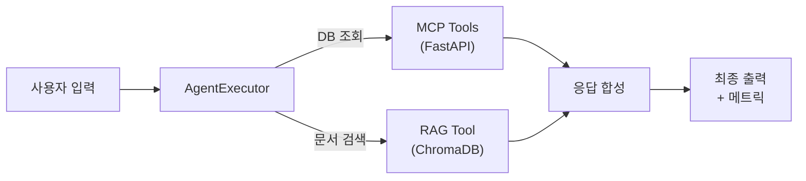

# 9. LangChain 최종 연결

이 장에서는 지금까지 챕터별로 구축해 온 모든 구성 요소를 단일 파이프라인으로 통합합니다. 7장의 RAG Chain과 8장의 MCP Tool을 LangChain 표준 인터페이스인 **Tool** 규격으로 통일하고, **AgentExecutor(ReAct)** 가 질문에 따라 적절한 도구를 자동 선택하여 답변을 생성하도록 연결합니다. 또한 운영 환경에서 필수적인 Timeout, Retry, 로깅, 캐싱을 설정하고, 응답 시간과 캐시 히트율을 측정하는 모니터링 체계를 구축합니다.

이 장을 마치면 터미널 단 하나에서 "김철수의 남은 연차와 연차 규정을 알려줘" 같은 복합 질의에 정확하게 답변하는 AI 업무 비서 v2를 실행할 수 있습니다.

<!-- [GEMINI PROMPT: 09_chapter-overview]
path: assets/CH09/09_chapter-overview.png
Minimalist flat-design infographic showing CH09 integrated pipeline. Flow: User input (left) → LangChain AgentExecutor (center, with ReAct loop icon) → branching to two tools: MCP Tools (top path, connecting to FastAPI/PostgreSQL) and RAG Tool (bottom path, connecting to ChromaDB). Both paths merge back → Response synthesis (right). White background, clean line art, Korean labels, 16:9.
Style: integration-flow-flat
-->

*그림 9-1: 9장 통합 파이프라인 전체 구조*

---

## 1. Router / Agent / RAG Chain / MCP Tool 통합 구성

### 1.1 통합 아키텍처 개요

8장에서 설계한 MCP 에이전트는 FastMCP 서버를 서브프로세스로 실행하고 비동기 브릿지를 통해 도구를 호출하는 구조였습니다. 9장에서는 이 구조를 더 단순화합니다. **FastAPI REST API** 를 직접 호출하는 LangChain Tool 3종과 ChromaDB 검색 Tool 1종을 하나의 AgentExecutor에 등록하여, LLM이 자연어 질문을 분석하고 스스로 어떤 도구를 호출할지 판단하도록 합니다.



*그림 9-2: 통합 파이프라인 구성 — AgentExecutor가 MCP Tools와 RAG Tool을 자율 선택*

이 구조에서 **라우터(Router)** 는 별도 모듈이 아닙니다. ReAct 패턴의 에이전트 자체가 "어떤 도구를 쓸까"를 추론하는 과정이 곧 라우팅입니다. LLM이 질문을 보고 `Thought → Action → Observation` 루프를 반복하면서 필요한 도구를 순서대로 호출하고 결과를 취합해 최종 답변을 생성합니다.

> **참고: ReAct 패턴이란?**
> ReAct는 Reasoning(추론)과 Acting(행동)을 번갈아 수행하는 에이전트 패턴입니다. LLM이 먼저 `Thought`로 다음 행동을 계획하고, `Action`으로 도구를 호출하며, `Observation`으로 결과를 확인한 뒤 다시 추론하는 과정을 반복합니다. 이 사이클이 끝나면 `Final Answer`를 출력합니다.

### 1.2 실습 준비

실습을 시작하기 전에 전제 조건을 확인하십시오. 9장 실습은 CH04 FastAPI 서버와 CH07 ChromaDB가 이미 구동 중이어야 합니다.

**1단계: CH04 인프라 구동 확인**

```bash
cd rag-infra
docker-compose up -d
docker-compose ps
```

`fastapi_app`과 `postgres` 컨테이너가 모두 `Up` 상태인지 확인하십시오.

**2단계: CH07 ChromaDB 구축 확인**

```bash
cd CH07_RAG_QA엔진구현
python src/main.py  # 이미 실행했다면 건너뜁니다.
```

**3단계: 9장 예제 코드 Clone**

```bash
git clone https://github.com/{repo}/ch09-langchain-agent
cd ch09-langchain-agent
```

**4단계: 환경 변수 설정**

```bash
cp .env.example .env
```

`.env` 파일을 열어 아래 항목을 환경에 맞게 수정하십시오.

```env
# LLM Provider 설정 (ollama 또는 openai)
LLM_PROVIDER=ollama

# LLM 모델명
LLM_MODEL_NAME=deepseek-r1:1.5b

# Ollama 서버 URL
OLLAMA_BASE_URL=http://localhost:11434

# CH04 FastAPI 서버 URL
FASTAPI_BASE_URL=http://localhost:8000

# CH07 ChromaDB 경로
CHROMA_PERSIST_DIR=../CH07_RAG_QA엔진구현/data/chroma_db
COLLECTION_NAME=rag_docs
EMBED_MODEL=nomic-embed-text

# 운영 설정
LLM_TIMEOUT=60
MAX_RETRIES=2
ENABLE_CACHE=true
LOG_LEVEL=INFO
```

> **주의: CHROMA_PERSIST_DIR 경로**
> `CHROMA_PERSIST_DIR` 경로는 CH07 예제 코드의 ChromaDB 저장 경로와 일치해야 합니다. 경로가 다를 경우 ChromaDB 연결 오류가 발생합니다. CH07 실행 시 생성된 경로를 절대 경로로 입력하면 더 안전합니다.

**5단계: 패키지 설치 및 실행**

```bash
# macOS / Linux
python3 -m venv venv
source venv/bin/activate
pip install -r requirements.txt

# 실행
PYTHONPATH=. python src/main.py
```

```bash
# Windows
python -m venv venv
venv\Scripts\activate
pip install -r requirements.txt

set PYTHONPATH=.
python src/main.py
```

> **팁: PYTHONPATH 설정 이유**
> `PYTHONPATH=.` 는 프로젝트 루트 디렉토리를 Python 모듈 검색 경로에 추가합니다. `src/agent.py` 에서 `from src.config import ...` 같이 패키지를 임포트할 때 이 설정이 없으면 `ModuleNotFoundError` 가 발생합니다.

### 1.3 AgentExecutor 구성 코드 해설

에이전트의 핵심은 `src/agent.py`의 `build_agent()` 함수입니다. 전체 코드는 GitHub 레포를 참고하십시오. 여기서는 핵심 구성 부분만 발췌합니다.

```python
# src/agent.py (발췌)

def build_agent(config: AppConfig) -> AgentExecutor:
    """LangChain AgentExecutor를 구성하여 반환합니다."""

    # --- Input ---
    llm_config = config.llm

    # --- Process ---
    # 1. OllamaLLM 초기화 (timeout, max_retries 적용)
    llm = OllamaLLM(
        model=llm_config.model,
        base_url=llm_config.base_url,
        temperature=llm_config.temperature,
        timeout=llm_config.timeout,
        num_predict=1024,
    )

    # 2. Tool 목록: MCP_TOOLS(3종) + RAG_TOOL(1종)
    tools: list[BaseTool] = list(MCP_TOOLS) + [RAG_TOOL]

    # 3. ReAct 프롬프트 및 에이전트 생성
    prompt = PromptTemplate.from_template(_REACT_PROMPT_TEMPLATE)
    agent = create_react_agent(llm=llm, tools=tools, prompt=prompt)

    # 4. AgentExecutor 구성
    agent_executor = AgentExecutor(
        agent=agent,
        tools=tools,
        max_iterations=5,
        verbose=True,
        handle_parsing_errors="에이전트가 올바른 형식으로 응답하지 못했습니다. 다시 시도합니다.",
        return_intermediate_steps=True,
    )

    # --- Output ---
    return agent_executor
```

#### 코드 워크플로우 (Code Workflow)

1. **입력(Input)**: `AppConfig` 객체 — LLM 설정(모델명, URL, timeout), 캐시 설정 포함
2. **처리(Process)**: OllamaLLM 초기화 → MCP Tool 3종 + RAG Tool 1종 목록 구성 → ReAct 프롬프트로 `create_react_agent()` 생성 → `AgentExecutor` 래핑 (최대 5회 반복, 중간 단계 반환 포함)
3. **출력(Output)**: 실행 준비 완료된 `AgentExecutor` 인스턴스

`max_iterations=5` 는 에이전트가 최대 5회의 Thought-Action-Observation 루프를 수행할 수 있다는 의미입니다. 복합 질의에서 도구를 2~3회 순차 호출하더라도 충분한 여유를 갖습니다. `return_intermediate_steps=True` 는 각 도구 호출 기록을 결과에 포함하여 어떤 도구가 어떤 순서로 호출되었는지 확인할 수 있도록 합니다.

---

## 2. MCP Tool 설계

### 2.1 LangChain Tool 규격으로 구현하는 이유

8장에서는 FastMCP 서버를 별도 프로세스로 실행하고 `MCPToolWrapper` 를 통해 비동기 함수를 동기식으로 변환하는 복잡한 브릿지 구조를 사용했습니다. 9장에서는 이를 단순화하여 **LangChain `@tool` 데코레이터** 를 직접 사용합니다.

LangChain Tool로 구현하면 두 가지 이점이 있습니다. 첫째, 별도 서버 프로세스 없이 동일 Python 프로세스 내에서 실행되어 구조가 단순해집니다. 둘째, `AgentExecutor` 가 Tool의 `name` 과 `description` 을 읽어 어떤 상황에서 이 도구를 써야 하는지 자동으로 판단할 수 있습니다. 도구 설명이 곧 라우팅 규칙이 됩니다.

<!-- [GEMINI PROMPT: 09_tool-routing]
path: assets/CH09/09_tool-routing.png
Minimalist flat-design flowchart showing LangChain Agent tool routing. Center: Agent receives user question. Agent reads tool descriptions (shown as card labels). Decision arrows pointing to: MCP Tool (for DB queries like employee data), RAG Tool (for document search like policy questions). Each tool card shows its description text. White background, clean line art, Korean labels, 16:9.
Style: routing-diagram-flat
-->

*그림 9-3: Tool description 기반 자동 도구 선택 흐름*

### 2.2 MCP Tools 구현 해설

`src/mcp_tools.py` 에는 CH04 FastAPI 서버를 호출하는 Tool 3종이 구현되어 있습니다. 전체 코드는 GitHub 레포를 참고하십시오. 핵심 패턴을 발췌합니다.

```python
# src/mcp_tools.py (발췌)

@tool
def get_leave_balance(employee_name: str) -> str:
    """직원의 잔여 연차를 조회합니다.

    CH04 FastAPI 서버의 GET /employees/{id}/leave-balance 엔드포인트를 호출합니다.
    이름으로 직원을 먼저 검색한 후 해당 직원의 연차 잔여 일수를 조회합니다.

    Args:
        employee_name: 조회할 직원의 이름 (예: "김철수").
    Returns:
        str: 잔여 연차 정보 문자열.
    """
    # --- Input ---
    # --- Process ---
    # 1단계: 이름으로 직원 ID 조회
    search_result = _get("/employees", params={"name": employee_name})
    if "error" in search_result:
        return search_result["error"]

    employees = search_result if isinstance(search_result, list) else \
                search_result.get("employees", [])
    employee = employees[0]
    employee_id = employee.get("id") or employee.get("employee_id")

    # 2단계: 연차 잔여 조회
    leave_result = _get(f"/employees/{employee_id}/leave-balance")
    remaining = leave_result.get("remaining_days", "알 수 없음")
    total = leave_result.get("total_days", "알 수 없음")
    used = leave_result.get("used_days", "알 수 없음")

    # --- Output ---
    return f"{employee_name} 님의 잔여 연차: {remaining}일 (총 {total}일 중 {used}일 사용)"
```

#### 코드 워크플로우 (Code Workflow)

1. **입력(Input)**: `employee_name` — 조회할 직원 이름 문자열 (예: "김철수")
2. **처리(Process)**: `/employees?name=김철수` 로 직원 ID 검색 → 검색 결과에서 첫 번째 직원 ID 추출 → `/employees/{id}/leave-balance` 로 연차 잔여 조회 → 포맷팅
3. **출력(Output)**: "김철수 님의 잔여 연차: 5일 (총 15일 중 10일 사용)" 형태의 문자열

나머지 두 도구도 같은 패턴을 따릅니다. `get_sales_summary()` 는 `/sales/summary` 엔드포인트를, `get_employee_info()` 는 `/employees` 엔드포인트를 호출합니다.

도구 함수의 **docstring** 이 특히 중요합니다. `@tool` 데코레이터는 함수 이름과 docstring을 읽어 LangChain Tool의 `name` 과 `description` 을 자동 생성합니다. 에이전트 LLM은 이 description을 보고 "연차를 조회해야 할 때는 `get_leave_balance` 를 쓰면 된다"고 판단합니다. 따라서 docstring을 명확하고 구체적으로 작성하는 것이 도구 선택 정확도를 높이는 핵심입니다.

### 2.3 RAG Tool 래핑

7장에서 구축한 ChromaDB 검색 기능은 `src/rag_tool.py` 에서 LangChain Tool 형태로 래핑됩니다.

```python
# src/rag_tool.py (발췌)

@tool
def search_company_documents(query: str) -> str:
    """사내 문서(규정, 가이드, 정책)를 검색하여 관련 내용을 반환합니다.

    CH07 ChromaDB에 저장된 사내 문서를 Ollama 임베딩 기반 유사도 검색으로 조회합니다.
    상위 3개 결과를 출처와 함께 반환합니다.

    Args:
        query: 검색할 내용 (예: "연차 신청 기한", "재택근무 정책").
    Returns:
        str: 관련 문서 내용과 출처 정보.
    """
    # --- Input ---
    k = 3

    # --- Process ---
    vectorstore = _build_retriever(k=k)
    docs = vectorstore.similarity_search(query, k=k)

    if not docs:
        return "관련 문서를 찾지 못했습니다."

    result_parts: list[str] = []
    for i, doc in enumerate(docs, start=1):
        source = doc.metadata.get("source", "출처 미상")
        content = doc.page_content.strip()
        result_parts.append(f"[{i}] 출처: {source}\n내용: {content}")

    # --- Output ---
    return "\n\n".join(result_parts)
```

#### 코드 워크플로우 (Code Workflow)

1. **입력(Input)**: `query` — 검색할 자연어 질문 문자열 (예: "연차 신청 기한")
2. **처리(Process)**: `_build_retriever()` 로 ChromaDB 인스턴스 초기화 → `similarity_search(query, k=3)` 으로 상위 3개 유사 문서 검색 → 출처(`source`) 메타데이터와 본문을 포맷팅
3. **출력(Output)**: "[1] 출처: HR_취업규칙_v1.0.pdf\n내용: ..." 형태의 문자열

`_build_retriever()` 는 지연 임포트(lazy import) 패턴을 사용합니다. `chromadb` 와 `langchain_chroma` 를 모듈 로딩 시점이 아닌 실제 도구 호출 시점에 임포트합니다. Python 3.13 이상 환경에서 `chromadb` 의 pydantic v1 호환성 문제가 발생할 수 있는데, 지연 임포트를 통해 이 오류가 전체 애플리케이션 로딩을 방해하지 않도록 격리합니다.

> **팁: Python 버전 권장 사항**
> `chromadb` 라이브러리는 Python 3.9~3.12 환경에서 가장 안정적으로 동작합니다. Python 3.13 이상 환경에서는 pydantic v1 호환성 문제가 발생할 수 있습니다. `pyenv` 또는 `conda` 로 Python 3.11 환경을 별도 생성하여 실습하십시오.

---

## 3. 운영 설정 (Timeout, Retry, 로깅, 캐싱)

### 3.1 운영 설정이 필요한 이유

개발 환경에서는 응답이 느려도, 가끔 오류가 나도, 로그가 없어도 크게 문제가 되지 않습니다. 그러나 실제 업무 환경에서 사용되는 시스템에는 다음 상황이 반드시 발생합니다.

- **로컬 LLM 응답 시간 가변성**: DeepSeek R1은 질문의 복잡도와 하드웨어 상태에 따라 응답 시간이 2초에서 120초까지 크게 달라집니다. 적절한 Timeout 없이는 사용자가 무한히 기다리게 됩니다.
- **일시적 DB 연결 실패**: PostgreSQL이나 ChromaDB는 순간적인 연결 실패가 발생할 수 있습니다. 자동 Retry 없이는 사용자가 매번 재시도해야 합니다.
- **디버깅 기록 부재**: 오류 발생 시 어떤 도구가 어떤 입력으로 호출되었는지 로그 없이는 원인 파악이 불가능합니다.
- **반복 질의 비용**: 동일 질문을 반복할 때마다 LLM을 재실행하면 처리 시간이 낭비됩니다. 캐시로 즉시 반환할 수 있습니다.

### 3.2 설정 모듈 구조

`src/config.py` 는 이 모든 운영 설정을 **데이터클래스(dataclass)** 로 관리합니다.

```python
# src/config.py (발췌)

@dataclass
class LLMConfig:
    """LLM 연결 및 동작 설정을 담는 데이터 클래스입니다."""
    model: str
    provider: str
    base_url: str
    temperature: float = 0.1
    timeout: int = 60        # LLM 응답 대기 타임아웃 (초)
    max_retries: int = 2     # 실패 시 최대 재시도 횟수

@dataclass
class AppConfig:
    """애플리케이션 전체 설정을 담는 데이터 클래스입니다."""
    llm: LLMConfig
    log_level: str = "INFO"
    log_file: str = "./outputs/logs/app.log"
    enable_cache: bool = True
    cache_dir: str = "./outputs/cache"
    fastapi_base_url: str = "http://localhost:8000"
    chroma_persist_dir: str = "../CH07_RAG_QA엔진구현/data/chroma_db"
    collection_name: str = "rag_docs"
    embed_model: str = "nomic-embed-text"
```

#### 코드 워크플로우 (Code Workflow)

1. **입력(Input)**: `AppConfig` 와 `LLMConfig` 데이터클래스 정의 — 각 필드는 기본값을 가짐
2. **처리(Process)**: `load_config()` 함수가 `.env` 파일에서 환경 변수를 읽어 두 데이터클래스를 채운 뒤 캐시/로그 디렉토리를 자동 생성
3. **출력(Output)**: 모든 설정이 채워진 `AppConfig` 인스턴스

### 3.3 로깅 설정 — 콘솔 + 파일 동시 출력

`setup_logging()` 은 콘솔과 파일에 동시 출력하는 **듀얼 핸들러** 로거를 구성합니다.

```python
# src/config.py (발췌) — setup_logging()

def setup_logging(config: AppConfig) -> logging.Logger:
    """파일과 콘솔에 동시 출력하는 듀얼 핸들러 로거를 설정합니다."""

    # --- Input ---
    log_format = "[%(asctime)s] %(levelname)s %(name)s: %(message)s"
    level = getattr(logging, config.log_level, logging.INFO)

    # --- Process ---
    logger = logging.getLogger("ch09")
    logger.setLevel(level)

    formatter = logging.Formatter(fmt=log_format, datefmt="%Y-%m-%d %H:%M:%S")

    # 콘솔 핸들러
    console_handler = logging.StreamHandler()
    console_handler.setFormatter(formatter)
    logger.addHandler(console_handler)

    # 파일 핸들러
    file_handler = logging.FileHandler(config.log_file, encoding="utf-8")
    file_handler.setFormatter(formatter)
    logger.addHandler(file_handler)

    # --- Output ---
    return logger
```

#### 코드 워크플로우 (Code Workflow)

1. **입력(Input)**: `AppConfig` — `log_level` (INFO/DEBUG/WARNING) 과 `log_file` 경로 포함
2. **처리(Process)**: `ch09` 이름의 루트 로거 생성 → 콘솔 핸들러(실시간 확인) + 파일 핸들러(영구 기록) 동시 등록 → 동일 포맷 적용
3. **출력(Output)**: 설정 완료된 `logging.Logger` 인스턴스 — `logger.info()`, `logger.error()` 등 사용 가능

`outputs/logs/app.log` 에 기록된 로그를 통해 어떤 도구가 어떤 순서로 호출되었는지, 응답 시간이 얼마나 걸렸는지 추적할 수 있습니다.

### 3.4 캐시 설정 — SQLiteCache

`setup_cache()` 는 LangChain의 **SQLiteCache** 를 전역 LLM 캐시로 등록합니다.

```python
# src/config.py (발췌) — setup_cache()

def setup_cache(config: AppConfig) -> None:
    """LangChain SQLiteCache를 전역 LLM 캐시로 등록합니다."""

    # --- Input ---
    if not config.enable_cache:
        return

    # --- Process ---
    from langchain_community.cache import SQLiteCache
    import langchain

    cache_path = os.path.join(config.cache_dir, "langchain_cache.db")
    cache = SQLiteCache(database_path=cache_path)
    langchain.llm_cache = cache
    print(f"[Config] LangChain SQLiteCache 활성화 — {cache_path}")

    # --- Output ---
```

#### 코드 워크플로우 (Code Workflow)

1. **입력(Input)**: `AppConfig.enable_cache` (True/False) 와 `cache_dir` 경로
2. **처리(Process)**: `SQLiteCache` 인스턴스를 `cache_dir/langchain_cache.db` 에 생성 → `langchain.llm_cache` 에 전역 등록
3. **출력(Output)**: `None` — 사이드 이펙트로 이후 모든 LLM 호출에 캐시가 자동 적용됨

캐시가 활성화되면 동일한 프롬프트로 LLM을 재호출할 때 실제 LLM 추론을 건너뛰고 SQLite 데이터베이스에서 이전 응답을 즉시 반환합니다. 응답 시간이 수십 초에서 0.01초로 줄어드는 효과를 직접 확인할 수 있습니다.

> **참고: LangChain 캐시의 키(Key) 전략**
> LangChain SQLiteCache는 프롬프트 문자열 전체를 해시 키로 사용합니다. 질문이 한 글자라도 다르면 캐시 MISS로 처리됩니다. "김철수 남은 연차" 와 "김철수 잔여 연차" 는 서로 다른 캐시 키입니다. 반복 질의가 많은 FAQ 시나리오에서 가장 효과적입니다.

---

## 4. 비용 관리 및 토큰 모니터링

### 4.1 로컬 LLM에서도 모니터링이 필요한 이유

클라우드 API를 사용하지 않는 로컬 LLM 환경에서는 금전적 비용이 없으므로 모니터링이 불필요하다고 생각하기 쉽습니다. 그러나 로컬 환경에서도 다음 자원은 유한합니다.

- **GPU 메모리(VRAM)**: DeepSeek R1 모델 구동에 최소 4~8GB VRAM이 필요합니다. 컨텍스트가 너무 길면 메모리가 부족해 응답이 지연되거나 실패합니다.
- **처리 시간(Latency)**: 로컬 LLM은 CPU/GPU 성능에 따라 응답 시간 편차가 큽니다. 어떤 질문 유형에서 느려지는지 파악해야 시스템을 개선할 수 있습니다.
- **캐시 효율**: 캐시 히트율이 낮다면 불필요한 LLM 재실행이 많다는 의미입니다. 질문 패턴을 분석해 캐시 전략을 개선할 수 있습니다.

### 4.2 MetricsCollector 구현

`src/monitor.py` 의 `MetricsCollector` 클래스는 각 요청에 대한 측정값을 수집하고 세션 종료 시 요약 통계를 출력합니다.

```python
# src/monitor.py (발췌)

@dataclass
class RequestMetrics:
    """단일 요청에 대한 측정값을 담는 데이터 클래스입니다."""
    question: str
    response_time_ms: int       # 에이전트 실행 전체 소요 시간 (밀리초)
    tool_calls: list[str]       # 호출된 Tool 이름 목록
    cached: bool                # LangChain 캐시에서 응답이 반환된 경우 True


class MetricsCollector:
    """요청 메트릭을 수집하고 요약 통계를 제공합니다."""

    def __init__(self) -> None:
        self._records: list[RequestMetrics] = []

    def record(self, metrics: RequestMetrics) -> None:
        """단일 요청 메트릭을 수집 목록에 추가합니다."""
        self._records.append(metrics)

    def summary(self) -> dict:
        """수집된 메트릭 전체에 대한 요약 통계를 반환합니다."""
        # --- Input ---
        total = len(self._records)
        if total == 0:
            return {"total_requests": 0, "avg_response_ms": 0.0,
                    "cache_hit_rate": 0.0, "tool_usage": {}}

        # --- Process ---
        avg_ms = sum(r.response_time_ms for r in self._records) / total
        cache_hits = sum(1 for r in self._records if r.cached)
        cache_hit_rate = cache_hits / total

        tool_usage: dict[str, int] = {}
        for record in self._records:
            for tool_name in record.tool_calls:
                tool_usage[tool_name] = tool_usage.get(tool_name, 0) + 1

        # --- Output ---
        return {
            "total_requests": total,
            "avg_response_ms": round(avg_ms, 2),
            "cache_hit_rate": round(cache_hit_rate, 4),
            "tool_usage": tool_usage,
        }
```

#### 코드 워크플로우 (Code Workflow)

1. **입력(Input)**: 각 요청 완료 시 `RequestMetrics` 객체 — 질문, 응답 시간(ms), 호출된 Tool 목록, 캐시 히트 여부
2. **처리(Process)**: `_records` 목록에 누적 → `summary()` 호출 시 전체 평균 응답 시간 계산, 캐시 히트 수/전체 요청 수로 히트율 계산, Tool별 호출 횟수 집계
3. **출력(Output)**: `{"total_requests": N, "avg_response_ms": X.X, "cache_hit_rate": 0.XX, "tool_usage": {...}}` 딕셔너리

### 4.3 에이전트 실행과 메트릭 수집 통합

`src/agent.py` 의 `run_with_metrics()` 함수는 에이전트 실행과 메트릭 수집을 하나의 함수로 통합합니다.

```python
# src/agent.py (발췌) — run_with_metrics()

def run_with_metrics(
    agent: AgentExecutor,
    question: str,
    collector: MetricsCollector,
    session_id: str = "default",
) -> str:
    """메트릭을 수집하며 에이전트를 실행하고 최종 답변을 반환합니다."""

    # --- Input ---
    start_time = time.time()
    tool_calls: list[str] = []

    # --- Process ---
    result: dict = agent.invoke({"input": question})
    answer: str = result.get("output", "답변을 생성하지 못했습니다.")

    # 중간 실행 단계에서 호출된 Tool 이름 수집
    intermediate_steps = result.get("intermediate_steps", [])
    for action, _observation in intermediate_steps:
        tool_name = getattr(action, "tool", None)
        if tool_name and tool_name not in tool_calls:
            tool_calls.append(tool_name)

    elapsed_ms = int((time.time() - start_time) * 1000)

    # 응답 시간이 0.5초 미만이면 캐시 히트로 판단
    cached = elapsed_ms < 500

    collector.record(RequestMetrics(
        question=question,
        response_time_ms=elapsed_ms,
        tool_calls=tool_calls,
        cached=cached,
    ))

    cache_label = "HIT" if cached else "MISS"
    print(f"\n응답 시간: {elapsed_ms / 1000:.1f}초 | 캐시: {cache_label}")
    if tool_calls:
        print(f"호출된 도구: {', '.join(tool_calls)}")

    # --- Output ---
    return answer
```

#### 코드 워크플로우 (Code Workflow)

1. **입력(Input)**: `AgentExecutor` 인스턴스, 사용자 질문 문자열, `MetricsCollector` 인스턴스
2. **처리(Process)**: `time.time()` 으로 시작 시간 기록 → `agent.invoke()` 실행 → `intermediate_steps` 에서 호출된 Tool 이름 추출 → 경과 시간 계산 (0.5초 미만이면 캐시 HIT 판정) → `MetricsCollector.record()` 에 측정값 기록
3. **출력(Output)**: 최종 답변 문자열 (오류 발생 시 한국어 오류 안내 메시지 반환)

### 4.4 대화 루프와 세션 통계

`src/main.py` 는 대화 루프의 진입점입니다. 사용자가 `exit` 또는 `quit` 을 입력하면 세션 통계가 출력됩니다.

```python
# src/main.py (발췌)

def main() -> None:
    """AI 업무 비서 v2 메인 진입점입니다."""

    # --- Input ---
    config = load_config()

    # --- Process ---
    setup_cache(config)         # SQLiteCache 초기화
    print_header(config)        # 설정 정보 헤더 출력
    run_conversation_loop(config)  # 대화 루프 실행

    # --- Output ---
```

#### 코드 워크플로우 (Code Workflow)

1. **입력(Input)**: `.env` 파일 — 모든 설정값의 원천
2. **처리(Process)**: `load_config()` 로 설정 로드 → `setup_cache()` 로 SQLiteCache 초기화 → `print_header()` 로 시작 화면 출력 → `run_conversation_loop()` 로 반복 질의 응답
3. **출력(Output)**: 종료 시 `MetricsCollector.print_summary()` 로 세션 통계 콘솔 출력

### 4.5 실행 결과 확인

`PYTHONPATH=. python src/main.py` 실행 시 아래와 같은 출력이 나타납니다.

```
==================================================
  AI 업무 비서 v2 (LangChain Agent)
==================================================
  설정: deepseek-r1:1.5b | Timeout 60s | 캐시 ON
  도구: 연차 조회 / 매출 조회 / 직원 정보 / 사내 문서 검색
  종료: 'exit' 또는 'quit' 입력
==================================================
[Config] LangChain SQLiteCache 활성화 — ./outputs/cache/langchain_cache.db

준비 완료. 질문을 입력하십시오.

질문: 김철수 남은 연차와 연차 규정 알려줘

> Entering new AgentExecutor chain...
Thought: 두 가지 정보가 필요합니다. 잔여 연차는 get_leave_balance 도구로,
         연차 규정은 search_company_documents 도구로 조회합니다.
Action: get_leave_balance
Action Input: 김철수
Observation: 김철수 님의 잔여 연차: 5일 (총 15일 중 10일 사용)
Thought: 이제 연차 규정 문서를 검색합니다.
Action: search_company_documents
Action Input: 연차 신청 규정
Observation: [1] 출처: HR_취업규칙_v1.0.pdf
내용: 연차는 발생일로부터 1년 이내에 사용하여야 합니다. 미사용 연차는 연차수당으로 지급됩니다.
Thought: 이제 최종 답변을 작성할 수 있습니다.
Final Answer: 김철수 님의 잔여 연차는 5일입니다 (총 15일 중 10일 사용).
연차 규정에 따르면 연차는 발생일로부터 1년 이내에 사용하셔야 합니다.
미사용 연차는 연차수당으로 지급됩니다.

> Finished chain.

응답 시간: 4.2초 | 캐시: MISS
호출된 도구: get_leave_balance, search_company_documents

답변: 김철수 님의 잔여 연차는 5일입니다 (총 15일 중 10일 사용).
연차 규정에 따르면 연차는 발생일로부터 1년 이내에 사용하셔야 합니다.
미사용 연차는 연차수당으로 지급됩니다.
```

<!-- [CAPTURE NEEDED: 09_agent-run
  path: assets/CH09/09_agent-run.png
  desc: PYTHONPATH=. python src/main.py 실행 후 터미널 전체 화면 — AgentExecutor 헤더, ReAct Thought/Action/Observation 루프, 최종 답변, 응답 시간 및 캐시 MISS 표시
] -->

*그림 9-4: AI 업무 비서 v2 실행 결과 — ReAct 루프에서 두 도구를 순차 호출*

이제 동일한 질문을 다시 입력하면 캐시 HIT 효과를 확인할 수 있습니다.

```
질문: 김철수 남은 연차와 연차 규정 알려줘

답변: 김철수 님의 잔여 연차는 5일입니다 (총 15일 중 10일 사용). ...

응답 시간: 0.0초 | 캐시: HIT
```

4.2초 걸리던 응답이 캐시 HIT 후에는 0.0초로 즉시 반환됩니다. SQLiteCache가 프롬프트를 키로 이전 응답을 저장해 두었기 때문입니다.

`exit` 을 입력하면 세션 통계가 출력됩니다.

```
==================================================
  세션 통계 요약
==================================================
  총 요청 수     : 2회
  평균 응답 시간 : 2100.0ms
  캐시 히트율    : 50.0%
  도구별 호출 횟수:
    - get_leave_balance: 1회
    - search_company_documents: 1회
==================================================
```

이 통계를 통해 어떤 도구가 가장 많이 호출되는지, 캐시 히트율이 충분한지 확인하고 개선 방향을 결정할 수 있습니다.

### 4.6 자주 발생하는 오류와 해결법

실습 중 발생할 수 있는 주요 오류와 해결 방법을 정리합니다.

| 오류 메시지 | 원인 | 해결법 |
|------------|------|--------|
| `ConnectionRefusedError: [Errno 111]` | Ollama 서버 미실행 | `ollama serve` 실행 후 재시도 |
| `FastAPI 서버에 연결할 수 없습니다` | CH04 docker-compose 미실행 | `cd rag-infra && docker-compose up -d` |
| `ChromaDB 연결에 실패했습니다` | CH07 ChromaDB 미구축 또는 경로 불일치 | `.env` 의 `CHROMA_PERSIST_DIR` 절대 경로 확인 |
| `ModuleNotFoundError: No module named 'src'` | PYTHONPATH 미설정 | `PYTHONPATH=. python src/main.py` 로 실행 |
| `pydantic v1 호환성 오류` | Python 3.13 환경 | Python 3.11 환경으로 전환 |
| `AgentExecutor: max_iterations reached` | 에이전트가 5회 반복 내 답변 생성 실패 | 질문을 더 명확하게 재입력, 또는 LLM 모델 확인 |

> **주의: 에이전트가 답변을 생성하지 못하는 경우**
> 로컬 LLM은 복잡한 ReAct 형식 준수에 어려움을 겪을 수 있습니다. `handle_parsing_errors` 파라미터가 파싱 오류를 자동으로 처리하지만, 반복적으로 실패한다면 더 큰 모델(`deepseek-r1:8b` 이상)로 전환하거나 프롬프트를 단순화하십시오.

---

## 5. 정리하며

이 장에서는 지금까지 구축한 모든 구성 요소를 하나의 통합 파이프라인으로 완성했습니다.

- **LangChain Tool 표준화**: FastAPI REST API 호출(MCP Tool 3종)과 ChromaDB 검색(RAG Tool 1종)을 `@tool` 데코레이터로 LangChain 표준 인터페이스로 통일했습니다. AgentExecutor는 Tool의 docstring을 읽어 적절한 도구를 자동 선택합니다. docstring의 품질이 곧 라우팅 정확도입니다.

- **ReAct 에이전트 자율 라우팅**: `create_react_agent()` 와 `AgentExecutor` 를 조합하여 별도의 라우터 모듈 없이 LLM 자체가 `Thought → Action → Observation` 루프를 통해 복수 도구를 순서대로 호출하고 응답을 합성합니다. "김철수의 남은 연차와 연차 규정" 같은 복합 질의도 단일 입력으로 처리됩니다.

- **SQLiteCache 캐싱**: 동일 프롬프트 재질의 시 LLM 추론을 건너뛰고 SQLite에서 즉시 반환합니다. 4초 응답이 0.01초로 단축되는 효과를 직접 확인했습니다. 로컬 LLM 환경에서도 반복 질의가 많은 FAQ 시나리오에서 매우 효과적입니다.

- **MetricsCollector 모니터링**: 응답 시간, 도구 호출 횟수, 캐시 히트율을 세션 단위로 수집하고 세션 종료 시 요약 통계를 출력합니다. 어떤 도구가 병목인지, 캐시 전략이 효과적인지 데이터 기반으로 판단할 수 있습니다.

- **운영 설정 데이터클래스 분리**: `AppConfig` 와 `LLMConfig` 를 통해 모든 운영 설정을 `.env` 파일 하나로 관리합니다. 로컬 LLM을 클라우드 API로 전환할 때도 `LLM_PROVIDER=openai` 환경 변수 하나만 변경하면 됩니다.

이 장으로 AI 업무 비서의 핵심 파이프라인이 완성되었습니다. 다음 10장에서는 이 파이프라인의 성능을 정량적으로 측정하고 개선하는 방법을 학습합니다. Retrieval 정확도, Hallucination Rate, 청크 크기 최적화, ReRanker 적용 등 튜닝 기법을 통해 AI 업무 비서를 더 정확하고 빠르게 만들 수 있습니다.
