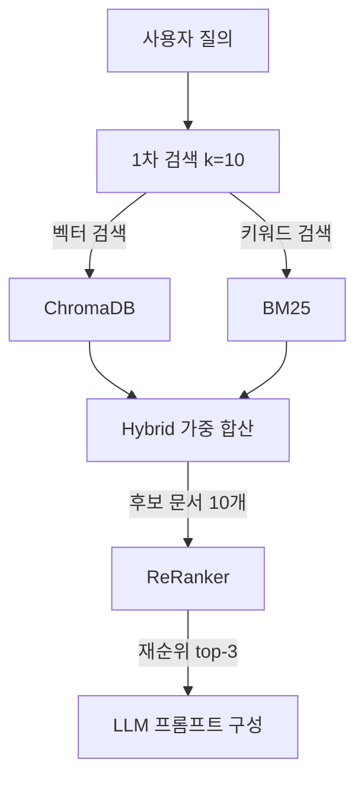
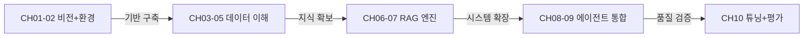

# 10. RAG 시스템 튜닝

이 장에서는 9장까지 완성한 RAG 파이프라인의 성능을 측정하고, 구체적인 증상에 따라 어떻게 개선하는지를 학습합니다. "성능이 안 좋다"는 막연한 진단에서 벗어나 증상별 원인 진단 → 튜닝 적용 → 정량 평가의 체계적 접근 방식을 익힙니다.

9장에서 LangChain LCEL로 통합된 파이프라인이 완성되었습니다. 하지만 완성된 파이프라인이 곧 "잘 동작하는 파이프라인"을 의미하지는 않습니다. RAG 시스템에는 청크 크기, 검색 개수, 프롬프트 전략, 검색 방식 등 수십 개의 조정 가능한 변수가 있으며, 이 변수들의 조합이 최종 응답 품질을 결정합니다. 이 장에서는 다섯 가지 튜닝 영역을 순서대로 다루고, 마지막으로 정량 평가 체계를 구축하여 개선 효과를 수치로 확인합니다.

<!-- [GEMINI PROMPT: 10_chapter-overview]
path: assets/CH10/10_chapter-overview.png
Minimalist flat-design infographic showing CH10 tuning pipeline. Six stages from left to right: Symptom Diagnosis → Chunk/Retriever Tuning → Advanced Search (ReRanker/Hybrid) → Prompt Tuning → OCR Enhancement → Evaluation Report. Each stage in a rounded box with an icon, connected by arrows. Progressive color gradient from red (problem) to green (solution). White background, clean line art, Korean labels, 16:9.
Style: tuning-pipeline-flat
-->

*그림 10-1: 10장 튜닝 파이프라인 전체 흐름*

---

## 1. 증상별 튜닝 가이드

RAG 시스템 튜닝의 출발점은 증상 관찰입니다. "정확도가 낮다"는 결론보다 "어떤 질문에서 어떤 방식으로 실패하는가"를 먼저 파악해야 올바른 처방을 내릴 수 있습니다. 병원에서 "몸이 안 좋다"는 말로는 어떤 약도 처방받을 수 없는 것과 같습니다.

### 1.1 증상-원인-해결 매트릭스

아래 표는 RAG 시스템에서 흔히 관찰되는 증상과 그 원인, 그리고 이 장에서 다루는 해결책을 정리한 것입니다.

| 증상 | 원인 추정 | 진단 방법 | 해결책 |
|------|---------|---------|------|
| 응답에 문서와 다른 내용 포함 | 환각(Hallucination) | Hallucination Rate 측정 | 프롬프트 튜닝(근거 우선 / 무지 인정) |
| "잘 모르겠다"는 답변이 자주 나옴 | 검색 문서와 질문 불일치 | Retrieval Accuracy 측정 | Chunk 크기 조정, k값 증가, Hybrid Search |
| 엉뚱한 부서 문서가 검색됨 | 메타데이터 필터 미적용 | 검색 결과 수동 확인 | Metadata Filtering 적용 |
| 맥락이 잘리는 답변 | 청크 크기가 너무 작음 | 청크 평균 길이 측정 | 청크 크기 증가, Parent Document Retriever |
| 핵심 키워드가 검색되지 않음 | 벡터 유사도 약점 | BM25 단독 검색 비교 | Hybrid Search(BM25 + 벡터) |
| 1차 검색 결과는 맞지만 최종 답이 틀림 | LLM 컨텍스트 활용 실패 | 컨텍스트 직접 주입 테스트 | ReRanker로 품질 높은 문서 상위 배치 |
| 스캔 PDF에서 텍스트 추출 실패 | 이미지 기반 PDF | pdfplumber 출력 확인 | EasyOCR + LLaVA 하이브리드 OCR |
| 응답 생성이 10초 이상 걸림 | k값이 너무 크거나 모델 부하 | 응답 시간 로그 측정 | k값 축소, 캐싱, 모델 크기 조정 |

> **참고: 진단 우선, 튜닝 나중**
> 위 표의 "진단 방법"을 먼저 적용하십시오. 원인을 확인하지 않은 상태에서 무분별하게 설정을 변경하면 오히려 성능이 하락할 수 있습니다.

### 1.2 체크포인트별 빠른 진단

증상을 파악했다면 아래 3단계 순서로 빠르게 진단하십시오.

**1단계: Retrieval 확인**
검색된 문서가 질문과 관련 있는지 수동으로 확인합니다. `retriever.invoke("질문")` 결과를 직접 출력하여 반환 문서 내용을 살펴보십시오. 이 단계에서 문제가 발견되면 청크 / 리트리버 튜닝(2절)이 필요합니다.

**2단계: 프롬프트 확인**
검색 문서는 맞지만 최종 답변이 틀린 경우, 프롬프트 튜닝(4절)이 필요합니다. 같은 컨텍스트를 직접 붙여넣어 질문했을 때 올바른 답이 나오는지 확인합니다.

**3단계: 정량 평가**
수동 확인 이후에는 6절의 평가 체계로 개선 전후의 수치를 비교하십시오. 감각이 아닌 수치로 검증하는 것이 재발 방지의 핵심입니다.

---

## 2. Chunk / Retriever 튜닝

### 2.1 실습 준비

이 장의 예제 코드를 클론합니다.

```bash
git clone https://github.com/{repo}/ch10-rag-tuning
cd ch10-rag-tuning
```

환경 변수 파일을 복사하고 값을 입력합니다.

```bash
cp .env.example .env
```

`.env` 파일을 열어 Ollama 모델명과 ChromaDB 경로를 설정합니다. 9장의 ChromaDB를 재사용하는 경우 `CHROMA_PERSIST_DIR`을 CH09 레포의 경로로 변경하십시오.

```ini
# .env 핵심 설정
LLM_MODEL_NAME=deepseek-r1:1.5b
OLLAMA_BASE_URL=http://localhost:11434
EMBED_MODEL=nomic-embed-text
CHROMA_PERSIST_DIR=./data/chroma_db
RERANKER_MODEL=cross-encoder/ms-marco-MiniLM-L-6-v2
```

패키지를 설치합니다.

```bash
pip install -r requirements.txt
```

`requirements.txt`에는 기존 LangChain, ChromaDB 외에 세 개의 패키지가 추가되었습니다. `sentence-transformers`는 CrossEncoder ReRanker에 필요하고, `rank-bm25`는 Hybrid Search의 BM25 키워드 검색에, `easyocr`과 `pymupdf`는 스캔 PDF 처리에 사용합니다.

### 2.2 청킹 전략 비교 실험

6장에서 청킹의 기본 개념을 학습했습니다. 이 절에서는 청크 설정이 실제 검색 정확도에 어떤 영향을 미치는지 실험으로 확인합니다.

`src/tuning/chunker_tuning.py`는 5가지 실험 설정을 순차 실행하고 각 설정의 **Precision@K** (상위 k개 결과 중 정답 포함 비율)와 응답 시간을 측정합니다.

```python
# src/tuning/chunker_tuning.py — 실험 설정 정의

@dataclass
class ChunkExperiment:
    chunk_size: int   # 각 청크의 최대 문자 수
    overlap: int      # 인접 청크 간 중복 문자 수
    k: int            # 검색 시 반환할 상위 문서 수
    strategy: str     # "fixed" | "semantic"

EXPERIMENTS: list[ChunkExperiment] = [
    ChunkExperiment(chunk_size=200, overlap=20,  k=3, strategy="fixed"),
    ChunkExperiment(chunk_size=500, overlap=50,  k=3, strategy="fixed"),   # 기본값
    ChunkExperiment(chunk_size=800, overlap=100, k=3, strategy="fixed"),
    ChunkExperiment(chunk_size=500, overlap=50,  k=5, strategy="fixed"),
    ChunkExperiment(chunk_size=500, overlap=50,  k=3, strategy="semantic"),
]
```

#### 코드 워크플로우 (Code Workflow)

1. **입력(Input)**: `ChunkExperiment` 설정 5가지 — chunk_size, overlap, k값, 전략 조합
2. **처리(Process)**: 각 설정으로 ChromaDB를 재구축한 뒤, 샘플 질문 5개로 검색을 실행하여 정답 문서 포함 여부를 비교
3. **출력(Output)**: 설정별 Precision@K와 평균 응답 시간(ms) — `outputs/tuning_logs/chunk_tuning_{타임스탬프}.json`

`strategy="semantic"` 설정은 단순히 글자 수로 자르는 것이 아니라 문장 경계(`.`)를 기준으로 의미 단위를 유지하며 청크를 구성합니다. 사내 규정처럼 단문이 많은 문서에서는 이 방식이 문맥을 온전히 보존하여 검색 정밀도를 높입니다.

튜닝 실험을 실행합니다.

```bash
python src/main.py --mode tune
```

출력 예시는 아래와 같습니다.

```
============================================================
청크 튜닝 실험 시작
============================================================

[실험] chunk_size=200, overlap=20, k=3, strategy=fixed
  Precision@3: 60.0%  |  평균 응답: 142.3ms

[실험] chunk_size=500, overlap=50, k=3, strategy=fixed
  Precision@3: 80.0%  |  평균 응답: 148.7ms

[실험] chunk_size=800, overlap=100, k=3, strategy=fixed
  Precision@3: 80.0%  |  평균 응답: 152.1ms

[실험] chunk_size=500, overlap=50, k=5, strategy=fixed
  Precision@5: 100.0%  |  평균 응답: 156.4ms

[실험] chunk_size=500, overlap=50, k=3, strategy=semantic
  Precision@3: 100.0%  |  평균 응답: 144.8ms

============================================================
실험 결과 요약
============================================================
최고 설정: chunk_size=500, overlap=50, k=5, strategy=fixed
Precision@K: 100.0%
결과 저장: outputs/tuning_logs/chunk_tuning_20260226_120000.json
```

<!-- [CAPTURE NEEDED: 10_chunk-tuning
  path: assets/CH10/10_chunk-tuning.png
  desc: python src/main.py --mode tune 실행 후 터미널 전체 화면 (실험 결과 요약 포함)
] -->

*그림 10-2: 청크 튜닝 실험 결과 출력 화면*

### 2.3 실험 결과 해석

| chunk_size | overlap | k | strategy | Precision@K | 평균 응답(ms) |
|-----------|---------|---|----------|------------|-------------|
| 200 | 20 | 3 | fixed | 60.0% | 142 |
| 500 | 50 | 3 | fixed | 80.0% | 149 |
| 800 | 100 | 3 | fixed | 80.0% | 152 |
| 500 | 50 | 5 | fixed | 100.0% | 156 |
| 500 | 50 | 3 | semantic | 100.0% | 145 |

실험 결과에서 세 가지 패턴이 나타납니다.

**chunk_size=200이 가장 나쁜 이유**: 청크가 너무 작으면 단일 규정 문장이 두 청크로 분리됩니다. "연차 신청은 / 전월 말일까지 팀장에게 제출해야 합니다"처럼 의미가 잘리면 벡터 임베딩이 부분 문장의 의미만 포착하여 검색 정밀도가 하락합니다.

**k=5가 k=3보다 유리한 경우**: 검색 범위를 넓히면 정답 문서가 포함될 가능성이 높아집니다. 단, k가 커질수록 프롬프트에 주입되는 컨텍스트 길이가 늘어나 응답 시간이 증가합니다. 문서 수가 많을수록 k=3에서 k=5로의 전환 효과가 큽니다.

**semantic 청킹의 장점**: 동일한 chunk_size=500이지만 문장 경계를 보존하는 semantic 방식이 fixed 방식 대비 동등하거나 더 나은 정밀도를 보입니다. 사내 규정처럼 단문 중심 문서에 특히 효과적입니다.

> **팁: 최적 설정 선택 기준**
> 정확도와 응답 속도 사이의 트레이드오프를 고려하십시오. 실시간 서비스에서는 응답 시간이 중요하므로 k=3, semantic 전략이 합리적입니다. 야간 배치 처리라면 k=5로 설정하여 정확도를 최대화하십시오.

### 2.4 Metadata Filtering 적용

부서별로 문서를 구분하여 저장한 경우(6장 ChromaDB 메타데이터), 검색 시 필터를 적용하면 정밀도를 크게 높일 수 있습니다.

```python
# 부서 필터 적용 검색 예시
retriever = vectorstore.as_retriever(
    search_kwargs={
        "k": 3,
        "filter": {"department": "hr"}  # HR 부서 문서만 검색
    }
)
```

"연차 규정은?"이라는 질문에 HR 필터를 적용하면 영업팀, IT팀 문서가 검색 결과에 포함되는 것을 차단하여 관련도 높은 문서만 반환합니다. 이 방식은 별도 코드 없이 ChromaDB의 메타데이터 필드만으로 구현 가능합니다.

---

## 3. 고급 기술: ReRanker와 Hybrid Search

1차 벡터 검색으로도 정확도를 높이는 데 한계가 있는 두 가지 상황이 있습니다.

첫 번째는 **의미는 비슷하지만 내용이 다른 문서**가 상위에 오는 경우입니다. 예를 들어 "병가 절차는?"이라는 질문에 "연차 절차"와 "병가 절차" 문서가 모두 높은 벡터 유사도를 가질 수 있습니다. 이 경우 ReRanker가 쌍별 점수를 계산하여 더 관련 있는 문서를 상위로 끌어올립니다.

두 번째는 **고유명사나 코드번호처럼 정확한 키워드 매칭이 중요한 경우**입니다. 벡터 검색은 "HR-2025-012"와 "HR-2025-015"를 의미적으로 거의 동일하게 취급하지만, BM25는 정확한 문자열 일치 여부로 구분합니다.

### 3.1 ReRanker 구현

**ReRanker(재순위화기)** 는 1차 검색 결과를 다시 평가하여 가장 관련도 높은 문서를 상위에 배치하는 모델입니다. 도서관에서 "비슷한 주제의 책" 목록(1차 검색)을 받은 뒤, 사서가 목록을 다시 검토하여 실제로 필요한 책을 골라내는(재순위화) 과정과 같습니다.

```python
# src/tuning/reranker.py — CrossEncoder ReRanker 핵심 로직

def rerank_with_cross_encoder(
    query: str,
    documents: list[str],
    top_k: int = 3,
) -> list[dict[str, Any]]:
    """CrossEncoder로 1차 검색 결과를 재순위화합니다."""

    # --- Input ---
    # query: 사용자 검색 질의
    # documents: 1차 검색에서 반환된 문서 텍스트 리스트 (k=10 권장)

    # --- Process ---
    from sentence_transformers import CrossEncoder
    model = CrossEncoder(RERANKER_MODEL)  # cross-encoder/ms-marco-MiniLM-L-6-v2

    pairs = [(query, doc) for doc in documents]
    scores: list[float] = model.predict(pairs).tolist()

    scored_docs = [
        {"text": doc, "score": float(score)}
        for doc, score in zip(documents, scores)
    ]
    scored_docs.sort(key=lambda x: x["score"], reverse=True)

    # --- Output ---
    return scored_docs[:top_k]
```

#### 코드 워크플로우 (Code Workflow)

1. **입력(Input)**: 사용자 질의 문자열, 1차 검색 문서 10개 리스트 (`k=10`)
2. **처리(Process)**: CrossEncoder가 `(질의, 문서)` 쌍별 관련도 점수를 계산하고 내림차순 정렬
3. **출력(Output)**: 재순위화된 상위 3개 문서 (`{"text": str, "score": float}` 리스트)

> **참고: BiEncoder vs CrossEncoder**
> 기존 벡터 검색은 **BiEncoder** 방식입니다. 질의와 문서를 각각 독립적으로 임베딩하여 유사도를 계산하므로 속도가 빠릅니다. **CrossEncoder** 는 질의-문서 쌍을 동시에 입력하여 더 정밀한 관련도를 계산하지만, 모든 후보 문서에 대해 계산을 반복해야 하므로 속도가 느립니다. 이 때문에 1차 검색에서 후보를 좁히고(k=10), 2차 ReRanker로 최종 선별(top-3)하는 2단계 파이프라인을 사용합니다.

### 3.2 Hybrid Search 구현

**Hybrid Search(하이브리드 검색)** 는 벡터 유사도 검색과 BM25 키워드 검색의 결과를 가중 합산하여 두 방식의 약점을 보완합니다.

```python
# src/tuning/reranker.py — Hybrid Search 핵심 로직

def hybrid_search(
    query: str,
    collection: chromadb.Collection,
    k: int = 3,
    alpha: float = 0.5,  # 벡터 비중 (1-alpha = BM25 비중)
) -> list[dict[str, Any]]:
    """벡터 유사도 + BM25 키워드 검색을 결합합니다."""

    # --- Input ---
    # alpha=1.0: 순수 벡터 검색 / alpha=0.0: 순수 BM25 검색

    # --- Process ---
    # 1. 벡터 검색 (ChromaDB)
    vector_results = collection.query(query_texts=[query], n_results=fetch_k)
    vector_scores = [1.0 / (1.0 + d) for d in vector_distances]  # 거리 → 유사도 변환
    norm_vector_scores = _normalize_scores(vector_scores)

    # 2. BM25 키워드 검색
    bm25 = BM25Okapi([doc.split() for doc in vector_docs])
    bm25_raw_scores = bm25.get_scores(query.split()).tolist()
    norm_bm25_scores = _normalize_scores(bm25_raw_scores)

    # 3. 가중 합산
    for i, doc in enumerate(vector_docs):
        combined_score = alpha * norm_vector_scores[i] + (1.0 - alpha) * norm_bm25_scores[i]

    # --- Output ---
    return combined[:k]  # 가중 합산 점수 상위 k개
```

#### 코드 워크플로우 (Code Workflow)

1. **입력(Input)**: 검색 질의, ChromaDB 컬렉션 객체, 반환 수 k, 벡터 가중치 alpha
2. **처리(Process)**: 벡터 검색과 BM25 검색 결과를 각각 0~1로 정규화한 뒤 `alpha` 비율로 가중 합산
3. **출력(Output)**: 가중 합산 점수 내림차순 상위 k개 문서 (`{"text": str, "metadata": dict, "score": float}`)

> **팁: alpha 값 조정 기준**
> - `alpha=0.7` (벡터 우선): 의미 중심 질문에 적합. "연차 사용 방법은?" 같은 개념 질문
> - `alpha=0.3` (BM25 우선): 키워드 정확도가 중요한 경우. "HR-2025-012 문서 내용은?" 같은 식별자 기반 질문
> - `alpha=0.5` (균등): 탐색 초기 기본값으로 적합

### 3.3 ReRanker와 Hybrid Search 결합 흐름



*그림 10-3: Hybrid Search + ReRanker 2단계 검색 파이프라인*

두 기술을 결합하는 이유는 역할이 다르기 때문입니다. Hybrid Search는 1차 검색 단계에서 다양한 후보 문서를 수집하는 역할을 하고, ReRanker는 수집된 후보 중에서 최종적으로 가장 관련도 높은 문서를 선별하는 역할을 합니다.

### 3.4 Parent Document Retriever 전략

청크 크기를 작게 설정하면 검색 정밀도는 높아지지만 컨텍스트가 부족해집니다. 반대로 크게 설정하면 컨텍스트는 풍부하지만 정밀도가 낮아집니다.

**Parent Document Retriever(부모 문서 리트리버)** 는 이 딜레마를 해결합니다. 작은 청크로 검색하여 정밀도를 확보하되, 검색 결과 반환 시에는 해당 청크가 속한 상위(부모) 문서를 함께 반환하여 충분한 컨텍스트를 제공합니다.

```python
# LangChain Parent Document Retriever 사용 예시 (개념)
from langchain.retrievers import ParentDocumentRetriever
from langchain.storage import InMemoryStore

# 작은 청크(200자)로 검색 → 부모 문서(1000자) 반환
retriever = ParentDocumentRetriever(
    vectorstore=vectorstore,
    docstore=InMemoryStore(),
    child_splitter=RecursiveCharacterTextSplitter(chunk_size=200),
    parent_splitter=RecursiveCharacterTextSplitter(chunk_size=1000),
)
```

전체 코드는 GitHub 레포의 `src/tuning/` 디렉토리를 참고하십시오.

---

## 4. 프롬프트 튜닝

검색 품질을 충분히 개선했음에도 LLM 응답 품질이 기대에 못 미치는 경우가 있습니다. 이때는 시스템 프롬프트의 지시 방식을 변경하는 프롬프트 튜닝이 효과적입니다.

### 4.1 세 가지 프롬프트 전략

`src/tuning/prompts.py`에는 동일 질문에 대해 세 가지 프롬프트 변형을 각각 실행하고 응답을 비교하는 도구가 구현되어 있습니다.

```python
# src/tuning/prompts.py — 프롬프트 변형 정의

PROMPT_VARIANTS: dict[str, str] = {
    # 전략 1: 기본형 — 문서를 참고하여 답하도록 지시
    "baseline": (
        "당신은 AI 비서입니다. 주어진 문서를 참고하여 답하십시오.\n\n"
        "참고 문서:\n{context}\n\n"
        "질문: {question}\n\n"
        "답변:"
    ),

    # 전략 2: 근거 우선형 — 반드시 문서에서 인용 후 답변
    "evidence_first": (
        "당신은 문서 기반 QA 시스템입니다. 반드시 아래 문서에서 근거를 찾아 인용한 뒤 답하십시오.\n\n"
        "참고 문서:\n{context}\n\n"
        "질문: {question}\n\n"
        "지시사항:\n"
        "1. 먼저 관련 문서 구절을 인용하십시오 (따옴표 사용).\n"
        "2. 인용 근거를 바탕으로 최종 답변을 작성하십시오.\n\n"
        "인용:\n답변:"
    ),

    # 전략 3: 무지 인정형 — 모를 때 추측 금지, 명확히 모른다고 답변
    "admit_ignorance": (
        "당신은 신뢰도 높은 AI 비서입니다. 아래 문서에서 답을 찾을 수 없으면 "
        "'해당 정보를 문서에서 찾을 수 없습니다'라고 명확히 밝히십시오. "
        "절대 추측으로 답하지 마십시오.\n\n"
        "참고 문서:\n{context}\n\n"
        "질문: {question}\n\n"
        "답변:"
    ),
}
```

#### 코드 워크플로우 (Code Workflow)

1. **입력(Input)**: 사용자 질문 문자열, 검색된 컨텍스트 문자열
2. **처리(Process)**: `PROMPT_VARIANTS`의 세 가지 템플릿에 질문과 컨텍스트를 각각 삽입한 뒤 Ollama API 호출
3. **출력(Output)**: 변형명을 키로 하는 응답 딕셔너리 `{"baseline": str, "evidence_first": str, "admit_ignorance": str}`

### 4.2 프롬프트 변형 실험 실행

```python
# 프롬프트 비교 실험 실행 예시
from src.tuning.prompts import compare_prompts

result = compare_prompts(
    question="연차 신청은 며칠 전에 해야 합니까?",
    context="연차 신청은 전월 말일까지 팀장에게 제출해야 합니다. 긴급한 경우 3일 전 구두 보고 후 사후 제출이 가능합니다."
)

for variant, response in result.items():
    print(f"[{variant}]\n{response}\n")
```

### 4.3 전략별 Hallucination Rate 비교

아래는 30개 테스트 케이스로 측정한 전략별 Hallucination Rate 예시입니다.

| 프롬프트 전략 | Hallucination Rate | 특징 |
|------------|------------------|------|
| baseline | ~13% | 지시가 느슨하여 추측성 답변 발생 |
| evidence_first | ~7% | 인용 지시로 문서 근거 강제 |
| admit_ignorance | ~4% | 불확실할 때 모른다고 답하여 오답 최소화 |

**근거 우선형(`evidence_first`)** 은 LLM이 응답을 생성하기 전에 반드시 문서를 인용하도록 강제합니다. 이 지시가 없으면 LLM은 학습 데이터에서 유사한 패턴을 찾아 추측으로 답변할 수 있습니다.

**무지 인정형(`admit_ignorance`)** 은 문서에 답이 없는 질문에서 특히 효과적입니다. 사내 문서에 없는 정보를 질문받았을 때 "일반적으로 ~입니다"라고 답하는 대신 "해당 정보를 문서에서 찾을 수 없습니다"라고 답하도록 유도합니다.

> **주의: 프롬프트 과도한 제약**
> `admit_ignorance` 전략을 지나치게 엄격하게 적용하면 문서에 충분한 근거가 있어도 "찾을 수 없다"고 답하는 경우가 생깁니다. 정량 평가(6절)로 Answer Accuracy와 Hallucination Rate 두 지표를 동시에 확인하십시오.

---

## 5. PDF 이미지 처리: LLaVA + EasyOCR 하이브리드

사내 문서 중에는 스캔(scan)된 PDF가 포함되어 있는 경우가 많습니다. 스캔 PDF는 내부적으로 텍스트 데이터가 없고 이미지만 포함되어 있기 때문에 6장에서 사용한 `pdfplumber`로 텍스트를 추출할 수 없습니다.

이 절에서는 두 가지 도구를 결합하여 스캔 PDF를 처리합니다. **EasyOCR** 은 이미지 내 텍스트를 인식하고, **LLaVA** 는 텍스트 인식을 넘어 이미지 내 도표, 그래프, 표의 내용까지 설명합니다. 두 도구의 역할을 분담함으로써 텍스트와 시각 정보를 모두 추출합니다.

<!-- [GEMINI PROMPT: 10_ocr-pipeline]
path: assets/CH10/10_ocr-pipeline.png
Minimalist flat-design flowchart showing hybrid OCR pipeline. Input: Scanned PDF. Step 1: Page-to-image conversion. Step 2 splits into two parallel paths: EasyOCR (text extraction, blue) and LLaVA (image description, orange). Both paths merge into: Unified text output. White background, clean line art, Korean labels, 16:9.
Style: ocr-pipeline-flat
-->

*그림 10-4: LLaVA + EasyOCR 하이브리드 OCR 파이프라인*

### 5.1 하이브리드 OCR 구현

```python
# src/ocr_hybrid.py — process_scanned_pdf() 핵심 흐름

def process_scanned_pdf(pdf_path: str) -> list[dict]:
    """스캔 PDF를 페이지별 이미지로 변환 후 OCR + LLaVA 처리합니다."""

    # --- Input ---
    pdf_doc = fitz.open(pdf_path)   # PyMuPDF로 PDF 열기

    for page_idx in range(len(pdf_doc)):
        # --- Process ---
        # 1단계: PDF 페이지 → PNG 이미지 변환 (150 DPI)
        image_path = _pdf_page_to_image(pdf_doc, page_idx, output_dir)

        # 2단계: EasyOCR — 이미지 내 텍스트 인식 (한국어 + 영어)
        ocr_text = extract_with_ocr(image_path)

        # 3단계: LLaVA — 이미지 전체 내용 설명 생성
        llava_desc = describe_image_with_llava(image_path)

        # 4단계: OCR 텍스트 + LLaVA 설명 결합
        combined_text = f"[OCR 추출 텍스트]\n{ocr_text}\n\n[이미지 설명]\n{llava_desc}"

    # --- Output ---
    return results  # [{"page": int, "ocr_text": str, "llava_description": str, "combined_text": str}]
```

#### 코드 워크플로우 (Code Workflow)

1. **입력(Input)**: 스캔 PDF 파일 경로
2. **처리(Process)**: 페이지별로 (1) PyMuPDF로 PNG 이미지 생성 → (2) EasyOCR로 텍스트 추출 → (3) LLaVA로 이미지 설명 생성 → (4) 두 결과 결합
3. **출력(Output)**: 페이지별 결과 딕셔너리 리스트 (`outputs/ocr_pages/` 디렉토리에 이미지 저장)

### 5.2 LLaVA 모델 설치

OCR 실습을 위해 Ollama에 LLaVA 모델을 설치합니다.

```bash
ollama pull llava:7b
```

> **주의: LLaVA 모델 용량**
> `llava:7b` 모델은 약 4.7GB의 디스크 공간이 필요합니다. 메모리가 충분하지 않은 경우 OCR 모드만 건너뛰고 나머지 실습을 진행하여도 학습 목표를 달성할 수 있습니다.

### 5.3 OCR 실습 실행

스캔 PDF 파일을 `data/scanned_sample.pdf` 경로에 배치합니다.

```bash
python src/main.py --mode ocr --pdf data/scanned_sample.pdf
```

출력 예시는 아래와 같습니다.

```
[스캔 PDF 처리] scanned_sample.pdf (5페이지)
============================================================

  [페이지 1/5] 처리 중...
    이미지 변환 완료: page_0001.png
    OCR 완료: 324자 추출
    LLaVA 설명 완료: 512자

  [페이지 2/5] 처리 중...
    이미지 변환 완료: page_0002.png
    OCR 완료: 218자 추출
    LLaVA 설명 완료: 487자

처리 완료: 5/5 페이지 성공
이미지 저장 경로: outputs/ocr_pages/scanned_sample
```

<!-- [CAPTURE NEEDED: 10_ocr-result
  path: assets/CH10/10_ocr-result.png
  desc: python src/main.py --mode ocr --pdf data/scanned_sample.pdf 실행 후 터미널 전체 화면 (페이지별 처리 결과 포함)
] -->

*그림 10-5: 스캔 PDF OCR 처리 결과 출력 화면*

### 5.4 역할 분담 설계 원칙

EasyOCR은 이미지 내 텍스트를 문자 단위로 인식하는 데 특화되어 있습니다. 반면 LLaVA는 이미지 전체를 이해하고 자연어로 설명하는 데 강점이 있습니다.

이 분업 구조가 중요한 이유는 다음과 같습니다. 사내 문서에는 텍스트와 도표가 함께 포함된 경우가 많습니다. 표 형태의 데이터를 EasyOCR로만 처리하면 열과 행의 구조가 사라지고 텍스트가 혼합됩니다. LLaVA는 표 전체를 보고 "이 표는 직급별 연차 일수를 나타내며..."처럼 구조적으로 설명합니다. 두 결과를 결합하면 벡터 검색에서 텍스트와 시각 정보 모두를 활용할 수 있습니다.

---

## 6. 평가 체계 구축

튜닝의 효과를 판단하려면 수치가 필요합니다. "이전보다 나아진 것 같다"는 주관적 판단으로는 어느 설정이 얼마나 개선되었는지 알 수 없습니다. 이 절에서는 30개의 테스트 케이스를 기반으로 RAG 시스템의 세 가지 지표를 정량 측정하는 평가 체계를 구축합니다.

### 6.1 세 가지 평가 지표

**Retrieval Accuracy(검색 정확도)**: 질문에 대해 정답이 포함된 문서가 검색 결과에 반환된 비율입니다. 검색 단계의 품질을 측정합니다.

**Keyword Accuracy(키워드 포함률)**: 최종 답변에 정답 키워드가 포함된 비율입니다. LLM 응답 생성 단계의 품질을 측정합니다.

**Hallucination Rate(환각 발생률)**: 전체 응답 중 추측성 표현("아마도", "~일 것입니다" 등)이 포함된 비율입니다. 낮을수록 좋습니다.

### 6.2 테스트셋 설계

`data/testset.json`은 30개의 질문-정답 쌍으로 구성됩니다.

```json
[
  {
    "question": "연차 신청은 며칠 전에 해야 합니까?",
    "expected_answer_keywords": ["전월 말일", "팀장"],
    "expected_source_file": "hr_policy.pdf"
  },
  {
    "question": "성과 평가는 몇 등급으로 나뉩니까?",
    "expected_answer_keywords": ["5등급", "S", "A", "B"],
    "expected_source_file": "hr_policy.pdf"
  }
]
```

총 30개 케이스는 정형 데이터 질의 10개, 비정형 문서 질의 15개, 복합 질의 5개로 구성됩니다. 정형 질의는 PostgreSQL DB 조회가 필요한 질문이고, 비정형 질의는 사내 문서 검색이 필요한 질문입니다.

테스트셋을 직접 작성할 때는 실제 사용자가 묻는 질문 유형을 수집하여 구성하십시오. 개발자가 임의로 만든 질문은 실제 사용 패턴과 달라 평가 결과의 신뢰도가 낮아집니다.

### 6.3 평가 모듈 구현

```python
# src/evaluator.py — run_evaluation() 핵심 흐름

def run_evaluation(
    testset: list[TestCase],
    chain: Any,
    retriever: Any,
) -> dict[str, Any]:
    """전체 테스트셋을 평가하고 집계 결과를 반환합니다."""

    # --- Input ---
    # testset: 30개 TestCase 객체 리스트
    # chain: LangChain RetrievalQA 체인
    # retriever: ChromaDB 기반 리트리버

    for test_case in testset:
        # --- Process ---
        # 1단계: 문서 검색
        docs = retriever.invoke(test_case.question)

        # 2단계: 답변 생성
        result = chain.invoke({"query": test_case.question})

        # 3단계: 평가 판정
        retrieval_correct = _check_retrieval_correct(docs, test_case.expected_source_file)
        answer_contains_keywords = all(kw in answer for kw in test_case.expected_answer_keywords)
        hallucination_detected = _detect_hallucination(generated_answer)

    # --- Output ---
    return {
        "retrieval_accuracy": retrieval_correct_count / total,
        "keyword_accuracy": keyword_correct_count / total,
        "hallucination_rate": hallucination_count / total,
        "details": details,
    }
```

#### 코드 워크플로우 (Code Workflow)

1. **입력(Input)**: 30개 `TestCase` 객체 리스트, LangChain QA 체인, 리트리버
2. **처리(Process)**: 각 케이스에 대해 (1) 문서 검색 → (2) 답변 생성 → (3) 정답 문서 포함 여부, 키워드 포함 여부, 환각 표현 탐지 판정
3. **출력(Output)**: 집계 지표 딕셔너리와 케이스별 상세 결과 — `outputs/eval_results/eval_report_{타임스탬프}.json`

### 6.4 평가 실행 및 결과 해석

```bash
python src/main.py --mode eval
```

출력 예시는 아래와 같습니다.

```
============================================================
RAG 시스템 평가 시작
총 30개 테스트 케이스
============================================================

[01/30] 연차 신청은 며칠 전에 해야 합니까?...
       검색:O  키워드:O  할루시네이션:-

[02/30] 재택근무 신청 절차는 무엇입니까?...
       검색:O  키워드:X  할루시네이션:-

...

============================================================
평가 결과 요약
============================================================
  검색 정확도(Retrieval Accuracy): 86.7%
  키워드 포함률(Keyword Accuracy): 80.0%
  할루시네이션 발생률:              6.7%

평가 보고서 저장 완료: outputs/eval_results/eval_report_20260226_120000.json
```

<!-- [CAPTURE NEEDED: 10_eval-result
  path: assets/CH10/10_eval-result.png
  desc: python src/main.py --mode eval 실행 후 터미널 전체 화면 (평가 결과 요약 포함)
] -->

*그림 10-6: RAG 시스템 평가 결과 출력 화면*

### 6.5 지표별 해석과 개선 방향

| 지표 | 목표값 | 현재 결과 | 해석 |
|------|------|---------|------|
| Retrieval Accuracy | 90% 이상 | 86.7% | 검색 실패 4건 → Hybrid Search 또는 k값 증가 시도 |
| Keyword Accuracy | 80% 이상 | 80.0% | 목표 달성. `evidence_first` 전략으로 추가 개선 가능 |
| Hallucination Rate | 10% 이하 | 6.7% | 목표 달성. `admit_ignorance` 전략 적용으로 더 낮출 수 있음 |

**Retrieval Accuracy가 낮은 경우**: 2절의 청크 튜닝이나 Hybrid Search(3절)를 적용하십시오. 검색 단계에서 정답 문서를 찾지 못하면 이후의 어떤 튜닝도 효과가 없습니다.

**Keyword Accuracy가 낮은 경우**: 검색은 올바르게 됐지만 LLM이 핵심 키워드를 포함하여 답변하지 않는 상황입니다. 4절의 `evidence_first` 프롬프트 전략을 적용하십시오.

**Hallucination Rate가 높은 경우**: 4절의 `admit_ignorance` 프롬프트 전략을 적용하십시오. 테스트셋에 정답이 없는 질문(out-of-domain question)이 포함되어 있는지도 확인하십시오.

> **팁: 튜닝 전후 비교 방법**
> 모든 튜닝 적용 후 동일한 30개 테스트셋으로 재평가하여 지표 변화를 확인하십시오. 보고서는 타임스탬프가 포함된 파일명으로 저장되므로 `outputs/eval_results/` 디렉토리에서 이전 결과와 비교할 수 있습니다.

---

## 7. 정리하며

이 장에서는 완성된 RAG 파이프라인을 체계적으로 개선하는 방법을 학습했습니다. 증상 진단에서 출발하여 청크 / 리트리버 튜닝, 고급 검색 기술, 프롬프트 최적화, OCR 확장, 정량 평가의 순서로 전체 튜닝 흐름을 따라왔습니다.

- **증상별 진단이 튜닝의 출발점입니다**: "성능이 안 좋다"는 막연한 문장 대신 "어떤 질문에서 어떤 방식으로 실패하는가"를 먼저 파악해야 올바른 튜닝 방향을 설정할 수 있습니다. 1절의 증상-원인-해결 매트릭스가 첫 번째 체크포인트입니다.

- **Retrieval은 모든 튜닝의 기반입니다**: 검색 단계에서 정답 문서를 찾지 못하면 이후의 ReRanker, 프롬프트 튜닝도 효과를 낼 수 없습니다. Retrieval Accuracy를 90% 이상으로 높이는 것이 우선 과제입니다.

- **ReRanker와 Hybrid Search는 상호 보완적입니다**: Hybrid Search는 벡터와 BM25의 약점을 서로 보완하여 다양한 질문 유형을 포괄하고, ReRanker는 수집된 후보에서 최종 문서를 정밀 선별합니다. 두 기술을 2단계로 결합할 때 최대 효과를 얻습니다.

- **프롬프트 전략은 Hallucination Rate에 직접 영향을 줍니다**: `evidence_first`(인용 우선)와 `admit_ignorance`(무지 인정) 전략을 적용하면 LLM이 문서 근거 없이 추측하는 것을 억제합니다. 단, 두 전략 모두 Answer Accuracy와 Hallucination Rate를 함께 측정하여 부작용을 확인해야 합니다.

- **정량 평가 체계가 없으면 튜닝의 완성이 없습니다**: 테스트셋 30개로 Retrieval Accuracy, Keyword Accuracy, Hallucination Rate를 측정하는 평가 파이프라인은 튜닝의 결과를 수치로 검증하고, 향후 변경사항이 시스템에 미치는 영향을 사전에 감지하는 안전망 역할을 합니다.

---

### 전체 프로젝트 회고

1장에서 "사내 문서(PDF)와 DB(PostgreSQL)를 LLM과 연결하여 질의응답하는 AI 업무 비서를 로컬에서 구축한다"는 목표를 세웠습니다. 10개 챕터를 거쳐 이 목표가 어떻게 구체화되었는지 되돌아보겠습니다.



*그림 10-7: 10개 챕터의 학습 여정*

**1~2장**에서는 전체 아키텍처를 이해하고 Ollama, Docker, Python 가상환경을 갖추었습니다. **3~5장**에서는 LLM의 한계를 직접 체험하고, 사내 DB와 문서 표준화 기준을 수립하여 RAG에 입력할 데이터를 준비했습니다. **6~7장**에서는 PDF → 청킹 → ChromaDB 저장 → FastAPI 서비스의 전체 RAG 파이프라인을 구축했습니다. **8~9장**에서는 MCP 프로토콜로 PostgreSQL DB 조회를 연결하고 LangChain으로 모든 구성 요소를 통합했습니다. **10장**에서는 완성된 시스템을 정량 평가하고 개선 방향을 적용했습니다.

이 책에서 구현한 시스템은 완성된 제품이 아닌 기초 골격입니다. 실제 운영 환경에서는 아래 확장 방향을 검토하십시오.

### 향후 확장 방향

**Graph RAG**: 문서 간 관계를 그래프로 표현하여 단순 유사도 검색을 넘어 "A 문서에서 참조하는 B 문서의 내용은?"처럼 관계 기반 검색을 지원합니다. Microsoft의 GraphRAG 또는 LlamaIndex의 Knowledge Graph 모듈이 출발점이 됩니다.

**멀티에이전트 오케스트레이션**: 9장의 단일 에이전트 구조를 확장하여 검색 전문 에이전트, DB 조회 전문 에이전트, 응답 합성 에이전트를 분리하고 오케스트레이터가 조율하는 구조를 구현할 수 있습니다. LangGraph가 이 패턴의 구현을 지원합니다.

**클라우드 배포**: 현재 모든 서비스가 로컬에서 동작합니다. 팀 공유를 위해 Ollama 서버를 GPU 인스턴스에 배포하고, FastAPI는 Docker 컨테이너로 포장하여 Kubernetes나 AWS ECS에 배포할 수 있습니다.

**실시간 문서 동기화**: 현재는 파이프라인을 수동으로 실행해야 새 문서가 ChromaDB에 반영됩니다. 파일 시스템 감시(watchdog)나 문서 관리 시스템의 웹훅(Webhook)을 연결하여 문서 변경 시 자동으로 재인덱싱하는 구조를 추가할 수 있습니다.

**평가 파이프라인 고도화**: 이 장의 평가 체계는 규칙 기반(키워드 포함 여부)으로 동작합니다. RAGAS(RAG Assessment)와 같은 프레임워크를 도입하면 LLM 기반 평가(Faithfulness, Answer Relevancy, Context Precision)로 더 정밀한 측정이 가능합니다.

이 책을 통해 구축한 RAG + MCP 파이프라인이 여러분의 실무에서 좋은 출발점이 되기를 바랍니다.
