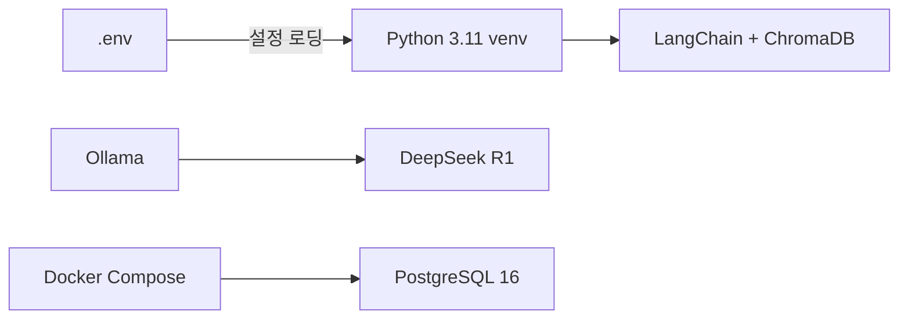

# CH02 개발 환경 구축

> AI 업무 비서 구축: RAG + MCP 실전 가이드 - 2장 실습 코드

## 목적 및 학습 목표

- Ollama를 설치하고 DeepSeek R1 모델을 로컬에 다운로드할 수 있다.
- Docker Compose로 PostgreSQL 16 컨테이너를 구동하고 초기 접속을 확인할 수 있다.
- Python 3.11 가상환경을 생성하고 `requirements.txt` 기반으로 패키지를 설치할 수 있다.
- `.env` 파일로 설정을 분리하고, `config.py`의 LLM Provider 스위칭 구조를 이해할 수 있다.

## 전체 구조



## 실행 환경

- Python 3.11 이상
- Docker Desktop (PostgreSQL 컨테이너 구동용)
- Ollama (로컬 LLM 런타임)
- 권장 사양: RAM 16GB 이상, 여유 디스크 50GB 이상

## 파일 구조

```
CH02_개발환경구축/
├── README.md                 <- 이 파일
├── docker-compose.yml        <- PostgreSQL + pgAdmin 컨테이너 정의
├── requirements.txt          <- Python 패키지 의존성 (버전 고정)
├── .env.example              <- 환경 변수 템플릿
├── .gitignore
├── init/
│   └── 01_schema_and_data.sql  <- DB 초기화 스크립트 (샘플 데이터 포함)
├── src/
│   ├── __init__.py
│   ├── config.py             <- 환경 변수 로딩 및 LLM Provider 스위칭
│   └── verify_env.py         <- 환경 전체 동작 확인 스크립트
├── tests/
│   └── test_config.py        <- config.py 단위 테스트
└── outputs/                  <- 실행 결과물 (.gitignore 대상)
```

---

## 섹션 1: Ollama 설치 및 DeepSeek R1 모델 다운로드

### macOS / Linux

```bash
curl -fsSL https://ollama.com/install.sh | sh
```

### Windows (WSL2 환경에서 실행)

```bash
curl -fsSL https://ollama.com/install.sh | sh
```

설치 후 Ollama 서버를 실행합니다.

```bash
ollama serve
```

새 터미널을 열어 DeepSeek R1 모델을 다운로드합니다.

```bash
ollama pull deepseek-r1
```

> RAM이 16GB 미만이라면 `ollama pull deepseek-r1:7b` 명령으로 7B 경량 모델을 받으십시오.

설치 확인 명령을 실행합니다.

```bash
ollama run deepseek-r1 "안녕하세요"
```

<!-- [캡처 사진 삽입 위치: ollama run deepseek-r1 첫 응답 터미널 전체 화면] -->

---

## 섹션 2: PostgreSQL 컨테이너 구동

이 프로젝트 폴더에서 아래 명령을 실행합니다.

```bash
docker-compose up -d
```

컨테이너가 정상적으로 실행되었는지 확인합니다.

```bash
docker-compose ps
```

### 예상 결과

```
NAME             IMAGE              COMMAND                  SERVICE    CREATED         STATUS                   PORTS
rag_pgadmin      dpage/pgadmin4     "/entrypoint.sh"         pgadmin    5 seconds ago   Up 4 seconds             0.0.0.0:5050->80/tcp
rag_postgres     postgres:16        "docker-entrypoint.s…"   postgres   5 seconds ago   Up 4 seconds (healthy)   0.0.0.0:5432->5432/tcp
```

> `STATUS` 열에 `(healthy)` 가 표시되면 PostgreSQL이 준비 완료 상태입니다.

pgAdmin 웹 인터페이스는 브라우저에서 `http://localhost:5050` 으로 접속합니다.

<!-- [캡처 사진 삽입 위치: pgAdmin 로그인 화면 전체 캡처] -->

---

## 섹션 3: Python 가상환경 및 패키지 설치

### macOS / Linux

```bash
python3 -m venv venv
source venv/bin/activate
pip install -r requirements.txt
```

### Windows (WSL2 또는 PowerShell)

```bash
python -m venv venv
venv\Scripts\activate
pip install -r requirements.txt
```

설치 완료 후 가상환경이 활성화된 상태에서 패키지 목록을 확인합니다.

```bash
pip list
```

---

## 섹션 4: 환경 변수(.env) 구성

`.env.example` 파일을 복사하여 `.env` 파일을 생성합니다.

```bash
cp .env.example .env
```

`.env` 파일을 텍스트 편집기로 열어 필요한 값을 확인합니다.
대부분의 기본값을 그대로 사용해도 됩니다. PostgreSQL 비밀번호만 변경하면 됩니다.

```bash
# 예시 (nano 편집기 사용)
nano .env
```

---

## 환경 전체 동작 확인 (verify_env.py)

가상환경이 활성화된 상태에서 아래 명령을 실행합니다.

```bash
python src/verify_env.py
```

### 예상 결과 (모든 항목 통과 시)

```
=======================================================
  2장 개발 환경 구축 — 동작 확인
  AI 업무 비서 구축: RAG + MCP 실전 가이드
=======================================================

[1] Python 버전 확인
  [OK] Python 3.11.9

[2] .env 파일 확인
  [OK] .env 파일 확인: /path/to/CH02_개발환경구축/.env

[3] 환경 변수 로딩 (config.py)
  [OK] 환경 변수 로딩 성공 (LLM_PROVIDER=ollama)

[4] Python 패키지 설치 확인
  [OK] python-dotenv
  [OK] langchain
  [OK] chromadb
  [OK] psycopg2-binary
  [OK] httpx
  [OK] fastapi

[5] Ollama 서버 연결 확인
  [OK] Ollama 서버 응답 확인 (URL: http://localhost:11434)
       다운로드된 모델: deepseek-r1:latest

[6] PostgreSQL 접속 확인
  [OK] PostgreSQL 접속 성공
       PostgreSQL 16.x on x86_64-pc-linux-gnu...

=======================================================
  결과: 전체 통과 (6/6)

  개발 환경이 정상적으로 구축되었습니다.
  3장으로 넘어가십시오.
=======================================================
```

<!-- [캡처 사진 삽입 위치: verify_env.py 전체 통과 터미널 전체 화면] -->

> **주의**: 위 출력은 실제 실행 결과를 그대로 복사한 것입니다. 독자의 터미널 출력과 한 글자씩 비교하여 디버깅하십시오.

---

## 자주 묻는 오류

| 오류 메시지 | 원인 | 해결 방법 |
|------------|------|----------|
| `[FAIL] Ollama 서버에 연결할 수 없습니다` | Ollama 서버 미실행 | `ollama serve` 명령 실행 |
| `[FAIL] PostgreSQL 접속 실패` | 컨테이너 미실행 또는 포트 충돌 | `docker-compose up -d`, 포트 5432 충돌 확인 |
| `ModuleNotFoundError` | 가상환경 미활성화 또는 패키지 미설치 | `source venv/bin/activate` 후 `pip install -r requirements.txt` |
| `[FAIL] .env 파일이 없습니다` | .env 미생성 | `cp .env.example .env` 실행 |
| OOM / 응답 매우 느림 | RAM 부족 | `OLLAMA_MODEL=deepseek-r1:7b` 로 변경 |
| `Address already in use` (포트 5432) | 다른 PostgreSQL 프로세스 실행 중 | 기존 프로세스 종료 또는 `.env`의 `POSTGRES_PORT` 변경 |

---

## 단위 테스트 실행

가상환경이 활성화된 상태에서 아래 명령을 실행합니다.

```bash
pytest tests/test_config.py -v
```

### 예상 결과

```
tests/test_config.py::TestGetLlmConfig::test_ollama_provider_returns_correct_keys PASSED
tests/test_config.py::TestGetLlmConfig::test_unsupported_provider_exits PASSED
tests/test_config.py::TestGetPostgresUrl::test_url_format_is_correct PASSED
tests/test_config.py::TestGetPostgresUrl::test_url_contains_all_components PASSED
tests/test_config.py::TestRequireEnv::test_missing_env_var_exits PASSED
tests/test_config.py::TestRequireEnv::test_existing_env_var_returns_value PASSED

6 passed in 0.xxs
```

---

## 컨테이너 종료

실습을 마치면 아래 명령으로 컨테이너를 종료합니다.

```bash
# 컨테이너만 중지 (데이터 유지)
docker-compose down

# 컨테이너 + 볼륨 삭제 (데이터 초기화, 처음부터 다시 시작할 때)
docker-compose down -v
```
