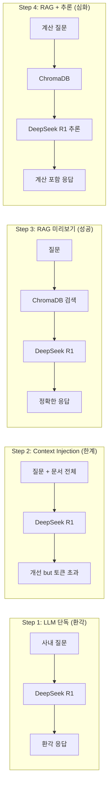

# CH03 — LLM의 한계와 RAG의 필요성

> AI 업무 비서 구축: RAG + MCP 실전 가이드 - 3장 실습 코드

## 목적 및 학습 목표

- LLM 단독 사용 시 발생하는 환각(Hallucination) 현상을 직접 체험합니다.
- Context Injection의 효과와 토큰 한계라는 근본적 제약을 확인합니다.
- 인메모리 ChromaDB와 LCEL 파이프라인으로 RAG의 동작 원리를 이해합니다.
- 청킹 없음 vs 청킹 있음의 검색 정밀도 차이를 직접 비교합니다.
- RAG가 단순 검색을 넘어 LLM의 계산·추론 능력과 결합하는 방식을 확인합니다.

## 실행 환경

- Python 3.11+
- Ollama (로컬 LLM 런타임)
- DeepSeek R1 모델 (LLM)
- nomic-embed-text 모델 (임베딩, 03번·04번 스크립트에서 필요)
- ChromaDB 0.6+ (인메모리 전용 — 이 챕터에서는 디스크 저장 없음)

## 사전 준비 — Ollama 모델 다운로드

이 챕터는 PostgreSQL이나 Docker가 필요하지 않습니다.
Ollama와 두 가지 모델만 다운로드하면 됩니다.

```bash
# Ollama 실행 확인
ollama serve

# LLM 모델 다운로드 (01~04번 스크립트 공통)
ollama pull deepseek-r1:1.5b

# 임베딩 모델 다운로드 (03~04번 스크립트에서 필요)
ollama pull nomic-embed-text
```

> 사양이 높은 환경에서는 `deepseek-r1:7b` 또는 `deepseek-r1:8b`를 사용할 수 있습니다.
> `.env` 파일의 `OLLAMA_MODEL` 값을 변경하십시오.

## 설치 및 실행

### macOS / Linux

```bash
python3 -m venv venv
source venv/bin/activate
pip install -r requirements.txt
```

### Windows (WSL2)

```bash
python -m venv venv
venv\Scripts\activate
pip install -r requirements.txt
```

환경 변수를 설정합니다.

```bash
cp .env.example .env
```

`.env` 파일을 열어 `OLLAMA_MODEL`과 `EMBED_MODEL`을 확인합니다.
기본값으로 실행하려면 수정 없이 그대로 사용하면 됩니다.

## 실행 순서

4개의 스크립트를 순서대로 실행하여 LLM 한계 → RAG 필요성의 흐름을 체험합니다.

```bash
# Step 1: LLM 단독 호출 — 환각 체험
python src/01_llm_only.py

# Step 2: Context Injection — 응답 개선 + 토큰 한계 확인
python src/02_context_injection.py

# Step 3: RAG 미리보기 — 청킹 없음 vs 청킹 있음 비교
python src/03_rag_preview.py

# Step 4: RAG + 추론 — 계산 질문으로 DeepSeek R1 추론 능력 확인
python src/04_rag_reasoning.py
```

## 단계별 기대 출력

| 스크립트 | 핵심 질문 | 기대 결과 |
|---------|----------|---------|
| `01_llm_only.py` | 신입사원 연차 규정? | 환각: 일반론 또는 지어낸 규정 |
| `02_context_injection.py` | 동일 (문서 포함) | 개선된 응답 + 토큰 경고 출력 |
| `03_rag_preview.py` | 리프레시 데이 규정? | Part A: 전체 문서 반환 / Part B: 관련 청크만 반환 |
| `04_rag_reasoning.py` | 리프레시 데이 몇 번 남았어? | 6 - 2 = 4번 계산 포함 답변 |

## CH03 vs CH06 차이점

이 챕터(CH03)는 RAG의 개념 체험을 목적으로 합니다.
실제 프로덕션 수준의 RAG 구현은 6장(벡터 DB 구축)에서 진행합니다.

|  | CH03 (미리보기) | CH06 (실전 구현) |
|--|----------------|----------------|
| 데이터 | 하드코딩된 3개 문서 | 실제 PDF 파일 |
| 청킹 | 간단한 문자 단위 분할 | fixed-size / semantic 청킹 |
| ChromaDB | 인메모리 (재실행 시 초기화) | 영속화 (디스크 저장) |
| 목적 | "RAG가 이런 것이다" 체험 | 실제 사내 문서 검색 시스템 구축 |

## 전체 구조



## 자주 발생하는 오류

| 오류 메시지 | 원인 | 해결 방법 |
|-----------|------|---------|
| `ConnectionRefusedError` | Ollama 서버 미실행 | `ollama serve` 실행 |
| `모델을 찾을 수 없습니다` | 모델 미다운로드 | `ollama pull deepseek-r1:1.5b` |
| `벡터스토어 생성 실패` | nomic-embed-text 미설치 | `ollama pull nomic-embed-text` |
| 응답이 매우 느림 | RAM 부족 또는 CPU 모드 | 더 작은 모델(deepseek-r1:1.5b) 사용 |

## 다음 챕터

4장에서는 사내 시스템(PostgreSQL + FastAPI CRUD API)을 Docker로 구동하고
MCP(Model Context Protocol) 개념을 학습합니다.
