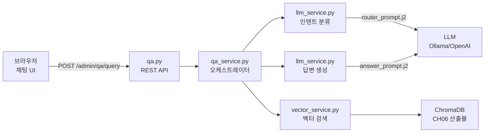

# CH07 RAG Q&A 엔진 구현

> RAG 기반 사내 AI 비서 구축 — 7장 실습 코드

## 목적 및 학습 목표

- FastAPI 위에 RAG Q&A 엔진 서비스를 구현합니다.
- Jinja2 프롬프트 템플릿으로 인텐트 라우팅을 구현합니다.
- 사내 문서(PDF)를 직접 인제스트하여 ChromaDB를 구축합니다.
- LLM (Ollama / OpenAI) 답변 생성 파이프라인을 완성합니다.
- 채팅 UI(AJAX)에서 질문 → 출처 카드 표시까지 전체 흐름을 실습합니다.

## 전체 구조



## 실행 환경

- Python 3.11+
- Ollama 설치 및 실행 (`ollama serve`)
- Ollama 모델 Pull: `ollama pull deepseek-r1:1.5b` 및 `ollama pull nomic-embed-text`

## 사양별 모델 선택 가이드

RAM 용량에 따라 Vision 모델과 LLM 모델을 선택합니다.

| RAM | Vision 모델 (`VISION_MODEL`) | 채팅 LLM (`LLM_MODEL_NAME`) | 인제스트 예상 시간(파일당) |
|-----|------------------------------|-----------------------------|-----------------------------|
| 8GB 이하 | `moondream` | `deepseek-r1:1.5b` | 1-2분 |
| 16GB | `llava:7b` | `deepseek-r1:1.5b` | 3-5분 |
| 32GB+ | `llava:13b` | `qwen2.5:7b` | 1-2분 |

> **권장**: RAM 8GB 이하 환경에서는 `--file` 옵션으로 한 파일씩 테스트한 뒤 전체 인제스트를 진행하십시오.

## 사전 준비

### 1. Ollama 모델 준비

```bash
ollama pull deepseek-r1:1.5b
ollama pull nomic-embed-text
```

Vision LLM (ingest.py 사용 시 추가 설치):

```bash
ollama pull llava:7b        # 중사양(RAM 16GB) 권장
# 저사양: ollama pull moondream
# 고사양: ollama pull llava:13b
```

### 2. 문서 인제스트 (ChromaDB 생성)

`data/docs/` 폴더의 PDF 파일을 읽어 ChromaDB를 생성합니다.

```bash
python scripts/ingest.py
```

파일 지정 인제스트 (저사양 환경 권장):

```bash
python scripts/ingest.py --file HR_사내규정_v1.0.pdf
```

DB 초기화 후 전체 재인제스트:

```bash
python scripts/ingest.py --reset
```

## 설치 및 실행

이 챕터의 예제 코드 저장소를 클론합니다.

```bash
git clone https://github.com/{repo}/CH07_RAG_QA엔진구현
```

CH07_RAG_QA엔진구현 폴더로 이동합니다.

환경 변수를 설정합니다.

```bash
cp .env.example .env
# .env 파일을 열어 LLM_PROVIDER, LLM_MODEL_NAME 등을 확인합니다.
```

### macOS

```bash
python3 -m venv venv
source venv/bin/activate
pip install -r requirements.txt
```

### Windows

```bash
python -m venv venv
venv\Scripts\activate
pip install -r requirements.txt
```

## 실행

프로젝트 루트(CH07_RAG_QA엔진구현 폴더)에서 실행합니다.

```bash
python -m app.main
```

또는

```bash
uvicorn app.main:app --reload
```

브라우저에서 `http://127.0.0.1:8000` 접속 후 대시보드로 이동합니다.
Q&A 채팅은 `http://127.0.0.1:8000/admin/qa` 에서 사용합니다.

## 예상 결과

<!-- [캡처 사진 삽입 위치: 서버 기동 터미널 전체 화면] -->

```
INFO:     Started server process [12345]
INFO:     Waiting for application startup.
[LLMService] 초기화 중 (제공자: ollama, 모델: deepseek-r1:1.5b)
[VectorService] 초기화 중 (임베딩 모델: nomic-embed-text, DB 경로: ./data/chroma_db)
[VectorService] ChromaDB 연결 완료.
[QAService] 오케스트레이터 초기화 완료.
INFO:     Application startup complete.
INFO:     Uvicorn running on http://127.0.0.1:8000 (Press CTRL+C to quit)
```

<!-- [캡처 사진 삽입 위치: 브라우저 대시보드 화면 — ChromaDB 문서 수, 모델 정보 표시] -->

<!-- [캡처 사진 삽입 위치: 브라우저 Q&A 채팅 화면 — 질문 입력 후 답변 및 출처 카드 표시] -->

## 디렉토리 구조

```
CH07_RAG_QA엔진구현/
├── README.md
├── requirements.txt
├── .env.example
├── app/
│   ├── __init__.py
│   ├── main.py                    <- FastAPI 앱 진입점
│   ├── routers/
│   │   ├── __init__.py
│   │   ├── ui.py                  <- HTML 페이지 라우터
│   │   └── qa.py                  <- Q&A REST API
│   ├── services/
│   │   ├── __init__.py
│   │   ├── llm_service.py         <- LLM 초기화 + 프롬프트 렌더링
│   │   ├── vector_service.py      <- ChromaDB 벡터 검색
│   │   └── qa_service.py          <- RAG 파이프라인 오케스트레이터
│   ├── prompts/
│   │   ├── router_prompt.j2       <- 인텐트 분류 프롬프트
│   │   └── answer_prompt.j2       <- 답변 생성 프롬프트
│   ├── templates/
│   │   ├── base.html
│   │   ├── dashboard.html
│   │   └── qa.html
│   └── static/
│       ├── css/
│       │   ├── admin.css
│       │   └── qa.css
│       └── js/
│           └── qa.js
├── scripts/
│   └── ingest.py                  <- PDF → ChromaDB 인제스트 스크립트
└── data/
    ├── docs/                      <- 사내 문서 샘플 (PDF)
    │   ├── hr/HR_사내규정_v1.0.pdf
    │   ├── onboarding/ONB_개발자가이드_v1.0.pdf
    │   ├── ops/OPS_업무매뉴얼_v1.0.pdf
    │   └── security/SEC_보안정책_v1.0.pdf
    └── chroma_db/                 <- ingest.py 실행 후 자동 생성
        └── .gitkeep
```

## CH08 확장 예고

CH07 FastAPI 서버를 CH08에서 다음과 같이 확장합니다.

- PostgreSQL DB 추가 (직원/휴가/매출 정형 데이터)
- MCP 서버 추가 (FastMCP로 DB 도구 등록)
- MCP Agent 추가 (LangChain ReAct 자율 에이전트)
