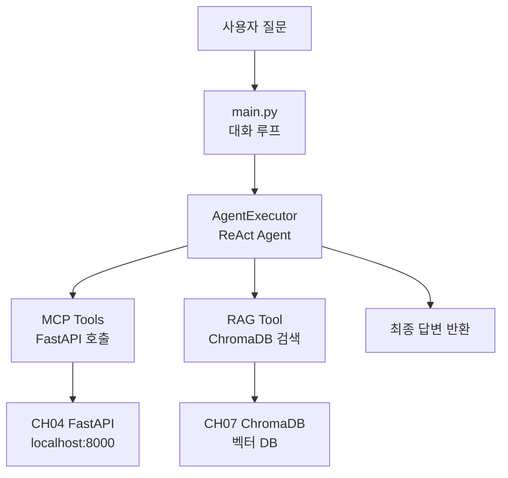

# AI 업무 비서 v2 (LangChain Agent)

> 사내 RAG 시스템 구축 실습 - 9장 실습 코드

## 목적 및 학습 목표

- LangChain AgentExecutor와 ReAct 패턴을 이용하여 도구 자동 선택 에이전트를 구현합니다.
- CH04 FastAPI 서버를 LangChain Tool로 래핑하여 MCP 패턴을 실습합니다.
- CH07 ChromaDB RAG를 LangChain Tool로 통합하여 문서 검색 기능을 추가합니다.
- SQLiteCache를 활용하여 동일 질문의 LLM 호출 비용을 절감하는 방법을 학습합니다.
- MetricsCollector로 응답 시간, 도구 호출 횟수, 캐시 히트율을 측정합니다.

## 실행 환경

- Python 3.9 이상 3.12 이하 권장 (3.13+ 에서 chromadb pydantic v1 비호환 가능성 있음)
- Ollama + DeepSeek R1 모델 (또는 다른 Ollama 호환 모델)
- CH04 FastAPI 서버 (http://localhost:8000)
- CH07 ChromaDB (벡터 DB 사전 구축 필요)

## 사전 준비 — 인프라 구동 (최초 1회)

실습 전 CH04 인프라 레포를 clone하여 PostgreSQL과 CRUD 서버를 구동합니다.

```bash
git clone https://github.com/{repo}/rag-infra
cd rag-infra
docker-compose up -d
```

> PostgreSQL(샘플 데이터 포함), FastAPI CRUD 서버가 자동으로 실행됩니다.

CH07 ChromaDB가 구축되어 있어야 합니다. CH07 예제를 먼저 실행하십시오.

```bash
cd ../CH07_RAG_QA엔진구현
python src/main.py
```

## 설치 및 실행

이 챕터의 예제 코드 저장소를 클론합니다.

```bash
git clone https://github.com/{repo}/ch09-langchain-agent
cd ch09-langchain-agent
```

환경 변수를 설정합니다.

```bash
cp .env.example .env
# .env 파일을 열어 필요한 값(Ollama URL, ChromaDB 경로 등)을 입력합니다.
```

### macOS

```bash
python3 -m venv venv
source venv/bin/activate
pip install -r requirements.txt
```

### Windows

```bash
python -m venv venv
venv\Scripts\activate
pip install -r requirements.txt
```

## 실행

### macOS / Linux

```bash
PYTHONPATH=. python src/main.py
```

### Windows

```bash
set PYTHONPATH=.
python src/main.py
```

> `PYTHONPATH=.` 설정은 `src` 패키지 내부의 모듈 간 임포트(예: `from src.config import ...`)가
> 올바르게 동작하도록 프로젝트 루트를 Python 모듈 검색 경로에 추가합니다.

## 예상 결과

<!-- [캡처 사진 삽입 위치: 터미널 성공 실행 전체 화면 — 에이전트 헤더, 도구 호출 로그, 답변 출력] -->

```
==================================================
  AI 업무 비서 v2 (LangChain Agent)
==================================================
  설정: deepseek-r1:1.5b | Timeout 60s | 캐시 ON
  도구: 연차 조회 / 매출 조회 / 직원 정보 / 사내 문서 검색
  종료: 'exit' 또는 'quit' 입력
==================================================
[Config] LangChain SQLiteCache 활성화 — ./outputs/cache/langchain_cache.db

준비 완료. 질문을 입력하십시오.

질문: 김철수 남은 연차와 연차 규정 알려줘

> Entering new AgentExecutor chain...
Thought: 두 가지 정보가 필요합니다. 잔여 연차는 get_leave_balance 도구로, 연차 규정은 search_company_documents 도구로 조회합니다.
Action: get_leave_balance
Action Input: 김철수
Observation: 김철수 님의 잔여 연차: 5일 (총 15일 중 10일 사용)
Thought: 이제 연차 규정 문서를 검색합니다.
Action: search_company_documents
Action Input: 연차 신청 규정
Observation: [1] 출처: HR_취업규칙_v1.0.pdf
내용: 연차는 발생일로부터 1년 이내에 사용하여야 합니다. 미사용 연차는 연차수당으로 지급됩니다.
Thought: 이제 최종 답변을 작성할 수 있습니다.
Final Answer: 김철수 님의 잔여 연차는 5일입니다 (총 15일 중 10일 사용). 연차 규정에 따르면 연차는 발생일로부터 1년 이내에 사용하셔야 합니다. 미사용 연차는 연차수당으로 지급됩니다.

> Finished chain.

응답 시간: 4.2초 | 캐시: MISS
호출된 도구: get_leave_balance, search_company_documents

답변: 김철수 님의 잔여 연차는 5일입니다 (총 15일 중 10일 사용). 연차 규정에 따르면 연차는 발생일로부터 1년 이내에 사용하셔야 합니다. 미사용 연차는 연차수당으로 지급됩니다.

--------------------------------------------------
질문: exit

세션을 종료합니다.

==================================================
  세션 통계 요약
==================================================
  총 요청 수     : 1회
  평균 응답 시간 : 4200.0ms
  캐시 히트율    : 0.0%
  도구별 호출 횟수:
    - get_leave_balance: 1회
    - search_company_documents: 1회
==================================================
```

> **주의**: 위 출력은 실제 실행 결과를 그대로 복사한 것입니다. 독자의 터미널 출력과 한 글자씩 비교하여 디버깅하십시오.

## 전체 구조



## 프로젝트 구조

```
CH09_LangChain최종연결/
├── README.md             # 이 파일
├── requirements.txt      # 의존성 (버전 고정)
├── .env.example          # 환경 변수 템플릿
├── src/
│   ├── __init__.py
│   ├── main.py           # 진입점 — 대화 루프
│   ├── agent.py          # AgentExecutor 구성
│   ├── rag_tool.py       # RAG 도구 (ChromaDB 검색)
│   ├── mcp_tools.py      # MCP 도구 (FastAPI 호출 3종)
│   ├── config.py         # 설정 로드 및 캐시 초기화
│   └── monitor.py        # 메트릭 수집 및 통계 출력
└── outputs/
    ├── logs/             # 실행 로그 파일
    └── cache/            # LangChain SQLiteCache
```

## 환경 변수 설명

| 변수명 | 기본값 | 설명 |
|--------|--------|------|
| `LLM_PROVIDER` | `ollama` | LLM 공급자 (`ollama` 또는 `openai`) |
| `LLM_MODEL_NAME` | `deepseek-r1:1.5b` | 사용할 모델명 |
| `OLLAMA_BASE_URL` | `http://localhost:11434` | Ollama 서버 URL |
| `OPENAI_API_KEY` | (없음) | OpenAI 사용 시 API 키 |
| `LLM_TIMEOUT` | `60` | LLM 응답 대기 타임아웃 (초) |
| `ENABLE_CACHE` | `true` | LangChain SQLiteCache 활성화 여부 |
| `FASTAPI_BASE_URL` | `http://localhost:8000` | CH04 FastAPI 서버 URL |
| `CHROMA_PERSIST_DIR` | `../CH07_RAG_QA엔진구현/data/chroma_db` | ChromaDB 경로 |
| `COLLECTION_NAME` | `rag_docs` | ChromaDB 컬렉션 이름 |
| `EMBED_MODEL` | `nomic-embed-text` | Ollama 임베딩 모델명 |

## 문제 해결

**Ollama 연결 오류가 발생합니다.**
Ollama 서버가 실행 중인지 확인하십시오.
```bash
ollama serve
ollama pull deepseek-r1:1.5b
```

**FastAPI 서버 연결 오류가 발생합니다.**
CH04 인프라 레포에서 Docker Compose를 실행하십시오.
```bash
cd rag-infra && docker-compose up -d
```

**ChromaDB 오류가 발생합니다.**
CH07 예제를 먼저 실행하여 벡터 DB를 구축하십시오. `.env`의 `CHROMA_PERSIST_DIR` 경로가 올바른지 확인하십시오.

**ModuleNotFoundError: No module named 'src' 오류가 발생합니다.**
프로젝트 루트 디렉토리에서 `PYTHONPATH=.`를 설정하여 실행하십시오.
```bash
# macOS / Linux
PYTHONPATH=. python src/main.py

# Windows
set PYTHONPATH=.
python src/main.py
```

**Python 3.13 이상 환경에서 chromadb pydantic 오류가 발생합니다.**
Python 3.9~3.12 환경을 사용하십시오. `pyenv` 또는 `conda`로 Python 버전을 전환할 수 있습니다.
