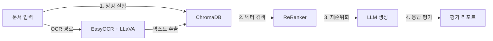

# CH10 RAG 시스템 튜닝

> 실무 RAG 시스템 구축 — 10장 실습 코드

## 목적 및 학습 목표

- 청크 크기와 k값 변경이 검색 정확도에 미치는 영향을 실험으로 확인합니다.
- CrossEncoder ReRanker와 Hybrid Search로 검색 품질을 향상시키는 방법을 익힙니다.
- 시스템 프롬프트 변형이 LLM 응답 품질에 미치는 차이를 비교합니다.
- EasyOCR과 LLaVA를 결합하여 스캔 PDF를 처리하는 방법을 학습합니다.
- 30개 테스트 케이스로 RAG 파이프라인의 정확도와 환각 비율을 정량 평가합니다.

## 실행 환경

- Python 3.11+
- Ollama (LLM 및 임베딩 모델 구동용)
- DeepSeek R1 또는 LLaMA3 모델

## OCR 실습 파일 안내

OCR 실습을 위해 스캔된 PDF 파일을 `data/scanned_sample.pdf` 경로에 복사하십시오.

스캔 PDF 파일이 없는 경우 OCR 모드 실행은 건너뛰고, 청크 튜닝 및 평가 모드만 진행하여도 학습 목표를 달성할 수 있습니다.

## 설치 및 실행

이 챕터의 예제 코드 저장소를 클론합니다.

```bash
git clone https://github.com/{repo}/ch10-rag-tuning
cd ch10-rag-tuning
```

환경 변수를 설정합니다.

```bash
cp .env.example .env
# .env 파일을 열어 LLM_PROVIDER, LLM_MODEL_NAME 등 필요한 값을 입력합니다.
```

### macOS

```bash
python3 -m venv venv
source venv/bin/activate
pip install -r requirements.txt
```

### Windows

```bash
python -m venv venv
venv\Scripts\activate
pip install -r requirements.txt
```

## 사전 준비 — Ollama 모델 다운로드

Ollama를 사용하는 경우 아래 명령어로 모델을 다운로드합니다.

```bash
# LLM 모델
ollama pull deepseek-r1:1.5b

# 임베딩 모델
ollama pull nomic-embed-text

# Vision 모델 (OCR 섹션 사용 시)
ollama pull llava:7b
```

## 실행

### 청크 튜닝 실험

```bash
python src/main.py --mode tune
```

### 전체 평가 실행

```bash
python src/main.py --mode eval
```

### OCR 데모 (스캔 PDF 파일 필요)

```bash
python src/main.py --mode ocr --pdf data/scanned_sample.pdf
```

### 프롬프트 비교 실험

```bash
python -c "
from src.tuning.prompts import compare_prompts
result = compare_prompts('연차 신청은 며칠 전에 해야 합니까?', '연차 신청은 전월 말일까지 제출해야 합니다.')
for variant, response in result.items():
    print(f'[{variant}] {response[:80]}')
"
```

## 예상 결과

<!-- [캡처 사진 삽입 위치: 터미널 평가 실행 전체 화면] -->

```
=== RAG 평가 결과 (30개 테스트 케이스) ===
Retrieval Accuracy : 86.7% (26/30)
Answer Accuracy    : 80.0% (24/30)
Hallucination Rate :  6.7% ( 2/30)
결과 저장: outputs/eval_results/eval_2026-02-25.json
```

## 전체 구조



## 파일 구조

```
CH10_RAG시스템튜닝/
├── README.md
├── requirements.txt
├── .env.example
├── src/
│   ├── __init__.py
│   ├── main.py               <- 튜닝 실험 일괄 실행 진입점
│   ├── tuning/
│   │   ├── __init__.py
│   │   ├── chunker_tuning.py <- 청크 크기 / k값 실험
│   │   ├── reranker.py       <- CrossEncoder ReRanker + Hybrid Search
│   │   └── prompts.py        <- 시스템 프롬프트 변형 비교
│   ├── ocr_hybrid.py         <- LLaVA + EasyOCR 이미지 PDF 처리
│   └── evaluator.py          <- 테스트셋 기반 정확도 평가
├── data/
│   ├── testset.json          <- 평가용 30개 Q&A 쌍
│   └── chroma_db/
└── outputs/
    ├── eval_results/
    └── tuning_logs/
```
