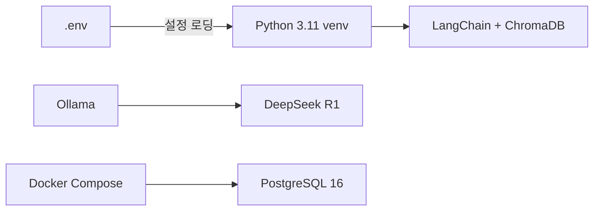

# CH02 집필 명세 — 개발 환경 구축

## 1. 챕터 섹션 구조

- ## 1. Ollama 설치 및 DeepSeek R1 모델 다운로드: OS별 설치 방법, 모델 다운로드, 동작 확인
- ## 2. PostgreSQL 설치 및 초기 설정: Docker Compose로 PostgreSQL 구동, 초기 접속 확인
- ## 3. Python 3.11 가상환경 및 패키지 설치: venv 생성, requirements.txt 기반 패키지 설치
- ## 4. 환경 변수(.env) 구성 및 LLM Provider 스위칭 설계: .env.example 작성, python-dotenv 활용, Provider 전환 구조
- ## 5. 정리하며: 전체 환경 체크리스트 + 3장 예고

## 2. 코드-섹션 매핑

| 섹션 | 파일 | 코드 범위 |
|------|------|---------|
| 섹션 1 | (터미널 명령어) | `ollama pull deepseek-r1`, `ollama run deepseek-r1` |
| 섹션 2 | `docker-compose.yml` | PostgreSQL 컨테이너 정의 |
| 섹션 3 | `requirements.txt` | 전체 의존성 목록 |
| 섹션 4 | `.env.example`, `config.py` | 환경 변수 로딩 및 Provider 스위칭 로직 |

## 3. 개념 설명 힌트 (Why)

- Docker Compose로 PostgreSQL을 구동하는 이유: 직접 설치 대비 환경 격리, 재현성, 초기화 용이
- .env 파일로 설정을 분리하는 이유: 코드에 비밀번호/설정을 하드코딩하지 않고 환경별 전환 가능
- LLM Provider 스위칭 설계의 이유: 향후 다른 로컬 모델이나 클라우드 API로 전환 가능한 유연성 확보

## 4. 핵심 용어

- Ollama: 로컬에서 LLM을 실행하는 경량 런타임
- venv: Python 가상환경. 프로젝트별 패키지 격리
- Docker Compose: 여러 컨테이너를 YAML로 정의하고 한 번에 구동하는 도구
- .env: 환경 변수를 저장하는 설정 파일

## 5. Mermaid 다이어그램 초안

## 6. 챕터 연결

- 이전 챕터에서 가져오는 개념: 전체 아키텍처 구조 (CH01)
- 다음 챕터로 넘기는 개념: 완성된 개발 환경, .env 구성, Docker Compose 기반 인프라 구동 방법
