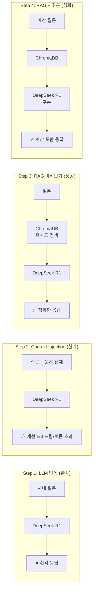

# CH03 집필 명세 — DeepSeek-R1으로 체험하는 LLM의 한계와 RAG의 필요성

## 1. 챕터 섹션 구조

- ## 1. [실패] LLM 단독 질의의 한계: DeepSeek R1에 사내 정보를 질문하여 환각을 직접 체감
- ## 2. 왜 LLM은 환각을 일으키는가: 학습 데이터 컷오프, 사내 비공개 정보 부재, 확신 있는 거짓말의 원리 설명
- ## 3. [임시 해결] Context Injection 맛보기: 문서를 프롬프트에 직접 붙여넣어 응답 개선 체험 — 그러나 토큰 한계와 확장 불가능성을 체감
- ## 4. [성공] RAG 미리보기 + 청킹 비교: 인메모리 ChromaDB로 RAG 동작 체험. **청킹 없을 때 vs 있을 때** 검색 정밀도 차이를 같은 파일에서 나란히 비교하여 청킹의 필요성 직접 체감
- ## 5. [심화] DeepSeek R1 추론 능력 확인: RAG로 검색한 문서를 기반으로 계산·추론이 필요한 질문에 답하는 체험 ("리프레시 데이 몇 번 남았지?")
- ## 6. 정리하며: 4단계 비교 요약 + 4장 베이스 시스템 예고

## 2. 코드-섹션 매핑

| 섹션 | 파일 | 코드 범위 |
|------|------|---------|
| 섹션 1 | `01_llm_only.py` | LLM 단독 호출, 환각 응답 출력 |
| 섹션 3 | `02_context_injection.py` | 프롬프트에 문서 직접 삽입, 토큰 한계 확인 |
| 섹션 4 | `03_rag_preview.py` | Part A(청킹 없음) vs Part B(청킹 있음) 비교 실행 |
| 섹션 5 | `04_rag_reasoning.py` | 동일 구조, 계산·추론 필요 질의로 DeepSeek R1 추론 시연 |

> **CH03의 ChromaDB는 인메모리 전용(영속화 없음)** — 개념 체험용.
> 영속화·PDF 파이프라인·전체 RAG 구축은 6장(벡터 DB 구축)에서 진행합니다.

## 3. 개념 설명 힌트 (Why)

- LLM이 환각을 일으키는 이유: 학습 데이터 컷오프(지식 한계), 사내 비공개 데이터 부재, 확률적 다음 토큰 예측의 본질
- Context Injection의 한계: 토큰 윈도우 제한, 문서 수십 개를 모두 넣으면 느려지고 확장 불가
- RAG 미리보기가 필요한 이유: "이론으로 설명"이 아니라 "40줄 코드로 직접 동작"을 봐야 동기 부여 강함
- 인메모리 Chroma를 사용하는 이유: 영속화 설정 없이 실행 즉시 결과 확인 가능 → 개념 집중
- step4 추론의 의미: RAG는 단순 검색이 아니라 LLM이 검색된 맥락으로 "계산·추론"할 수 있음을 보여줌

## 4. 핵심 용어

- 환각(Hallucination): LLM이 사실이 아닌 내용을 자신 있게 답변하는 현상
- 학습 데이터 컷오프(Training Cutoff): LLM이 학습한 데이터의 시간적 한계
- Context Injection: LLM 프롬프트에 참고 문서를 직접 삽입하는 방식
- RAG(Retrieval-Augmented Generation): 검색으로 찾은 문서를 LLM에 전달하여 응답을 생성하는 방식
- 임베딩(Embedding): 텍스트를 숫자 벡터로 변환하는 과정 (nomic-embed-text 사용)
- 인메모리 벡터스토어: 디스크 저장 없이 실행 중에만 유지되는 벡터 DB

## 5. Mermaid 다이어그램 초안

## 6. 챕터 연결

- 이전 챕터에서 가져오는 개념: 완성된 개발 환경, Ollama + DeepSeek R1 + nomic-embed-text 동작 확인 (CH02)
- 다음 챕터로 넘기는 개념: LLM 한계의 이해, RAG가 필요한 이유 (동기 부여), "진짜 RAG는 4장 인프라 → 6장 구현"으로 연결
