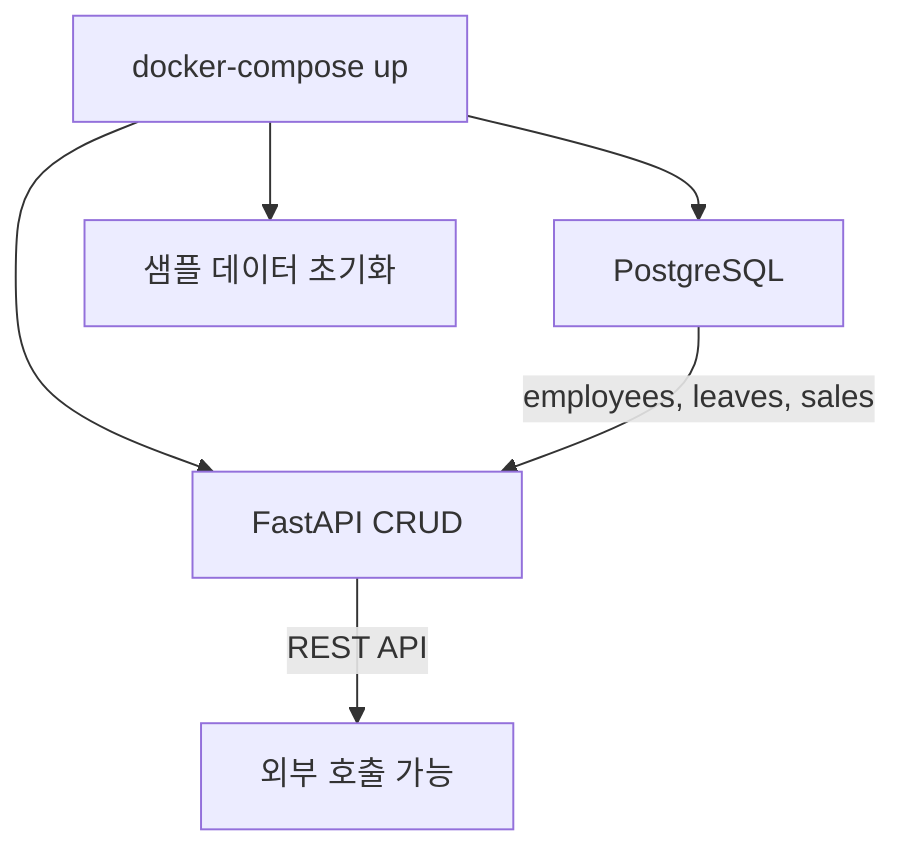

# CH04 집필 명세 — 베이스 시스템 확보

## 1. 챕터 섹션 구조

- ## 1. 사내 시스템 git clone으로 확보: rag-infra 레포 클론, docker-compose up으로 전체 인프라 구동
- ## 2. 데이터베이스 스키마 분석: 직원, 휴가, 매출 테이블 구조 파악, ER 다이어그램
- ## 3. CRUD API 구조 이해: FastAPI 엔드포인트 목록, 요청/응답 형식 확인
- ## 4. MCP 개념 소개: Model Context Protocol의 정의, LLM이 외부 도구를 호출하는 원리
- ## 5. 정리하며: 확보한 인프라 요약 + 5장 예고

## 2. 코드-섹션 매핑

| 섹션 | 파일 | 코드 범위 |
|------|------|---------|
| 섹션 1 | `docker-compose.yml` | PostgreSQL + FastAPI + 샘플 데이터 컨테이너 |
| 섹션 2 | `init.sql` | DDL: employees, leaves, sales 테이블 |
| 섹션 3 | `main.py` (FastAPI) | CRUD 엔드포인트 전체 |
| 섹션 4 | (개념 설명, 코드 최소) | MCP 아키텍처 다이어그램 |

## 3. 개념 설명 힌트 (Why)

- git clone 방식으로 인프라를 제공하는 이유: 독자가 인프라 구축에 시간을 쏟지 않고 핵심 학습(RAG, MCP)에 집중
- 스키마 분석을 하는 이유: MCP Tool이 호출할 대상을 이해해야 정확한 질의 설계가 가능
- MCP를 이 시점에 소개하는 이유: 8장에서 본격 구현하기 전에 개념적 기반을 마련

## 4. 핵심 용어

- MCP(Model Context Protocol): LLM이 외부 도구/데이터 소스에 접근하기 위한 표준 프로토콜
- CRUD: Create, Read, Update, Delete의 약자. 데이터 기본 조작 4가지
- ER 다이어그램(Entity-Relationship Diagram): 데이터베이스 테이블 간 관계를 시각화한 도표
- 엔드포인트(Endpoint): API 서버에서 특정 기능을 수행하는 URL 경로

## 5. Mermaid 다이어그램 초안

## 6. 챕터 연결

- 이전 챕터에서 가져오는 개념: Docker Compose 사용법, .env 설정 (CH03)
- 다음 챕터로 넘기는 개념: 사내 DB 스키마, CRUD API 구조, MCP 개념 기초
