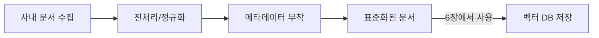

# CH05 집필 명세 — 사내 문서 표준화

## 1. 챕터 섹션 구조

- ## 1. RAG 검색 품질을 결정하는 문서 기준: "쓰레기가 들어가면 쓰레기가 나온다" — 문서 품질이 RAG 성능을 좌우하는 원리
- ## 2. PDF, Word, Markdown, HWP 수집 전략: 사내에 흩어진 문서 유형별 수집 방법과 우선순위. 규칙 기반(pdfplumber/python-docx) vs AI 기반(Vision LLM) 선택 기준
- ## 3. 문서 전처리 및 정규화 가이드라인: 헤더/푸터 제거, 인코딩 통일, 불필요 공백 정리, 표/이미지 처리 방침. **최종 출력은 Markdown으로 통일** — 토큰 효율·구조 보존·LLM 이해도 측면에서 최적
- ## 4. 사내 문서 네이밍(Naming) 표준 규칙: `{부서}_{문서명}_{버전}.확장자` 포맷 강제. 부서별 폴더(`hr/`, `finance/`, `ops/`) 분리. 잘못된 네이밍이 메타데이터를 망가뜨리는 사례 설명
- ## 5. 메타데이터 스키마 설계: 문서 ID, 출처, 작성일, 부서 등 ChromaDB 필터링에 사용할 필드 설계. 네이밍 규칙 → 메타데이터 자동 추출 연결
- ## 6. 정리하며: 표준화 완료 체크리스트 + 6장 예고

## 2. 코드-섹션 매핑

| 섹션 | 파일 | 코드 범위 |
|------|------|---------|
| 섹션 1 | (개념 설명 중심) | 문서 품질 비교 예시, GIGO 원칙 |
| 섹션 2 | `guides/collection_strategy.md` | 수집 전략 매트릭스 (PDF/Word/HWP/Excel), 규칙 기반 vs AI 기반 선택 기준 |
| 섹션 3 | `guides/preprocessing_rules.md` + 샘플 파일 | 정규화 규칙 표, 전처리 전/후 비교 (`sample_raw/` vs `sample_clean/`) |
| 섹션 4 | `guides/naming_convention.md` | 네이밍 표준 규칙 표, 잘못된 사례 vs 올바른 사례 |
| 섹션 5 | `data/metadata_schema.json` | 메타데이터 스키마 정의, 네이밍→메타데이터 자동 파싱 예시 |

> 이 챕터는 가이드라인/설계 문서 중심이며 별도 GitHub 레포가 없습니다. 코드는 6장에서 본격적으로 구현합니다.

## 3. 개념 설명 힌트 (Why)

- 문서 표준화를 별도 챕터로 분리하는 이유: 6장(벡터 DB)에서 바로 코드로 들어가면 "어떤 문서를 어떻게 넣어야 하는가"의 기준이 없어 품질 저하 발생
- 최종 출력을 Markdown으로 통일하는 이유: LLM은 인터넷 학습으로 GitHub 스타일 마크다운을 네이티브로 이해함. HTML보다 토큰 효율 높고, `#` 헤더·`|` 표 기호로 구조 보존. 청킹 기준점으로도 활용 가능
- 네이밍 규칙이 필요한 이유: `2025년본.pdf`, `최종수정(진짜최종).xlsx` 같은 파일을 그대로 넣으면 메타데이터가 꼬여 검색 품질 박살. `{부서}_{문서명}_{버전}.확장자` 포맷으로 파일명 자체가 메타데이터가 됨
- 메타데이터를 설계하는 이유: 검색 시 필터링(부서별, 날짜별) 가능, 출처 표시(7장)에 필수. 네이밍 규칙이 잡혀 있으면 파일명 파싱만으로 `department`, `version` 자동 추출 가능

## 4. 핵심 용어

- 전처리(Preprocessing): 원본 문서를 RAG에 적합한 형태로 정제하는 과정
- 정규화(Normalization): 문서 형식, 인코딩, 구조를 통일하는 작업
- 메타데이터(Metadata): 문서 자체가 아닌, 문서에 대한 정보 (작성자, 날짜, 부서 등)
- GIGO(Garbage In, Garbage Out): 입력 품질이 나쁘면 출력 품질도 나쁘다는 원칙
- 네이밍 표준(Naming Convention): `{부서}_{문서명}_{버전}.확장자` 포맷. 예: `HR_취업규칙_v1.0.pdf`
- Vision LLM: 이미지/PDF 페이지를 시각적으로 이해하고 텍스트를 생성하는 멀티모달 LLM. 규칙 기반 파싱이 실패한 복합 레이아웃에서만 사용
- 규칙 기반 파싱(Rule-based Parsing): pdfplumber, python-docx 등 라이브러리로 텍스트 구조를 좌표/스타일 기반으로 추출. 빠르고 저렴하나 스캔본·복합 도해에는 한계

## 5. Mermaid 다이어그램 초안

## 6. 챕터 연결

- 이전 챕터에서 가져오는 개념: 사내 시스템 구조, DB 스키마 (CH04)
- 다음 챕터로 넘기는 개념: 문서 표준화 기준, 메타데이터 스키마, 전처리 파이프라인 설계
