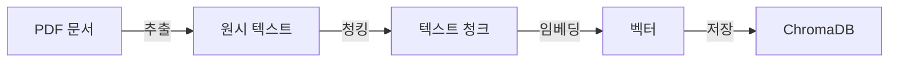

# CH06 집필 명세 — 벡터 DB 구축

## 1. 챕터 섹션 구조

- ## 1. [실습 준비] 데이터 파일 확인: `data/docs/` 폴더에 포함된 실제 사내 문서 샘플(`HR_취업규칙_v1.0.pdf`, `HR_정보보안서약서.pdf`, `OPS_신규서비스_런칭전략.pdf`) 구조 파악. 네이밍 규칙(`{부서}_{문서명}_{버전}.pdf`) 재확인
- ## 2. [규칙 기반] PDF 파싱: pdfplumber로 텍스트 레이어 추출. 표 감지 및 셀 내용 보존. PyMuPDF와 결과 비교. "규칙이 실패할 때"를 직접 체감 (다단/복합 레이아웃)
- ## 3. [AI 기반] Vision LLM으로 Markdown 변환: PDF 페이지를 이미지로 캡처 → Vision LLM(llava/gpt-4o) → Markdown 출력. 규칙 기반 실패 케이스를 AI로 해결하는 흐름 체험
- ## 4. 청킹 전략: Markdown 헤더(#) 기준 의미 단위 청킹 vs Fixed-size 청킹 비교. 청크 수·평균 길이·섹션 보존 여부 비교 출력
- ## 5. 임베딩 + ChromaDB 저장: nomic-embed-text로 임베딩 생성, PersistentClient로 영속 저장, 부서 필터 검색 테스트
- ## 6. 정리하며: 구축된 벡터 DB 확인 + 7장 예고

## 2. 코드-섹션 매핑

| 섹션 | 파일 | 코드 범위 |
|------|------|---------|
| 섹션 1 | `data/docs/` | 실제 사내 문서 샘플 파일 확인 (`HR_취업규칙_v1.0.pdf` 등) |
| 섹션 2 | `src/extractor.py` | `extract_text_pdfplumber()`, `is_complex_layout()`, `parse_filename_metadata()` |
| 섹션 3 | `src/vision_extractor.py` | `pdf_page_to_image()`, `call_vision_llm()`, `extract_pdf_to_markdown()` |
| 섹션 4 | `src/chunker.py` | `markdown_chunk()`, `fixed_size_chunk()`, `compare_strategies()` |
| 섹션 5 | `src/embedder.py` + `src/store.py` | Ollama 임베딩, ChromaDB PersistentClient, 부서 필터 검색 |
| 전체 | `src/main.py` | `run_pipeline(use_vision=False/True)`, `--vision` 플래그 |

## 3. 개념 설명 힌트 (Why)

- 실제 사내 문서를 데이터로 사용하는 이유: 네이밍 규칙(`{부서}_{문서명}_{버전}`)이 적용된 실제 파일로 실습하면 5장 표준화의 효과를 즉시 확인 가능. 독자는 별도 준비 없이 바로 실습 가능
- 규칙 기반 파싱을 먼저 보여주는 이유: "왜 Vision LLM이 필요한가"를 체감하려면 규칙 기반의 실패를 먼저 봐야 함. 다단 레이아웃에서 pdfplumber가 깨지는 순간 Vision LLM의 필요성이 명확해짐
- Vision LLM을 최후 수단으로 소개하는 이유: 모든 PDF에 Vision LLM을 쓰면 비용/속도 문제. 규칙 기반으로 처리 가능한 문서는 라이브러리로, 불가능한 복합 레이아웃만 AI로. 올바른 ROI 전략 체득
- 최종 출력을 Markdown으로 통일하는 이유: LLM이 가장 잘 이해하는 포맷. 헤더(`#`) 기반 의미 단위 청킹이 가능해져 검색 품질 향상
- 네이밍 규칙을 코드로 연결하는 이유: `parse_filename_metadata()`로 파일명에서 `department`, `version` 자동 추출 → 메타데이터 필터 검색 시 활용 (5장 → 6장 연결 실증)

## 4. 핵심 용어

- 청킹(Chunking): 긴 문서를 검색에 적합한 작은 단위로 분할하는 과정
- Markdown 청킹: Markdown 헤더(`#`) 기준으로 섹션 단위 분할. 의미 경계를 보존하여 검색 정밀도 향상
- 임베딩(Embedding): 텍스트를 의미를 보존하는 숫자 벡터로 변환하는 과정
- 컬렉션(Collection): ChromaDB에서 문서 그룹을 관리하는 단위
- Vision LLM: PDF 페이지 이미지를 보고 Markdown을 생성하는 멀티모달 LLM. 규칙 기반 실패 시 최후 수단
- 네이밍 규칙(Naming Convention): `{부서}_{문서명}_{버전}.확장자` 포맷. `parse_filename_metadata()`로 자동 메타데이터 추출

## 5. Mermaid 다이어그램 초안

## 6. 챕터 연결

- 이전 챕터에서 가져오는 개념: 문서 표준화 기준, 메타데이터 스키마 (CH05)
- 다음 챕터로 넘기는 개념: ChromaDB에 저장된 벡터 데이터, 컬렉션 구조, 유사도 검색 API
