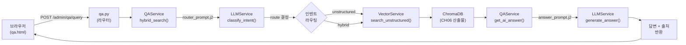

# CH07 집필 명세 — RAG Q&A 엔진 구현

## 1. 챕터 섹션 구조

- ## 1. FastAPI로 RAG 서비스 제공하기: 
FastAPI 앱 구조 설계, 라우터 분리(ui/qa), StaticFiles 마운트, uvicorn 실행. "왜 FastAPI인가" — 비동기 처리, 자동 API 문서(Swagger), 실무 표준
- ## 2. LLM 서비스 계층 구성: 
LLMService 클래스로 ChatOllama / ChatOpenAI 전환 패턴. Jinja2 프롬프트 템플릿 분리(router_prompt.j2, answer_prompt.j2). DeepSeek-R1 `<think>` 태그 제거 처리
- ## 3. 벡터 검색 서비스 연결: 
VectorService로 CH06 ChromaDB 연결. OllamaEmbeddings(nomic-embed-text) 동일 모델 유지. similarity_search_with_score() 호출 및 결과 포맷
- ## 4. 인텐트 라우팅과 RAG Q&A 오케스트레이션: 
QAService — router_prompt로 질문 의도 분류(unstructured/hybrid) → 검색 전략 선택 → answer_prompt로 LLM 답변 생성. hybrid_search()와 get_ai_answer() 연계
- ## 5. 웹 채팅 인터페이스 구현: 
Jinja2 HTML 템플릿(base.html, dashboard.html, qa.html) + qa.js 비동기 AJAX 전송. 출처 카드 렌더링(source, score). 브라우저에서 RAG 동작 확인
- ## 6. 정리하며: 
FastAPI RAG 서버 완성 확인 + CH08 예고 (SQL 정형 데이터 + Tool Calling Agent 확장)

## 2. 코드-섹션 매핑

| 섹션 | 파일 | 코드 범위 |
|------|------|---------|
| 섹션 1 | `app/main.py` | FastAPI 앱 생성, 라우터 등록, StaticFiles, 루트 리다이렉트 |
| 섹션 1 | `app/routers/ui.py` | dashboard, qa_page HTML 라우터 |
| 섹션 2 | `app/services/llm_service.py` | LLMService 클래스, render_prompt(), invoke(), generate_answer(), classify_intent() |
| 섹션 2 | `app/prompts/router_prompt.j2` | 인텐트 분석 Jinja2 템플릿 |
| 섹션 2 | `app/prompts/answer_prompt.j2` | 답변 생성 Jinja2 템플릿 |
| 섹션 3 | `app/services/vector_service.py` | VectorService 클래스, search_unstructured() |
| 섹션 4 | `app/services/qa_service.py` | QAService 클래스, hybrid_search(), get_ai_answer() |
| 섹션 4 | `app/routers/qa.py` | POST /admin/qa/query 엔드포인트 |
| 섹션 5 | `app/templates/` | base.html, dashboard.html, qa.html |
| 섹션 5 | `app/static/js/qa.js` | sendQuery(), 출처 카드 렌더링 |

## 3. 개념 설명 힌트 (Why)

- FastAPI를 사용하는 이유: 비동기 처리로 LLM 대기 시간 동안 다른 요청 처리 가능. Swagger UI 자동 제공으로 API 테스트 편의성. uvicorn 기반으로 실무 배포 표준
- LLMService 계층 분리 이유: ollama/openai 전환이 환경변수 1개 변경으로 가능. 프롬프트를 코드에서 분리하여 비개발자도 수정 가능한 구조
- Jinja2 프롬프트 템플릿 이유: 프롬프트를 `.j2` 파일로 관리하면 코드 변경 없이 프롬프트 개선 가능. 버전 관리 및 협업에 유리
- 인텐트 라우팅이 필요한 이유: 모든 질문에 벡터 검색을 강제하면 효율 저하. LLM이 질문 의도를 분석하여 최적 검색 경로 선택 → 응답 품질 향상
- CH06 ChromaDB를 그대로 사용하는 이유: 임베딩 모델(nomic-embed-text)이 동일해야 검색 결과가 정확. 재임베딩 비용 없이 CH06 산출물을 즉시 활용

## 4. 핵심 용어

- FastAPI: Python 비동기 웹 프레임워크. 자동 API 문서, 타입 힌트 기반 검증 지원
- LLMService: LLM 초기화·호출 로직을 캡슐화한 서비스 계층. ollama/openai 전환 패턴
- Jinja2 프롬프트 템플릿: `.j2` 파일에 프롬프트 저장 → 코드와 프롬프트 분리
- 인텐트 라우팅(Intent Routing): LLM이 질문 의도를 분석하여 검색 전략(unstructured/hybrid) 결정
- VectorService: ChromaDB + 임베딩 모델을 캡슐화한 검색 서비스 계층
- QAService: 인텐트 라우팅 + 검색 + 답변 생성을 오케스트레이션하는 핵심 서비스
- 싱글톤 패턴: 서비스 객체를 모듈 레벨에서 한 번만 생성하여 공유 (llm_service, vector_service, qa_service)

## 5. Mermaid 다이어그램 초안

## 6. 챕터 연결

- 이전 챕터에서 가져오는 개념: ChromaDB 컬렉션, nomic-embed-text 임베딩, 부서 메타데이터 (CH06)
- 다음 챕터로 넘기는 개념: FastAPI 앱 구조, LLMService, VectorService, QAService (CH08에서 SQL DB + Tool Calling Agent 추가 확장)
