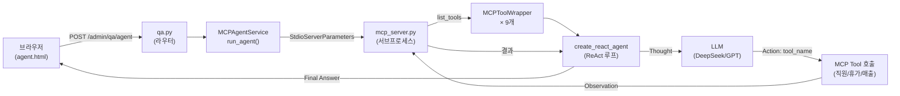

# CH08 집필 명세 — MCP Q&A 에이전트

## 1. 챕터 섹션 구조

- ## 1. MCP란 무엇인가: MCP(Model Context Protocol) 개념과 등장 배경. LangChain Tool Calling과의 차이. FastMCP로 DB 도구를 MCP 프로토콜로 노출하는 구조 설명
- ## 2. PostgreSQL 연결과 DB 초기화: psycopg2 + SQLAlchemy로 PostgreSQL 연결. PostgresConnectionWrapper 패턴. init_db.py로 직원/휴가/매출 샘플 데이터 생성. Docker Compose로 PostgreSQL 실행
- ## 3. MCP 서버 구현 (FastMCP): mcp_server.py에 9개 도구 등록(직원 5개, 휴가 3개, 매출 4개). @mcp.tool() 데코레이터 패턴. stdio 모드로 실행되는 이유
- ## 4. MCP 에이전트 서비스 구현: MCPToolWrapper로 MCP 도구를 LangChain Tool로 변환. StdioServerParameters로 MCP 서버를 서브프로세스 실행. create_react_agent + AgentExecutor로 ReAct 루프 구성
- ## 5. FastAPI에 MCP Agent 통합: /admin/qa/agent 엔드포인트 추가. agent.html 채팅 UI + agent.js 비동기 전송. 도구 사용 기록(steps) 아코디언 렌더링
- ## 6. 정리하며: RAG + MCP 자율 Q&A 에이전트 완성 확인 + CH09 예고 (성능 최적화)

## 2. 코드-섹션 매핑

| 섹션 | 파일 | 코드 범위 |
|------|------|---------|
| 섹션 1 | `mcp/mcp_server.py` | FastMCP 개념 설명, 도구 구조 |
| 섹션 2 | `docker-compose.yml` | PostgreSQL 컨테이너 설정 |
| 섹션 2 | `app/database/connection.py` | PostgresConnectionWrapper, get_db_connection() |
| 섹션 2 | `app/database/init_db.py` | init_db() 테이블 생성 + 샘플 삽입 |
| 섹션 2 | `app/database/crud.py` | list_employees(), get_leave_by_employee(), get_sales_by_dept() 등 |
| 섹션 3 | `mcp/mcp_server.py` | @mcp.tool() 9개 도구 전체 |
| 섹션 4 | `app/services/mcp_agent_service.py` | MCPToolWrapper, REACT_PROMPT, MCPAgentService.run_agent() |
| 섹션 5 | `app/routers/qa.py` | POST /admin/qa/agent 엔드포인트 |
| 섹션 5 | `app/templates/agent.html` | Agent 채팅 UI |
| 섹션 5 | `app/static/js/agent.js` | sendAgentQuery(), steps 아코디언 |

## 3. 개념 설명 힌트 (Why)

- MCP vs LangChain Tool의 차이: LangChain Tool은 Python 코드에 종속. MCP는 표준 프로토콜로 도구를 분리하여 다양한 클라이언트(Claude Desktop, Cursor, 직접 구현)에서 재사용 가능
- FastMCP를 사용하는 이유: 저수준 MCP 프로토콜을 직접 구현하는 대신 데코레이터 기반으로 빠르게 MCP 서버를 구성. @mcp.tool() 하나로 JSON Schema 자동 생성
- StdioServerParameters를 사용하는 이유: MCP 서버를 별도 프로세스로 실행하여 서버/클라이언트 격리. 서버 크래시 시 클라이언트 영향 없음
- MCPToolWrapper 패턴이 필요한 이유: MCP 도구는 async 기반. LangChain ReAct Agent는 동기 Tool을 기대. asyncio.run()으로 브릿지 역할
- ReAct(Reason + Act) 에이전트를 사용하는 이유: 사용자 질문이 복잡할 때(복수 직원 조회, 기간별 매출 + 규정 검색) LLM이 스스로 도구 호출 순서를 결정하는 자율성 제공

## 4. 핵심 용어

- MCP(Model Context Protocol): AI 모델이 외부 도구·데이터를 표준 방식으로 사용할 수 있게 하는 오픈 프로토콜 (Anthropic 제안)
- FastMCP: Python으로 MCP 서버를 빠르게 구현하는 프레임워크. @mcp.tool() 데코레이터로 도구 등록
- stdio 모드: MCP 서버와 클라이언트가 표준 입출력(stdin/stdout)으로 통신하는 실행 방식
- MCPToolWrapper: MCP 도구(async)를 LangChain Tool(sync)로 변환하는 어댑터 클래스
- ReAct 에이전트: Reasoning(생각) → Action(도구 호출) → Observation(결과 확인) 루프를 반복하며 자율 추론하는 에이전트 패턴
- AgentExecutor: LangChain에서 에이전트 루프를 실행하는 실행기. verbose=True로 중간 사고 과정 출력
- PostgresConnectionWrapper: psycopg2 연결에 DictCursor와 편의 메서드를 추가한 래퍼 클래스

## 5. Mermaid 다이어그램 초안

## 6. 챕터 연결

- 이전 챕터에서 가져오는 개념: FastAPI 앱 구조, LLMService, VectorService, QAService, ChromaDB (CH07). RAG 하이브리드 검색은 그대로 유지하고 MCP Agent 탭만 추가
- 다음 챕터로 넘기는 개념: MCP 도구, AgentExecutor, PostgreSQL 연결 (CH09에서 성능 최적화 — 캐싱, 타임아웃, 평가 지표)
