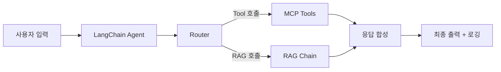

# CH09 집필 명세 — LangChain 최종 연결

## 1. 챕터 섹션 구조

- ## 1. Router / Agent / RAG Chain / MCP Tool 구성: 8장에서 설계한 아키텍처를 LangChain LCEL로 통합 구현
- ## 2. MCP Tool 설계: get_leave_balance, get_sales_sum 등 사내 DB 조회 Tool을 LangChain Tool 규격으로 구현
- ## 3. 운영 설정: Timeout, Retry, 로깅(logging), 캐싱(LangChain Cache) 구성
- ## 4. 비용 관리 및 토큰 모니터링: 토큰 사용량 추적, 로컬 LLM에서의 리소스 모니터링
- ## 5. 정리하며: 전체 파이프라인 완성 확인 + 10장 예고

## 2. 코드-섹션 매핑

| 섹션 | 파일 | 코드 범위 |
|------|------|---------|
| 섹션 1 | `src/main.py` | 통합 파이프라인 엔트리포인트 |
| 섹션 2 | `src/mcp_tools.py` | `get_leave_balance()`, `get_sales_sum()`, `get_employee_info()` |
| 섹션 3 | `src/config.py` | timeout, retry, logging, cache 설정 |
| 섹션 4 | `src/monitor.py` | 토큰 카운터, 응답 시간 측정 |

## 3. 개념 설명 힌트 (Why)

- LangChain Tool 규격으로 MCP를 구현하는 이유: LangChain Agent가 자동으로 적절한 Tool을 선택하고 호출할 수 있도록 표준 인터페이스 통일
- Timeout/Retry가 필요한 이유: 로컬 LLM은 응답 시간이 가변적이며, DB 연결이 일시적으로 실패할 수 있음
- 토큰 모니터링의 이유: 로컬이라도 GPU 메모리와 처리 시간은 유한. 과도한 컨텍스트 주입을 방지

## 4. 핵심 용어

- LangChain Tool: LLM Agent가 호출할 수 있는 외부 기능의 표준 래퍼
- LCEL(LangChain Expression Language): 체인을 `|` 연산자로 선언적으로 구성하는 문법
- Retry: 실패 시 자동 재시도하는 내결함 패턴
- Cache: 동일 입력에 대한 결과를 저장하여 재계산을 방지하는 기법

## 5. Mermaid 다이어그램 초안

## 6. 챕터 연결

- 이전 챕터에서 가져오는 개념: 라우터 설계, 통합 응답 전략 (CH08), RAG Chain (CH07), MCP 개념 (CH04)
- 다음 챕터로 넘기는 개념: 완성된 통합 파이프라인 (CH10에서 튜닝 대상)
