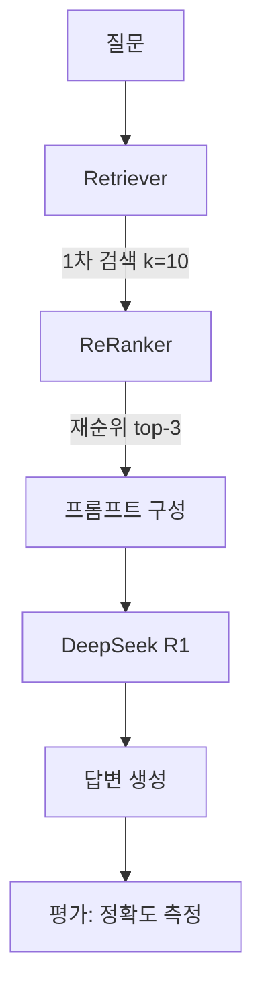

# CH10 집필 명세 — RAG 시스템 튜닝

## 1. 챕터 섹션 구조

- ## 1. 증상별 튜닝 가이드: 환각, 근거 부족, 엉뚱한 문서 반환 등 증상별 원인 진단 및 해결법 매트릭스
- ## 2. Chunk/Retriever 튜닝: Semantic Chunk, k값 조정, Metadata Filtering 적용
- ## 3. 고급 기술: ReRanker, Hybrid Search(키워드+벡터), Parent Document Retriever 소개 및 적용
- ## 4. 프롬프트 튜닝: 근거 우선 응답, "모르면 모른다" 전략, 시스템 프롬프트 최적화
- ## 5. PDF 이미지 처리: LLaVA + EasyOCR 하이브리드로 이미지 포함 PDF 처리
- ## 6. 평가 체계 구축: 테스트셋 30개 설계, Retrieval 정확도, Hallucination Rate 측정
- ## 7. 정리하며: 전체 프로젝트 회고 + 향후 확장 방향 제시

## 2. 코드-섹션 매핑

| 섹션 | 파일 | 코드 범위 |
|------|------|---------|
| 섹션 1 | (가이드 문서 + 코드 예시) | 증상-원인-해결 매트릭스 |
| 섹션 2 | `src/tuning/chunker_tuning.py` | Semantic Chunk 구현, k값 실험 |
| 섹션 3 | `src/tuning/reranker.py` | CrossEncoder ReRanker, Hybrid Search |
| 섹션 4 | `src/tuning/prompts.py` | 시스템 프롬프트 변형 비교 |
| 섹션 5 | `src/ocr_hybrid.py` | LLaVA 이미지 설명 + EasyOCR 텍스트 추출 |
| 섹션 6 | `src/evaluator.py` | 테스트셋 로딩, 정확도 측정, 리포트 출력 |
| 전체 | `src/main.py` | 튜닝 실험 일괄 실행 |

## 3. 개념 설명 힌트 (Why)

- 증상별 접근이 중요한 이유: "RAG 성능이 안 좋다"는 막연한 진단이 아니라 구체적 증상에서 출발해야 효과적 튜닝 가능
- ReRanker를 사용하는 이유: 1차 벡터 검색 결과를 의미 기반으로 재순위화하여 정밀도 향상
- Hybrid Search의 가치: 키워드 매칭(BM25)과 벡터 유사도를 결합하여 약점 보완
- LLaVA + EasyOCR 하이브리드의 이유: 이미지 내 텍스트는 OCR로, 이미지 내용 설명은 Vision LLM으로 분담
- 평가 체계가 필수인 이유: 튜닝 효과를 정량적으로 측정하지 않으면 개선 여부를 판단할 수 없음

## 4. 핵심 용어

- ReRanker: 1차 검색 결과를 재순위화하여 가장 관련도 높은 문서를 상위에 배치하는 모델
- Hybrid Search: 키워드 검색(BM25)과 벡터 유사도 검색을 결합한 방식
- Parent Document Retriever: 작은 청크로 검색하되, 반환 시 상위(부모) 문서를 포함하는 전략
- Hallucination Rate: 전체 응답 중 사실과 다른 내용이 포함된 비율
- Retrieval Accuracy: 검색된 문서가 실제 정답 문서와 일치하는 비율

## 5. Mermaid 다이어그램 초안

## 6. 챕터 연결

- 이전 챕터에서 가져오는 개념: 완성된 통합 파이프라인 (CH09), 전체 RAG Chain (CH07), ChromaDB (CH06)
- 다음 챕터로 넘기는 개념: 없음 (최종 챕터). 에필로그에서 향후 확장 방향(Graph RAG, 멀티에이전트 등) 간략 언급
