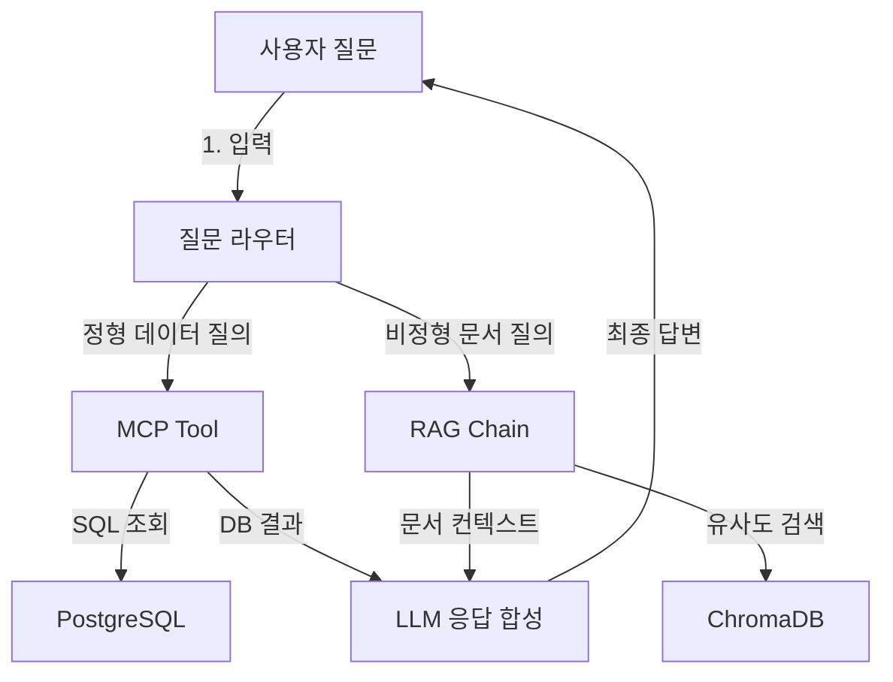
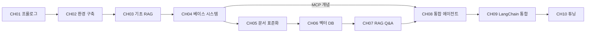
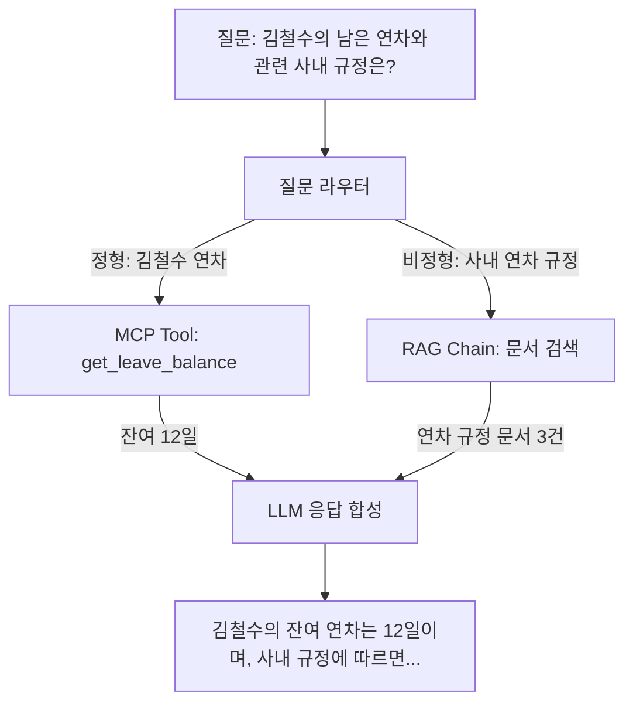

# plan.md — AI 업무 비서 구축: RAG + MCP 실전 가이드

> 생성일: 2026-02-22
> 최종 수정: 2026-02-22
> 상태: draft (사용자 승인 대기)

---

## 섹션 1: 설계서

### 1.1 독자 페르소나

| 항목 | 내용 |
|------|------|
| 대상 독자 | Python 기초는 알지만 LLM/RAG는 처음인 초급 개발자 |
| 사전 지식 | Python 기본 문법, pip 사용법, 터미널 조작, Git 기초 |
| 선수 환경 | macOS / Linux / Windows(WSL2), Docker Desktop 설치 완료 |
| 독자 목표 | 사내 문서(PDF)와 DB(PostgreSQL)를 LLM과 연결하여 질의응답하는 AI 업무 비서를 로컬에서 구축 |

### 1.2 챕터별 학습 목표

| CH | 제목 | 학습 목표 (Learning Objective) | 달성 기준 |
|----|------|-------------------------------|----------|
| 01 | 이 책의 목표와 최종 완성본 미리보기 | 전체 아키텍처와 최종 결과물을 이해한다 | 최종 데모 시나리오를 설명할 수 있다 |
| 02 | 개발 환경 구축 | Ollama, PostgreSQL, Python 가상환경을 세팅한다 | 모든 도구가 정상 동작하고 .env 설정이 완료된다 |
| 03 | LLM의 한계와 RAG의 필요성 | LLM 환각의 원인을 이해하고, RAG가 왜 필요한지 동기를 갖는다 | LLM 환각을 직접 체험하고 RAG의 개념을 설명할 수 있다 |
| 04 | 베이스 시스템 확보 | 사내 시스템(DB + CRUD API)을 git clone으로 확보하고 MCP 개념을 이해한다 | docker-compose up으로 인프라가 구동되고 API 호출이 성공한다 |
| 05 | 사내 문서 표준화 | RAG 품질을 결정하는 문서 전처리 기준을 수립한다 | 수집-정규화-메타데이터 설계 파이프라인을 설명할 수 있다 |
| 06 | 벡터 DB 구축 | 텍스트 추출, 청킹, 임베딩, ChromaDB 저장을 수행한다 | PDF에서 추출한 문서가 ChromaDB에 저장되고 유사도 검색이 동작한다 |
| 07 | RAG Q&A 엔진 구현 | LangChain RAG 파이프라인을 구축하고, 출처 표시 및 멀티턴 대화를 구현한다 | 질문에 대해 출처가 포함된 응답을 반환하고, 이전 대화 맥락을 유지한다 |
| 08 | 통합 에이전트 설계 (MCP + RAG) | 정형/비정형 데이터를 라우팅하고 통합 응답하는 에이전트를 설계한다 | 대표 질문 10개에 대해 올바른 경로로 응답을 생성한다 |
| 09 | LangChain 최종 연결 | Router, Agent, RAG Chain, MCP Tool을 하나로 통합한다 | 전체 파이프라인이 단일 엔드포인트로 동작한다 |
| 10 | RAG 시스템 튜닝 | 증상별 튜닝, 고급 검색 기법, 평가 체계를 구축한다 | 테스트셋 30개 기준 Retrieval 정확도를 측정할 수 있다 |

### 1.3 기술 스택 버전 명세

| 역할 | 기술 | 버전 | 비고 |
|------|------|------|------|
| 언어 | Python | 3.11 | 가상환경(venv) 사용 |
| LLM 추론 | Ollama + DeepSeek R1 | Ollama 0.5+, DeepSeek R1 latest | 로컬 전용 |
| 이미지 LLM | LLaVA | latest (Ollama 경유) | 10장 PDF 이미지 처리 |
| OCR | EasyOCR | 1.7+ | 10장 하이브리드 OCR |
| 파이프라인 | LangChain | 0.3+ | LCEL 기반 |
| 벡터 DB | ChromaDB | 0.5+ | 로컬 영속 모드 |
| 관계형 DB | PostgreSQL | 16 | Docker Compose로 구동 |
| API 서버 | FastAPI | 0.110+ | CRUD 서버 (인프라 레포) |
| 컨테이너 | Docker / Docker Compose | Docker 24+, Compose v2 | 인프라 자동 구성 |
| 문서 파싱 | PyMuPDF, pdfplumber | 최신 | 6장 텍스트 추출 |

### 1.4 실습 전 체크리스트

- [ ] Python 3.11이 설치되어 있는가
- [ ] Docker Desktop이 설치되고 실행 중인가
- [ ] Git이 설치되어 있는가
- [ ] 터미널(bash/zsh)에서 `ollama --version` 이 동작하는가 (2장에서 설치)
- [ ] 최소 16GB RAM, 50GB 여유 디스크 공간이 확보되어 있는가 (DeepSeek R1 구동용)
- [ ] GPU: NVIDIA GPU 권장 (없어도 CPU 모드로 실행 가능, 속도 저하 감수)

### 1.5 설계 노트

> **챕터 순서 원칙**: 2장(개발 환경 구축)에서 Ollama, Docker, Python venv를 완전히 세팅한 후,
> 3장(기초 RAG 정복)에서 구축된 환경을 바탕으로 실습을 진행합니다.
> 환경 구축 → 실습 순서로 독자가 막힘 없이 따라올 수 있도록 설계합니다.

---

## 섹션 2: 아키텍처 및 다이어그램

### 2.1 전체 시스템 구성도



### 2.2 챕터별 핵심 개념 - 코드 모듈 매핑

| CH | 핵심 개념 | 코드 모듈/파일 | GitHub 레포 |
|----|----------|--------------|------------|
| 01 | 아키텍처 개요 | (코드 없음, 다이어그램) | - |
| 02 | 환경 구축 | `.env.example`, `requirements.txt` | - |
| 03 | LLM 한계 체험 | `01_llm_only.py`, `02_context_injection.py` | CH03_why-rag |
| 04 | 베이스 시스템 | `docker-compose.yml`, CRUD API | rag-infra |
| 05 | 문서 표준화 | (가이드라인 문서, 코드 최소) | - |
| 06 | 벡터 DB | `extractor.py`, `chunker.py`, `embedder.py`, `store.py` | CH06_vector-db |
| 07 | RAG Q&A + 멀티턴 | `rag_chain.py`, `citation.py`, `memory.py` | CH07_qa-engine |
| 08 | 통합 에이전트 | `router.py`, `agent.py` | CH08_agent |
| 09 | LangChain 통합 | `main.py`, `mcp_tools.py`, `config.py` | CH09_langchain |
| 10 | 튜닝 | `reranker.py`, `evaluator.py`, `ocr_hybrid.py` | CH10_tuning |

### 2.3 시스템/모듈 간 의존성 그래프



**의존성 분석**:
- 선형 의존: CH01 -> CH02(환경 구축) -> CH03(기초 RAG) -> CH04 -> CH05 -> CH06 -> CH07
- 합류 의존: CH04(MCP 개념) + CH07(RAG + 멀티턴) -> CH08(통합)
- 순환 의존: 없음

### 2.4 대표 실행 흐름도 (정형+비정형 복합 질의)



---

## 섹션 3: 환경 명세 및 예외 기획

### 3.1 필수 환경 변수(.env) 목록

```env
# LLM Provider (로컬 전용)
LLM_PROVIDER=ollama
OLLAMA_MODEL=deepseek-r1
OLLAMA_BASE_URL=http://localhost:11434

# 이미지 LLM (10장)
OLLAMA_VISION_MODEL=llava

# PostgreSQL
POSTGRES_HOST=localhost
POSTGRES_PORT=5432
POSTGRES_DB=company_db
POSTGRES_USER=admin
POSTGRES_PASSWORD=changeme

# ChromaDB
CHROMA_PERSIST_DIR=./chroma_data
CHROMA_COLLECTION=company_docs

# FastAPI CRUD
CRUD_API_BASE_URL=http://localhost:8000
```

**획득 방법**: 모든 환경 변수는 로컬 설정값이며 외부 API 키가 필요하지 않습니다. `.env.example` 파일을 복사하여 비밀번호만 변경하면 됩니다.

### 3.2 외부 API/서비스 목록

| 서비스 | 유형 | 비용 | 대체 가능 |
|--------|------|------|----------|
| Ollama | 로컬 LLM 런타임 | 무료 | vLLM, llama.cpp |
| DeepSeek R1 | LLM 모델 | 무료 (오픈 웨이트) | Llama 3, Mistral |
| LLaVA | 이미지 LLM | 무료 (오픈 웨이트) | - |
| ChromaDB | 벡터 DB | 무료 (오픈소스) | FAISS, Milvus |
| PostgreSQL | 관계형 DB | 무료 (오픈소스) | SQLite(축소판) |
| EasyOCR | OCR 엔진 | 무료 (오픈소스) | Tesseract |

> 모든 서비스가 무료이며 클라우드 API 키가 필요하지 않습니다.

### 3.3 지원 OS 범위

| OS | 지원 수준 | 특이사항 |
|----|----------|---------|
| macOS (Apple Silicon) | 1차 지원 | Ollama 네이티브 지원, Metal 가속 |
| macOS (Intel) | 1차 지원 | CPU 모드 |
| Ubuntu 22.04+ | 1차 지원 | NVIDIA GPU 가속 가능 |
| Windows 11 + WSL2 | 2차 지원 | WSL2 내에서 Ollama 구동, Docker Desktop WSL2 백엔드 |
| Windows (네이티브) | 미지원 | WSL2 사용 필수 |

### 3.4 주요 실패 시나리오 및 대응 방안

| 시나리오 | 증상 | 대응 |
|---------|------|------|
| Ollama 미설치/미실행 | `ConnectionRefusedError` | 3장 설치 가이드 참조, `ollama serve` 실행 확인 |
| DeepSeek R1 미다운로드 | 모델 로드 실패 | `ollama pull deepseek-r1` 실행 |
| Docker 미실행 | PostgreSQL 연결 실패 | Docker Desktop 실행 확인 |
| RAM 부족 (16GB 미만) | OOM / 극도로 느린 응답 | 더 작은 모델(deepseek-r1:7b)로 대체 |
| ChromaDB 영속 디렉토리 권한 | `PermissionError` | `chmod` 또는 디렉토리 경로 변경 |
| PDF 인코딩 오류 | 텍스트 추출 실패 | pdfplumber fallback 또는 OCR 전환 |
| 포트 충돌 (5432, 8000, 11434) | `Address already in use` | 기존 프로세스 종료 또는 .env에서 포트 변경 |

---

## 섹션 4: 분량 및 구성 계획

### 4.1 챕터별 페이지 배분

```text
[Stage 1. 비전 및 기초]
  CH01 프롤로그                         6p
  CH02 개발 환경 구축                    8p

[Stage 2. 인프라 및 표준화]
  CH03 LLM 한계와 RAG 필요성             8p  (-4p, 코드 최소화)
  CH04 베이스 시스템 확보                 8p  (복원)
  CH05 사내 문서 표준화                   8p  (복원)

[Stage 3. 지식 검색 엔진]
  CH06 벡터 DB 구축                    14p  (+2p, 기초 RAG 흡수)
  CH07 RAG Q&A 엔진 구현              14p  (멀티턴 대화 포함)

[Stage 4. 지능형 에이전트]
  CH08 통합 에이전트 설계               12p
  CH09 LangChain 최종 연결            10p
  CH10 RAG 시스템 튜닝                 12p

합계: 100p
```

> **분량 조정 사유**:
> - CH03을 12p→8p로 축소: ChromaDB 구현 코드를 6장으로 이동, 개념 설명과 간단한 데모만 유지
> - CH06을 12p→14p로 확대: 기초 RAG 구현(ChromaDB 저장·검색)을 흡수하여 시작점 역할 강화
> - CH07 14p 유지: 멀티턴 대화(memory.py) 포함
> - CH04, CH05 각 8p로 복원 (이전 조정 불필요)

### 4.2 이론 vs 실습 비율

| CH | 이론 | 실습 | 근거 |
|----|------|------|------|
| 01 | 80% | 20% | 프롤로그, 아키텍처 설명 중심 |
| 02 | 20% | 80% | 설치 및 설정 실습 |
| 03 | 60% | 40% | 환각 원리 개념 설명 + 간단한 데모 코드 |
| 04 | 30% | 70% | git clone + 구조 분석 |
| 05 | 40% | 60% | 문서 표준화 기준 설명 + 실습 |
| 06 | 20% | 80% | 코드 중심 실습 |
| 07 | 20% | 80% | 코드 중심 실습 (멀티턴 대화 포함) |
| 08 | 30% | 70% | 설계 원칙 + 시나리오 실습 |
| 09 | 20% | 80% | 통합 코드 실습 |
| 10 | 30% | 70% | 증상별 가이드 + 평가 실습 |
| **평균** | **27%** | **73%** | 목표(30/70)에 부합 |

### 4.3 챕터 내 구성 비율 (기본 템플릿)

| 구성 요소 | 비율 | 역할 |
|----------|------|------|
| 도입 | 10% | 이 챕터에서 무엇을 만드는지 한 줄 요약 |
| 개념 설명 | 20% | Why: 왜 이 기술/설계를 선택하는가 |
| 코드 실습 | 50% | git clone -> 실행 -> 코드 해설 |
| 심화/에러 대응 | 10% | 자주 발생하는 오류와 해결법 |
| 정리하며 | 10% | 핵심 요약 + 다음 챕터 예고 |

---

## 기획 검증 체크리스트

- [x] 총 분량 100p 이하 (100p)
- [x] 기술 스택 버전 호환성 충돌 없음 (Python 3.11 + LangChain 0.3 + ChromaDB 0.5 호환 확인)
- [x] 챕터 간 의존성 순환 없음 (선형 + 합류 구조, 순환 없음)
- [x] 독자 수준 대비 난이도 급등 구간 없음 (Stage별 점진적 상승)
- [x] 모든 외부 API 무료 또는 대체 가능 (전체 로컬 구성)
- [x] LLM Provider `.env` 스위칭 가능하도록 설계 (LLM_PROVIDER 환경 변수 기반)
