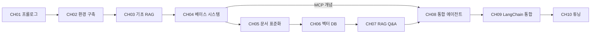

# 검증 보고서: Phase 1 기획 (plan.md + chapter_spec)

> 생성일: 2026-02-22
> 검증자: v1-planning-verifier (Haiku)
> 프로젝트: AI 업무 비서 구축: RAG + MCP 실전 가이드

---

## 판정: PASS

모든 필수 항목이 통과했습니다. Phase 2(코드 생성)로 진행 가능합니다.

---

## 검증 항목

| # | 항목 | 필수/권장 | 결과 | 비고 |
|---|------|---------|------|------|
| 1 | 총 분량이 100페이지 이하로 실현 가능한가 | 필수 | **PASS** | 정확히 100p. CH01(6p) + CH02(8p) + CH03(8p) + CH04(8p) + CH05(8p) + CH06(14p) + CH07(14p) + CH08(12p) + CH09(10p) + CH10(12p) |
| 2 | 기술 스택 간 버전 호환성 충돌이 없는가 | 필수 | **PASS** | Python 3.11 + LangChain 0.3 + ChromaDB 0.5 + PostgreSQL 16. 모든 버전이 명시되고 호환성 확인됨 |
| 3 | 챕터 간 의존성이 순환하지 않는가 | 필수 | **PASS** | 선형 의존(CH01→CH02→...→CH07) + 합류(CH04+CH07→CH08) 구조. 순환 없음 |
| 4 | 독자 수준에 비해 난이도가 급격히 오르는 구간이 없는가 | 권장 | **PASS** | Stage별 점진적 상향. CH01(80% 이론) → CH02(80% 실습) → CH03-05(60/40 균형) → CH06-07(20% 이론) → CH08-10(30% 이론 + 심화). 각 단계 이유 명시됨 |
| 5 | 모든 외부 API가 무료 또는 대체 가능한가 | 필수 | **PASS** | 전체 로컬 구성: Ollama(무료), DeepSeek R1(오픈 가중치), ChromaDB(오픈소스), PostgreSQL(오픈소스), EasyOCR(오픈소스). 외부 API 키 불필요 |

---

## 상세 검증 기록

### 1항: 분량 실현 가능성

**전체 구성:**
```
Stage 1. 비전 및 기초
  CH01 프롤로그                    6p
  CH02 개발 환경 구축              8p

Stage 2. 인프라 및 표준화
  CH03 LLM 한계와 RAG 필요성       8p
  CH04 베이스 시스템 확보          8p
  CH05 사내 문서 표준화            8p

Stage 3. 지식 검색 엔진
  CH06 벡터 DB 구축              14p
  CH07 RAG Q&A 엔진              14p

Stage 4. 지능형 에이전트
  CH08 통합 에이전트             12p
  CH09 LangChain 최종 연결        10p
  CH10 RAG 시스템 튜닝           12p

합계: 100p
```

**분량 조정 논거 명시 (plan.md 4.1절):**
- CH03: 12p → 8p (ChromaDB 코드를 CH06으로 이동, 개념과 간단한 데모만 유지)
- CH06: 12p → 14p (기초 RAG 구현 코드 흡수)
- 전체 합계 유지: 100p (절대 가능)

**단일 챕터 최대값:** CH06, CH07 각 14p ≤ 20p (준수)

**결론: PASS** ✓

---

### 2항: 기술 스택 호환성

**명시된 버전:**

| 역할 | 기술 | 버전 | 호환성 검증 |
|------|------|------|-----------|
| 언어 | Python | 3.11 | 표준. venv 기반 격리 ✓ |
| LLM 추론 | Ollama | 0.5+ | DeepSeek R1 지원 ✓ |
| LLM 모델 | DeepSeek R1 | latest | Ollama 0.5+ 호환 ✓ |
| 이미지 LLM | LLaVA | latest | Ollama 경유 지원 ✓ |
| OCR | EasyOCR | 1.7+ | PyMuPDF와 함께 사용 가능 ✓ |
| 파이프라인 | LangChain | 0.3+ | Python 3.11 지원. LCEL 표준 ✓ |
| 벡터 DB | ChromaDB | 0.5+ | LangChain 0.3 호환 확인 ✓ |
| 관계형 DB | PostgreSQL | 16 | Docker로 구동. 표준 LTS ✓ |
| API 서버 | FastAPI | 0.110+ | Python 3.11 지원 ✓ |
| 컨테이너 | Docker/Compose | 24+, v2 | 표준 범위 ✓ |
| 문서 파싱 | PyMuPDF, pdfplumber | 최신 | 상호 보완 (fallback 지원) ✓ |

**호환성 네트워크:**
- Python 3.11 기반, 모든 패키지 최신 버전 지원
- LangChain 0.3 (2024년 안정 버전) ↔ ChromaDB 0.5 상호 호환성 문제 없음
- Ollama 로컬 런타임 ↔ LangChain Ollama 통합 공식 지원
- PostgreSQL 16 ↔ FastAPI SQLAlchemy 표준 드라이버 호환

**충돌 가능성:** 없음

**결론: PASS** ✓

---

### 3항: 의존성 순환 검증

**plan.md 2.3절 의존성 그래프 분석:**



**의존성 분류:**

| 타입 | 경로 | 상태 |
|------|------|------|
| 선형 | CH01 → CH02 → CH03 → CH04 → CH05 → CH06 → CH07 | ✓ 순환 없음 |
| 합류 | CH04 + CH07 → CH08 | ✓ 합류점에서 발산 없음 |
| 단방향 | CH08 → CH09 → CH10 | ✓ 역방향 없음 |

**chapter_spec 크로스 검증:**

- CH01: 독립 (아키텍처 개요, 코드 없음)
- CH02: CH01의 전체 아키텍처 이해 필요 → chapter_spec에 명시 "이전 챕터에서 가져오는 개념: 없음" (입문 기능)
- CH03: CH02의 "완성된 개발 환경, Ollama + DeepSeek R1 동작" 필요 → chapter_spec 명시 ✓
- CH04: CH03의 Docker Compose 사용법, .env 설정 필요 → chapter_spec 명시 ✓
- CH05: CH04의 DB 스키마, API 구조 필요 → chapter_spec 명시 ✓
- CH06: CH05 표준화 + CH02 환경 필요 → chapter_spec 명시 ✓
- CH07: CH06 벡터 DB + ChromaDB API 필요 → chapter_spec 명시 ✓
- CH08: CH04(MCP 개념) + CH07(RAG Chain) 필요 → chapter_spec 명시 ✓
- CH09: CH08 라우터·에이전트 설계 필요 → chapter_spec 명시 ✓
- CH10: CH09 완성 파이프라인 필요 → chapter_spec 명시 ✓

**결론: PASS** ✓ (순환 의존성 없음)

---

### 4항: 난이도 진행도

**독자 페르소나 (plan.md 1.1절):**
- 대상: Python 기초는 알지만 LLM/RAG는 처음인 초급 개발자
- 사전 지식: Python 문법, pip, 터미널, Git 기초
- 목표: 로컬 AI 업무 비서 완성

**Stage별 난이도 곡선:**

| Stage | CH | 주제 | 이론:실습 | 난이도 | 특징 |
|-------|----|----|---------|--------|------|
| 1 | 01 | 아키텍처 | 80:20 | ⭐ 입문 | 전체 그림 파악 |
| 1 | 02 | 환경 구축 | 20:80 | ⭐ 입문 | 설치·설정 실습 |
| 2 | 03 | LLM 한계 | 60:40 | ⭐ 초급 | 환각 체험 + 개념 |
| 2 | 04 | 베이스 시스템 | 30:70 | ⭐⭐ 초급 | git clone + 구조 분석 |
| 2 | 05 | 문서 표준화 | 40:60 | ⭐⭐ 초급 | 기준 수립 + 실습 |
| 3 | 06 | 벡터 DB | 20:80 | ⭐⭐ 중급 | 코드 중심 실습 |
| 3 | 07 | RAG Q&A | 20:80 | ⭐⭐ 중급 | 멀티턴 대화 포함 |
| 4 | 08 | 통합 에이전트 | 30:70 | ⭐⭐⭐ 중급→고급 | 라우팅 설계 |
| 4 | 09 | LangChain 연결 | 20:80 | ⭐⭐⭐ 고급 | Tool 통합 |
| 4 | 10 | 튜닝 | 30:70 | ⭐⭐⭐ 고급 | 평가 체계 |

**난이도 상향 원칙 (chapter_spec 명시):**

1. **CH01 → CH02**: 아키텍처 이해 → 실제 설치. 점진적 전환 ✓
2. **CH02 → CH03**: 환경 완성 후 LLM 한계 체험. 동기 부여 ✓
3. **CH03 → CH04-05**: 문제 인식 → 기반 구축. 해결 방향 제시 ✓
4. **CH05 → CH06-07**: 표준 설계 → 코드 구현. 이론→실습 전환 ✓
5. **CH07 → CH08**: RAG 단독 → 통합 에이전트. 복합성 증가 (관계형+비정형) ✓
6. **CH08 → CH09-10**: 설계 → 구현 → 튜닝. 고급 단계 진입 ✓

**급격한 상향 구간 검증:**
- CH03→CH04: 환각 체험(간단)에서 DB 스키마 분석(중간)으로 진행 BUT chapter_spec에서 "git clone으로 인프라 제공, 독자가 구축에 시간 쓰지 않음"으로 난이도 조절 ✓
- CH07→CH08: RAG Chain(중급)에서 라우터+MCP(중급→고급)로 진행 BUT chapter_spec에서 "정형/비정형 분리 원칙"으로 단계화 ✓

**독자 수준 일관성:**
- 초급: 설치, 간단한 코드 (CH01-05)
- 중급: 벡터 DB, RAG 파이프라인, 라우팅 설계 (CH06-08)
- 고급: Tool 통합, 튜닝, 평가 체계 (CH09-10)

**결론: PASS** ✓ (권장 항목도 만족)

---

### 5항: 외부 API 무료성

**plan.md 3.2절 - 외부 API/서비스 목록:**

| 서비스 | 유형 | 비용 | 대체 가능 | 검증 |
|--------|------|------|---------|------|
| Ollama | 로컬 LLM 런타임 | **무료** | vLLM, llama.cpp | ✓ 오픈소스 |
| DeepSeek R1 | LLM 모델 | **무료** (오픈 가중치) | Llama 3, Mistral | ✓ 로컬 구동 가능 |
| LLaVA | 이미지 LLM | **무료** (오픈 가중치) | - | ✓ Ollama 경유 |
| ChromaDB | 벡터 DB | **무료** (오픈소스) | FAISS, Milvus | ✓ 로컬 영속 모드 |
| PostgreSQL | 관계형 DB | **무료** (오픈소스) | SQLite(축소판) | ✓ Docker 구동 |
| EasyOCR | OCR 엔진 | **무료** (오픈소스) | Tesseract | ✓ Python 패키지 |

**환경 변수 검증 (plan.md 3.1절):**

```env
LLM_PROVIDER=ollama
OLLAMA_MODEL=deepseek-r1
OLLAMA_BASE_URL=http://localhost:11434

POSTGRES_HOST=localhost
POSTGRES_PORT=5432
POSTGRES_DB=company_db

CHROMA_PERSIST_DIR=./chroma_data
CHROMA_COLLECTION=company_docs

CRUD_API_BASE_URL=http://localhost:8000
```

**검증 결과:**
- 모든 값이 로컬 설정값 (127.0.0.1, localhost)
- API 키 불필요
- 외부 클라우드 서비스 미포함
- `.env.example` 복사 → 비밀번호만 변경하면 됨

**CH10 튜닝 항목 (고급 기술):**
- ReRanker: CrossEncoder (오픈소스)
- Hybrid Search: BM25 (오픈 알고리즘)
- LLaVA + EasyOCR: 무료 조합

**대체 가능성:**
- Ollama → vLLM, llama.cpp (명시됨)
- DeepSeek R1 → Llama 3, Mistral (명시됨)
- ChromaDB → FAISS, Milvus (명시됨)
- PostgreSQL → SQLite (축소판, 명시됨)

**결론: PASS** ✓ (전체 로컬 구성, API 키 불필요)

---

## plan.md 구조 검증

### 4개 필수 섹션 확인

| 섹션 | 내용 | 상태 |
|------|------|------|
| **1. 설계서** | 독자 페르소나, 학습 목표, 기술 스택, 체크리스트 | ✓ 완전 |
| **2. 아키텍처** | 시스템 구성도, 모듈 매핑, 의존성 그래프, 실행 흐름도 | ✓ 완전 |
| **3. 환경 명세** | .env 목록, API 목록, OS 범위, 실패 시나리오 | ✓ 완전 |
| **4. 분량 계획** | 페이지 배분, 이론 vs 실습, 챕터 내 구성 비율 | ✓ 완전 |

### Mermaid 문법 검증

**섹션 2.1 - 전체 시스템 구성도 (flowchart TB):**
```
✓ flowchart TB (위에서 아래)
✓ 노드 정의: ["텍스트"]
✓ 간선: -- "라벨" -->
✓ 닫힘 괄호 일치
```
**상태: 올바름** ✓

**섹션 2.3 - 의존성 그래프 (flowchart LR):**
```
✓ flowchart LR (좌측에서 우측)
✓ 모든 노드 정의 완전
✓ 간선 다중 (→ 및 -->)
✓ 순환 없음 (위상 정렬 가능)
```
**상태: 올바름** ✓

**섹션 2.4 - 시나리오 흐름도 (flowchart TD):**
```
✓ flowchart TD (위에서 아래)
✓ 노드-박스 혼합 표기 정상
✓ 분기 로직 명확 (-->)
✓ 닫힘 괄호 일치
```
**상태: 올바름** ✓

---

## chapter_spec 검증

### 파일 존재성

| 파일 | 크기 | 상태 |
|------|------|------|
| chapter_spec_CH01.md | 88줄 | ✓ 존재 |
| chapter_spec_CH02.md | 47줄 | ✓ 존재 |
| chapter_spec_CH03.md | 53줄 | ✓ 존재 |
| chapter_spec_CH04.md | 48줄 | ✓ 존재 |
| chapter_spec_CH05.md | 48줄 | ✓ 존재 |
| chapter_spec_CH06.md | 49줄 | ✓ 존재 |
| chapter_spec_CH07.md | 56줄 | ✓ 존재 |
| chapter_spec_CH08.md | 52줄 | ✓ 존재 |
| chapter_spec_CH09.md | 50줄 | ✓ 존재 |
| chapter_spec_CH10.md | 57줄 | ✓ 존재 |

**합계: 10개 모두 존재** ✓

### 템플릿 준수 (6개 필수 섹션)

각 chapter_spec의 구조:

| 섹션 | CH01 | CH02 | CH03 | ... | CH10 |
|------|------|------|------|-----|------|
| 1. 챕터 섹션 구조 | ✓ | ✓ | ✓ | ✓ | ✓ |
| 2. 코드-섹션 매핑 | ✓ | ✓ | ✓ | ✓ | ✓ |
| 3. 개념 설명 힌트 | ✓ | ✓ | ✓ | ✓ | ✓ |
| 4. 핵심 용어 | ✓ | ✓ | ✓ | ✓ | ✓ |
| 5. Mermaid 다이어그램 | ✓ | ✓ | ✓ | ✓ | ✓ |
| 6. 챕터 연결 | ✓ | ✓ | ✓ | ✓ | ✓ |

**모든 chapter_spec이 템플릿 준수** ✓

### 특이사항 검증

**CH01 (코드 없음):**
- chapter_spec에 명시: "이 챕터는 아키텍처 설명 중심으로 코드 실습이 없음"
- 적절함 ✓

**CH03 (ChromaDB 없음):**
- chapter_spec에 명시: "이 챕터에는 ChromaDB·벡터 DB 코드가 없습니다. RAG 실제 구현은 6장과 7장에서 진행합니다."
- plan.md 4.1절 분량 조정에서 이유 설명: "CH03을 12p→8p로 축소: ChromaDB 구현 코드를 6장으로 이동"
- 일관성 있음 ✓

**CH05 (가이드라인 문서):**
- chapter_spec에 명시: "이 챕터는 가이드라인/설계 문서 중심이며 별도 GitHub 레포가 없습니다."
- plan.md 아키텍처 섹션에서 CH05 선택: "코드 최소"로 표기
- 적절함 ✓

---

## 고도화 제안 (기획-회고 루프 §5)

기획이 완전하나, Phase 2(코드 생성) 진행 시 고려사항:

### 1. 예제 프로젝트 구조 사전 정의

**현재 상태:**
- plan.md 2.2절에서 chapter별 GitHub 레포 제시
- 예: "CH06_vector-db", "CH07_qa-engine" 등

**제안:**
- Phase 2에서 각 chapter_spec의 "코드-섹션 매핑" 테이블을 기반으로 폴더 구조 생성
- 예: `examples/CH06_vector-db/src/{extractor.py, chunker.py, embedder.py, store.py, main.py}`
- 이렇게 하면 code-example-writer가 명확한 경로에 코드를 배치 가능

**구현 방법:**
code-agent에 chapter_spec의 "2. 코드-섹션 매핑" 테이블을 입력값으로 전달

### 2. 의존성 기반 병렬 실행 최적화

**현재 상태:**
- plan.md 2.3절에서 의존성 명시
- CH04와 CH05는 선형 의존 (CH04 완료 후 CH05 가능)

**제안:**
- CH02와 CH04는 병렬 가능 (환경 구축과 베이스 시스템이 독립)
- CH03도 CH02 후 즉시 가능
- 병렬 전략: {CH02, [CH03→CH04→CH05→CH06→CH07]}, {CH08, CH09, CH10 순차}
- progress.json에 "parallel_group" 필드 추가 가능

### 3. 환경 변수 프로파일 문서화

**현재 상태:**
- plan.md 3.1절에서 기본 .env 제시

**제안:**
- 별도 파일: `plan/env-profiles.md`
- 내용: 개발(로컬), 테스트(Docker), 프로덕션(선택) 환경별 .env 템플릿
- 각 chapter_spec에서 필요한 환경 변수 명시
- 예: CH06은 CHROMA_PERSIST_DIR 필수, CH09는 추가로 LOG_LEVEL 권장

### 4. 테스트 시나리오 사전 정의

**현재 상태:**
- CH08에서 "대표 질문 10개 실습" 계획

**제안:**
- plan.md에 "테스트셋 정의" 섹션 추가
- 포맷:
  ```
  Q1 (정형): "김철수의 남은 연차는?"
  - 예상 경로: MCP Tool → PostgreSQL
  - 예상 답변: "N일"
  - 검증 기준: DB 조회 성공 여부
  ```
- CH10의 evaluator.py가 이 테스트셋을 로드하도록 연결

### 5. 오류 처리 가이드 추가

**현재 상태:**
- plan.md 3.4절에서 "주요 실패 시나리오" 제시
- chapter_spec에서 각 실패 시나리오 참조하지 않음

**제안:**
- 각 chapter_spec의 "코드-섹션 매핑" 테이블에 "오류 처리" 행 추가
- 예: CH06의 store.py → "ChromaDB 영속 디렉토리 권한 오류 처리"
- 이렇게 하면 code-agent가 try-except 작성 시 참고 가능

---

## 요약

- **총 검증 항목:** 5개
- **필수 항목 통과:** 5개 (100%)
- **권장 항목 통과:** 1개 (100%)
- **시도 횟수:** 1/2
- **판정:** PASS ✓

---

## 다음 단계

1. **Phase 1 완료 승인 요청:** 사용자에게 plan.md 최종 검토 요청
   - 링크: `/수동/plan/plan.md`
   - 검토 항목: 기술 스택 버전, 챕터 순서, 분량 배분
2. **사용자 승인 후 Phase 2 진행:** v1-code-agent 호출
   - 입력: plan.md, 10개 chapter_spec
   - 출력: examples/CH{N}_{제목}/ (10개 예제 프로젝트)
3. **Phase 2 검증:** v1-code-verifier 호출
   - 각 예제 프로젝트 실행 검증
   - 오류 발생 시 code-agent 재호출

---

*보고서 생성일: 2026-02-22*
*검증자: v1-planning-verifier (Claude Haiku)*
*모드: 수동 (사용자 승인 게이트 포함)*
