# 책 집필 에이전트 기획서 (수동 모드)

## 1. 개요

이 문서는 v1 수동 모드 집필 파이프라인의 상세 명세이다.
**각 Phase 완료 후 사용자 검토 및 승인을 거쳐** 다음 Phase로 진행한다.

## 2. 파이프라인 흐름도

```mermaid
flowchart TD
    A["Phase 0: 초안 구체화"] --> A1{"사용자 승인"}
    A1 -->|승인| B["Phase 1: 기획"]
    A1 -->|수정| A
    B --> B1{"사용자 검토"}
    B1 -->|승인| C{"기획 검증"}
    B1 -->|수정| B
    C -->|PASS| C1{"사용자 승인"}
    C -->|FAIL| B
    C1 --> D["Phase 2: 코드 생성"]
    D --> D1{"사용자 검토"}
    D1 -->|승인| E{"코드 검증"}
    D1 -->|수정| D
    E -->|PASS| E1{"사용자 승인"}
    E -->|FAIL| D
    E1 --> F["Phase 3: 목차"]
    F --> F1{"사용자 검토"}
    F1 -->|승인| G{"목차 검증"}
    F1 -->|수정| F
    G -->|PASS| G1{"사용자 승인"}
    G -->|FAIL| F
    G1 --> H["Phase 4: 집필"]
    H --> H1{"챕터별 사용자 검토"}
    H1 -->|승인| I{"집필 검증"}
    H1 -->|수정| H
    I -->|PASS| I1{"다음 챕터 or Phase 5"}
    I -->|FAIL| H
    I1 --> J["Phase 5: 병합"]
    J --> J1{"사용자 승인"}
    J1 --> K["Phase 6: 완료"]
    K -.-> L["회고 (선택)"]
```



## 3. 자동 모드와의 차이점

| 구분 | 자동 모드 | 수동 모드 |
|------|----------|----------|
| Phase 0 | 대화 → 자동 진행 | 대화 → **사용자 검토/수정 → 승인** |
| Phase 1 | agent → verifier → 자동 진행 | agent → **사용자 검토/수정** → verifier → **승인** |
| Phase 2 | agent → verifier → 자동 진행 | agent → **사용자 검토/수정** → verifier → **승인** |
| Phase 3 | agent → verifier → 자동 진행 | agent → **사용자 검토/수정** → verifier → **승인** |
| Phase 4 | agent → verifier → 자동 진행 | 챕터별 → **사용자 검토/수정** → 다음 챕터 |
| Phase 5 | 자동 병합 | **승인 후** 병합 |

## 4. 승인 게이트 상세

### 4.1. 승인 요청 형식

각 Phase 완료 시 AskUserQuestion 도구로 승인을 요청한다:

```
질문: "{산출물}이 완성되었습니다. 검토 후 진행하시겠습니까?"
옵션:
  1. "승인 — 다음 Phase로 진행"
  2. "수정 요청 — 특정 부분 수정 후 재확인"
  3. "재생성 — 처음부터 다시 생성"
```

### 4.2. 수정 요청 처리

사용자가 "수정 요청"을 선택한 경우:
1. 사용자가 구체적 수정 사항을 입력한다.
2. 해당 에이전트를 수정 사항과 함께 재호출한다.
3. 수정 완료 후 다시 승인을 요청한다.

### 4.3. 재생성 처리

사용자가 "재생성"을 선택한 경우:
1. 해당 Phase의 모든 산출물을 삭제한다.
2. 에이전트를 처음부터 재실행한다.
3. 완료 후 승인을 요청한다.

## 5. 에이전트 호출 순서

| 순서 | Phase | 에이전트 | 승인 게이트 |
|------|-------|---------|-----------|
| 1 | 0 | (오케스트레이터) | 초안 승인 |
| 2 | 1 | v1-planning-agent | 기획서 검토 |
| 3 | 1 | v1-planning-verifier | 검증 후 승인 |
| 4 | 2 | v1-code-agent | 코드 검토 |
| 5 | 2 | v1-code-verifier | 검증 후 승인 |
| 6 | 3 | v1-toc-agent | 목차 검토 |
| 7 | 3 | v1-toc-verifier | 검증 후 승인 |
| 8 | 4 | v1-writing-agent | **챕터별** 검토 |
| 9 | 4 | v1-writing-verifier | 챕터별 검증 |
| 10 | 5 | (오케스트레이터) | 병합 승인 |
| 11 | 6+ | v1-retrospective | (선택) |

## 6. 진행 추적

`progress.json`에 `approved` 필드가 추가된다:

```json
{
  "mode": "manual",
  "phases": {
    "phase_1_planning": {
      "status": "done",
      "verification": "PASS",
      "approved": true
    }
  }
}
```

## 7. 장단점

### 장점
- 각 Phase 산출물을 직접 확인하고 수정 가능
- 방향 전환이 자유로움 (중간에 주제나 구성 변경 가능)
- 사용자 의도에 더 정확히 부합하는 결과물
- 문제 발견 시 즉시 수정 가능

### 단점
- 전체 완료까지 시간이 오래 걸림
- 매 Phase마다 사용자 개입 필요
- Phase 4(집필)에서 챕터 수만큼 승인 필요

## 8. 권장 사용 시나리오

- 처음 사용하는 사용자 (파이프라인 이해)
- 까다로운 주제 (정확한 방향 설정 필요)
- 고품질 결과물이 필요한 경우
- 기존 자동 모드 결과가 불만족스러웠을 때
