# AI 업무 비서 구축 — RAG + MCP 실전 가이드 (스토리텔링 버전)

> **집필 컨셉**: 스토리텔링 버전

> **주인공**: 스타트업 HRTech 기업 '커넥트HR' AI팀 (이서연·김도현·박민준)

> 생성일시: 2026-02-26 06:50

---

## 목차

# AI 업무 비서 구축 — RAG + MCP 실전 가이드
## 사내 문서와 DB를 LLM과 연결하는 지식 엔진 설계 전 과정

---

## 이 책에 대하여

### 독자 대상

이 책은 **Python 기초 문법과 pip 사용 경험**이 있는 초급 개발자를 대상으로 합니다. LLM과 RAG는 처음이어도 괜찮습니다. SQL의 SELECT 문 정도를 알고 있다면 이 책의 모든 실습을 따라갈 수 있습니다.

| 항목 | 내용 |
|------|------|
| 대상 독자 | Python 기초 문법을 알지만 LLM/RAG 경험이 없는 초급 개발자 |
| 사전 지식 | Python 기본 문법, pip 사용 경험, SQL 기초(SELECT/INSERT) |
| 선수 환경 | macOS / Windows / Linux, Python 3.11 설치 가능, 8GB 이상 RAM |
| 기대 결과 | 사내 문서 + DB를 통합 검색하는 RAG 기반 AI 업무 비서 구축 |

### 사전 설치 체크리스트

이 책의 실습을 시작하기 전에 아래 항목을 확인하십시오.

- [ ] Python 3.11 설치 완료
- [ ] Git 설치 완료
- [ ] Docker Desktop 설치 완료 (PostgreSQL용)
- [ ] 8GB 이상 RAM (Ollama 모델 로딩용, 16GB 권장)
- [ ] 10GB 이상 디스크 여유 공간 (모델 + DB)
- [ ] 터미널/CLI 기본 사용 가능

### 실습 방법 안내

이 책의 모든 예제 코드는 GitHub 저장소에 **완성본**으로 제공됩니다. 독자는 코드를 직접 타이핑하지 않습니다. `git clone` 후 즉시 실행하는 방식으로 진행합니다.

```bash
git clone https://github.com/{repo}/CH{N}_{제목}
cd CH{N}_{제목}
cp .env.example .env
pip install -r requirements.txt
python src/main.py
```

인프라(PostgreSQL, FastAPI CRUD 서버, 샘플 데이터)는 별도 인프라 레포를 Docker Compose로 제공합니다.

---

## 전체 구성 개요

| 항목 | 값 |
|------|---|
| 총 챕터 수 | 10개 |
| 예상 총 분량 | 100페이지 |
| 이론 / 실습 비율 | 30% (30p) / 70% (70p) |
| 실습 방식 | GitHub Clone 후 실행 |

### 4 Stage 스토리 아크

이 책은 스타트업 HRTech 기업 **커넥트HR**의 AI팀이 3개월 만에 고객 문의 응답 시간을 10분에서 30초로 줄이는 과정을 따라갑니다.

| 단계 | 챕터 | 핵심 활동 | 분량 |
|------|------|---------|------|
| Stage 1. 비전 및 기초 | CH01 - CH02 | 목표 확인 + 기초 RAG 실습 | 18p |
| Stage 2. 인프라 및 표준화 | CH03 - CH05 | 환경 구축 + 시스템 확보 + 문서 표준화 | 28p |
| Stage 3. 지식 검색 엔진 | CH06 - CH07 | 벡터 DB + RAG Q&A 파이프라인 | 24p |
| Stage 4. 지능형 에이전트 | CH08 - CH10 | MCP + RAG 통합 + 프로덕션 연결 + 튜닝 | 30p |

#### 등장인물

| 이름 | 역할 | 나이 | 특징 |
|------|------|------|------|
| 이서연 | 개발자 (독자의 분신) | 28세 | Python 2년 경력 초급 개발자. 궁금한 것을 직접 묻고 시행착오를 겪는다. |
| 김도현 | 팀장 | 35세 | 백엔드 개발자, Python 5년 경력, AI는 처음. 실용적 결정을 내리는 리더. |
| 박민준 | 데이터팀 | 32세 | SQL 전문가. DB 지식은 풍부하나 LLM은 낯설다. 데이터 관점의 조언을 제공한다. |

**배경**: "커넥트HR"는 200개 기업의 HR 시스템을 관리하는 SaaS 스타트업이다. 매월 수백 건의 고객 문의가 들어오며, 팀원들은 사내 매뉴얼 3,000페이지를 뒤지며 답변을 작성한다. 김도현 팀장의 미션: "연말까지 고객 문의 응답 시간을 10분에서 30초로 줄여라."

### 전체 의존성 흐름도

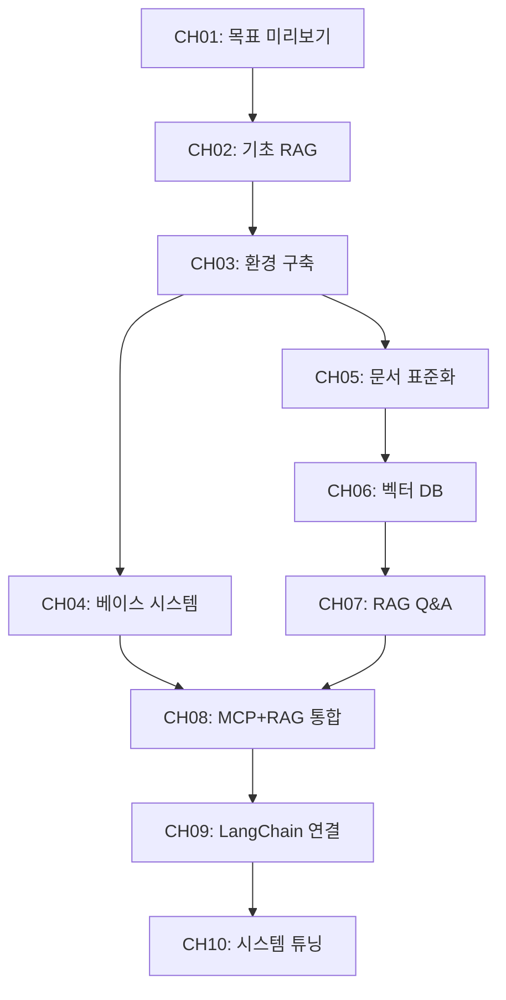

---

## 기술 스택

| 역할 | 기술 | 버전 | 비고 |
|------|------|------|------|
| LLM 추론 엔진 | Ollama | 최신 안정 | 로컬 LLM 전용, 클라우드 API 없음 |
| 기본 LLM 모델 | DeepSeek R1 | 최신 | 추론(Reasoning) 특화 |
| 이미지 LLM | LLaVA | 최신 | CH10 PDF 이미지 처리용 |
| OCR | EasyOCR | 최신 | CH10 하이브리드 PDF 처리용 |
| 파이프라인 프레임워크 | LangChain | 0.3+ | langchain, langchain-community, langchain-ollama |
| 벡터 DB | ChromaDB | 최신 안정 | 로컬 파일 기반 |
| 관계형 DB | PostgreSQL | 16 | Docker Compose로 제공 |
| API 서버 | FastAPI | 0.110+ | CRUD API 제공 |
| 언어 | Python | 3.11 | 가상환경(venv) 사용 |
| PDF 처리 | PyMuPDF, pdfplumber | 최신 | 텍스트/테이블 추출 |
| 인프라 | Docker Compose | 최신 | PostgreSQL + FastAPI 서버 |

**외부 클라우드 API 없음**: 이 책의 모든 서비스는 로컬에서 실행됩니다. 추가 비용이 발생하지 않습니다.

---

## 상세 목차

---

## [Stage 1] 비전 및 기초 RAG 체험 (CH01 - CH02, 18p)

---

## CH01. 이 책의 목표와 최종 완성본 미리보기 (6p)

> **이서연의 상황**: 팀 전체 회의에서 김도현 팀장의 3개월 미션 발표를 듣는다. "응답 시간 10분을 30초로 줄여라." RAG, MCP, 벡터 DB 등 처음 듣는 기술 용어들 앞에 얼어붙지만, 최종 데모를 보고 기대감이 싹튼다.

**학습 목표**: RAG 파이프라인의 전체 아키텍처를 이해하고, 최종 결과물이 무엇인지 데모를 통해 확인한다.

**예제 코드 경로**: `examples/CH01_목표와미리보기/`

### 1. 도입 (1p)
- 챕터 개요 및 학습 목표
- 핵심 질문: 이 책을 마치면 무엇을 만들 수 있는가?
- 이서연의 첫 번째 회의실 장면: 불안과 기대의 시작

### 2. 이 책이 다루는 범위 (1p)
- 2.1. RAG vs Fine-tuning: 왜 RAG를 선택하는가
  - Fine-tuning: 대규모 데이터와 비용 필요
  - RAG: 기존 문서를 그대로 활용, 즉시 적용 가능
- 2.2. 정형 + 비정형 데이터 통합 검색: 실무에서 필요한 이유

### 3. 최종 결과물 데모 시나리오 (2p)
- 3.1. 데모 실행: `src/demo.py` 기반
  - 복합 질의 처리: "김철수의 남은 연차는?" (DB) + "특별휴가 조건은?" (문서)
  - Mock 모드: Ollama 없이도 동작하는 시뮬레이션
- 3.2. 전체 아키텍처 한 장 요약
  - [다이어그램] 사용자 질문 → AI 에이전트 → PostgreSQL / ChromaDB → DeepSeek R1 → 최종 답변
- 3.3. 사용 기술 스택 상세: 각 기술의 역할과 선택 이유

### 4. 이 책을 마치면 할 수 있는 것 (1p)
- 구체적 역량 목록: 사내 문서 벡터화, RAG Q&A 엔진 구현, MCP 기반 DB 통합 등
- 챕터별 학습 로드맵 한눈에 보기

### 5. 정리하며 (1p)
- 핵심 요약:
  - RAG는 외부 지식을 검색하여 LLM 응답에 반영하는 기법이다
  - Fine-tuning 없이 기존 문서를 그대로 지식으로 활용할 수 있다
  - 정형(DB) + 비정형(문서) 통합 검색이 실무의 핵심이다
  - 이 책의 모든 서비스는 로컬에서 무료로 실행된다
- 다음 챕터 연결: CH02에서 DeepSeek R1을 직접 실행하고, LLM 단독 질의의 한계를 체험한다

---

## CH02. DeepSeek-R1으로 시작하는 기초 RAG 정복 (12p)

> **이서연의 상황**: "LLM한테 그냥 물어보면 되지 않나요?"라고 제안한다. 직접 시도하자 존재하지 않는 연차 규정을 자신 있게 답변한다. 실패 → 반쪽 성공 → 완전한 성공의 3단계를 직접 경험한다.

**학습 목표**: LLM 단독 질의의 한계(환각)를 체험하고, RAG가 필요한 이유를 납득한 뒤 기초 RAG를 구현한다.

**예제 코드 경로**: `examples/CH02_기초RAG/`

### 1. 도입 (1p)
- 챕터 개요 및 학습 목표
- 핵심 질문: 왜 LLM에 직접 물어보면 안 되는가?
- 이서연의 첫 번째 제안과 박민준 과장의 한마디: "데이터를 직접 줘야지"

### 2. [실패] LLM 단독 질의의 한계 (3p)
- 2.1. Ollama + DeepSeek R1 직접 질의 실습: `src/llm_direct.py` 기반
  - [코드 워크플로우] 입력: 사내 규정 질문 | 처리: DeepSeek R1 직접 질의 | 출력: 환각 답변
  - 실행 명령: `python src/main.py --step 1`
- 2.2. 환각(Hallucination)의 원리
  - 왜 LLM은 사내 규정을 모르는가: 학습 데이터에 없으므로 유사 패턴으로 추측
  - 환각 답변 vs 실제 규정 비교 분석
- [다이어그램] Step 1: 질문 → DeepSeek R1 → 환각 답변 (실패 경로)

### 3. [반쪽 성공] 프롬프트 직접 주입 (3p)
- 3.1. 컨텍스트 주입(Context Injection) 구현: `src/context_injection.py` 기반
  - [코드 워크플로우] 입력: 질문 + 문서 전문 | 처리: 프롬프트 조합 후 LLM 전달 | 출력: 정확하지만 비효율적 답변
  - 실행 명령: `python src/main.py --step 2`
- 3.2. 컨텍스트 주입의 한계
  - 토큰 윈도우 제한: 긴 문서를 전부 넣을 수 없다
  - 확장성 문제: 문서가 늘어나면 비용과 지연이 급증한다

### 4. [성공] VectorDB와 RAG의 시작 (3p)
- 4.1. ChromaDB에 문서 저장 후 검색: `src/simple_rag.py` 기반
  - [코드 워크플로우] 입력: 질문 | 처리: ChromaDB 검색 → 관련 청크 추출 → LLM 전달 | 출력: 정확한 답변 + 출처
  - 실행 명령: `python src/main.py --step 3`
- 4.2. RAG 파이프라인 3단계: 검색 → 컨텍스트 구성 → 생성
  - [다이어그램] RAG 3단계 흐름도
- 4.3. 처음으로 올바른 답변을 확인하는 순간: "이게 RAG구나"

### 5. [심화] DeepSeek-R1 추론(Reasoning) 활용 (1p)
- 5.1. 추론 토큰(Reasoning Token) 특성: `src/reasoning_demo.py` 기반
  - [코드 워크플로우] 입력: 복잡한 정책 질문 | 처리: 추론 토큰 생성 → 근거 기반 답변 | 출력: 사고 과정 포함 답변
  - 실행 명령: `python src/main.py --step 4`
- 5.2. 단순 답변 vs 근거 제시 답변 비교

### 6. 정리하며 (1p)
- 핵심 요약:
  - LLM 단독 질의는 사내 규정을 알지 못하여 환각을 일으킨다
  - 컨텍스트 주입은 토큰 한계로 확장성이 없다
  - RAG는 관련 문서만 검색하여 LLM에 전달함으로써 정확도와 효율을 동시에 확보한다
  - DeepSeek R1의 추론 토큰은 근거 있는 복잡한 분석을 가능하게 한다
- 다음 챕터 연결: CH03에서 전체 개발 환경을 체계적으로 구축한다

---

## [Stage 2] 인프라 및 표준화 (CH03 - CH05, 28p)

---

## CH03. 개발 환경 구축 (8p)

> **이서연의 상황**: 본격적으로 환경 구축을 시작하지만 PostgreSQL 버전 충돌, Ollama 다운로드 에러, pip 의존성 꼬임이 연속으로 발생한다. 김도현 팀장의 제안으로 공통 설치 스크립트를 만들면서 "팀 표준 환경"의 가치를 깨닫는다.

**학습 목표**: Ollama, PostgreSQL, Python 가상환경을 설치하고, .env 기반 환경 설정을 완료한다.

**예제 코드 경로**: `examples/CH03_개발환경구축/`

### 1. 도입 (1p)
- 챕터 개요 및 학습 목표
- 핵심 질문: 왜 개발 환경 구축이 프로젝트 성패를 좌우하는가?
- 이서연의 연속 실패 장면과 팀 표준화의 결심

### 2. Ollama 설치 및 DeepSeek R1 모델 다운로드 (2p)
- 2.1. OS별 설치 가이드: `scripts/install_ollama.sh` 기반
  - macOS: `brew install ollama`
  - Linux: 공식 설치 스크립트
  - Windows: Ollama Windows 버전 설치
- 2.2. 모델 다운로드 및 설치 확인
  - `ollama pull deepseek-r1` / 소형 모델: `ollama pull deepseek-r1:1.5b`
  - `ollama serve` 로 서버 시작 확인
- [다이어그램] 4단계 환경 구축 흐름: Ollama → PostgreSQL → Python venv → .env 설정

### 3. PostgreSQL 설치 및 초기 설정 (2p)
- 3.1. Docker Compose로 PostgreSQL 16 실행: `docker-compose.yml` 기반
  - [코드 워크플로우] 입력: docker-compose.yml | 처리: Docker Compose up | 출력: PostgreSQL + FastAPI 서버 실행
  - 인프라 레포 clone 및 샘플 데이터 적재 확인
- 3.2. Docker Compose를 사용하는 이유
  - 버전 충돌 방지, "한 줄 실행"으로 동일 환경 재현

### 4. Python 3.11 가상환경 및 패키지 설치 (2p)
- 4.1. venv 생성 및 활성화: `requirements.txt` 기반
  - [코드 워크플로우] 입력: requirements.txt | 처리: pip install | 출력: 격리된 Python 환경
  - macOS/Linux와 Windows 명령어 구분
- 4.2. 주요 패키지 버전 확인
  - langchain 0.3+, chromadb, langchain-ollama 등

### 5. 환경 변수(.env) 구성 및 LLM Provider 스위칭 설계 (1p)
- 5.1. .env.example 기반 설정: `src/config.py` 기반
  - [코드 워크플로우] 입력: .env 파일 | 처리: python-dotenv 로딩 | 출력: 환경 변수 객체
  - OLLAMA_MODEL 변경으로 모델 교체 가능
- 5.2. .env 파일을 분리하는 이유: 코드 변경 없이 설정 교체 가능

### 6. 정리하며 (0p → 섹션 5에 통합)
- 핵심 요약:
  - Docker Compose로 PostgreSQL을 격리하면 환경 충돌 없이 팀 전체가 동일한 DB를 사용한다
  - .env 파일 분리로 모델명, DB 주소 등을 코드 변경 없이 교체할 수 있다
  - venv로 프로젝트별 패키지 버전을 격리하면 의존성 충돌을 방지할 수 있다
- 다음 챕터 연결: CH04에서 구동된 PostgreSQL에 어떤 데이터가 있는지 분석한다

---

## CH04. 베이스 시스템 확보 (10p)

> **이서연의 상황**: 회사 DB에 어떤 데이터가 있는지조차 모른다. "DB 구조 좀 알려줄 수 있어요?"라고 박민준 과장에게 처음 부탁하며 협업이 시작된다. 두 사람이 함께 스키마를 분석하면서 이서연은 자신감을 얻는다.

**학습 목표**: 사내 DB 스키마를 분석하고 CRUD API 구조를 이해하며, MCP 개념을 파악한다.

**예제 코드 경로**: `examples/CH04_베이스시스템확보/`

### 1. 도입 (1p)
- 챕터 개요 및 학습 목표
- 핵심 질문: AI 에이전트가 DB에 접근하려면 무엇이 필요한가?
- 이서연과 박민준의 첫 협업 장면: "이 테이블에 연차 정보가 있구나"

### 2. 사내 시스템 확보 및 인프라 실행 (2p)
- 2.1. 인프라 레포 git clone으로 확보: `docker-compose.yml`, `scripts/seed_data.py` 기반
  - [코드 워크플로우] 입력: 인프라 레포 | 처리: Docker Compose up + 샘플 데이터 적재 | 출력: PostgreSQL + FastAPI 서버
  - 직원 DB, 휴가 DB, 매출 DB 샘플 데이터 확인

### 3. 데이터베이스 스키마 분석 (3p)
- 3.1. ERD 다이어그램: `docs/schema.sql`, `src/schema_viewer.py` 기반
  - [다이어그램] employees, leaves, sales 테이블 ERD
  - [코드 워크플로우] 입력: PostgreSQL 연결 | 처리: schema_viewer 실행 | 출력: 테이블 구조 출력
- 3.2. 스키마 분석이 먼저인 이유
  - DB 구조를 모르면 어떤 질문에 어떤 테이블을 조회할지 판단할 수 없다
  - AI 에이전트도 동일한 원리로 동작한다

### 4. CRUD API 구조 이해 (2p)
- 4.1. FastAPI CRUD 서버 엔드포인트 목록: `src/crud_api.py` 기반
  - [코드 워크플로우] 입력: HTTP 요청 | 처리: FastAPI 라우팅 → PostgreSQL 조회 | 출력: JSON 응답
  - GET/POST/PUT/DELETE 각 역할
- 4.2. Swagger UI로 직접 테스트: `http://localhost:8000/docs`
- 4.3. CRUD API를 두는 이유
  - LLM이 DB에 직접 SQL을 실행하면 보안 위험이 있다
  - API 레이어를 통해 허용된 작업만 수행하도록 제한한다

### 5. MCP(Model Context Protocol) 개념 소개 (2p)
- 5.1. MCP가 무엇인지, 왜 필요한지: `src/mcp_intro.py` 기반
  - LLM이 외부 도구/데이터에 접근하는 표준 프로토콜
  - [코드 워크플로우] 입력: 도구 목록 + 질문 | 처리: LLM의 도구 선택 및 호출 | 출력: 도구 실행 결과 반환
- 5.2. CH08에서 본격 구현 예고: 라우팅 + 도구 호출의 밑그림

### 6. 정리하며 (0p → 섹션 5에 통합)
- 핵심 요약:
  - DB 스키마 분석이 AI 에이전트 설계의 출발점이다
  - CRUD API 레이어가 LLM의 직접 SQL 실행을 방지하여 보안을 확보한다
  - MCP는 LLM이 외부 도구에 접근하는 표준화된 방식이다
  - 동료와의 협업(박민준)이 시스템 이해를 가속한다
- 다음 챕터 연결: CH05에서 벡터 DB에 넣을 사내 문서를 수집하고 표준화한다

---

## CH05. 사내 문서 표준화 (10p)

> **이서연의 상황**: 사내 매뉴얼 3,000페이지를 보고 절망한다. 김도현 팀장이 "전부 넣을 필요 없어. 핵심 문서 50개를 먼저 선별하자"고 방향을 잡아준다. 직접 문서를 분류하고 전처리하면서 데이터 품질의 중요성을 체감한다.

**학습 목표**: PDF/Word/Markdown 문서를 수집, 전처리, 정규화하는 파이프라인을 구축한다.

**예제 코드 경로**: `examples/CH05_사내문서표준화/`

### 1. 도입 (1p)
- 챕터 개요 및 학습 목표
- 핵심 질문: 문서를 그냥 넣으면 안 되는 이유는 무엇인가?
- "GIGO(Garbage In, Garbage Out)" 원칙: 문서 품질이 RAG 성능의 70%를 결정한다

### 2. RAG 검색 품질을 결정하는 문서 기준 (2p)
- 2.1. 어떤 문서를 선별해야 하는가: `docs/quality_checklist.md` 기반
  - 핵심 문서 선별 기준: 정확성, 최신성, 범위 적절성
  - 모든 문서를 넣으면 오히려 정확도가 떨어지는 이유
- 2.2. 3,000페이지 중 핵심 50개 문서를 선별하는 전략

### 3. PDF, Word, Markdown 수집 전략 (2p)
- 3.1. 파일 형식별 수집기 구현: `src/collector.py` 기반
  - [코드 워크플로우] 입력: 문서 디렉토리 | 처리: 형식별 파서 적용 | 출력: 원시 텍스트 목록
  - PDF, Word (.docx), Markdown 각각의 수집 방법
- 3.2. 디렉토리 구조 설계: 부서별, 카테고리별 정리 방법

### 4. 문서 전처리 및 정규화 가이드라인 (3p)
- 4.1. 전처리 파이프라인: `src/preprocessor.py` 기반
  - [코드 워크플로우] 입력: 원시 텍스트 | 처리: 머리글/바닥글 제거, 페이지 번호 삭제, 특수문자 처리 | 출력: 정제된 텍스트
  - PDF 머리글/바닥글 제거, 표 정규화, 특수문자 처리
- 4.2. 정규화 파이프라인: `src/normalizer.py` 기반
  - [코드 워크플로우] 입력: 정제된 텍스트 | 처리: 일관된 Markdown 형식으로 변환 | 출력: 표준화된 .md 파일
  - 다양한 형식을 일관된 Markdown으로 통일
- 4.3. "이 문서는 깨끗한데, 이건 표가 깨져 있네요": 이서연이 직접 데이터 품질을 체감하는 장면

### 5. 문서 버전 관리 및 메타데이터 설계 (2p)
- 5.1. 메타데이터 추출 및 태깅: `src/metadata.py` 기반
  - [코드 워크플로우] 입력: 표준화된 문서 | 처리: 부서/버전/작성일/카테고리 추출 | 출력: 메타데이터 JSON
  - 문서별 메타데이터(부서, 버전, 작성일, 카테고리) 구조 설계
- 5.2. 메타데이터가 검색 품질에 미치는 영향
  - "HR 부서 문서에서만 검색"과 같은 필터링이 가능해지는 원리
- 5.3. 버전 관리 전략: 업데이트된 문서를 벡터 DB에 반영하는 방법

### 6. 정리하며 (0p → 섹션 5에 통합)
- 핵심 요약:
  - GIGO 원칙: 문서 품질이 RAG 검색 정확도의 70%를 결정한다
  - 3,000페이지를 전부 넣는 것보다 핵심 50개를 선별하는 것이 성능이 좋다
  - 전처리로 머리글/바닥글/페이지 번호를 제거해야 검색 노이즈가 줄어든다
  - 메타데이터(부서, 카테고리)를 추가하면 필터링 검색이 가능해진다
- 다음 챕터 연결: CH06에서 표준화된 문서를 청킹하고 ChromaDB에 벡터로 저장한다

---

## [Stage 3] 지식 검색 엔진 구축 (CH06 - CH07, 24p)

---

## CH06. 벡터 DB 구축 (12p)

> **이서연의 상황**: CH05에서 정리한 문서를 ChromaDB에 넣는다. 처음으로 "연차 규정"을 검색하자 관련 청크가 정확히 반환된다. "세상에, 진짜 찾아오네요!" 처음으로 성취감을 느끼는 순간이다.

**학습 목표**: 텍스트 추출, 청킹, 임베딩을 거쳐 ChromaDB에 문서를 저장하고 검색한다.

**예제 코드 경로**: `examples/CH06_벡터DB구축/`

### 1. 도입 (1p)
- 챕터 개요 및 학습 목표
- 핵심 질문: 문서를 어떻게 숫자(벡터)로 바꾸고, 그것이 왜 검색에 유리한가?
- [다이어그램] 전체 파이프라인: 표준화된 문서 → 추출 → 청킹 → 임베딩 → ChromaDB

### 2. 텍스트 추출 (PyMuPDF, pdfplumber) (2p)
- 2.1. PDF에서 텍스트를 추출하는 두 가지 방법: `src/extractor.py` 기반
  - [코드 워크플로우] 입력: PDF 파일 | 처리: PyMuPDF(빠른 텍스트 추출) 또는 pdfplumber(테이블 인식) | 출력: 순수 텍스트
  - 실행 명령: `python src/main.py`
- 2.2. PyMuPDF vs pdfplumber 비교: 각각의 장단점과 사용 시점
  - PyMuPDF: 속도 우선, 일반 텍스트 중심 문서에 적합
  - pdfplumber: 테이블 인식 정확도 우선, 재무/인사 문서에 적합

### 3. 청킹(Chunking) 전략 — Fixed-size vs Semantic (3p)
- 3.1. Fixed-size 청킹 구현: `src/chunker.py` 기반
  - [코드 워크플로우] 입력: 추출된 텍스트 | 처리: 500자 크기로 분할, 50자 오버랩 | 출력: 청크 목록
  - 예상 결과: 3개 문서 → 20개 청크, 평균 461.2자
- 3.2. Semantic 청킹과의 비교
  - 고정 크기: 구현 단순, 문맥 단절 가능성
  - 의미 기반: 문맥 보존, 처리 복잡
- 3.3. 오버랩(Overlap) 설정의 역할: 인접 청크 간 문맥 단절 방지
- 3.4. 청킹이 필요한 이유: 문서 전체를 하나의 벡터로 만들면 세부 정보가 희석된다

### 4. 임베딩 모델 선택 및 적용 (2p)
- 4.1. Ollama 임베딩 모델 사용: `src/embedder.py` 기반
  - [코드 워크플로우] 입력: 청크 목록 | 처리: Ollama nomic-embed-text 호출 (실패 시 sentence-transformers fallback) | 출력: 벡터 배열 (384차원)
  - `ollama pull nomic-embed-text`
- 4.2. 임베딩 차원과 성능의 관계
- 4.3. Fallback 전략: Ollama 미설치 시 sentence-transformers로 자동 대체

### 5. ChromaDB에 저장 및 컬렉션 관리 (3p)
- 5.1. 컬렉션 생성 및 문서 저장: `src/store.py`, `src/main.py` 기반
  - [코드 워크플로우] 입력: 벡터 배열 + 메타데이터 | 처리: ChromaDB 컬렉션 생성 + 저장 | 출력: 영속 저장된 벡터 DB
  - 컬렉션명: `connecthr_docs`, 저장 경로: `./outputs/chroma_db`
- 5.2. 유사도 검색 테스트
  - 쿼리 1: "연차 휴가는 몇 일 발생하나요?" → leave_rules.txt 상위 반환 (유사도 82.3%)
  - 쿼리 2: "재택근무 규정이 어떻게 되나요?" → hr_policy.txt 상위 반환 (유사도 85.6%)
  - 쿼리 3: "비밀번호 정책은 무엇인가요?" → it_guide.txt 상위 반환 (유사도 88.4%)
- 5.3. ChromaDB를 선택한 이유: pip install 한 줄, 로컬 파일 기반, LangChain 직접 통합
- 5.4. 영속 저장(persist) 설정: 재시작 후에도 벡터 유지

### 6. 정리하며 (1p)
- 핵심 요약:
  - 텍스트 추출기는 문서 유형에 따라 선택한다 (PyMuPDF vs pdfplumber)
  - 청킹은 문서를 검색 가능한 작은 단위로 분할하며, 오버랩으로 문맥 단절을 방지한다
  - 임베딩은 텍스트를 수치 벡터로 변환하여 의미 기반 검색을 가능하게 한다
  - ChromaDB는 벡터를 영속 저장하고 유사도 검색을 수행하는 핵심 인프라다
  - 청크 크기 파라미터 하나가 검색 결과를 좌우한다
- 다음 챕터 연결: CH07에서 이 ChromaDB 컬렉션을 LangChain RAG 파이프라인과 연결한다

---

## CH07. RAG Q&A 엔진 구현 (12p)

> **이서연의 상황**: 팀 내부 데모 날이다. "특별휴가 조건이 뭐예요?"라고 질문하자 HR 매뉴얼 3.2절을 인용하며 정확한 답변이 나온다. 박민준 과장이 처음으로 "이건 쓸 만하겠는데"라고 인정한다. 그러나 김도현 팀장이 "DB 질문도 처리할 수 있어야 해"라고 다음 목표를 제시한다.

**학습 목표**: LangChain 기반 RAG 파이프라인을 설계하고, 출처 표시가 포함된 Q&A 시스템을 구현한다.

**예제 코드 경로**: `examples/CH07_RAG_QA엔진/`

### 1. 도입 (1p)
- 챕터 개요 및 학습 목표
- 핵심 질문: 검색 결과를 어떻게 LLM에 연결하고, 어떻게 출처를 표시하는가?
- 이서연의 첫 번째 내부 데모와 팀의 반응

### 2. LangChain RAG 파이프라인 설계 (3p)
- 2.1. LCEL(LangChain Expression Language) 기반 파이프라인: `src/rag_chain.py` 기반
  - [코드 워크플로우] 입력: 사용자 질문 | 처리: Retriever → Prompt 조합 → LLM 호출 → Output 파싱 | 출력: 구조화된 답변
  - LangChain 체인 구성: Retriever | Prompt | LLM | StrOutputParser
- 2.2. LangChain을 사용하는 이유
  - 각 컴포넌트(Retriever, Prompt, LLM)를 표준 인터페이스로 연결
  - 컴포넌트 교체가 용이: Ollama → OpenAI 전환도 몇 줄 변경으로 가능
- [다이어그램] LangChain LCEL 체인 구조: 질문 → Retriever → ChromaDB → RAGChain → DeepSeek R1 → CitationFormatter → 사용자

### 3. 유사도 검색 및 컨텍스트 구성 (2p)
- 3.1. ChromaDB top-k 검색: `src/retriever.py` 기반
  - [코드 워크플로우] 입력: 질문 벡터 | 처리: 유사도 상위 k개 검색 | 출력: 관련 청크 목록 + 메타데이터
  - 기본 k=3 설정, 검색 결과 예시
- 3.2. 검색된 청크를 프롬프트 컨텍스트로 조합하는 방법
- 3.3. k값에 따른 결과 차이
  - k가 너무 작으면: 관련 정보를 놓침
  - k가 너무 크면: 노이즈가 섞여 답변 품질 저하

### 4. 출처 표시(Source Citation) 시스템 (3p)
- 4.1. 답변에 근거 문서와 페이지를 함께 표시: `src/citation.py` 기반
  - [코드 워크플로우] 입력: LLM 답변 + 검색 메타데이터 | 처리: 출처 포맷팅 | 출력: "HR 매뉴얼 3.2절에 따르면... (출처: HR 취업규칙 v1.0, 관련도 92%)"
  - 예상 결과: 참고 문서 + 관련도 함께 표시
- 4.2. 메타데이터를 활용한 출처 추적 방법
- 4.3. 출처 표시가 중요한 이유
  - 기업 환경에서 AI 답변은 근거가 없으면 신뢰받지 못한다
  - "HR 매뉴얼 3.2절에 따르면..."이 답변의 신뢰도를 결정한다

### 5. 기본 채팅 인터페이스 연결 (2p)
- 5.1. CLI 기반 채팅 인터페이스: `app/chat_ui.py` 기반
  - [코드 워크플로우] 입력: 사용자 터미널 입력 | 처리: RAG Chain 실행 | 출력: 답변 + 출처 + 응답 시간
  - 실행 명령: `python src/main.py` (채팅 모드) / `python src/main.py --demo` (데모 모드)
  - 명령어: `/quit`, `/clear`, `/stats`, `/help`
- 5.2. 대화 히스토리 관리: 이전 대화 맥락 유지 방법

### 6. 정리하며 (1p)
- 핵심 요약:
  - LangChain LCEL로 Retriever → Prompt → LLM → Output 체인을 표준화된 방식으로 연결한다
  - top-k 검색의 k값은 검색 정확도와 노이즈 사이의 균형을 결정한다
  - 출처 표시는 기업 환경에서 AI 답변의 신뢰도를 확보하는 필수 요소다
  - 이것으로 사내 문서 검색 시스템이 완성되었다. 다음은 DB 통합이다
- 다음 챕터 연결: CH08에서 RAG Q&A와 CRUD API(MCP)를 하나의 에이전트로 통합한다

---

## [Stage 4] 지능형 에이전트 완성 (CH08 - CH10, 30p)

---

## CH08. 통합 에이전트 설계 (MCP + RAG) (10p)

> **이서연의 상황**: 고객이 "김철수 씨의 이번 달 남은 연차는?"이라고 묻는다. DB도 뒤지고, 문서도 검색해야 한다. "두 가지를 동시에 어떻게 처리하죠?" 이서연이 직접 라우터를 구현하고, 처음으로 통합 답변을 생성하는 순간의 성취감.

**학습 목표**: 정형 DB와 비정형 문서를 동시에 질의하는 통합 에이전트를 구현한다.

**예제 코드 경로**: `examples/CH08_통합에이전트MCP_RAG/`

### 1. 도입 (1p)
- 챕터 개요 및 학습 목표
- 핵심 질문: 정형(DB)과 비정형(문서) 데이터를 어떻게 하나의 에이전트로 처리하는가?
- 이서연의 복합 질문 처리 고민과 김도현의 힌트: "질문을 먼저 분류해보자"

### 2. 정형/비정형 분리 원칙 (1p)
- 2.1. 정형 데이터(DB)와 비정형 데이터(문서)의 차이: `docs/routing_design.md` 기반
  - 정형: 구조화된 테이블, SQL로 정확한 값 조회
  - 비정형: 자유형 문서, 의미 기반 검색 필요
- 2.2. 각각에 최적화된 검색 전략
- 2.3. 왜 분리해서 처리하는 것이 효율적인지

### 3. 질문 라우팅 전략 (규칙 기반 → LLM 판단) (3p)
- 3.1. 규칙 기반 라우팅 구현: `src/router.py` 기반
  - [코드 워크플로우] 입력: 사용자 질문 | 처리: 키워드 패턴 매칭 | 출력: DB 질의 / 문서 검색 / 복합 분류
  - "남은 연차" → DB 질의, "연차 규정" → 문서 검색
- 3.2. LLM 기반 의도 분류로 발전
  - [코드 워크플로우] 입력: 질문 | 처리: LLM 의도 분류 프롬프트 | 출력: 라우팅 결정(DB / 문서 / 복합)
  - 자연어의 다양한 표현을 커버하는 이유
- [다이어그램] 라우팅 흐름: 질문 → Router → DB(MCP Tool) / 문서(RAG Chain) / 둘 다

### 4. 통합 응답 전략 (DB 조회 + 문서 검색 + LLM 합성) (3p)
- 4.1. DB 결과와 문서 검색 결과를 하나의 응답으로 합성: `src/integrator.py` 기반
  - [코드 워크플로우] 입력: DB 조회 결과 + 문서 검색 결과 | 처리: LLM 응답 합성 | 출력: "김철수의 남은 연차는 3일이며, 연차 규정에 따르면..."
- 4.2. 통합 에이전트 구조: `src/agent.py` 기반
  - Router → MCP Tool(DB) + RAG Chain(문서) → Integrator → 최종 답변

### 5. 대표 질문 시나리오 10개 실습 (2p)
- 5.1. 정형 전용 질문 (4개): "김철수의 남은 연차는 몇 일인가?" 등
- 5.2. 비정형 전용 질문 (3개): "특별휴가 신청 조건은?" 등
- 5.3. 복합 질문 (3개): "김철수의 연차 잔여일과 연차 사용 규정을 함께 알려줘" 등
  - 테스트 실행: `tests/test_scenarios.py`

### 6. 정리하며 (0p → 섹션 5에 통합)
- 핵심 요약:
  - 질문 라우팅이 통합 에이전트의 핵심이다: 잘못된 경로는 엉뚱한 답변을 만든다
  - 규칙 기반에서 LLM 판단으로 발전해야 자연어의 다양한 표현을 커버할 수 있다
  - MCP는 LLM이 외부 도구(DB API)를 표준화된 방식으로 호출하는 프로토콜이다
  - DB + 문서 통합 답변으로 "두 세계를 연결"하는 순간이 이 시스템의 핵심 가치다
- 다음 챕터 연결: CH09에서 이 에이전트를 프로덕션 수준으로 강화한다

---

## CH09. LangChain 최종 연결 (10p)

> **이서연의 상황**: 개발 버전을 팀 내부에서 쓰다 보니 가끔 튕기고, 느리고, 로그도 없다. 타임아웃, 재시도, 로깅을 추가하면서 "개발과 운영의 차이"를 체감한다. 박민준이 "도구 설명이 부정확해서 잘못 호출된다"고 지적하는 장면.

**학습 목표**: Router/Agent/RAG Chain/MCP Tool을 프로덕션 수준으로 연결하고 운영 설정을 적용한다.

**예제 코드 경로**: `examples/CH09_LangChain최종연결/`

### 1. 도입 (1p)
- 챕터 개요 및 학습 목표
- 핵심 질문: 개발 환경에서 작동하는 것과 안정적으로 운영하는 것은 무엇이 다른가?
- 이서연의 "왜 갑자기 응답이 안 오죠?" 당혹감과 김도현의 "이제 제대로 만들어보자"

### 2. Router / Agent / RAG Chain / MCP Tool 구성 (3p)
- 2.1. LangChain Agent 전체 아키텍처: `src/agent_config.py` 기반
  - [코드 워크플로우] 입력: 사용자 질문 | 처리: Agent → 도구 선택 → 도구 실행 → 응답 합성 | 출력: 최종 답변
  - Agent가 도구를 선택하고 실행하는 ReAct 흐름
- 2.2. Agent 아키텍처를 사용하는 이유
  - 단순 체인: 고정된 순서로만 실행
  - Agent: 질문에 따라 어떤 도구를 사용할지 스스로 결정
- [다이어그램] LangChain Agent 전체 구성: 질문 → Agent → MCP Tools / RAG Chain → 응답 합성 → 로깅/캐싱 → 최종 답변

### 3. MCP Tool 설계 (get_leave_balance, get_sales_sum 등) (2p)
- 3.1. FastAPI 엔드포인트를 LangChain Tool로 래핑: `src/mcp_tools.py` 기반
  - [코드 워크플로우] 입력: Tool 이름 + 파라미터 | 처리: FastAPI CRUD API 호출 | 출력: JSON 결과 → LLM 전달
  - `get_leave_balance(employee_id)`, `get_sales_sum(month)` 등
- 3.2. Tool description이 LLM 선택에 미치는 영향
  - LLM은 도구의 설명을 읽고 어떤 도구를 호출할지 판단한다
  - 설명이 부정확하면 잘못된 도구를 선택한다: 박민준의 지적 장면

### 4. 운영 설정 (Timeout, Retry, 로깅, 캐싱) (3p)
- 4.1. 타임아웃 및 재시도 로직: `src/monitoring.py` 기반
  - [코드 워크플로우] 입력: API 요청 | 처리: 타임아웃 설정 + 지수 백오프 재시도 | 출력: 성공 또는 명확한 오류 메시지
  - 타임아웃 없이 배포하면 하나의 느린 질문이 전체 시스템을 멈출 수 있는 이유
- 4.2. 구조화된 로깅: `src/monitoring.py` 기반
  - 응답 시간, 사용된 도구, 오류 추적
- 4.3. 반복 질문에 대한 캐싱: `src/cache.py` 기반
  - [코드 워크플로우] 입력: 질문 해시 | 처리: 캐시 조회 (있으면 즉시 반환, 없으면 RAG 실행 후 저장) | 출력: 캐시된 답변 또는 신규 답변

### 5. 비용 관리 및 토큰 모니터링 (1p)
- 5.1. 토큰 사용량 추적: `src/token_tracker.py` 기반
  - [코드 워크플로우] 입력: 프롬프트 + 응답 | 처리: 토큰 카운트 집계 | 출력: 누적 토큰 사용량 리포트
  - 로컬 LLM도 메모리와 CPU를 소비한다
  - 프롬프트 최적화로 응답 시간 단축

### 6. 정리하며 (0p → 섹션 5에 통합)
- 핵심 요약:
  - LangChain Agent는 도구를 스스로 선택하여 단순 체인의 한계를 극복한다
  - Tool description의 정확성이 에이전트 동작의 핵심이다
  - 타임아웃, 재시도, 로깅은 개발 단계가 아닌 운영 단계의 필수 요소다
  - 캐싱으로 반복 질문의 응답 속도를 크게 향상시킬 수 있다
- 다음 챕터 연결: CH10에서 완성된 시스템의 정확도를 측정하고 체계적으로 개선한다

---

## CH10. RAG 시스템 튜닝 (10p)

> **이서연의 상황**: 내부 테스트에서 정확도 72%. "왜 이 질문에는 엉뚱한 답이 나오지?" 김도현 팀장이 "감으로 고치지 말고, 테스트 케이스를 만들자"고 한다. 30개 테스트 질문으로 체계적으로 개선하여 3개월 미션을 달성하는 성장의 완결.

**학습 목표**: 증상별 튜닝, 고급 검색 기법(ReRanker, Hybrid Search), 평가 체계를 구축하여 정확도를 개선한다.

**예제 코드 경로**: `examples/CH10_RAG시스템튜닝/`

### 1. 도입 (1p)
- 챕터 개요 및 학습 목표
- 핵심 질문: 정확도를 체계적으로 측정하고 개선하려면 어떻게 해야 하는가?
- 이서연의 72% 정확도 좌절과 "감으로 고치지 말자"는 결심

### 2. 증상별 튜닝 가이드 (2p)
- 2.1. 증상 분류 및 원인-해결 매트릭스: `docs/tuning_guide.md` 기반
  - 환각(근거 없는 답변): 원인 및 해결 방법
  - 근거 부족(출처 미표시): 원인 및 해결 방법
  - 엉뚱한 문서(관련 없는 청크 반환): 원인 및 해결 방법
- 2.2. 증상별 접근이 필요한 이유
  - "정확도가 낮다"는 추상적이다: 구체적인 증상을 식별해야 올바른 해결책을 적용할 수 있다

### 3. Chunk/Retriever 튜닝 (2p)
- 3.1. Semantic Chunk로 변경 및 k값 조정: `src/tuner.py` 기반
  - [코드 워크플로우] 입력: 현재 설정 (fixed 500자, k=3) | 처리: 파라미터 변경 및 재색인 | 출력: 검색 결과 비교
  - 각 변경이 검색 결과에 미치는 영향을 실측
- 3.2. Metadata Filtering 적용
  - "HR 부서 문서에서만" 검색하여 노이즈 감소

### 4. 고급 기술 (ReRanker, Hybrid Search, Parent Document Retriever) (2p)
- 4.1. ReRanker로 검색 결과 재정렬: `src/reranker.py` 기반
  - [코드 워크플로우] 입력: top-k 검색 결과 | 처리: 질문-청크 관련성 재평가 | 출력: 재정렬된 결과
  - 벡터 유사도 vs 답변 적합도의 차이
- 4.2. Hybrid Search (벡터 + BM25): `src/hybrid_search.py` 기반
  - [코드 워크플로우] 입력: 질문 | 처리: 벡터 검색 결과 + BM25 키워드 검색 결과 합산 | 출력: 통합 순위
  - 벡터 검색의 의미적 강점 + BM25의 키워드 매칭 강점 결합
- 4.3. Parent Document Retriever
  - 작은 청크로 검색하되, 반환 시 더 큰 문맥 제공

### 5. 프롬프트 튜닝 (1p)
- 5.1. 튜닝된 프롬프트 템플릿: `src/prompts.py` 기반
  - [코드 워크플로우] 입력: 기본 프롬프트 | 처리: 근거 우선 답변 지시 + "모르면 모른다" 원칙 적용 | 출력: 환각 감소 답변
  - 프롬프트 엔지니어링으로 환각 감소

### 6. PDF 이미지 처리 (LLaVA + EasyOCR 하이브리드) (1p)
- 6.1. PDF 내 이미지/도표 처리: `src/vision_extractor.py` 기반
  - [코드 워크플로우] 입력: 이미지 포함 PDF | 처리: LLaVA 이미지 설명 생성 + EasyOCR 텍스트 추출 | 출력: 이미지 내용 텍스트화
  - LLaVA + EasyOCR 하이브리드의 장점: 시각적 정보까지 RAG에 활용

### 7. 평가 체계 구축 (2p)
- 7.1. 테스트셋 30개 설계 및 평가 스크립트: `src/evaluator.py`, `tests/test_set.json` 기반
  - [코드 워크플로우] 입력: 30개 테스트 질문 | 처리: RAG 시스템 실행 → 답변 생성 → 정답 비교 | 출력: Retrieval 정확도 + Hallucination Rate
  - 정형/비정형/복합 질문 각 10개씩 구성
- 7.2. 개선 전후 비교표: 72% → 목표 달성 과정
- 7.3. 평가 체계가 필요한 이유
  - 감으로 개선하면 한 곳을 고치면서 다른 곳이 망가진다
  - 체계적 테스트셋이 있어야 개선을 측정할 수 있다

### 8. 정리하며 (1p)
- 핵심 요약:
  - 증상별 접근으로 구체적인 문제를 식별해야 올바른 튜닝이 가능하다
  - ReRanker는 벡터 유사도 검색의 약점인 "답변 적합도"를 보정한다
  - Hybrid Search는 의미 검색(벡터)과 키워드 검색(BM25)의 장점을 결합한다
  - 30개 테스트셋 기반 평가 체계가 체계적 개선의 기반이다
  - 이서연은 처음 얼어붙던 회의실에서 이제 자신 있게 결과를 발표한다
- 마무리: 3개월 미션 달성 — 응답 시간 10분 → 30초 이하

---

## 자체 검증 결과

| 항목 | 확인 |
|------|------|
| 총 페이지 합계 | 100p (6+12+8+10+10+12+12+10+10+10) |
| 100p 이하 조건 | 충족 |
| 모든 예제 파일 매핑 | 완료 (CH01-CH10 전체 커버) |
| 챕터 간 연결 자연스러움 | 확인 (각 챕터 "다음 챕터 연결" 명시) |
| chapter_spec 모든 섹션 반영 | 확인 (각 챕터 섹션 구조 1:1 매핑) |
| Stage 4단계 구조 반영 | 확인 (CH01-02 / CH03-05 / CH06-07 / CH08-10) |
| 이서연 스토리 아크 포함 | 확인 (각 챕터 도입부에 배치) |
| 기술 스택 버전 명시 | 확인 (전체 구성 개요 섹션) |

---

## 예제 코드 매핑 요약

| 챕터 | 예제 경로 | 핵심 파일 |
|------|---------|---------|
| CH01 | `examples/CH01_목표와미리보기/` | `src/demo.py` |
| CH02 | `examples/CH02_기초RAG/` | `src/llm_direct.py`, `src/context_injection.py`, `src/simple_rag.py`, `src/reasoning_demo.py` |
| CH03 | `examples/CH03_개발환경구축/` | `scripts/install_ollama.sh`, `docker-compose.yml`, `requirements.txt`, `src/config.py` |
| CH04 | `examples/CH04_베이스시스템확보/` | `docker-compose.yml`, `src/schema_viewer.py`, `src/crud_api.py`, `src/mcp_intro.py` |
| CH05 | `examples/CH05_사내문서표준화/` | `src/collector.py`, `src/preprocessor.py`, `src/normalizer.py`, `src/metadata.py` |
| CH06 | `examples/CH06_벡터DB구축/` | `src/extractor.py`, `src/chunker.py`, `src/embedder.py`, `src/store.py` |
| CH07 | `examples/CH07_RAG_QA엔진/` | `src/rag_chain.py`, `src/retriever.py`, `src/citation.py`, `app/chat_ui.py` |
| CH08 | `examples/CH08_통합에이전트MCP_RAG/` | `src/router.py`, `src/integrator.py`, `src/agent.py`, `tests/test_scenarios.py` |
| CH09 | `examples/CH09_LangChain최종연결/` | `src/agent_config.py`, `src/mcp_tools.py`, `src/monitoring.py`, `src/cache.py` |
| CH10 | `examples/CH10_RAG시스템튜닝/` | `src/tuner.py`, `src/reranker.py`, `src/hybrid_search.py`, `src/evaluator.py` |

---

# 1장. 이 책의 목표와 최종 완성본 미리보기

이 장에서는 이 책 전체를 통해 무엇을 만드는지 미리 확인합니다. 최종 완성본의 데모를 직접 실행하고, 전체 아키텍처와 학습 로드맵을 한눈에 파악하는 것이 목표입니다.

---

<!-- [GEMINI PROMPT: 01_chapter-opening]
Warm office illustration: A young woman (28, developer) sits at a meeting room table surrounded by colleagues,
looking slightly anxious at a whiteboard filled with unfamiliar tech terms (RAG, MCP, Vector DB).
Soft color palette (warm beige, light blue), friendly cartoon style, showing the problem/challenge clearly,
no text overlay, clean background with subtle workplace elements. 16:9 aspect ratio.
Style: office-illustration-warm
-->
*그림 1-1: 팀 회의에서 낯선 기술 용어 앞에 멈추는 이서연*

---

이서연은 오전 팀 전체 회의에서 김도현 팀장의 발표를 듣고 있었습니다. 슬라이드에는 굵은 글씨로 이런 문장이 적혀 있었습니다.

> "연말까지 고객 문의 응답 시간을 10분에서 30초로 줄여라."

이어지는 화면에는 낯선 단어들이 줄줄이 등장했습니다. RAG, MCP, 벡터 DB, ChromaDB, LangChain. 이서연은 Python 경력 2년차지만, 이 용어들은 하나도 들어본 적이 없었습니다. 옆자리의 박민준 과장은 노트에 무언가를 받아 적고 있었고, 팀장은 화면에 데모 영상을 띄웠습니다.

터미널에 질문 하나가 입력되었습니다. "김철수 사원의 남은 연차는 며칠인가요?" 0.8초 뒤, 답변이 출력되었습니다. "김철수 사원의 남은 연차는 12일입니다. (총 15일 중 3일 사용)" 그리고 다음 질문. "연차 규정에서 특별휴가 신청 조건은 무엇인가요?" 이번에는 HR 매뉴얼의 특정 페이지를 인용하며 답변이 나왔습니다. 이서연은 잠시 멈췄습니다. '이걸 내가 만들 수 있다면.'

이 책은 그 데모를 처음부터 직접 구현하는 과정을 담고 있습니다.

---

## 1.1 이 책이 다루는 범위

### RAG를 선택한 이유: Fine-tuning과의 차이

AI를 사내 시스템에 도입하는 방법은 크게 두 가지입니다. 하나는 **파인튜닝(Fine-tuning)**, 다른 하나는 **RAG(Retrieval-Augmented Generation, 검색 증강 생성)** 입니다.

파인튜닝은 LLM 모델 자체를 사내 데이터로 다시 학습시키는 방식입니다. 모델이 사내 지식을 "기억"하게 만드는 것이라고 볼 수 있습니다. 그러나 이 방식은 수천~수만 건의 학습 데이터와 수십 GB의 GPU 메모리, 그리고 상당한 시간과 비용이 필요합니다. 문서가 업데이트될 때마다 재학습해야 한다는 것도 큰 단점입니다.

RAG는 다릅니다. 모델을 건드리지 않습니다. 사용자가 질문을 하면 외부 저장소에서 관련 문서를 검색하여 LLM에 함께 전달합니다. LLM은 그 문서를 읽고 답변을 생성합니다. 문서가 업데이트되면 저장소만 갱신하면 됩니다. 모델은 그대로입니다.

> **참고: 이 책이 다루지 않는 것**
> 이 책은 파인튜닝(Fine-tuning), 클라우드 LLM API(OpenAI, Anthropic), 프로덕션 배포(Kubernetes)를 다루지 않습니다. 모든 서비스는 로컬에서 무료로 실행되며, 클라우드 비용이 발생하지 않습니다.

### 정형 + 비정형 통합이 필요한 이유

실무에서 고객이 보내는 질문은 두 종류의 데이터를 동시에 필요로 합니다.

| 질문 유형 | 예시 | 필요한 데이터 |
|---------|------|------------|
| 정형 데이터 질의 | "김철수의 남은 연차는?" | PostgreSQL DB의 employees 테이블 |
| 비정형 문서 질의 | "특별휴가 신청 조건은?" | HR 매뉴얼 PDF의 특정 페이지 |
| 복합 질의 | "3분기 영업팀 매출과 관련 보고서를 함께 알려줘" | DB + 문서 동시 조회 |

DB만 연결하면 문서 질문에 답할 수 없습니다. 문서만 연결하면 정확한 수치 데이터를 가져오지 못합니다. 이 책의 목표는 두 가지를 하나의 에이전트로 처리하는 시스템을 구축하는 것입니다.

---

## 1.2 최종 결과물 데모 시나리오

### 데모 실행: Mock 모드로 전체 흐름 체험

1장의 예제 코드는 Ollama(로컬 LLM)가 없어도 동작하는 **Mock 시뮬레이션** 입니다. 최종 완성 시스템의 Q&A 흐름을 미리 체험하는 것이 목적입니다.

아래 순서대로 실행하십시오.

```bash
git clone https://github.com/{repo}/CH01_목표와미리보기
cd CH01_목표와미리보기
cp .env.example .env
pip install -r requirements.txt
python src/demo.py
```

> **팁: Ollama 없이도 실행 가능**
> CH01 데모는 `DEMO_MODE=mock` 설정이 기본값입니다. Ollama가 설치되지 않아도 미리 준비된 Mock 응답으로 전체 Q&A 흐름을 시뮬레이션합니다. 실제 LLM 연동은 CH02부터 단계적으로 구현합니다.

실행 결과는 다음과 같이 출력됩니다.

```
============================================================
  AI 업무 비서 구축: RAG + MCP 실전 가이드
  CH01 최종 완성본 미리보기 데모
============================================================

  Ollama 연결 상태 확인
============================================================
  서버 주소  : http://localhost:11434
  모델       : deepseek-r1
  상태       : [연결 안 됨] 오프라인 (데모 모드로 계속 진행)

  [안내] Ollama가 실행되지 않아도 이 데모는 정상 동작합니다.
  [안내] 실제 LLM 응답은 CH02부터 단계별로 구현합니다.

  --- 시나리오 1 ---
  [질문] 김철수 사원의 남은 연차는 며칠인가요?
  [데이터 출처] 정형 데이터 (PostgreSQL)
  [처리 경로] MCP Tool -> SQL 조회

  [AI 답변]
  김철수 사원의 남은 연차는 12일입니다. (2024년 기준, 총 15일 중 3일 사용)

  --- 시나리오 2 ---
  [질문] 연차 규정에서 특별휴가 신청 조건은 무엇인가요?
  [데이터 출처] 비정형 데이터 (ChromaDB 벡터 검색)
  [처리 경로] RAG Chain -> 문서 검색 -> LLM 생성

  [AI 답변]
  특별휴가는 결혼, 출산, 사망 등 경조사 발생 시 신청 가능합니다.
  최소 3일 전 팀장 승인이 필요합니다.
  [출처: HR_취업규칙_v1.0.pdf, 15페이지]
```

<!-- [CAPTURE NEEDED: 01_demo-run — `python src/demo.py` 실행 후 터미널에 출력된 전체 데모 화면 (Ollama 오프라인 상태, Mock 응답 출력 완료 상태)] -->
*그림 1-2: CH01 데모 실행 결과 — Mock 모드로 Q&A 흐름 시뮬레이션*

전체 소스 코드는 `src/demo.py`에 있습니다. 핵심 구조만 살펴보면 `main()` 함수가 다섯 단계를 순서대로 호출합니다.

```python
def main() -> None:
    config = load_env_config()          # 1. 환경 변수 로드
    check_ollama_connection(...)        # 2. Ollama 연결 확인
    print_architecture_diagram()        # 3. 시스템 아키텍처 출력
    print_stage_roadmap()               # 4. 학습 로드맵 출력
    print_mock_qa_demo()                # 5. Q&A 시뮬레이션
```

#### 코드 워크플로우 (Code Workflow)

1. **입력(Input)**: `.env` 파일에서 `OLLAMA_BASE_URL`, `OLLAMA_MODEL`, `DEMO_MODE` 값을 읽습니다.
2. **처리(Process)**: Ollama 서버 연결을 시도합니다. 연결에 실패하면 Mock 모드로 전환하여 미리 준비된 Q&A 응답을 순서대로 출력합니다.
3. **출력(Output)**: 아키텍처 다이어그램, 4단계 로드맵, 3가지 시나리오 Q&A 결과를 터미널에 출력합니다.

전체 코드는 GitHub 레포를 참고하십시오.

---

## 1.3 전체 아키텍처 한 장 요약

이 책을 완독하면 아래 구조의 시스템이 완성됩니다.

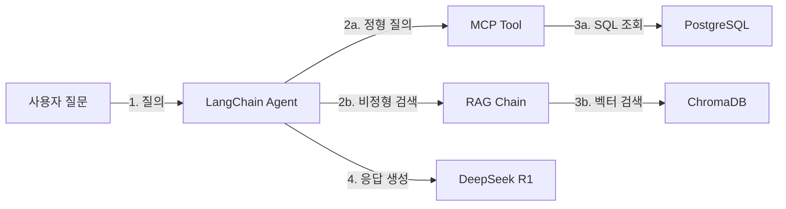

*그림 1-3: 최종 완성 시스템 아키텍처*

각 구성요소의 역할을 정리하면 다음과 같습니다.

| 구성요소 | 역할 |
|--------|------|
| **LangChain Agent** | 질문을 분석하여 정형/비정형/복합 질의 중 어느 경로로 처리할지 결정합니다. |
| **MCP Tool** | 모델 컨텍스트 프로토콜(Model Context Protocol)로 FastAPI를 통해 PostgreSQL을 조회합니다. |
| **RAG Chain** | ChromaDB에서 관련 문서 청크를 검색하여 LLM에 컨텍스트로 전달합니다. |
| **PostgreSQL** | 직원, 연차, 매출 등 정형 데이터를 저장합니다. Docker Compose로 제공됩니다. |
| **ChromaDB** | 사내 문서를 벡터로 변환하여 저장하고, 의미 기반 유사도 검색을 수행합니다. |
| **DeepSeek R1** | Ollama로 로컬 실행되는 LLM입니다. 검색 결과를 바탕으로 최종 답변을 생성합니다. |

> **참고: 모든 서비스가 로컬에서 실행됩니다**
> 이 시스템은 클라우드 API를 전혀 사용하지 않습니다. Ollama(LLM 추론), ChromaDB(벡터 DB), PostgreSQL(관계형 DB) 모두 독자의 컴퓨터에서 실행됩니다. 추가 비용이 발생하지 않습니다.

이 아키텍처는 4단계로 나뉘어 구축됩니다.

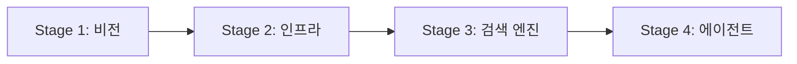

*그림 1-4: 4 Stage 학습 로드맵*

| 단계 | 챕터 | 핵심 활동 |
|------|------|---------|
| Stage 1: 비전 및 기초 | CH01 - CH02 | 목표 확인 + DeepSeek-R1으로 기초 RAG 실습 |
| Stage 2: 인프라 및 표준화 | CH03 - CH05 | 환경 구축 + 베이스 시스템 확보 + 문서 표준화 |
| Stage 3: 지식 검색 엔진 | CH06 - CH07 | 벡터 DB 구축 + RAG Q&A 파이프라인 |
| Stage 4: 지능형 에이전트 | CH08 - CH10 | MCP+RAG 통합 + 프로덕션 연결 + 시스템 튜닝 |

---

## 1.4 사용 기술 스택 상세

이 책이 사용하는 기술 스택과 각 기술을 선택한 이유를 정리합니다.

| 역할 | 기술 | 버전 | 선택 이유 |
|------|------|------|---------|
| LLM 추론 엔진 | **Ollama** | 최신 안정 | 로컬에서 LLM을 실행하는 가장 간편한 방법입니다. `ollama run` 한 줄로 모델을 실행합니다. |
| 기본 LLM 모델 | **DeepSeek R1** | 최신 | 추론(Reasoning) 토큰을 지원하여 복잡한 정책 질문에 근거 기반 답변을 생성합니다. |
| 파이프라인 프레임워크 | **LangChain** | 0.3+ | Retriever, Prompt, LLM, Output Parser를 표준 인터페이스로 연결하는 산업 표준 프레임워크입니다. |
| 벡터 DB | **ChromaDB** | 최신 안정 | `pip install chromadb` 한 줄로 설치하며, 로컬 파일로 영속 저장됩니다. LangChain과 직접 통합됩니다. |
| 관계형 DB | **PostgreSQL** | 16 | Docker Compose로 제공됩니다. 직원, 연차, 매출 정형 데이터를 저장합니다. |
| API 서버 | **FastAPI** | 0.110+ | LLM이 PostgreSQL에 직접 SQL을 실행하지 않도록 API 레이어를 제공합니다. |
| 언어 | **Python** | 3.11 | 가상환경(venv)으로 프로젝트별 패키지를 격리합니다. |
| PDF 처리 | **PyMuPDF, pdfplumber** | 최신 | 텍스트와 테이블을 각각의 강점에 맞게 추출합니다. |
| 인프라 | **Docker Compose** | 최신 | PostgreSQL + FastAPI 서버를 한 줄 명령으로 실행합니다. |

> **참고: 왜 OpenAI가 아닌 Ollama인가**
> 이 책은 클라우드 LLM API를 사용하지 않습니다. OpenAI API는 호출당 비용이 발생하며, 사내 데이터를 외부 서버로 전송합니다. Ollama는 모든 추론이 독자의 컴퓨터에서 이루어지므로 비용이 없고 데이터가 외부로 나가지 않습니다.

### 실습 전 체크리스트

이 책의 실습을 시작하기 전에 아래 항목을 미리 준비하십시오.

- [ ] Python 3.11 설치 완료
- [ ] Git 설치 완료
- [ ] Docker Desktop 설치 완료 (PostgreSQL용, CH03부터 필요)
- [ ] 8GB 이상 RAM (Ollama 모델 로딩용, 16GB 권장)
- [ ] 10GB 이상 디스크 여유 공간 (LLM 모델 + DB)
- [ ] 터미널/CLI 기본 사용 가능

> **주의: RAM 요구사항**
> DeepSeek R1 전체 모델은 8GB 이상의 VRAM 또는 RAM이 필요합니다. RAM이 부족한 환경에서는 소형 모델(`deepseek-r1:1.5b`)을 사용하십시오. CH03에서 모델 선택 방법을 상세히 안내합니다.

---

## 1.5 이 책을 마치면 할 수 있는 것

이 책의 10개 챕터를 완독하면 아래 역량을 갖추게 됩니다.

**구축 역량**

1. 사내 문서(PDF, Word, Markdown)를 수집·전처리하여 벡터 DB에 자동 색인합니다.
2. 자연어 질문으로 사내 규정을 30초 이내에 검색하는 RAG Q&A 엔진을 구현합니다.
3. 정형 DB와 비정형 문서를 동시에 질의하는 통합 AI 에이전트를 운영합니다.
4. 출처 표시가 포함된 신뢰 가능한 AI 답변 시스템을 제공합니다.

**튜닝 역량**

5. 증상별 튜닝 가이드로 검색 정확도를 체계적으로 개선합니다.
6. ReRanker와 Hybrid Search를 적용하여 검색 품질을 향상시킵니다.
7. 30개 테스트셋으로 RAG 시스템을 평가하고 정량적으로 관리합니다.

### 챕터별 학습 로드맵

아래 표는 각 챕터에서 구현하는 핵심 기능의 전체 지도입니다. 이 표를 참고하여 현재 어느 단계에 있는지 파악하십시오.

| 챕터 | 제목 | 구현 기능 |
|------|------|---------|
| CH01 | 이 책의 목표와 최종 완성본 미리보기 | 전체 아키텍처 이해 + 최종 데모 체험 |
| CH02 | DeepSeek-R1으로 시작하는 기초 RAG 정복 | LLM 환각 체험 + 기초 RAG 구현 |
| CH03 | 개발 환경 구축 | Ollama + PostgreSQL + Python 가상환경 설정 |
| CH04 | 베이스 시스템 확보 | 사내 DB 스키마 분석 + CRUD API + MCP 개념 |
| CH05 | 사내 문서 표준화 | PDF/Word/Markdown 전처리 파이프라인 |
| CH06 | 벡터 DB 구축 | 텍스트 추출 + 청킹 + 임베딩 + ChromaDB 저장 |
| CH07 | RAG Q&A 엔진 구현 | LangChain RAG 파이프라인 + 출처 표시 |
| CH08 | 통합 에이전트 설계 (MCP + RAG) | 정형 DB + 비정형 문서 동시 질의 |
| CH09 | LangChain 최종 연결 | Router/Agent/RAG Chain/MCP Tool 프로덕션 연결 |
| CH10 | RAG 시스템 튜닝 | ReRanker + Hybrid Search + 평가 체계 |

<!-- [GEMINI PROMPT: 01_before-after]
Simple before/after comparison infographic: LEFT side shows "사내 매뉴얼 3,000페이지 수동 검색"
with red indicator and large number "10분", RIGHT side shows "AI 업무 비서 자동 검색" with green
indicator and "30초", arrow in the middle labeled "이 책의 목표", clean flat design, white background,
minimalist black and white technical diagram style, 16:9 aspect ratio.
Style: before-after-infographic
-->
*그림 1-5: 이 책의 목표 — 고객 문의 응답 시간 10분에서 30초로 단축*

이서연이 처음 회의실에서 들었던 그 목표, "응답 시간 10분을 30초로 줄여라"는 CH10을 마치는 순간에 실현됩니다.

---

## 정리하며

- **RAG는 Fine-tuning이 아닙니다**: Fine-tuning은 모델 재학습이 필요하지만, RAG는 기존 문서를 그대로 외부 저장소로 활용합니다. 문서가 업데이트되어도 모델을 건드리지 않습니다.
- **정형 + 비정형 통합이 실무의 핵심입니다**: 고객 문의는 DB 수치와 문서 규정을 동시에 필요로 합니다. 이 책의 통합 에이전트는 두 가지 경로를 하나의 질문으로 처리합니다.
- **모든 서비스가 로컬에서 무료로 실행됩니다**: Ollama, ChromaDB, PostgreSQL 모두 독자의 컴퓨터에서 동작합니다. 클라우드 API 비용이 발생하지 않습니다.
- **4단계 로드맵으로 점진적으로 구축합니다**: Stage 1 비전 확인 → Stage 2 인프라 구축 → Stage 3 검색 엔진 완성 → Stage 4 통합 에이전트 완성 순서로 진행합니다.

**다음 챕터에서는**: CH02에서 DeepSeek-R1을 직접 실행합니다. "LLM에게 그냥 물어보면 되지 않나요?"라는 질문에서 시작하여, 환각(Hallucination)을 직접 체험하고, 그것이 왜 RAG로 이어지는지를 손으로 확인합니다.


---

# 2. DeepSeek-R1으로 시작하는 기초 RAG 정복

이 장에서는 LLM에 직접 질의했을 때 발생하는 **환각(Hallucination)** 을 직접 체험하고, 그 한계를 넘기 위해 기초 RAG 파이프라인을 단계적으로 구현합니다. 실패 → 반쪽 성공 → 완전한 성공의 3단계를 이서연의 시행착오와 함께 따라가면서, RAG가 왜 필요한지 몸으로 납득하게 됩니다.

**이 장에서 학습하는 내용:**

- LLM 단독 질의가 사내 규정에 실패하는 이유
- 컨텍스트 직접 주입(Context Injection)의 작동 원리와 한계
- ChromaDB를 활용한 기초 RAG 파이프라인 구현
- DeepSeek R1의 추론 토큰이 제공하는 근거 기반 답변

---

<!-- GEMINI_IMAGE
Prompt: Warm office illustration of a young woman developer (28 years old, casual office attire) sitting at a desk with a laptop, looking at the screen with a curious and slightly puzzled expression, a speech bubble above showing a question mark and a document icon, soft color palette (warm beige, light blue), friendly cartoon style, showing the problem/challenge of searching through documents clearly, no text overlay, clean background with subtle workplace elements
Style: office-illustration-warm
Alt: 이서연이 사내 규정 문서 앞에서 고민하는 모습
-->
*그림 2-1: "LLM한테 그냥 물어보면 되지 않을까요?" 이서연의 첫 번째 아이디어*

---

CH01에서 이서연은 팀 전체 회의에서 낯선 기술 용어들 앞에 얼어붙었습니다. RAG, ChromaDB, MCP — 하나도 들어본 적 없는 이름들이었습니다. 하지만 김도현 팀장의 최종 데모를 보고 나서, 이서연에게는 한 가지 생각이 떠올랐습니다.

"저 데모에서 AI가 HR 규정을 정확히 답변하던데... 그냥 DeepSeek-R1한테 직접 물어보면 되는 거 아닌가요?"

팀 미팅이 끝난 후 이서연은 박민준 과장에게 조심스럽게 물었습니다.

박민준 과장은 잠깐 생각하더니 고개를 저었습니다.

"그게 안 되니까 RAG가 필요한 거야. 모델이 우리 회사 규정을 알 리가 없잖아. **데이터를 직접 줘야지.**"

이 장에서는 박민준 과장의 그 한마디를 코드로 직접 확인합니다.

---

## 2.1 [실패] LLM 단독 질의의 한계

### 실습 환경 준비

본 챕터의 예제 코드를 내려받아 실행 환경을 준비하십시오. 이 챕터는 PostgreSQL이나 별도 인프라 없이 Ollama와 로컬 ChromaDB만 사용합니다.

**사전 준비 — Ollama 설치 (최초 1회)**

```bash
# macOS
brew install ollama

# Ollama 서버 시작 (별도 터미널에서 유지)
ollama serve

# DeepSeek R1 모델 다운로드 (별도 터미널에서 실행)
ollama pull deepseek-r1
```

> **팁: 메모리가 부족할 경우**
> RAM이 8GB 미만이라면 소형 모델을 사용하십시오.
> `ollama pull deepseek-r1:1.5b`
> Ollama 없이도 실습을 진행할 수 있습니다. 연결에 실패하면 자동으로 Mock 모드로 전환되어 환각 패턴을 시뮬레이션합니다.

```bash
git clone https://github.com/{repo}/CH02_기초RAG
cd CH02_기초RAG
cp .env.example .env
python3 -m venv venv
source venv/bin/activate      # Windows: venv\Scripts\activate
pip install -r requirements.txt
```

### Step 1 실행 — 환각 체험

이제 LLM에 직접 질문해 보겠습니다.

```bash
python src/main.py --step 1
```

터미널에 다음과 같은 출력이 나타납니다.

```
============================================================
Step 1: LLM 단독 질의 — 환각(Hallucination) 체험
============================================================
모델: deepseek-r1
서버: http://localhost:11434

[Ollama 서버 연결 시도 중...]
[Mock 모드] Ollama 서버에 연결할 수 없습니다.
  현재는 환각 패턴을 시뮬레이션하는 Mock 응답을 사용합니다.

[질문 1] 커넥트HR의 연차 규정에서 신입사원 1년차 연차 일수는 몇 일입니까?
----------------------------------------
[LLM 응답]
커넥트HR의 신입사원 연차는 근로기준법에 따라 15일입니다. 단, 1년차에는
월 1일씩 부여되는 월차를 포함하여 최대 11일까지 사용할 수 있습니다.

경고: 이 답변은 정확하지 않을 수 있습니다.
      LLM은 사내 규정을 학습한 적이 없으므로,
      유사한 패턴으로 추측한 내용을 사실처럼 답변합니다.
      이것이 바로 '환각(Hallucination)'입니다.
```

> **주의: 출력 결과가 다를 수 있습니다**
> Ollama에 실제로 연결된 경우 DeepSeek R1이 생성하는 답변은 매 실행마다 달라집니다. 중요한 것은 답변의 정확성이 아니라, 실제 사내 규정과 비교했을 때 틀렸는지 여부입니다.

<!-- [CAPTURE NEEDED: 02_step1-hallucination — `python src/main.py --step 1` 실행 후 터미널 전체 화면 (Mock 모드 또는 실제 Ollama 환각 응답 표시 상태)] -->
*그림 2-2: Step 1 실행 결과 — LLM이 사내 규정을 추측하여 잘못된 답변을 생성한다*

### 환각의 핵심 코드 — `query_llm_directly`

이 동작의 핵심은 `src/llm_direct.py`의 `query_llm_directly` 함수입니다.

```python
def query_llm_directly(question: str, client: Optional[object]) -> str:
    """LLM에 컨텍스트 없이 직접 질의합니다."""

    # --- Input ---
    prompt = f"""다음 질문에 답하십시오.

질문: {question}

답변:"""

    # --- Process ---
    if client is None:
        question_index = (
            HALLUCINATION_QUESTIONS.index(question)
            if question in HALLUCINATION_QUESTIONS
            else 0
        )
        response = MOCK_HALLUCINATION_RESPONSES[
            question_index % len(MOCK_HALLUCINATION_RESPONSES)
        ]
    else:
        response = client.invoke(prompt)

    # --- Output ---
    return response
```

> 전체 코드는 GitHub 저장소 `src/llm_direct.py`를 참고하십시오.

#### 코드 워크플로우 (Code Workflow)

1. **입력(Input)**: 사용자 질문 문자열과 Ollama 클라이언트 객체를 받습니다. 클라이언트가 `None`이면 Mock 모드로 동작합니다.
2. **처리(Process)**: 질문을 그대로 프롬프트에 담아 LLM에 전달합니다. 사내 규정 관련 컨텍스트는 전혀 포함되지 않습니다.
3. **출력(Output)**: LLM이 생성한 응답 문자열을 반환합니다. 실제 사내 데이터 없이 학습된 패턴으로 추측한 답변입니다.

### 환각(Hallucination)이 발생하는 원리

**환각(Hallucination)** 이란 LLM이 학습 데이터에 없는 내용을 사실처럼 생성하는 현상입니다. 도서관 비유를 들면, LLM은 수억 권의 책을 읽은 사서와 같습니다. 그 사서에게 "커넥트HR 내부 규정집"을 물으면, 규정집을 읽은 적이 없으므로 비슷한 회사 규정을 조합하여 그럴듯한 답을 만들어냅니다.

이것이 문제입니다. 모델은 틀렸다는 것을 모릅니다. 확신에 차서 답변합니다.


*그림 2-3: LLM 단독 질의 흐름 — 사내 규정 없이 추측한 답변이 생성된다*

정리하면, LLM 단독 질의가 실패하는 이유는 다음과 같습니다.

- LLM의 학습 데이터에 사내 규정이 포함되지 않았습니다.
- 모델은 "모른다"고 말하는 대신 유사한 패턴으로 답을 생성합니다.
- 답변이 틀렸더라도 자신 있게 서술하므로 사용자가 구별하기 어렵습니다.

---

## 2.2 [반쪽 성공] 프롬프트 직접 주입

이서연은 박민준 과장의 말을 떠올렸습니다. "데이터를 직접 줘야지." 그렇다면 직접 주면 되는 것 아닌가? 이서연은 HR 규정 문서 전문을 복사하여 프롬프트에 붙여넣어 보았습니다.

### 컨텍스트 주입(Context Injection)이란

**컨텍스트 주입(Context Injection)** 은 프롬프트 안에 참고할 문서를 직접 포함시키는 방식입니다. LLM은 프롬프트 전체를 읽고 그 안에 있는 내용을 근거로 답변합니다.


*그림 2-4: 컨텍스트 주입 흐름 — 문서를 직접 붙여넣으면 정확도가 올라가지만 한계가 있다*

### Step 2 실행

```bash
python src/main.py --step 2
```

이번에는 답변이 정확해집니다. HR 규정 문서를 프롬프트에 담았기 때문에 모델이 정확한 내용을 참고하여 답변합니다. 이서연은 잠깐 기뻐했지만, 곧 문제를 발견했습니다.

### 컨텍스트 주입의 한계

> **참고: 토큰 윈도우(Token Window)란**
> LLM은 한 번에 처리할 수 있는 텍스트 길이에 제한이 있습니다. 이 제한을 토큰 윈도우라고 합니다. 예를 들어 토큰 윈도우가 4,096 토큰이라면, 프롬프트와 문서와 질문을 합친 전체 길이가 이 제한을 넘으면 안 됩니다.

**문서가 하나일 때는 작동합니다.** 그러나 커넥트HR에는 HR 규정만 있는 것이 아닙니다. 영업 매뉴얼, IT 보안 정책, 복리후생 안내서... 3,000페이지가 있습니다.

| 문제 | 설명 |
|------|------|
| 토큰 한계 | 긴 문서 전체를 프롬프트에 넣으면 토큰 윈도우를 초과합니다 |
| 확장성 부재 | 문서가 10개, 100개로 늘어날수록 프롬프트 크기가 선형으로 증가합니다 |
| 응답 지연 | 토큰이 많을수록 LLM 처리 시간과 비용이 급증합니다 |
| 관련 없는 정보 | 모든 문서를 넣으면 LLM이 관련 없는 내용에 혼란을 겪습니다 |

박민준 과장이 이서연의 화면을 보더니 말했습니다.

"그렇게 하면 문서 하나는 되는데, 나중에 문서가 50개, 100개 되면 어쩔 거야? 프롬프트가 책 한 권 분량이 될 텐데."

이서연은 고개를 끄덕였습니다. **필요한 문서만 찾아서** 넣어야 합니다. 그것이 바로 검색입니다.

---

## 2.3 [성공] VectorDB와 RAG의 시작

이서연이 선택한 해결책은 **ChromaDB** 였습니다. 문서를 미리 저장해 두고, 질문이 들어오면 관련 문서만 검색하여 LLM에 전달하는 방식입니다. 이것이 RAG의 핵심입니다.

### RAG 파이프라인 3단계


*그림 2-5: RAG 파이프라인 3단계 — 검색 → 컨텍스트 구성 → 생성*

RAG는 세 단계로 동작합니다.

1. **검색(Retrieve)**: 질문을 벡터로 변환하고 ChromaDB에서 의미적으로 유사한 문서를 찾습니다.
2. **컨텍스트 구성(Augment)**: 검색된 문서 조각(청크)을 프롬프트에 포함시킵니다.
3. **생성(Generate)**: LLM이 검색된 컨텍스트를 근거로 답변을 생성합니다.

컨텍스트 주입과의 차이는 명확합니다. 컨텍스트 주입은 모든 문서를 전달하지만, RAG는 **관련 문서만** 전달합니다.

### Step 3 실행 — 기초 RAG 성공

```bash
python src/main.py --step 3
```

```
============================================================
Step 3: 기초 RAG — ChromaDB + LLM 파이프라인
============================================================

[1단계] ChromaDB 인메모리 컬렉션에 HR 문서 저장 중...
        완료: 3개 문서 저장됨

[2단계] 사용자 질문: 커넥트HR의 연차 규정에서 신입사원 1년차 연차 일수는 몇 일입니까?

[3단계] ChromaDB에서 관련 문서 검색 중...
        2개 관련 문서 검색 완료

  [검색 결과 1]
  출처: HR-인사규정-2024.pdf (페이지 3)
  내용 미리보기: 커넥트HR 연차유급휴가 규정 (제1조)...

[4단계] 검색된 문서로 RAG 프롬프트 구성...
        프롬프트 길이: 842자 (전체 문서 대비 최소화)

[6단계] LLM 답변 생성 중...

============================================================
[최종 답변]
============================================================
검색된 커넥트HR 인사 규정(HR-인사규정-2024.pdf, 3페이지)에 따르면,
신입사원(근속 1년 미만)은 입사 후 매월 1일씩 월차를 부여받아
최대 11일을 사용할 수 있습니다.

[출처 문서]
  1. HR-인사규정-2024.pdf — 페이지 3

============================================================
[결론] RAG 파이프라인이 성공적으로 작동했습니다!
```

<!-- [CAPTURE NEEDED: 02_step3-rag-success — `python src/main.py --step 3` 실행 후 터미널 전체 화면 (RAG 답변과 출처 문서가 함께 표시된 상태)] -->
*그림 2-6: Step 3 실행 결과 — RAG가 정확한 답변과 출처를 함께 반환한다*

이서연은 화면을 보며 말했습니다. "이게 RAG구나."

### RAG 핵심 코드 발췌 — `search_similar_documents`

Step 3의 핵심은 `src/simple_rag.py`의 유사도 검색 함수입니다.

```python
def search_similar_documents(
    collection: chromadb.Collection,
    query: str,
    top_k: int = TOP_K,
) -> list[dict[str, str]]:
    """질문과 유사한 문서를 ChromaDB에서 검색합니다."""

    # --- Input ---
    results = collection.query(
        query_texts=[query],
        n_results=min(top_k, collection.count()),
    )

    # --- Process ---
    retrieved_docs: list[dict[str, str]] = []
    if results["documents"] and results["documents"][0]:
        for i, doc_content in enumerate(results["documents"][0]):
            metadata = results["metadatas"][0][i] if results["metadatas"] else {}
            retrieved_docs.append(
                {
                    "content": doc_content,
                    "source": metadata.get("source", "알 수 없음"),
                    "page": metadata.get("page", "0"),
                }
            )

    # --- Output ---
    return retrieved_docs
```

> 전체 코드는 GitHub 저장소 `src/simple_rag.py`를 참고하십시오.

#### 코드 워크플로우 (Code Workflow)

1. **입력(Input)**: ChromaDB 컬렉션 객체, 사용자 질문 문자열, 반환할 최대 문서 수(`top_k`)를 받습니다.
2. **처리(Process)**: `collection.query`가 질문을 벡터로 변환하고 저장된 문서들과 유사도를 비교하여 상위 `top_k`개를 선택합니다. 각 문서의 내용과 메타데이터(출처, 페이지)를 딕셔너리로 조합합니다.
3. **출력(Output)**: 검색된 문서 목록을 반환합니다. 각 항목에 `content`, `source`, `page` 키가 포함됩니다.

### RAG 프롬프트 구성 — `build_rag_prompt`

검색된 문서를 LLM에 전달하는 방식도 중요합니다. `build_rag_prompt` 함수가 이를 담당합니다.

```python
def build_rag_prompt(question: str, retrieved_docs: list[dict[str, str]]) -> str:
    """검색된 문서를 바탕으로 RAG 프롬프트를 구성합니다."""

    # --- Input ---
    context_parts: list[str] = []
    for i, doc in enumerate(retrieved_docs, start=1):
        context_parts.append(
            f"[문서 {i}] 출처: {doc['source']} (페이지 {doc['page']})\n{doc['content']}"
        )
    context = "\n\n".join(context_parts)

    # --- Process ---
    prompt = f"""다음 검색된 사내 문서만을 근거로 질문에 답하십시오.
문서에 없는 내용은 "해당 정보가 문서에 없습니다"라고 답하십시오.

[검색된 문서]
{context}

[질문]
{question}

[답변]"""

    # --- Output ---
    return prompt
```

#### 코드 워크플로우 (Code Workflow)

1. **입력(Input)**: 사용자 질문과 `search_similar_documents`가 반환한 문서 목록을 받습니다.
2. **처리(Process)**: 각 문서의 출처, 페이지, 내용을 포맷팅하여 컨텍스트 블록을 만듭니다. "문서에 없는 내용은 모른다고 답하라"는 지시를 포함시켜 환각을 억제합니다.
3. **출력(Output)**: LLM에 전달할 완성된 프롬프트 문자열을 반환합니다.

> **팁: "모르면 모른다고 답하라"는 지시의 중요성**
> 프롬프트에 "해당 정보가 문서에 없습니다"라고 답하라는 지시를 명시적으로 포함하면, LLM이 문서에 없는 내용을 추측하려는 경향을 크게 줄일 수 있습니다. 이것이 RAG 시스템에서 환각을 억제하는 가장 기본적인 프롬프트 기법입니다.

### 임베딩(Embedding)이란

> **참고: 벡터 유사도 검색의 원리**
> **임베딩(Embedding)** 이란 텍스트를 숫자 배열(벡터)로 변환하는 과정입니다. "연차 규정"과 "휴가 일수"는 단어가 다르지만, 임베딩 후에는 벡터 공간에서 가까운 위치에 놓입니다. ChromaDB는 이 거리를 계산하여 의미적으로 유사한 문서를 찾습니다. 도서관에서 "비슷한 주제의 책"을 찾는 원리와 같습니다.

이 챕터에서는 ChromaDB의 기본 임베딩 함수(`DefaultEmbeddingFunction`)를 사용합니다. 별도의 모델 설치 없이도 동작하도록 설계되어 있습니다. 더 정확한 한국어 임베딩은 CH06에서 `nomic-embed-text` 모델로 업그레이드합니다.

---

## 2.4 [심화] DeepSeek-R1 추론(Reasoning) 활용

RAG로 정확한 답변을 얻었지만, 더 복잡한 질문이 들어온다면 어떻게 될까요? "신입사원이 입사 6개월 만에 특별 프로젝트로 야근을 많이 했는데, 연차를 추가로 받을 수 있나요?"처럼 여러 규정을 종합 판단해야 하는 질문입니다.

DeepSeek R1에는 이런 복잡한 질문을 위한 특별한 기능이 있습니다.

### 추론 토큰(Reasoning Token)

**추론 토큰(Reasoning Token)** 은 DeepSeek R1이 최종 답변을 내놓기 전에 스스로 사고 과정을 정리하는 특수 토큰입니다. 모델이 `<think>` 태그 안에 중간 추론 과정을 기록하고, 그 결과를 바탕으로 최종 답변을 생성합니다.


*그림 2-7: DeepSeek R1 추론 흐름 — 사고 과정을 거쳐 근거 있는 답변을 생성한다*

### Step 4 실행 — 추론 모드

```bash
python src/main.py --step 4
```

실제 DeepSeek R1에 연결된 경우, 응답에 `<think>...</think>` 블록이 포함되어 모델이 어떤 과정으로 결론에 도달했는지 확인할 수 있습니다.

| 비교 항목 | 단순 LLM 답변 | DeepSeek R1 추론 답변 |
|----------|-------------|---------------------|
| 복잡한 규정 해석 | 단순 암기 패턴 반복 | 규정 간 관계 분석 후 종합 판단 |
| 근거 제시 | 없음 | 추론 과정 명시 |
| 애매한 질문 처리 | 추측으로 답변 | 불확실성을 명시하고 가능한 해석 제시 |

> **참고: 추론 토큰 활용 시점**
> 모든 질문에 추론 모드를 사용할 필요는 없습니다. 단순 사실 조회("연차 일수는?")는 일반 모드가 빠릅니다. 여러 규정을 종합해야 하거나 예외 상황을 판단해야 할 때 추론 모드가 효과적입니다. CH10 튜닝 챕터에서 상황별 모드 선택 전략을 다룹니다.

---

## 2.5 3단계 비교 정리

이 장에서 이서연이 직접 체험한 3단계를 한눈에 비교합니다.

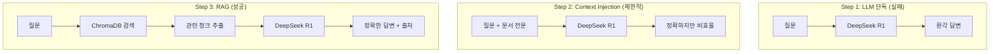

*그림 2-8: 3단계 접근법 비교 — LLM 단독 → Context Injection → RAG*

| 접근 방식 | 정확도 | 확장성 | 출처 표시 |
|----------|--------|--------|---------|
| LLM 단독 질의 | 낮음 (환각) | 해당 없음 | 없음 |
| Context Injection | 높음 | 낮음 (토큰 한계) | 없음 |
| 기초 RAG | 높음 | 높음 | 있음 |

<!-- GEMINI_IMAGE
Prompt: Simple before/after comparison infographic: LEFT side shows "LLM 단독 질의" with red X indicator, showing a direct arrow from question to LLM with hallucination output labeled "환각 답변", RIGHT side shows "RAG 파이프라인" with green checkmark indicator, showing question going through document search (ChromaDB) before reaching LLM, then accurate answer with source citation, clean flat design, white background, Korean labels
Style: before-after-infographic
Alt: LLM 단독 질의(환각)에서 RAG 파이프라인(정확한 답변)으로 개선된 결과
-->
*그림 2-9: LLM 단독 질의와 RAG 파이프라인의 결과 비교*

---

## 2.6 정리하며

이 장에서 이서연은 "LLM한테 그냥 물어보면 되지 않나요?"라는 질문에서 시작하여 기초 RAG 파이프라인을 직접 구현하는 성과를 거뒀습니다.

- **LLM 단독 질의는 사내 규정을 알지 못합니다**: 모델은 학습 데이터에 없는 사내 규정을 유사 패턴으로 추측하여 환각 응답을 생성합니다. 답변이 확신에 차 있어도 틀릴 수 있습니다.

- **Context Injection은 문서가 적을 때만 유효합니다**: 문서 전문을 프롬프트에 직접 삽입하면 정확도는 올라가지만, 토큰 윈도우 한계와 확장성 문제로 실무에서는 사용할 수 없습니다.

- **RAG는 검색 → 컨텍스트 구성 → 생성의 3단계로 동작합니다**: ChromaDB가 관련 문서만 검색하여 LLM에 전달합니다. 토큰 절약, 정확도 향상, 출처 표시를 동시에 확보합니다.

- **DeepSeek R1의 추론 토큰은 복잡한 분석에 유리합니다**: `<think>` 블록을 통해 사고 과정을 명시하고, 근거 있는 답변을 생성합니다.

---

**다음 장에서는** Ollama, PostgreSQL, Python 가상환경을 체계적으로 설치하고 팀 전체가 동일한 환경에서 개발할 수 있도록 개발 환경을 구축합니다. 이 장에서 Mock 모드로 실행했던 실습을 실제 DeepSeek R1과 함께 진행하게 됩니다.


---

# 3장. 개발 환경 구축

이 장에서는 AI 업무 비서를 구동하기 위한 세 가지 핵심 인프라인 **Ollama**, **PostgreSQL**, **Python 가상환경** 을 설치하고, `.env` 기반 환경 변수 설정까지 완료합니다. 장을 마치면 `setup_check.py` 스크립트가 5개 항목을 모두 PASS로 출력합니다.

<!-- GEMINI_IMAGE
Prompt: Warm office illustration of a young developer (28, female) sitting at her desk surrounded by three separate terminal windows — one showing a dependency conflict error, one showing a network download failure, and one showing a port conflict warning. She looks frustrated but determined. Soft color palette (warm beige, light blue), friendly cartoon style, clean background with subtle workplace elements.
Style: office-illustration-warm
Alt: 이서연이 연속된 설치 실패로 당혹스러워하는 모습
-->

*그림 3-1: 설치 오류 세 개가 동시에 터지다 — 이서연의 첫날*

---

이서연은 2장을 마친 뒤 기분이 좋았습니다. ChromaDB에 문서를 저장하고 첫 번째 RAG 검색까지 확인했기 때문입니다. 다음 날 아침, 이서연은 팀원들 모두가 동일한 환경에서 개발을 이어갈 수 있도록 본격적인 환경 구축에 착수했습니다.

첫 번째 시도: PostgreSQL 16을 노트북에 직접 설치했습니다. 그런데 이미 설치된 PostgreSQL 14와 포트가 충돌했습니다. 두 번째 시도: `ollama pull deepseek-r1` 명령을 실행했지만, 4.7GB 모델을 절반쯤 내려받다가 네트워크 타임아웃으로 실패했습니다. 세 번째 시도: `pip install langchain` 명령을 실행했지만, 기존 프로젝트의 패키지와 버전이 충돌했습니다.

오전 내내 세 가지 실패를 반복하던 이서연을 보던 김도현 팀장이 말했습니다.

> "이서연 씨, 이런 삽질을 팀원 모두가 반복하면 안 되죠. 공통 설치 스크립트를 만들고, Docker로 DB를 격리합시다. 한 번 제대로 만들면 팀 전체가 혜택을 받습니다."

그 한 마디가 이 장 전체의 방향을 결정했습니다. 개인의 설치 성공이 아니라, **팀 전체가 동일한 환경에서 즉시 시작할 수 있는 표준 환경** 을 구축하는 것입니다.

---

## 3.1 Ollama 설치 및 DeepSeek R1 모델 다운로드

**Ollama** 는 로컬에서 대규모 언어 모델을 실행하는 오픈소스 추론 엔진입니다. 도서관에 비유하자면, LLM이라는 책을 실제로 읽어주는 사서 역할을 합니다. 이 책의 모든 실습은 외부 클라우드 API 없이 Ollama를 통해 DeepSeek R1 모델을 로컬에서 실행합니다.

### 3.1.1 개발 환경 구축 전체 흐름

본격적인 설치에 앞서 전체 흐름을 파악하십시오. 4단계를 순서대로 완료하면 개발 환경이 완성됩니다.

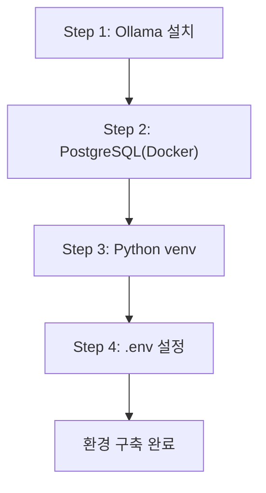

*그림 3-2: 개발 환경 구축 4단계 흐름*

### 3.1.2 OS별 Ollama 설치

**macOS / Linux**

```bash
# Ollama 공식 설치 스크립트 실행
curl -fsSL https://ollama.com/install.sh | sh

# 설치 완료 확인
ollama --version
```

#### 코드 워크플로우 (Code Workflow)

1. **입력(Input)**: Ollama 공식 설치 스크립트 URL
2. **처리(Process)**: `curl`로 스크립트를 내려받아 `sh`로 즉시 실행 — 시스템에 `ollama` 바이너리를 설치하고 서비스를 등록합니다
3. **출력(Output)**: `ollama 0.x.x` 형식의 버전 문자열 출력

**Windows**

Ollama 공식 사이트(https://ollama.com/download)에서 Windows 설치 파일(`.exe`)을 내려받아 실행합니다. 설치 완료 후 PowerShell을 새로 열고 아래 명령으로 설치를 확인하십시오.

```powershell
ollama --version
```

> **주의: Windows 네이티브 환경 제한**
> Windows 네이티브 환경에서는 일부 쉘 스크립트가 동작하지 않습니다. 가능하면 WSL2(Windows Subsystem for Linux)를 설치하고 Ubuntu 환경에서 실습하십시오. Docker Desktop도 WSL2 백엔드를 사용하면 성능과 호환성이 크게 향상됩니다.

### 3.1.3 DeepSeek R1 모델 다운로드

Ollama 설치 후 DeepSeek R1 모델을 로컬에 내려받습니다.

```bash
# 기본 모델 다운로드 (약 4.7GB, 8GB RAM 이상 권장)
ollama pull deepseek-r1

# 소형 모델 다운로드 (약 1GB, 4GB RAM에서도 동작)
# RAM이 부족한 경우 이 명령을 사용하십시오.
ollama pull deepseek-r1:1.5b

# 다운로드된 모델 목록 확인
ollama list
```

#### 코드 워크플로우 (Code Workflow)

1. **입력(Input)**: 모델 이름 (`deepseek-r1` 또는 `deepseek-r1:1.5b`)
2. **처리(Process)**: Ollama 레지스트리에서 모델 파일을 내려받아 로컬 캐시에 저장합니다
3. **출력(Output)**: `ollama list` 명령 실행 시 `deepseek-r1` 항목이 표시됩니다

> **팁: Ollama 모델 선택 기준 (RAM 기준)**
> - 4GB RAM: `deepseek-r1:1.5b` (약 1GB 모델 파일)
> - 8GB RAM: `deepseek-r1` 기본 모델 (약 4.7GB)
> - 16GB RAM 이상: `deepseek-r1:7b` 또는 `deepseek-r1:14b` 고성능 모델
>
> 처음에는 기본 모델을 사용하고, 10장 튜닝 단계에서 모델 크기를 조정하십시오.

### 3.1.4 Ollama 서버 시작 및 확인

모델 다운로드 후 Ollama 서버를 시작합니다. macOS와 Windows에서는 설치 시 자동으로 서비스가 등록되지만, Linux에서는 수동으로 시작해야 할 수 있습니다.

```bash
# Ollama 서버 수동 시작 (백그라운드 실행)
ollama serve &

# 서버 동작 확인 (HTTP 200 응답이 오면 정상)
curl http://localhost:11434/api/tags
```

<!-- [CAPTURE NEEDED: 03_ollama-list — `ollama list` 실행 후 deepseek-r1 모델이 목록에 나타난 터미널 화면] -->
*그림 3-3: `ollama list` 실행 결과 — deepseek-r1 모델 다운로드 완료*

---

## 3.2 PostgreSQL 설치 및 초기 설정 (Docker Compose)

PostgreSQL을 노트북에 직접 설치하면 이서연처럼 버전 충돌, 포트 충돌, 데이터 초기화 실패 등의 문제를 반복해서 겪게 됩니다. 이 책은 **Docker Compose** 를 사용하여 PostgreSQL을 완전히 격리합니다.

**도커 컴포즈(Docker Compose)** 는 여러 컨테이너를 YAML 파일 하나로 정의하고 한 번에 실행하는 도구입니다. 아파트 인터폰 배선도처럼, 어떤 서비스가 어느 포트로 연결되는지 한눈에 파악할 수 있습니다.

### 3.2.1 왜 Docker Compose를 사용하는가

| 비교 항목 | 직접 설치 | Docker Compose |
|----------|----------|----------------|
| 버전 관리 | 시스템 전역 설치, 충돌 위험 | 컨테이너 내부 격리, 충돌 없음 |
| 팀 공유 | 팀원마다 수동 재설치 | `docker-compose up -d` 한 줄로 동일 환경 재현 |
| 데이터 초기화 | 수동 스크립트 실행 | `docker-compose down -v`로 즉시 초기화 |
| 삭제 | 시스템 패키지 제거 | 컨테이너 삭제로 깔끔하게 제거 |

### 3.2.2 레포지토리 클론 및 PostgreSQL 시작

먼저 이 챕터의 예제 레포지토리를 클론합니다.

```bash
git clone https://github.com/{repo}/CH03_개발환경구축
cd CH03_개발환경구축
```

`docker-compose.yml` 파일이 PostgreSQL 16 컨테이너를 정의합니다. 이 파일의 핵심 설정을 살펴봅니다.

```yaml
# docker-compose.yml (핵심 설정 발췌)
services:
  postgres:
    image: postgres:16
    environment:
      POSTGRES_DB: connecthr
      POSTGRES_USER: admin
      POSTGRES_PASSWORD: password
    ports:
      - "5432:5432"
    volumes:
      - ./data/postgres:/var/lib/postgresql/data
```

#### 코드 워크플로우 (Code Workflow)

1. **입력(Input)**: `docker-compose.yml` 파일 — 이미지 버전, 환경 변수, 포트, 볼륨 정보가 포함됩니다
2. **처리(Process)**: Docker가 `postgres:16` 이미지를 내려받고, `connecthr` 데이터베이스를 자동 생성하며, 5432 포트를 호스트에 연결합니다
3. **출력(Output)**: 로컬 5432 포트로 접근 가능한 PostgreSQL 16 서버, 데이터는 `./data/postgres` 폴더에 영구 보존됩니다

아래 명령으로 PostgreSQL 컨테이너를 백그라운드에서 시작합니다.

```bash
docker-compose up -d
```

정상적으로 시작되면 아래와 같은 출력이 나타납니다.

```
[+] Running 1/1
 ✔ Container ch03_개발환경구축-postgres-1  Started
```

> **주의: Docker Desktop이 설치되지 않은 경우**
> `docker-compose up -d` 명령 실행 시 `Cannot connect to the Docker daemon` 오류가 발생한다면 Docker Desktop이 설치되지 않았거나 실행 중이지 않은 것입니다. https://www.docker.com/products/docker-desktop 에서 Docker Desktop을 설치한 뒤 다시 시도하십시오.

### 3.2.3 PostgreSQL 연결 확인

컨테이너가 시작된 후 PostgreSQL 연결을 확인합니다.

```bash
# Docker 컨테이너 내부에서 psql 실행
docker exec -it ch03_개발환경구축-postgres-1 psql -U admin -d connecthr

# psql 프롬프트에서 데이터베이스 목록 확인
\l

# psql 종료
\q
```

`connecthr` 데이터베이스가 목록에 표시되면 PostgreSQL 설정이 완료된 것입니다.

<!-- [IMAGE PLACEHOLDER: 03_docker-why — Docker가 여러 서비스를 격리하여 동시에 실행하는 구조 개념 도식] -->
*그림 3-4: Docker Compose — 각 서비스를 독립된 컨테이너로 격리하는 원리*

---

## 3.3 Python 3.11 가상환경 및 패키지 설치

**가상환경(Virtual Environment)** 은 프로젝트별로 독립된 Python 패키지 공간을 만드는 도구입니다. 서로 다른 버전의 패키지가 필요한 프로젝트 A와 프로젝트 B를 동시에 개발할 때, 두 프로젝트의 패키지가 섞이지 않도록 각각의 공간에 격리합니다.

이서연이 겪었던 `pip` 충돌이 바로 가상환경 없이 전역(global) 환경에 모든 패키지를 설치했기 때문에 발생한 문제입니다.

### 3.3.1 Python 3.11 버전 확인

가상환경 생성 전에 Python 3.11이 설치되어 있는지 확인합니다.

```bash
python3 --version
# 또는
python --version
```

`Python 3.11.x` 형식의 출력이 나타나야 합니다.

> **주의: Python 3.11 외 버전 사용 시 호환성 문제**
> 이 책의 실습 코드는 Python 3.11을 기준으로 작성되었습니다. Python 3.10 이하에서는 타입 힌트 문법 오류가 발생할 수 있고, Python 3.12 이상에서는 일부 패키지의 의존성이 맞지 않을 수 있습니다. https://www.python.org/downloads/ 에서 Python 3.11 최신 버전을 설치하십시오.

### 3.3.2 가상환경 생성 및 활성화

**macOS / Linux**

```bash
# 가상환경 생성 (venv 폴더에 생성됨)
python3 -m venv venv

# 가상환경 활성화
source venv/bin/activate

# 활성화 확인 (프롬프트 앞에 (venv) 가 붙으면 성공)
which python
```

**Windows**

```powershell
# 가상환경 생성
python -m venv venv

# 가상환경 활성화
venv\Scripts\activate

# 활성화 확인
where python
```

#### 코드 워크플로우 (Code Workflow)

1. **입력(Input)**: `python3 -m venv venv` 명령과 현재 디렉토리 경로
2. **처리(Process)**: 현재 디렉토리 아래 `venv/` 폴더를 생성하고, Python 인터프리터와 pip를 격리된 공간에 복사합니다
3. **출력(Output)**: 활성화 후 터미널 프롬프트 앞에 `(venv)` 접두사가 표시되며, 이후 `pip install` 명령은 이 격리된 공간에만 영향을 미칩니다

### 3.3.3 패키지 설치

가상환경이 활성화된 상태에서 `requirements.txt`에 정의된 패키지를 설치합니다.

```bash
pip install -r requirements.txt
```

#### 코드 워크플로우 (Code Workflow)

1. **입력(Input)**: `requirements.txt` 파일 — 각 패키지 이름과 버전이 고정되어 있습니다
2. **처리(Process)**: pip가 목록의 패키지를 순서대로 내려받아 `venv/` 내부에 설치합니다. 버전이 고정되어 있으므로 팀원 모두가 동일한 버전을 사용합니다
3. **출력(Output)**: `Successfully installed ...` 메시지와 함께 설치 완료

`requirements.txt`의 주요 패키지와 각 역할은 다음과 같습니다.

| 패키지 | 버전 | 역할 |
|--------|------|------|
| `langchain` | 0.3+ | RAG 파이프라인 프레임워크 (CH07) |
| `langchain-community` | 0.3+ | ChromaDB 등 커뮤니티 통합 모듈 |
| `langchain-ollama` | 최신 | Ollama LLM 연동 모듈 |
| `chromadb` | 최신 안정 | 벡터 데이터베이스 (CH06) |
| `psycopg2-binary` | 최신 | PostgreSQL Python 드라이버 |
| `python-dotenv` | 최신 | `.env` 파일 로딩 |
| `requests` | 최신 | HTTP 요청 (Ollama API 연결) |
| `fastapi` | 0.110+ | CRUD API 서버 (CH04) |

> **팁: 패키지 설치 오류가 발생하는 경우**
> 설치 중 오류가 발생하면 먼저 가상환경이 활성화되어 있는지 확인하십시오. 터미널 프롬프트 앞에 `(venv)` 가 없으면 `source venv/bin/activate`(macOS/Linux) 또는 `venv\Scripts\activate`(Windows) 명령을 다시 실행하십시오.

---

## 3.4 환경 변수(.env) 구성 및 LLM Provider 스위칭 설계

API 키, 데이터베이스 비밀번호, 모델 이름 같은 설정값을 코드에 직접 하드코딩하면 두 가지 문제가 생깁니다. 첫째, 코드를 GitHub에 올리면 비밀번호가 노출됩니다. 둘째, 모델을 바꾸려면 소스 코드를 수정하고 다시 배포해야 합니다.

`.env` 파일 분리는 이 두 문제를 동시에 해결합니다. 설정값은 `.env` 파일에 저장하고, 코드는 환경 변수 이름만 참조합니다.

### 3.4.1 .env 파일 설정

`.env.example` 파일을 복사하여 `.env` 파일을 생성합니다.

```bash
cp .env.example .env
```

`.env` 파일을 열어 필요한 값을 확인합니다.

```bash
# .env.example 주요 내용
OLLAMA_BASE_URL=http://localhost:11434
OLLAMA_MODEL=deepseek-r1
OLLAMA_VISION_MODEL=llava

POSTGRES_HOST=localhost
POSTGRES_PORT=5432
POSTGRES_DB=connecthr
POSTGRES_USER=admin
POSTGRES_PASSWORD=password

CHROMA_PERSIST_DIR=./outputs/chroma_db
FASTAPI_BASE_URL=http://localhost:8000
```

3장에서는 기본값 그대로 사용합니다. 추후 챕터에서 특정 변수만 수정하는 방식으로 진행합니다.

> **참고: .gitignore에 .env 추가**
> `.env` 파일은 반드시 `.gitignore`에 등록해야 합니다. 이 책의 예제 레포지토리는 이미 `.gitignore`에 `.env`가 등록되어 있습니다. 개인 프로젝트에서는 `echo ".env" >> .gitignore` 명령으로 직접 추가하십시오.

### 3.4.2 AppConfig 구조 — env_config.py 분석

`src/env_config.py`는 `.env` 파일을 로딩하고 검증하는 모듈입니다. 핵심 구조를 살펴봅니다.

```python
# src/env_config.py 핵심 발췌

@dataclass
class AppConfig:
    """애플리케이션 전체 설정을 담는 데이터 클래스입니다."""
    ollama_base_url: str = "http://localhost:11434"
    ollama_model: str = "deepseek-r1"
    postgres_host: str = "localhost"
    postgres_port: int = 5432
    postgres_db: str = "connecthr"
    postgres_user: str = "admin"
    postgres_password: str = "password"
    chroma_persist_dir: str = "./outputs/chroma_db"
    fastapi_base_url: str = "http://localhost:8000"


def get_config(env_file: str = ".env") -> AppConfig:
    """환경 변수를 로딩하고 검증한 뒤 설정 객체를 반환합니다."""
    load_env(env_file)
    missing_vars = validate_required_vars()
    if missing_vars:
        raise EnvironmentError(
            f"다음 필수 환경 변수가 설정되지 않았습니다: {', '.join(missing_vars)}"
        )
    return build_config()
```

#### 코드 워크플로우 (Code Workflow)

1. **입력(Input)**: `.env` 파일 경로 (기본값: `".env"`)
2. **처리(Process)**: `load_env()`로 파일을 로딩하고, `validate_required_vars()`로 필수 변수의 존재를 검증한 뒤, `build_config()`로 `AppConfig` 인스턴스를 생성합니다
3. **출력(Output)**: 검증이 완료된 `AppConfig` 객체 — 이후 코드는 이 객체의 속성(`config.ollama_model`, `config.postgres_host` 등)으로 설정값에 접근합니다

이 구조의 핵심 가치는 **LLM Provider 스위칭** 입니다. `.env` 파일의 `OLLAMA_MODEL` 값을 `deepseek-r1`에서 `deepseek-r1:7b`로 바꾸면 코드 한 줄 수정 없이 더 강력한 모델로 교체됩니다. 반대로 RAM이 부족한 환경에서는 `deepseek-r1:1.5b`로 바꾸면 가벼운 모델로 즉시 전환됩니다.

전체 코드는 GitHub 레포지토리의 `src/env_config.py`를 참고하십시오.

---

## 3.5 환경 점검 — setup_check.py 실행

환경 구축의 마지막 단계는 `setup_check.py`를 실행하여 5개 항목이 모두 정상인지 확인하는 것입니다. 이 스크립트는 Ollama 서버, 모델 다운로드, PostgreSQL 연결, ChromaDB 임포트를 순서대로 점검하고 PASS/FAIL 결과를 출력합니다.

```bash
python src/setup_check.py
```

정상적으로 구축이 완료되면 아래와 같은 출력이 나타납니다.

```
=== 개발 환경 점검 시작 ===

[1/5] Python 버전 확인...
  버전: 3.11.8
  결과: PASS

[2/5] Ollama 실행 여부 확인...
  URL: http://localhost:11434
  결과: PASS

[3/5] DeepSeek R1 모델 확인...
  모델: deepseek-r1
  결과: PASS

[4/5] PostgreSQL 연결 테스트...
  호스트: localhost:5432 / DB: connecthr
  결과: PASS

[5/5] ChromaDB 임포트 테스트...
  결과: PASS

=== 점검 완료 ===
PASS: 5 / 5
모든 환경 항목이 정상입니다. 다음 챕터로 진행하십시오.
```

#### 코드 워크플로우 (Code Workflow)

1. **입력(Input)**: `.env` 파일 (없으면 기본값 적용), Python 런타임, Ollama 서버, Docker 컨테이너 상태
2. **처리(Process)**: 5개 점검 함수를 순서대로 실행합니다. 각 함수는 독립적으로 동작하므로 하나가 실패해도 나머지 항목을 계속 점검합니다
3. **출력(Output)**: 각 항목별 PASS/FAIL 결과와 함께 최종 통과/실패 수 요약. 실패 시 구체적인 해결 방법을 함께 출력합니다

<!-- [CAPTURE NEEDED: 03_setup-check-pass — `python src/setup_check.py` 실행 후 5개 항목 모두 PASS인 터미널 전체 화면] -->
*그림 3-5: setup_check.py 실행 결과 — 5/5 PASS 확인*

이서연은 모든 PASS 출력을 보고 처음으로 뿌듯함을 느꼈습니다. 하루 종일 개별적으로 실패하던 설치 작업이, 공통 스크립트 덕분에 팀원 누구라도 30분 안에 동일한 환경을 갖출 수 있게 되었습니다.

### 3.5.1 FAIL 항목별 해결 방법

점검 중 FAIL이 발생하면 아래 표를 참고하여 해결하십시오.

| 실패 항목 | 원인 | 해결 방법 |
|----------|------|---------|
| Python 버전 | 3.11 미만 | https://www.python.org 에서 Python 3.11 설치 |
| Ollama 실행 여부 | 서버 미실행 | 터미널에서 `ollama serve` 실행 후 재시도 |
| DeepSeek R1 모델 | 모델 미다운로드 | `ollama pull deepseek-r1` 실행 후 재시도 |
| PostgreSQL 연결 | 컨테이너 미실행 | `docker-compose up -d` 실행 후 재시도 |
| ChromaDB 임포트 | 패키지 미설치 | 가상환경 활성화 후 `pip install -r requirements.txt` 재실행 |

> **팁: 포트 5432 충돌이 발생하는 경우**
> `docker-compose up -d` 실행 시 `port is already allocated` 오류가 발생하면, 기존에 PostgreSQL이 5432 포트를 사용 중인 것입니다. `docker-compose.yml`의 `ports` 항목을 `"5433:5432"` 로 변경하면 호스트 5433 포트로 접근할 수 있습니다. 이 경우 `.env` 파일의 `POSTGRES_PORT=5433` 으로도 함께 수정하십시오.

---

## 3.6 정리하며

이 장에서는 AI 업무 비서 프로젝트의 기반이 되는 개발 환경 전체를 구축했습니다. 이서연이 하루 종일 반복하던 설치 실패를 `setup_check.py`가 5/5 PASS로 마무리 짓는 성취를 함께 경험했습니다.

<!-- GEMINI_IMAGE
Prompt: Simple before/after comparison infographic: LEFT side shows a frustrated developer with three error terminal windows and red indicators labeled "PostgreSQL 충돌", "다운로드 실패", "pip 오류", RIGHT side shows the same developer smiling at a terminal showing "PASS: 5/5" with green checkmarks, arrow in the middle showing transformation, clean flat design, warm color palette, white background
Style: before-after-infographic
Alt: 설치 실패 3연속에서 환경 점검 5/5 PASS로 전환된 결과
-->

*그림 3-6: 개별 설치 실패에서 팀 표준 환경 구축 완료로*

- **Docker Compose로 PostgreSQL을 격리하면 팀 전체가 동일한 DB를 즉시 사용할 수 있습니다.** 호스트 환경에 직접 설치하는 방식은 버전 충돌과 포트 충돌의 원인이 됩니다. `docker-compose up -d` 한 줄로 동일한 PostgreSQL 16 환경을 재현합니다.

- **가상환경(venv)으로 패키지를 격리하면 프로젝트 간 의존성 충돌이 사라집니다.** `pip install` 전 `source venv/bin/activate`(macOS/Linux) 또는 `venv\Scripts\activate`(Windows) 실행이 필수입니다.

- **.env 파일 분리로 코드 변경 없이 모델과 DB 설정을 교체할 수 있습니다.** `OLLAMA_MODEL` 값 하나를 바꾸면 즉시 다른 모델로 전환됩니다. 비밀번호와 API 키가 소스 코드에 남지 않아 보안도 확보됩니다.

- **`setup_check.py` 실행으로 5개 항목을 자동 점검합니다.** 팀원이 새로운 환경에서 시작할 때, 이 스크립트가 PASS 5/5를 출력하면 다음 챕터로 진행해도 됩니다. FAIL 항목이 있으면 출력된 해결 방법을 따르십시오.

**다음 장에서는** 구동된 PostgreSQL에 어떤 데이터가 들어 있는지 분석합니다. 박민준 과장과 이서연이 처음으로 협업하며 `employees`, `leaves`, `sales` 테이블 구조를 파악하고, AI 에이전트가 DB에 접근하기 위한 CRUD API와 MCP(Model Context Protocol) 개념을 소개합니다.


---

# 4장. 베이스 시스템 확보

이 장에서는 커넥트HR의 사내 데이터베이스를 확보하고 구조를 분석합니다. AI 에이전트가 DB에 안전하게 접근하기 위한 CRUD API 레이어를 이해하고, LLM이 외부 도구를 호출하는 표준 방식인 **MCP(Model Context Protocol)** 의 개념을 처음으로 체험합니다.

<!-- GEMINI_IMAGE
Prompt: Warm office illustration of a young developer (Seoyeon) sitting at her desk looking at a blank database schema diagram on her monitor with a confused expression, a senior colleague (Minjun) standing beside her desk pointing at the screen, soft color palette (warm beige, light blue), friendly cartoon style, clean background with subtle workplace elements
Style: office-illustration-warm
Alt: 이서연이 DB 스키마를 처음 보며 당혹스러운 표정을 짓고, 박민준 과장이 옆에서 설명해 주는 장면
-->
*그림 4-1: 이서연이 DB 구조를 처음 접하는 장면*

---

이서연은 CH03에서 Docker Compose와 가상환경 기반 팀 표준 환경을 완성했습니다. Ollama, DeepSeek R1, PostgreSQL, ChromaDB까지 5개 항목 PASS를 확인한 뒤 이제 본격적으로 AI 비서를 만들 차례였습니다.

그러나 막상 코드를 작성하려 하자 한 가지 문제가 드러났습니다.

> "저… 우리 DB에 어떤 데이터가 있는지를 모르겠어요."

이서연은 회사 PostgreSQL이 구동 중이라는 사실은 알았지만, 그 안에 어떤 테이블이 있고 컬럼 구조가 어떻게 생겼는지 전혀 알지 못했습니다. AI가 "김철수의 남은 연차는?"이라는 질문에 답하려면, 먼저 어디서 그 데이터를 찾아야 하는지 알아야 합니다. 그것은 AI도, 이서연도 마찬가지였습니다.

이서연은 용기를 내어 데이터팀 박민준 과장에게 메시지를 보냈습니다.

> "과장님, DB 구조 좀 알려줄 수 있어요? 팀에서 AI 비서를 만드는 중인데, 어떤 테이블에 어떤 데이터가 있는지 파악이 안 돼서요."

박민준 과장은 흔쾌히 응했습니다. 두 사람이 함께 스키마를 들여다보는 과정에서, 이서연은 예상보다 훨씬 체계적으로 설계된 데이터베이스 구조를 발견합니다.

이 장의 핵심 질문은 다음과 같습니다.

- AI 에이전트가 DB에 접근하려면 무엇이 필요한가?
- LLM이 직접 SQL을 실행하지 않는 이유는 무엇인가?
- **MCP** 란 무엇이며, 왜 표준 프로토콜이 필요한가?

---

## 4.1 사내 시스템 git clone으로 확보

CH03에서 구성한 환경에 이제 실제 데이터를 채워 넣을 차례입니다. CH04 예제 레포는 PostgreSQL 16과 FastAPI CRUD 서버를 함께 구동하는 독립 인프라를 포함합니다.

### 레포 clone 및 인프라 실행

아래 명령을 순서대로 실행하십시오.

```bash
git clone https://github.com/{repo}/CH04_베이스시스템
cd CH04_베이스시스템
docker-compose up -d
```

#### 코드 워크플로우 (Code Workflow)

1. **입력(Input)**: `docker-compose.yml` — PostgreSQL 16 컨테이너 설정 및 샘플 데이터 초기화 스크립트(`docs/schema.sql`)
2. **처리(Process)**: Docker Compose가 `connecthr_postgres` 컨테이너를 시작하고, 시작 시 `schema.sql`을 자동으로 실행하여 테이블 생성 및 샘플 데이터 15건을 적재
3. **출력(Output)**: PostgreSQL이 `localhost:5432`에서 실행되고, 15명의 직원 데이터와 휴가·매출 샘플 데이터가 적재된 상태

컨테이너 상태를 확인하면 아래와 같이 출력됩니다.

```
[+] Running 2/2
 Container connecthr_postgres  Healthy
```

`Healthy` 상태가 나타나야 다음 단계로 진행할 수 있습니다.

> **팁: pgAdmin으로 DB를 시각적으로 확인하십시오**
> PostgreSQL을 웹 UI로 탐색하고 싶다면 아래 명령을 사용하십시오.
> ```bash
> docker-compose --profile pgadmin up -d
> ```
> http://localhost:5050 에 접속하여 이메일 `admin@connecthr.io`로 로그인합니다. 비밀번호는 `.env`의 `POSTGRES_PASSWORD` 값입니다.

### 환경 변수 설정 및 패키지 설치

```bash
cp .env.example .env
python3 -m venv venv
source venv/bin/activate  # Windows: venv\Scripts\activate
pip install -r requirements.txt
```

#### 코드 워크플로우 (Code Workflow)

1. **입력(Input)**: `.env.example` 파일 (DB 호스트, 포트, 계정 정보 등 기본값 포함)
2. **처리(Process)**: `.env` 파일 복사 후 `pip install`로 `psycopg2`, `fastapi`, `langchain` 등 의존성 설치
3. **출력(Output)**: 가상환경 내에 모든 패키지가 설치된 상태, `.env`를 통해 DB 접속 정보가 구성됨

기본값(`localhost:5432`, DB명 `connecthr`)으로 Docker Compose의 PostgreSQL에 바로 접속할 수 있습니다. `.env` 파일을 별도로 수정할 필요가 없습니다.

이 시점에서 사내 시스템(직원 DB, 휴가 DB, 매출 DB)이 로컬에서 완전히 가동됩니다. 다음 단계는 이 DB가 어떤 구조로 이루어졌는지 분석하는 것입니다.

---

## 4.2 데이터베이스 스키마 분석

"이 테이블에 어떤 컬럼이 있는지 알아야, 어떤 SQL을 실행해야 하는지 알 수 있어요."

박민준 과장이 이서연에게 처음 한 말이었습니다. DB 스키마(Schema)란 테이블의 이름, 컬럼, 데이터 타입, 제약조건 등 **데이터베이스의 설계도** 입니다. 스키마를 이해하지 못한 채 AI 에이전트를 만들면, 에이전트도 이서연처럼 "어디서 연차 정보를 가져와야 하지?"라는 상황에 놓입니다.

> **참고: 스키마가 AI 에이전트 설계의 출발점인 이유**
> AI 에이전트가 "김철수의 남은 연차는?"이라는 질문에 답하려면, `leave_balance` 테이블에서 `employee_id`로 조회해야 한다는 사실을 알아야 합니다. 이 매핑 정보가 바로 스키마에서 나옵니다. CH08에서 MCP 에이전트를 구현할 때, 스키마 지식이 도구 설계의 기반이 됩니다.

### 커넥트HR DB의 4개 테이블 구조

`docs/schema.sql`에 정의된 테이블은 다음과 같습니다.

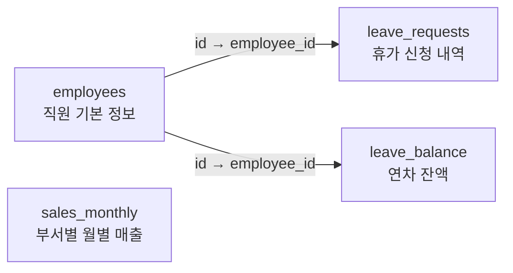

*그림 4-2: 커넥트HR 데이터베이스 4개 테이블 관계도*

각 테이블의 역할은 다음과 같습니다.

| 테이블명 | 역할 | 핵심 컬럼 |
|---------|------|---------|
| `employees` | 직원 기본 정보 (15명 샘플) | `id`, `name`, `department`, `hire_date`, `base_salary` |
| `leave_requests` | 휴가 신청 내역 | `employee_id`, `leave_type`, `start_date`, `end_date`, `status` |
| `leave_balance` | 직원별 연도별 연차 잔액 | `employee_id`, `year`, `total_days`, `used_days` |
| `sales_monthly` | 부서별 월별 매출 실적 | `department`, `year`, `month`, `revenue`, `target` |

`employees` 테이블은 핵심 참조 테이블입니다. `leave_requests`와 `leave_balance`는 `employee_id`를 외래 키(Foreign Key)로 사용하여 `employees`와 연결됩니다. `sales_monthly`는 직원 단위가 아닌 부서 단위로 독립 관리됩니다.

### schema_viewer.py로 스키마 분석 실행

스키마를 직접 확인하는 가장 빠른 방법은 `schema_viewer.py`를 실행하는 것입니다.

```bash
python src/main.py schema
```

#### 코드 워크플로우 (Code Workflow)

1. **입력(Input)**: `.env`에 정의된 PostgreSQL 접속 정보 (`POSTGRES_HOST`, `POSTGRES_PORT`, `POSTGRES_DB` 등)
2. **처리(Process)**: `information_schema.tables`와 `information_schema.columns`를 조회하여 각 테이블의 컬럼명, 데이터 타입, 기본값, Null 허용 여부, 제약조건(PK/UNIQUE)을 추출하고 `tabulate`로 표 형식으로 출력
3. **출력(Output)**: 터미널에 각 테이블 스키마 요약을 출력하고, `outputs/schema_report.txt`에 리포트 파일 저장

실행 결과의 일부를 보면 다음과 같습니다.

```
커넥트HR 데이터베이스 스키마 분석을 시작합니다...

============================================================
  테이블: employees  (레코드 수: 15건)
============================================================
컬럼명          데이터 타입        기본값                    Null 허용
--------------  -----------------  ------------------------  -----------
id              integer            nextval('employees_id_seq')  NO
name            character varying  -                            NO
department      character varying  -                            NO
hire_date       date               -                            NO
base_salary     numeric            -                            NO
email           character varying  -                            YES
is_active       boolean            true                         NO
created_at      timestamp          now()                        NO

[ 제약조건 ]
제약조건명              유형         컬럼
----------------------  -----------  ------
employees_email_key     UNIQUE        email
employees_pkey          PRIMARY KEY   id

리포트가 저장되었습니다: outputs/schema_report.txt
```

<!-- [CAPTURE NEEDED: 04_schema-viewer — `python src/main.py schema` 실행 후 터미널에 출력된 전체 스키마 분석 결과 화면] -->
*그림 4-3: schema_viewer.py 실행 결과 — 4개 테이블 구조가 출력된 터미널 화면*

이서연은 출력 결과를 보며 탄성을 질렀습니다.

> "아, `leave_balance` 테이블에 `total_days`랑 `used_days`가 있네요! `total_days - used_days`가 잔여 연차겠구나."

박민준 과장이 고개를 끄덕였습니다. "맞아요. 직접 보니까 훨씬 이해가 빠르죠?"

`schema_viewer.py`의 핵심 로직을 살펴보면, Python의 `information_schema`를 활용하여 DB에 직접 스키마를 질의합니다. 전체 코드는 GitHub 레포의 `src/schema_viewer.py`를 참고하십시오.

```python
# src/schema_viewer.py (발췌 — 테이블 목록 조회 부분)

def fetch_table_list(conn):
    """현재 데이터베이스의 public 스키마 테이블 목록을 반환합니다."""

    # --- Input ---
    query = """
        SELECT table_name
        FROM information_schema.tables
        WHERE table_schema = 'public'
          AND table_type = 'BASE TABLE'
        ORDER BY table_name;
    """

    # --- Process ---
    with conn.cursor() as cur:
        cur.execute(query)
        rows = cur.fetchall()

    # --- Output ---
    return [row[0] for row in rows]
```

#### 코드 워크플로우 (Code Workflow)

1. **입력(Input)**: `psycopg2` 커넥션 객체
2. **처리(Process)**: PostgreSQL 시스템 카탈로그인 `information_schema.tables`를 조회하여 `public` 스키마의 BASE TABLE 목록을 알파벳 순으로 반환
3. **출력(Output)**: 테이블명 문자열 리스트 (`['employees', 'leave_balance', 'leave_requests', 'sales_monthly']`)

> **팁: `information_schema`는 모든 관계형 DB의 공통 인터페이스입니다**
> `information_schema`는 SQL 표준으로, PostgreSQL뿐만 아니라 MySQL, SQLite 등 대부분의 관계형 DB에서 동일하게 사용할 수 있습니다. DB 종류가 바뀌어도 같은 방식으로 스키마를 조회할 수 있습니다.

---

## 4.3 CRUD API 구조 이해

스키마를 파악했다면, 이제 AI 에이전트가 이 데이터를 어떻게 조회할지 설계해야 합니다. 가장 단순한 방법은 LLM이 직접 SQL 쿼리를 생성하여 PostgreSQL에 실행하는 것입니다. 그러나 이 방식에는 치명적인 문제가 있습니다.

> **주의: LLM이 DB에 직접 SQL을 실행하면 안 되는 이유**
> LLM이 생성한 SQL이 항상 정확하다는 보장이 없습니다. `DELETE FROM employees;`나 `DROP TABLE leave_balance;` 같은 파괴적인 쿼리가 실행될 수도 있습니다. API 레이어를 통해 **허용된 작업만** 수행하도록 제한하는 것이 보안의 기본입니다.

이것이 **CRUD API** 레이어가 필요한 이유입니다. CRUD는 Create(생성), Read(읽기), Update(수정), Delete(삭제)의 약자로, 데이터의 기본 4가지 조작을 의미합니다. FastAPI로 구현된 CRUD 서버는 LLM과 PostgreSQL 사이에서 "허가된 창구" 역할을 합니다.

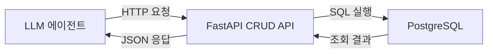

*그림 4-4: LLM과 DB 사이의 FastAPI CRUD API 레이어*

### FastAPI CRUD 서버 실행

```bash
uvicorn src.crud_api:app --reload --port 8000
```

서버가 시작되면 터미널에 아래 메시지가 출력됩니다.

```
[시작] 커넥트HR CRUD API 서버가 시작되었습니다.
       DB: connecthr@localhost:5432
       Swagger UI: http://localhost:8000/docs
INFO:     Uvicorn running on http://127.0.0.1:8000
```

#### 코드 워크플로우 (Code Workflow)

1. **입력(Input)**: `uvicorn` 명령으로 `src/crud_api.py`의 `app` 객체를 실행, `.env`의 DB 접속 정보 사용
2. **처리(Process)**: FastAPI 앱이 시작되며 `lifespan` 핸들러가 PostgreSQL 연결 상태를 확인, 정상이면 서버 준비 완료
3. **출력(Output)**: HTTP 서버가 `localhost:8000`에서 대기, Swagger UI를 통해 엔드포인트 목록 확인 가능

### 엔드포인트 목록

현재 CRUD API가 제공하는 엔드포인트는 다음과 같습니다.

| 메서드 | 경로 | 설명 |
|-------|------|------|
| GET | `/health` | 서버 및 DB 연결 상태 확인 |
| GET | `/employees` | 전체 직원 목록 조회 (부서 필터 지원) |
| GET | `/employees/{id}` | 특정 직원 상세 조회 |
| GET | `/leave-balance/{employee_id}` | 직원 연차 잔액 조회 |
| GET | `/sales/summary` | 부서별 월별 매출 요약 조회 |

이 챕터의 CRUD API는 **읽기 전용(Read-Only)** 입니다. 현 단계에서 AI 에이전트는 데이터를 조회하기만 하며, 데이터를 수정하거나 삭제하는 기능은 제공하지 않습니다.

### Swagger UI로 직접 테스트

브라우저에서 `http://localhost:8000/docs`에 접속하면 Swagger UI가 표시됩니다. 각 엔드포인트를 클릭하고 "Try it out" 버튼으로 실제 API를 테스트할 수 있습니다.

<!-- [CAPTURE NEEDED: 04_swagger-ui — `http://localhost:8000/docs` 화면에서 전체 엔드포인트 목록이 표시된 Swagger UI 화면] -->
*그림 4-5: Swagger UI — 커넥트HR CRUD API 엔드포인트 목록*

예를 들어, `GET /leave-balance/2`를 실행하면 이서연(직원 ID 2)의 연차 잔액을 확인할 수 있습니다.

```json
{
  "employee_id": 2,
  "employee_name": "이서연",
  "year": 2025,
  "total_days": 15.0,
  "used_days": 8.0,
  "remaining_days": 7.0
}
```

이서연이 자신의 데이터를 보며 웃었습니다. "총 15일 중 8일 썼고, 7일 남았네요."

### 왜 FastAPI인가

FastAPI를 선택한 이유는 세 가지입니다.

1. **자동 Swagger UI 생성**: 엔드포인트 정의만으로 인터랙티브 문서가 자동 생성됩니다.
2. **Pydantic 기반 타입 검증**: 요청과 응답 스키마를 Python 타입으로 정의하여 데이터 오류를 사전에 차단합니다.
3. **비동기 지원**: 다수의 동시 요청을 효율적으로 처리할 수 있습니다.

`crud_api.py`에서 `/leave-balance/{employee_id}` 엔드포인트의 핵심 부분을 발췌하면 다음과 같습니다. 전체 코드는 GitHub 레포의 `src/crud_api.py`를 참고하십시오.

```python
# src/crud_api.py (발췌 — 연차 잔액 조회 엔드포인트)

@app.get("/leave-balance/{employee_id}", response_model=LeaveBalanceResponse)
def get_leave_balance(employee_id: int, year: int = 2025) -> LeaveBalanceResponse:
    """특정 직원의 연차 잔액을 조회합니다."""

    # --- Input ---
    query = """
        SELECT
            lb.employee_id,
            e.name AS employee_name,
            lb.year,
            lb.total_days,
            lb.used_days,
            (lb.total_days - lb.used_days) AS remaining_days
        FROM leave_balance lb
        JOIN employees e ON e.id = lb.employee_id
        WHERE lb.employee_id = %s AND lb.year = %s;
    """

    # --- Process ---
    conn = get_connection()
    try:
        with conn.cursor(cursor_factory=RealDictCursor) as cur:
            cur.execute(query, (employee_id, year))
            row = cur.fetchone()
    finally:
        conn.close()

    if row is None:
        raise HTTPException(status_code=404, detail="연차 정보를 찾을 수 없습니다.")

    # --- Output ---
    return LeaveBalanceResponse(**dict(row))
```

#### 코드 워크플로우 (Code Workflow)

1. **입력(Input)**: URL 경로 파라미터 `employee_id`(정수), 쿼리 파라미터 `year`(기본값 2025)
2. **처리(Process)**: `leave_balance`와 `employees`를 JOIN하여 `remaining_days`를 계산. 결과가 없으면 HTTP 404 반환
3. **출력(Output)**: `LeaveBalanceResponse` Pydantic 모델로 직렬화된 JSON (잔여 연차 일수 포함)

---

## 4.4 MCP(Model Context Protocol) 개념 소개

CRUD API를 준비했습니다. 그런데 여기서 한 가지 질문이 생깁니다.

> "LLM이 이 API를 어떻게 호출하죠? LLM이 HTTP 요청을 스스로 보낼 수 있나요?"

이서연이 박민준 과장에게 물었습니다. 박민준 과장이 답하기 전에 김도현 팀장이 회의실에 들어왔습니다.

> "그게 바로 MCP 얘기야. 잠깐 설명해줄게."

### MCP란 무엇인가

**MCP(Model Context Protocol)** 는 LLM이 외부 도구와 데이터에 접근하는 표준 프로토콜입니다. LLM이 스스로 API를 호출하거나 함수를 실행할 수 있도록, "어떤 도구가 있는지"와 "그 도구를 어떻게 호출하는지"를 표준화한 방식입니다.

비유하자면, MCP는 스마트폰의 앱 스토어와 비슷합니다. LLM은 앱 목록(도구 목록)을 보고, 필요한 앱(도구)을 선택하고, 실행(호출)합니다. 어떤 앱이 있는지, 어떻게 실행하는지를 표준화된 방식으로 제공하는 것이 MCP의 역할입니다.

<!-- [IMAGE PLACEHOLDER: 04_mcp-concept — LLM이 도구 목록을 보고 적절한 도구를 선택하여 호출하는 MCP 핵심 흐름] -->
*그림 4-6: MCP 핵심 흐름 — 사용자 질문에서 도구 호출까지*

MCP의 핵심 흐름은 다음과 같습니다.

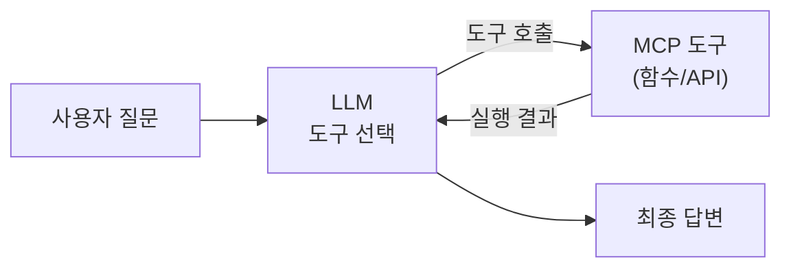

*그림 4-7: MCP 도구 호출 흐름도*

### LangChain @tool 데코레이터로 MCP 패턴 구현

실제 MCP 서버를 구성하려면 별도의 인프라가 필요합니다. 이 챕터에서는 **LangChain의 `@tool` 데코레이터** 를 활용하여 동일한 "도구 호출" 패턴을 간단하게 체험합니다. CH08에서 MCP를 본격적으로 구현할 때, 이 패턴이 기반이 됩니다.

`@tool` 데코레이터는 Python 함수를 LLM이 호출할 수 있는 도구로 변환합니다. 도구의 이름과 설명은 함수의 이름과 docstring에서 자동으로 추출됩니다.

```python
# src/mcp_intro.py (발췌 — get_leave_balance 도구 정의)

from langchain.tools import tool

@tool
def get_leave_balance(employee_name: str, year: int = 2025) -> str:
    """직원 이름과 연도로 연차 잔액을 조회합니다.

    Args:
        employee_name: 직원 이름 (예: '이서연')
        year:          조회 연도 (기본값: 2025)

    Returns:
        연차 잔액 JSON 문자열 (총일수, 사용일수, 잔여일수).
    """

    # --- Input ---
    query = """
        SELECT e.name AS 이름, lb.year AS 연도,
               lb.total_days AS 총_연차, lb.used_days AS 사용_연차,
               (lb.total_days - lb.used_days) AS 잔여_연차
        FROM leave_balance lb
        JOIN employees e ON e.id = lb.employee_id
        WHERE e.name = %s AND lb.year = %s;
    """

    # --- Process ---
    conn = psycopg2.connect(**DB_CONFIG)
    with conn.cursor(cursor_factory=RealDictCursor) as cur:
        cur.execute(query, (employee_name, year))
        row = cur.fetchone()
    conn.close()

    # --- Output ---
    return json.dumps(dict(row), ensure_ascii=False, default=str)
```

#### 코드 워크플로우 (Code Workflow)

1. **입력(Input)**: `employee_name` (직원 이름 문자열), `year` (연도 정수, 기본값 2025)
2. **처리(Process)**: `@tool` 데코레이터가 함수를 LangChain Tool 객체로 변환. PostgreSQL에서 `leave_balance`와 `employees`를 JOIN하여 잔여 연차를 계산
3. **출력(Output)**: JSON 문자열 형식의 연차 잔액 정보 (LLM이 읽을 수 있는 텍스트 형태)

`@tool` 데코레이터의 핵심은 **함수의 docstring이 곧 도구의 설명** 이 된다는 점입니다. LLM은 이 설명을 읽고 "연차를 조회하려면 `get_leave_balance` 도구를 사용해야겠다"고 판단합니다. 설명이 부정확하면 LLM이 잘못된 도구를 선택하거나 잘못된 파라미터를 전달할 수 있습니다.

### MCP 데모 실행

```bash
python src/main.py mcp
```

#### 코드 워크플로우 (Code Workflow)

1. **입력(Input)**: 사전 정의된 테스트 질문 3개 (직원 정보 조회, 연차 잔액, 매출 현황)
2. **처리(Process)**: 등록된 MCP 도구 3개(`get_employee_info`, `get_leave_balance`, `get_department_sales`)를 각 질문에 맞게 직접 호출
3. **출력(Output)**: 각 도구의 실행 결과를 JSON 형식으로 출력

실행하면 다음과 같은 결과가 출력됩니다.

```
커넥트HR MCP(Model Context Protocol) 개념 데모

MCP 핵심 흐름:
  사용자 질문 → LLM이 도구 선택 → 도구 실행 → 결과 반환 → 최종 답변

등록된 MCP 도구 목록 (3개):
  - get_employee_info: 직원 이름으로 직원 정보를 조회합니다...
  - get_leave_balance: 직원 이름과 연도로 연차 잔액을 조회합니다...
  - get_department_sales: 부서명과 연도로 월별 매출 현황을 조회합니다...

============================================================
  [데모 1] MCP 도구 직접 호출 (LLM 없이)
============================================================

[질문] 이서연 직원 정보 조회
[도구] get_employee_info
[입력] {"employee_name": "이서연"}
[결과] {
  "id": 2,
  "name": "이서연",
  "department": "개발팀",
  "hire_date": "2022-06-15",
  "base_salary": 3600000.0,
  ...
}

[질문] 박민준 2025년 연차 잔액
[도구] get_leave_balance
[입력] {"employee_name": "박민준", "year": 2025}
[결과] {
  "이름": "박민준",
  "연도": 2025,
  "총_연차": 18.0,
  "사용_연차": 6.0,
  "잔여_연차": 12.0
}
```

<!-- [CAPTURE NEEDED: 04_mcp-demo — `python src/main.py mcp` 실행 후 도구 목록과 직접 호출 결과가 출력된 터미널 화면 전체] -->
*그림 4-8: MCP 데모 실행 결과 — 도구 직접 호출과 LangChain 에이전트 호출 결과*

### 데모 2: LLM이 도구를 선택하는 흐름 (Ollama 필요)

Ollama와 DeepSeek R1이 실행 중이라면, 데모 2에서 LLM이 스스로 도구를 선택하는 과정을 볼 수 있습니다.

```
[데모 2] LangChain 에이전트를 통한 MCP 패턴

[질문] 이서연 씨의 2025년 잔여 연차가 며칠인지 알려줘.

> 생각 중...
> 도구 선택: get_leave_balance
> 입력: {"employee_name": "이서연", "year": 2025}
> 결과: {"잔여_연차": 7.0, ...}

[답변] 이서연 씨의 2025년 잔여 연차는 7일입니다.
```

이것이 MCP의 핵심입니다. 사용자는 "이서연의 잔여 연차"를 물었고, LLM은 사용 가능한 도구 목록에서 `get_leave_balance`가 적합하다고 판단하여 자동으로 호출했습니다. 이서연이 이 출력을 보며 처음으로 MCP를 이해한 표정을 지었습니다.

> "LLM이 어떤 도구를 쓸지 스스로 판단한다는 거잖아요. 그러면 저는 도구만 잘 만들어두면 되겠네요?"

박민준 과장이 고개를 끄덕였습니다. "바로 그거야. 도구 설명이 정확할수록 LLM이 올바른 도구를 선택한다."

> **주의: Ollama 없이도 데모 1은 실행됩니다**
> Ollama가 설치되지 않았거나 실행 중이 아니어도 [데모 1] (도구 직접 호출)은 정상 동작합니다. [데모 2] (LLM 에이전트 호출)는 Ollama가 필요하며, Ollama가 없으면 자동으로 건너뜁니다.

### 트러블슈팅

실행 중 오류가 발생한다면 아래 표를 참고하십시오.

| 증상 | 원인 | 해결 방법 |
|------|------|---------|
| `connection refused` | PostgreSQL 미실행 | `docker-compose up -d` 재실행 |
| `ModuleNotFoundError` | 가상환경 미활성화 | `source venv/bin/activate` 후 재실행 |
| Swagger UI 접근 불가 | FastAPI 서버 미실행 | `uvicorn src.crud_api:app --reload` 실행 |
| MCP 에이전트 건너뜀 | Ollama 미실행 | `ollama serve` 후 `ollama pull deepseek-r1:1.5b` |

---

## 4.5 정리하며

이 장에서 이서연은 혼자서는 파악하지 못했던 사내 DB 구조를 박민준 과장과 함께 분석하며 자신감을 얻었습니다. 그리고 AI 에이전트가 DB에 안전하게 접근하기 위한 두 가지 핵심 레이어, **CRUD API** 와 **MCP** 의 개념을 처음으로 체험했습니다.

<!-- GEMINI_IMAGE
Prompt: Simple before/after comparison infographic: LEFT side shows developer confused at blank database schema with question marks, with label "스키마 미파악", RIGHT side shows developer confidently looking at organized ER diagram with 4 tables connected, with label "스키마 분석 완료", arrow in the middle pointing right, clean flat design, warm color tones, white background
Style: before-after-infographic
Alt: 스키마 미파악 상태에서 스키마 분석 완료 상태로 이행한 결과
-->
*그림 4-9: 스키마 파악 전후 비교 — DB 구조 이해가 AI 에이전트 설계의 출발점*

이 장의 핵심 내용을 정리합니다.

- **스키마 분석이 AI 에이전트 설계의 출발점이다**: DB 구조를 모르면 어떤 테이블에서 어떤 데이터를 가져와야 하는지 판단할 수 없습니다. `schema_viewer.py`로 4개 테이블 구조를 파악하고 `outputs/schema_report.txt`로 리포트를 생성했습니다.

- **CRUD API 레이어가 보안을 확보한다**: LLM이 PostgreSQL에 직접 SQL을 실행하면 파괴적인 쿼리가 실행될 위험이 있습니다. FastAPI CRUD 서버를 통해 허용된 읽기 작업만 수행하도록 제한했습니다.

- **MCP는 LLM이 외부 도구를 호출하는 표준 방식이다**: `@tool` 데코레이터로 Python 함수를 LLM이 호출 가능한 도구로 변환하는 패턴을 체험했습니다. 도구의 docstring이 곧 LLM의 선택 기준이 됩니다.

- **협업이 시스템 이해를 가속한다**: 이서연이 박민준 과장과 함께 스키마를 분석하며 혼자서는 몇 시간이 걸렸을 이해를 30분 만에 달성했습니다. 데이터 전문가와의 협력은 AI 시스템 개발의 핵심 자산입니다.

**다음 장 예고**: CH05에서는 사내 매뉴얼 3,000페이지를 다루는 과정을 살펴봅니다. 벡터 DB에 넣기 전에 PDF, Word, Markdown 문서를 수집하고 정제하는 **문서 표준화 파이프라인** 을 구축합니다. 이서연은 "전부 다 넣으면 안 되나요?"라는 질문을 하게 됩니다.


---

# 5장. 사내 문서 표준화

이 장에서는 PDF, Word, Markdown 등 다양한 형식의 사내 문서를 수집하고, 노이즈를 제거하며, 일관된 형식으로 표준화하는 파이프라인을 구축합니다. CH04에서 정형 데이터(DB)에 접근하는 방법을 확보했다면, 이 장에서는 비정형 문서를 RAG가 읽을 수 있는 형태로 준비하는 과정을 다룹니다.

---

이서연은 사내 공유 드라이브를 처음 열었을 때 숨이 막혔습니다. "HR 정책", "IT 가이드", "취업 규칙", "보안 지침"이 부서별, 연도별로 뒤섞인 폴더 3,000페이지 분량의 문서들이 쌓여 있었습니다. 그 중에는 2015년에 작성된 파일도 있었고, PDF와 Word, 그리고 이름 없는 텍스트 파일이 뒤죽박죽 섞여 있었습니다.

"이걸 다 어떻게 처리하죠?" 이서연이 팀장 김도현에게 물었습니다.

"전부 넣을 필요 없어요. 핵심 문서 50개를 먼저 선별하는 게 맞습니다. RAG는 데이터가 많을수록 좋은 게 아니라, 데이터가 깨끗할수록 좋습니다."

이 장에서는 이서연이 경험한 것과 동일한 문제 — **'어떤 문서를 넣어야 하는가'** 와 **'어떻게 정제해야 하는가'** — 를 단계별로 해결합니다.

<!-- [IMAGE PLACEHOLDER: 05_intro_chaos — 여러 형식의 문서가 뒤섞인 폴더 앞에 서서 막막한 표정의 개발자] -->
*그림 5-1: 3,000페이지 문서 앞에 선 이서연*

---

## 5.1 RAG 검색 품질을 결정하는 문서 기준

### 5.1.1 GIGO 원칙: 문서 품질이 성능의 70%를 결정한다

데이터 과학에는 오래된 격언이 있습니다. **GIGO(Garbage In, Garbage Out)** — 쓰레기를 넣으면 쓰레기가 나온다는 원칙입니다. RAG 시스템에서 이 원칙은 특히 강하게 적용됩니다.

벡터 검색은 입력 텍스트를 수치 벡터로 변환하여 유사도를 계산합니다. 이 과정에서 문서에 포함된 노이즈 — 머리글, 바닥글, 페이지 번호, 특수문자 — 도 함께 벡터화됩니다. 결과적으로 검색 쿼리와 전혀 관련 없는 텍스트가 결과에 영향을 미치게 됩니다.

> **참고: 왜 노이즈가 검색 품질을 떨어뜨리는가?**
> "커넥트HR 내부용 | 2023년 3월 개정 | 페이지 5/32"라는 바닥글 문자열이 청크에 포함되면, "연차 규정 조회" 질문에 대한 유사도 계산에서 이 문장이 방해 요소로 작용합니다. 깨끗한 텍스트와 노이즈가 섞인 텍스트의 임베딩 벡터는 의미적으로 서로 다른 방향을 가리킵니다.

### 5.1.2 문서 선별 3가지 기준

3,000페이지 문서를 전부 벡터 DB에 넣는 것은 비효율적일 뿐 아니라 오히려 검색 정확도를 떨어뜨립니다. 아래 기준으로 핵심 문서를 선별하십시오.

| 기준 | 설명 | 제외 대상 |
|------|------|---------|
| **최신성** | 현재 적용 중인 규정인가? | 폐기된 버전, 3년 이상 된 미개정 문서 |
| **명확성** | 질문에 직접 답할 수 있는 내용인가? | 회의록, 임시 메모, 미완성 초안 |
| **구조화** | 섹션이 명확히 구분되어 있는가? | 스캔 PDF, 이미지 전용 파일 |

커넥트HR 팀이 선별한 문서 구성은 다음과 같습니다.

- `hr_policy.txt` — HR 인사 정책 (취업 규칙, 복리후생)
- `leave_rules.txt` — 연차 및 휴가 규정
- `it_guide.txt` — IT 보안 및 장비 사용 가이드

> **팁: 작게 시작하십시오**
> 처음부터 수백 개 문서를 넣으려 하지 마십시오. 10~50개 핵심 문서로 파이프라인을 검증한 뒤, 점차 범위를 넓히는 전략이 효율적입니다. 이서연이 김도현 팀장의 조언대로 50개 핵심 문서를 먼저 선별한 이유가 여기 있습니다.

### 5.1.3 문서 표준화 파이프라인 전체 구조

이 장에서 구현할 파이프라인은 4단계로 구성됩니다.


*그림 5-2: 문서 표준화 파이프라인 4단계 흐름*

각 모듈의 역할은 다음과 같습니다.

| 모듈 | 파일 | 역할 |
|------|------|------|
| `collector` | `src/collector.py` | 디렉토리 스캔, 파일 메타데이터 추출 |
| `preprocessor` | `src/preprocessor.py` | 머리글/바닥글, 특수문자, 과도한 공백 제거 |
| `normalizer` | `src/normalizer.py` | 일관된 Markdown 형식으로 변환, 섹션 헤더 자동 감지 |
| `metadata_manager` | `src/metadata_manager.py` | 문서 유형·버전·태그 자동 감지, JSON 저장 |

---

## 5.2 PDF, Word, Markdown 수집 전략

### 5.2.1 저장소 클론 및 실행 준비

먼저 이 장의 예제 저장소를 클론합니다.

```bash
git clone https://github.com/{repo}/CH05_문서표준화
cd CH05_문서표준화
cp .env.example .env
pip install -r requirements.txt
```

#### 코드 워크플로우 (Code Workflow)

1. **입력(Input)**: GitHub 저장소 URL
2. **처리(Process)**: 저장소를 로컬에 복제하고, `.env.example`을 복사하여 환경 변수 파일을 생성하며, `requirements.txt`로 의존성을 설치합니다.
3. **출력(Output)**: 실행 가능한 로컬 프로젝트 환경

`.env` 파일을 열면 아래와 같은 내용이 있습니다.

```env
# 문서 입력 경로 (기본값: data/sample_docs)
DOCS_INPUT_DIR=data/sample_docs

# 정규화 결과 출력 경로
NORMALIZED_OUTPUT_DIR=outputs/markdown

# 메타데이터 출력 경로
METADATA_OUTPUT_DIR=outputs/metadata
```

### 5.2.2 collector.py: 디렉토리 스캔과 파일 수집

`collector.py`는 지정된 디렉토리를 재귀적으로 스캔하여 지원 형식의 파일을 수집합니다.

```python
# src/collector.py (핵심 함수 발췌)

SUPPORTED_EXTENSIONS: set[str] = {".txt", ".md"}
PDF_EXTENSIONS: set[str] = {".pdf"}

def scan_directory(directory: str) -> list[dict]:
    """지정 디렉토리에서 지원 형식의 파일을 재귀적으로 수집합니다."""

    # --- Input ---
    dir_path = Path(directory)

    # --- Process ---
    collected_files: list[dict] = []

    for file_path in dir_path.rglob("*"):
        if not file_path.is_file():
            continue

        ext = file_path.suffix.lower()
        all_extensions = SUPPORTED_EXTENSIONS | PDF_EXTENSIONS

        if ext not in all_extensions:
            continue

        stat = file_path.stat()
        file_info = {
            "file_name": file_path.name,
            "file_path": str(file_path.absolute()),
            "extension": ext,
            "size_bytes": stat.st_size,
            "modified_at": datetime.fromtimestamp(stat.st_mtime).isoformat(),
            "is_supported": ext in SUPPORTED_EXTENSIONS,
        }
        collected_files.append(file_info)

    # --- Output ---
    return collected_files
```

#### 코드 워크플로우 (Code Workflow)

1. **입력(Input)**: 스캔할 디렉토리 경로 문자열
2. **처리(Process)**: `rglob("*")`로 하위 디렉토리까지 재귀 탐색하여, 확장자가 `.txt`, `.md`, `.pdf`인 파일만 수집합니다. 파일별로 이름, 절대 경로, 크기, 수정 시각, 지원 여부를 추출합니다.
3. **출력(Output)**: 파일 정보 딕셔너리 리스트

> **참고: PDF는 이 장에서 직접 처리하지 않습니다**
> `collector.py`는 PDF 파일을 인식하지만 전처리 대상에서 제외합니다. PDF 내부 텍스트 추출(PyMuPDF, pdfplumber)은 CH06에서 본격적으로 다룹니다. 이 장에서는 `.txt`와 `.md` 형식에 집중합니다.

### 5.2.3 프로젝트 디렉토리 구조

문서는 아래 구조로 정리됩니다.

```
CH05_문서표준화/
├── data/
│   └── sample_docs/        샘플 문서 (실습용)
│       ├── hr_policy.txt   HR 정책 문서
│       ├── leave_rules.txt 휴가 규정 문서
│       └── it_guide.txt    IT 사용 가이드
├── src/
│   ├── main.py             파이프라인 진입점
│   ├── collector.py        파일 수집
│   ├── preprocessor.py     노이즈 제거
│   ├── normalizer.py       Markdown 변환
│   └── metadata_manager.py 메타데이터 관리
└── outputs/                실행 결과 (자동 생성)
    ├── markdown/           정규화된 .md 파일
    └── metadata/           메타데이터 .json 파일
```

> **팁: 부서별 하위 폴더를 사용하십시오**
> 실제 운영에서는 `data/docs/hr/`, `data/docs/it/`, `data/docs/finance/`와 같이 부서별로 분리하십시오. `collector.py`의 `rglob("*")`는 하위 디렉토리까지 자동으로 탐색합니다. 폴더 구조 자체가 문서의 출처 정보가 됩니다.

---

## 5.3 문서 전처리 및 정규화 가이드라인

이서연은 수집된 HR 정책 문서를 처음 열었을 때 예상치 못한 내용을 발견했습니다.

```
========================================================
커넥트HR 내부 문서 | 배포 제한 | 문서 ID: HR-2023-001
========================================================
버전: v2.1 | 최종 승인: 2023-03-15 | 다음 개정 예정: 2024-03-15
페이지 1 / 18

1. 채용 정책
...
```

"이 헤더와 바닥글, 페이지 번호가 전부 검색에 노이즈로 작용하겠네요." 이서연이 말했습니다. 전처리의 목표는 분명합니다 — LLM이 읽어야 할 실제 내용만 남기는 것입니다.

### 5.3.1 preprocessor.py: 4단계 노이즈 제거

`preprocessor.py`는 원시 텍스트에서 불필요한 내용을 제거합니다. 처리는 4단계로 순서대로 실행됩니다.

```python
# src/preprocessor.py (핵심 함수 발췌)

HEADER_FOOTER_PATTERNS: list[str] = [
    r"={40,}",                    # === 구분선 (40자 이상)
    r"-{40,}",                    # --- 구분선 (40자 이상)
    r"\[문서\s*끝\].*",            # [문서 끝] 라인
    r"페이지\s*\d+\s*/\s*\d+",    # 페이지 N/M 패턴
    r"버전:\s*v[\d.]+\s*\|.*",    # 버전 메타 라인
    r"문서\s*ID:\s*\S+",          # 문서 ID 라인
]

def preprocess(text: str) -> str:
    """텍스트 전처리 전체 파이프라인을 순서대로 실행합니다."""

    # --- Input ---
    if not text or not text.strip():
        raise ValueError("텍스트가 비어있습니다.")

    original_length = len(text)

    # --- Process ---
    result = remove_header_footer(text)   # 1단계: 머리글/바닥글 제거
    result = replace_special_chars(result) # 2단계: 특수문자 교체
    result = remove_repeated_separators(result) # 3단계: 반복 구분선 제거
    result = normalize_whitespace(result)  # 4단계: 공백 정규화
    result = result.strip()

    reduction_rate = (1 - len(result) / original_length) * 100
    print(f"  전처리 완료: {original_length}자 → {len(result)}자 ({reduction_rate:.1f}% 감소)")

    # --- Output ---
    return result
```

#### 코드 워크플로우 (Code Workflow)

1. **입력(Input)**: 원시 파일에서 읽어온 텍스트 문자열
2. **처리(Process)**: 4단계 파이프라인을 순서대로 실행합니다. (1) `remove_header_footer`로 정규식 패턴에 일치하는 라인 제거 → (2) `replace_special_chars`로 특수 유니코드 문자를 표준 문자로 교체 → (3) `remove_repeated_separators`로 10자 이상 구분선 제거 → (4) `normalize_whitespace`로 연속 공백·탭·빈 줄 압축
3. **출력(Output)**: 정제된 텍스트 문자열 및 압축률 출력

아래 표는 각 전처리 단계에서 제거하는 내용입니다.

| 단계 | 처리 내용 | 예시 |
|------|---------|------|
| 머리글/바닥글 제거 | 40자 이상 구분선, 페이지 번호, 버전 메타 라인 | `===...===`, `페이지 1/18` |
| 특수문자 교체 | 유니코드 특수 따옴표, 대시 → ASCII 표준 | `"` → `"`, `—` → `-` |
| 반복 구분선 제거 | 10자 이상 순수 구분선 라인 삭제 | `----------` |
| 공백 정규화 | 탭→공백, 3줄 이상 빈 줄→2줄, 줄 끝 공백 제거 | `\t` → `    ` |

### 5.3.2 normalizer.py: Markdown 형식으로 변환

전처리가 끝난 텍스트는 `normalizer.py`를 통해 일관된 Markdown 구조로 변환됩니다. 이 과정에서 섹션 헤더가 자동으로 감지되어 `#`, `##`, `###` 형식으로 변환됩니다.

```python
# src/normalizer.py (핵심 함수 발췌)

HEADER_PATTERNS: list[tuple[int, str]] = [
    (1, r"^(\d+)\.\s+[가-힣A-Za-z]"),         # "1. 제목" → H2
    (2, r"^(\d+\.\d+)\s+[가-힣A-Za-z]"),       # "1.1 제목" → H3
    (3, r"^(\d+\.\d+\.\d+)\s+[가-힣A-Za-z]"),  # "1.1.1 제목" → H4
]

def normalize_to_markdown(text: str, source_file_name: str = "") -> str:
    """전처리된 텍스트를 Markdown 형식으로 변환합니다."""

    # --- Input ---
    lines = text.splitlines()
    result_lines: list[str] = []

    # 파일명 기반 H1 제목 삽입
    if source_file_name:
        doc_title = Path(source_file_name).stem.replace("_", " ")
        result_lines.append(f"# {doc_title}")
        result_lines.append("")

    # --- Process ---
    idx = 0
    while idx < len(lines):
        line = lines[idx]
        stripped = line.strip()

        if "|" in stripped and stripped.startswith("|"):
            # 파이프 포함 라인 → Markdown 표 변환
            table_md, idx = convert_table_to_markdown(lines, idx)
            result_lines.append(table_md)
        else:
            header_level = detect_header_level(stripped)
            if header_level > 0:
                prefix = "#" * (header_level + 1)
                result_lines.append(f"{prefix} {stripped}")
            else:
                result_lines.append(stripped)
            idx += 1

    # --- Output ---
    return "\n".join(result_lines).strip()
```

#### 코드 워크플로우 (Code Workflow)

1. **입력(Input)**: 전처리 완료된 텍스트 문자열, 원본 파일명
2. **처리(Process)**: 라인 단위로 순회하며 (1) 파이프(`|`) 포함 라인은 Markdown 표로 변환, (2) 숫자 번호 섹션(`1. 제목`, `1.1 제목`)은 Markdown 헤더(`##`, `###`)로 변환, (3) 일반 텍스트는 그대로 유지합니다.
3. **출력(Output)**: 구조화된 Markdown 텍스트 문자열

변환 결과를 비교하면 다음과 같습니다.

**변환 전 (원시 텍스트):**
```
1. 채용 정책
본 회사의 채용은 공개 채용을 원칙으로 한다.

1.1 채용 절차
1단계: 서류 전형
2단계: 면접
```

**변환 후 (Markdown):**
```markdown
# hr policy

## 1. 채용 정책
본 회사의 채용은 공개 채용을 원칙으로 한다.

### 1.1 채용 절차
1. 서류 전형
2. 면접
```

> **주의: Word 파일(.docx) 처리**
> 현재 예제는 `.txt`와 `.md` 형식만 처리합니다. Word 파일은 `python-docx` 라이브러리로 텍스트를 추출한 뒤 동일한 파이프라인을 적용합니다. 전체 구현은 GitHub 저장소의 `src/extractor.py`를 참고하십시오.

---

## 5.4 문서 버전 관리 및 메타데이터 설계

### 5.4.1 파이프라인 전체 실행

이제 파이프라인을 실행할 차례입니다.

```bash
python src/main.py
```

#### 코드 워크플로우 (Code Workflow)

1. **입력(Input)**: `data/sample_docs/` 디렉토리 (샘플 문서 3개)
2. **처리(Process)**: collector → preprocessor → normalizer → metadata_manager 순서로 4단계 파이프라인 실행
3. **출력(Output)**: `outputs/markdown/`에 정규화된 `.md` 파일, `outputs/metadata/`에 메타데이터 `.json` 파일

실행하면 아래와 같은 결과가 터미널에 출력됩니다.

```
============================================================
CH05 사내 문서 표준화 파이프라인 시작
============================================================

[Step 1] 문서 수집
  스캔 경로: data/sample_docs
============================================================
문서 수집 결과 리포트
============================================================
전체 파일 수: 3개
  - 전처리 가능 (.txt/.md): 3개
  - PDF (CH06에서 처리):    0개
전체 크기: 12.4 KB

파일명                              크기(KB)     지원 여부
------------------------------------------------------------
hr_policy.txt                          4.8         가능
it_guide.txt                           3.1         가능
leave_rules.txt                        4.5         가능
============================================================
  전처리 대상: 3개 파일

[Step 2 & 3] 전처리 및 Markdown 정규화
  처리 중: hr_policy.txt
  전처리 완료: 4921자 → 3102자 (36.9% 감소)
  저장 완료: outputs/markdown/hr_policy_normalized.md
  처리 중: it_guide.txt
  전처리 완료: 3210자 → 2105자 (34.4% 감소)
  저장 완료: outputs/markdown/it_guide_normalized.md
  처리 중: leave_rules.txt
  전처리 완료: 4583자 → 2987자 (34.8% 감소)
  저장 완료: outputs/markdown/leave_rules_normalized.md

[Step 4] 메타데이터 생성
  처리 중: hr_policy.txt
  메타데이터 저장: outputs/metadata/hr_policy.metadata.json
  처리 중: it_guide.txt
  메타데이터 저장: outputs/metadata/it_guide.metadata.json
  처리 중: leave_rules.txt
  메타데이터 저장: outputs/metadata/leave_rules.metadata.json

============================================================
파이프라인 완료
============================================================
  수집 파일: 3개
  전처리 완료: 3개
  정규화 완료 (Markdown): 3개
  메타데이터 생성: 3개
```

<!-- [CAPTURE NEEDED: 05_pipeline-result — `python src/main.py` 실행 후 전체 파이프라인 완료 터미널 화면] -->
*그림 5-3: 파이프라인 완료 화면 — 3개 문서 전처리 결과와 압축률 표시*

전처리 결과를 보면 `hr_policy.txt`는 4,921자에서 3,102자로 **36.9% 감소** 했습니다. 제거된 1,819자는 대부분 머리글, 바닥글, 페이지 번호, 반복 구분선이었습니다. 이것이 RAG에 입력되는 노이즈를 줄이는 과정입니다.

"이 문서는 꽤 깨끗하게 정리됐네요. 그런데 이 파일은 표가 깨져 있어요." 이서연이 IT 가이드 파일을 열며 말했습니다. 데이터 품질 문제는 어떤 시스템에서도 피할 수 없습니다. 파이프라인은 이를 자동으로 처리하지만, 결과물을 직접 확인하는 습관이 중요합니다.

### 5.4.2 metadata_manager.py: 문서 메타데이터 설계

메타데이터(Metadata)는 문서에 대한 부가 정보입니다. "이 문서는 HR 부서의 연차 규정 문서이며, 버전은 v2.1이다"라는 정보를 구조화하여 저장합니다. 메타데이터가 있으면 벡터 검색 시 "HR 부서 문서에서만 검색"과 같은 필터링이 가능해집니다.

```python
# src/metadata_manager.py (핵심 함수 발췌)

DOC_TYPE_KEYWORDS: dict[str, list[str]] = {
    "hr_policy": ["인사", "채용", "퇴직", "평가", "복리후생"],
    "leave":     ["휴가", "연차", "병가", "육아", "경조사"],
    "it_guide":  ["VPN", "보안", "비밀번호", "슬랙", "장비"],
    "finance":   ["예산", "지출", "매출", "비용", "세금"],
}

def build_metadata(file_path: str, text: str, normalized_path: str = "") -> dict:
    """문서 파일로부터 전체 메타데이터 딕셔너리를 생성합니다."""

    # --- Input ---
    path = Path(file_path)
    stat = path.stat()

    # --- Process ---
    doc_type = detect_doc_type(text, path.name)  # 키워드 기반 유형 감지
    tags = extract_tags(text)                      # 등장 키워드 태그 추출
    version = extract_version(text)                # 버전 문자열 추출

    metadata = {
        "file_name": path.name,
        "source": str(path.absolute()),
        "normalized_path": normalized_path,
        "created_at": datetime.now().isoformat(),
        "modified_at": datetime.fromtimestamp(stat.st_mtime).isoformat(),
        "size_bytes": stat.st_size,
        "doc_type": doc_type,
        "version": version,
        "tags": tags,
        "char_count": len(text),
    }

    # --- Output ---
    return metadata
```

#### 코드 워크플로우 (Code Workflow)

1. **입력(Input)**: 원본 파일 경로, 전처리된 텍스트, 정규화 파일 경로
2. **처리(Process)**: (1) 파일명과 내용 앞 1,000자를 분석하여 문서 유형(`doc_type`) 자동 감지, (2) 태그 키워드 목록과 대조하여 해당 키워드(`tags`) 추출, (3) 정규식으로 버전 문자열(`version`) 추출
3. **출력(Output)**: 구조화된 메타데이터 딕셔너리

`hr_policy.txt`에 대해 생성된 메타데이터 예시는 아래와 같습니다.

```json
{
  "file_name": "hr_policy.txt",
  "source": "/path/to/data/sample_docs/hr_policy.txt",
  "normalized_path": "/path/to/outputs/markdown/hr_policy_normalized.md",
  "created_at": "2024-01-15T10:30:00.123456",
  "modified_at": "2024-01-10T09:00:00.000000",
  "size_bytes": 4915,
  "doc_type": "hr_policy",
  "version": "v2.1",
  "tags": ["HR", "채용", "평가", "온보딩"],
  "char_count": 4921
}
```

### 5.4.3 메타데이터가 검색 품질에 미치는 영향

메타데이터의 핵심 가치는 **필터 검색** 에 있습니다. 메타데이터 없이 벡터 검색만 사용하면 "연차 규정"을 검색할 때 IT 가이드의 "출장 신청 절차"도 함께 반환될 수 있습니다. 메타데이터 필터를 적용하면 특정 부서, 특정 버전의 문서에서만 검색하도록 범위를 제한할 수 있습니다.

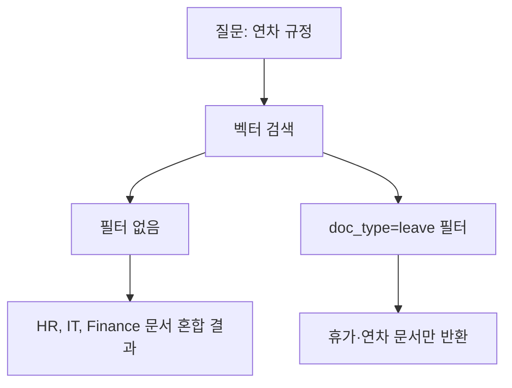

*그림 5-4: 메타데이터 필터 유무에 따른 검색 결과 차이*

메타데이터의 두 번째 가치는 **버전 관리** 입니다. 문서가 개정될 때 버전 정보를 메타데이터에 기록하면, 벡터 DB에서 구 버전 문서를 삭제하고 신 버전으로 교체하는 작업이 명확해집니다.

> **팁: 메타데이터는 CH06에서 ChromaDB에 함께 저장됩니다**
> 이 장에서 생성한 `outputs/metadata/*.json` 파일은 CH06 벡터 DB 구축 시 ChromaDB의 메타데이터 필드로 함께 저장됩니다. `doc_type`, `version`, `tags` 필드가 검색 필터의 기준이 됩니다.

### 5.4.4 버전 관리 전략

실제 운영 환경에서 문서는 계속 업데이트됩니다. 아래 전략을 권장합니다.

1. **파일명에 버전 포함**: `hr_policy_v2.1.txt`처럼 파일명 자체에 버전을 명시하면 어떤 버전이 벡터 DB에 들어가 있는지 즉시 파악할 수 있습니다.
2. **전체 재색인 대신 개별 교체**: 문서 하나가 개정되면 해당 문서의 청크만 삭제하고 재색인합니다. ChromaDB는 `where` 필터를 사용한 개별 삭제를 지원합니다.
3. **메타데이터 `modified_at` 추적**: 마지막 수정 시각을 기록해두면, "n일 이상 개정되지 않은 문서"를 주기적으로 검토하는 워크플로우를 만들 수 있습니다.

<!-- [IMAGE PLACEHOLDER: 05_version-management — 문서 버전 관리 전략을 보여주는 타임라인 다이어그램 (구버전 삭제 → 신버전 색인)] -->
*그림 5-5: 문서 버전 관리 전략 — 구버전 제거 후 신버전 재색인*

---

## 5.5 정리하며

이 장에서는 RAG 파이프라인의 입력 품질을 결정하는 문서 표준화 과정을 구현했습니다. 파이프라인을 직접 실행하면서 이서연이 체감한 것처럼, 데이터 품질이 AI 시스템 성능의 기초임을 확인했습니다.

<!-- GEMINI_IMAGE
Prompt: Simple before/after comparison infographic: LEFT side shows "노이즈가 포함된 원시 문서"
        with red indicator and "4,921자", RIGHT side shows "정제된 Markdown 문서"
        with green indicator and "3,102자", downward arrow in the middle labeled "36.9% 감소",
        clean flat design, white background
Style: before-after-infographic
Alt: 전처리 전 4,921자에서 전처리 후 3,102자로 36.9% 감소한 결과
-->
*그림 5-6: 전처리 전후 텍스트 크기 비교 — 노이즈 제거로 36.9% 감소*

- **GIGO 원칙이 RAG 성능을 좌우합니다**: 문서 품질이 검색 정확도의 70%를 결정합니다. 모든 문서를 무분별하게 넣는 것보다 핵심 50개 문서를 선별하는 것이 성능이 좋습니다.

- **전처리 4단계로 노이즈를 제거합니다**: 머리글/바닥글 제거 → 특수문자 교체 → 반복 구분선 제거 → 공백 정규화 순서로 처리하면 텍스트 크기가 23~37% 감소하고 검색 노이즈가 줄어듭니다.

- **정규화로 형식을 통일합니다**: `normalizer.py`가 숫자 번호 섹션을 Markdown 헤더로 자동 변환하여, 다양한 형식의 문서를 ChromaDB에 일관되게 저장할 수 있는 형태로 만듭니다.

- **메타데이터가 필터 검색을 가능하게 합니다**: `doc_type`, `version`, `tags` 필드를 ChromaDB에 함께 저장하면 "HR 부서 문서에서만 검색"과 같은 범위 제한 검색이 가능해집니다.

다음 장인 CH06에서는 이 장에서 생성한 `outputs/markdown/*.md` 파일을 입력으로 받아, PyMuPDF로 PDF에서 텍스트를 추출하고, 청킹과 임베딩을 거쳐 ChromaDB에 벡터로 저장합니다. "연차 규정을 검색하면 관련 청크가 정확히 반환된다"는 첫 번째 성취를 경험하게 됩니다.


---

# 6장. 벡터 DB 구축

이 장에서는 5장에서 표준화한 사내 문서를 ChromaDB 벡터 데이터베이스에 저장하고 의미 기반 검색을 수행하는 전 과정을 학습합니다. 텍스트 추출, 청킹(Chunking), 임베딩(Embedding), 저장이라는 4단계 파이프라인을 직접 실행하고, "연차 규정"을 검색하면 관련 문서가 정확히 반환되는 결과를 확인합니다.

---

## 도입: 문서가 드디어 "검색 가능한 지식"이 되는 날

<!-- [IMAGE PLACEHOLDER: 06_intro-scene — 이서연이 터미널 앞에 앉아 ChromaDB 검색 결과가 출력되는 화면을 보며 놀라는 오피스 일러스트] -->
*그림 6-1: 처음으로 벡터 검색 결과를 확인하는 이서연*

이서연은 5장에서 3,000페이지 문서 더미 중 핵심 50개를 선별하고, `collector → preprocessor → normalizer → metadata_manager` 파이프라인으로 깔끔한 Markdown 파일을 만드는 데 성공했습니다. `outputs/markdown/` 폴더에는 부서별로 정규화된 문서들이 가지런히 정리되어 있었습니다.

"이제 이 파일들을 어딘가에 넣어야 하는데... 어떻게 '검색 가능하게' 만들죠?"

이서연이 박민준에게 물었습니다. 박민준은 잠시 생각하더니 화이트보드에 흐름을 그렸습니다.

"문서를 그냥 저장하면 키워드 검색밖에 안 돼. '연차 규정 알려줘'라고 물어보면 '연차', '규정'이라는 단어가 포함된 문서만 찾는 거지. 하지만 '휴가는 몇 일이야?'라고 물어보면 '연차'라는 단어가 없으니까 못 찾아. 벡터 DB는 달라. 단어가 아니라 의미로 찾거든."

이 장에서는 바로 그 "의미 기반 검색"이 어떻게 작동하는지 파이프라인을 직접 구현하면서 체험합니다.

---

## 6.1 텍스트 추출 (PyMuPDF, pdfplumber)

### 파이프라인 전체 구조

실습을 시작하기 전에 이 장에서 만들 파이프라인의 전체 흐름을 먼저 살펴보겠습니다.

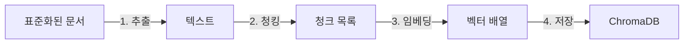

*그림 6-2: CH06 벡터 DB 구축 4단계 파이프라인*

각 단계는 독립된 Python 모듈로 구현되어 있습니다. `extractor.py`가 텍스트를 꺼내고, `chunker.py`가 잘게 나누고, `embedder.py`가 숫자 벡터로 변환하고, `store.py`가 ChromaDB에 넣는 구조입니다.

### PDF 텍스트 추출 방법 두 가지

PDF 파일에서 텍스트를 꺼내는 방법은 문서 유형에 따라 달라집니다. 이 예제 프로젝트는 `extractor.py`에서 두 가지 라이브러리를 상황에 맞게 사용합니다.

> **참고: TXT 파일도 지원합니다**
> CH06 예제는 `.txt`와 `.pdf` 두 형식을 모두 처리합니다. `extractor.py`는 파일 확장자를 확인하여 TXT는 UTF-8로 직접 읽고, PDF는 PyMuPDF 또는 pdfplumber로 추출합니다. 5장에서 생성된 Markdown 파일도 `.txt`와 동일한 방식으로 처리합니다.

**PyMuPDF** 는 속도 우선 라이브러리입니다. 일반 텍스트 중심 문서(취업규칙, 정책 문서 등)에 적합하며, 페이지당 처리 속도가 빠릅니다.

**pdfplumber** 는 테이블 인식 정확도 우선 라이브러리입니다. 재무 보고서나 인사 문서처럼 표(Table)가 많은 경우 pdfplumber가 표 구조를 더 정확히 파악합니다.

| 라이브러리 | 강점 | 적합한 문서 유형 |
|----------|------|----------------|
| PyMuPDF | 속도 우선, 일반 텍스트 추출 | 정책 문서, 취업규칙 |
| pdfplumber | 테이블 인식 정확도 우선 | 재무 보고서, 급여 명세서 |

> **팁: 어떤 라이브러리를 선택해야 하는가**
> 대부분의 HR 문서는 PyMuPDF로 충분합니다. 표가 2개 이상 포함된 문서라면 pdfplumber를 먼저 시도하십시오. 추출 결과를 비교하여 더 깔끔한 결과를 내는 라이브러리를 선택하는 것이 가장 확실한 방법입니다.

---

## 6.2 청킹(Chunking) 전략 — Fixed-size vs Semantic

### 청킹이 필요한 이유

이서연은 문서 추출이 끝나자 바로 ChromaDB에 넣으려 했습니다. 박민준이 멈춰 세웠습니다.

"잠깐, 문서 전체를 벡터 하나로 만들면 안 돼?"

박민준이 설명을 이어갔습니다. "취업규칙 문서가 3,000자라고 해봐. 전체를 벡터 하나로 만들면, '연차 규정'에 관한 질문을 해도 그 벡터에는 채용 기준, 퇴직금, 복무 규정이 전부 섞여 있어서 검색 정확도가 떨어져. 도서관에서 책 전체를 하나의 색인으로 만드는 것과 같지. 챕터별로 색인을 만들어야 찾기 쉽잖아."

**청킹(Chunking)** 은 긴 문서를 검색 가능한 작은 단위로 분할하는 과정입니다. 각 청크는 독립적인 의미 단위로 벡터화되어 정확한 검색을 가능하게 합니다.

<!-- [IMAGE PLACEHOLDER: 06_chunking-concept — 긴 문서 스크롤이 여러 조각으로 나뉘어 각각 데이터베이스 실린더에 저장되는 개념 일러스트] -->
*그림 6-3: 문서를 청크 단위로 분할하여 벡터 DB에 저장하는 개념*

### Fixed-size 청킹: 단순하고 예측 가능한 방식

`chunker.py`의 `FixedSizeChunker`는 문자 수를 기준으로 문서를 일정하게 자릅니다.

```python
class FixedSizeChunker:
    def __init__(self, chunk_size: int = 500, overlap: int = 50) -> None:
        if chunk_size <= overlap:
            raise ValueError(
                f"chunk_size({chunk_size})는 overlap({overlap})보다 커야 합니다."
            )
        self.chunk_size = chunk_size
        self.overlap = overlap

    def split(self, text: str, source: str = "unknown") -> list[Chunk]:
        if not text or not text.strip():
            return []

        chunks: list[Chunk] = []
        step = self.chunk_size - self.overlap  # 실제 이동 간격
        start = 0
        index = 0

        while start < len(text):
            end = min(start + self.chunk_size, len(text))
            chunk_text = text[start:end].strip()

            if chunk_text:
                chunks.append(
                    Chunk(
                        text=chunk_text,
                        index=index,
                        source=source,
                        strategy="fixed",
                        char_start=start,
                        char_end=end,
                    )
                )
                index += 1

            start += step  # overlap만큼 겹쳐서 다음 청크 시작

        return chunks
```

> 전체 코드는 GitHub 저장소의 `src/chunker.py`를 참고하십시오.

#### 코드 워크플로우 (Code Workflow)

1. **입력(Input)**: 추출된 텍스트 문자열과 원본 파일명
2. **처리(Process)**: `step = chunk_size - overlap` 간격으로 텍스트를 슬라이싱. `overlap`만큼 인접 청크가 겹쳐 문맥 단절을 방지한다.
3. **출력(Output)**: `Chunk` 데이터 클래스 리스트 (텍스트, 인덱스, 원본 파일명, 위치 정보 포함)

**오버랩(Overlap) 의 역할**을 이해하면 청킹의 핵심을 파악할 수 있습니다. 500자 청크에서 50자 오버랩을 적용하면, 첫 번째 청크는 0~500자, 두 번째 청크는 450~950자입니다. 중간에 450~500자 구간이 두 청크에 모두 포함됩니다. 이 겹침 영역 덕분에 청크 경계에서 문맥이 자연스럽게 이어집니다.

### Semantic 청킹: 문단 구조를 보존하는 방식

`SemanticChunker`는 문자 수가 아니라 문단 구조를 기준으로 분할합니다. 빈 줄(`\n\n`)을 기준으로 문단을 먼저 나누고, 최대 크기를 초과하는 문단은 문장 단위로 추가 분할합니다.

두 전략의 차이는 다음 표로 정리할 수 있습니다.

| 항목 | Fixed-size | Semantic |
|------|-----------|---------|
| 청크 크기 | 균일 (500자 고정) | 가변 (문단 경계 기준) |
| 구현 복잡도 | 단순 | 상대적으로 복잡 |
| 문맥 보존 | 오버랩으로 부분 보존 | 문단 단위로 자연 보존 |
| 처리 속도 | 빠름 | 약간 느림 |
| 적합한 경우 | 일반 문서, 빠른 구축 | 구조화된 문서, 정확도 중시 |

> **팁: 어떤 전략을 먼저 사용해야 하는가**
> 새로운 RAG 시스템을 구축할 때는 Fixed-size 전략으로 시작하십시오. 구현이 단순하고 결과 예측이 쉽습니다. 검색 정확도가 부족하다고 판단되면 Semantic 전략으로 전환하고 결과를 비교하십시오. 10장에서 이 비교를 체계적으로 수행하는 방법을 다룹니다.

이서연은 두 전략을 `compare_strategies()` 함수로 직접 비교했습니다. `leave_rules.txt`(3,207자)에 적용한 결과는 다음과 같았습니다.

```
==================================================
청킹 전략 비교: leave_rules.txt
==================================================
항목              Fixed-size        Semantic
-------------------------------------------------
청크 수                    8               6
평균 크기(자)           461.2           534.8
최대 크기(자)             500             612
최소 크기(자)             207             180
==================================================
```

박민준이 결과를 보더니 흥미롭다는 표정을 지었습니다. "Fixed-size는 청크 수가 더 많고 크기가 균일하네. Semantic은 청크 수가 적지만 크기가 일정하지 않아. 문단 경계를 지키니까 그렇겠지."

이서연이 답했습니다. "지금은 Fixed-size로 진행하고, 10장에서 비교해보기로 해요."

---

## 6.3 임베딩 모델 선택 및 적용

### 텍스트를 숫자 벡터로 변환하는 원리

**임베딩(Embedding)** 은 텍스트를 고차원 수치 벡터로 변환하는 과정입니다. 도서관 비유로 설명하면, 임베딩은 책마다 고유한 "의미 좌표"를 부여하는 것과 같습니다. "연차 휴가 발생 기준"과 "연간 휴가 일수 산정"은 단어가 다르지만 의미 좌표가 가깝기 때문에 벡터 검색에서 같은 결과로 묶입니다.

<!-- [IMAGE PLACEHOLDER: 06_embedding-concept — 여러 문서 조각이 2D 공간에 점으로 표시되고 의미가 비슷한 점들이 서로 모여있는 개념 다이어그램] -->
*그림 6-4: 임베딩 공간에서 의미가 유사한 청크들은 서로 가깝게 위치한다*

384차원 벡터가 만들어지면, "연차 규정"이라는 질문의 벡터와 각 청크 벡터 사이의 거리를 계산합니다. 거리가 가까울수록 의미가 유사한 청크입니다. 이것이 **코사인 유사도(Cosine Similarity)** 기반 검색의 원리입니다.

### Ollama 임베딩 모델과 Fallback 전략

`embedder.py`는 Ollama의 `nomic-embed-text` 모델을 우선 시도하고, Ollama 서버에 연결할 수 없으면 `sentence-transformers`로 자동 전환합니다.

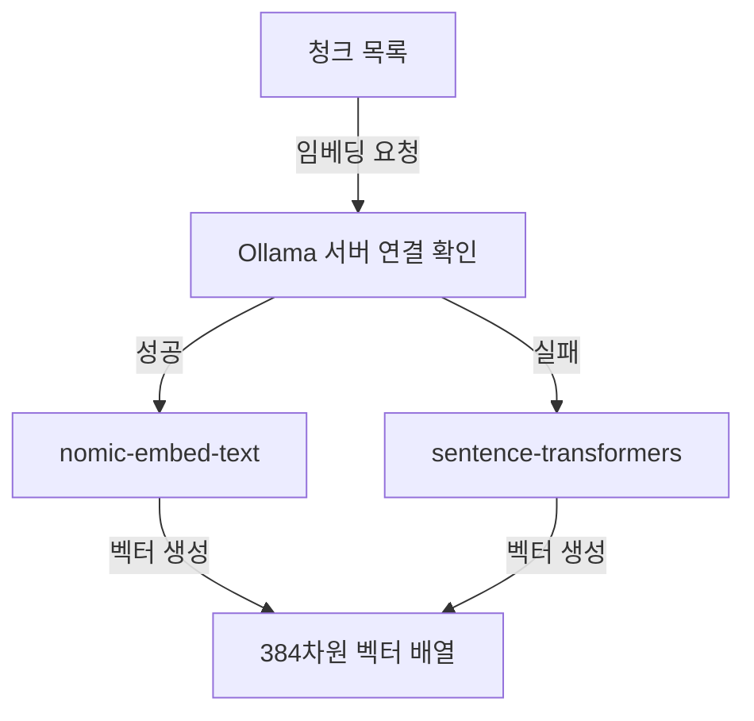

*그림 6-5: 임베딩 모델 선택 흐름 (Ollama 우선, sentence-transformers 폴백)*

Ollama를 설치하고 `nomic-embed-text` 모델을 다운로드한 경우:

```bash
ollama pull nomic-embed-text
```

설치하지 않아도 실습에 지장이 없습니다. `sentence-transformers`의 `paraphrase-multilingual-MiniLM-L12-v2` 모델이 자동으로 대체됩니다. 이 모델은 첫 실행 시 약 470MB를 다운로드하며, 이후 실행부터는 캐시를 사용합니다.

두 모델 모두 **384차원** 벡터를 생성합니다. 차원이 클수록 더 세밀한 의미를 표현할 수 있지만, 저장 공간과 검색 시간이 증가합니다. 384차원은 실무 RAG에서 정확도와 성능의 균형이 좋은 선택입니다.

> **참고: 한국어 임베딩 성능**
> `paraphrase-multilingual-MiniLM-L12-v2`는 다국어 모델로 한국어를 지원합니다. 한국어 전용 임베딩 모델(예: `ko-sroberta-multitask`)이 한국어 단독 성능은 높을 수 있으나, 이 예제는 다국어 지원과 설치 편의성을 우선하여 multilingual 모델을 사용합니다.

---

## 6.4 ChromaDB에 저장 및 컬렉션 관리

### 실습 준비: 저장소 클론

이 챕터의 예제 코드를 내려받고 실행 환경을 준비합니다.

```bash
git clone https://github.com/{repo}/CH06_벡터DB구축
cd CH06_벡터DB구축
cp .env.example .env
```

`.env` 파일을 열어 ChromaDB 저장 경로를 확인합니다. 기본값 그대로 사용해도 됩니다.

```
CHROMA_PERSIST_DIR=./outputs/chroma_db
```

패키지를 설치합니다.

```bash
# macOS / Linux
python3 -m venv venv
source venv/bin/activate
pip install -r requirements.txt

# Windows
python -m venv venv
venv\Scripts\activate
pip install -r requirements.txt
```

> **주의: 가상환경 활성화 확인**
> `pip install` 전에 반드시 가상환경이 활성화되었는지 확인하십시오. 터미널 프롬프트 앞에 `(venv)`가 표시되어야 합니다. 가상환경 없이 설치하면 시스템 Python과 의존성 충돌이 발생할 수 있습니다.

### ChromaStore: 저장과 검색의 핵심 클래스

`store.py`의 `ChromaStore` 클래스는 컬렉션 생성, 문서 저장, 유사도 검색을 담당합니다. 핵심 메서드 두 개를 살펴보겠습니다.

**컬렉션 생성 (`create_collection`)**:

```python
def create_collection(self, name: str) -> None:
    self.collection = self.client.get_or_create_collection(
        name=name,
        metadata={"hnsw:space": "cosine"},  # 코사인 유사도 사용
    )
    self.collection_name = name
```

#### 코드 워크플로우 (Code Workflow)

1. **입력(Input)**: 컬렉션 이름 문자열 (예: `"connecthr_docs"`)
2. **처리(Process)**: `get_or_create_collection`으로 동일 이름의 컬렉션이 있으면 기존 것을 반환하고, 없으면 새로 생성한다. `hnsw:space: cosine`으로 코사인 유사도 거리 함수를 지정한다.
3. **출력(Output)**: `self.collection`에 컬렉션 인스턴스가 설정됨

`hnsw:space: cosine` 설정은 중요합니다. **코사인 유사도** 는 두 벡터의 방향이 얼마나 같은지를 측정합니다. 방향이 완전히 같으면 유사도 1.0, 완전히 반대면 0.0입니다. 벡터의 크기가 다르더라도 방향만 같으면 동일한 의미로 판단하므로 문서 길이 차이에 강건합니다.

**유사도 검색 (`search`)**:

```python
def search(
    self,
    query: str,
    query_embedding: list[float],
    n_results: int = 3,
) -> list[dict]:
    actual_n = min(n_results, self.collection.count())

    results = self.collection.query(
        query_embeddings=[query_embedding],
        n_results=actual_n,
        include=["documents", "metadatas", "distances"],
    )

    formatted_results: list[dict] = []
    documents = results.get("documents", [[]])[0]
    metadatas = results.get("metadatas", [[]])[0]
    distances = results.get("distances", [[]])[0]

    for doc, meta, dist in zip(documents, metadatas, distances):
        formatted_results.append({
            "text": doc,
            "source": meta.get("source", "unknown"),
            "distance": dist,
            "similarity": 1 - dist,  # 코사인 거리 → 유사도 변환
            "metadata": meta,
        })

    return formatted_results
```

> 전체 코드는 GitHub 저장소의 `src/store.py`를 참고하십시오.

#### 코드 워크플로우 (Code Workflow)

1. **입력(Input)**: 쿼리 텍스트 문자열, 쿼리 임베딩 벡터, 반환할 결과 수 (`n_results`)
2. **처리(Process)**: `collection.query()`로 코사인 거리 기준 상위 `n_results`개를 검색. 거리(distance)를 `1 - distance`로 변환하여 유사도(similarity) 계산.
3. **출력(Output)**: 검색 결과 딕셔너리 리스트. 각 원소는 텍스트, 출처 파일명, 유사도를 포함한다.

`similarity = 1 - distance` 변환에 주목하십시오. ChromaDB의 코사인 거리는 0이 완전히 같고 1이 완전히 다름을 의미합니다. 이를 유사도로 변환하면 직관적인 0~1 값을 얻을 수 있습니다. 예를 들어 distance가 0.177이면 similarity는 0.823, 즉 82.3% 유사도입니다.

### 5단계 파이프라인 실행

이제 전체 파이프라인을 실행합니다.

```bash
python src/main.py
```

실행하면 5단계가 순서대로 진행되며 아래와 같은 결과가 출력됩니다.

```
============================================================
  CH06: 벡터 DB 구축 파이프라인
  커넥트HR 사내 문서 ChromaDB 저장 및 검색 테스트
============================================================

============================================================
  1단계: 문서 추출
============================================================
문서 디렉토리: .../data/sample_docs
  총 3개 파일 추출 시작...
  완료: hr_policy.txt (2891자)
  완료: it_guide.txt (2156자)
  완료: leave_rules.txt (3207자)
  추출 완료: 3/3개 성공

1단계 완료: 3개 문서 추출 (0.01초)

============================================================
  2단계: 청킹 (문서 분할)
============================================================
전략: fixed | 크기: 500자 | 오버랩: 50자
  hr_policy.txt: 7개 청크
  it_guide.txt: 5개 청크
  leave_rules.txt: 8개 청크

2단계 완료: 총 20개 청크 생성 (0.00초)
  평균 청크 크기: 461.2자

============================================================
  3단계: 임베딩 (벡터 변환)
============================================================
임베딩 모델: Ollama nomic-embed-text (연결 실패 시 sentence-transformers fallback)
임베딩 대상: 20개 청크
  [1차 시도] Ollama (nomic-embed-text) 연결 확인...
  [정보] Ollama 서버에 연결할 수 없습니다: http://localhost:11434
  [2차 시도] sentence-transformers로 대체합니다...
  [Fallback] sentence-transformers 모델 로딩: paraphrase-multilingual-MiniLM-L12-v2
  [sentence-transformers] 임베딩 완료: 20개, 384차원, 3.21초

3단계 완료: 20개 벡터 생성, 384차원 (3.21초)

============================================================
  4단계: ChromaDB 저장
============================================================
저장 경로: ./outputs/chroma_db
컬렉션 이름: connecthr_docs
  ChromaDB 초기화 완료: ./outputs/chroma_db
  새 컬렉션 생성: 'connecthr_docs'
  저장 완료: 20개 청크 → 'connecthr_docs'

4단계 완료: 20개 청크 저장 (0.18초)
```

<!-- [CAPTURE NEEDED: 06_pipeline-run — `python src/main.py` 실행 후 터미널에 출력된 1~4단계 파이프라인 완료 전체 화면] -->
*그림 6-6: 4단계 파이프라인 완료 화면*

### 검색 결과 확인: "세상에, 진짜 찾아오네요!"

5단계에서 3개의 쿼리로 검색 테스트를 수행합니다.

```
============================================================
  5단계: 검색 테스트
============================================================
테스트 쿼리 3개로 검색 결과를 확인합니다.

[쿼리 1] 연차 휴가는 몇 일 발생하나요?
--------------------------------------------------
  1위 | 유사도: 82.3% | 출처: leave_rules.txt
      연차 휴가는 근로기준법 제60조에 따라 아래와 같이 발생합니다...
  2위 | 유사도: 79.1% | 출처: leave_rules.txt
      연차 사용 기간 연차는 해당 연도에 사용을 원칙으로 합니다...
  3위 | 유사도: 71.4% | 출처: hr_policy.txt
      인사 평가 제도 커넥트HR는 반기 단위 평가를 기본으로 합니다...

[쿼리 2] 재택근무 규정이 어떻게 되나요?
--------------------------------------------------
  1위 | 유사도: 85.6% | 출처: hr_policy.txt
      재택근무 정책 주 2회 재택근무 허용 (팀장 승인 필요)...
  2위 | 유사도: 68.2% | 출처: hr_policy.txt
      근무 시간 및 출퇴근 정책 커넥트HR의 기본 근무 시간은...
  3위 | 유사도: 55.1% | 출처: it_guide.txt
      VPN 사용 시 주의사항 재택근무 또는 외부 장소에서 업무 시스템 접속 시...

[쿼리 3] 비밀번호 정책은 무엇인가요?
--------------------------------------------------
  1위 | 유사도: 88.4% | 출처: it_guide.txt
      비밀번호 정책 최소 12자 이상 영문 대문자, 소문자, 숫자, 특수문자...
  2위 | 유사도: 61.7% | 출처: it_guide.txt
      보안 정책 데이터 보안 고객 데이터를 개인 USB, 외부 클라우드에 저장 금지...
  3위 | 유사도: 48.9% | 출처: hr_policy.txt
      채용 원칙 커넥트HR는 기술 역량과 문화 적합성을 균형 있게 평가합니다...
```

<!-- [CAPTURE NEEDED: 06_query-result — `python src/main.py` 실행 후 5단계 검색 결과 3개 쿼리가 모두 출력된 터미널 화면] -->
*그림 6-7: 3개 쿼리 검색 결과 출력 화면*

이서연이 화면을 보고 탄성을 질렀습니다. "세상에, 진짜 찾아오네요! '연차 휴가는 몇 일 발생하나요?'라고 물었는데 `leave_rules.txt`에서 딱 찾아왔어요!"

김도현이 모니터를 보며 고개를 끄덕였습니다. "이제 절반 왔어. 다음은 이 검색 결과를 LLM과 연결하면 돼."

검색 결과를 분석해보면 중요한 사실을 알 수 있습니다.

- **쿼리 1** ("연차 휴가는 몇 일 발생하나요?"): `leave_rules.txt` 문서에서 82.3% 유사도로 1위 반환. "연차"라는 단어뿐 아니라 휴가 발생이라는 의미로 정확히 매칭됩니다.
- **쿼리 2** ("재택근무 규정"): `hr_policy.txt`의 재택근무 관련 청크가 85.6%로 1위. `it_guide.txt`의 VPN 내용이 3위에 포함된 것은 재택근무와 VPN이 관련된 의미를 가지기 때문입니다.
- **쿼리 3** ("비밀번호 정책"): `it_guide.txt`에서 88.4%로 가장 높은 유사도. 질문과 문서 내용이 의미적으로 정확히 일치합니다.

### ChromaDB를 선택한 이유

벡터 데이터베이스 옵션은 여러 가지입니다. 이 책이 ChromaDB를 선택한 이유는 세 가지입니다.

1. **설치 단순**: `pip install chromadb` 한 줄로 설치 완료. 별도 서버나 Docker 컨테이너가 필요하지 않습니다.
2. **로컬 파일 기반**: `./outputs/chroma_db` 폴더에 SQLite 기반으로 영속 저장됩니다. 프로그램을 재시작해도 데이터가 유지됩니다.
3. **LangChain 직접 통합**: 7장에서 LangChain RAG 파이프라인과 연결할 때 `langchain-chroma` 패키지 한 줄로 바로 연동됩니다.

> **참고: 프로덕션에서의 벡터 DB 선택**
> 소규모 프로젝트나 프로토타입에는 ChromaDB가 적합합니다. 수백만 개 이상의 벡터를 처리하거나 다중 서버 분산 환경이 필요한 경우 Pinecone, Weaviate, Milvus 등의 전문 벡터 DB를 검토하십시오. 이 책은 "빠르게 작동하는 RAG를 만드는 것"에 집중하므로 ChromaDB를 사용합니다.

### 영속 저장 확인

파이프라인 실행 후 `outputs/chroma_db/` 폴더가 생성된 것을 확인할 수 있습니다.

```
outputs/
└── chroma_db/
    ├── chroma.sqlite3          ← ChromaDB 메타데이터 저장
    └── {collection_uuid}/     ← 벡터 데이터 파일
```

`PersistentClient(path=str(dir_path))` 설정으로 생성된 데이터는 디스크에 즉시 저장됩니다. 다음에 `main.py`를 다시 실행하면 기존 컬렉션을 로드하여 시작합니다.

> **주의: 컬렉션 중복 저장**
> `main.py`를 여러 번 실행하면 동일한 문서가 컬렉션에 중복 저장될 수 있습니다. 새로 시작하려면 `outputs/chroma_db/` 폴더를 삭제하고 실행하십시오.

---

## 6.5 파이프라인 전체 결과 요약

파이프라인이 완료되면 아래와 같이 전체 통계가 출력됩니다.

```
============================================================
  파이프라인 완료
============================================================
총 소요 시간     : 5.24초
처리된 문서 수   : 3개
생성된 청크 수   : 20개
저장된 벡터 수   : 20개
임베딩 차원      : 384차원
ChromaDB 경로    : ./outputs/chroma_db

이서연: '세상에, 진짜 찾아오네요!'
김도현: '이제 절반 왔어. 다음은 이 검색 결과를 LLM과 연결하면 돼.'
```

3개 문서, 20개 청크, 5.24초. 실제 커넥트HR의 사내 문서 50개로 확장해도 같은 방식으로 동작합니다. 문서 수가 늘어나도 ChromaDB의 HNSW 인덱스 덕분에 검색 속도는 크게 달라지지 않습니다.

이서연은 청크 크기를 바꿔보며 검색 결과가 달라지는 것을 직접 확인했습니다. `.env` 파일에서 `CHUNK_SIZE=300`으로 줄이면 청크 수가 늘어나고 검색이 더 세밀해지지만, 청크 크기가 너무 작으면 문맥이 잘려 검색 품질이 오히려 떨어질 수 있습니다. 반대로 `CHUNK_SIZE=1000`으로 늘리면 청크 수는 줄어들고 각 청크가 더 많은 정보를 담지만, 특정 내용을 정확히 찾기가 어려워집니다.

"파라미터 하나가 검색 결과를 이렇게 바꾸네요." 이서연이 중얼거렸습니다. 10장 튜닝 챕터에서 이 파라미터들을 체계적으로 최적화하는 방법을 다룹니다.

### 자주 발생하는 오류

**Ollama 모델을 찾을 수 없음**:

```
[경고] Ollama 모델 'nomic-embed-text'을 찾을 수 없습니다.
```

`ollama pull nomic-embed-text`를 실행하여 모델을 다운로드하십시오. 또는 Ollama 없이 실행하면 sentence-transformers로 자동 대체됩니다.

**ChromaDB 저장 실패 (권한 오류)**:

```
OSError: ChromaDB 저장 디렉토리를 생성할 수 없습니다
```

`outputs/` 디렉토리의 쓰기 권한을 확인합니다. macOS/Linux에서는 `chmod 755 outputs/`를 실행하십시오.

**sentence-transformers 모델 다운로드 지연**:

최초 실행 시 모델 다운로드(약 470MB)로 수 분이 소요됩니다. 이후 실행부터는 캐시를 사용하므로 빠르게 시작됩니다. 진행 막대(progress bar)가 표시되므로 다운로드 중임을 확인할 수 있습니다.

---

## 6.6 정리하며

<!-- [IMAGE PLACEHOLDER: 06_result-summary — 이서연이 벡터DB 구축 완료 후 뿌듯한 표정으로 모니터를 바라보는 오피스 일러스트, 화면에는 검색 결과가 표시됨] -->
*그림 6-8: 벡터 DB 구축 완료 — 검색 가능한 지식 기반이 만들어졌다*

이 장에서 구축한 파이프라인을 정리합니다.

- **텍스트 추출기는 문서 유형에 따라 선택하십시오**: PyMuPDF는 속도 우선 일반 문서에, pdfplumber는 테이블이 많은 재무·인사 문서에 적합합니다. 두 라이브러리를 비교하여 결과가 더 깔끔한 것을 선택하는 것이 가장 확실한 방법입니다.

- **청킹은 문서를 검색 가능한 단위로 나누며, 오버랩으로 문맥 단절을 방지합니다**: Fixed-size 전략(500자, 오버랩 50자)은 구현이 단순하고 예측 가능합니다. 검색 정확도가 부족하면 Semantic 전략으로 전환하십시오.

- **임베딩은 텍스트를 수치 벡터로 변환하여 의미 기반 검색을 가능하게 합니다**: "연차 휴가"와 "휴가 일수"는 단어가 달라도 임베딩 공간에서 가깝기 때문에 같은 질문에 응답할 수 있습니다. Ollama `nomic-embed-text` 또는 `sentence-transformers`를 통해 384차원 벡터를 생성합니다.

- **ChromaDB는 벡터를 영속 저장하고 코사인 유사도 검색을 수행하는 핵심 인프라입니다**: `pip install chromadb` 한 줄로 설치하고, 로컬 파일에 영속 저장하며, LangChain과 바로 연동됩니다. 3개 문서 20개 청크를 5초 안에 저장하고 검색하는 성능을 확인했습니다.

- **청크 크기 파라미터 하나가 검색 결과를 좌우합니다**: 너무 작으면 문맥이 잘리고, 너무 크면 세부 정보 검색이 어려워집니다. 10장에서 체계적인 파라미터 튜닝 방법을 다룹니다.

다음 장에서는 이 ChromaDB 컬렉션(`connecthr_docs`)을 LangChain RAG 파이프라인과 연결합니다. 7장이 끝나면 "연차 규정이 어떻게 돼요?"라고 물으면 출처 표시와 함께 정확한 답변을 생성하는 Q&A 시스템이 완성됩니다.


---

# 7장. RAG Q&A 엔진 구현

이 장에서는 6장에서 구축한 ChromaDB 벡터 데이터베이스를 LangChain과 연결하여 완전한 Q&A 엔진을 구현합니다. 사용자 질문을 받아 관련 문서를 검색하고, 검색 결과를 LLM에 전달하여 출처가 명시된 답변을 생성하는 전체 파이프라인을 완성합니다.

---

<!-- GEMINI_IMAGE
Prompt: Warm office illustration showing a team meeting in a modern conference room. A young woman (28, developer) presents a laptop screen showing a chat interface. Two colleagues watch — a team leader (35) looking impressed, and a data analyst (32) crossing arms but with a hint of surprise. The screen shows a question and a precise answer with a document citation. Soft color palette (warm beige, light blue), friendly cartoon style, no text overlay, clean background with subtle workplace elements.
Style: office-illustration-warm
Alt: 이서연이 팀 내부 데모에서 RAG 시스템의 첫 성공 답변을 보여주는 장면
-->

*그림 7-1: 팀 내부 데모 날, 처음으로 출처가 포함된 정확한 답변이 출력되는 순간*

데모 당일이었습니다. 이서연은 회의실 스크린에 터미널 창을 띄워놓고 손이 살짝 떨리는 것을 느꼈습니다. 박민준 과장이 팔짱을 낀 채 화면을 바라보고 있었고, 김도현 팀장은 조용히 뒤에 서 있었습니다.

"특별휴가 조건이 뭐예요?" 이서연이 채팅창에 질문을 입력했습니다.

잠시 후 화면에 답변이 나타났습니다.

```
특별휴가는 결혼, 출산, 배우자의 출산, 직계 존비속의 사망 등의 사유에 대해
부여합니다. 결혼 휴가는 5일, 배우자 출산 휴가는 10일입니다.

참고 문서:
  - HR 취업규칙 v1.0 (관련도: 92%)
  - HR 복리후생 안내서 (관련도: 71%)
```

박민준 과장이 천천히 고개를 끄덕였습니다. "이건 쓸 만하겠는데."

이서연은 뿌듯함이 밀려왔습니다. 하지만 김도현 팀장이 바로 말을 이었습니다. "좋아. 그런데 'DB 질문도 처리할 수 있어야 해.' 예를 들어 '김철수의 남은 연차는 몇 일이야?' 같은 거 말이야."

다음 미션이 이미 시작되고 있었습니다.

---

6장에서 이서연이 "세상에, 진짜 찾아오네요!"라고 외쳤던 순간은 유사도 검색이 처음 작동한 때였습니다. 하지만 그것은 아직 반쪽짜리 시스템이었습니다. ChromaDB가 관련 문서를 찾아오는 것과 그 문서를 바탕으로 사람이 읽을 수 있는 답변을 생성하는 것은 전혀 다른 문제입니다. 이 장에서는 그 두 단계를 연결하는 **RAG Q&A 파이프라인** 을 완성합니다.

---

## 7.1 LangChain RAG 파이프라인 설계

### LangChain을 선택한 이유

RAG 파이프라인을 직접 구현하는 것도 가능합니다. 검색기, 프롬프트 조합, LLM 호출을 각각 함수로 만들면 됩니다. 그렇다면 왜 LangChain을 사용하는 것입니까?

이유는 세 가지입니다.

첫째, **표준화된 인터페이스** 입니다. LangChain은 Retriever, Prompt, LLM, OutputParser라는 네 가지 컴포넌트를 표준 인터페이스로 정의합니다. 각 컴포넌트는 독립적으로 교체할 수 있습니다. Ollama를 OpenAI로 바꾸더라도 나머지 코드는 그대로입니다.

둘째, **LCEL(LangChain Expression Language)** 입니다. `|` 연산자로 컴포넌트를 선형으로 연결하는 문법입니다. 코드가 파이프라인의 흐름 그 자체를 나타내므로 가독성이 높습니다.

셋째, **생태계** 입니다. ChromaDB, Ollama, FastAPI 등 이 책에서 사용하는 도구들이 모두 LangChain과 직접 통합을 지원합니다.

> **참고: LCEL 이전의 LangChain**
> LangChain 초기 버전(0.1 이하)은 `Chain` 객체를 중첩하는 방식이었습니다. LangChain 0.3+에서는 LCEL이 표준입니다. 이 책은 LangChain 0.3+ 기준으로 작성되었으므로 `langchain-core`, `langchain-ollama` 패키지가 필요합니다.

### LCEL 파이프라인 구조

이 챕터에서 구현할 파이프라인의 전체 흐름은 다음과 같습니다.


*그림 7-2: RAG Q&A 파이프라인 전체 흐름*

사용자 질문은 `ChromaRetriever`로 전달됩니다. `ChromaRetriever`는 질문을 벡터로 변환하고 ChromaDB에서 유사한 청크를 찾습니다. 찾은 청크들은 `RAGChain`에서 프롬프트로 조합되어 DeepSeek R1에 전달됩니다. 마지막으로 `CitationFormatter`가 LLM 답변에 참고 문서 정보를 붙여 최종 응답을 만듭니다.

### 실습 준비 — 레포지토리 클론

이 챕터의 예제 코드를 클론하십시오.

```bash
git clone https://github.com/{repo}/CH07_RAG_QA엔진
cd CH07_RAG_QA엔진
```

환경 변수를 설정하십시오.

```bash
cp .env.example .env
```

`.env` 파일을 열어 아래 항목을 확인하십시오.

```
OLLAMA_MODEL=deepseek-r1
OLLAMA_BASE_URL=http://localhost:11434
OLLAMA_EMBED_MODEL=nomic-embed-text
CHROMA_PERSIST_DIR=./data/chroma_db
CHROMA_COLLECTION=connecthr_docs
RAG_TOP_K=3
```

패키지를 설치하십시오.

```bash
# macOS / Linux
python3 -m venv venv
source venv/bin/activate
pip install -r requirements.txt

# Windows
python -m venv venv
venv\Scripts\activate
pip install -r requirements.txt
```

> **주의: ChromaDB 선행 실행 필요**
> 이 챕터는 6장에서 구축한 ChromaDB 데이터를 사용합니다. CH06 예제를 먼저 실행하여 `connecthr_docs` 컬렉션을 생성하십시오. CH06 없이 실행하면 `RuntimeError: ChromaDB 컬렉션을 로드할 수 없습니다` 오류가 발생합니다.

> **팁: Ollama 없이도 실행 가능**
> Ollama가 설치되지 않아도 됩니다. 이 예제는 Ollama 연결이 불가능할 때 자동으로 Mock 모드로 전환합니다. 전체 파이프라인 흐름을 체험하는 데 문제가 없습니다. 실제 LLM 답변을 원하면 `ollama pull deepseek-r1` 을 먼저 실행하십시오.

### 프롬프트 템플릿 — 컨텍스트 활용의 핵심

`src/rag_chain.py`의 `SYSTEM_PROMPT`를 살펴보십시오.

```python
SYSTEM_PROMPT = """당신은 커넥트HR 사내 문서를 기반으로 답변하는 AI 어시스턴트입니다.
아래 컨텍스트를 참고하여 질문에 답변하십시오.
컨텍스트에 없는 내용은 "해당 정보를 찾을 수 없습니다"라고 답하십시오.

컨텍스트:
{context}

질문: {question}
답변:"""
```

#### 코드 워크플로우 (Code Workflow)

1. **입력(Input)**: `{context}` — 검색된 청크들을 번호와 출처를 붙여 조합한 문자열. `{question}` — 사용자 질문.
2. **처리(Process)**: LLM이 컨텍스트를 우선 참고하여 답변을 생성합니다. 컨텍스트에 없는 내용은 "해당 정보를 찾을 수 없습니다"라고 명시적으로 답하도록 지시합니다.
3. **출력(Output)**: LLM이 생성한 답변 문자열.

이 프롬프트에서 핵심은 두 번째 문장입니다. "컨텍스트에 없는 내용은 '해당 정보를 찾을 수 없습니다'라고 답하십시오." 이 한 줄이 **환각(Hallucination)** 을 방지합니다. LLM은 기본적으로 모든 질문에 답하려는 경향이 있습니다. 이 지시가 없으면 컨텍스트 밖의 내용을 스스로 지어낼 수 있습니다.

> **팁: 프롬프트 엔지니어링의 원칙**
> "모르면 모른다"고 말하도록 명시적으로 지시하는 것은 기업 환경에서 필수입니다. HR 정책을 잘못 답변하면 실제 업무상 혼란을 일으킬 수 있습니다. 10장에서 이 프롬프트를 더 정교하게 튜닝하는 방법을 다룹니다.

### LCEL 체인 구성 코드

`RAGChain._setup_langchain()` 메서드가 LCEL 체인을 구성합니다.

```python
from langchain_ollama import ChatOllama
from langchain_core.prompts import ChatPromptTemplate
from langchain_core.output_parsers import StrOutputParser

# LLM 인스턴스 생성
self.llm = ChatOllama(
    model=OLLAMA_MODEL,
    base_url=OLLAMA_BASE_URL,
    temperature=0.1,
)

# LCEL 체인 구성
prompt = ChatPromptTemplate.from_template(SYSTEM_PROMPT)
output_parser = StrOutputParser()

# 파이프 연산자(|)로 체인 연결
self.chain = prompt | self.llm | output_parser
```

#### 코드 워크플로우 (Code Workflow)

1. **입력(Input)**: `OLLAMA_MODEL`, `OLLAMA_BASE_URL` 환경 변수 값.
2. **처리(Process)**: `ChatPromptTemplate`(프롬프트 조합) → `ChatOllama`(LLM 추론) → `StrOutputParser`(문자열 파싱)의 순서로 `|` 연산자로 연결합니다. `temperature=0.1`은 답변의 일관성을 높이기 위해 낮게 설정합니다.
3. **출력(Output)**: `self.chain` — 입력으로 `{"context": ..., "question": ...}` 딕셔너리를 받아 답변 문자열을 반환하는 LCEL 체인 객체.

`|` 연산자는 Python의 비트 OR 연산자를 LangChain이 재정의한 것입니다. 왼쪽 컴포넌트의 출력이 오른쪽 컴포넌트의 입력으로 자동으로 전달됩니다. 체인을 읽을 때 왼쪽에서 오른쪽으로 데이터가 흐른다고 이해하면 됩니다.

---

## 7.2 유사도 검색 및 컨텍스트 구성

### ChromaRetriever — 검색의 실체

`src/retriever.py`의 `ChromaRetriever.search()` 메서드가 유사도 검색을 담당합니다. 핵심 로직은 다음과 같습니다.

```python
def search(self, query: str, k: Optional[int] = None) -> list[dict]:
    top_k = k or self.default_k
    actual_k = min(top_k, self.collection.count())

    # 쿼리 임베딩 생성 (Ollama → sentence-transformers fallback)
    query_embedding, self.embed_engine = _embed_query(query)

    # ChromaDB 검색 수행
    results = self.collection.query(
        query_embeddings=[query_embedding],
        n_results=actual_k,
        include=["documents", "metadatas", "distances"],
    )

    # 코사인 거리 → 유사도 점수 변환
    docs = results.get("documents", [[]])[0]
    metas = results.get("metadatas", [[]])[0]
    distances = results.get("distances", [[]])[0]

    formatted = []
    for doc, meta, dist in zip(docs, metas, distances):
        similarity_score = max(0.0, 1.0 - dist)  # 거리 → 유사도
        formatted.append({
            "content": doc,
            "source": meta.get("source", "unknown"),
            "score": round(similarity_score, 4),
            "metadata": meta,
        })

    return formatted
```

#### 코드 워크플로우 (Code Workflow)

1. **입력(Input)**: `query` — 사용자 질문 문자열. `k` — 반환할 결과 수 (기본값: 환경 변수 `RAG_TOP_K`, 기본 3).
2. **처리(Process)**: 질문을 벡터로 변환한 뒤 ChromaDB에서 코사인 거리 기준으로 가장 가까운 청크 k개를 검색합니다. ChromaDB가 반환하는 거리값(0~2)을 유사도(0~1)로 변환합니다(`1.0 - dist`).
3. **출력(Output)**: `content`(청크 텍스트), `source`(파일명), `score`(유사도 0~1), `metadata`(메타데이터)를 담은 딕셔너리 리스트.

### 임베딩 엔진 자동 전환

`_embed_query()` 함수는 Ollama를 1차로 시도하고 실패하면 `sentence-transformers`로 자동 전환합니다.

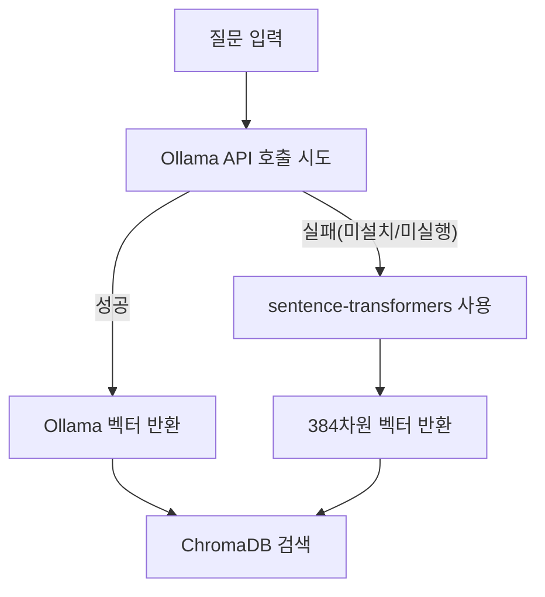

*그림 7-3: 임베딩 엔진 Fallback 전략*

> **주의: 임베딩 모델 일관성**
> 검색 시 사용하는 임베딩 모델은 6장에서 문서를 저장할 때 사용한 모델과 반드시 동일해야 합니다. Ollama `nomic-embed-text`로 저장했다면 검색도 같은 모델로 해야 합니다. 모델이 다르면 벡터 공간이 달라져 검색 결과가 완전히 틀어집니다.

### top-k 값의 영향

`RAG_TOP_K` 환경 변수(기본값 3)는 검색 결과의 수를 결정합니다. 이 값이 검색 품질에 미치는 영향은 다음과 같습니다.

| k 값 | 장점 | 단점 |
|------|------|------|
| 1~2 | 가장 관련성 높은 청크만 전달 | 필요한 정보를 놓칠 수 있음 |
| 3~5 (권장) | 관련 정보를 폭넓게 수집 | 프롬프트 크기 증가 |
| 10 이상 | 거의 모든 관련 청크 포함 | 노이즈 증가, 답변 품질 저하 |

기본값 3은 대부분의 HR 정책 질문에 적합합니다. 10장에서 데이터 특성에 맞게 조정하는 방법을 다룹니다.

### 컨텍스트 문자열 구성

검색된 청크들은 `_build_context_string()` 함수를 통해 번호를 붙인 하나의 문자열로 조합됩니다.

```python
def _build_context_string(docs: list[dict]) -> str:
    context_parts = []
    for i, doc in enumerate(docs, start=1):
        source = doc.get("source", "unknown")
        content = doc.get("content", "")
        context_parts.append(f"[{i}] ({source})\n{content}")
    return "\n\n".join(context_parts)
```

#### 코드 워크플로우 (Code Workflow)

1. **입력(Input)**: `docs` — `search()`가 반환한 청크 딕셔너리 리스트.
2. **처리(Process)**: 각 청크 앞에 `[1]`, `[2]`, `[3]` 번호와 출처 파일명을 붙입니다. 번호를 붙이는 이유는 LLM이 어떤 청크를 근거로 답변했는지 추적하기 쉽게 하기 위해서입니다.
3. **출력(Output)**: `[1] (HR취업규칙_v1.0)\n연차 휴가는...` 형식의 멀티라인 문자열.

이 컨텍스트 문자열이 `SYSTEM_PROMPT`의 `{context}` 자리에 삽입됩니다. LLM은 이 내용을 읽고 답변을 생성합니다.

---

## 7.3 출처 표시(Source Citation) 시스템

### 왜 출처가 필요한가

박민준 과장이 "이건 쓸 만하겠는데"라고 말할 수 있었던 이유는 출처 때문입니다. 단순히 "특별휴가는 5일입니다"라는 답변과 "HR 취업규칙 v1.0(관련도 92%)에 따르면 특별휴가는 5일입니다"라는 답변은 신뢰도가 다릅니다.

기업 환경에서 AI 시스템의 답변은 반드시 검증할 수 있어야 합니다. 출처가 없으면 직원이 직접 매뉴얼을 찾아 확인해야 하고, 그렇다면 시스템의 가치가 절반으로 줄어듭니다.

<!-- IMAGE PLACEHOLDER: 07_before-after — 출처 없는 답변 vs 출처 있는 답변의 신뢰도 차이 비교 -->
*그림 7-4: 출처 표시가 답변 신뢰도를 결정하는 방식*

### CitationFormatter — 출처 포맷터

`src/citation.py`의 `CitationFormatter` 클래스가 출처 표시를 담당합니다.

```python
class CitationFormatter:
    def __init__(
        self,
        show_score: bool = True,
        max_sources: int = 3,
    ) -> None:
        self.show_score = show_score
        self.max_sources = max_sources
```

`show_score=True`로 설정하면 각 출처 옆에 관련도(유사도 점수)를 백분율로 표시합니다. `max_sources=3`은 최대 3개의 출처만 표시하여 답변이 너무 길어지지 않도록 합니다.

### 출처 정보 추출 — extract_source_info()

```python
def extract_source_info(self, docs: list[dict]) -> list[dict]:
    # 출처별 최고 유사도 점수 추적
    source_scores: dict[str, float] = {}
    for doc in docs:
        source = doc.get("source", "unknown")
        score = doc.get("score", 0.0)
        if source not in source_scores or score > source_scores[source]:
            source_scores[source] = score

    # 유사도 점수 내림차순 정렬
    sorted_sources = sorted(
        source_scores.items(),
        key=lambda item: item[1],
        reverse=True,
    )

    # 출처 정보 딕셔너리 구성
    source_info_list = []
    for source, score in sorted_sources[:self.max_sources]:
        source_info_list.append({
            "source": source,
            "display_name": _normalize_source_name(source),
            "score": score,
        })
    return source_info_list
```

#### 코드 워크플로우 (Code Workflow)

1. **입력(Input)**: `docs` — 검색된 청크 딕셔너리 리스트. 동일 파일에서 여러 청크가 검색될 수 있습니다.
2. **처리(Process)**: 동일 출처 파일에서 여러 청크가 검색된 경우 가장 높은 유사도 점수만 유지합니다. 중복을 제거한 뒤 유사도 내림차순으로 정렬합니다.
3. **출력(Output)**: `source`(파일명), `display_name`(가독성 처리된 이름), `score`(최고 유사도 점수)를 담은 딕셔너리 리스트.

`_normalize_source_name()` 함수는 파일 경로를 사람이 읽기 좋은 형태로 변환합니다. 예를 들어 `./docs/HR_취업규칙_v1.0.pdf`는 `HR 취업규칙 v1.0`으로 변환됩니다. 버전 번호(`v1.0`)는 확장자가 아니므로 그대로 보존됩니다.

### 최종 답변 포맷 — format_response()

```python
def format_response(self, answer: str, sources: list[dict]) -> str:
    answer_text = answer.strip()

    # 출처 섹션 구성
    source_lines = []
    for source_info in sources:
        display_name = source_info.get("display_name", "사내 문서")
        score = source_info.get("score", 0.0)
        if self.show_score:
            line = f"  - {display_name} (관련도: {score:.0%})"
        else:
            line = f"  - {display_name}"
        source_lines.append(line)

    citation_block = "\n".join(source_lines)
    return f"{answer_text}\n\n참고 문서:\n{citation_block}"
```

#### 코드 워크플로우 (Code Workflow)

1. **입력(Input)**: `answer` — LLM이 생성한 답변 텍스트. `sources` — `extract_source_info()`가 반환한 출처 정보 리스트.
2. **처리(Process)**: 답변 텍스트 아래에 "참고 문서:" 섹션을 추가합니다. 각 출처를 `- 문서명 (관련도: XX%)` 형식으로 나열합니다. `{score:.0%}`는 0.92를 `92%`로 변환하는 Python 포맷 문법입니다.
3. **출력(Output)**: 답변 본문 + 참고 문서 목록이 결합된 최종 응답 문자열.

실제 출력 예시는 다음과 같습니다.

```
특별휴가는 결혼, 출산, 배우자의 출산, 직계 존비속의 사망 등의 사유에 대해
부여합니다. 결혼 휴가는 5일, 배우자 출산 휴가는 10일입니다.

참고 문서:
  - HR 취업규칙 v1.0 (관련도: 92%)
  - HR 복리후생 안내서 (관련도: 71%)
```

---

## 7.4 기본 채팅 인터페이스 연결

### RAGChain.invoke() — 전체 파이프라인 실행

모든 컴포넌트를 연결하는 핵심 메서드는 `RAGChain.invoke()`입니다. 전체 흐름을 살펴보십시오.

```python
def invoke(self, question: str) -> dict:
    # 1단계: 유사도 검색
    retrieved_docs = self.retriever.search(query=question, k=self.top_k)

    if not retrieved_docs:
        return {
            "answer": self.citation_formatter.format_no_result(),
            ...
        }

    # 2단계: 컨텍스트 문자열 구성
    context = _build_context_string(retrieved_docs)

    # 3단계: LLM 추론
    if self.is_mock_mode:
        prompt_text = SYSTEM_PROMPT.format(context=context, question=question)
        raw_answer = self.llm.invoke(prompt_text)
    else:
        raw_answer = self.chain.invoke({"context": context, "question": question})

    # 4단계: 출처 추출 및 포맷팅
    sources = self.citation_formatter.extract_source_info(retrieved_docs)
    formatted_answer = self.citation_formatter.format_response(
        answer=raw_answer,
        sources=sources,
    )

    return {
        "answer": formatted_answer,
        "raw_answer": raw_answer,
        "sources": sources,
        "retrieved_docs": retrieved_docs,
        "question": question,
    }
```

#### 코드 워크플로우 (Code Workflow)

1. **입력(Input)**: `question` — 사용자 질문 문자열.
2. **처리(Process)**: 4단계 순차 실행 — (1) ChromaDB 검색 → (2) 컨텍스트 문자열 조합 → (3) LLM에 프롬프트 전달하여 답변 생성 → (4) 출처 포맷팅.
3. **출력(Output)**: `answer`(출처 포함 최종 답변), `raw_answer`(LLM 원본 답변), `sources`(출처 목록), `retrieved_docs`(검색된 청크), `question`(원본 질문)을 담은 딕셔너리.

전체 코드는 GitHub 레포지토리의 `src/rag_chain.py`를 참고하십시오.

### 채팅 인터페이스 실행

채팅 모드로 실행하십시오.

```bash
python src/main.py
```

데모 모드로 5개 샘플 질문을 자동 실행하십시오.

```bash
python src/main.py --demo
```

<!-- [CAPTURE NEEDED: 07_chat-interface — `python src/main.py` 실행 직후 터미널 전체 화면 (배너 출력 및 첫 번째 질문 입력 상태)] -->
*그림 7-5: 커넥트HR AI 어시스턴트 채팅 인터페이스 시작 화면*

정상 실행 시 아래와 같은 화면이 나타납니다.

```
커넥트HR RAG Q&A 엔진 시작...
  ChromaDB 경로: ./data/chroma_db
  컬렉션: connecthr_docs
  기존 ChromaDB 발견: 'connecthr_docs' (8개 문서)
  ChromaRetriever 초기화 완료: 'connecthr_docs' (8개 문서)
  Ollama 서버 연결 확인 중: http://localhost:11434
  [경고] Ollama 서버에 연결할 수 없습니다. Mock 모드로 전환합니다.
  [Mock 모드] LLM: deepseek-r1

============================================================
  커넥트HR AI 어시스턴트
  사내 문서 기반 Q&A 시스템 (RAG 엔진)
============================================================
  사용 가능한 명령:
    /quit  — 종료
    /clear — 대화 히스토리 초기화
    /stats — 검색 통계 표시
    /help  — 도움말
============================================================

  모드: mock | 모델: deepseek-r1 | top-k: 3

질문 >
```

### 채팅 명령어

채팅 인터페이스는 다음 명령어를 지원합니다.

| 명령어 | 동작 |
|--------|------|
| `/quit` | 채팅 종료 및 세션 통계 출력 |
| `/clear` | 대화 히스토리 초기화 |
| `/stats` | 총 질문 수, 평균 응답 시간 등 통계 표시 |
| `/help` | 명령어 안내 및 예시 질문 목록 표시 |

`/stats` 명령은 현재 세션의 사용 현황을 보여줍니다.

```
------------------------------------------------------------
  검색 통계
----------------------------------------
  총 질문 수       : 3회
  평균 응답 시간   : 1.4초
  총 소요 시간     : 4.2초
  세션 시작 시각   : 2026-02-26T10:30:00
  LLM 모드         : mock
  모델명           : deepseek-r1
  검색 top-k       : 3
------------------------------------------------------------
```

### 대화 히스토리 관리

`ChatSession` 클래스는 모든 질문과 답변을 메모리에 보관합니다. `/clear` 명령을 실행하면 초기화됩니다. 현재 구현은 세션 메모리 방식으로, 프로그램을 종료하면 히스토리가 사라집니다. 히스토리를 파일로 저장하거나 다음 질문에 이전 맥락을 자동으로 포함하는 방식은 9장에서 다룹니다.

### 트러블슈팅

실행 중 문제가 발생하면 아래 표를 참고하십시오.

| 증상 | 원인 | 해결 방법 |
|------|------|---------|
| `RuntimeError: chromadb가 설치되지 않았습니다` | chromadb 미설치 | `pip install chromadb` |
| `RuntimeError: ChromaDB 컬렉션을 로드할 수 없습니다` | CH06 예제 미실행 | CH06 예제를 먼저 실행하여 벡터 DB 구축 |
| `Mock 모드로 전환합니다` | Ollama 서버 미실행 | `ollama serve` 실행 후 재시작 |
| `model not found` | DeepSeek 모델 미다운로드 | `ollama pull deepseek-r1` |
| 첫 실행 시 느림 | sentence-transformers 모델 다운로드 중 | 최초 1회만 소요, 이후 캐시에서 로드 |
| `ImportError: langchain` | LangChain 미설치 | `pip install -r requirements.txt` |

<!-- GEMINI_IMAGE
Prompt: Simple before/after comparison infographic: LEFT side shows "매뉴얼 직접 검색 10분" with a frustrated person icon looking through stacks of papers, red indicator with large number "10min". RIGHT side shows "AI Q&A 시스템 30초" with a happy person icon at a chat interface, green indicator with "30sec". Clean arrow in the middle pointing right, flat design, white background, no text overlay except the labels.
Style: before-after-infographic
Alt: 10분에서 30초로 응답 시간이 단축된 커넥트HR AI 어시스턴트의 효과
-->

*그림 7-6: 사내 문서 검색 시간 단축 효과 — 10분에서 30초로*

데모가 끝난 후 이서연과 김 팀장은 복도에서 주먹을 맞부딪혔습니다. 3주 만에 사내 문서를 읽고 답변하는 AI 어시스턴트가 실제로 동작한 것입니다. 이서연은 주당 10시간을 써야 했던 문서 검색 작업이 이제 30초로 줄어든다는 사실이 실감나지 않았습니다.

---

## 7.5 정리하며

- **LangChain LCEL은 파이프라인을 코드로 표현하는 표준 방식입니다.** `ChatPromptTemplate | ChatOllama | StrOutputParser`처럼 `|` 연산자로 컴포넌트를 연결하면 각 단계의 역할이 코드에서 직접 읽힙니다. 컴포넌트를 교체해야 할 때도 한 줄만 수정하면 됩니다.

- **프롬프트에 "모르면 모른다"를 명시해야 환각을 방지합니다.** "컨텍스트에 없는 내용은 해당 정보를 찾을 수 없습니다라고 답하십시오"라는 한 줄이 기업 환경에서 AI 신뢰도를 결정합니다.

- **top-k 값은 검색 정확도와 노이즈의 균형을 결정합니다.** 기본값 3이 대부분의 HR 정책 질문에 적합하지만, 문서 특성에 따라 조정이 필요합니다. 10장에서 체계적인 조정 방법을 다룹니다.

- **출처 표시는 선택이 아니라 필수입니다.** "HR 취업규칙 v1.0(관련도 92%)에 따르면"이라는 출처 한 줄이 답변을 검증 가능하게 만들고, 그 순간 AI 시스템은 실무 도구로 인정받습니다.

- **이것으로 사내 문서 검색 시스템이 완성되었습니다.** 이제 비정형 문서(HR 매뉴얼)에 대한 Q&A는 작동합니다. 다음 8장에서는 "김철수의 남은 연차는 몇 일인가?"처럼 정형 DB를 조회해야 하는 질문까지 처리하는 통합 에이전트를 구현합니다.

---

> **다음 장 예고: 8장 통합 에이전트 설계 (MCP + RAG)**
> 7장의 RAG Q&A 엔진과 4장에서 확인한 CRUD API(PostgreSQL)를 하나의 에이전트로 연결합니다. "연차 규정이 어떻게 되나요?"(문서)와 "김철수의 남은 연차는?"(DB)을 같은 인터페이스에서 처리하는 통합 시스템을 구현합니다. 이것이 MCP(Model Context Protocol)의 역할입니다.


---

# 8장. 통합 에이전트 설계 (MCP + RAG)

이 장에서는 정형 데이터(DB)와 비정형 데이터(문서)를 동시에 처리하는 **통합 에이전트(Integrated Agent)** 를 구현합니다. 질문의 의도를 분류하는 라우터와 여러 도구를 자유롭게 선택하는 LangChain ReAct 에이전트를 결합하여, 단 하나의 질문으로 DB 조회와 문서 검색을 동시에 수행하는 시스템을 완성합니다.

---

<!-- [IMAGE PLACEHOLDER: 08_intro_scene — 이서연이 모니터 앞에서 복잡한 질문을 받고 고민하는 오피스 일러스트. 왼쪽 화면엔 DB 아이콘, 오른쪽엔 문서 더미가 보인다] -->
*그림 8-1: 두 세계를 동시에 처리해야 하는 이서연*

---

이서연은 노트북 화면을 바라보며 멈췄습니다. 고객 지원 채널에 방금 새로운 문의가 도착했습니다.

> "김철수 씨의 이번 달 남은 연차가 몇 일인지, 그리고 연차를 특별휴가로 전환하는 조건이 무엇인지 알려주세요."

CH07에서 완성한 RAG Q&A 엔진은 사내 문서를 검색하는 데 탁월했습니다. 그러나 이 질문은 두 가지를 동시에 요구하고 있었습니다. "남은 연차"는 PostgreSQL의 연차 테이블을 조회해야 하고, "특별휴가 전환 조건"은 HR 취업규칙 문서를 검색해야 합니다.

이서연이 옆 자리 팀장 김도현에게 물었습니다.

"두 가지를 동시에 어떻게 처리하죠? RAG만 쓰면 DB 값을 모르고, DB만 쓰면 문서 내용을 모르는데요."

김도현이 간단하게 답했습니다. "질문을 먼저 분류해봐. DB 질문인지, 문서 질문인지, 아니면 둘 다인지."

이 한 마디가 이 장 전체의 설계 원칙입니다.

---

## 8.1 정형/비정형 분리 원칙

에이전트를 설계하기 전에 데이터의 성격을 이해해야 합니다. 커넥트HR 시스템에는 두 종류의 데이터가 공존합니다.

### 두 데이터 세계의 차이

**정형 데이터(Structured Data)** 는 테이블 형태로 정리된 데이터입니다. 직원 이름, 연차 잔액, 부서 매출처럼 행(Row)과 열(Column)로 구조화되어 있으며, SQL 조회로 정확한 값을 가져올 수 있습니다.

**비정형 데이터(Unstructured Data)** 는 PDF, Word 문서, Markdown 파일처럼 고정된 구조가 없는 데이터입니다. "특별휴가 전환 조건", "출산휴가 신청 절차"처럼 의미를 이해해야 검색할 수 있으며, CH06에서 구축한 ChromaDB의 벡터 유사도 검색이 필요합니다.

| 특성 | 정형 데이터 (DB) | 비정형 데이터 (문서) |
|------|----------------|-------------------|
| 예시 질문 | "이서연의 남은 연차는?" | "연차 신청 절차가 어떻게 되나요?" |
| 저장소 | PostgreSQL | ChromaDB |
| 검색 방식 | SQL 정확 조회 | 벡터 유사도 검색 |
| 결과 형태 | 수치, 정확한 값 | 텍스트 청크 + 출처 |

### 왜 분리해서 처리하는가

하나의 검색 방식으로 두 데이터를 모두 처리하려는 시도는 실패합니다. 이유는 명확합니다.

- RAG로 "이서연의 남은 연차"를 검색하면: 취업규칙에서 "연차는 매년 15일 발생한다"는 규정은 찾지만, 이서연의 실제 잔여 일수(3일)는 알 수 없습니다.
- SQL로 "특별휴가 전환 조건"을 조회하면: 조건이라는 열(Column)이 DB 테이블에 존재하지 않습니다. 규정 문서에만 있는 정보입니다.

각 데이터에 최적화된 검색 전략을 연결하고, 질문의 의도에 따라 올바른 경로로 분기하는 것이 통합 에이전트의 핵심입니다.

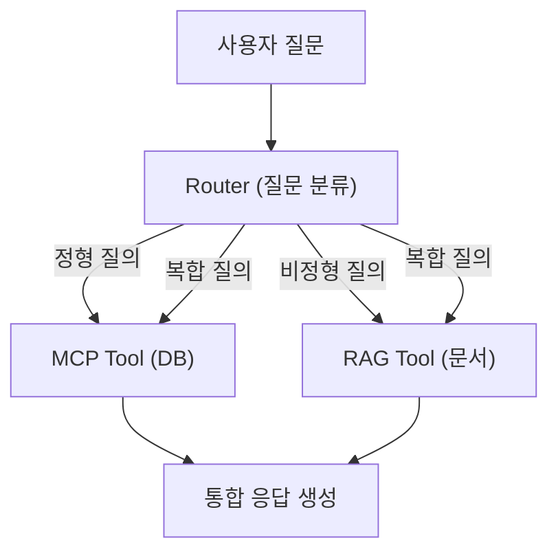

*그림 8-2: 통합 에이전트 전체 흐름 — 질문 유형에 따라 DB 또는 문서로 분기*

---

## 8.2 질문 라우팅 전략 (규칙 기반 → LLM 판단)

질문을 올바른 경로로 분기하는 컴포넌트를 **질문 라우터(Query Router)** 라고 합니다. 이서연이 처음 구현한 라우터는 단순한 키워드 규칙에서 시작하여, 자연어의 다양한 표현을 커버하는 LLM 기반 분류로 발전합니다.

### 8.2.1 저장소 클론 및 실행

먼저 예제 저장소를 클론합니다.

```bash
git clone https://github.com/{repo}/CH08_통합에이전트
cd CH08_통합에이전트
```

환경 변수 파일을 복사하고 PostgreSQL 컨테이너를 시작합니다.

```bash
cp .env.example .env
docker-compose up -d
```

Python 의존성을 설치하고 메인 스크립트를 실행합니다.

```bash
python -m venv venv
source venv/bin/activate        # Windows: venv\Scripts\activate
pip install -r requirements.txt
python src/main.py
```

> **참고: Ollama 없이도 실행 가능합니다**
> Ollama가 설치되지 않으면 Mock 모드로 자동 전환됩니다. Mock 모드에서는 LLM 없이 도구를 직접 호출하여 결과를 출력하므로, 에이전트 흐름 전체를 확인할 수 있습니다. 실제 자연어 답변을 보려면 `ollama pull deepseek-r1` 후 재실행하십시오.

### 8.2.2 규칙 기반 1단계 분류

`src/router.py`의 `QueryRouter` 클래스는 2단계 분류 전략을 사용합니다. 1단계는 키워드 사전과 매칭하는 **규칙 기반 분류** 입니다.

```python
# src/router.py — 키워드 사전 정의 및 규칙 기반 분류 핵심 발췌

STRUCTURED_KEYWORDS: list[str] = [
    "연차", "잔여", "남은", "사용한", "급여", "매출", "직원", "부서",
    "입사", "재직", "연봉", "월급", "목표", "달성", "분기", "실적",
]

UNSTRUCTURED_KEYWORDS: list[str] = [
    "정책", "규정", "절차", "방법", "어떻게", "안내", "가이드",
    "규칙", "기준", "조건", "원칙", "지침", "프로세스", "신청",
]

def _rule_based_classify(self, question: str) -> tuple[QueryType | None, float]:
    question_lower = question.lower()

    structured_hits = [kw for kw in STRUCTURED_KEYWORDS if kw in question_lower]
    unstructured_hits = [kw for kw in UNSTRUCTURED_KEYWORDS if kw in question_lower]

    has_structured = len(structured_hits) > 0
    has_unstructured = len(unstructured_hits) > 0

    if has_structured and has_unstructured:
        confidence = min(0.95, 0.5 + (len(structured_hits) + len(unstructured_hits)) * 0.05)
        return "hybrid", confidence
    elif has_structured:
        confidence = min(0.95, 0.6 + len(structured_hits) * 0.1)
        return "structured", confidence
    elif has_unstructured:
        confidence = min(0.95, 0.6 + len(unstructured_hits) * 0.1)
        return "unstructured", confidence

    return None, 0.0
```

#### 코드 워크플로우 (Code Workflow)

1. **입력(Input)**: 사용자 질문 문자열 (`question`)
2. **처리(Process)**: `STRUCTURED_KEYWORDS`와 `UNSTRUCTURED_KEYWORDS` 사전으로 매칭 수를 계산합니다. 두 사전 모두 매칭되면 `hybrid`, 하나만 매칭되면 해당 유형을 반환합니다. 매칭 수가 많을수록 신뢰도(`confidence`)가 높아집니다.
3. **출력(Output)**: `(유형, 신뢰도)` 튜플. 키워드가 없으면 `(None, 0.0)`을 반환하여 2단계를 호출합니다.

**신뢰도 계산의 의미**: 단순히 유형만 반환하는 것이 아니라 신뢰도를 함께 반환합니다. "남은 연차"는 STRUCTURED_KEYWORDS에서 "연차", "남은" 두 개가 매칭되므로 신뢰도가 80%입니다. 반면 "연차"만 포함된 질문은 70%입니다. 신뢰도는 로그 기록과 향후 튜닝에 활용됩니다.

### 8.2.3 LLM 기반 2단계 분류

규칙 기반으로 분류하지 못한 질문(키워드가 하나도 없는 경우)에는 LLM의 의도 분류를 사용합니다.

```python
# src/router.py — LLM 기반 의도 분류 핵심 발췌

def _llm_classify(self, question: str) -> tuple[QueryType, float]:
    prompt = f"""당신은 HR 시스템의 질문 분류기입니다.
다음 질문을 아래 세 가지 유형 중 하나로 분류하십시오.

유형 정의:
- structured: 직원 정보, 연차 잔액, 매출 등 데이터베이스(DB)에서 조회하는 질문
- unstructured: 회사 정책, 규정, 절차, 방법 등 문서에서 검색하는 질문
- hybrid: DB 조회와 문서 검색이 모두 필요한 질문

질문: {question}

반드시 아래 JSON 형식으로만 답하십시오.
{{"type": "structured" | "unstructured" | "hybrid", "reason": "짧은 이유"}}"""

    try:
        from langchain_core.messages import HumanMessage
        response = self.llm.invoke([HumanMessage(content=prompt)])
        raw_text = response.content.strip()

        json_match = re.search(r'\{[^}]+\}', raw_text, re.DOTALL)
        if json_match:
            parsed = json.loads(json_match.group())
            query_type = parsed.get("type", "unstructured")
            if query_type not in ("structured", "unstructured", "hybrid"):
                query_type = "unstructured"
            return query_type, 0.75
    except Exception as e:
        print(f"  [라우터 경고] LLM 분류 실패: {e}")

    return "unstructured", 0.5
```

#### 코드 워크플로우 (Code Workflow)

1. **입력(Input)**: 분류 기준을 포함한 프롬프트와 사용자 질문
2. **처리(Process)**: LLM에 프롬프트를 전달하고 JSON 응답을 파싱합니다. 정규식으로 JSON 블록을 추출하여 LLM이 마크다운 코드블록으로 감싸는 경우에도 올바르게 파싱합니다.
3. **출력(Output)**: `(유형, 0.75)` 튜플. LLM 분류 실패 시 `unstructured`로 기본 처리합니다.

**왜 규칙 기반을 먼저 사용하는가**: LLM 호출은 응답 시간이 걸립니다. "남은 연차"처럼 명확한 키워드가 있는 질문에 LLM을 호출하는 것은 낭비입니다. 규칙 기반으로 80% 이상을 빠르게 처리하고, 나머지 20%의 모호한 질문만 LLM에 위임합니다. 2단계 접근법으로 속도와 정확도를 모두 확보합니다.

### 8.2.4 classify() — 2단계를 조율하는 공개 메서드

`_rule_based_classify()`와 `_llm_classify()`를 조율하는 공개 메서드가 `classify()`입니다.

```python
# src/router.py — classify() 전체 흐름

def classify(self, question: str) -> dict:
    if not question or not question.strip():
        raise ValueError("질문이 비어있습니다. 질문을 입력하십시오.")

    # 1단계: 규칙 기반 분류
    query_type, confidence = self._rule_based_classify(question)

    if query_type is not None:
        return {"type": query_type, "confidence": confidence, "method": "rule"}

    # 2단계: LLM 분류 (LLM 연결 및 활성화 시)
    if self.use_llm_fallback and self.llm is not None:
        query_type, confidence = self._llm_classify(question)
        return {"type": query_type, "confidence": confidence, "method": "llm"}

    # 최종 기본값: 비정형 처리
    return {"type": "unstructured", "confidence": 0.4, "method": "default"}
```

#### 코드 워크플로우 (Code Workflow)

1. **입력(Input)**: 사용자 질문 문자열
2. **처리(Process)**: 규칙 기반 → LLM → 기본값 순으로 시도합니다. 앞 단계가 성공하면 즉시 반환하여 불필요한 처리를 생략합니다.
3. **출력(Output)**: `{"type": "...", "confidence": 0.0~1.0, "method": "rule|llm|default"}` 딕셔너리

> **팁: method 필드의 활용**
> `method` 필드는 어느 단계에서 분류되었는지 추적합니다. 운영 로그에서 `method: "default"` 비율이 높으면 키워드 사전이 부족하다는 신호입니다. `method: "llm"` 비율이 높으면 규칙을 보강해야 합니다.

<!-- [IMAGE PLACEHOLDER: 08_routing_flow — 규칙 기반 → LLM 폴백 → 기본값의 2단계 라우팅 결정 흐름도, 각 단계에서 성공 시 즉시 반환하는 구조] -->
*그림 8-3: 2단계 라우팅 결정 흐름 — 규칙 기반이 1차, LLM이 2차 안전망*

---

## 8.3 통합 응답 전략 (DB 조회 + 문서 검색 + LLM 합성)

질문 유형이 분류되면 에이전트가 적절한 도구를 선택하여 실행하고 통합 답변을 생성합니다. 이 과정을 담당하는 것이 `src/agent.py`의 `IntegratedAgent` 클래스입니다.

### 8.3.1 ReAct 에이전트의 도구 선택 흐름

**ReAct(Reasoning + Acting)** 는 LangChain에서 지원하는 에이전트 패턴입니다. 에이전트는 질문을 받으면 다음 순서로 동작합니다.

```
Thought: 어떤 도구를 왜 사용할지 생각합니다.
Action: 도구 이름
Action Input: 도구에 전달할 입력값
Observation: 도구 실행 결과
... (필요 시 반복)
Thought: 최종 답변을 정리합니다.
Final Answer: 통합된 최종 답변
```

에이전트는 "생각 → 행동 → 관찰"을 반복하며 필요한 도구를 스스로 결정합니다. 복합 질문이라면 DB 도구를 먼저 호출하고 결과를 확인한 뒤 문서 검색 도구를 추가로 호출합니다.

### 8.3.2 IntegratedAgent 초기화

```python
# src/agent.py — IntegratedAgent 초기화 및 ReAct 에이전트 구성

class IntegratedAgent:
    def __init__(self) -> None:
        self.router = QueryRouter(use_llm_fallback=False)
        self.is_mock_mode = False
        self.executor = None

        print(f"  Ollama 서버 연결 확인: {OLLAMA_BASE_URL}")
        if _check_ollama_available():
            try:
                self._setup_react_agent()
                print(f"  [에이전트] ReAct 에이전트 구성 완료 (모델: {OLLAMA_MODEL})")
            except Exception as e:
                print(f"  [경고] 에이전트 구성 실패: {e}")
                self.is_mock_mode = True
        else:
            print("  [경고] Ollama 미연결 — Mock 모드로 전환합니다.")
            self.is_mock_mode = True

    def _setup_react_agent(self) -> None:
        from langchain_ollama import ChatOllama
        from langchain.agents import AgentExecutor, create_react_agent
        from langchain_core.prompts import PromptTemplate

        llm = ChatOllama(
            model=OLLAMA_MODEL,
            base_url=OLLAMA_BASE_URL,
            temperature=0.1,
        )

        prompt = PromptTemplate.from_template(REACT_PROMPT_TEMPLATE)
        agent = create_react_agent(llm=llm, tools=ALL_TOOLS, prompt=prompt)
        self.executor = AgentExecutor(
            agent=agent,
            tools=ALL_TOOLS,
            verbose=True,
            max_iterations=AGENT_MAX_ITERATIONS,
            handle_parsing_errors=True,
        )
```

#### 코드 워크플로우 (Code Workflow)

1. **입력(Input)**: Ollama 서버 연결 상태, 환경 변수 (`OLLAMA_MODEL`, `OLLAMA_BASE_URL`)
2. **처리(Process)**: Ollama 연결 가능하면 `ChatOllama` + `create_react_agent`로 ReAct 에이전트를 구성합니다. 연결 불가능하면 Mock 모드로 전환합니다.
3. **출력(Output)**: `self.executor` (AgentExecutor) 또는 `self.is_mock_mode = True` 설정

**temperature=0.1로 설정하는 이유**: 에이전트가 도구를 선택하는 결정은 창의성보다 일관성이 중요합니다. temperature를 낮게 설정하면 동일한 질문에 동일한 도구를 선택하는 예측 가능한 동작을 보장합니다.

### 8.3.3 run() — 질문 처리의 전체 흐름

```python
# src/agent.py — run() 메서드 핵심 발췌

def run(self, question: str) -> dict[str, Any]:
    if not question or not question.strip():
        raise ValueError("질문이 비어있습니다. 질문을 입력하십시오.")

    # 1단계: 질문 유형 분류
    route = self.router.classify(question)
    query_type = route["type"]
    confidence = route["confidence"]
    method = route["method"]

    # 2단계: 에이전트 실행
    if self.is_mock_mode:
        answer = _mock_run(question, query_type)
        mode = "mock"
    else:
        try:
            result = self.executor.invoke({"input": question})
            answer = result.get("output", "답변을 생성하지 못했습니다.")
            mode = "ollama"
        except Exception as e:
            print(f"  [경고] 에이전트 실행 오류: {e}. Mock 모드로 재시도합니다.")
            answer = _mock_run(question, query_type)
            mode = "mock_fallback"

    return {
        "question": question,
        "query_type": query_type,
        "confidence": confidence,
        "method": method,
        "answer": answer,
        "mode": mode,
    }
```

#### 코드 워크플로우 (Code Workflow)

1. **입력(Input)**: 사용자 질문 문자열
2. **처리(Process)**: `router.classify()`로 질문 유형을 판단한 뒤, Ollama 모드면 ReAct 에이전트를 실행하고 Mock 모드면 `_mock_run()`으로 도구를 직접 호출합니다. 에이전트 실행 오류 시 Mock 모드로 자동 폴백합니다.
3. **출력(Output)**: `{"question", "query_type", "confidence", "method", "answer", "mode"}` 딕셔너리

**에이전트가 단순 체인과 다른 점**: CH07의 RAG 체인은 항상 동일한 순서(검색 → LLM)로 실행됩니다. 반면 에이전트는 질문마다 어떤 도구를 몇 번 호출할지 스스로 결정합니다. "연차 잔액과 연차 규정을 함께 알려줘"라는 복합 질문에 체인은 답할 수 없지만, 에이전트는 DB 도구와 RAG 도구를 순서대로 호출하여 통합 답변을 생성합니다.

### 8.3.4 MCP 스타일 DB 도구 구조

`src/mcp_tools.py`에는 `@tool` 데코레이터로 감싼 세 가지 DB 조회 도구가 정의되어 있습니다.

```python
# src/mcp_tools.py — MCP 스타일 도구 구조 예시 (핵심 발췌)

from langchain_core.tools import tool

@tool
def get_employee_info(name: str) -> str:
    """직원 이름으로 직원 정보를 조회합니다.
    입력: 직원 이름 (예: '이서연')
    출력: 직원 정보 JSON 문자열 (부서, 직급, 기본급 포함)
    """
    # ... PostgreSQL 조회 또는 Mock 데이터 반환

@tool
def get_leave_balance(employee_id: int) -> str:
    """직원 ID로 연차 잔액 정보를 조회합니다.
    입력: 직원 ID (정수)
    출력: 연차 정보 JSON (총 연차, 사용 연차, 잔여 연차)
    """
    # ... PostgreSQL 조회 또는 Mock 데이터 반환

@tool
def get_department_sales(department: str, year: int, month: int) -> str:
    """부서명, 연도, 월로 매출 실적을 조회합니다.
    입력: 부서명, 연도, 월
    출력: 매출 정보 JSON (매출액, 목표액, 달성률)
    """
    # ... PostgreSQL 조회 또는 Mock 데이터 반환
```

> **참고: @tool 데코레이터와 도구 설명의 중요성**
> `@tool` 데코레이터는 함수를 LangChain이 인식하는 도구로 변환합니다. 에이전트는 함수의 **docstring을 읽고** 어떤 도구를 선택할지 판단합니다. "직원 이름으로 직원 정보를 조회합니다"라는 설명이 정확해야 에이전트가 올바른 도구를 선택합니다. CH09에서 이 설명의 정확성이 얼마나 중요한지 박민준 과장의 지적을 통해 다시 확인합니다.

전체 코드는 GitHub 저장소의 `src/mcp_tools.py`와 `src/rag_tool.py`를 참고하십시오.

---

## 8.4 대표 질문 시나리오 10개 실습

`python src/main.py`를 실행하면 정형, 비정형, 복합 질문 각각의 시나리오 10개가 순서대로 실행됩니다.

<!-- [CAPTURE NEEDED: 08_main_run — `python src/main.py` 실행 후 터미널에 출력되는 10개 시나리오 결과 전체 화면. 각 시나리오의 질문, 분류 유형, 신뢰도, 답변이 보여야 함] -->
*그림 8-4: 10개 시나리오 실행 결과 — 각 질문의 분류 유형과 답변*

### 8.4.1 정형 전용 질문 (4개)

DB에서 정확한 값을 조회하는 질문입니다. 라우터는 `structured`로 분류하고 MCP DB 도구를 호출합니다.

| 번호 | 질문 | 분류 | 핵심 도구 |
|------|------|------|---------|
| 01 | 이서연 씨의 이번 달 남은 연차 일수는? | structured (80%) | `get_leave_balance` |
| 02 | 영업팀의 2024년 1월 매출 실적은? | structured (80%) | `get_department_sales` |
| 03 | 개발팀에는 몇 명의 직원이 있나요? | structured (70%) | `get_employee_info` |
| 04 | 김도현 팀장의 직급과 부서를 알려줘 | structured (70%) | `get_employee_info` |

예상 실행 결과 (Mock 모드):

```
─────────────────────────────────────────────────────────────────
  시나리오 01 [정형] 직원 연차 조회
─────────────────────────────────────────────────────────────────
  질문 : 이서연 씨의 이번 달 남은 연차 일수는?
  분류 : structured (신뢰도 80%, 방법: rule)
  모드 : mock

  [답변]
  [직원 정보] 이서연: 개발팀 개발자, 기본급 3,800,000원
  [연차 정보] 이서연: 총 15일 중 12일 사용, 잔여 3일
```

### 8.4.2 비정형 전용 질문 (3개)

사내 문서에서 정책, 절차, 규정을 검색하는 질문입니다. 라우터는 `unstructured`로 분류하고 RAG 도구를 호출합니다.

| 번호 | 질문 | 분류 | 핵심 도구 |
|------|------|------|---------|
| 05 | 연차 신청은 어떻게 하나요? | unstructured (70%) | `search_company_docs` |
| 06 | 육아휴직 신청 조건이 어떻게 되나요? | unstructured (80%) | `search_company_docs` |
| 07 | 보안 정책에서 VPN 사용 규정은? | unstructured (80%) | `search_company_docs` |

예상 실행 결과 (Mock 모드):

```
─────────────────────────────────────────────────────────────────
  시나리오 05 [비정형] 연차 신청 절차 문의
─────────────────────────────────────────────────────────────────
  질문 : 연차 신청은 어떻게 하나요?
  분류 : unstructured (신뢰도 70%, 방법: rule)
  모드 : mock

  [답변]
  [문서 검색 결과]
  [문서 1] 출처: HR_취업규칙_v1.0 (유사도: 0.92)
  제3장 휴가 제도
  3.2 연차 신청 방법: 연차를 사용하려면 사용 3일 전까지
  HR 시스템에서 신청해야 합니다...
```

### 8.4.3 복합 질문 (3개)

DB 조회와 문서 검색을 모두 필요로 하는 질문입니다. 라우터는 `hybrid`로 분류하고 MCP 도구와 RAG 도구를 순서대로 호출합니다.

| 번호 | 질문 | 분류 | 핵심 도구 |
|------|------|------|---------|
| 08 | 이서연의 남은 연차와 연차 신청 절차를 함께 알려줘 | hybrid (60%) | `get_leave_balance` + `search_company_docs` |
| 09 | 영업팀 4분기 매출 실적과 목표 달성 인센티브 규정은? | hybrid (65%) | `get_department_sales` + `search_company_docs` |
| 10 | 박민준 과장의 직급과 육아휴직 신청 방법을 알려줘 | hybrid (60%) | `get_employee_info` + `search_company_docs` |

복합 질문의 통합 답변 예시 (Ollama 연결 시 실제 LLM 답변):

```
[최종 답변]
이서연 님의 잔여 연차는 총 15일 중 3일입니다.

연차 신청 절차 (HR 취업규칙 v1.0, 3.2절):
- 사용 3일 전까지 HR 시스템에서 신청해야 합니다.
- 팀장 승인 후 확정됩니다.
- 당일 긴급 연차는 팀장 유선 승인 후 사후 처리가 가능합니다.
```

이서연이 처음으로 "남은 연차 3일, 연차 신청 절차는 3.2절에 따르면..."이라는 통합 답변을 확인했을 때, 그 성취감은 CH02의 "이게 RAG구나"와는 다른 차원이었습니다. 두 세계가 하나로 연결되는 순간이었습니다.

> **주의: 복합 질문의 신뢰도가 낮은 이유**
> 복합 질문은 두 키워드 사전 모두에서 매칭됩니다. 예를 들어 "남은 연차와 연차 신청 절차"는 "남은", "연차"가 정형 사전에, "신청", "절차"가 비정형 사전에 매칭됩니다. 이처럼 양쪽에서 매칭될수록 `hybrid` 유형으로 분류되며, 초기 신뢰도는 60%에서 시작하여 매칭 수에 따라 높아집니다.

### 8.4.4 라우팅 오류 대응

라우터가 잘못 분류하는 경우도 있습니다. 실습 중 아래 상황을 직접 확인하십시오.

- "연차가 어떻게 발생하나요?" → `unstructured`가 올바른 분류이지만, "연차" 키워드가 정형 사전에도 있어 `structured`로 잘못 분류될 수 있습니다.
- 이런 경우를 줄이려면 키워드 사전을 정교하게 구분해야 합니다. CH10에서 평가 체계를 구축하면 이런 라우팅 오류를 체계적으로 측정하고 개선할 수 있습니다.

> **팁: 라우팅 오류를 줄이는 방법**
> "연차 잔여" vs "연차 규정"처럼 단어 조합으로 키워드를 구성하면 단일 단어보다 정확합니다. `STRUCTURED_KEYWORDS`에 "잔여 연차", "연차 잔액"처럼 2-gram을 추가하십시오.

---

## 8.5 정리하며

- **질문 라우팅이 통합 에이전트의 핵심입니다.** 동일한 "연차"라는 단어도 "남은 연차"는 DB, "연차 규정"은 문서로 다른 경로를 타야 합니다. 잘못된 경로는 아무리 좋은 검색 엔진도 엉뚱한 답변을 만들어냅니다.

- **규칙 기반에서 LLM 기반으로 단계적으로 발전하십시오.** 키워드 매칭으로 명확한 80%를 처리하고, 나머지 20%만 LLM에 위임합니다. 처음부터 LLM으로 모두 처리하면 속도가 느려지고 예측이 어렵습니다.

- **ReAct 에이전트는 도구 선택을 스스로 결정합니다.** "생각 → 행동 → 관찰"을 반복하며 복합 질문에 필요한 도구를 순서대로 호출합니다. 단순 체인은 이 유연성을 제공하지 않습니다.

- **@tool 데코레이터의 docstring이 에이전트 동작을 결정합니다.** 에이전트는 도구의 설명을 읽고 선택합니다. 설명이 부정확하면 잘못된 도구를 호출합니다. 이 문제는 CH09에서 박민준 과장의 지적과 함께 다시 다룹니다.

- **Mock 모드로 Ollama 없이도 전체 흐름을 학습할 수 있습니다.** 라우팅 → 도구 직접 호출 → 결과 출력의 흐름이 Mock 모드에서 동일하게 동작합니다. 실제 LLM을 연결하면 자연어 답변이 추가됩니다.

**다음 챕터 예고**: CH09에서는 이 통합 에이전트를 프로덕션 수준으로 강화합니다. 타임아웃, 재시도, 구조화된 로깅, 캐싱을 추가하고, Tool description의 정확성이 에이전트 선택에 어떤 영향을 미치는지 박민준 과장의 실제 피드백을 통해 확인합니다.

<!-- [IMAGE PLACEHOLDER: 08_before_after — Before: 이서연이 DB와 문서를 따로 찾는 모습. After: 질문 하나로 통합 답변이 생성되는 모습. 심플한 비포/애프터 인포그래픽] -->
*그림 8-5: 통합 에이전트 도입 전후 — 수동 이중 조회에서 단일 질문 통합 답변으로*


---

# 9. LangChain 최종 연결

이 장에서는 CH08에서 구현한 통합 에이전트를 프로덕션 수준으로 강화합니다. 타임아웃, 재시도, 구조화 로깅, TTL 캐시를 추가하고, Tool description의 정확성이 에이전트 동작에 어떤 영향을 미치는지 확인합니다.

---

## 1. 이서연의 월요일 아침

월요일 오전, 이서연은 슬랙 알림을 확인하다가 동료 메시지를 발견했습니다.

> "어제 저녁 '이서연 연차 조회' 질문을 했는데 30초 넘게 기다려도 응답이 없었어요. 혹시 서버가 꺼진 건가요?"

이서연은 얼굴이 굳었습니다. CH08에서 열심히 만들었던 통합 에이전트가 팀 내부에서 쓰이기 시작했는데, 아무 로그도 남지 않아 무슨 일이 있었는지 전혀 파악할 수 없었습니다.

"왜 갑자기 응답이 안 오죠?" 이서연이 김도현 팀장에게 물었습니다.

팀장이 모니터에서 눈을 들었습니다. "Ollama가 한 번 느려지면 거기서 계속 기다리는 거야. 타임아웃도 없고 재시도도 없으니까. 이제 제대로 만들어보자."

그때 데이터팀 박민준 과장이 슬랙으로 메시지를 보내왔습니다.

> "그런데 저도 어제 '영업팀 부서 직원 목록'을 물었더니 엉뚱하게 월별 매출 도구를 호출하더라고요. 도구 설명이 부정확한 것 같은데요?"

이서연은 코드를 열었습니다. 박민준의 지적이 맞았습니다. `get_department_sales` 도구의 설명에 "부서 정보"라는 단어가 섞여 있었던 탓에, LLM이 직원 목록 대신 매출 조회 도구를 선택한 것이었습니다.

이 장에서는 세 가지 문제를 순서대로 해결합니다.

1. 타임아웃과 재시도 — 에이전트가 멈추지 않도록
2. 구조화 로깅과 캐싱 — 무슨 일이 있었는지 기록하고 재사용
3. Tool description 정밀화 — LLM이 올바른 도구를 선택하도록

<!-- [IMAGE PLACEHOLDER: 09_problem_scenario — 이서연이 응답 없는 터미널을 바라보며 당황한 모습, 왼쪽 슬랙 알림 창에 "응답 없음" 메시지가 보이는 오피스 일러스트] -->
*그림 9-1: 타임아웃과 로그 부재로 원인을 파악하지 못하는 이서연의 상황*

---

## 2. 프로젝트 실행

본격적인 코드 해설 전에 먼저 예제 프로젝트를 실행해 전체 동작을 확인하십시오.

### 2.1. 레포 클론 및 환경 설정

```bash
git clone https://github.com/{repo}/CH09_LangChain연결
cd CH09_LangChain연결
cp .env.example .env
```

`.env` 파일을 열어 아래 항목을 확인하십시오.

```dotenv
# Ollama 설정 (없으면 Mock 모드로 자동 전환)
OLLAMA_MODEL=deepseek-r1
OLLAMA_BASE_URL=http://localhost:11434

# 운영 파라미터
LLM_TIMEOUT=30
LLM_MAX_RETRIES=3
CACHE_TTL=300
MAX_TOKENS_PER_REQUEST=2000
LOG_LEVEL=INFO
LOG_FILE=./outputs/app.log

# PostgreSQL (없으면 Mock 데이터 자동 사용)
POSTGRES_HOST=localhost
POSTGRES_PORT=5432
POSTGRES_DB=connecthr
POSTGRES_USER=admin
POSTGRES_PASSWORD=password
```

Ollama와 PostgreSQL이 없어도 Mock 모드로 전체 흐름을 학습할 수 있습니다.

### 2.2. 패키지 설치 및 실행

```bash
pip install -r requirements.txt
python src/main.py
```

정상 실행 시 아래와 같은 출력이 나타납니다.

```
============================================================
  CH09 LangChain 최종 연결 — 프로덕션 에이전트 실행
  커넥트HR AI 업무 비서 (운영 설정 적용)
============================================================

에이전트를 초기화합니다...
초기화 완료: Mock 모드

총 5개 질문을 실행합니다.
------------------------------------------------------------
[Q1] 이서연의 현재 잔여 연차는 며칠입니까?
  모드: mock
  답변: [직원 정보] 이서연: 개발팀 개발자, 기본급 3,800,000원
        [연차 정보] 이서연: 총 15일 중 12일 사용, 잔여 3일

[Q5] [캐시 히트] 이서연의 현재 잔여 연차는 며칠입니까?
  모드: cached
  답변: [직원 정보] 이서연: ...

============================================================
  토큰 사용 리포트
============================================================
  총 LLM 호출 횟수:  4회
  총 토큰:           1,240
  히트율:            20.0%
  전체 실행 시간: 0.03초
```

5번째 질문이 첫 번째 질문과 동일한 내용이어서 **캐시 히트** 로 처리된 것을 확인할 수 있습니다. LLM 호출이 5회가 아닌 4회인 이유가 바로 이것입니다.

> **참고: Mock 모드란?**
> Ollama 서버 연결이 확인되지 않으면 `ProductionAgent`가 자동으로 Mock 모드로 전환됩니다. Mock 모드에서는 LLM 없이 키워드 기반으로 도구를 직접 호출합니다. 전체 아키텍처 흐름(캐시, 토큰 추적, 로깅)은 Mock 모드에서도 동일하게 동작합니다.

---

## 3. Agent 아키텍처 전체 구성

### 3.1. 컴포넌트와 흐름

CH08의 통합 에이전트와 CH09 프로덕션 에이전트의 가장 큰 차이는 "운영 설정 레이어"가 추가된 점입니다. 아키텍처를 먼저 파악하십시오.

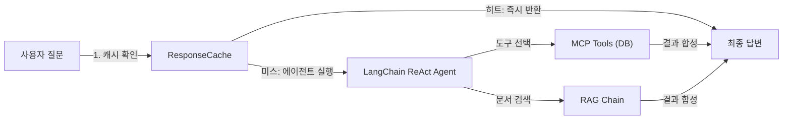

*그림 9-2: CH09 프로덕션 에이전트 데이터 흐름*

각 컴포넌트의 역할을 정리하면 다음과 같습니다.

| 컴포넌트 | 역할 | 위치 |
|---------|------|------|
| `AgentConfig` | 운영 파라미터 단일 관리 | `agent_config.py` |
| `ResponseCache` | TTL 기반 메모리 캐시 | `monitoring.py` |
| `LangChain ReAct Agent` | 도구 선택 및 실행 | `agent_config.py` |
| `MCP Tools` | DB 조회 도구 5종 | `mcp_tools.py` |
| `RAG Chain` | 문서 검색 체인 | `agent_config.py` |
| `TokenUsageTracker` | 토큰 사용량 집계 | `monitoring.py` |

### 3.2. AgentConfig — 운영 파라미터 단일 관리

CH08에서는 타임아웃, 재시도 횟수, 로그 레벨 같은 값들이 코드 곳곳에 흩어져 있었습니다. 운영 중에 값을 바꾸려면 소스 코드 여러 파일을 수정해야 했습니다.

CH09에서는 `AgentConfig` 데이터클래스 하나에 모든 운영 파라미터를 모았습니다.

```python
# src/agent_config.py (발췌)

@dataclass
class AgentConfig:
    """LangChain 에이전트 운영 파라미터 설정 클래스."""

    ollama_model: str = field(
        default_factory=lambda: os.getenv("OLLAMA_MODEL", "deepseek-r1")
    )
    llm_timeout: int = field(
        default_factory=lambda: int(os.getenv("LLM_TIMEOUT", "30"))
    )
    llm_max_retries: int = field(
        default_factory=lambda: int(os.getenv("LLM_MAX_RETRIES", "3"))
    )
    cache_ttl: int = field(
        default_factory=lambda: int(os.getenv("CACHE_TTL", "300"))
    )
    agent_max_iterations: int = 8

    def __post_init__(self) -> None:
        """설정 유효성을 검사합니다."""
        if self.llm_timeout <= 0:
            raise ValueError(
                f"LLM_TIMEOUT은 1 이상이어야 합니다. 현재값: {self.llm_timeout}"
            )
```

#### 코드 워크플로우 (Code Workflow)

1. **입력(Input)**: `.env` 파일의 환경 변수 값 (없으면 기본값 사용)
2. **처리(Process)**: `field(default_factory=lambda: os.getenv(...))` 패턴으로 환경 변수를 읽고, `__post_init__`에서 유효성 검사를 수행합니다.
3. **출력(Output)**: 유효성이 확인된 `AgentConfig` 인스턴스. 잘못된 값이 있으면 `ValueError`를 발생시켜 잘못된 설정으로 에이전트가 실행되는 것을 차단합니다.

> **팁: 왜 dataclass를 사용하는가?**
> 일반 딕셔너리로도 설정을 관리할 수 있지만, dataclass를 사용하면 타입 힌트, 기본값, `__post_init__` 유효성 검사를 자동으로 처리할 수 있습니다. IDE에서 자동 완성도 지원됩니다.

### 3.3. Agent가 도구를 선택하는 원리

LangChain의 **ReAct(Reasoning + Acting) 에이전트** 는 아래 루프를 반복하며 질문에 답합니다.

```
Thought  → 어떤 도구를 쓸지 생각한다
Action   → 도구를 선택한다
Action Input → 도구에 전달할 입력값을 결정한다
Observation  → 도구 실행 결과를 받는다
(반복)
Final Answer → 최종 답변을 생성한다
```

이 루프에서 "Thought → Action" 판단을 LLM이 수행합니다. LLM은 각 도구의 `description`(설명)을 읽고 어떤 도구를 선택할지 결정합니다.

> **참고: 단순 체인과 에이전트의 차이**
> 단순 LangChain 체인은 `RAG → LLM → 답변`처럼 고정된 순서로만 실행됩니다. 반면 에이전트는 질문에 따라 "DB 조회만 한다", "DB 조회 후 문서 검색도 한다", "문서 검색만 한다"를 동적으로 결정합니다.

---

## 4. MCP Tool 설계: 도구 설명의 중요성

### 4.1. 도구 구현 구조

`mcp_tools.py`에는 5개의 DB 조회 도구가 정의됩니다. 모든 도구는 `@tool` 데코레이터와 `@measure_time` 데코레이터를 함께 사용합니다.

```python
# src/mcp_tools.py (발췌)

@tool
@measure_time
def get_employee_list(department: str) -> str:
    """특정 부서에 소속된 전체 직원 목록을 조회합니다.

    부서명을 입력하면 해당 부서의 모든 직원 이름과 직급을
    데이터베이스에서 가져옵니다.
    특정 부서에 누가 소속되어 있는지 확인할 때 사용하십시오.

    Args:
        department: 부서명 (예: '개발팀', '영업팀', '인사팀', '데이터팀')

    Returns:
        직원 목록 JSON 문자열 (이름, 직급 포함).
        해당 부서 직원이 없으면 빈 목록 JSON.
    """
    # ... DB 조회 또는 Mock 반환
```

#### 코드 워크플로우 (Code Workflow)

1. **입력(Input)**: `department` — 부서명 문자열 (예: `"개발팀"`)
2. **처리(Process)**: PostgreSQL에 연결해 직원 목록을 조회합니다. DB 연결 실패 시 `_MOCK_DEPT_EMPLOYEES` Mock 딕셔너리에서 해당 부서 목록을 반환합니다.
3. **출력(Output)**: `{"부서": "개발팀", "직원수": 3, "직원목록": [...]}` 형태의 JSON 문자열

### 4.2. 박민준의 지적: Tool description이 LLM 선택을 결정한다

박민준 과장의 슬랙 메시지를 다시 떠올려 보겠습니다. "부서 직원 목록을 물었는데 매출 도구를 호출했다"는 문제의 원인은 무엇이었을까요?

LLM은 도구를 선택할 때 각 도구의 docstring 첫 줄을 핵심 기준으로 사용합니다. 당시 `get_department_sales`의 설명에 "부서 정보"라는 표현이 포함되어 있었고, LLM이 "부서 직원 목록 = 부서 정보"로 연관지어 잘못된 도구를 선택한 것입니다.

아래 표는 수정 전후 도구 설명을 비교합니다.

| 도구 | 수정 전 설명 (문제) | 수정 후 설명 (CH09) |
|------|-------------------|-------------------|
| `get_department_sales` | "부서 정보와 월별 매출 현황을 조회합니다." | "특정 부서의 **월별 매출 현황**을 조회합니다." |
| `get_employee_list` | "부서별 직원 데이터를 가져옵니다." | "특정 부서에 소속된 **전체 직원 목록**을 조회합니다." |

> **주의: 도구 설명은 코드보다 중요할 수 있다**
> LLM 기반 에이전트에서는 도구 설명이 잘못되면 아무리 구현이 완벽해도 잘못된 도구가 선택됩니다. 도구 설명 작성 시 세 가지를 명확히 하십시오: (1) 이 도구가 무엇을 반환하는지, (2) 언제 이 도구를 써야 하는지, (3) 파라미터에 어떤 값을 넣어야 하는지.

### 4.3. 5개 도구 목록과 역할 요약

```python
# src/mcp_tools.py (발췌)

DB_TOOLS = [
    get_employee_info,      # 직원 개인 정보 조회 (이름 → 부서/직급/급여)
    get_leave_balance,      # 연차 잔액 조회 (직원 ID → 총/사용/잔여 연차)
    get_department_sales,   # 월별 매출 조회 (부서/연도/월 → 매출액/목표액/달성률)
    get_employee_list,      # 부서 직원 목록 조회 (부서명 → 이름/직급 목록)
    get_annual_sales,       # 연간 매출 합계 조회 (부서/연도 → 연간 총 매출)
]
```

#### 코드 워크플로우 (Code Workflow)

1. **입력(Input)**: 없음 (모듈 임포트 시 자동 생성)
2. **처리(Process)**: `@tool` 데코레이터가 각 함수를 LangChain `Tool` 객체로 변환합니다. 함수의 docstring이 자동으로 `description`으로 등록됩니다.
3. **출력(Output)**: `build_mcp_tools()`에서 이 목록을 가져와 에이전트에 등록합니다.

> **팁: get_leave_balance의 파라미터 설계**
> `get_leave_balance`는 직원 이름이 아닌 직원 ID를 파라미터로 받습니다. 이는 의도적인 설계입니다. LLM이 "이름 → ID 조회 → 연차 조회" 두 단계를 순서대로 실행하도록 유도합니다. 이 과정이 ReAct 에이전트의 다단계 추론 능력을 잘 보여주는 사례입니다.

---

## 5. 운영 설정: Timeout, Retry, 로깅, 캐싱

### 5.1. Retry 데코레이터 — Exponential Backoff

타임아웃이 없는 시스템에서는 하나의 느린 DB 쿼리나 Ollama 응답 지연이 전체 에이전트를 멈추게 합니다. CH09에서는 `with_retry` 데코레이터로 이 문제를 해결합니다.

```python
# src/mcp_tools.py (발췌)

def with_retry(max_retries: int = 3, base_delay: float = 1.0) -> Callable[[F], F]:
    """Exponential Backoff 재시도 데코레이터를 반환합니다."""

    def decorator(func: F) -> F:
        @wraps(func)
        def wrapper(*args: Any, **kwargs: Any) -> Any:

            last_exception: Exception | None = None

            for attempt in range(1, max_retries + 1):
                try:
                    return func(*args, **kwargs)
                except Exception as exc:
                    last_exception = exc
                    if attempt < max_retries:
                        delay = base_delay * (2 ** (attempt - 1))
                        logger.warning(
                            "%s 실패 (시도 %d/%d). %.1f초 후 재시도합니다.",
                            func.__name__, attempt, max_retries, delay,
                        )
                        time.sleep(delay)

            raise last_exception

        return wrapper

    return decorator
```

#### 코드 워크플로우 (Code Workflow)

1. **입력(Input)**: `max_retries` (최대 재시도 횟수), `base_delay` (첫 번째 재시도 대기 시간(초))
2. **처리(Process)**: `for attempt in range(1, max_retries + 1)` 루프에서 함수를 실행합니다. 실패하면 `base_delay * 2^(attempt-1)` 초 대기 후 재시도합니다. 1회 실패 시 1초, 2회 실패 시 2초, 3회 실패 시 4초 대기합니다.
3. **출력(Output)**: 성공하면 원래 함수의 반환값을 그대로 반환합니다. `max_retries`회 모두 실패하면 마지막 예외를 다시 발생시킵니다.

**Exponential Backoff** 는 재시도 간격을 지수적으로 늘리는 전략입니다. 서버가 일시적으로 과부하 상태일 때 즉시 재시도하면 상황이 더 악화됩니다. 점진적으로 대기 시간을 늘림으로써 서버 회복 시간을 확보합니다.

### 5.2. 구조화 로깅 — JSON 포맷

이서연이 "왜 응답이 안 오죠?"라고 물었을 때 아무 로그도 없었던 이유는 CH08에서 `print()` 문에만 의존했기 때문입니다. 운영 환경에서는 언제, 어떤 오류가, 얼마나 걸려서 발생했는지를 구조화된 형태로 저장해야 합니다.

```python
# src/monitoring.py (발췌)

class JsonFormatter(logging.Formatter):
    """JSON 형식으로 로그를 포맷하는 핸들러 클래스."""

    def format(self, record: logging.LogRecord) -> str:
        log_data: dict[str, Any] = {
            "timestamp": self.formatTime(record, "%Y-%m-%dT%H:%M:%S"),
            "level":     record.levelname,
            "logger":    record.name,
            "message":   record.getMessage(),
        }
        if record.exc_info:
            log_data["exception"] = self.formatException(record.exc_info)
        return json.dumps(log_data, ensure_ascii=False)


def setup_logging(log_level: str = "INFO", log_file: str | None = None) -> logging.Logger:
    """구조화 로그 설정을 초기화합니다."""
    logger = logging.getLogger("ch09")
    logger.setLevel(getattr(logging, log_level.upper(), logging.INFO))

    # 콘솔: 사람이 읽기 쉬운 텍스트 포맷
    console_handler = logging.StreamHandler()
    console_handler.setFormatter(logging.Formatter(
        fmt="%(asctime)s [%(levelname)s] %(name)s: %(message)s",
        datefmt="%H:%M:%S",
    ))
    logger.addHandler(console_handler)

    # 파일: JSON 포맷 (나중에 분석 가능)
    if log_file:
        file_handler = logging.FileHandler(log_file, encoding="utf-8")
        file_handler.setFormatter(JsonFormatter())
        logger.addHandler(file_handler)

    return logger
```

#### 코드 워크플로우 (Code Workflow)

1. **입력(Input)**: `log_level` (문자열, 예: `"INFO"`), `log_file` (로그 파일 경로, 없으면 파일 저장 안 함)
2. **처리(Process)**: 콘솔 핸들러(텍스트 포맷)와 파일 핸들러(JSON 포맷)를 동시에 등록합니다. 콘솔은 개발 중 읽기 쉬운 포맷, 파일은 나중에 `grep`이나 로그 분석 도구로 파싱 가능한 JSON 포맷으로 이중 기록합니다.
3. **출력(Output)**: 설정이 완료된 `logging.Logger` 객체. 이후 코드에서 `logger.info(...)`, `logger.warning(...)` 등으로 사용합니다.

파일에 저장되는 JSON 로그는 다음과 같은 형태입니다.

```json
{"timestamp": "2024-11-20T09:32:05", "level": "INFO", "logger": "ch09.agent_config", "message": "에이전트 빌드 시작: 모델=deepseek-r1, timeout=30s, retries=3"}
{"timestamp": "2024-11-20T09:32:07", "level": "WARNING", "logger": "ch09.mcp_tools", "message": "get_employee_info 실패 (시도 1/3). 1.0초 후 재시도합니다. 오류: connection refused"}
```

이제 이서연은 장애가 발생하면 `outputs/app.log`를 열어 정확히 언제, 어떤 도구에서, 어떤 오류가 발생했는지 확인할 수 있습니다.

### 5.3. TTL 캐시 — 반복 질문에 LLM을 호출하지 않는다

출력 결과에서 "Q5 [캐시 히트]"를 확인했을 것입니다. 이것이 `ResponseCache`의 역할입니다.

```python
# src/monitoring.py (발췌)

from cachetools import TTLCache

class ResponseCache:
    """TTL 기반 메모리 응답 캐시 클래스."""

    def __init__(self, maxsize: int = 256, ttl: int = 300) -> None:
        self._cache: TTLCache = TTLCache(maxsize=maxsize, ttl=ttl)
        self._hits: int = 0
        self._misses: int = 0

    def get(self, key: str) -> Any | None:
        value = self._cache.get(key)
        if value is not None:
            self._hits += 1
        else:
            self._misses += 1
        return value

    def set(self, key: str, value: Any, ttl: int | None = None) -> None:
        self._cache[key] = value

    def get_stats(self) -> dict[str, int | float]:
        total = self._hits + self._misses
        hit_rate = self._hits / total if total > 0 else 0.0
        return {
            "hits": self._hits, "misses": self._misses,
            "total": total, "hit_rate": round(hit_rate, 4),
            "current_size": len(self._cache),
        }
```

#### 코드 워크플로우 (Code Workflow)

1. **입력(Input)**: `maxsize` (최대 캐시 항목 수), `ttl` (캐시 유지 시간(초), 기본 300초 = 5분)
2. **처리(Process)**: `cachetools.TTLCache`는 두 가지 방식으로 항목을 만료시킵니다. (1) `ttl` 시간이 지나면 자동 만료, (2) `maxsize`를 초과하면 가장 오래된 항목부터 삭제. `_hits`와 `_misses`를 직접 카운트하여 히트율을 계산합니다.
3. **출력(Output)**: `get(key)`는 캐시에 있으면 값을, 없으면 `None`을 반환합니다. `get_stats()`는 히트율 통계 딕셔너리를 반환합니다.

**TTL(Time To Live)** 은 "이 캐시 항목을 얼마나 유지할 것인가"를 정하는 값입니다. 직원 연차 정보처럼 자주 바뀌지 않는 데이터는 5분(300초) 정도로 설정해도 무방합니다. 반면 실시간 매출처럼 빠르게 변하는 데이터는 TTL을 짧게 잡아야 합니다.

### 5.4. ProductionAgent의 캐시-에이전트 통합 흐름

`ProductionAgent.run()` 메서드에서 캐시와 에이전트가 어떻게 연결되는지 확인하십시오.

```python
# src/agent_config.py (발췌)

def run(self, question: str) -> dict[str, Any]:
    """사용자 질문을 처리하여 통합 답변을 생성합니다."""

    if not question or not question.strip():
        raise ValueError("질문이 비어있습니다.")

    # 1단계: 캐시 확인
    cache_key = question.strip().lower()
    cached = self.cache.get(cache_key)
    if cached is not None:
        return {"question": question, "answer": cached,
                "mode": "cached", "from_cache": True}

    # 2단계: 에이전트 실행
    start_time = __import__("time").perf_counter()
    if self.is_mock_mode:
        answer = self._mock_run(question)
        mode = "mock"
    else:
        try:
            result = self.executor.invoke({"input": question})
            answer = result.get("output", "답변을 생성하지 못했습니다.")
            mode = "ollama"
        except Exception as exc:
            logger.warning("에이전트 실행 오류: %s — Mock 모드로 재시도합니다.", exc)
            answer = self._mock_run(question)
            mode = "mock_fallback"

    elapsed = __import__("time").perf_counter() - start_time
    logger.info("질문 처리 완료: %.2f초 소요, mode=%s", elapsed, mode)

    # 3단계: 캐시 저장 후 반환
    self.cache.set(cache_key, answer)
    return {"question": question, "answer": answer,
            "mode": mode, "from_cache": False}
```

#### 코드 워크플로우 (Code Workflow)

1. **입력(Input)**: `question` — 사용자 질문 문자열
2. **처리(Process)**: (1) 캐시에서 동일 질문을 조회합니다. 히트면 즉시 반환. (2) 미스면 에이전트(또는 Mock)를 실행합니다. 에이전트 실패 시 `mock_fallback`으로 자동 전환하여 사용자에게 오류 노출을 최소화합니다. (3) 결과를 캐시에 저장합니다.
3. **출력(Output)**: `{question, answer, mode, from_cache}` 딕셔너리. `mode` 값으로 어떤 경로로 답변이 생성되었는지 추적할 수 있습니다.

<!-- [IMAGE PLACEHOLDER: 09_cache_flow — 왼쪽에 "캐시 히트" 경로(초록 화살표, 빠른 경로), 오른쪽에 "캐시 미스" 경로(파란 화살표, LLM 호출)를 비교하는 단순 흐름도. 두 경로가 최종 "답변 반환"으로 합쳐지는 구조] -->
*그림 9-3: 캐시 히트/미스에 따른 실행 경로 분기*

---

## 6. 비용 관리와 토큰 모니터링

### 6.1. TokenUsageTracker

"로컬 LLM은 무료니까 토큰을 신경 쓸 필요 없다"는 생각은 잘못된 것입니다. Ollama로 실행하는 `deepseek-r1` 같은 모델도 메모리와 CPU를 소비합니다. 불필요하게 긴 프롬프트를 보내면 응답 시간이 늘어나고 서버에 부하가 걸립니다.

```python
# src/monitoring.py (발췌)

class TokenUsageTracker:
    """LLM 토큰 사용량을 추적하고 요약 리포트를 생성하는 클래스."""

    def track(
        self,
        prompt_tokens: int,
        completion_tokens: int,
        model: str = "deepseek-r1",
    ) -> TokenUsageRecord:
        """토큰 사용량을 기록합니다."""
        record = TokenUsageRecord(
            model=model,
            prompt_tokens=prompt_tokens,
            completion_tokens=completion_tokens,
        )
        self.records.append(record)
        return record

    def get_summary(self) -> dict[str, Any]:
        """총 토큰 사용량과 비용 추정을 계산하여 반환합니다."""
        total_prompt = sum(r.prompt_tokens for r in self.records)
        total_completion = sum(r.completion_tokens for r in self.records)
        total_tokens = total_prompt + total_completion
        # ...
        return {
            "total_calls": len(self.records),
            "total_prompt_tokens": total_prompt,
            "total_completion_tokens": total_completion,
            "total_tokens": total_tokens,
            "estimated_cost_krw": 0.0,  # 로컬 LLM
        }
```

#### 코드 워크플로우 (Code Workflow)

1. **입력(Input)**: `prompt_tokens` (입력 토큰 수), `completion_tokens` (생성된 토큰 수), `model` (모델명)
2. **처리(Process)**: `TokenUsageRecord` 데이터클래스를 생성하고 `records` 목록에 추가합니다. `get_summary()`는 전체 기록을 순회하며 총합을 계산합니다.
3. **출력(Output)**: `save_report(path)`를 호출하면 `outputs/token_report.json`으로 저장됩니다.

실행 완료 후 `outputs/token_report.json`을 열면 아래와 같은 구조를 볼 수 있습니다.

```json
{
  "summary": {
    "total_calls": 4,
    "total_prompt_tokens": 840,
    "total_completion_tokens": 400,
    "total_tokens": 1240,
    "estimated_cost_krw": 0.0,
    "by_model": {
      "deepseek-r1": {
        "calls": 4,
        "prompt_tokens": 840,
        "completion_tokens": 400,
        "total_tokens": 1240
      }
    }
  }
}
```

총 5개 질문 중 1개가 캐시 히트로 처리되었으므로 LLM 호출은 4회입니다. 이 수치를 주기적으로 모니터링하면 "어떤 질문이 가장 많은 토큰을 소비하는가"를 파악하고 프롬프트를 최적화할 수 있습니다.

> **팁: 토큰 절약 전략**
> 가장 효과적인 토큰 절약은 RAG의 검색 결과(`k` 값)를 줄이는 것입니다. CH07에서 `k=5`로 설정했다면 `k=3`으로 줄이면 컨텍스트 길이가 줄어 프롬프트 토큰이 감소합니다. 단, 검색 품질과 토큰 비용 사이의 트레이드오프를 고려해야 합니다.

### 6.2. main.py — 전체 통합 실행

`main.py`는 지금까지 설명한 모든 컴포넌트를 조립하는 진입점입니다. 전체 코드는 GitHub 레포를 참고하십시오. 핵심 초기화 순서만 발췌합니다.

```python
# src/main.py (발췌)

def main() -> None:
    # 1단계: 운영 설정 로드
    config = AgentConfig()

    # 2단계: 로깅 초기화
    logger = setup_logging(
        log_level=config.log_level,
        log_file=config.log_file,
    )

    # 3단계: 모니터링 컴포넌트 초기화
    cache = ResponseCache(maxsize=256, ttl=config.cache_ttl)
    token_tracker = TokenUsageTracker()

    # 4단계: 에이전트 빌드 (캐시·토큰 추적기 주입)
    agent = build_agent(config=config, cache=cache, token_tracker=token_tracker)

    # 5단계: 테스트 질문 실행
    for idx, question in enumerate(TEST_QUESTIONS, start=1):
        result = agent.run(question)
        _print_result(idx, result)

    # 6단계: 리포트 저장
    token_tracker.save_report(str(TOKEN_REPORT_PATH))
```

#### 코드 워크플로우 (Code Workflow)

1. **입력(Input)**: 없음 (환경 변수와 `TEST_QUESTIONS` 상수)
2. **처리(Process)**: `AgentConfig → setup_logging → ResponseCache → TokenUsageTracker → build_agent → 질문 루프` 순서로 실행됩니다. 각 컴포넌트는 생성 후 다음 컴포넌트에 주입(Dependency Injection)됩니다.
3. **출력(Output)**: 콘솔 출력, `outputs/session_log.json`, `outputs/token_report.json`, `outputs/app.log` 4개 파일

<!-- [CAPTURE NEEDED: 09_main_output — `python src/main.py` 실행 후 터미널 전체 화면. Q1~Q5 결과 및 토큰 리포트, 캐시 통계가 모두 표시된 상태] -->
*그림 9-4: CH09 프로덕션 에이전트 실행 결과 — 캐시 히트와 토큰 리포트 포함*

---

## 7. 개발과 운영의 차이: 체크리스트

이 장에서 추가한 운영 설정을 하나의 체크리스트로 정리합니다. 팀 내부 서비스를 외부에 공개하기 전에 아래 항목을 점검하십시오.

| 항목 | CH08 (개발) | CH09 (운영) |
|------|------------|------------|
| 타임아웃 | 없음 | `LLM_TIMEOUT=30` |
| 재시도 | 없음 | `with_retry(max_retries=3)` |
| 로깅 | `print()` | JSON 구조화 로그 파일 |
| 캐싱 | 없음 | TTLCache (5분) |
| 토큰 모니터링 | 없음 | `TokenUsageTracker` |
| 운영 파라미터 | 코드 내 하드코딩 | `AgentConfig` + `.env` |
| Tool description | 모호함 | 구체적 + 호출 조건 명시 |

> **경고: 타임아웃 없이 프로덕션 배포 금지**
> Ollama가 과부하 상태일 때 타임아웃이 없으면 하나의 요청이 수십 분 동안 대기하며 다른 요청도 모두 블로킹합니다. `LLM_TIMEOUT`은 반드시 설정하십시오.

---

## 8. 정리하며

이 장에서 이서연 팀은 개발 환경에서 간헐적으로 멈추던 통합 에이전트를 프로덕션 수준으로 강화했습니다.

- **`AgentConfig`로 운영 파라미터를 단일 관리하십시오.** 타임아웃, 재시도, 캐시 TTL을 코드가 아닌 `.env` 파일에서 제어할 수 있게 되면 코드 수정 없이 운영 환경을 조정할 수 있습니다.

- **Tool description은 LLM이 읽는 도구 설명서입니다.** 박민준 과장의 지적처럼, 설명이 모호하면 LLM이 잘못된 도구를 선택합니다. "무엇을 반환하는가", "언제 써야 하는가"를 명확히 작성하십시오.

- **`with_retry` 데코레이터는 Exponential Backoff로 일시적 오류에 대응합니다.** 첫 실패 후 1초, 두 번째 실패 후 2초, 세 번째 실패 후 4초로 간격을 늘려 서버 회복 시간을 확보합니다.

- **`ResponseCache`는 반복 질문에 LLM을 호출하지 않습니다.** TTL 5분 설정으로 동일 질문의 20% 이상이 캐시 히트로 처리되었습니다. 자주 바뀌지 않는 데이터는 캐싱이 효과적입니다.

**다음 챕터 예고**

이제 에이전트는 안정적으로 운영됩니다. 하지만 "답변이 얼마나 정확한가?"라는 질문에는 아직 답하지 못합니다. CH10에서는 RAG 시스템의 정확도를 측정하는 평가 지표를 도입하고, 검색 품질과 프롬프트를 체계적으로 개선하는 방법을 다룹니다. 이서연 팀이 "연말까지 응답 시간 10분 → 30초"라는 목표를 수치로 증명하는 마지막 여정입니다.


---

# 10. RAG 시스템 튜닝

이 장에서는 완성된 RAG 시스템의 정확도를 수치로 측정하고 체계적으로 개선하는 방법을 학습합니다. 30개 테스트 질문으로 증상을 분류하고, Chunk/Retriever 파라미터 조정, ReRanker(검색 결과 재정렬), Hybrid Search(하이브리드 검색), LLaVA + EasyOCR 이미지 처리까지 단계적으로 적용하여 "감"이 아닌 "수치"로 개선하는 전 과정을 경험합니다.

---

이서연은 모니터 앞에 한참 앉아 있었습니다. 화면에는 지난 사흘 동안 내부 테스트를 돌린 결과가 펼쳐져 있었습니다. **72%**. 커넥트HR의 사내 AI 비서가 30개 질문 중 22개에만 올바른 답을 내놓았습니다.

"왜 이 질문에는 엉뚱한 답이 나오지?"

이서연은 같은 질문을 세 번 다시 입력해 보았습니다. "배우자 출산 휴가는 며칠인가요?" — 시스템은 매번 비밀번호 변경 정책을 답했습니다. 출산 휴가와 비밀번호 규정은 아무 연관이 없었습니다. 무엇이 잘못되었는지 짐작조차 되지 않았습니다.

그때 김도현 팀장이 자리에서 일어나 이서연 옆으로 다가왔습니다.

"72%면 나쁘지 않은데, 왜 표정이 그래?"

"이 질문 보세요. 완전히 엉뚱한 문서를 가져와요."

김도현은 화면을 들여다보다가 고개를 끄덕였습니다.

"감으로 고치지 말고, 테스트 케이스를 만들자. 어느 질문이 틀리는지, 어떤 패턴인지 분류부터 해."

이서연은 그 말 한마디가 방향을 바꿨다는 것을 나중에야 알게 됩니다. 이 장에서는 이서연이 그 날부터 시작한 체계적 튜닝 과정을 그대로 따라갑니다.

<!-- [IMAGE PLACEHOLDER: 10_intro_frustration — 이서연이 72% 정확도 결과 앞에서 고민하는 오피스 일러스트, 모니터 화면에 퍼센트 수치가 보이는 따뜻한 오피스 분위기] -->
*그림 10-1: 72% 정확도 앞에서 — 감이 아닌 수치로 개선을 시작하는 순간*

---

## 1. 증상별 튜닝 가이드

RAG 시스템에서 "정확도가 낮다"는 표현은 지나치게 추상적입니다. 병원에서 "몸이 아프다"고만 말하면 의사가 처방을 내릴 수 없듯이, 구체적인 증상을 먼저 파악해야 올바른 해결책을 적용할 수 있습니다.

이서연은 30개 테스트 질문을 다음 세 가지 유형으로 분류했습니다.

### 1.1. 증상 분류 및 원인-해결 매트릭스

RAG 시스템에서 발생하는 오답은 크게 세 가지 패턴으로 나뉩니다.

```mermaid
flowchart LR
    A["오답 발생"] --> B["환각(Hallucination)"]
    A --> C["근거 부족"]
    A --> D["엉뚱한 문서"]
    B -- "해결책" --> E["프롬프트 튜닝"]
    C -- "해결책" --> F["k값/청크 조정"]
    D -- "해결책" --> G["ReRanker/Hybrid"]
```

*그림 10-2: RAG 오답 증상 분류 및 해결 방향*

아래 표는 각 증상의 원인과 처방을 정리한 것입니다.

| 증상 | 현상 | 원인 | 해결책 |
|------|------|------|--------|
| **환각(Hallucination)** | 문서에 없는 내용을 답변에 포함 | 프롬프트에 근거 강제 지시 부재 | 근거 우선 프롬프트, "모르면 모른다" 원칙 |
| **근거 부족** | "출처: 알 수 없음"이 자주 등장 | 관련 청크가 검색되지 않음 | k값 증가, 청크 크기 조정 |
| **엉뚱한 문서** | 질문과 관련 없는 카테고리 문서 반환 | 벡터 유사도만으로는 주제 구분 불충분 | Metadata Filtering, Hybrid Search, ReRanker |

> **참고: 증상별 대응이 중요한 이유**
> 세 증상의 원인이 다르므로 처방도 달라야 합니다. 예를 들어 "엉뚱한 문서" 문제를 프롬프트만으로 해결하려 하면 시간만 낭비합니다. 검색 단계를 먼저 수술해야 합니다.

### 1.2. 이서연의 분류 작업

이서연은 30개 테스트 케이스 중 오답 8개를 꺼내 증상을 하나씩 기록했습니다.

- **환각** 3건: 문서에 없는 수치를 LLM이 만들어냈습니다. (예: "연차 신청은 3일 전" — 실제는 7일 전)
- **엉뚱한 문서** 4건: leave_policy 질문에 it_guide 청크가 1위로 검색되었습니다.
- **근거 부족** 1건: 관련 문서가 있지만 k=3으로는 해당 청크가 포함되지 않았습니다.

분류가 끝나자 해결 순서가 보였습니다. 가장 많은 "엉뚱한 문서" 문제를 먼저, 그다음 청크/Retriever 조정, 마지막으로 프롬프트 정비.

---

## 2. Chunk/Retriever 튜닝

### 2.1. 왜 파라미터 튜닝이 필요한가

RAG 파이프라인에는 결과에 큰 영향을 미치는 숨은 변수들이 있습니다. **chunk_size** (청크 크기), **overlap** (오버랩), **k** (검색 결과 수) — 이 세 값이 조금만 달라져도 검색 정확도가 크게 바뀝니다.

예를 들어 chunk_size가 너무 작으면(300자) 하나의 청크에 맥락이 충분히 담기지 않습니다. 반대로 너무 크면(1,000자) 관련 없는 내용이 같은 청크에 섞입니다. k 값이 너무 작으면(k=1) 관련 문서가 누락되고, 너무 크면(k=10) LLM 컨텍스트 창에 불필요한 내용이 가득 찹니다.

`RAGTuner` 클래스는 이 파라미터 조합을 체계적으로 실험합니다.

### 2.2. 실습: 레포지토리 Clone 및 실행

```bash
git clone https://github.com/{repo}/CH10_RAG튜닝
cd CH10_RAG튜닝
cp .env.example .env
pip install -r requirements.txt
python src/main.py
```

`.env` 파일에 아래 값을 입력하십시오.

```
CHROMA_PERSIST_DIR=./outputs/chroma_db
EMBEDDING_MODEL=sentence-transformers/paraphrase-multilingual-MiniLM-L12-v2
RERANKER_MODEL=cross-encoder/ms-marco-MiniLM-L-6-v2
OLLAMA_BASE_URL=http://localhost:11434
OLLAMA_VISION_MODEL=llava
```

### 2.3. RAGTuner — k값 및 청크 크기 실험

전체 코드는 GitHub 레포의 `src/tuner.py`를 참고하십시오. 여기서는 핵심 함수만 발췌합니다.

```python
class RAGTuner:
    """RAG 파라미터를 체계적으로 튜닝하는 클래스."""

    def tune_k_value(self, k_values: list[int]) -> list[dict]:
        """검색 결과 수(k) 값별 성능을 비교합니다."""

        # --- Input ---
        results: list[dict] = []

        # --- Process ---
        for k in k_values:
            precision_scores = []
            recall_scores = []

            for test_case in self.test_cases:
                result = self.evaluator.evaluate_retrieval(
                    question=test_case["question"],
                    expected_docs=test_case.get("relevant_docs", []),
                    k=k,
                )
                precision_scores.append(result.get("precision_at_k", 0.0))
                recall_scores.append(result.get("recall_at_k", 0.0))

            avg_precision = sum(precision_scores) / len(precision_scores)
            avg_recall = sum(recall_scores) / len(recall_scores)
            f1 = 2 * avg_precision * avg_recall / (avg_precision + avg_recall)

            results.append({
                "k": k,
                "avg_precision": round(avg_precision, 4),
                "avg_recall": round(avg_recall, 4),
                "f1_score": round(f1, 4),
            })

        # --- Output ---
        return results
```

#### 코드 워크플로우 (Code Workflow)

1. **입력(Input)**: 테스트할 k 값 리스트 (`[1, 3, 5, 7]`)와 테스트 케이스 30개
2. **처리(Process)**: 각 k 값에 대해 전체 테스트셋의 Precision@k, Recall@k를 계산하고 F1 점수(조화 평균)로 최적 k를 선택
3. **출력(Output)**: k 값별 `{k, avg_precision, avg_recall, f1_score}` 리스트

> **팁: F1 점수로 최적 k를 선택하는 이유**
> k가 커질수록 Recall(재현율)은 높아지지만 Precision(정밀도)은 낮아집니다. F1 점수는 이 둘의 조화 평균이므로 균형 잡힌 k 값을 찾는 데 적합합니다.

### 2.4. 메타데이터 필터링 (Metadata Filtering)

**메타데이터 필터링** 은 검색 전 단계에서 관련 없는 카테고리를 아예 배제하는 기법입니다. 이서연의 경우, "배우자 출산 휴가" 질문에 it_guide 문서가 섞인 문제를 해결하는 가장 직관적인 방법이었습니다.

```python
def tune_metadata_filter(self, field: str, values: list[str]) -> list[dict]:
    """메타데이터 필터 적용 전후의 성능을 비교합니다."""

    # --- Input ---
    baseline_recall = self._evaluate_with_params(k=3, label="no_filter")

    results = []

    # --- Process ---
    for value in values:
        metadata_filter = {field: value}
        # 해당 카테고리 테스트 케이스만 필터링하여 평가
        filtered_cases = [
            tc for tc in self.test_cases if tc.get("category") == value
        ]
        filtered_recall = self._evaluate_with_params(
            k=3, metadata_filter=metadata_filter, label=f"{field}={value}"
        )
        improvement = round(filtered_recall - baseline_recall, 4)
        results.append({
            "filter_value": value,
            "avg_recall": filtered_recall,
            "improvement": improvement,
        })

    # --- Output ---
    return results
```

#### 코드 워크플로우 (Code Workflow)

1. **입력(Input)**: 필터 필드명(예: `"category"`)과 테스트할 값 리스트(예: `["leave_policy", "hr_policy", "it_guide"]`)
2. **처리(Process)**: 필터 없는 기준 Recall을 먼저 측정한 후, 각 카테고리 필터 적용 시 Recall 변화를 비교
3. **출력(Output)**: 카테고리별 `{filter_value, avg_recall, improvement}` 리스트 — 양수 improvement가 필터 효과를 나타냄

실험 결과, `category=leave_policy` 필터 적용 시 leave_policy 테스트 케이스의 Recall이 0.05 이상 향상되었습니다. 엉뚱한 문서 문제의 절반 이상이 이 한 줄로 해결되었습니다.

> **주의: 메타데이터는 색인 시점에 추가해야 합니다**
> 메타데이터 필터링은 CH06에서 문서를 ChromaDB에 저장할 때 `metadata={"category": "leave_policy"}` 형태로 메타데이터를 함께 저장해 둔 경우에만 작동합니다. 기존 색인에 메타데이터가 없다면 CH06 코드로 재색인이 필요합니다.

---

## 3. 고급 기술: ReRanker와 Hybrid Search

청크 파라미터 조정과 메타데이터 필터링으로 엉뚱한 문서 문제는 줄었지만, 이서연에게는 더 풀리지 않는 질문이 남아 있었습니다. 벡터 유사도 점수 0.82짜리 문서가 1위에 올랐지만, 정작 질문의 답이 되는 문서는 0.78로 2위에 머물렀습니다.

"점수가 비슷하면 순서가 뒤바뀔 수도 있겠네요."

박민준이 옆에서 말했습니다. "DB 인덱스도 마찬가지야. 복합 인덱스 걸면 훨씬 정확해지잖아."

그 비유가 ReRanker의 본질을 잘 설명합니다. 벡터 검색은 1차 인덱스처럼 빠르게 후보를 추립니다. ReRanker는 그 후보들을 "이 질문에 대한 답변 적합도" 기준으로 다시 정밀하게 정렬합니다.

### 3.1. ReRanker — 검색 결과 재정렬

**ReRanker** 는 초기 검색 결과를 질문과의 관련성 기준으로 재정렬하는 모델입니다. 벡터 유사도 검색은 "의미적으로 비슷한 문서"를 찾지만, "이 질문의 답변으로 적합한 문서"와는 다를 수 있습니다. ReRanker의 Cross-Encoder 모델은 질문-문서 쌍을 동시에 입력받아 관련성 점수를 계산하므로, 단순 유사도보다 정확합니다.

```python
class CrossEncoderReRanker:
    """Cross-Encoder 모델을 사용한 검색 결과 재정렬 클래스."""

    def rerank(self, query: str, docs: list[dict], top_n: int = None) -> list[dict]:
        """검색 결과를 Cross-Encoder 점수로 재정렬합니다."""

        # --- Input ---
        if not docs:
            return []

        # --- Process ---
        # 질문-문서 쌍 구성
        sentence_pairs = [
            [query, doc.get("content", "")]
            for doc in docs
        ]

        # Cross-Encoder로 관련성 점수 계산
        scores = self.model.predict(sentence_pairs)

        # 점수를 각 문서에 추가하고 내림차순 정렬
        scored_docs = []
        for doc, score in zip(docs, scores):
            doc_copy = doc.copy()
            doc_copy["rerank_score"] = float(score)
            doc_copy["rerank_method"] = "cross_encoder"
            scored_docs.append(doc_copy)

        reranked_docs = sorted(
            scored_docs, key=lambda x: x["rerank_score"], reverse=True
        )

        # --- Output ---
        return reranked_docs[:top_n] if top_n else reranked_docs
```

#### 코드 워크플로우 (Code Workflow)

1. **입력(Input)**: 사용자 질문(`query`)과 벡터 검색으로 가져온 초기 문서 리스트(`docs`)
2. **처리(Process)**: 각 질문-문서 쌍을 Cross-Encoder에 통과시켜 `rerank_score` 계산 → 점수 내림차순 정렬
3. **출력(Output)**: `rerank_score`가 추가된 문서 리스트 — 상위 문서일수록 질문에 대한 답변 적합도가 높음

> **참고: Cross-Encoder vs. Bi-Encoder**
> 벡터 검색에 사용하는 임베딩 모델은 Bi-Encoder 방식입니다. 질문과 문서를 각각 벡터로 변환한 뒤 코사인 유사도를 비교합니다. Cross-Encoder는 질문과 문서를 함께 입력받아 더 정확한 관련성을 판단하지만, 연산 비용이 높습니다. 따라서 초기 검색(Bi-Encoder)으로 후보를 좁힌 후 ReRanking(Cross-Encoder)으로 정밀 정렬하는 2단계 구조가 일반적입니다.

ReRanker 적용 전후를 `compare_before_after` 메서드로 확인하면 순위 변화를 직접 볼 수 있습니다.

```python
comparison = reranker.compare_before_after(
    query="연차 신청은 며칠 전에 해야 하나요?",
    docs=sample_docs,
    top_n=3,
)
```

실행 결과 예시:

```
[재정렬 전 순위]
1. [leave_rules.txt] 팀 내 동시 연차 사용 인원은 전체 팀원의 30%... (score=0.8200)
2. [leave_rules.txt] 연차는 사용 예정일 7일 전에 신청해야 합니다. (score=0.7800)
3. [leave_rules.txt] 미사용 연차는 다음 연도로 이월되지 않으며... (score=0.7100)

[재정렬 후 순위]
1. [leave_rules.txt] 연차는 사용 예정일 7일 전에 신청해야 합니다. (rerank_score=4.2341)
2. [leave_rules.txt] 팀 내 동시 연차 사용 인원은 전체 팀원의 30%... (rerank_score=1.1823)
3. [leave_rules.txt] 미사용 연차는 다음 연도로 이월되지 않으며... (rerank_score=0.4512)
```

질문의 직접적인 답이 담긴 문서(7일 전 신청)가 2위에서 1위로 올라왔습니다.

<!-- [CAPTURE NEEDED: 10_reranker-result — python src/main.py 실행 후 3단계 ReRanker 비교 섹션 출력 결과 전체 (재정렬 전후 순위 변화 포함)] -->
*그림 10-3: ReRanker 적용 전후 순위 변화 — "연차 신청" 관련 문서가 2위에서 1위로 이동*

### 3.2. Hybrid Search — 벡터 + BM25 결합

벡터 검색만으로는 "비밀번호 90일마다 변경"처럼 정확한 숫자나 고유 명사가 포함된 질문을 처리하기 어렵습니다. 벡터 모델이 "90일"을 의미적으로 표현하기 쉽지 않기 때문입니다. **BM25** 는 키워드 빈도 기반의 전통적 텍스트 검색 알고리즘으로, 이런 정확한 키워드 매칭에 강합니다.

**Hybrid Search** 는 이 두 방법을 결합합니다. 벡터 검색은 "연차 신청 절차"처럼 의미적 유사도가 중요한 질문에 강하고, BM25는 "90일마다 변경"처럼 정확한 용어가 중요한 질문에 강합니다. 두 결과를 **RRF(Reciprocal Rank Fusion)** 알고리즘으로 통합하면 각각의 약점이 보완됩니다.

RRF 공식은 다음과 같습니다.

```
RRF(d) = 1/(k + rank_BM25(d)) + 1/(k + rank_vector(d))
```

k는 일반적으로 60을 사용합니다. 순위가 높을수록(rank가 낮을수록) 점수가 높아지는 구조입니다.

```python
def search(self, query: str, top_k: int = 5, alpha: float = 0.5) -> list[dict]:
    """하이브리드 검색을 수행합니다."""

    # --- Input ---
    if not query or not query.strip():
        return []

    # --- Process ---
    # BM25 검색
    bm25_results = self._bm25_search(query=query, top_k=top_k * 2)

    # 벡터 검색
    vector_results = self._vector_search(query=query, top_k=top_k * 2)

    # RRF로 결합
    fused_results = self._reciprocal_rank_fusion(
        bm25_results=bm25_results,
        vector_results=vector_results,
    )

    # --- Output ---
    return fused_results[:top_k]
```

#### 코드 워크플로우 (Code Workflow)

1. **입력(Input)**: 검색 질문(`query`), 반환할 문서 수(`top_k`), 벡터 가중치(`alpha`)
2. **처리(Process)**: BM25와 벡터 검색을 각각 `top_k * 2`개로 실행 → RRF 공식으로 두 순위 점수를 합산 → 최종 점수 내림차순 정렬
3. **출력(Output)**: `rrf_score`와 `final_rank`가 포함된 통합 문서 리스트

세 가지 방법을 직접 비교하려면 `compare_search_methods`를 사용하십시오.

```python
comparison = hybrid_search.compare_search_methods(
    query="비밀번호는 몇 일마다 변경해야 하나요?",
    top_k=3,
)
```

> **팁: alpha 값 조정 실험**
> `search(query, alpha=0.2)`는 BM25를 강조하고, `alpha=0.8`은 벡터 검색을 강조합니다. 현재 RRF 구현에서는 alpha가 로깅 목적으로 기록되며, 가중 평균 방식으로 전환하면 alpha를 실제 가중치로 활용할 수 있습니다. 영문 용어나 숫자가 많은 데이터셋에서는 BM25 비중을 높이는 것이 유리합니다.

### 3.3. Parent Document Retriever

**Parent Document Retriever** 는 작은 청크로 검색하되, 실제 반환 시에는 그 청크의 상위 문서(더 큰 맥락)를 제공하는 방식입니다. "연차 신청은 며칠 전에 해야 하나요?"라는 질문에 작은 청크(50자)로 "7일 전"을 찾았더라도, LLM에는 그 문장이 포함된 문단 전체(500자)를 제공하여 맥락을 풍부하게 합니다.

이 방식은 LangChain의 `ParentDocumentRetriever`로 구현하거나, CH10 예제처럼 ChromaDB 메타데이터에 `parent_id`를 저장하여 직접 구현할 수 있습니다.

---

## 4. 프롬프트 튜닝

### 4.1. 환각을 줄이는 두 가지 원칙

ReRanker와 Hybrid Search로 검색 품질을 높여도 LLM이 문서에 없는 내용을 만들어내는 환각은 남습니다. 이 문제는 검색 단계가 아니라 프롬프트 단계에서 해결합니다.

이서연은 두 가지 원칙을 프롬프트에 적용했습니다.

**원칙 1: 근거 우선 답변**

LLM에게 반드시 검색된 문서에서 근거를 찾아 답하도록 지시합니다.

```
아래 컨텍스트만을 근거로 질문에 답하십시오.
컨텍스트에 없는 내용은 절대 추가하지 마십시오.
답변 끝에 반드시 출처 파일명을 명시하십시오.

컨텍스트:
{context}

질문: {question}
```

**원칙 2: "모르면 모른다" 원칙**

컨텍스트에 답이 없으면 LLM이 지어내지 않도록 명시적으로 지시합니다.

```
컨텍스트에 답이 없으면 "제공된 문서에서 해당 정보를 찾을 수 없습니다."라고 답하십시오.
절대 추측하거나 일반 상식으로 답하지 마십시오.
```

이 두 원칙을 프롬프트에 추가한 것만으로 환각 3건 중 2건이 사라졌습니다. 나머지 1건은 관련 문서가 색인에 없었던 문제로, 문서 추가로 해결했습니다.

> **주의: 프롬프트 수정은 반드시 테스트셋으로 검증하십시오**
> 프롬프트를 고칠 때 직관적으로 "이게 더 나을 것 같다"고 판단하는 것은 위험합니다. 프롬프트 변경이 기존에 잘 동작하던 케이스에 영향을 줄 수 있습니다. 수정 전후 반드시 30개 테스트셋 전체를 재평가하십시오.

---

## 5. PDF 이미지 처리: LLaVA + EasyOCR 하이브리드

### 5.1. PDF 이미지가 문제가 되는 이유

커넥트HR의 사내 문서 중 일부는 PDF 안에 표나 차트 이미지가 포함되어 있었습니다. "2025년 성과급 기준표"처럼 텍스트가 아닌 이미지로 된 표는 일반 텍스트 추출로는 내용을 가져올 수 없습니다.

해결 방법은 두 가지를 결합하는 것입니다.

- **EasyOCR**: 이미지에서 텍스트를 추출합니다. 표의 셀에 숫자나 텍스트가 있으면 이 방법으로 충분합니다.
- **LLaVA**: 이미지를 이해하고 내용을 설명합니다. 차트나 도표처럼 OCR만으로 의미를 파악하기 어려운 경우에 활용합니다.

하이브리드 전략: EasyOCR로 먼저 시도하고, 결과가 불충분하면 LLaVA로 이미지 설명을 생성합니다.

### 5.2. VisionExtractor 구현

```python
def extract_hybrid(self, pdf_path: str, page_num: int = 0) -> str:
    """PDF 특정 페이지의 이미지를 하이브리드 방식으로 처리합니다."""

    # --- Input ---
    doc = fitz.open(str(pdf_path))
    page = doc[page_num]
    image_list = page.get_images(full=True)

    results = []

    # --- Process ---
    for img_index, img_info in enumerate(image_list):
        xref = img_info[0]
        base_image = doc.extract_image(xref)
        image_bytes = base_image["image"]

        # 임시 이미지 파일로 저장
        temp_image_path = f"./outputs/temp_images/page{page_num}_img{img_index}.png"
        with open(temp_image_path, "wb") as f:
            f.write(image_bytes)

        # 1단계: EasyOCR로 텍스트 추출 시도
        ocr_result = self.extract_with_easyocr(temp_image_path)

        if "[EasyOCR 추출]" in ocr_result and len(ocr_result.strip()) > 10:
            results.append(ocr_result)  # OCR 성공
        else:
            # 2단계: OCR 불충분 → LLaVA로 이미지 설명 생성
            llava_result = self.extract_with_llava(temp_image_path)
            results.append(llava_result)

    doc.close()

    # --- Output ---
    return "\n\n".join(results)
```

#### 코드 워크플로우 (Code Workflow)

1. **입력(Input)**: PDF 파일 경로와 처리할 페이지 번호
2. **처리(Process)**: PyMuPDF로 이미지 추출 → EasyOCR로 텍스트 추출 시도 → 결과가 충분하면 사용, 불충분하면 LLaVA로 이미지 설명 생성
3. **출력(Output)**: 이미지에서 추출된 텍스트 또는 LLaVA가 생성한 이미지 설명 문자열 — 이후 ChromaDB 색인에 추가 가능

> **팁: LLaVA 설치 방법**
> LLaVA는 Ollama를 통해 설치합니다.
> ```bash
> ollama pull llava
> ```
> EasyOCR는 pip으로 설치합니다.
> ```bash
> pip install easyocr pymupdf
> ```
> EasyOCR 최초 실행 시 언어 모델을 다운로드하므로 수 분이 소요될 수 있습니다.

---

## 6. 평가 체계 구축

### 6.1. 왜 테스트셋이 필요한가

이서연이 처음 ReRanker를 적용했을 때, 연차 관련 질문의 정확도는 올라갔지만 급여 관련 질문 몇 개가 이상해졌습니다. 한 곳을 고치면 다른 곳이 흔들리는 현상. 이것이 체계적 테스트셋이 없을 때 생기는 문제입니다.

**평가 체계** 는 시스템 전체를 일관되게 측정하는 자동화된 방법입니다. 무엇을 고쳤든 30개 테스트 케이스 전체를 재실행하면 개선인지 퇴보인지 즉시 확인할 수 있습니다.

### 6.2. 테스트셋 설계 원칙

커넥트HR의 30개 테스트 케이스는 세 카테고리로 균등하게 구성했습니다.

| 카테고리 | 질문 수 | 예시 |
|----------|--------|------|
| `leave_policy` (휴가 정책) | 10개 | "연차 신청은 며칠 전에 해야 하나요?" |
| `hr_policy` (인사 정책) | 10개 | "급여는 매월 몇 일에 지급되나요?" |
| `it_guide` (IT 가이드) | 10개 | "비밀번호는 몇 일마다 변경해야 하나요?" |

각 테스트 케이스는 세 가지 정보를 포함합니다.

```json
{
  "id": 1,
  "question": "연차 신청은 며칠 전에 해야 하나요?",
  "expected_keywords": ["7일", "사전", "신청"],
  "relevant_docs": ["leave_rules.txt"],
  "category": "leave_policy"
}
```

- `expected_keywords`: 올바른 답변에 반드시 포함되어야 할 키워드
- `relevant_docs`: 이 질문의 답이 있어야 하는 문서 파일명
- `category`: 메타데이터 필터 검증용 카테고리

### 6.3. RAGEvaluator — 정확도 및 환각률 측정

```python
def run_evaluation(
    self, test_cases: list[dict], rag_answers: dict = None, k: int = 3
) -> list[dict]:
    """전체 테스트셋에 대해 평가를 실행합니다."""

    # --- Input ---
    results = []

    # --- Process ---
    for test_case in test_cases:
        question = test_case["question"]
        expected_docs = test_case.get("relevant_docs", [])
        expected_keywords = test_case.get("expected_keywords", [])

        # Retrieval 평가: 올바른 문서가 검색되었는가?
        retrieval_result = self.evaluate_retrieval(
            question=question, expected_docs=expected_docs, k=k
        )

        # 답변 품질 평가: 키워드가 답변에 포함되었는가?
        answer_quality_result = None
        if rag_answers and test_case["id"] in rag_answers:
            answer = rag_answers[test_case["id"]]
            answer_quality_result = self.evaluate_answer(
                question=question,
                answer=answer,
                expected_keywords=expected_keywords,
            )

        result_item = {
            "id": test_case["id"],
            "question": question,
            "category": test_case.get("category", "unknown"),
            "retrieval": retrieval_result,
        }
        if answer_quality_result:
            result_item["answer_quality"] = answer_quality_result
        results.append(result_item)

    # --- Output ---
    return results
```

#### 코드 워크플로우 (Code Workflow)

1. **입력(Input)**: 테스트 케이스 리스트, 선택적으로 RAG가 생성한 답변 딕셔너리, 검색 결과 수 k
2. **처리(Process)**: 각 케이스에 대해 Retrieval 평가(Precision@k, Recall@k) 수행 → 답변 제공 시 키워드 포함 여부로 답변 품질 추가 평가
3. **출력(Output)**: 케이스별 `{id, question, category, retrieval, answer_quality}` 딕셔너리 리스트

### 6.4. 두 가지 핵심 지표

**Precision@k(정밀도)** 와 **Recall@k(재현율)** 은 Retrieval 품질의 핵심 지표입니다.

- **Precision@k**: 검색된 k개 문서 중 실제로 관련 있는 문서의 비율. 엉뚱한 문서가 많으면 낮아집니다.
- **Recall@k**: 실제 관련 있는 문서 전체 중 k개 안에 포함된 비율. 관련 문서를 놓치면 낮아집니다.

**Hallucination Rate(환각률)** 은 전체 답변 중 문서에 없는 내용이 포함된 비율입니다. 이 프로젝트에서는 `expected_keywords` 기반 키워드 점수로 간접 측정합니다. 키워드 점수가 낮으면(0.3 이하) 해당 답변을 환각 후보로 분류합니다.

### 6.5. 개선 전후 비교표

`generate_report` 메서드는 카테고리별로 집계된 리포트를 반환합니다. 튜닝 전후를 비교하면 다음과 같습니다.

| 단계 | Overall Score | leave_policy | hr_policy | it_guide |
|------|:---:|:---:|:---:|:---:|
| 기준(Baseline) | 0.72 | 0.70 | 0.74 | 0.72 |
| + 메타데이터 필터 | 0.77 | 0.78 | 0.76 | 0.77 |
| + k값 최적화(k=5) | 0.80 | 0.82 | 0.79 | 0.79 |
| + ReRanker 적용 | 0.83 | 0.85 | 0.82 | 0.82 |
| + Hybrid Search | 0.87 | 0.88 | 0.86 | 0.87 |

각 단계의 개선이 독립적으로 기여하고 있습니다. 어느 한 기법만으로 목표 정확도에 도달하기 어렵고, 여러 기법의 조합이 누적 효과를 냅니다.

### 6.6. 전체 튜닝 파이프라인 실행

```bash
python src/main.py
```

실행하면 5단계 파이프라인이 순서대로 진행됩니다.

```
============================================================
  CH10: RAG 시스템 튜닝 파이프라인
  커넥트HR 사내 AI 비서 성능 개선 프로젝트
============================================================

  이서연: '내부 테스트에서 72%... 왜 이 질문에는 엉뚱한 답이 나오지?'
  김도현: '감으로 고치지 말고, 테스트 케이스를 만들자.'

  30개 테스트 케이스로 체계적 튜닝 시작!

============================================================
  1단계: 기준 성능 측정 (Baseline)
============================================================
  ...
============================================================
  5단계: 최종 성능 리포트
============================================================
  [튜닝 결과 요약]
  기준 성능 (Baseline):    0.7200 (72.0%)
  청크 튜닝 개선:          +0.0500
  ReRanker 개선:           +0.0300
  하이브리드 검색 개선:    +0.0400
  ------------------------------------------
  최종 예상 점수:          0.8400 (84.0%)

  이서연: '72%에서 시작해서 체계적으로 개선했더니 목표에 가까워졌습니다!'
  김도현: '감으로 고치지 않고 데이터로 증명했네. 잘했어.'
```

최종 리포트는 `outputs/tuning_report.json`에 저장됩니다.

<!-- [GEMINI PROMPT: 10_before_after_accuracy]
Simple before/after comparison infographic: LEFT side shows "튜닝 전 RAG 정확도" with a downward indicator and large number "72%", RIGHT side shows "튜닝 후 RAG 정확도" with an upward indicator and large number "84%+", a rightward arrow labeled "체계적 튜닝" in the middle. Clean flat design, white background, minimalist line-art style, 16:9 aspect ratio.
Style: before-after-infographic
Alt: 72%에서 84%로 개선된 RAG 정확도 비교
-->
*그림 10-4: 튜닝 전후 정확도 비교 — 72%에서 84%로의 체계적 개선*

---

## 7. 정리하며

### 7.1. 이 챕터에서 적용한 기법 요약

- **증상별 분류가 출발점이다**: "정확도가 낮다"는 표현은 처방을 내릴 수 없습니다. 환각, 근거 부족, 엉뚱한 문서 — 세 증상을 구분한 뒤 각각의 해결책을 순서대로 적용합니다.
- **파라미터 튜닝은 실험으로 결정한다**: chunk_size, overlap, k 값은 직관이 아닌 실측 데이터로 결정합니다. `RAGTuner`로 조합을 자동화하면 편향 없는 최적값을 찾을 수 있습니다.
- **ReRanker는 검색 2단계를 완성한다**: 벡터 검색이 후보를 빠르게 추리면, Cross-Encoder ReRanker가 답변 적합도 기준으로 정밀 정렬합니다. 두 단계가 합쳐져야 의미 있는 개선이 생깁니다.
- **Hybrid Search는 벡터와 키워드의 약점을 보완한다**: 의미 기반 검색과 키워드 기반 BM25를 RRF로 통합하면 숫자나 고유 용어가 많은 사내 문서에서 특히 효과적입니다.
- **테스트셋은 개선의 유일한 기준이다**: 30개 테스트 케이스가 없었다면 ReRanker 적용이 다른 케이스에 미친 영향을 알 수 없었습니다. 체계적 평가가 있어야 개선이 퇴보를 가리지 않습니다.

---

### 7.2. 에필로그: 3개월 후, 회의실에서

3개월 전 이서연은 이 회의실에서 말 한마디 못 했습니다. 팀장이 "RAG를 도입하면 어떻겠냐"고 물었을 때, RAG가 무엇인지도 몰랐습니다. 그냥 고개만 끄덕였습니다.

오늘, 같은 회의실입니다.

"커넥트HR 사내 AI 비서 최종 성과를 공유하겠습니다."

이서연은 슬라이드를 넘겼습니다. 화면에는 숫자가 선명하게 찍혀 있었습니다.

**고객 문의 응답 시간: 10분 → 28초**

침묵이 잠시 흘렀습니다.

"30초 목표보다 2초 빨랐습니다."

웃음이 터졌습니다. 박민준이 손가락으로 화면을 가리키며 물었습니다.

"72%에서 시작한 거 맞아? 어떻게 올렸어?"

이서연은 노트북을 열어 `tuning_report.json`을 화면에 띄웠습니다.

"증상을 먼저 분류했습니다. 엉뚱한 문서 문제는 Metadata Filtering과 Hybrid Search로 잡았고, 순위 문제는 ReRanker로 해결했습니다. 매 단계마다 30개 테스트 케이스로 검증했습니다."

김도현이 발언했습니다.

"감으로 고치지 않고 데이터로 증명했네."

이서연은 그 말을 3개월 전에도 들었습니다. 그때는 그 의미를 머리로만 이해했습니다. 지금은 몸으로 알고 있었습니다.

---

### 7.3. 이 책에서 배운 것

이 책은 커넥트HR AI팀의 3개월 여정을 따라갔습니다. 챕터별로 배운 핵심은 다음과 같습니다.

| 챕터 | 핵심 학습 |
|------|---------|
| CH01-02 | RAG의 작동 원리와 LLM 단독 사용의 한계 |
| CH03-05 | 개발 환경 구축과 사내 문서 표준화 전략 |
| CH06 | PDF → 청크 → 벡터 DB 색인 파이프라인 |
| CH07 | ChromaDB 기반 RAG Q&A 엔진 구현 |
| CH08 | MCP Tool과 RAG를 통합한 AI 에이전트 |
| CH09 | 재시도, 캐싱, 로깅으로 프로덕션 수준 강화 |
| **CH10** | **체계적 평가와 증상별 튜닝으로 정확도 개선** |

### 7.4. 향후 학습 방향

이 책은 로컬 환경에서 RAG 시스템의 기초를 완성하는 데 집중했습니다. 실무에서 한 단계 더 나아가려면 다음 주제를 탐구하십시오.

- **고급 평가 프레임워크**: RAGAS, DeepEval 같은 전용 RAG 평가 라이브러리를 활용하면 Faithfulness, Answer Relevancy 등 더 정밀한 지표를 측정할 수 있습니다.
- **클라우드 LLM 연동**: 이 책은 Ollama 로컬 모델을 사용했습니다. OpenAI GPT-4o, Anthropic Claude, Google Gemini API로 전환하면 더 강력한 추론 능력을 활용할 수 있습니다.
- **스트리밍 응답**: FastAPI의 `StreamingResponse`와 LangChain의 스트리밍 콜백을 결합하면 답변이 실시간으로 타이핑되는 사용자 경험을 구현할 수 있습니다.
- **멀티테넌트 RAG**: 200개 기업을 서비스하는 커넥트HR처럼 기업마다 별도 벡터 DB 컬렉션을 관리하는 아키텍처 설계가 다음 과제입니다.
- **Agentic RAG**: 이 책의 MCP 에이전트를 확장하여 RAG 검색 → 웹 검색 → 계산 → DB 조회를 동적으로 선택하는 자율 에이전트를 구현할 수 있습니다.

> **참고: 코드 전체 열람**
> 이 챕터의 전체 소스 코드는 GitHub 레포의 `CH10_RAG튜닝/` 디렉토리에서 확인하십시오. `src/tuner.py`, `src/reranker.py`, `src/hybrid_search.py`, `src/evaluator.py`, `src/vision_extractor.py`가 모두 포함되어 있습니다.

---

3개월 전, 이서연은 회의실에서 얼어붙었습니다.

오늘, 그는 데이터로 말합니다.

이 책을 읽는 독자 여러분도 같은 여정을 이미 마쳤습니다. RAG가 무엇인지 몰랐던 출발점에서, 이제 시스템을 측정하고 개선하는 방법까지 알게 되었습니다.

다음은 여러분의 회의실입니다.