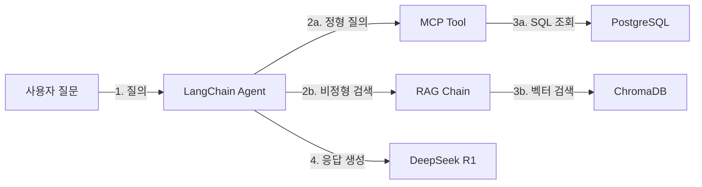
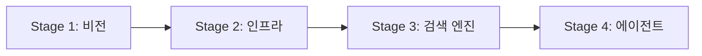

# 1장. 이 책의 목표와 최종 완성본 미리보기

이 장에서는 이 책 전체를 통해 무엇을 만드는지 미리 확인합니다. 최종 완성본의 데모를 직접 실행하고, 전체 아키텍처와 학습 로드맵을 한눈에 파악하는 것이 목표입니다.

---

<!-- [GEMINI PROMPT: 01_chapter-opening]
path: assets/CH01/01_chapter-opening.png
Warm office illustration: A young woman (28, developer) sits at a meeting room table surrounded by colleagues,
looking slightly anxious at a whiteboard filled with unfamiliar tech terms (RAG, MCP, Vector DB).
Soft color palette (warm beige, light blue), friendly cartoon style, showing the problem/challenge clearly,
no text overlay, clean background with subtle workplace elements. 16:9 aspect ratio.
Style: office-illustration-warm
-->

*그림 1-1: 팀 회의에서 낯선 기술 용어 앞에 멈추는 이서연*

---

이서연은 오전 팀 전체 회의에서 김도현 팀장의 발표를 듣고 있었습니다. 슬라이드에는 굵은 글씨로 이런 문장이 적혀 있었습니다.

> "연말까지 고객 문의 응답 시간을 10분에서 30초로 줄여라."

이어지는 화면에는 낯선 단어들이 줄줄이 등장했습니다. RAG, MCP, 벡터 DB, ChromaDB, LangChain. 이서연은 Python 경력 2년차지만, 이 용어들은 하나도 들어본 적이 없었습니다. 옆자리의 박민준 과장은 노트에 무언가를 받아 적고 있었고, 팀장은 화면에 데모 영상을 띄웠습니다.

터미널에 질문 하나가 입력되었습니다. "김철수 사원의 남은 연차는 며칠인가요?" 0.8초 뒤, 답변이 출력되었습니다. "김철수 사원의 남은 연차는 12일입니다. (총 15일 중 3일 사용)" 그리고 다음 질문. "연차 규정에서 특별휴가 신청 조건은 무엇인가요?" 이번에는 HR 매뉴얼의 특정 페이지를 인용하며 답변이 나왔습니다. 이서연은 잠시 멈췄습니다. '이걸 내가 만들 수 있다면.'

이 책은 그 데모를 처음부터 직접 구현하는 과정을 담고 있습니다.

---

## 1.1 이 책이 다루는 범위

### RAG를 선택한 이유: Fine-tuning과의 차이

AI를 사내 시스템에 도입하는 방법은 크게 두 가지입니다. 하나는 **파인튜닝(Fine-tuning)**, 다른 하나는 **RAG(Retrieval-Augmented Generation, 검색 증강 생성)** 입니다.

파인튜닝은 LLM 모델 자체를 사내 데이터로 다시 학습시키는 방식입니다. 모델이 사내 지식을 "기억"하게 만드는 것이라고 볼 수 있습니다. 그러나 이 방식은 수천~수만 건의 학습 데이터와 수십 GB의 GPU 메모리, 그리고 상당한 시간과 비용이 필요합니다. 문서가 업데이트될 때마다 재학습해야 한다는 것도 큰 단점입니다.

RAG는 다릅니다. 모델을 건드리지 않습니다. 사용자가 질문을 하면 외부 저장소에서 관련 문서를 검색하여 LLM에 함께 전달합니다. LLM은 그 문서를 읽고 답변을 생성합니다. 문서가 업데이트되면 저장소만 갱신하면 됩니다. 모델은 그대로입니다.

> **참고: 이 책이 다루지 않는 것**
> 이 책은 파인튜닝(Fine-tuning), 클라우드 LLM API(OpenAI, Anthropic), 프로덕션 배포(Kubernetes)를 다루지 않습니다. 모든 서비스는 로컬에서 무료로 실행되며, 클라우드 비용이 발생하지 않습니다.

### 정형 + 비정형 통합이 필요한 이유

실무에서 고객이 보내는 질문은 두 종류의 데이터를 동시에 필요로 합니다.

| 질문 유형 | 예시 | 필요한 데이터 |
|---------|------|------------|
| 정형 데이터 질의 | "김철수의 남은 연차는?" | PostgreSQL DB의 employees 테이블 |
| 비정형 문서 질의 | "특별휴가 신청 조건은?" | HR 매뉴얼 PDF의 특정 페이지 |
| 복합 질의 | "3분기 영업팀 매출과 관련 보고서를 함께 알려줘" | DB + 문서 동시 조회 |

DB만 연결하면 문서 질문에 답할 수 없습니다. 문서만 연결하면 정확한 수치 데이터를 가져오지 못합니다. 이 책의 목표는 두 가지를 하나의 에이전트로 처리하는 시스템을 구축하는 것입니다.

---

## 1.2 최종 결과물 미리보기

10개 챕터를 완료하면 아래 화면을 직접 만들게 됩니다. 웹 채팅 인터페이스에 복합 질문을 입력하면, 시스템이 정형 DB와 비정형 문서를 동시에 조회하여 출처가 포함된 답변을 반환합니다.

<!-- [CAPTURE NEEDED: 01_chat-ui-preview
  path: assets/CH01/ch01_chat_ui_preview.png
  target: CH09 완성본 웹 UI (http://localhost:8000)
  desc: 채팅 입력창에 "김철수 씨의 남은 연차와 연차 사용 기준을 알려주세요" 입력 후,
        AI 답변(잔여 연차 수치 + 규정 문서 발췌)과 출처(HR_취업규칙_v1.0.pdf)가 표시된 상태
] -->

*그림 1-2: 최종 완성본 웹 UI — 복합 질의에 출처가 포함된 AI 답변*

### 시나리오로 보는 처리 흐름

위 화면의 답변이 만들어지기까지 내부에서는 다음 과정이 0.8초 안에 실행됩니다.

인사팀 직원이 아래 질문을 입력합니다.

> "김철수 씨의 남은 연차가 며칠이고, 연차 사용 기준은 어떻게 되나요?"

이 질문에는 성격이 다른 두 가지 정보 요구가 섞여 있습니다.

- **"남은 연차가 며칠인가"** → 데이터베이스에서 조회해야 하는 **정형(Structured)** 데이터
- **"연차 사용 기준은 어떻게 되나"** → 사내 규정 문서에서 검색해야 하는 **비정형(Unstructured)** 데이터

| 단계 | 동작 | 구성 요소 |
|------|------|---------|
| ① 질문 라우팅 | "연차 잔여일" → 정형(DB), "연차 사용 기준" → 비정형(문서)으로 분류 | 질문 라우터 (LangChain) |
| ② MCP Tool 호출 | PostgreSQL에서 김철수의 잔여 연차를 SQL로 조회 | MCP Tool + PostgreSQL |
| ③ RAG Chain 호출 | "연차 사용 기준"으로 사내 규정 문서를 벡터 검색 | ChromaDB + 임베딩 모델 |
| ④ LLM 응답 합성 | DB 결과 + 문서 청크를 컨텍스트로 DeepSeek R1이 자연어 답변 생성 | Ollama (DeepSeek R1) |
| ⑤ 최종 답변 출력 | 출처 문서명이 포함된 답변 반환 | FastAPI 응답 |

단계 ②와 ③은 병렬로 실행됩니다. 두 결과가 모이면 LLM이 이를 통합하여 단일 답변으로 합성합니다.

```
김철수 씨의 남은 연차는 5일입니다.

연차 사용 기준 (사내 취업규칙 v1.0, 3조 2항):
- 연차는 최소 1일 단위로 사용 가능합니다.
- 3일 이상 연속 사용 시 팀장 사전 승인이 필요합니다.
- 미사용 연차는 다음 해 3월 31일까지 이월됩니다.

[출처: HR_취업규칙_v1.0.pdf, 3페이지]
```

---

## 1.3 전체 아키텍처 한 장 요약

이 책을 완독하면 아래 구조의 시스템이 완성됩니다.



*그림 1-3: 최종 완성 시스템 아키텍처*

각 구성요소의 역할을 정리하면 다음과 같습니다.

| 구성요소 | 역할 |
|--------|------|
| **LangChain Agent** | 질문을 분석하여 정형/비정형/복합 질의 중 어느 경로로 처리할지 결정합니다. |
| **MCP Tool** | 모델 컨텍스트 프로토콜(Model Context Protocol)로 FastAPI를 통해 PostgreSQL을 조회합니다. |
| **RAG Chain** | ChromaDB에서 관련 문서 청크를 검색하여 LLM에 컨텍스트로 전달합니다. |
| **PostgreSQL** | 직원, 연차, 매출 등 정형 데이터를 저장합니다. Docker Compose로 제공됩니다. |
| **ChromaDB** | 사내 문서를 벡터로 변환하여 저장하고, 의미 기반 유사도 검색을 수행합니다. |
| **DeepSeek R1** | Ollama로 로컬 실행되는 LLM입니다. 검색 결과를 바탕으로 최종 답변을 생성합니다. |

> **참고: 모든 서비스가 로컬에서 실행됩니다**
> 이 시스템은 클라우드 API를 전혀 사용하지 않습니다. Ollama(LLM 추론), ChromaDB(벡터 DB), PostgreSQL(관계형 DB) 모두 독자의 컴퓨터에서 실행됩니다. 추가 비용이 발생하지 않습니다.

이 아키텍처는 4단계로 나뉘어 구축됩니다.



*그림 1-4: 4 Stage 학습 로드맵*

| 단계 | 챕터 | 핵심 활동 |
|------|------|---------|
| Stage 1: 비전 및 기초 | CH01 - CH02 | 목표 확인 + DeepSeek-R1으로 기초 RAG 실습 |
| Stage 2: 인프라 및 표준화 | CH03 - CH05 | 환경 구축 + 베이스 시스템 확보 + 문서 표준화 |
| Stage 3: 지식 검색 엔진 | CH06 - CH07 | 벡터 DB 구축 + RAG Q&A 파이프라인 |
| Stage 4: 지능형 에이전트 | CH08 - CH10 | MCP+RAG 통합 + 프로덕션 연결 + 시스템 튜닝 |

---

## 1.4 사용 기술 스택 상세

이 책이 사용하는 기술 스택과 각 기술을 선택한 이유를 정리합니다.

| 역할 | 기술 | 버전 | 선택 이유 |
|------|------|------|---------|
| LLM 추론 엔진 | **Ollama** | 최신 안정 | 로컬에서 LLM을 실행하는 가장 간편한 방법입니다. `ollama run` 한 줄로 모델을 실행합니다. |
| 기본 LLM 모델 | **DeepSeek R1** | 최신 | 추론(Reasoning) 토큰을 지원하여 복잡한 정책 질문에 근거 기반 답변을 생성합니다. |
| 파이프라인 프레임워크 | **LangChain** | 0.3+ | Retriever, Prompt, LLM, Output Parser를 표준 인터페이스로 연결하는 산업 표준 프레임워크입니다. |
| 벡터 DB | **ChromaDB** | 최신 안정 | `pip install chromadb` 한 줄로 설치하며, 로컬 파일로 영속 저장됩니다. LangChain과 직접 통합됩니다. |
| 관계형 DB | **PostgreSQL** | 16 | Docker Compose로 제공됩니다. 직원, 연차, 매출 정형 데이터를 저장합니다. |
| API 서버 | **FastAPI** | 0.110+ | LLM이 PostgreSQL에 직접 SQL을 실행하지 않도록 API 레이어를 제공합니다. |
| 언어 | **Python** | 3.11 | 가상환경(venv)으로 프로젝트별 패키지를 격리합니다. |
| PDF 처리 | **PyMuPDF, pdfplumber** | 최신 | 텍스트와 테이블을 각각의 강점에 맞게 추출합니다. |
| 인프라 | **Docker Compose** | 최신 | PostgreSQL + FastAPI 서버를 한 줄 명령으로 실행합니다. |

> **참고: 왜 OpenAI가 아닌 Ollama인가**
> 이 책은 클라우드 LLM API를 사용하지 않습니다. OpenAI API는 호출당 비용이 발생하며, 사내 데이터를 외부 서버로 전송합니다. Ollama는 모든 추론이 독자의 컴퓨터에서 이루어지므로 비용이 없고 데이터가 외부로 나가지 않습니다.

---

## 1.5 이 책을 마치면 할 수 있는 것

이 책의 10개 챕터를 완독하면 아래 역량을 갖추게 됩니다.

<!-- [GEMINI PROMPT: 01_competency-map]
path: assets/CH01/01_competency-map.png
Clean flat-design competency map infographic showing 7 skills acquired after reading the book.
Two sections: LEFT group labeled "구축 역량 (4)" with icons for: (1) 문서 자동 색인 파이프라인, (2) RAG Q&A 엔진, (3) 통합 AI 에이전트, (4) 출처 기반 답변 시스템.
RIGHT group labeled "튜닝 역량 (3)" with icons for: (5) 증상별 정확도 개선, (6) ReRanker & Hybrid Search, (7) 30개 테스트셋 평가.
Center: book spine icon labeled "AI 업무 비서 구축". White background, sky-blue and slate-gray color palette, minimal icon style, no decorative elements, clear Korean labels for each skill.
Style: competency-infographic-flat
-->

*그림 1-5: 이 책을 마치면 갖추게 되는 7가지 역량*

**구축 역량**

1. 사내 문서(PDF, Word, Markdown)를 수집·전처리하여 벡터 DB에 자동 색인합니다.
2. 자연어 질문으로 사내 규정을 30초 이내에 검색하는 RAG Q&A 엔진을 구현합니다.
3. 정형 DB와 비정형 문서를 동시에 질의하는 통합 AI 에이전트를 운영합니다.
4. 출처 표시가 포함된 신뢰 가능한 AI 답변 시스템을 제공합니다.

**튜닝 역량**

5. 증상별 튜닝 가이드로 검색 정확도를 체계적으로 개선합니다.
6. ReRanker와 Hybrid Search를 적용하여 검색 품질을 향상시킵니다.
7. 30개 테스트셋으로 RAG 시스템을 평가하고 정량적으로 관리합니다.

### 챕터별 학습 로드맵

아래 표는 각 챕터에서 구현하는 핵심 기능의 전체 지도입니다. 이 표를 참고하여 현재 어느 단계에 있는지 파악하십시오.

| 챕터 | 제목 | 구현 기능 |
|------|------|---------|
| CH01 | 이 책의 목표와 최종 완성본 미리보기 | 전체 아키텍처 이해 + 최종 데모 체험 |
| CH02 | DeepSeek-R1으로 시작하는 기초 RAG 정복 | LLM 환각 체험 + 기초 RAG 구현 |
| CH03 | 개발 환경 구축 | Ollama + PostgreSQL + Python 가상환경 설정 |
| CH04 | 베이스 시스템 확보 | 사내 DB 스키마 분석 + CRUD API + MCP 개념 |
| CH05 | 사내 문서 표준화 | PDF/Word/Markdown 전처리 파이프라인 |
| CH06 | 벡터 DB 구축 | 텍스트 추출 + 청킹 + 임베딩 + ChromaDB 저장 |
| CH07 | RAG Q&A 엔진 구현 | LangChain RAG 파이프라인 + 출처 표시 |
| CH08 | 통합 에이전트 설계 (MCP + RAG) | 정형 DB + 비정형 문서 동시 질의 |
| CH09 | LangChain 최종 연결 | Router/Agent/RAG Chain/MCP Tool 프로덕션 연결 |
| CH10 | RAG 시스템 튜닝 | ReRanker + Hybrid Search + 평가 체계 |

<!-- [GEMINI PROMPT: 01_before-after]
path: assets/CH01/01_before-after.png
Simple before/after comparison infographic: LEFT side shows "사내 매뉴얼 3,000페이지 수동 검색"
with red indicator and large number "10분", RIGHT side shows "AI 업무 비서 자동 검색" with green
indicator and "30초", arrow in the middle labeled "이 책의 목표", clean flat design, white background,
minimalist black and white technical diagram style, 16:9 aspect ratio.
Style: before-after-infographic
-->

*그림 1-5: 이 책의 목표 — 고객 문의 응답 시간 10분에서 30초로 단축*

이서연이 처음 회의실에서 들었던 그 목표, "응답 시간 10분을 30초로 줄여라"는 CH10을 마치는 순간에 실현됩니다.

---

## 정리하며

- **RAG는 Fine-tuning이 아닙니다**: Fine-tuning은 모델 재학습이 필요하지만, RAG는 기존 문서를 그대로 외부 저장소로 활용합니다. 문서가 업데이트되어도 모델을 건드리지 않습니다.
- **정형 + 비정형 통합이 실무의 핵심입니다**: 고객 문의는 DB 수치와 문서 규정을 동시에 필요로 합니다. 이 책의 통합 에이전트는 두 가지 경로를 하나의 질문으로 처리합니다.
- **모든 서비스가 로컬에서 무료로 실행됩니다**: Ollama, ChromaDB, PostgreSQL 모두 독자의 컴퓨터에서 동작합니다. 클라우드 API 비용이 발생하지 않습니다.
- **4단계 로드맵으로 점진적으로 구축합니다**: Stage 1 비전 확인 → Stage 2 인프라 구축 → Stage 3 검색 엔진 완성 → Stage 4 통합 에이전트 완성 순서로 진행합니다.

**다음 챕터에서는**: CH02에서 DeepSeek-R1을 직접 실행합니다. "LLM에게 그냥 물어보면 되지 않나요?"라는 질문에서 시작하여, 환각(Hallucination)을 직접 체험하고, 그것이 왜 RAG로 이어지는지를 손으로 확인합니다.
