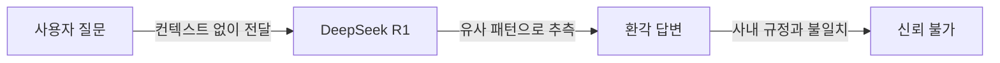
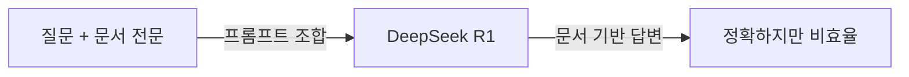
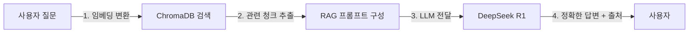
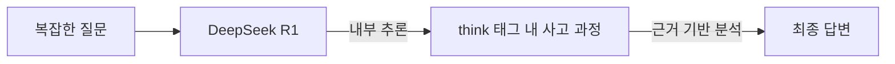
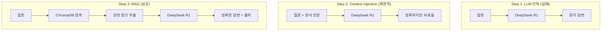

# 2. DeepSeek-R1으로 시작하는 기초 RAG 정복

이 장에서는 LLM에 직접 질의했을 때 발생하는 **환각(Hallucination)** 을 직접 체험하고, 그 한계를 넘기 위해 기초 RAG 파이프라인을 단계적으로 구현합니다. 실패 → 반쪽 성공 → 완전한 성공의 3단계를 이서연의 시행착오와 함께 따라가면서, RAG가 왜 필요한지 몸으로 납득하게 됩니다.

**이 장에서 학습하는 내용:**

- LLM 단독 질의가 사내 규정에 실패하는 이유
- 컨텍스트 직접 주입(Context Injection)의 작동 원리와 한계
- ChromaDB를 활용한 기초 RAG 파이프라인 구현
- DeepSeek R1의 추론 토큰이 제공하는 근거 기반 답변

---

<!-- [GEMINI PROMPT: 02_chapter-opening]
path: assets/CH02/02_chapter-opening.png
Warm office illustration of a young woman developer (28 years old, casual office attire) sitting at a desk with a laptop, looking at the screen with a curious and slightly puzzled expression, a speech bubble above showing a question mark and a document icon, soft color palette (warm beige, light blue), friendly cartoon style, showing the problem/challenge of searching through documents clearly, no text overlay, clean background with subtle workplace elements
Style: office-illustration-warm
-->

*그림 2-1: "LLM한테 그냥 물어보면 되지 않을까요?" 이서연의 첫 번째 아이디어*

---

CH01에서 이서연은 팀 전체 회의에서 낯선 기술 용어들 앞에 얼어붙었습니다. RAG, ChromaDB, MCP — 하나도 들어본 적 없는 이름들이었습니다. 하지만 김도현 팀장의 최종 데모를 보고 나서, 이서연에게는 한 가지 생각이 떠올랐습니다.

"저 데모에서 AI가 HR 규정을 정확히 답변하던데... 그냥 DeepSeek-R1한테 직접 물어보면 되는 거 아닌가요?"

팀 미팅이 끝난 후 이서연은 박민준 과장에게 조심스럽게 물었습니다.

박민준 과장은 잠깐 생각하더니 고개를 저었습니다.

"그게 안 되니까 RAG가 필요한 거야. 모델이 우리 회사 규정을 알 리가 없잖아. **데이터를 직접 줘야지.**"

이 장에서는 박민준 과장의 그 한마디를 코드로 직접 확인합니다.

---

## 2.1 [실패] LLM 단독 질의의 한계

### 실습 환경 준비

본 챕터의 예제 코드를 내려받아 실행 환경을 준비하십시오. 이 챕터는 PostgreSQL이나 별도 인프라 없이 Ollama와 로컬 ChromaDB만 사용합니다.

**사전 준비 — Ollama 설치 (최초 1회)**

```bash
# macOS
brew install ollama

# Ollama 서버 시작 (별도 터미널에서 유지)
ollama serve

# DeepSeek R1 모델 다운로드 (별도 터미널에서 실행)
ollama pull deepseek-r1
```

> **팁: 메모리가 부족할 경우**
> RAM이 8GB 미만이라면 소형 모델을 사용하십시오.
> `ollama pull deepseek-r1:1.5b`
> Ollama 없이도 실습을 진행할 수 있습니다. 연결에 실패하면 자동으로 Mock 모드로 전환되어 환각 패턴을 시뮬레이션합니다.

```bash
git clone https://github.com/{repo}/CH02_기초RAG
cd CH02_기초RAG
cp .env.example .env
python3 -m venv venv
source venv/bin/activate      # Windows: venv\Scripts\activate
pip install -r requirements.txt
```

### Step 1 실행 — 환각 체험

이제 LLM에 직접 질문해 보겠습니다.

```bash
python src/main.py --step 1
```

터미널에 다음과 같은 출력이 나타납니다.

```
============================================================
Step 1: LLM 단독 질의 — 환각(Hallucination) 체험
============================================================
모델: deepseek-r1
서버: http://localhost:11434

[Ollama 서버 연결 시도 중...]
[Mock 모드] Ollama 서버에 연결할 수 없습니다.
  현재는 환각 패턴을 시뮬레이션하는 Mock 응답을 사용합니다.

[질문 1] 커넥트HR의 연차 규정에서 신입사원 1년차 연차 일수는 몇 일입니까?
----------------------------------------
[LLM 응답]
커넥트HR의 신입사원 연차는 근로기준법에 따라 15일입니다. 단, 1년차에는
월 1일씩 부여되는 월차를 포함하여 최대 11일까지 사용할 수 있습니다.

경고: 이 답변은 정확하지 않을 수 있습니다.
      LLM은 사내 규정을 학습한 적이 없으므로,
      유사한 패턴으로 추측한 내용을 사실처럼 답변합니다.
      이것이 바로 '환각(Hallucination)'입니다.
```

> **주의: 출력 결과가 다를 수 있습니다**
> Ollama에 실제로 연결된 경우 DeepSeek R1이 생성하는 답변은 매 실행마다 달라집니다. 중요한 것은 답변의 정확성이 아니라, 실제 사내 규정과 비교했을 때 틀렸는지 여부입니다.

<!-- [CAPTURE NEEDED: 02_step1-hallucination
  path: assets/CH02/02_step1-hallucination.png
  desc: `python src/main.py --step 1` 실행 후 터미널 전체 화면 (Mock 모드 또는 실제 Ollama 환각 응답 표시 상태)
] -->

*그림 2-2: Step 1 실행 결과 — LLM이 사내 규정을 추측하여 잘못된 답변을 생성한다*

### 환각의 핵심 코드 — `query_llm_directly`

이 동작의 핵심은 `src/llm_direct.py`의 `query_llm_directly` 함수입니다.

```python
def query_llm_directly(question: str, client: Optional[object]) -> str:
    """LLM에 컨텍스트 없이 직접 질의합니다."""

    # --- Input ---
    prompt = f"""다음 질문에 답하십시오.

질문: {question}

답변:"""

    # --- Process ---
    if client is None:
        question_index = (
            HALLUCINATION_QUESTIONS.index(question)
            if question in HALLUCINATION_QUESTIONS
            else 0
        )
        response = MOCK_HALLUCINATION_RESPONSES[
            question_index % len(MOCK_HALLUCINATION_RESPONSES)
        ]
    else:
        response = client.invoke(prompt)

    # --- Output ---
    return response
```

> 전체 코드는 GitHub 저장소 `src/llm_direct.py`를 참고하십시오.

#### 코드 워크플로우 (Code Workflow)

1. **입력(Input)**: 사용자 질문 문자열과 Ollama 클라이언트 객체를 받습니다. 클라이언트가 `None`이면 Mock 모드로 동작합니다.
2. **처리(Process)**: 질문을 그대로 프롬프트에 담아 LLM에 전달합니다. 사내 규정 관련 컨텍스트는 전혀 포함되지 않습니다.
3. **출력(Output)**: LLM이 생성한 응답 문자열을 반환합니다. 실제 사내 데이터 없이 학습된 패턴으로 추측한 답변입니다.

### 환각(Hallucination)이 발생하는 원리

**환각(Hallucination)** 이란 LLM이 학습 데이터에 없는 내용을 사실처럼 생성하는 현상입니다. 도서관 비유를 들면, LLM은 수억 권의 책을 읽은 사서와 같습니다. 그 사서에게 "커넥트HR 내부 규정집"을 물으면, 규정집을 읽은 적이 없으므로 비슷한 회사 규정을 조합하여 그럴듯한 답을 만들어냅니다.

이것이 문제입니다. 모델은 틀렸다는 것을 모릅니다. 확신에 차서 답변합니다.



*그림 2-3: LLM 단독 질의 흐름 — 사내 규정 없이 추측한 답변이 생성된다*

정리하면, LLM 단독 질의가 실패하는 이유는 다음과 같습니다.

- LLM의 학습 데이터에 사내 규정이 포함되지 않았습니다.
- 모델은 "모른다"고 말하는 대신 유사한 패턴으로 답을 생성합니다.
- 답변이 틀렸더라도 자신 있게 서술하므로 사용자가 구별하기 어렵습니다.

---

## 2.2 [반쪽 성공] 프롬프트 직접 주입

이서연은 박민준 과장의 말을 떠올렸습니다. "데이터를 직접 줘야지." 그렇다면 직접 주면 되는 것 아닌가? 이서연은 HR 규정 문서 전문을 복사하여 프롬프트에 붙여넣어 보았습니다.

### 컨텍스트 주입(Context Injection)이란

**컨텍스트 주입(Context Injection)** 은 프롬프트 안에 참고할 문서를 직접 포함시키는 방식입니다. LLM은 프롬프트 전체를 읽고 그 안에 있는 내용을 근거로 답변합니다.



*그림 2-4: 컨텍스트 주입 흐름 — 문서를 직접 붙여넣으면 정확도가 올라가지만 한계가 있다*

### Step 2 실행

```bash
python src/main.py --step 2
```

이번에는 답변이 정확해집니다. HR 규정 문서를 프롬프트에 담았기 때문에 모델이 정확한 내용을 참고하여 답변합니다. 이서연은 잠깐 기뻐했지만, 곧 문제를 발견했습니다.

### 컨텍스트 주입의 한계

> **참고: 토큰 윈도우(Token Window)란**
> LLM은 한 번에 처리할 수 있는 텍스트 길이에 제한이 있습니다. 이 제한을 토큰 윈도우라고 합니다. 예를 들어 토큰 윈도우가 4,096 토큰이라면, 프롬프트와 문서와 질문을 합친 전체 길이가 이 제한을 넘으면 안 됩니다.

**문서가 하나일 때는 작동합니다.** 그러나 커넥트HR에는 HR 규정만 있는 것이 아닙니다. 영업 매뉴얼, IT 보안 정책, 복리후생 안내서... 3,000페이지가 있습니다.

| 문제 | 설명 |
|------|------|
| 토큰 한계 | 긴 문서 전체를 프롬프트에 넣으면 토큰 윈도우를 초과합니다 |
| 확장성 부재 | 문서가 10개, 100개로 늘어날수록 프롬프트 크기가 선형으로 증가합니다 |
| 응답 지연 | 토큰이 많을수록 LLM 처리 시간과 비용이 급증합니다 |
| 관련 없는 정보 | 모든 문서를 넣으면 LLM이 관련 없는 내용에 혼란을 겪습니다 |

박민준 과장이 이서연의 화면을 보더니 말했습니다.

"그렇게 하면 문서 하나는 되는데, 나중에 문서가 50개, 100개 되면 어쩔 거야? 프롬프트가 책 한 권 분량이 될 텐데."

이서연은 고개를 끄덕였습니다. **필요한 문서만 찾아서** 넣어야 합니다. 그것이 바로 검색입니다.

---

## 2.3 [성공] VectorDB와 RAG의 시작

이서연이 선택한 해결책은 **ChromaDB** 였습니다. 문서를 미리 저장해 두고, 질문이 들어오면 관련 문서만 검색하여 LLM에 전달하는 방식입니다. 이것이 RAG의 핵심입니다.

### RAG 파이프라인 3단계



*그림 2-5: RAG 파이프라인 3단계 — 검색 → 컨텍스트 구성 → 생성*

RAG는 세 단계로 동작합니다.

1. **검색(Retrieve)**: 질문을 벡터로 변환하고 ChromaDB에서 의미적으로 유사한 문서를 찾습니다.
2. **컨텍스트 구성(Augment)**: 검색된 문서 조각(청크)을 프롬프트에 포함시킵니다.
3. **생성(Generate)**: LLM이 검색된 컨텍스트를 근거로 답변을 생성합니다.

컨텍스트 주입과의 차이는 명확합니다. 컨텍스트 주입은 모든 문서를 전달하지만, RAG는 **관련 문서만** 전달합니다.

### Step 3 실행 — 기초 RAG 성공

```bash
python src/main.py --step 3
```

```
============================================================
Step 3: 기초 RAG — ChromaDB + LLM 파이프라인
============================================================

[1단계] ChromaDB 인메모리 컬렉션에 HR 문서 저장 중...
        완료: 3개 문서 저장됨

[2단계] 사용자 질문: 커넥트HR의 연차 규정에서 신입사원 1년차 연차 일수는 몇 일입니까?

[3단계] ChromaDB에서 관련 문서 검색 중...
        2개 관련 문서 검색 완료

  [검색 결과 1]
  출처: HR-인사규정-2024.pdf (페이지 3)
  내용 미리보기: 커넥트HR 연차유급휴가 규정 (제1조)...

[4단계] 검색된 문서로 RAG 프롬프트 구성...
        프롬프트 길이: 842자 (전체 문서 대비 최소화)

[6단계] LLM 답변 생성 중...

============================================================
[최종 답변]
============================================================
검색된 커넥트HR 인사 규정(HR-인사규정-2024.pdf, 3페이지)에 따르면,
신입사원(근속 1년 미만)은 입사 후 매월 1일씩 월차를 부여받아
최대 11일을 사용할 수 있습니다.

[출처 문서]
  1. HR-인사규정-2024.pdf — 페이지 3

============================================================
[결론] RAG 파이프라인이 성공적으로 작동했습니다!
```

<!-- [CAPTURE NEEDED: 02_step3-rag-success
  path: assets/CH02/02_step3-rag-success.png
  desc: `python src/main.py --step 3` 실행 후 터미널 전체 화면 (RAG 답변과 출처 문서가 함께 표시된 상태)
] -->

*그림 2-6: Step 3 실행 결과 — RAG가 정확한 답변과 출처를 함께 반환한다*

이서연은 화면을 보며 말했습니다. "이게 RAG구나."

### RAG 핵심 코드 발췌 — `search_similar_documents`

Step 3의 핵심은 `src/simple_rag.py`의 유사도 검색 함수입니다.

```python
def search_similar_documents(
    collection: chromadb.Collection,
    query: str,
    top_k: int = TOP_K,
) -> list[dict[str, str]]:
    """질문과 유사한 문서를 ChromaDB에서 검색합니다."""

    # --- Input ---
    results = collection.query(
        query_texts=[query],
        n_results=min(top_k, collection.count()),
    )

    # --- Process ---
    retrieved_docs: list[dict[str, str]] = []
    if results["documents"] and results["documents"][0]:
        for i, doc_content in enumerate(results["documents"][0]):
            metadata = results["metadatas"][0][i] if results["metadatas"] else {}
            retrieved_docs.append(
                {
                    "content": doc_content,
                    "source": metadata.get("source", "알 수 없음"),
                    "page": metadata.get("page", "0"),
                }
            )

    # --- Output ---
    return retrieved_docs
```

> 전체 코드는 GitHub 저장소 `src/simple_rag.py`를 참고하십시오.

#### 코드 워크플로우 (Code Workflow)

1. **입력(Input)**: ChromaDB 컬렉션 객체, 사용자 질문 문자열, 반환할 최대 문서 수(`top_k`)를 받습니다.
2. **처리(Process)**: `collection.query`가 질문을 벡터로 변환하고 저장된 문서들과 유사도를 비교하여 상위 `top_k`개를 선택합니다. 각 문서의 내용과 메타데이터(출처, 페이지)를 딕셔너리로 조합합니다.
3. **출력(Output)**: 검색된 문서 목록을 반환합니다. 각 항목에 `content`, `source`, `page` 키가 포함됩니다.

### RAG 프롬프트 구성 — `build_rag_prompt`

검색된 문서를 LLM에 전달하는 방식도 중요합니다. `build_rag_prompt` 함수가 이를 담당합니다.

```python
def build_rag_prompt(question: str, retrieved_docs: list[dict[str, str]]) -> str:
    """검색된 문서를 바탕으로 RAG 프롬프트를 구성합니다."""

    # --- Input ---
    context_parts: list[str] = []
    for i, doc in enumerate(retrieved_docs, start=1):
        context_parts.append(
            f"[문서 {i}] 출처: {doc['source']} (페이지 {doc['page']})\n{doc['content']}"
        )
    context = "\n\n".join(context_parts)

    # --- Process ---
    prompt = f"""다음 검색된 사내 문서만을 근거로 질문에 답하십시오.
문서에 없는 내용은 "해당 정보가 문서에 없습니다"라고 답하십시오.

[검색된 문서]
{context}

[질문]
{question}

[답변]"""

    # --- Output ---
    return prompt
```

#### 코드 워크플로우 (Code Workflow)

1. **입력(Input)**: 사용자 질문과 `search_similar_documents`가 반환한 문서 목록을 받습니다.
2. **처리(Process)**: 각 문서의 출처, 페이지, 내용을 포맷팅하여 컨텍스트 블록을 만듭니다. "문서에 없는 내용은 모른다고 답하라"는 지시를 포함시켜 환각을 억제합니다.
3. **출력(Output)**: LLM에 전달할 완성된 프롬프트 문자열을 반환합니다.

> **팁: "모르면 모른다고 답하라"는 지시의 중요성**
> 프롬프트에 "해당 정보가 문서에 없습니다"라고 답하라는 지시를 명시적으로 포함하면, LLM이 문서에 없는 내용을 추측하려는 경향을 크게 줄일 수 있습니다. 이것이 RAG 시스템에서 환각을 억제하는 가장 기본적인 프롬프트 기법입니다.

### 임베딩(Embedding)이란

> **참고: 벡터 유사도 검색의 원리**
> **임베딩(Embedding)** 이란 텍스트를 숫자 배열(벡터)로 변환하는 과정입니다. "연차 규정"과 "휴가 일수"는 단어가 다르지만, 임베딩 후에는 벡터 공간에서 가까운 위치에 놓입니다. ChromaDB는 이 거리를 계산하여 의미적으로 유사한 문서를 찾습니다. 도서관에서 "비슷한 주제의 책"을 찾는 원리와 같습니다.

이 챕터에서는 ChromaDB의 기본 임베딩 함수(`DefaultEmbeddingFunction`)를 사용합니다. 별도의 모델 설치 없이도 동작하도록 설계되어 있습니다. 더 정확한 한국어 임베딩은 CH06에서 `nomic-embed-text` 모델로 업그레이드합니다.

---

## 2.4 [심화] DeepSeek-R1 추론(Reasoning) 활용

RAG로 정확한 답변을 얻었지만, 더 복잡한 질문이 들어온다면 어떻게 될까요? "신입사원이 입사 6개월 만에 특별 프로젝트로 야근을 많이 했는데, 연차를 추가로 받을 수 있나요?"처럼 여러 규정을 종합 판단해야 하는 질문입니다.

DeepSeek R1에는 이런 복잡한 질문을 위한 특별한 기능이 있습니다.

### 추론 토큰(Reasoning Token)

**추론 토큰(Reasoning Token)** 은 DeepSeek R1이 최종 답변을 내놓기 전에 스스로 사고 과정을 정리하는 특수 토큰입니다. 모델이 `<think>` 태그 안에 중간 추론 과정을 기록하고, 그 결과를 바탕으로 최종 답변을 생성합니다.



*그림 2-7: DeepSeek R1 추론 흐름 — 사고 과정을 거쳐 근거 있는 답변을 생성한다*

### Step 4 실행 — 추론 모드

```bash
python src/main.py --step 4
```

실제 DeepSeek R1에 연결된 경우, 응답에 `<think>...</think>` 블록이 포함되어 모델이 어떤 과정으로 결론에 도달했는지 확인할 수 있습니다.

| 비교 항목 | 단순 LLM 답변 | DeepSeek R1 추론 답변 |
|----------|-------------|---------------------|
| 복잡한 규정 해석 | 단순 암기 패턴 반복 | 규정 간 관계 분석 후 종합 판단 |
| 근거 제시 | 없음 | 추론 과정 명시 |
| 애매한 질문 처리 | 추측으로 답변 | 불확실성을 명시하고 가능한 해석 제시 |

> **참고: 추론 토큰 활용 시점**
> 모든 질문에 추론 모드를 사용할 필요는 없습니다. 단순 사실 조회("연차 일수는?")는 일반 모드가 빠릅니다. 여러 규정을 종합해야 하거나 예외 상황을 판단해야 할 때 추론 모드가 효과적입니다. CH10 튜닝 챕터에서 상황별 모드 선택 전략을 다룹니다.

---

## 2.5 3단계 비교 정리

이 장에서 이서연이 직접 체험한 3단계를 한눈에 비교합니다.



*그림 2-8: 3단계 접근법 비교 — LLM 단독 → Context Injection → RAG*

| 접근 방식 | 정확도 | 확장성 | 출처 표시 |
|----------|--------|--------|---------|
| LLM 단독 질의 | 낮음 (환각) | 해당 없음 | 없음 |
| Context Injection | 높음 | 낮음 (토큰 한계) | 없음 |
| 기초 RAG | 높음 | 높음 | 있음 |

<!-- [GEMINI PROMPT: 02_rag-comparison]
path: assets/CH02/02_rag-comparison.png
Simple before/after comparison infographic: LEFT side shows "LLM 단독 질의" with red X indicator, showing a direct arrow from question to LLM with hallucination output labeled "환각 답변", RIGHT side shows "RAG 파이프라인" with green checkmark indicator, showing question going through document search (ChromaDB) before reaching LLM, then accurate answer with source citation, clean flat design, white background, Korean labels
Style: before-after-infographic
-->

*그림 2-9: LLM 단독 질의와 RAG 파이프라인의 결과 비교*

---

## 2.6 정리하며

이 장에서 이서연은 "LLM한테 그냥 물어보면 되지 않나요?"라는 질문에서 시작하여 기초 RAG 파이프라인을 직접 구현하는 성과를 거뒀습니다.

- **LLM 단독 질의는 사내 규정을 알지 못합니다**: 모델은 학습 데이터에 없는 사내 규정을 유사 패턴으로 추측하여 환각 응답을 생성합니다. 답변이 확신에 차 있어도 틀릴 수 있습니다.

- **Context Injection은 문서가 적을 때만 유효합니다**: 문서 전문을 프롬프트에 직접 삽입하면 정확도는 올라가지만, 토큰 윈도우 한계와 확장성 문제로 실무에서는 사용할 수 없습니다.

- **RAG는 검색 → 컨텍스트 구성 → 생성의 3단계로 동작합니다**: ChromaDB가 관련 문서만 검색하여 LLM에 전달합니다. 토큰 절약, 정확도 향상, 출처 표시를 동시에 확보합니다.

- **DeepSeek R1의 추론 토큰은 복잡한 분석에 유리합니다**: `<think>` 블록을 통해 사고 과정을 명시하고, 근거 있는 답변을 생성합니다.

---

**다음 장에서는** Ollama, PostgreSQL, Python 가상환경을 체계적으로 설치하고 팀 전체가 동일한 환경에서 개발할 수 있도록 개발 환경을 구축합니다. 이 장에서 Mock 모드로 실행했던 실습을 실제 DeepSeek R1과 함께 진행하게 됩니다.
