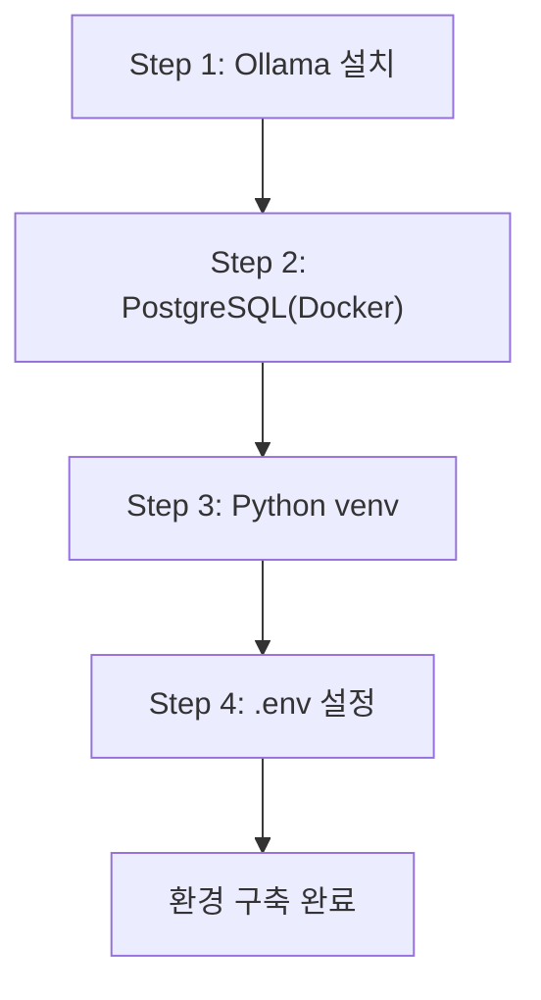

# 3장. 개발 환경 구축

이 장에서는 AI 업무 비서를 구동하기 위한 세 가지 핵심 인프라인 **Ollama**, **PostgreSQL**, **Python 가상환경** 을 설치하고, `.env` 기반 환경 변수 설정까지 완료합니다. 장을 마치면 `setup_check.py` 스크립트가 5개 항목을 모두 PASS로 출력합니다.

<!-- GEMINI_IMAGE
Prompt: Warm office illustration of a young developer (28, female) sitting at her desk surrounded by three separate terminal windows — one showing a dependency conflict error, one showing a network download failure, and one showing a port conflict warning. She looks frustrated but determined. Soft color palette (warm beige, light blue), friendly cartoon style, clean background with subtle workplace elements.
Style: office-illustration-warm
Alt: 이서연이 연속된 설치 실패로 당혹스러워하는 모습
-->

*그림 3-1: 설치 오류 세 개가 동시에 터지다 — 이서연의 첫날*

---

이서연은 2장을 마친 뒤 기분이 좋았습니다. ChromaDB에 문서를 저장하고 첫 번째 RAG 검색까지 확인했기 때문입니다. 다음 날 아침, 이서연은 팀원들 모두가 동일한 환경에서 개발을 이어갈 수 있도록 본격적인 환경 구축에 착수했습니다.

첫 번째 시도: PostgreSQL 16을 노트북에 직접 설치했습니다. 그런데 이미 설치된 PostgreSQL 14와 포트가 충돌했습니다. 두 번째 시도: `ollama pull deepseek-r1` 명령을 실행했지만, 4.7GB 모델을 절반쯤 내려받다가 네트워크 타임아웃으로 실패했습니다. 세 번째 시도: `pip install langchain` 명령을 실행했지만, 기존 프로젝트의 패키지와 버전이 충돌했습니다.

오전 내내 세 가지 실패를 반복하던 이서연을 보던 김도현 팀장이 말했습니다.

> "이서연 씨, 이런 삽질을 팀원 모두가 반복하면 안 되죠. 공통 설치 스크립트를 만들고, Docker로 DB를 격리합시다. 한 번 제대로 만들면 팀 전체가 혜택을 받습니다."

그 한 마디가 이 장 전체의 방향을 결정했습니다. 개인의 설치 성공이 아니라, **팀 전체가 동일한 환경에서 즉시 시작할 수 있는 표준 환경** 을 구축하는 것입니다.

---

## 3.1 Ollama 설치 및 DeepSeek R1 모델 다운로드

**Ollama** 는 로컬에서 대규모 언어 모델을 실행하는 오픈소스 추론 엔진입니다. 도서관에 비유하자면, LLM이라는 책을 실제로 읽어주는 사서 역할을 합니다. 이 책의 모든 실습은 외부 클라우드 API 없이 Ollama를 통해 DeepSeek R1 모델을 로컬에서 실행합니다.

### 3.1.1 개발 환경 구축 전체 흐름

본격적인 설치에 앞서 전체 흐름을 파악하십시오. 4단계를 순서대로 완료하면 개발 환경이 완성됩니다.



*그림 3-2: 개발 환경 구축 4단계 흐름*

### 3.1.2 OS별 Ollama 설치

**macOS / Linux**

```bash
# Ollama 공식 설치 스크립트 실행
curl -fsSL https://ollama.com/install.sh | sh

# 설치 완료 확인
ollama --version
```

#### 코드 워크플로우 (Code Workflow)

1. **입력(Input)**: Ollama 공식 설치 스크립트 URL
2. **처리(Process)**: `curl`로 스크립트를 내려받아 `sh`로 즉시 실행 — 시스템에 `ollama` 바이너리를 설치하고 서비스를 등록합니다
3. **출력(Output)**: `ollama 0.x.x` 형식의 버전 문자열 출력

**Windows**

Ollama 공식 사이트(https://ollama.com/download)에서 Windows 설치 파일(`.exe`)을 내려받아 실행합니다. 설치 완료 후 PowerShell을 새로 열고 아래 명령으로 설치를 확인하십시오.

```powershell
ollama --version
```

> **주의: Windows 네이티브 환경 제한**
> Windows 네이티브 환경에서는 일부 쉘 스크립트가 동작하지 않습니다. 가능하면 WSL2(Windows Subsystem for Linux)를 설치하고 Ubuntu 환경에서 실습하십시오. Docker Desktop도 WSL2 백엔드를 사용하면 성능과 호환성이 크게 향상됩니다.

### 3.1.3 DeepSeek R1 모델 다운로드

Ollama 설치 후 DeepSeek R1 모델을 로컬에 내려받습니다.

```bash
# 기본 모델 다운로드 (약 4.7GB, 8GB RAM 이상 권장)
ollama pull deepseek-r1

# 소형 모델 다운로드 (약 1GB, 4GB RAM에서도 동작)
# RAM이 부족한 경우 이 명령을 사용하십시오.
ollama pull deepseek-r1:1.5b

# 다운로드된 모델 목록 확인
ollama list
```

#### 코드 워크플로우 (Code Workflow)

1. **입력(Input)**: 모델 이름 (`deepseek-r1` 또는 `deepseek-r1:1.5b`)
2. **처리(Process)**: Ollama 레지스트리에서 모델 파일을 내려받아 로컬 캐시에 저장합니다
3. **출력(Output)**: `ollama list` 명령 실행 시 `deepseek-r1` 항목이 표시됩니다

> **팁: Ollama 모델 선택 기준 (RAM 기준)**
> - 4GB RAM: `deepseek-r1:1.5b` (약 1GB 모델 파일)
> - 8GB RAM: `deepseek-r1` 기본 모델 (약 4.7GB)
> - 16GB RAM 이상: `deepseek-r1:7b` 또는 `deepseek-r1:14b` 고성능 모델
>
> 처음에는 기본 모델을 사용하고, 10장 튜닝 단계에서 모델 크기를 조정하십시오.

### 3.1.4 Ollama 서버 시작 및 확인

모델 다운로드 후 Ollama 서버를 시작합니다. macOS와 Windows에서는 설치 시 자동으로 서비스가 등록되지만, Linux에서는 수동으로 시작해야 할 수 있습니다.

```bash
# Ollama 서버 수동 시작 (백그라운드 실행)
ollama serve &

# 서버 동작 확인 (HTTP 200 응답이 오면 정상)
curl http://localhost:11434/api/tags
```

<!-- [CAPTURE NEEDED: 03_ollama-list
  path: assets/CH03/03_ollama-list.png
  desc: `ollama list` 실행 후 deepseek-r1 모델이 목록에 나타난 터미널 화면
] -->

*그림 3-3: `ollama list` 실행 결과 — deepseek-r1 모델 다운로드 완료*

---

## 3.2 PostgreSQL 설치 및 초기 설정 (Docker Compose)

PostgreSQL을 노트북에 직접 설치하면 이서연처럼 버전 충돌, 포트 충돌, 데이터 초기화 실패 등의 문제를 반복해서 겪게 됩니다. 이 책은 **Docker Compose** 를 사용하여 PostgreSQL을 완전히 격리합니다.

**도커 컴포즈(Docker Compose)** 는 여러 컨테이너를 YAML 파일 하나로 정의하고 한 번에 실행하는 도구입니다. 아파트 인터폰 배선도처럼, 어떤 서비스가 어느 포트로 연결되는지 한눈에 파악할 수 있습니다.

### 3.2.1 왜 Docker Compose를 사용하는가

| 비교 항목 | 직접 설치 | Docker Compose |
|----------|----------|----------------|
| 버전 관리 | 시스템 전역 설치, 충돌 위험 | 컨테이너 내부 격리, 충돌 없음 |
| 팀 공유 | 팀원마다 수동 재설치 | `docker-compose up -d` 한 줄로 동일 환경 재현 |
| 데이터 초기화 | 수동 스크립트 실행 | `docker-compose down -v`로 즉시 초기화 |
| 삭제 | 시스템 패키지 제거 | 컨테이너 삭제로 깔끔하게 제거 |

### 3.2.2 레포지토리 클론 및 PostgreSQL 시작

먼저 이 챕터의 예제 레포지토리를 클론합니다.

```bash
git clone https://github.com/{repo}/CH03_개발환경구축
cd CH03_개발환경구축
```

`docker-compose.yml` 파일이 PostgreSQL 16 컨테이너를 정의합니다. 이 파일의 핵심 설정을 살펴봅니다.

```yaml
# docker-compose.yml (핵심 설정 발췌)
services:
  postgres:
    image: postgres:16
    environment:
      POSTGRES_DB: connecthr
      POSTGRES_USER: admin
      POSTGRES_PASSWORD: password
    ports:
      - "5432:5432"
    volumes:
      - ./data/postgres:/var/lib/postgresql/data
```

#### 코드 워크플로우 (Code Workflow)

1. **입력(Input)**: `docker-compose.yml` 파일 — 이미지 버전, 환경 변수, 포트, 볼륨 정보가 포함됩니다
2. **처리(Process)**: Docker가 `postgres:16` 이미지를 내려받고, `connecthr` 데이터베이스를 자동 생성하며, 5432 포트를 호스트에 연결합니다
3. **출력(Output)**: 로컬 5432 포트로 접근 가능한 PostgreSQL 16 서버, 데이터는 `./data/postgres` 폴더에 영구 보존됩니다

아래 명령으로 PostgreSQL 컨테이너를 백그라운드에서 시작합니다.

```bash
docker-compose up -d
```

정상적으로 시작되면 아래와 같은 출력이 나타납니다.

```
[+] Running 1/1
 ✔ Container ch03_개발환경구축-postgres-1  Started
```

> **주의: Docker Desktop이 설치되지 않은 경우**
> `docker-compose up -d` 명령 실행 시 `Cannot connect to the Docker daemon` 오류가 발생한다면 Docker Desktop이 설치되지 않았거나 실행 중이지 않은 것입니다. https://www.docker.com/products/docker-desktop 에서 Docker Desktop을 설치한 뒤 다시 시도하십시오.

### 3.2.3 PostgreSQL 연결 확인

컨테이너가 시작된 후 PostgreSQL 연결을 확인합니다.

```bash
# Docker 컨테이너 내부에서 psql 실행
docker exec -it ch03_개발환경구축-postgres-1 psql -U admin -d connecthr

# psql 프롬프트에서 데이터베이스 목록 확인
\l

# psql 종료
\q
```

`connecthr` 데이터베이스가 목록에 표시되면 PostgreSQL 설정이 완료된 것입니다.

<!-- [GEMINI PROMPT: 03_docker-why]
path: assets/CH03/03_docker-why.png
Minimalist flat-design infographic showing Docker Compose isolating multiple services in separate containers. LEFT side shows a messy laptop with conflicting icons (PostgreSQL 14 vs 16, pip conflicts), labeled "직접 설치 — 충돌 발생". RIGHT side shows a clean diagram with three separate container boxes (PostgreSQL, FastAPI, ChromaDB), each in its own isolated box, all running side by side, labeled "Docker Compose — 격리 실행". Arrow pointing right in the middle. White background, clean line art, Korean labels, 16:9 aspect ratio.
Style: diagram-flat-technical
-->

*그림 3-4: Docker Compose — 각 서비스를 독립된 컨테이너로 격리하는 원리*

---

## 3.3 Python 3.11 가상환경 및 패키지 설치

**가상환경(Virtual Environment)** 은 프로젝트별로 독립된 Python 패키지 공간을 만드는 도구입니다. 서로 다른 버전의 패키지가 필요한 프로젝트 A와 프로젝트 B를 동시에 개발할 때, 두 프로젝트의 패키지가 섞이지 않도록 각각의 공간에 격리합니다.

이서연이 겪었던 `pip` 충돌이 바로 가상환경 없이 전역(global) 환경에 모든 패키지를 설치했기 때문에 발생한 문제입니다.

### 3.3.1 Python 3.11 버전 확인

가상환경 생성 전에 Python 3.11이 설치되어 있는지 확인합니다.

```bash
python3 --version
# 또는
python --version
```

`Python 3.11.x` 형식의 출력이 나타나야 합니다.

> **주의: Python 3.11 외 버전 사용 시 호환성 문제**
> 이 책의 실습 코드는 Python 3.11을 기준으로 작성되었습니다. Python 3.10 이하에서는 타입 힌트 문법 오류가 발생할 수 있고, Python 3.12 이상에서는 일부 패키지의 의존성이 맞지 않을 수 있습니다. https://www.python.org/downloads/ 에서 Python 3.11 최신 버전을 설치하십시오.

### 3.3.2 가상환경 생성 및 활성화

**macOS / Linux**

```bash
# 가상환경 생성 (venv 폴더에 생성됨)
python3 -m venv venv

# 가상환경 활성화
source venv/bin/activate

# 활성화 확인 (프롬프트 앞에 (venv) 가 붙으면 성공)
which python
```

**Windows**

```powershell
# 가상환경 생성
python -m venv venv

# 가상환경 활성화
venv\Scripts\activate

# 활성화 확인
where python
```

#### 코드 워크플로우 (Code Workflow)

1. **입력(Input)**: `python3 -m venv venv` 명령과 현재 디렉토리 경로
2. **처리(Process)**: 현재 디렉토리 아래 `venv/` 폴더를 생성하고, Python 인터프리터와 pip를 격리된 공간에 복사합니다
3. **출력(Output)**: 활성화 후 터미널 프롬프트 앞에 `(venv)` 접두사가 표시되며, 이후 `pip install` 명령은 이 격리된 공간에만 영향을 미칩니다

### 3.3.3 패키지 설치

가상환경이 활성화된 상태에서 `requirements.txt`에 정의된 패키지를 설치합니다.

```bash
pip install -r requirements.txt
```

#### 코드 워크플로우 (Code Workflow)

1. **입력(Input)**: `requirements.txt` 파일 — 각 패키지 이름과 버전이 고정되어 있습니다
2. **처리(Process)**: pip가 목록의 패키지를 순서대로 내려받아 `venv/` 내부에 설치합니다. 버전이 고정되어 있으므로 팀원 모두가 동일한 버전을 사용합니다
3. **출력(Output)**: `Successfully installed ...` 메시지와 함께 설치 완료

`requirements.txt`의 주요 패키지와 각 역할은 다음과 같습니다.

| 패키지 | 버전 | 역할 |
|--------|------|------|
| `langchain` | 0.3+ | RAG 파이프라인 프레임워크 (CH07) |
| `langchain-community` | 0.3+ | ChromaDB 등 커뮤니티 통합 모듈 |
| `langchain-ollama` | 최신 | Ollama LLM 연동 모듈 |
| `chromadb` | 최신 안정 | 벡터 데이터베이스 (CH06) |
| `psycopg2-binary` | 최신 | PostgreSQL Python 드라이버 |
| `python-dotenv` | 최신 | `.env` 파일 로딩 |
| `requests` | 최신 | HTTP 요청 (Ollama API 연결) |
| `fastapi` | 0.110+ | CRUD API 서버 (CH04) |

> **팁: 패키지 설치 오류가 발생하는 경우**
> 설치 중 오류가 발생하면 먼저 가상환경이 활성화되어 있는지 확인하십시오. 터미널 프롬프트 앞에 `(venv)` 가 없으면 `source venv/bin/activate`(macOS/Linux) 또는 `venv\Scripts\activate`(Windows) 명령을 다시 실행하십시오.

---

## 3.4 환경 변수(.env) 구성 및 LLM Provider 스위칭 설계

API 키, 데이터베이스 비밀번호, 모델 이름 같은 설정값을 코드에 직접 하드코딩하면 두 가지 문제가 생깁니다. 첫째, 코드를 GitHub에 올리면 비밀번호가 노출됩니다. 둘째, 모델을 바꾸려면 소스 코드를 수정하고 다시 배포해야 합니다.

`.env` 파일 분리는 이 두 문제를 동시에 해결합니다. 설정값은 `.env` 파일에 저장하고, 코드는 환경 변수 이름만 참조합니다.

### 3.4.1 .env 파일 설정

`.env.example` 파일을 복사하여 `.env` 파일을 생성합니다.

```bash
cp .env.example .env
```

`.env` 파일을 열어 필요한 값을 확인합니다.

```bash
# .env.example 주요 내용
OLLAMA_BASE_URL=http://localhost:11434
OLLAMA_MODEL=deepseek-r1
OLLAMA_VISION_MODEL=llava

POSTGRES_HOST=localhost
POSTGRES_PORT=5432
POSTGRES_DB=connecthr
POSTGRES_USER=admin
POSTGRES_PASSWORD=password

CHROMA_PERSIST_DIR=./outputs/chroma_db
FASTAPI_BASE_URL=http://localhost:8000
```

3장에서는 기본값 그대로 사용합니다. 추후 챕터에서 특정 변수만 수정하는 방식으로 진행합니다.

> **참고: .gitignore에 .env 추가**
> `.env` 파일은 반드시 `.gitignore`에 등록해야 합니다. 이 책의 예제 레포지토리는 이미 `.gitignore`에 `.env`가 등록되어 있습니다. 개인 프로젝트에서는 `echo ".env" >> .gitignore` 명령으로 직접 추가하십시오.

### 3.4.2 AppConfig 구조 — env_config.py 분석

`src/env_config.py`는 `.env` 파일을 로딩하고 검증하는 모듈입니다. 핵심 구조를 살펴봅니다.

```python
# src/env_config.py 핵심 발췌

@dataclass
class AppConfig:
    """애플리케이션 전체 설정을 담는 데이터 클래스입니다."""
    ollama_base_url: str = "http://localhost:11434"
    ollama_model: str = "deepseek-r1"
    postgres_host: str = "localhost"
    postgres_port: int = 5432
    postgres_db: str = "connecthr"
    postgres_user: str = "admin"
    postgres_password: str = "password"
    chroma_persist_dir: str = "./outputs/chroma_db"
    fastapi_base_url: str = "http://localhost:8000"


def get_config(env_file: str = ".env") -> AppConfig:
    """환경 변수를 로딩하고 검증한 뒤 설정 객체를 반환합니다."""
    load_env(env_file)
    missing_vars = validate_required_vars()
    if missing_vars:
        raise EnvironmentError(
            f"다음 필수 환경 변수가 설정되지 않았습니다: {', '.join(missing_vars)}"
        )
    return build_config()
```

#### 코드 워크플로우 (Code Workflow)

1. **입력(Input)**: `.env` 파일 경로 (기본값: `".env"`)
2. **처리(Process)**: `load_env()`로 파일을 로딩하고, `validate_required_vars()`로 필수 변수의 존재를 검증한 뒤, `build_config()`로 `AppConfig` 인스턴스를 생성합니다
3. **출력(Output)**: 검증이 완료된 `AppConfig` 객체 — 이후 코드는 이 객체의 속성(`config.ollama_model`, `config.postgres_host` 등)으로 설정값에 접근합니다

이 구조의 핵심 가치는 **LLM Provider 스위칭** 입니다. `.env` 파일의 `OLLAMA_MODEL` 값을 `deepseek-r1`에서 `deepseek-r1:7b`로 바꾸면 코드 한 줄 수정 없이 더 강력한 모델로 교체됩니다. 반대로 RAM이 부족한 환경에서는 `deepseek-r1:1.5b`로 바꾸면 가벼운 모델로 즉시 전환됩니다.

전체 코드는 GitHub 레포지토리의 `src/env_config.py`를 참고하십시오.

---

## 3.5 환경 점검 — setup_check.py 실행

환경 구축의 마지막 단계는 `setup_check.py`를 실행하여 5개 항목이 모두 정상인지 확인하는 것입니다. 이 스크립트는 Ollama 서버, 모델 다운로드, PostgreSQL 연결, ChromaDB 임포트를 순서대로 점검하고 PASS/FAIL 결과를 출력합니다.

```bash
python src/setup_check.py
```

정상적으로 구축이 완료되면 아래와 같은 출력이 나타납니다.

```
=== 개발 환경 점검 시작 ===

[1/5] Python 버전 확인...
  버전: 3.11.8
  결과: PASS

[2/5] Ollama 실행 여부 확인...
  URL: http://localhost:11434
  결과: PASS

[3/5] DeepSeek R1 모델 확인...
  모델: deepseek-r1
  결과: PASS

[4/5] PostgreSQL 연결 테스트...
  호스트: localhost:5432 / DB: connecthr
  결과: PASS

[5/5] ChromaDB 임포트 테스트...
  결과: PASS

=== 점검 완료 ===
PASS: 5 / 5
모든 환경 항목이 정상입니다. 다음 챕터로 진행하십시오.
```

#### 코드 워크플로우 (Code Workflow)

1. **입력(Input)**: `.env` 파일 (없으면 기본값 적용), Python 런타임, Ollama 서버, Docker 컨테이너 상태
2. **처리(Process)**: 5개 점검 함수를 순서대로 실행합니다. 각 함수는 독립적으로 동작하므로 하나가 실패해도 나머지 항목을 계속 점검합니다
3. **출력(Output)**: 각 항목별 PASS/FAIL 결과와 함께 최종 통과/실패 수 요약. 실패 시 구체적인 해결 방법을 함께 출력합니다

<!-- [CAPTURE NEEDED: 03_setup-check-pass
  path: assets/CH03/03_setup-check-pass.png
  desc: `python src/setup_check.py` 실행 후 5개 항목 모두 PASS인 터미널 전체 화면
] -->

*그림 3-5: setup_check.py 실행 결과 — 5/5 PASS 확인*

이서연은 모든 PASS 출력을 보고 처음으로 뿌듯함을 느꼈습니다. 하루 종일 개별적으로 실패하던 설치 작업이, 공통 스크립트 덕분에 팀원 누구라도 30분 안에 동일한 환경을 갖출 수 있게 되었습니다.

### 3.5.1 FAIL 항목별 해결 방법

점검 중 FAIL이 발생하면 아래 표를 참고하여 해결하십시오.

| 실패 항목 | 원인 | 해결 방법 |
|----------|------|---------|
| Python 버전 | 3.11 미만 | https://www.python.org 에서 Python 3.11 설치 |
| Ollama 실행 여부 | 서버 미실행 | 터미널에서 `ollama serve` 실행 후 재시도 |
| DeepSeek R1 모델 | 모델 미다운로드 | `ollama pull deepseek-r1` 실행 후 재시도 |
| PostgreSQL 연결 | 컨테이너 미실행 | `docker-compose up -d` 실행 후 재시도 |
| ChromaDB 임포트 | 패키지 미설치 | 가상환경 활성화 후 `pip install -r requirements.txt` 재실행 |

> **팁: 포트 5432 충돌이 발생하는 경우**
> `docker-compose up -d` 실행 시 `port is already allocated` 오류가 발생하면, 기존에 PostgreSQL이 5432 포트를 사용 중인 것입니다. `docker-compose.yml`의 `ports` 항목을 `"5433:5432"` 로 변경하면 호스트 5433 포트로 접근할 수 있습니다. 이 경우 `.env` 파일의 `POSTGRES_PORT=5433` 으로도 함께 수정하십시오.

---

## 3.6 정리하며

이 장에서는 AI 업무 비서 프로젝트의 기반이 되는 개발 환경 전체를 구축했습니다. 이서연이 하루 종일 반복하던 설치 실패를 `setup_check.py`가 5/5 PASS로 마무리 짓는 성취를 함께 경험했습니다.

<!-- GEMINI_IMAGE
Prompt: Simple before/after comparison infographic: LEFT side shows a frustrated developer with three error terminal windows and red indicators labeled "PostgreSQL 충돌", "다운로드 실패", "pip 오류", RIGHT side shows the same developer smiling at a terminal showing "PASS: 5/5" with green checkmarks, arrow in the middle showing transformation, clean flat design, warm color palette, white background
Style: before-after-infographic
Alt: 설치 실패 3연속에서 환경 점검 5/5 PASS로 전환된 결과
-->

*그림 3-6: 개별 설치 실패에서 팀 표준 환경 구축 완료로*

- **Docker Compose로 PostgreSQL을 격리하면 팀 전체가 동일한 DB를 즉시 사용할 수 있습니다.** 호스트 환경에 직접 설치하는 방식은 버전 충돌과 포트 충돌의 원인이 됩니다. `docker-compose up -d` 한 줄로 동일한 PostgreSQL 16 환경을 재현합니다.

- **가상환경(venv)으로 패키지를 격리하면 프로젝트 간 의존성 충돌이 사라집니다.** `pip install` 전 `source venv/bin/activate`(macOS/Linux) 또는 `venv\Scripts\activate`(Windows) 실행이 필수입니다.

- **.env 파일 분리로 코드 변경 없이 모델과 DB 설정을 교체할 수 있습니다.** `OLLAMA_MODEL` 값 하나를 바꾸면 즉시 다른 모델로 전환됩니다. 비밀번호와 API 키가 소스 코드에 남지 않아 보안도 확보됩니다.

- **`setup_check.py` 실행으로 5개 항목을 자동 점검합니다.** 팀원이 새로운 환경에서 시작할 때, 이 스크립트가 PASS 5/5를 출력하면 다음 챕터로 진행해도 됩니다. FAIL 항목이 있으면 출력된 해결 방법을 따르십시오.

**다음 장에서는** 구동된 PostgreSQL에 어떤 데이터가 들어 있는지 분석합니다. 박민준 과장과 이서연이 처음으로 협업하며 `employees`, `leaves`, `sales` 테이블 구조를 파악하고, AI 에이전트가 DB에 접근하기 위한 CRUD API와 MCP(Model Context Protocol) 개념을 소개합니다.
