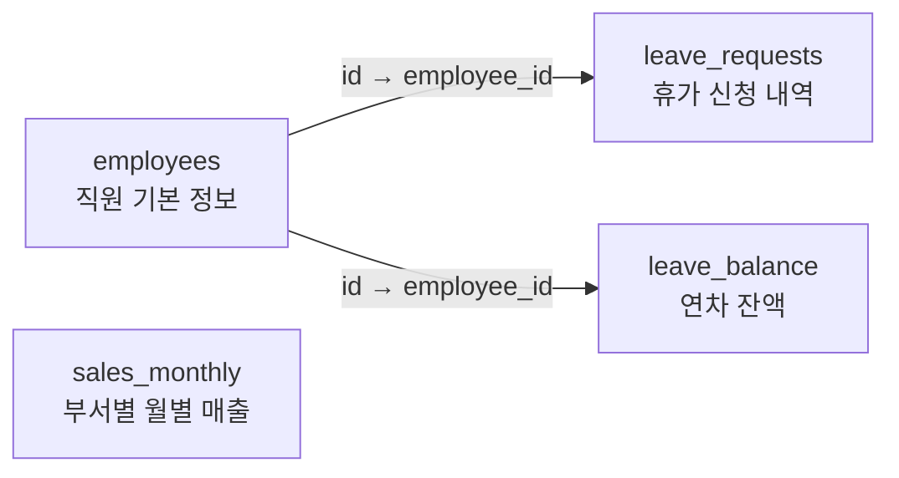
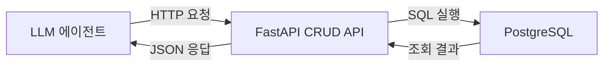
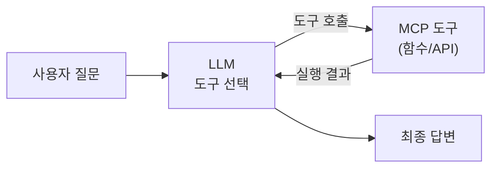

# 4장. 베이스 시스템 확보

이 장에서는 커넥트HR의 사내 데이터베이스를 확보하고 구조를 분석합니다. AI 에이전트가 DB에 안전하게 접근하기 위한 CRUD API 레이어를 이해하고, LLM이 외부 도구를 호출하는 표준 방식인 **MCP(Model Context Protocol)** 의 개념을 처음으로 체험합니다.

<!-- GEMINI_IMAGE
Prompt: Warm office illustration of a young developer (Seoyeon) sitting at her desk looking at a blank database schema diagram on her monitor with a confused expression, a senior colleague (Minjun) standing beside her desk pointing at the screen, soft color palette (warm beige, light blue), friendly cartoon style, clean background with subtle workplace elements
Style: office-illustration-warm
Alt: 이서연이 DB 스키마를 처음 보며 당혹스러운 표정을 짓고, 박민준 과장이 옆에서 설명해 주는 장면
-->
*그림 4-1: 이서연이 DB 구조를 처음 접하는 장면*

---

이서연은 CH03에서 Docker Compose와 가상환경 기반 팀 표준 환경을 완성했습니다. Ollama, DeepSeek R1, PostgreSQL, ChromaDB까지 5개 항목 PASS를 확인한 뒤 이제 본격적으로 AI 비서를 만들 차례였습니다.

그러나 막상 코드를 작성하려 하자 한 가지 문제가 드러났습니다.

> "저… 우리 DB에 어떤 데이터가 있는지를 모르겠어요."

이서연은 회사 PostgreSQL이 구동 중이라는 사실은 알았지만, 그 안에 어떤 테이블이 있고 컬럼 구조가 어떻게 생겼는지 전혀 알지 못했습니다. AI가 "김철수의 남은 연차는?"이라는 질문에 답하려면, 먼저 어디서 그 데이터를 찾아야 하는지 알아야 합니다. 그것은 AI도, 이서연도 마찬가지였습니다.

이서연은 용기를 내어 데이터팀 박민준 과장에게 메시지를 보냈습니다.

> "과장님, DB 구조 좀 알려줄 수 있어요? 팀에서 AI 비서를 만드는 중인데, 어떤 테이블에 어떤 데이터가 있는지 파악이 안 돼서요."

박민준 과장은 흔쾌히 응했습니다. 두 사람이 함께 스키마를 들여다보는 과정에서, 이서연은 예상보다 훨씬 체계적으로 설계된 데이터베이스 구조를 발견합니다.

이 장의 핵심 질문은 다음과 같습니다.

- AI 에이전트가 DB에 접근하려면 무엇이 필요한가?
- LLM이 직접 SQL을 실행하지 않는 이유는 무엇인가?
- **MCP** 란 무엇이며, 왜 표준 프로토콜이 필요한가?

---

## 4.1 사내 시스템 git clone으로 확보

CH03에서 구성한 환경에 이제 실제 데이터를 채워 넣을 차례입니다. CH04 예제 레포는 PostgreSQL 16과 FastAPI CRUD 서버를 함께 구동하는 독립 인프라를 포함합니다.

### 레포 clone 및 인프라 실행

아래 명령을 순서대로 실행하십시오.

```bash
git clone https://github.com/{repo}/CH04_베이스시스템
cd CH04_베이스시스템
docker-compose up -d
```

#### 코드 워크플로우 (Code Workflow)

1. **입력(Input)**: `docker-compose.yml` — PostgreSQL 16 컨테이너 설정 및 샘플 데이터 초기화 스크립트(`docs/schema.sql`)
2. **처리(Process)**: Docker Compose가 `connecthr_postgres` 컨테이너를 시작하고, 시작 시 `schema.sql`을 자동으로 실행하여 테이블 생성 및 샘플 데이터 15건을 적재
3. **출력(Output)**: PostgreSQL이 `localhost:5432`에서 실행되고, 15명의 직원 데이터와 휴가·매출 샘플 데이터가 적재된 상태

컨테이너 상태를 확인하면 아래와 같이 출력됩니다.

```
[+] Running 2/2
 Container connecthr_postgres  Healthy
```

`Healthy` 상태가 나타나야 다음 단계로 진행할 수 있습니다.

> **팁: pgAdmin으로 DB를 시각적으로 확인하십시오**
> PostgreSQL을 웹 UI로 탐색하고 싶다면 아래 명령을 사용하십시오.
> ```bash
> docker-compose --profile pgadmin up -d
> ```
> http://localhost:5050 에 접속하여 이메일 `admin@connecthr.io`로 로그인합니다. 비밀번호는 `.env`의 `POSTGRES_PASSWORD` 값입니다.

### 환경 변수 설정 및 패키지 설치

```bash
cp .env.example .env
python3 -m venv venv
source venv/bin/activate  # Windows: venv\Scripts\activate
pip install -r requirements.txt
```

#### 코드 워크플로우 (Code Workflow)

1. **입력(Input)**: `.env.example` 파일 (DB 호스트, 포트, 계정 정보 등 기본값 포함)
2. **처리(Process)**: `.env` 파일 복사 후 `pip install`로 `psycopg2`, `fastapi`, `langchain` 등 의존성 설치
3. **출력(Output)**: 가상환경 내에 모든 패키지가 설치된 상태, `.env`를 통해 DB 접속 정보가 구성됨

기본값(`localhost:5432`, DB명 `connecthr`)으로 Docker Compose의 PostgreSQL에 바로 접속할 수 있습니다. `.env` 파일을 별도로 수정할 필요가 없습니다.

이 시점에서 사내 시스템(직원 DB, 휴가 DB, 매출 DB)이 로컬에서 완전히 가동됩니다. 다음 단계는 이 DB가 어떤 구조로 이루어졌는지 분석하는 것입니다.

---

## 4.2 데이터베이스 스키마 분석

"이 테이블에 어떤 컬럼이 있는지 알아야, 어떤 SQL을 실행해야 하는지 알 수 있어요."

박민준 과장이 이서연에게 처음 한 말이었습니다. DB 스키마(Schema)란 테이블의 이름, 컬럼, 데이터 타입, 제약조건 등 **데이터베이스의 설계도** 입니다. 스키마를 이해하지 못한 채 AI 에이전트를 만들면, 에이전트도 이서연처럼 "어디서 연차 정보를 가져와야 하지?"라는 상황에 놓입니다.

> **참고: 스키마가 AI 에이전트 설계의 출발점인 이유**
> AI 에이전트가 "김철수의 남은 연차는?"이라는 질문에 답하려면, `leave_balance` 테이블에서 `employee_id`로 조회해야 한다는 사실을 알아야 합니다. 이 매핑 정보가 바로 스키마에서 나옵니다. CH08에서 MCP 에이전트를 구현할 때, 스키마 지식이 도구 설계의 기반이 됩니다.

### 커넥트HR DB의 4개 테이블 구조

`docs/schema.sql`에 정의된 테이블은 다음과 같습니다.



*그림 4-2: 커넥트HR 데이터베이스 4개 테이블 관계도*

각 테이블의 역할은 다음과 같습니다.

| 테이블명 | 역할 | 핵심 컬럼 |
|---------|------|---------|
| `employees` | 직원 기본 정보 (15명 샘플) | `id`, `name`, `department`, `hire_date`, `base_salary` |
| `leave_requests` | 휴가 신청 내역 | `employee_id`, `leave_type`, `start_date`, `end_date`, `status` |
| `leave_balance` | 직원별 연도별 연차 잔액 | `employee_id`, `year`, `total_days`, `used_days` |
| `sales_monthly` | 부서별 월별 매출 실적 | `department`, `year`, `month`, `revenue`, `target` |

`employees` 테이블은 핵심 참조 테이블입니다. `leave_requests`와 `leave_balance`는 `employee_id`를 외래 키(Foreign Key)로 사용하여 `employees`와 연결됩니다. `sales_monthly`는 직원 단위가 아닌 부서 단위로 독립 관리됩니다.

### schema_viewer.py로 스키마 분석 실행

스키마를 직접 확인하는 가장 빠른 방법은 `schema_viewer.py`를 실행하는 것입니다.

```bash
python src/main.py schema
```

#### 코드 워크플로우 (Code Workflow)

1. **입력(Input)**: `.env`에 정의된 PostgreSQL 접속 정보 (`POSTGRES_HOST`, `POSTGRES_PORT`, `POSTGRES_DB` 등)
2. **처리(Process)**: `information_schema.tables`와 `information_schema.columns`를 조회하여 각 테이블의 컬럼명, 데이터 타입, 기본값, Null 허용 여부, 제약조건(PK/UNIQUE)을 추출하고 `tabulate`로 표 형식으로 출력
3. **출력(Output)**: 터미널에 각 테이블 스키마 요약을 출력하고, `outputs/schema_report.txt`에 리포트 파일 저장

실행 결과의 일부를 보면 다음과 같습니다.

```
커넥트HR 데이터베이스 스키마 분석을 시작합니다...

============================================================
  테이블: employees  (레코드 수: 15건)
============================================================
컬럼명          데이터 타입        기본값                    Null 허용
--------------  -----------------  ------------------------  -----------
id              integer            nextval('employees_id_seq')  NO
name            character varying  -                            NO
department      character varying  -                            NO
hire_date       date               -                            NO
base_salary     numeric            -                            NO
email           character varying  -                            YES
is_active       boolean            true                         NO
created_at      timestamp          now()                        NO

[ 제약조건 ]
제약조건명              유형         컬럼
----------------------  -----------  ------
employees_email_key     UNIQUE        email
employees_pkey          PRIMARY KEY   id

리포트가 저장되었습니다: outputs/schema_report.txt
```

<!-- [CAPTURE NEEDED: 04_schema-viewer
  path: assets/CH04/04_schema-viewer.png
  desc: `python src/main.py schema` 실행 후 터미널에 출력된 전체 스키마 분석 결과 화면
] -->

*그림 4-3: schema_viewer.py 실행 결과 — 4개 테이블 구조가 출력된 터미널 화면*

이서연은 출력 결과를 보며 탄성을 질렀습니다.

> "아, `leave_balance` 테이블에 `total_days`랑 `used_days`가 있네요! `total_days - used_days`가 잔여 연차겠구나."

박민준 과장이 고개를 끄덕였습니다. "맞아요. 직접 보니까 훨씬 이해가 빠르죠?"

`schema_viewer.py`의 핵심 로직을 살펴보면, Python의 `information_schema`를 활용하여 DB에 직접 스키마를 질의합니다. 전체 코드는 GitHub 레포의 `src/schema_viewer.py`를 참고하십시오.

```python
# src/schema_viewer.py (발췌 — 테이블 목록 조회 부분)

def fetch_table_list(conn):
    """현재 데이터베이스의 public 스키마 테이블 목록을 반환합니다."""

    # --- Input ---
    query = """
        SELECT table_name
        FROM information_schema.tables
        WHERE table_schema = 'public'
          AND table_type = 'BASE TABLE'
        ORDER BY table_name;
    """

    # --- Process ---
    with conn.cursor() as cur:
        cur.execute(query)
        rows = cur.fetchall()

    # --- Output ---
    return [row[0] for row in rows]
```

#### 코드 워크플로우 (Code Workflow)

1. **입력(Input)**: `psycopg2` 커넥션 객체
2. **처리(Process)**: PostgreSQL 시스템 카탈로그인 `information_schema.tables`를 조회하여 `public` 스키마의 BASE TABLE 목록을 알파벳 순으로 반환
3. **출력(Output)**: 테이블명 문자열 리스트 (`['employees', 'leave_balance', 'leave_requests', 'sales_monthly']`)

> **팁: `information_schema`는 모든 관계형 DB의 공통 인터페이스입니다**
> `information_schema`는 SQL 표준으로, PostgreSQL뿐만 아니라 MySQL, SQLite 등 대부분의 관계형 DB에서 동일하게 사용할 수 있습니다. DB 종류가 바뀌어도 같은 방식으로 스키마를 조회할 수 있습니다.

---

## 4.3 CRUD API 구조 이해

스키마를 파악했다면, 이제 AI 에이전트가 이 데이터를 어떻게 조회할지 설계해야 합니다. 가장 단순한 방법은 LLM이 직접 SQL 쿼리를 생성하여 PostgreSQL에 실행하는 것입니다. 그러나 이 방식에는 치명적인 문제가 있습니다.

> **주의: LLM이 DB에 직접 SQL을 실행하면 안 되는 이유**
> LLM이 생성한 SQL이 항상 정확하다는 보장이 없습니다. `DELETE FROM employees;`나 `DROP TABLE leave_balance;` 같은 파괴적인 쿼리가 실행될 수도 있습니다. API 레이어를 통해 **허용된 작업만** 수행하도록 제한하는 것이 보안의 기본입니다.

이것이 **CRUD API** 레이어가 필요한 이유입니다. CRUD는 Create(생성), Read(읽기), Update(수정), Delete(삭제)의 약자로, 데이터의 기본 4가지 조작을 의미합니다. FastAPI로 구현된 CRUD 서버는 LLM과 PostgreSQL 사이에서 "허가된 창구" 역할을 합니다.



*그림 4-4: LLM과 DB 사이의 FastAPI CRUD API 레이어*

### FastAPI CRUD 서버 실행

```bash
uvicorn src.crud_api:app --reload --port 8000
```

서버가 시작되면 터미널에 아래 메시지가 출력됩니다.

```
[시작] 커넥트HR CRUD API 서버가 시작되었습니다.
       DB: connecthr@localhost:5432
       Swagger UI: http://localhost:8000/docs
INFO:     Uvicorn running on http://127.0.0.1:8000
```

#### 코드 워크플로우 (Code Workflow)

1. **입력(Input)**: `uvicorn` 명령으로 `src/crud_api.py`의 `app` 객체를 실행, `.env`의 DB 접속 정보 사용
2. **처리(Process)**: FastAPI 앱이 시작되며 `lifespan` 핸들러가 PostgreSQL 연결 상태를 확인, 정상이면 서버 준비 완료
3. **출력(Output)**: HTTP 서버가 `localhost:8000`에서 대기, Swagger UI를 통해 엔드포인트 목록 확인 가능

### 엔드포인트 목록

현재 CRUD API가 제공하는 엔드포인트는 다음과 같습니다.

| 메서드 | 경로 | 설명 |
|-------|------|------|
| GET | `/health` | 서버 및 DB 연결 상태 확인 |
| GET | `/employees` | 전체 직원 목록 조회 (부서 필터 지원) |
| GET | `/employees/{id}` | 특정 직원 상세 조회 |
| GET | `/leave-balance/{employee_id}` | 직원 연차 잔액 조회 |
| GET | `/sales/summary` | 부서별 월별 매출 요약 조회 |

이 챕터의 CRUD API는 **읽기 전용(Read-Only)** 입니다. 현 단계에서 AI 에이전트는 데이터를 조회하기만 하며, 데이터를 수정하거나 삭제하는 기능은 제공하지 않습니다.

### Swagger UI로 직접 테스트

브라우저에서 `http://localhost:8000/docs`에 접속하면 Swagger UI가 표시됩니다. 각 엔드포인트를 클릭하고 "Try it out" 버튼으로 실제 API를 테스트할 수 있습니다.

<!-- [CAPTURE NEEDED: 04_swagger-ui
  path: assets/CH04/04_swagger-ui.png
  desc: `http://localhost:8000/docs` 화면에서 전체 엔드포인트 목록이 표시된 Swagger UI 화면
] -->

*그림 4-5: Swagger UI — 커넥트HR CRUD API 엔드포인트 목록*

예를 들어, `GET /leave-balance/2`를 실행하면 이서연(직원 ID 2)의 연차 잔액을 확인할 수 있습니다.

```json
{
  "employee_id": 2,
  "employee_name": "이서연",
  "year": 2025,
  "total_days": 15.0,
  "used_days": 8.0,
  "remaining_days": 7.0
}
```

이서연이 자신의 데이터를 보며 웃었습니다. "총 15일 중 8일 썼고, 7일 남았네요."

### 왜 FastAPI인가

FastAPI를 선택한 이유는 세 가지입니다.

1. **자동 Swagger UI 생성**: 엔드포인트 정의만으로 인터랙티브 문서가 자동 생성됩니다.
2. **Pydantic 기반 타입 검증**: 요청과 응답 스키마를 Python 타입으로 정의하여 데이터 오류를 사전에 차단합니다.
3. **비동기 지원**: 다수의 동시 요청을 효율적으로 처리할 수 있습니다.

`crud_api.py`에서 `/leave-balance/{employee_id}` 엔드포인트의 핵심 부분을 발췌하면 다음과 같습니다. 전체 코드는 GitHub 레포의 `src/crud_api.py`를 참고하십시오.

```python
# src/crud_api.py (발췌 — 연차 잔액 조회 엔드포인트)

@app.get("/leave-balance/{employee_id}", response_model=LeaveBalanceResponse)
def get_leave_balance(employee_id: int, year: int = 2025) -> LeaveBalanceResponse:
    """특정 직원의 연차 잔액을 조회합니다."""

    # --- Input ---
    query = """
        SELECT
            lb.employee_id,
            e.name AS employee_name,
            lb.year,
            lb.total_days,
            lb.used_days,
            (lb.total_days - lb.used_days) AS remaining_days
        FROM leave_balance lb
        JOIN employees e ON e.id = lb.employee_id
        WHERE lb.employee_id = %s AND lb.year = %s;
    """

    # --- Process ---
    conn = get_connection()
    try:
        with conn.cursor(cursor_factory=RealDictCursor) as cur:
            cur.execute(query, (employee_id, year))
            row = cur.fetchone()
    finally:
        conn.close()

    if row is None:
        raise HTTPException(status_code=404, detail="연차 정보를 찾을 수 없습니다.")

    # --- Output ---
    return LeaveBalanceResponse(**dict(row))
```

#### 코드 워크플로우 (Code Workflow)

1. **입력(Input)**: URL 경로 파라미터 `employee_id`(정수), 쿼리 파라미터 `year`(기본값 2025)
2. **처리(Process)**: `leave_balance`와 `employees`를 JOIN하여 `remaining_days`를 계산. 결과가 없으면 HTTP 404 반환
3. **출력(Output)**: `LeaveBalanceResponse` Pydantic 모델로 직렬화된 JSON (잔여 연차 일수 포함)

---

## 4.4 MCP(Model Context Protocol) 개념 소개

CRUD API를 준비했습니다. 그런데 여기서 한 가지 질문이 생깁니다.

> "LLM이 이 API를 어떻게 호출하죠? LLM이 HTTP 요청을 스스로 보낼 수 있나요?"

이서연이 박민준 과장에게 물었습니다. 박민준 과장이 답하기 전에 김도현 팀장이 회의실에 들어왔습니다.

> "그게 바로 MCP 얘기야. 잠깐 설명해줄게."

### MCP란 무엇인가

**MCP(Model Context Protocol)** 는 LLM이 외부 도구와 데이터에 접근하는 표준 프로토콜입니다. LLM이 스스로 API를 호출하거나 함수를 실행할 수 있도록, "어떤 도구가 있는지"와 "그 도구를 어떻게 호출하는지"를 표준화한 방식입니다.

비유하자면, MCP는 스마트폰의 앱 스토어와 비슷합니다. LLM은 앱 목록(도구 목록)을 보고, 필요한 앱(도구)을 선택하고, 실행(호출)합니다. 어떤 앱이 있는지, 어떻게 실행하는지를 표준화된 방식으로 제공하는 것이 MCP의 역할입니다.

<!-- [GEMINI PROMPT: 04_mcp-concept]
path: assets/CH04/04_mcp-concept.png
Minimalist flat-design infographic showing MCP (Model Context Protocol) core flow. LEFT: a user speech bubble with a question. CENTER: an LLM box with a list of three tool icons (DB tool, document search tool, calendar tool) displayed as a dropdown menu, with the LLM selecting one tool highlighted. RIGHT: the selected tool executing and returning a result, then a final answer bubble. Clean horizontal left-to-right flow, white background, Korean labels at each step, 16:9 aspect ratio.
Style: diagram-flat-technical
-->

*그림 4-6: MCP 핵심 흐름 — 사용자 질문에서 도구 호출까지*

MCP의 핵심 흐름은 다음과 같습니다.



*그림 4-7: MCP 도구 호출 흐름도*

### LangChain @tool 데코레이터로 MCP 패턴 구현

실제 MCP 서버를 구성하려면 별도의 인프라가 필요합니다. 이 챕터에서는 **LangChain의 `@tool` 데코레이터** 를 활용하여 동일한 "도구 호출" 패턴을 간단하게 체험합니다. CH08에서 MCP를 본격적으로 구현할 때, 이 패턴이 기반이 됩니다.

`@tool` 데코레이터는 Python 함수를 LLM이 호출할 수 있는 도구로 변환합니다. 도구의 이름과 설명은 함수의 이름과 docstring에서 자동으로 추출됩니다.

```python
# src/mcp_intro.py (발췌 — get_leave_balance 도구 정의)

from langchain.tools import tool

@tool
def get_leave_balance(employee_name: str, year: int = 2025) -> str:
    """직원 이름과 연도로 연차 잔액을 조회합니다.

    Args:
        employee_name: 직원 이름 (예: '이서연')
        year:          조회 연도 (기본값: 2025)

    Returns:
        연차 잔액 JSON 문자열 (총일수, 사용일수, 잔여일수).
    """

    # --- Input ---
    query = """
        SELECT e.name AS 이름, lb.year AS 연도,
               lb.total_days AS 총_연차, lb.used_days AS 사용_연차,
               (lb.total_days - lb.used_days) AS 잔여_연차
        FROM leave_balance lb
        JOIN employees e ON e.id = lb.employee_id
        WHERE e.name = %s AND lb.year = %s;
    """

    # --- Process ---
    conn = psycopg2.connect(**DB_CONFIG)
    with conn.cursor(cursor_factory=RealDictCursor) as cur:
        cur.execute(query, (employee_name, year))
        row = cur.fetchone()
    conn.close()

    # --- Output ---
    return json.dumps(dict(row), ensure_ascii=False, default=str)
```

#### 코드 워크플로우 (Code Workflow)

1. **입력(Input)**: `employee_name` (직원 이름 문자열), `year` (연도 정수, 기본값 2025)
2. **처리(Process)**: `@tool` 데코레이터가 함수를 LangChain Tool 객체로 변환. PostgreSQL에서 `leave_balance`와 `employees`를 JOIN하여 잔여 연차를 계산
3. **출력(Output)**: JSON 문자열 형식의 연차 잔액 정보 (LLM이 읽을 수 있는 텍스트 형태)

`@tool` 데코레이터의 핵심은 **함수의 docstring이 곧 도구의 설명** 이 된다는 점입니다. LLM은 이 설명을 읽고 "연차를 조회하려면 `get_leave_balance` 도구를 사용해야겠다"고 판단합니다. 설명이 부정확하면 LLM이 잘못된 도구를 선택하거나 잘못된 파라미터를 전달할 수 있습니다.

### MCP 데모 실행

```bash
python src/main.py mcp
```

#### 코드 워크플로우 (Code Workflow)

1. **입력(Input)**: 사전 정의된 테스트 질문 3개 (직원 정보 조회, 연차 잔액, 매출 현황)
2. **처리(Process)**: 등록된 MCP 도구 3개(`get_employee_info`, `get_leave_balance`, `get_department_sales`)를 각 질문에 맞게 직접 호출
3. **출력(Output)**: 각 도구의 실행 결과를 JSON 형식으로 출력

실행하면 다음과 같은 결과가 출력됩니다.

```
커넥트HR MCP(Model Context Protocol) 개념 데모

MCP 핵심 흐름:
  사용자 질문 → LLM이 도구 선택 → 도구 실행 → 결과 반환 → 최종 답변

등록된 MCP 도구 목록 (3개):
  - get_employee_info: 직원 이름으로 직원 정보를 조회합니다...
  - get_leave_balance: 직원 이름과 연도로 연차 잔액을 조회합니다...
  - get_department_sales: 부서명과 연도로 월별 매출 현황을 조회합니다...

============================================================
  [데모 1] MCP 도구 직접 호출 (LLM 없이)
============================================================

[질문] 이서연 직원 정보 조회
[도구] get_employee_info
[입력] {"employee_name": "이서연"}
[결과] {
  "id": 2,
  "name": "이서연",
  "department": "개발팀",
  "hire_date": "2022-06-15",
  "base_salary": 3600000.0,
  ...
}

[질문] 박민준 2025년 연차 잔액
[도구] get_leave_balance
[입력] {"employee_name": "박민준", "year": 2025}
[결과] {
  "이름": "박민준",
  "연도": 2025,
  "총_연차": 18.0,
  "사용_연차": 6.0,
  "잔여_연차": 12.0
}
```

<!-- [CAPTURE NEEDED: 04_mcp-demo
  path: assets/CH04/04_mcp-demo.png
  desc: `python src/main.py mcp` 실행 후 도구 목록과 직접 호출 결과가 출력된 터미널 화면 전체
] -->

*그림 4-8: MCP 데모 실행 결과 — 도구 직접 호출과 LangChain 에이전트 호출 결과*

### 데모 2: LLM이 도구를 선택하는 흐름 (Ollama 필요)

Ollama와 DeepSeek R1이 실행 중이라면, 데모 2에서 LLM이 스스로 도구를 선택하는 과정을 볼 수 있습니다.

```
[데모 2] LangChain 에이전트를 통한 MCP 패턴

[질문] 이서연 씨의 2025년 잔여 연차가 며칠인지 알려줘.

> 생각 중...
> 도구 선택: get_leave_balance
> 입력: {"employee_name": "이서연", "year": 2025}
> 결과: {"잔여_연차": 7.0, ...}

[답변] 이서연 씨의 2025년 잔여 연차는 7일입니다.
```

이것이 MCP의 핵심입니다. 사용자는 "이서연의 잔여 연차"를 물었고, LLM은 사용 가능한 도구 목록에서 `get_leave_balance`가 적합하다고 판단하여 자동으로 호출했습니다. 이서연이 이 출력을 보며 처음으로 MCP를 이해한 표정을 지었습니다.

> "LLM이 어떤 도구를 쓸지 스스로 판단한다는 거잖아요. 그러면 저는 도구만 잘 만들어두면 되겠네요?"

박민준 과장이 고개를 끄덕였습니다. "바로 그거야. 도구 설명이 정확할수록 LLM이 올바른 도구를 선택한다."

> **주의: Ollama 없이도 데모 1은 실행됩니다**
> Ollama가 설치되지 않았거나 실행 중이 아니어도 [데모 1] (도구 직접 호출)은 정상 동작합니다. [데모 2] (LLM 에이전트 호출)는 Ollama가 필요하며, Ollama가 없으면 자동으로 건너뜁니다.

### 트러블슈팅

실행 중 오류가 발생한다면 아래 표를 참고하십시오.

| 증상 | 원인 | 해결 방법 |
|------|------|---------|
| `connection refused` | PostgreSQL 미실행 | `docker-compose up -d` 재실행 |
| `ModuleNotFoundError` | 가상환경 미활성화 | `source venv/bin/activate` 후 재실행 |
| Swagger UI 접근 불가 | FastAPI 서버 미실행 | `uvicorn src.crud_api:app --reload` 실행 |
| MCP 에이전트 건너뜀 | Ollama 미실행 | `ollama serve` 후 `ollama pull deepseek-r1:1.5b` |

---

## 4.5 정리하며

이 장에서 이서연은 혼자서는 파악하지 못했던 사내 DB 구조를 박민준 과장과 함께 분석하며 자신감을 얻었습니다. 그리고 AI 에이전트가 DB에 안전하게 접근하기 위한 두 가지 핵심 레이어, **CRUD API** 와 **MCP** 의 개념을 처음으로 체험했습니다.

<!-- GEMINI_IMAGE
Prompt: Simple before/after comparison infographic: LEFT side shows developer confused at blank database schema with question marks, with label "스키마 미파악", RIGHT side shows developer confidently looking at organized ER diagram with 4 tables connected, with label "스키마 분석 완료", arrow in the middle pointing right, clean flat design, warm color tones, white background
Style: before-after-infographic
Alt: 스키마 미파악 상태에서 스키마 분석 완료 상태로 이행한 결과
-->
*그림 4-9: 스키마 파악 전후 비교 — DB 구조 이해가 AI 에이전트 설계의 출발점*

이 장의 핵심 내용을 정리합니다.

- **스키마 분석이 AI 에이전트 설계의 출발점이다**: DB 구조를 모르면 어떤 테이블에서 어떤 데이터를 가져와야 하는지 판단할 수 없습니다. `schema_viewer.py`로 4개 테이블 구조를 파악하고 `outputs/schema_report.txt`로 리포트를 생성했습니다.

- **CRUD API 레이어가 보안을 확보한다**: LLM이 PostgreSQL에 직접 SQL을 실행하면 파괴적인 쿼리가 실행될 위험이 있습니다. FastAPI CRUD 서버를 통해 허용된 읽기 작업만 수행하도록 제한했습니다.

- **MCP는 LLM이 외부 도구를 호출하는 표준 방식이다**: `@tool` 데코레이터로 Python 함수를 LLM이 호출 가능한 도구로 변환하는 패턴을 체험했습니다. 도구의 docstring이 곧 LLM의 선택 기준이 됩니다.

- **협업이 시스템 이해를 가속한다**: 이서연이 박민준 과장과 함께 스키마를 분석하며 혼자서는 몇 시간이 걸렸을 이해를 30분 만에 달성했습니다. 데이터 전문가와의 협력은 AI 시스템 개발의 핵심 자산입니다.

**다음 장 예고**: CH05에서는 사내 매뉴얼 3,000페이지를 다루는 과정을 살펴봅니다. 벡터 DB에 넣기 전에 PDF, Word, Markdown 문서를 수집하고 정제하는 **문서 표준화 파이프라인** 을 구축합니다. 이서연은 "전부 다 넣으면 안 되나요?"라는 질문을 하게 됩니다.
