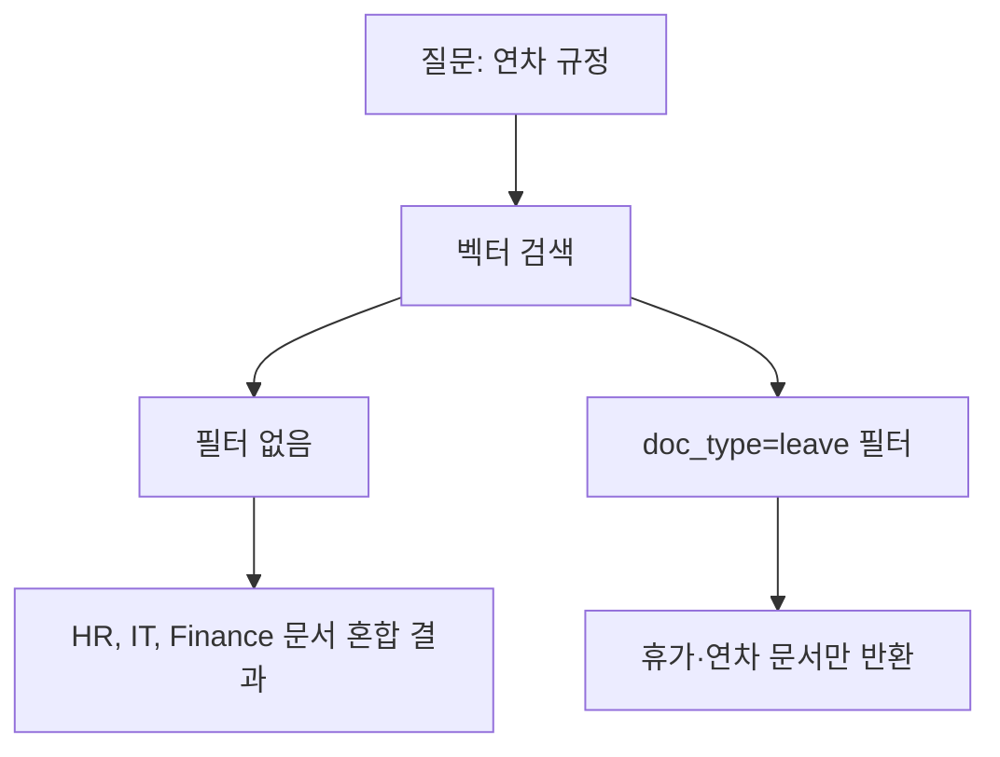

# 5장. 사내 문서 표준화

이 장에서는 PDF, Word, Markdown 등 다양한 형식의 사내 문서를 수집하고, 노이즈를 제거하며, 일관된 형식으로 표준화하는 파이프라인을 구축합니다. CH04에서 정형 데이터(DB)에 접근하는 방법을 확보했다면, 이 장에서는 비정형 문서를 RAG가 읽을 수 있는 형태로 준비하는 과정을 다룹니다.

---

이서연은 사내 공유 드라이브를 처음 열었을 때 숨이 막혔습니다. "HR 정책", "IT 가이드", "취업 규칙", "보안 지침"이 부서별, 연도별로 뒤섞인 폴더 3,000페이지 분량의 문서들이 쌓여 있었습니다. 그 중에는 2015년에 작성된 파일도 있었고, PDF와 Word, 그리고 이름 없는 텍스트 파일이 뒤죽박죽 섞여 있었습니다.

"이걸 다 어떻게 처리하죠?" 이서연이 팀장 김도현에게 물었습니다.

"전부 넣을 필요 없어요. 핵심 문서 50개를 먼저 선별하는 게 맞습니다. RAG는 데이터가 많을수록 좋은 게 아니라, 데이터가 깨끗할수록 좋습니다."

이 장에서는 이서연이 경험한 것과 동일한 문제 — **'어떤 문서를 넣어야 하는가'** 와 **'어떻게 정제해야 하는가'** — 를 단계별로 해결합니다.

<!-- [GEMINI PROMPT: 05_intro_chaos]
path: assets/CH05/05_intro_chaos.png
A young Korean woman developer (28, short black hair, professional office attire) standing in front of a large filing cabinet overflowing with documents. Files are scattered everywhere — PDF icons, Word doc icons, and text file icons in a chaotic pile. She looks overwhelmed and confused, one hand on her head. Warm office illustration, soft color palette (warm beige, light blue), friendly cartoon style, no text overlay, 16:9 aspect ratio.
Style: office-illustration-warm
-->

*그림 5-1: 3,000페이지 문서 앞에 선 이서연*

---

## 5.1 RAG 검색 품질을 결정하는 문서 기준

### 5.1.1 GIGO 원칙: 문서 품질이 성능의 70%를 결정한다

데이터 과학에는 오래된 격언이 있습니다. **GIGO(Garbage In, Garbage Out)** — 쓰레기를 넣으면 쓰레기가 나온다는 원칙입니다. RAG 시스템에서 이 원칙은 특히 강하게 적용됩니다.

벡터 검색은 입력 텍스트를 수치 벡터로 변환하여 유사도를 계산합니다. 이 과정에서 문서에 포함된 노이즈 — 머리글, 바닥글, 페이지 번호, 특수문자 — 도 함께 벡터화됩니다. 결과적으로 검색 쿼리와 전혀 관련 없는 텍스트가 결과에 영향을 미치게 됩니다.

> **참고: 왜 노이즈가 검색 품질을 떨어뜨리는가?**
> "커넥트HR 내부용 | 2023년 3월 개정 | 페이지 5/32"라는 바닥글 문자열이 청크에 포함되면, "연차 규정 조회" 질문에 대한 유사도 계산에서 이 문장이 방해 요소로 작용합니다. 깨끗한 텍스트와 노이즈가 섞인 텍스트의 임베딩 벡터는 의미적으로 서로 다른 방향을 가리킵니다.

### 5.1.2 문서 선별 3가지 기준

3,000페이지 문서를 전부 벡터 DB에 넣는 것은 비효율적일 뿐 아니라 오히려 검색 정확도를 떨어뜨립니다. 아래 기준으로 핵심 문서를 선별하십시오.

| 기준 | 설명 | 제외 대상 |
|------|------|---------|
| **최신성** | 현재 적용 중인 규정인가? | 폐기된 버전, 3년 이상 된 미개정 문서 |
| **명확성** | 질문에 직접 답할 수 있는 내용인가? | 회의록, 임시 메모, 미완성 초안 |
| **구조화** | 섹션이 명확히 구분되어 있는가? | 스캔 PDF, 이미지 전용 파일 |

커넥트HR 팀이 선별한 문서 구성은 다음과 같습니다.

- `hr_policy.txt` — HR 인사 정책 (취업 규칙, 복리후생)
- `leave_rules.txt` — 연차 및 휴가 규정
- `it_guide.txt` — IT 보안 및 장비 사용 가이드

> **팁: 작게 시작하십시오**
> 처음부터 수백 개 문서를 넣으려 하지 마십시오. 10~50개 핵심 문서로 파이프라인을 검증한 뒤, 점차 범위를 넓히는 전략이 효율적입니다. 이서연이 김도현 팀장의 조언대로 50개 핵심 문서를 먼저 선별한 이유가 여기 있습니다.

### 5.1.3 문서 표준화 파이프라인 전체 구조

이 장에서 구현할 파이프라인은 4단계로 구성됩니다.


*그림 5-2: 문서 표준화 파이프라인 4단계 흐름*

각 모듈의 역할은 다음과 같습니다.

| 모듈 | 파일 | 역할 |
|------|------|------|
| `collector` | `src/collector.py` | 디렉토리 스캔, 파일 메타데이터 추출 |
| `preprocessor` | `src/preprocessor.py` | 머리글/바닥글, 특수문자, 과도한 공백 제거 |
| `normalizer` | `src/normalizer.py` | 일관된 Markdown 형식으로 변환, 섹션 헤더 자동 감지 |
| `metadata_manager` | `src/metadata_manager.py` | 문서 유형·버전·태그 자동 감지, JSON 저장 |

---

## 5.2 PDF, Word, Markdown 수집 전략

### 5.2.1 저장소 클론 및 실행 준비

먼저 이 장의 예제 저장소를 클론합니다.

```bash
git clone https://github.com/{repo}/CH05_문서표준화
cd CH05_문서표준화
cp .env.example .env
pip install -r requirements.txt
```

#### 코드 워크플로우 (Code Workflow)

1. **입력(Input)**: GitHub 저장소 URL
2. **처리(Process)**: 저장소를 로컬에 복제하고, `.env.example`을 복사하여 환경 변수 파일을 생성하며, `requirements.txt`로 의존성을 설치합니다.
3. **출력(Output)**: 실행 가능한 로컬 프로젝트 환경

`.env` 파일을 열면 아래와 같은 내용이 있습니다.

```env
# 문서 입력 경로 (기본값: data/sample_docs)
DOCS_INPUT_DIR=data/sample_docs

# 정규화 결과 출력 경로
NORMALIZED_OUTPUT_DIR=outputs/markdown

# 메타데이터 출력 경로
METADATA_OUTPUT_DIR=outputs/metadata
```

### 5.2.2 collector.py: 디렉토리 스캔과 파일 수집

`collector.py`는 지정된 디렉토리를 재귀적으로 스캔하여 지원 형식의 파일을 수집합니다.

```python
# src/collector.py (핵심 함수 발췌)

SUPPORTED_EXTENSIONS: set[str] = {".txt", ".md"}
PDF_EXTENSIONS: set[str] = {".pdf"}

def scan_directory(directory: str) -> list[dict]:
    """지정 디렉토리에서 지원 형식의 파일을 재귀적으로 수집합니다."""

    # --- Input ---
    dir_path = Path(directory)

    # --- Process ---
    collected_files: list[dict] = []

    for file_path in dir_path.rglob("*"):
        if not file_path.is_file():
            continue

        ext = file_path.suffix.lower()
        all_extensions = SUPPORTED_EXTENSIONS | PDF_EXTENSIONS

        if ext not in all_extensions:
            continue

        stat = file_path.stat()
        file_info = {
            "file_name": file_path.name,
            "file_path": str(file_path.absolute()),
            "extension": ext,
            "size_bytes": stat.st_size,
            "modified_at": datetime.fromtimestamp(stat.st_mtime).isoformat(),
            "is_supported": ext in SUPPORTED_EXTENSIONS,
        }
        collected_files.append(file_info)

    # --- Output ---
    return collected_files
```

#### 코드 워크플로우 (Code Workflow)

1. **입력(Input)**: 스캔할 디렉토리 경로 문자열
2. **처리(Process)**: `rglob("*")`로 하위 디렉토리까지 재귀 탐색하여, 확장자가 `.txt`, `.md`, `.pdf`인 파일만 수집합니다. 파일별로 이름, 절대 경로, 크기, 수정 시각, 지원 여부를 추출합니다.
3. **출력(Output)**: 파일 정보 딕셔너리 리스트

> **참고: PDF는 이 장에서 직접 처리하지 않습니다**
> `collector.py`는 PDF 파일을 인식하지만 전처리 대상에서 제외합니다. PDF 내부 텍스트 추출(PyMuPDF, pdfplumber)은 CH06에서 본격적으로 다룹니다. 이 장에서는 `.txt`와 `.md` 형식에 집중합니다.

### 5.2.3 프로젝트 디렉토리 구조

문서는 아래 구조로 정리됩니다.

```
CH05_문서표준화/
├── data/
│   └── sample_docs/        샘플 문서 (실습용)
│       ├── hr_policy.txt   HR 정책 문서
│       ├── leave_rules.txt 휴가 규정 문서
│       └── it_guide.txt    IT 사용 가이드
├── src/
│   ├── main.py             파이프라인 진입점
│   ├── collector.py        파일 수집
│   ├── preprocessor.py     노이즈 제거
│   ├── normalizer.py       Markdown 변환
│   └── metadata_manager.py 메타데이터 관리
└── outputs/                실행 결과 (자동 생성)
    ├── markdown/           정규화된 .md 파일
    └── metadata/           메타데이터 .json 파일
```

> **팁: 부서별 하위 폴더를 사용하십시오**
> 실제 운영에서는 `data/docs/hr/`, `data/docs/it/`, `data/docs/finance/`와 같이 부서별로 분리하십시오. `collector.py`의 `rglob("*")`는 하위 디렉토리까지 자동으로 탐색합니다. 폴더 구조 자체가 문서의 출처 정보가 됩니다.

---

## 5.3 문서 전처리 및 정규화 가이드라인

이서연은 수집된 HR 정책 문서를 처음 열었을 때 예상치 못한 내용을 발견했습니다.

```
========================================================
커넥트HR 내부 문서 | 배포 제한 | 문서 ID: HR-2023-001
========================================================
버전: v2.1 | 최종 승인: 2023-03-15 | 다음 개정 예정: 2024-03-15
페이지 1 / 18

1. 채용 정책
...
```

"이 헤더와 바닥글, 페이지 번호가 전부 검색에 노이즈로 작용하겠네요." 이서연이 말했습니다. 전처리의 목표는 분명합니다 — LLM이 읽어야 할 실제 내용만 남기는 것입니다.

### 5.3.1 preprocessor.py: 4단계 노이즈 제거

`preprocessor.py`는 원시 텍스트에서 불필요한 내용을 제거합니다. 처리는 4단계로 순서대로 실행됩니다.

```python
# src/preprocessor.py (핵심 함수 발췌)

HEADER_FOOTER_PATTERNS: list[str] = [
    r"={40,}",                    # === 구분선 (40자 이상)
    r"-{40,}",                    # --- 구분선 (40자 이상)
    r"\[문서\s*끝\].*",            # [문서 끝] 라인
    r"페이지\s*\d+\s*/\s*\d+",    # 페이지 N/M 패턴
    r"버전:\s*v[\d.]+\s*\|.*",    # 버전 메타 라인
    r"문서\s*ID:\s*\S+",          # 문서 ID 라인
]

def preprocess(text: str) -> str:
    """텍스트 전처리 전체 파이프라인을 순서대로 실행합니다."""

    # --- Input ---
    if not text or not text.strip():
        raise ValueError("텍스트가 비어있습니다.")

    original_length = len(text)

    # --- Process ---
    result = remove_header_footer(text)   # 1단계: 머리글/바닥글 제거
    result = replace_special_chars(result) # 2단계: 특수문자 교체
    result = remove_repeated_separators(result) # 3단계: 반복 구분선 제거
    result = normalize_whitespace(result)  # 4단계: 공백 정규화
    result = result.strip()

    reduction_rate = (1 - len(result) / original_length) * 100
    print(f"  전처리 완료: {original_length}자 → {len(result)}자 ({reduction_rate:.1f}% 감소)")

    # --- Output ---
    return result
```

#### 코드 워크플로우 (Code Workflow)

1. **입력(Input)**: 원시 파일에서 읽어온 텍스트 문자열
2. **처리(Process)**: 4단계 파이프라인을 순서대로 실행합니다. (1) `remove_header_footer`로 정규식 패턴에 일치하는 라인 제거 → (2) `replace_special_chars`로 특수 유니코드 문자를 표준 문자로 교체 → (3) `remove_repeated_separators`로 10자 이상 구분선 제거 → (4) `normalize_whitespace`로 연속 공백·탭·빈 줄 압축
3. **출력(Output)**: 정제된 텍스트 문자열 및 압축률 출력

아래 표는 각 전처리 단계에서 제거하는 내용입니다.

| 단계 | 처리 내용 | 예시 |
|------|---------|------|
| 머리글/바닥글 제거 | 40자 이상 구분선, 페이지 번호, 버전 메타 라인 | `===...===`, `페이지 1/18` |
| 특수문자 교체 | 유니코드 특수 따옴표, 대시 → ASCII 표준 | `"` → `"`, `—` → `-` |
| 반복 구분선 제거 | 10자 이상 순수 구분선 라인 삭제 | `----------` |
| 공백 정규화 | 탭→공백, 3줄 이상 빈 줄→2줄, 줄 끝 공백 제거 | `\t` → `    ` |

### 5.3.2 normalizer.py: Markdown 형식으로 변환

전처리가 끝난 텍스트는 `normalizer.py`를 통해 일관된 Markdown 구조로 변환됩니다. 이 과정에서 섹션 헤더가 자동으로 감지되어 `#`, `##`, `###` 형식으로 변환됩니다.

```python
# src/normalizer.py (핵심 함수 발췌)

HEADER_PATTERNS: list[tuple[int, str]] = [
    (1, r"^(\d+)\.\s+[가-힣A-Za-z]"),         # "1. 제목" → H2
    (2, r"^(\d+\.\d+)\s+[가-힣A-Za-z]"),       # "1.1 제목" → H3
    (3, r"^(\d+\.\d+\.\d+)\s+[가-힣A-Za-z]"),  # "1.1.1 제목" → H4
]

def normalize_to_markdown(text: str, source_file_name: str = "") -> str:
    """전처리된 텍스트를 Markdown 형식으로 변환합니다."""

    # --- Input ---
    lines = text.splitlines()
    result_lines: list[str] = []

    # 파일명 기반 H1 제목 삽입
    if source_file_name:
        doc_title = Path(source_file_name).stem.replace("_", " ")
        result_lines.append(f"# {doc_title}")
        result_lines.append("")

    # --- Process ---
    idx = 0
    while idx < len(lines):
        line = lines[idx]
        stripped = line.strip()

        if "|" in stripped and stripped.startswith("|"):
            # 파이프 포함 라인 → Markdown 표 변환
            table_md, idx = convert_table_to_markdown(lines, idx)
            result_lines.append(table_md)
        else:
            header_level = detect_header_level(stripped)
            if header_level > 0:
                prefix = "#" * (header_level + 1)
                result_lines.append(f"{prefix} {stripped}")
            else:
                result_lines.append(stripped)
            idx += 1

    # --- Output ---
    return "\n".join(result_lines).strip()
```

#### 코드 워크플로우 (Code Workflow)

1. **입력(Input)**: 전처리 완료된 텍스트 문자열, 원본 파일명
2. **처리(Process)**: 라인 단위로 순회하며 (1) 파이프(`|`) 포함 라인은 Markdown 표로 변환, (2) 숫자 번호 섹션(`1. 제목`, `1.1 제목`)은 Markdown 헤더(`##`, `###`)로 변환, (3) 일반 텍스트는 그대로 유지합니다.
3. **출력(Output)**: 구조화된 Markdown 텍스트 문자열

변환 결과를 비교하면 다음과 같습니다.

**변환 전 (원시 텍스트):**
```
1. 채용 정책
본 회사의 채용은 공개 채용을 원칙으로 한다.

1.1 채용 절차
1단계: 서류 전형
2단계: 면접
```

**변환 후 (Markdown):**
```markdown
# hr policy

## 1. 채용 정책
본 회사의 채용은 공개 채용을 원칙으로 한다.

### 1.1 채용 절차
1. 서류 전형
2. 면접
```

> **주의: Word 파일(.docx) 처리**
> 현재 예제는 `.txt`와 `.md` 형식만 처리합니다. Word 파일은 `python-docx` 라이브러리로 텍스트를 추출한 뒤 동일한 파이프라인을 적용합니다. 전체 구현은 GitHub 저장소의 `src/extractor.py`를 참고하십시오.

---

## 5.4 문서 버전 관리 및 메타데이터 설계

### 5.4.1 파이프라인 전체 실행

이제 파이프라인을 실행할 차례입니다.

```bash
python src/main.py
```

#### 코드 워크플로우 (Code Workflow)

1. **입력(Input)**: `data/sample_docs/` 디렉토리 (샘플 문서 3개)
2. **처리(Process)**: collector → preprocessor → normalizer → metadata_manager 순서로 4단계 파이프라인 실행
3. **출력(Output)**: `outputs/markdown/`에 정규화된 `.md` 파일, `outputs/metadata/`에 메타데이터 `.json` 파일

실행하면 아래와 같은 결과가 터미널에 출력됩니다.

```
============================================================
CH05 사내 문서 표준화 파이프라인 시작
============================================================

[Step 1] 문서 수집
  스캔 경로: data/sample_docs
============================================================
문서 수집 결과 리포트
============================================================
전체 파일 수: 3개
  - 전처리 가능 (.txt/.md): 3개
  - PDF (CH06에서 처리):    0개
전체 크기: 12.4 KB

파일명                              크기(KB)     지원 여부
------------------------------------------------------------
hr_policy.txt                          4.8         가능
it_guide.txt                           3.1         가능
leave_rules.txt                        4.5         가능
============================================================
  전처리 대상: 3개 파일

[Step 2 & 3] 전처리 및 Markdown 정규화
  처리 중: hr_policy.txt
  전처리 완료: 4921자 → 3102자 (36.9% 감소)
  저장 완료: outputs/markdown/hr_policy_normalized.md
  처리 중: it_guide.txt
  전처리 완료: 3210자 → 2105자 (34.4% 감소)
  저장 완료: outputs/markdown/it_guide_normalized.md
  처리 중: leave_rules.txt
  전처리 완료: 4583자 → 2987자 (34.8% 감소)
  저장 완료: outputs/markdown/leave_rules_normalized.md

[Step 4] 메타데이터 생성
  처리 중: hr_policy.txt
  메타데이터 저장: outputs/metadata/hr_policy.metadata.json
  처리 중: it_guide.txt
  메타데이터 저장: outputs/metadata/it_guide.metadata.json
  처리 중: leave_rules.txt
  메타데이터 저장: outputs/metadata/leave_rules.metadata.json

============================================================
파이프라인 완료
============================================================
  수집 파일: 3개
  전처리 완료: 3개
  정규화 완료 (Markdown): 3개
  메타데이터 생성: 3개
```

<!-- [CAPTURE NEEDED: 05_pipeline-result
  path: assets/CH05/05_pipeline-result.png
  desc: `python src/main.py` 실행 후 전체 파이프라인 완료 터미널 화면
] -->

*그림 5-3: 파이프라인 완료 화면 — 3개 문서 전처리 결과와 압축률 표시*

전처리 결과를 보면 `hr_policy.txt`는 4,921자에서 3,102자로 **36.9% 감소** 했습니다. 제거된 1,819자는 대부분 머리글, 바닥글, 페이지 번호, 반복 구분선이었습니다. 이것이 RAG에 입력되는 노이즈를 줄이는 과정입니다.

"이 문서는 꽤 깨끗하게 정리됐네요. 그런데 이 파일은 표가 깨져 있어요." 이서연이 IT 가이드 파일을 열며 말했습니다. 데이터 품질 문제는 어떤 시스템에서도 피할 수 없습니다. 파이프라인은 이를 자동으로 처리하지만, 결과물을 직접 확인하는 습관이 중요합니다.

### 5.4.2 metadata_manager.py: 문서 메타데이터 설계

메타데이터(Metadata)는 문서에 대한 부가 정보입니다. "이 문서는 HR 부서의 연차 규정 문서이며, 버전은 v2.1이다"라는 정보를 구조화하여 저장합니다. 메타데이터가 있으면 벡터 검색 시 "HR 부서 문서에서만 검색"과 같은 필터링이 가능해집니다.

```python
# src/metadata_manager.py (핵심 함수 발췌)

DOC_TYPE_KEYWORDS: dict[str, list[str]] = {
    "hr_policy": ["인사", "채용", "퇴직", "평가", "복리후생"],
    "leave":     ["휴가", "연차", "병가", "육아", "경조사"],
    "it_guide":  ["VPN", "보안", "비밀번호", "슬랙", "장비"],
    "finance":   ["예산", "지출", "매출", "비용", "세금"],
}

def build_metadata(file_path: str, text: str, normalized_path: str = "") -> dict:
    """문서 파일로부터 전체 메타데이터 딕셔너리를 생성합니다."""

    # --- Input ---
    path = Path(file_path)
    stat = path.stat()

    # --- Process ---
    doc_type = detect_doc_type(text, path.name)  # 키워드 기반 유형 감지
    tags = extract_tags(text)                      # 등장 키워드 태그 추출
    version = extract_version(text)                # 버전 문자열 추출

    metadata = {
        "file_name": path.name,
        "source": str(path.absolute()),
        "normalized_path": normalized_path,
        "created_at": datetime.now().isoformat(),
        "modified_at": datetime.fromtimestamp(stat.st_mtime).isoformat(),
        "size_bytes": stat.st_size,
        "doc_type": doc_type,
        "version": version,
        "tags": tags,
        "char_count": len(text),
    }

    # --- Output ---
    return metadata
```

#### 코드 워크플로우 (Code Workflow)

1. **입력(Input)**: 원본 파일 경로, 전처리된 텍스트, 정규화 파일 경로
2. **처리(Process)**: (1) 파일명과 내용 앞 1,000자를 분석하여 문서 유형(`doc_type`) 자동 감지, (2) 태그 키워드 목록과 대조하여 해당 키워드(`tags`) 추출, (3) 정규식으로 버전 문자열(`version`) 추출
3. **출력(Output)**: 구조화된 메타데이터 딕셔너리

`hr_policy.txt`에 대해 생성된 메타데이터 예시는 아래와 같습니다.

```json
{
  "file_name": "hr_policy.txt",
  "source": "/path/to/data/sample_docs/hr_policy.txt",
  "normalized_path": "/path/to/outputs/markdown/hr_policy_normalized.md",
  "created_at": "2024-01-15T10:30:00.123456",
  "modified_at": "2024-01-10T09:00:00.000000",
  "size_bytes": 4915,
  "doc_type": "hr_policy",
  "version": "v2.1",
  "tags": ["HR", "채용", "평가", "온보딩"],
  "char_count": 4921
}
```

### 5.4.3 메타데이터가 검색 품질에 미치는 영향

메타데이터의 핵심 가치는 **필터 검색** 에 있습니다. 메타데이터 없이 벡터 검색만 사용하면 "연차 규정"을 검색할 때 IT 가이드의 "출장 신청 절차"도 함께 반환될 수 있습니다. 메타데이터 필터를 적용하면 특정 부서, 특정 버전의 문서에서만 검색하도록 범위를 제한할 수 있습니다.



*그림 5-4: 메타데이터 필터 유무에 따른 검색 결과 차이*

메타데이터의 두 번째 가치는 **버전 관리** 입니다. 문서가 개정될 때 버전 정보를 메타데이터에 기록하면, 벡터 DB에서 구 버전 문서를 삭제하고 신 버전으로 교체하는 작업이 명확해집니다.

> **팁: 메타데이터는 CH06에서 ChromaDB에 함께 저장됩니다**
> 이 장에서 생성한 `outputs/metadata/*.json` 파일은 CH06 벡터 DB 구축 시 ChromaDB의 메타데이터 필드로 함께 저장됩니다. `doc_type`, `version`, `tags` 필드가 검색 필터의 기준이 됩니다.

### 5.4.4 버전 관리 전략

실제 운영 환경에서 문서는 계속 업데이트됩니다. 아래 전략을 권장합니다.

1. **파일명에 버전 포함**: `hr_policy_v2.1.txt`처럼 파일명 자체에 버전을 명시하면 어떤 버전이 벡터 DB에 들어가 있는지 즉시 파악할 수 있습니다.
2. **전체 재색인 대신 개별 교체**: 문서 하나가 개정되면 해당 문서의 청크만 삭제하고 재색인합니다. ChromaDB는 `where` 필터를 사용한 개별 삭제를 지원합니다.
3. **메타데이터 `modified_at` 추적**: 마지막 수정 시각을 기록해두면, "n일 이상 개정되지 않은 문서"를 주기적으로 검토하는 워크플로우를 만들 수 있습니다.

<!-- [GEMINI PROMPT: 05_version-management]
path: assets/CH05/05_version-management.png
Minimalist flat-design infographic showing document version management strategy as a horizontal timeline. Step 1: "문서 v1.0 색인" with a green check. Step 2: "문서 v2.0 출시" with a new document icon. Step 3: "v1.0 벡터 삭제" with a red trash icon. Step 4: "v2.0 재색인" with a green check. Arrow connecting steps left to right. White background, clean line art, Korean labels, 16:9 aspect ratio.
Style: diagram-flat-technical
-->

*그림 5-5: 문서 버전 관리 전략 — 구버전 제거 후 신버전 재색인*

---

## 5.5 정리하며

이 장에서는 RAG 파이프라인의 입력 품질을 결정하는 문서 표준화 과정을 구현했습니다. 파이프라인을 직접 실행하면서 이서연이 체감한 것처럼, 데이터 품질이 AI 시스템 성능의 기초임을 확인했습니다.

<!-- GEMINI_IMAGE
Prompt: Simple before/after comparison infographic: LEFT side shows "노이즈가 포함된 원시 문서"
        with red indicator and "4,921자", RIGHT side shows "정제된 Markdown 문서"
        with green indicator and "3,102자", downward arrow in the middle labeled "36.9% 감소",
        clean flat design, white background
Style: before-after-infographic
Alt: 전처리 전 4,921자에서 전처리 후 3,102자로 36.9% 감소한 결과
-->
*그림 5-6: 전처리 전후 텍스트 크기 비교 — 노이즈 제거로 36.9% 감소*

- **GIGO 원칙이 RAG 성능을 좌우합니다**: 문서 품질이 검색 정확도의 70%를 결정합니다. 모든 문서를 무분별하게 넣는 것보다 핵심 50개 문서를 선별하는 것이 성능이 좋습니다.

- **전처리 4단계로 노이즈를 제거합니다**: 머리글/바닥글 제거 → 특수문자 교체 → 반복 구분선 제거 → 공백 정규화 순서로 처리하면 텍스트 크기가 23~37% 감소하고 검색 노이즈가 줄어듭니다.

- **정규화로 형식을 통일합니다**: `normalizer.py`가 숫자 번호 섹션을 Markdown 헤더로 자동 변환하여, 다양한 형식의 문서를 ChromaDB에 일관되게 저장할 수 있는 형태로 만듭니다.

- **메타데이터가 필터 검색을 가능하게 합니다**: `doc_type`, `version`, `tags` 필드를 ChromaDB에 함께 저장하면 "HR 부서 문서에서만 검색"과 같은 범위 제한 검색이 가능해집니다.

다음 장인 CH06에서는 이 장에서 생성한 `outputs/markdown/*.md` 파일을 입력으로 받아, PyMuPDF로 PDF에서 텍스트를 추출하고, 청킹과 임베딩을 거쳐 ChromaDB에 벡터로 저장합니다. "연차 규정을 검색하면 관련 청크가 정확히 반환된다"는 첫 번째 성취를 경험하게 됩니다.
