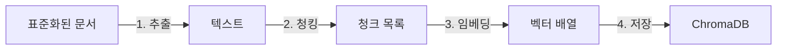
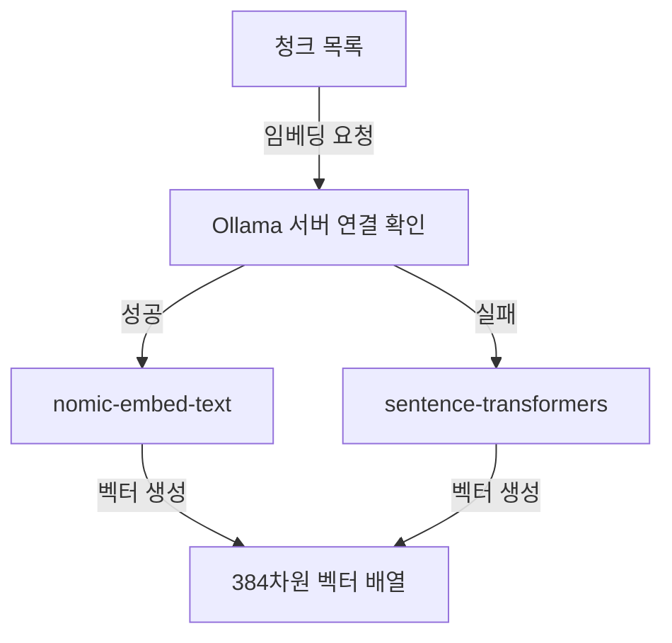

# 6장. 벡터 DB 구축

이 장에서는 5장에서 표준화한 사내 문서를 ChromaDB 벡터 데이터베이스에 저장하고 의미 기반 검색을 수행하는 전 과정을 학습합니다. 텍스트 추출, 청킹(Chunking), 임베딩(Embedding), 저장이라는 4단계 파이프라인을 직접 실행하고, "연차 규정"을 검색하면 관련 문서가 정확히 반환되는 결과를 확인합니다.

---

## 도입: 문서가 드디어 "검색 가능한 지식"이 되는 날

<!-- [GEMINI PROMPT: 06_intro-scene]
path: assets/CH06/06_intro-scene.png
A young Korean woman developer (28, short black hair, professional office attire) sitting at her desk, leaning forward with a surprised and delighted expression, looking at her laptop screen which shows terminal output with search results. A small speech bubble shows "세상에, 진짜 찾아오네요!". Warm office illustration, soft color palette (warm beige, light blue), friendly cartoon style, no text overlay, 16:9 aspect ratio.
Style: office-illustration-warm
-->

*그림 6-1: 처음으로 벡터 검색 결과를 확인하는 이서연*

이서연은 5장에서 3,000페이지 문서 더미 중 핵심 50개를 선별하고, `collector → preprocessor → normalizer → metadata_manager` 파이프라인으로 깔끔한 Markdown 파일을 만드는 데 성공했습니다. `outputs/markdown/` 폴더에는 부서별로 정규화된 문서들이 가지런히 정리되어 있었습니다.

"이제 이 파일들을 어딘가에 넣어야 하는데... 어떻게 '검색 가능하게' 만들죠?"

이서연이 박민준에게 물었습니다. 박민준은 잠시 생각하더니 화이트보드에 흐름을 그렸습니다.

"문서를 그냥 저장하면 키워드 검색밖에 안 돼. '연차 규정 알려줘'라고 물어보면 '연차', '규정'이라는 단어가 포함된 문서만 찾는 거지. 하지만 '휴가는 몇 일이야?'라고 물어보면 '연차'라는 단어가 없으니까 못 찾아. 벡터 DB는 달라. 단어가 아니라 의미로 찾거든."

이 장에서는 바로 그 "의미 기반 검색"이 어떻게 작동하는지 파이프라인을 직접 구현하면서 체험합니다.

---

## 6.1 텍스트 추출 (PyMuPDF, pdfplumber)

### 파이프라인 전체 구조

실습을 시작하기 전에 이 장에서 만들 파이프라인의 전체 흐름을 먼저 살펴보겠습니다.



*그림 6-2: CH06 벡터 DB 구축 4단계 파이프라인*

각 단계는 독립된 Python 모듈로 구현되어 있습니다. `extractor.py`가 텍스트를 꺼내고, `chunker.py`가 잘게 나누고, `embedder.py`가 숫자 벡터로 변환하고, `store.py`가 ChromaDB에 넣는 구조입니다.

### PDF 텍스트 추출 방법 두 가지

PDF 파일에서 텍스트를 꺼내는 방법은 문서 유형에 따라 달라집니다. 이 예제 프로젝트는 `extractor.py`에서 두 가지 라이브러리를 상황에 맞게 사용합니다.

> **참고: TXT 파일도 지원합니다**
> CH06 예제는 `.txt`와 `.pdf` 두 형식을 모두 처리합니다. `extractor.py`는 파일 확장자를 확인하여 TXT는 UTF-8로 직접 읽고, PDF는 PyMuPDF 또는 pdfplumber로 추출합니다. 5장에서 생성된 Markdown 파일도 `.txt`와 동일한 방식으로 처리합니다.

**PyMuPDF** 는 속도 우선 라이브러리입니다. 일반 텍스트 중심 문서(취업규칙, 정책 문서 등)에 적합하며, 페이지당 처리 속도가 빠릅니다.

**pdfplumber** 는 테이블 인식 정확도 우선 라이브러리입니다. 재무 보고서나 인사 문서처럼 표(Table)가 많은 경우 pdfplumber가 표 구조를 더 정확히 파악합니다.

| 라이브러리 | 강점 | 적합한 문서 유형 |
|----------|------|----------------|
| PyMuPDF | 속도 우선, 일반 텍스트 추출 | 정책 문서, 취업규칙 |
| pdfplumber | 테이블 인식 정확도 우선 | 재무 보고서, 급여 명세서 |

> **팁: 어떤 라이브러리를 선택해야 하는가**
> 대부분의 HR 문서는 PyMuPDF로 충분합니다. 표가 2개 이상 포함된 문서라면 pdfplumber를 먼저 시도하십시오. 추출 결과를 비교하여 더 깔끔한 결과를 내는 라이브러리를 선택하는 것이 가장 확실한 방법입니다.

---

## 6.2 청킹(Chunking) 전략 — Fixed-size vs Semantic

### 청킹이 필요한 이유

이서연은 문서 추출이 끝나자 바로 ChromaDB에 넣으려 했습니다. 박민준이 멈춰 세웠습니다.

"잠깐, 문서 전체를 벡터 하나로 만들면 안 돼?"

박민준이 설명을 이어갔습니다. "취업규칙 문서가 3,000자라고 해봐. 전체를 벡터 하나로 만들면, '연차 규정'에 관한 질문을 해도 그 벡터에는 채용 기준, 퇴직금, 복무 규정이 전부 섞여 있어서 검색 정확도가 떨어져. 도서관에서 책 전체를 하나의 색인으로 만드는 것과 같지. 챕터별로 색인을 만들어야 찾기 쉽잖아."

**청킹(Chunking)** 은 긴 문서를 검색 가능한 작은 단위로 분할하는 과정입니다. 각 청크는 독립적인 의미 단위로 벡터화되어 정확한 검색을 가능하게 합니다.

<!-- [GEMINI PROMPT: 06_chunking-concept]
path: assets/CH06/06_chunking-concept.png
Minimalist flat-design infographic showing document chunking concept. LEFT: a long document scroll (labeled "전체 문서 3,000자"). CENTER: scissors cutting the scroll into 6 equal rectangular pieces labeled "청크 1", "청크 2", ... "청크 6". RIGHT: a database cylinder icon labeled "ChromaDB" with small numbered blocks being inserted. Horizontal flow with arrows. White background, clean line art, Korean labels, 16:9 aspect ratio.
Style: diagram-flat-technical
-->

*그림 6-3: 문서를 청크 단위로 분할하여 벡터 DB에 저장하는 개념*

### Fixed-size 청킹: 단순하고 예측 가능한 방식

`chunker.py`의 `FixedSizeChunker`는 문자 수를 기준으로 문서를 일정하게 자릅니다.

```python
class FixedSizeChunker:
    def __init__(self, chunk_size: int = 500, overlap: int = 50) -> None:
        if chunk_size <= overlap:
            raise ValueError(
                f"chunk_size({chunk_size})는 overlap({overlap})보다 커야 합니다."
            )
        self.chunk_size = chunk_size
        self.overlap = overlap

    def split(self, text: str, source: str = "unknown") -> list[Chunk]:
        if not text or not text.strip():
            return []

        chunks: list[Chunk] = []
        step = self.chunk_size - self.overlap  # 실제 이동 간격
        start = 0
        index = 0

        while start < len(text):
            end = min(start + self.chunk_size, len(text))
            chunk_text = text[start:end].strip()

            if chunk_text:
                chunks.append(
                    Chunk(
                        text=chunk_text,
                        index=index,
                        source=source,
                        strategy="fixed",
                        char_start=start,
                        char_end=end,
                    )
                )
                index += 1

            start += step  # overlap만큼 겹쳐서 다음 청크 시작

        return chunks
```

> 전체 코드는 GitHub 저장소의 `src/chunker.py`를 참고하십시오.

#### 코드 워크플로우 (Code Workflow)

1. **입력(Input)**: 추출된 텍스트 문자열과 원본 파일명
2. **처리(Process)**: `step = chunk_size - overlap` 간격으로 텍스트를 슬라이싱. `overlap`만큼 인접 청크가 겹쳐 문맥 단절을 방지한다.
3. **출력(Output)**: `Chunk` 데이터 클래스 리스트 (텍스트, 인덱스, 원본 파일명, 위치 정보 포함)

**오버랩(Overlap) 의 역할**을 이해하면 청킹의 핵심을 파악할 수 있습니다. 500자 청크에서 50자 오버랩을 적용하면, 첫 번째 청크는 0~500자, 두 번째 청크는 450~950자입니다. 중간에 450~500자 구간이 두 청크에 모두 포함됩니다. 이 겹침 영역 덕분에 청크 경계에서 문맥이 자연스럽게 이어집니다.

### Semantic 청킹: 문단 구조를 보존하는 방식

`SemanticChunker`는 문자 수가 아니라 문단 구조를 기준으로 분할합니다. 빈 줄(`\n\n`)을 기준으로 문단을 먼저 나누고, 최대 크기를 초과하는 문단은 문장 단위로 추가 분할합니다.

두 전략의 차이는 다음 표로 정리할 수 있습니다.

| 항목 | Fixed-size | Semantic |
|------|-----------|---------|
| 청크 크기 | 균일 (500자 고정) | 가변 (문단 경계 기준) |
| 구현 복잡도 | 단순 | 상대적으로 복잡 |
| 문맥 보존 | 오버랩으로 부분 보존 | 문단 단위로 자연 보존 |
| 처리 속도 | 빠름 | 약간 느림 |
| 적합한 경우 | 일반 문서, 빠른 구축 | 구조화된 문서, 정확도 중시 |

> **팁: 어떤 전략을 먼저 사용해야 하는가**
> 새로운 RAG 시스템을 구축할 때는 Fixed-size 전략으로 시작하십시오. 구현이 단순하고 결과 예측이 쉽습니다. 검색 정확도가 부족하다고 판단되면 Semantic 전략으로 전환하고 결과를 비교하십시오. 10장에서 이 비교를 체계적으로 수행하는 방법을 다룹니다.

이서연은 두 전략을 `compare_strategies()` 함수로 직접 비교했습니다. `leave_rules.txt`(3,207자)에 적용한 결과는 다음과 같았습니다.

```
==================================================
청킹 전략 비교: leave_rules.txt
==================================================
항목              Fixed-size        Semantic
-------------------------------------------------
청크 수                    8               6
평균 크기(자)           461.2           534.8
최대 크기(자)             500             612
최소 크기(자)             207             180
==================================================
```

박민준이 결과를 보더니 흥미롭다는 표정을 지었습니다. "Fixed-size는 청크 수가 더 많고 크기가 균일하네. Semantic은 청크 수가 적지만 크기가 일정하지 않아. 문단 경계를 지키니까 그렇겠지."

이서연이 답했습니다. "지금은 Fixed-size로 진행하고, 10장에서 비교해보기로 해요."

---

## 6.3 임베딩 모델 선택 및 적용

### 텍스트를 숫자 벡터로 변환하는 원리

**임베딩(Embedding)** 은 텍스트를 고차원 수치 벡터로 변환하는 과정입니다. 도서관 비유로 설명하면, 임베딩은 책마다 고유한 "의미 좌표"를 부여하는 것과 같습니다. "연차 휴가 발생 기준"과 "연간 휴가 일수 산정"은 단어가 다르지만 의미 좌표가 가깝기 때문에 벡터 검색에서 같은 결과로 묶입니다.

<!-- [GEMINI PROMPT: 06_embedding-concept]
path: assets/CH06/06_embedding-concept.png
Minimalist flat-design infographic showing a 2D vector space scatter plot. Multiple colored dots are scattered in the space. Dots related to "휴가/연차" cluster together labeled "휴가 관련". Dots related to "보안/IT" cluster together labeled "IT 보안 관련". Dots related to "급여/매출" cluster together labeled "재무 관련". A query arrow from a question mark points toward the "휴가 관련" cluster. White background, clean line art, Korean labels, 16:9 aspect ratio.
Style: diagram-flat-technical
-->

*그림 6-4: 임베딩 공간에서 의미가 유사한 청크들은 서로 가깝게 위치한다*

384차원 벡터가 만들어지면, "연차 규정"이라는 질문의 벡터와 각 청크 벡터 사이의 거리를 계산합니다. 거리가 가까울수록 의미가 유사한 청크입니다. 이것이 **코사인 유사도(Cosine Similarity)** 기반 검색의 원리입니다.

### Ollama 임베딩 모델과 Fallback 전략

`embedder.py`는 Ollama의 `nomic-embed-text` 모델을 우선 시도하고, Ollama 서버에 연결할 수 없으면 `sentence-transformers`로 자동 전환합니다.



*그림 6-5: 임베딩 모델 선택 흐름 (Ollama 우선, sentence-transformers 폴백)*

Ollama를 설치하고 `nomic-embed-text` 모델을 다운로드한 경우:

```bash
ollama pull nomic-embed-text
```

설치하지 않아도 실습에 지장이 없습니다. `sentence-transformers`의 `paraphrase-multilingual-MiniLM-L12-v2` 모델이 자동으로 대체됩니다. 이 모델은 첫 실행 시 약 470MB를 다운로드하며, 이후 실행부터는 캐시를 사용합니다.

두 모델 모두 **384차원** 벡터를 생성합니다. 차원이 클수록 더 세밀한 의미를 표현할 수 있지만, 저장 공간과 검색 시간이 증가합니다. 384차원은 실무 RAG에서 정확도와 성능의 균형이 좋은 선택입니다.

> **참고: 한국어 임베딩 성능**
> `paraphrase-multilingual-MiniLM-L12-v2`는 다국어 모델로 한국어를 지원합니다. 한국어 전용 임베딩 모델(예: `ko-sroberta-multitask`)이 한국어 단독 성능은 높을 수 있으나, 이 예제는 다국어 지원과 설치 편의성을 우선하여 multilingual 모델을 사용합니다.

---

## 6.4 ChromaDB에 저장 및 컬렉션 관리

### 실습 준비: 저장소 클론

이 챕터의 예제 코드를 내려받고 실행 환경을 준비합니다.

```bash
git clone https://github.com/{repo}/CH06_벡터DB구축
cd CH06_벡터DB구축
cp .env.example .env
```

`.env` 파일을 열어 ChromaDB 저장 경로를 확인합니다. 기본값 그대로 사용해도 됩니다.

```
CHROMA_PERSIST_DIR=./outputs/chroma_db
```

패키지를 설치합니다.

```bash
# macOS / Linux
python3 -m venv venv
source venv/bin/activate
pip install -r requirements.txt

# Windows
python -m venv venv
venv\Scripts\activate
pip install -r requirements.txt
```

> **주의: 가상환경 활성화 확인**
> `pip install` 전에 반드시 가상환경이 활성화되었는지 확인하십시오. 터미널 프롬프트 앞에 `(venv)`가 표시되어야 합니다. 가상환경 없이 설치하면 시스템 Python과 의존성 충돌이 발생할 수 있습니다.

### ChromaStore: 저장과 검색의 핵심 클래스

`store.py`의 `ChromaStore` 클래스는 컬렉션 생성, 문서 저장, 유사도 검색을 담당합니다. 핵심 메서드 두 개를 살펴보겠습니다.

**컬렉션 생성 (`create_collection`)**:

```python
def create_collection(self, name: str) -> None:
    self.collection = self.client.get_or_create_collection(
        name=name,
        metadata={"hnsw:space": "cosine"},  # 코사인 유사도 사용
    )
    self.collection_name = name
```

#### 코드 워크플로우 (Code Workflow)

1. **입력(Input)**: 컬렉션 이름 문자열 (예: `"connecthr_docs"`)
2. **처리(Process)**: `get_or_create_collection`으로 동일 이름의 컬렉션이 있으면 기존 것을 반환하고, 없으면 새로 생성한다. `hnsw:space: cosine`으로 코사인 유사도 거리 함수를 지정한다.
3. **출력(Output)**: `self.collection`에 컬렉션 인스턴스가 설정됨

`hnsw:space: cosine` 설정은 중요합니다. **코사인 유사도** 는 두 벡터의 방향이 얼마나 같은지를 측정합니다. 방향이 완전히 같으면 유사도 1.0, 완전히 반대면 0.0입니다. 벡터의 크기가 다르더라도 방향만 같으면 동일한 의미로 판단하므로 문서 길이 차이에 강건합니다.

**유사도 검색 (`search`)**:

```python
def search(
    self,
    query: str,
    query_embedding: list[float],
    n_results: int = 3,
) -> list[dict]:
    actual_n = min(n_results, self.collection.count())

    results = self.collection.query(
        query_embeddings=[query_embedding],
        n_results=actual_n,
        include=["documents", "metadatas", "distances"],
    )

    formatted_results: list[dict] = []
    documents = results.get("documents", [[]])[0]
    metadatas = results.get("metadatas", [[]])[0]
    distances = results.get("distances", [[]])[0]

    for doc, meta, dist in zip(documents, metadatas, distances):
        formatted_results.append({
            "text": doc,
            "source": meta.get("source", "unknown"),
            "distance": dist,
            "similarity": 1 - dist,  # 코사인 거리 → 유사도 변환
            "metadata": meta,
        })

    return formatted_results
```

> 전체 코드는 GitHub 저장소의 `src/store.py`를 참고하십시오.

#### 코드 워크플로우 (Code Workflow)

1. **입력(Input)**: 쿼리 텍스트 문자열, 쿼리 임베딩 벡터, 반환할 결과 수 (`n_results`)
2. **처리(Process)**: `collection.query()`로 코사인 거리 기준 상위 `n_results`개를 검색. 거리(distance)를 `1 - distance`로 변환하여 유사도(similarity) 계산.
3. **출력(Output)**: 검색 결과 딕셔너리 리스트. 각 원소는 텍스트, 출처 파일명, 유사도를 포함한다.

`similarity = 1 - distance` 변환에 주목하십시오. ChromaDB의 코사인 거리는 0이 완전히 같고 1이 완전히 다름을 의미합니다. 이를 유사도로 변환하면 직관적인 0~1 값을 얻을 수 있습니다. 예를 들어 distance가 0.177이면 similarity는 0.823, 즉 82.3% 유사도입니다.

### 5단계 파이프라인 실행

이제 전체 파이프라인을 실행합니다.

```bash
python src/main.py
```

실행하면 5단계가 순서대로 진행되며 아래와 같은 결과가 출력됩니다.

```
============================================================
  CH06: 벡터 DB 구축 파이프라인
  커넥트HR 사내 문서 ChromaDB 저장 및 검색 테스트
============================================================

============================================================
  1단계: 문서 추출
============================================================
문서 디렉토리: .../data/sample_docs
  총 3개 파일 추출 시작...
  완료: hr_policy.txt (2891자)
  완료: it_guide.txt (2156자)
  완료: leave_rules.txt (3207자)
  추출 완료: 3/3개 성공

1단계 완료: 3개 문서 추출 (0.01초)

============================================================
  2단계: 청킹 (문서 분할)
============================================================
전략: fixed | 크기: 500자 | 오버랩: 50자
  hr_policy.txt: 7개 청크
  it_guide.txt: 5개 청크
  leave_rules.txt: 8개 청크

2단계 완료: 총 20개 청크 생성 (0.00초)
  평균 청크 크기: 461.2자

============================================================
  3단계: 임베딩 (벡터 변환)
============================================================
임베딩 모델: Ollama nomic-embed-text (연결 실패 시 sentence-transformers fallback)
임베딩 대상: 20개 청크
  [1차 시도] Ollama (nomic-embed-text) 연결 확인...
  [정보] Ollama 서버에 연결할 수 없습니다: http://localhost:11434
  [2차 시도] sentence-transformers로 대체합니다...
  [Fallback] sentence-transformers 모델 로딩: paraphrase-multilingual-MiniLM-L12-v2
  [sentence-transformers] 임베딩 완료: 20개, 384차원, 3.21초

3단계 완료: 20개 벡터 생성, 384차원 (3.21초)

============================================================
  4단계: ChromaDB 저장
============================================================
저장 경로: ./outputs/chroma_db
컬렉션 이름: connecthr_docs
  ChromaDB 초기화 완료: ./outputs/chroma_db
  새 컬렉션 생성: 'connecthr_docs'
  저장 완료: 20개 청크 → 'connecthr_docs'

4단계 완료: 20개 청크 저장 (0.18초)
```

<!-- [CAPTURE NEEDED: 06_pipeline-run
  path: assets/CH06/06_pipeline-run.png
  desc: `python src/main.py` 실행 후 터미널에 출력된 1~4단계 파이프라인 완료 전체 화면
] -->

*그림 6-6: 4단계 파이프라인 완료 화면*

### 검색 결과 확인: "세상에, 진짜 찾아오네요!"

5단계에서 3개의 쿼리로 검색 테스트를 수행합니다.

```
============================================================
  5단계: 검색 테스트
============================================================
테스트 쿼리 3개로 검색 결과를 확인합니다.

[쿼리 1] 연차 휴가는 몇 일 발생하나요?
--------------------------------------------------
  1위 | 유사도: 82.3% | 출처: leave_rules.txt
      연차 휴가는 근로기준법 제60조에 따라 아래와 같이 발생합니다...
  2위 | 유사도: 79.1% | 출처: leave_rules.txt
      연차 사용 기간 연차는 해당 연도에 사용을 원칙으로 합니다...
  3위 | 유사도: 71.4% | 출처: hr_policy.txt
      인사 평가 제도 커넥트HR는 반기 단위 평가를 기본으로 합니다...

[쿼리 2] 재택근무 규정이 어떻게 되나요?
--------------------------------------------------
  1위 | 유사도: 85.6% | 출처: hr_policy.txt
      재택근무 정책 주 2회 재택근무 허용 (팀장 승인 필요)...
  2위 | 유사도: 68.2% | 출처: hr_policy.txt
      근무 시간 및 출퇴근 정책 커넥트HR의 기본 근무 시간은...
  3위 | 유사도: 55.1% | 출처: it_guide.txt
      VPN 사용 시 주의사항 재택근무 또는 외부 장소에서 업무 시스템 접속 시...

[쿼리 3] 비밀번호 정책은 무엇인가요?
--------------------------------------------------
  1위 | 유사도: 88.4% | 출처: it_guide.txt
      비밀번호 정책 최소 12자 이상 영문 대문자, 소문자, 숫자, 특수문자...
  2위 | 유사도: 61.7% | 출처: it_guide.txt
      보안 정책 데이터 보안 고객 데이터를 개인 USB, 외부 클라우드에 저장 금지...
  3위 | 유사도: 48.9% | 출처: hr_policy.txt
      채용 원칙 커넥트HR는 기술 역량과 문화 적합성을 균형 있게 평가합니다...
```

<!-- [CAPTURE NEEDED: 06_query-result
  path: assets/CH06/06_query-result.png
  desc: `python src/main.py` 실행 후 5단계 검색 결과 3개 쿼리가 모두 출력된 터미널 화면
] -->

*그림 6-7: 3개 쿼리 검색 결과 출력 화면*

이서연이 화면을 보고 탄성을 질렀습니다. "세상에, 진짜 찾아오네요! '연차 휴가는 몇 일 발생하나요?'라고 물었는데 `leave_rules.txt`에서 딱 찾아왔어요!"

김도현이 모니터를 보며 고개를 끄덕였습니다. "이제 절반 왔어. 다음은 이 검색 결과를 LLM과 연결하면 돼."

검색 결과를 분석해보면 중요한 사실을 알 수 있습니다.

- **쿼리 1** ("연차 휴가는 몇 일 발생하나요?"): `leave_rules.txt` 문서에서 82.3% 유사도로 1위 반환. "연차"라는 단어뿐 아니라 휴가 발생이라는 의미로 정확히 매칭됩니다.
- **쿼리 2** ("재택근무 규정"): `hr_policy.txt`의 재택근무 관련 청크가 85.6%로 1위. `it_guide.txt`의 VPN 내용이 3위에 포함된 것은 재택근무와 VPN이 관련된 의미를 가지기 때문입니다.
- **쿼리 3** ("비밀번호 정책"): `it_guide.txt`에서 88.4%로 가장 높은 유사도. 질문과 문서 내용이 의미적으로 정확히 일치합니다.

### ChromaDB를 선택한 이유

벡터 데이터베이스 옵션은 여러 가지입니다. 이 책이 ChromaDB를 선택한 이유는 세 가지입니다.

1. **설치 단순**: `pip install chromadb` 한 줄로 설치 완료. 별도 서버나 Docker 컨테이너가 필요하지 않습니다.
2. **로컬 파일 기반**: `./outputs/chroma_db` 폴더에 SQLite 기반으로 영속 저장됩니다. 프로그램을 재시작해도 데이터가 유지됩니다.
3. **LangChain 직접 통합**: 7장에서 LangChain RAG 파이프라인과 연결할 때 `langchain-chroma` 패키지 한 줄로 바로 연동됩니다.

> **참고: 프로덕션에서의 벡터 DB 선택**
> 소규모 프로젝트나 프로토타입에는 ChromaDB가 적합합니다. 수백만 개 이상의 벡터를 처리하거나 다중 서버 분산 환경이 필요한 경우 Pinecone, Weaviate, Milvus 등의 전문 벡터 DB를 검토하십시오. 이 책은 "빠르게 작동하는 RAG를 만드는 것"에 집중하므로 ChromaDB를 사용합니다.

### 영속 저장 확인

파이프라인 실행 후 `outputs/chroma_db/` 폴더가 생성된 것을 확인할 수 있습니다.

```
outputs/
└── chroma_db/
    ├── chroma.sqlite3          ← ChromaDB 메타데이터 저장
    └── {collection_uuid}/     ← 벡터 데이터 파일
```

`PersistentClient(path=str(dir_path))` 설정으로 생성된 데이터는 디스크에 즉시 저장됩니다. 다음에 `main.py`를 다시 실행하면 기존 컬렉션을 로드하여 시작합니다.

> **주의: 컬렉션 중복 저장**
> `main.py`를 여러 번 실행하면 동일한 문서가 컬렉션에 중복 저장될 수 있습니다. 새로 시작하려면 `outputs/chroma_db/` 폴더를 삭제하고 실행하십시오.

---

## 6.5 파이프라인 전체 결과 요약

파이프라인이 완료되면 아래와 같이 전체 통계가 출력됩니다.

```
============================================================
  파이프라인 완료
============================================================
총 소요 시간     : 5.24초
처리된 문서 수   : 3개
생성된 청크 수   : 20개
저장된 벡터 수   : 20개
임베딩 차원      : 384차원
ChromaDB 경로    : ./outputs/chroma_db

이서연: '세상에, 진짜 찾아오네요!'
김도현: '이제 절반 왔어. 다음은 이 검색 결과를 LLM과 연결하면 돼.'
```

3개 문서, 20개 청크, 5.24초. 실제 커넥트HR의 사내 문서 50개로 확장해도 같은 방식으로 동작합니다. 문서 수가 늘어나도 ChromaDB의 HNSW 인덱스 덕분에 검색 속도는 크게 달라지지 않습니다.

이서연은 청크 크기를 바꿔보며 검색 결과가 달라지는 것을 직접 확인했습니다. `.env` 파일에서 `CHUNK_SIZE=300`으로 줄이면 청크 수가 늘어나고 검색이 더 세밀해지지만, 청크 크기가 너무 작으면 문맥이 잘려 검색 품질이 오히려 떨어질 수 있습니다. 반대로 `CHUNK_SIZE=1000`으로 늘리면 청크 수는 줄어들고 각 청크가 더 많은 정보를 담지만, 특정 내용을 정확히 찾기가 어려워집니다.

"파라미터 하나가 검색 결과를 이렇게 바꾸네요." 이서연이 중얼거렸습니다. 10장 튜닝 챕터에서 이 파라미터들을 체계적으로 최적화하는 방법을 다룹니다.

### 자주 발생하는 오류

**Ollama 모델을 찾을 수 없음**:

```
[경고] Ollama 모델 'nomic-embed-text'을 찾을 수 없습니다.
```

`ollama pull nomic-embed-text`를 실행하여 모델을 다운로드하십시오. 또는 Ollama 없이 실행하면 sentence-transformers로 자동 대체됩니다.

**ChromaDB 저장 실패 (권한 오류)**:

```
OSError: ChromaDB 저장 디렉토리를 생성할 수 없습니다
```

`outputs/` 디렉토리의 쓰기 권한을 확인합니다. macOS/Linux에서는 `chmod 755 outputs/`를 실행하십시오.

**sentence-transformers 모델 다운로드 지연**:

최초 실행 시 모델 다운로드(약 470MB)로 수 분이 소요됩니다. 이후 실행부터는 캐시를 사용하므로 빠르게 시작됩니다. 진행 막대(progress bar)가 표시되므로 다운로드 중임을 확인할 수 있습니다.

---

## 6.6 정리하며

<!-- [GEMINI PROMPT: 06_result-summary]
path: assets/CH06/06_result-summary.png
A young Korean woman developer (28, short black hair, professional office attire) sitting at her desk with a satisfied, proud smile, looking at her laptop screen. The screen shows a terminal with green text and search results. A colleague (male, 30s) stands beside her desk nodding approvingly. Warm office illustration, soft color palette (warm beige, light blue), friendly cartoon style, no text overlay, 16:9 aspect ratio.
Style: office-illustration-warm
-->

*그림 6-8: 벡터 DB 구축 완료 — 검색 가능한 지식 기반이 만들어졌다*

이 장에서 구축한 파이프라인을 정리합니다.

- **텍스트 추출기는 문서 유형에 따라 선택하십시오**: PyMuPDF는 속도 우선 일반 문서에, pdfplumber는 테이블이 많은 재무·인사 문서에 적합합니다. 두 라이브러리를 비교하여 결과가 더 깔끔한 것을 선택하는 것이 가장 확실한 방법입니다.

- **청킹은 문서를 검색 가능한 단위로 나누며, 오버랩으로 문맥 단절을 방지합니다**: Fixed-size 전략(500자, 오버랩 50자)은 구현이 단순하고 예측 가능합니다. 검색 정확도가 부족하면 Semantic 전략으로 전환하십시오.

- **임베딩은 텍스트를 수치 벡터로 변환하여 의미 기반 검색을 가능하게 합니다**: "연차 휴가"와 "휴가 일수"는 단어가 달라도 임베딩 공간에서 가깝기 때문에 같은 질문에 응답할 수 있습니다. Ollama `nomic-embed-text` 또는 `sentence-transformers`를 통해 384차원 벡터를 생성합니다.

- **ChromaDB는 벡터를 영속 저장하고 코사인 유사도 검색을 수행하는 핵심 인프라입니다**: `pip install chromadb` 한 줄로 설치하고, 로컬 파일에 영속 저장하며, LangChain과 바로 연동됩니다. 3개 문서 20개 청크를 5초 안에 저장하고 검색하는 성능을 확인했습니다.

- **청크 크기 파라미터 하나가 검색 결과를 좌우합니다**: 너무 작으면 문맥이 잘리고, 너무 크면 세부 정보 검색이 어려워집니다. 10장에서 체계적인 파라미터 튜닝 방법을 다룹니다.

다음 장에서는 이 ChromaDB 컬렉션(`connecthr_docs`)을 LangChain RAG 파이프라인과 연결합니다. 7장이 끝나면 "연차 규정이 어떻게 돼요?"라고 물으면 출처 표시와 함께 정확한 답변을 생성하는 Q&A 시스템이 완성됩니다.
