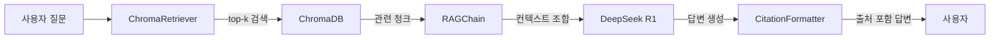
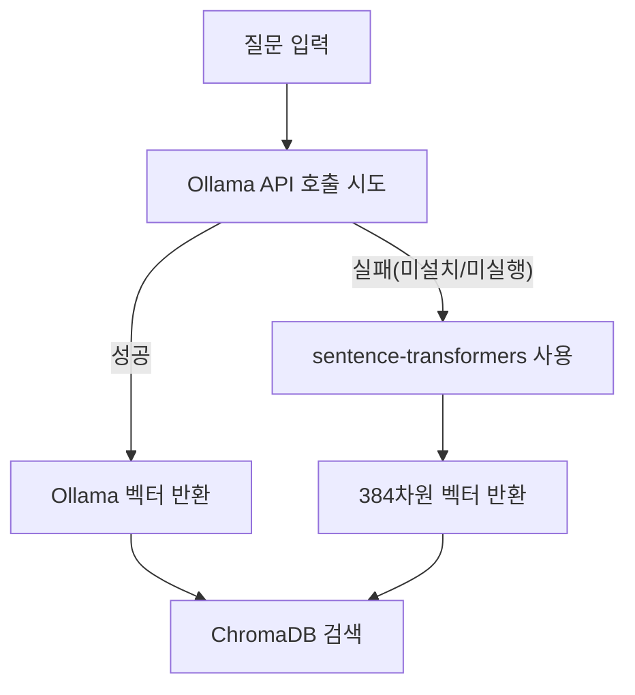

# 7장. RAG Q&A 엔진 구현

이 장에서는 6장에서 구축한 ChromaDB 벡터 데이터베이스를 LangChain과 연결하여 완전한 Q&A 엔진을 구현합니다. 사용자 질문을 받아 관련 문서를 검색하고, 검색 결과를 LLM에 전달하여 출처가 명시된 답변을 생성하는 전체 파이프라인을 완성합니다.

---

<!-- GEMINI_IMAGE
Prompt: Warm office illustration showing a team meeting in a modern conference room. A young woman (28, developer) presents a laptop screen showing a chat interface. Two colleagues watch — a team leader (35) looking impressed, and a data analyst (32) crossing arms but with a hint of surprise. The screen shows a question and a precise answer with a document citation. Soft color palette (warm beige, light blue), friendly cartoon style, no text overlay, clean background with subtle workplace elements.
Style: office-illustration-warm
Alt: 이서연이 팀 내부 데모에서 RAG 시스템의 첫 성공 답변을 보여주는 장면
-->

*그림 7-1: 팀 내부 데모 날, 처음으로 출처가 포함된 정확한 답변이 출력되는 순간*

데모 당일이었습니다. 이서연은 회의실 스크린에 터미널 창을 띄워놓고 손이 살짝 떨리는 것을 느꼈습니다. 박민준 과장이 팔짱을 낀 채 화면을 바라보고 있었고, 김도현 팀장은 조용히 뒤에 서 있었습니다.

"특별휴가 조건이 뭐예요?" 이서연이 채팅창에 질문을 입력했습니다.

잠시 후 화면에 답변이 나타났습니다.

```
특별휴가는 결혼, 출산, 배우자의 출산, 직계 존비속의 사망 등의 사유에 대해
부여합니다. 결혼 휴가는 5일, 배우자 출산 휴가는 10일입니다.

참고 문서:
  - HR 취업규칙 v1.0 (관련도: 92%)
  - HR 복리후생 안내서 (관련도: 71%)
```

박민준 과장이 천천히 고개를 끄덕였습니다. "이건 쓸 만하겠는데."

이서연은 뿌듯함이 밀려왔습니다. 하지만 김도현 팀장이 바로 말을 이었습니다. "좋아. 그런데 'DB 질문도 처리할 수 있어야 해.' 예를 들어 '김철수의 남은 연차는 몇 일이야?' 같은 거 말이야."

다음 미션이 이미 시작되고 있었습니다.

---

6장에서 이서연이 "세상에, 진짜 찾아오네요!"라고 외쳤던 순간은 유사도 검색이 처음 작동한 때였습니다. 하지만 그것은 아직 반쪽짜리 시스템이었습니다. ChromaDB가 관련 문서를 찾아오는 것과 그 문서를 바탕으로 사람이 읽을 수 있는 답변을 생성하는 것은 전혀 다른 문제입니다. 이 장에서는 그 두 단계를 연결하는 **RAG Q&A 파이프라인** 을 완성합니다.

---

## 7.1 LangChain RAG 파이프라인 설계

### LangChain을 선택한 이유

RAG 파이프라인을 직접 구현하는 것도 가능합니다. 검색기, 프롬프트 조합, LLM 호출을 각각 함수로 만들면 됩니다. 그렇다면 왜 LangChain을 사용하는 것입니까?

이유는 세 가지입니다.

첫째, **표준화된 인터페이스** 입니다. LangChain은 Retriever, Prompt, LLM, OutputParser라는 네 가지 컴포넌트를 표준 인터페이스로 정의합니다. 각 컴포넌트는 독립적으로 교체할 수 있습니다. Ollama를 OpenAI로 바꾸더라도 나머지 코드는 그대로입니다.

둘째, **LCEL(LangChain Expression Language)** 입니다. `|` 연산자로 컴포넌트를 선형으로 연결하는 문법입니다. 코드가 파이프라인의 흐름 그 자체를 나타내므로 가독성이 높습니다.

셋째, **생태계** 입니다. ChromaDB, Ollama, FastAPI 등 이 책에서 사용하는 도구들이 모두 LangChain과 직접 통합을 지원합니다.

> **참고: LCEL 이전의 LangChain**
> LangChain 초기 버전(0.1 이하)은 `Chain` 객체를 중첩하는 방식이었습니다. LangChain 0.3+에서는 LCEL이 표준입니다. 이 책은 LangChain 0.3+ 기준으로 작성되었으므로 `langchain-core`, `langchain-ollama` 패키지가 필요합니다.

### LCEL 파이프라인 구조

이 챕터에서 구현할 파이프라인의 전체 흐름은 다음과 같습니다.



*그림 7-2: RAG Q&A 파이프라인 전체 흐름*

사용자 질문은 `ChromaRetriever`로 전달됩니다. `ChromaRetriever`는 질문을 벡터로 변환하고 ChromaDB에서 유사한 청크를 찾습니다. 찾은 청크들은 `RAGChain`에서 프롬프트로 조합되어 DeepSeek R1에 전달됩니다. 마지막으로 `CitationFormatter`가 LLM 답변에 참고 문서 정보를 붙여 최종 응답을 만듭니다.

### 실습 준비 — 레포지토리 클론

이 챕터의 예제 코드를 클론하십시오.

```bash
git clone https://github.com/{repo}/CH07_RAG_QA엔진
cd CH07_RAG_QA엔진
```

환경 변수를 설정하십시오.

```bash
cp .env.example .env
```

`.env` 파일을 열어 아래 항목을 확인하십시오.

```
OLLAMA_MODEL=deepseek-r1
OLLAMA_BASE_URL=http://localhost:11434
OLLAMA_EMBED_MODEL=nomic-embed-text
CHROMA_PERSIST_DIR=./data/chroma_db
CHROMA_COLLECTION=connecthr_docs
RAG_TOP_K=3
```

패키지를 설치하십시오.

```bash
# macOS / Linux
python3 -m venv venv
source venv/bin/activate
pip install -r requirements.txt

# Windows
python -m venv venv
venv\Scripts\activate
pip install -r requirements.txt
```

> **주의: ChromaDB 선행 실행 필요**
> 이 챕터는 6장에서 구축한 ChromaDB 데이터를 사용합니다. CH06 예제를 먼저 실행하여 `connecthr_docs` 컬렉션을 생성하십시오. CH06 없이 실행하면 `RuntimeError: ChromaDB 컬렉션을 로드할 수 없습니다` 오류가 발생합니다.

> **팁: Ollama 없이도 실행 가능**
> Ollama가 설치되지 않아도 됩니다. 이 예제는 Ollama 연결이 불가능할 때 자동으로 Mock 모드로 전환합니다. 전체 파이프라인 흐름을 체험하는 데 문제가 없습니다. 실제 LLM 답변을 원하면 `ollama pull deepseek-r1` 을 먼저 실행하십시오.

### 프롬프트 템플릿 — 컨텍스트 활용의 핵심

`src/rag_chain.py`의 `SYSTEM_PROMPT`를 살펴보십시오.

```python
SYSTEM_PROMPT = """당신은 커넥트HR 사내 문서를 기반으로 답변하는 AI 어시스턴트입니다.
아래 컨텍스트를 참고하여 질문에 답변하십시오.
컨텍스트에 없는 내용은 "해당 정보를 찾을 수 없습니다"라고 답하십시오.

컨텍스트:
{context}

질문: {question}
답변:"""
```

#### 코드 워크플로우 (Code Workflow)

1. **입력(Input)**: `{context}` — 검색된 청크들을 번호와 출처를 붙여 조합한 문자열. `{question}` — 사용자 질문.
2. **처리(Process)**: LLM이 컨텍스트를 우선 참고하여 답변을 생성합니다. 컨텍스트에 없는 내용은 "해당 정보를 찾을 수 없습니다"라고 명시적으로 답하도록 지시합니다.
3. **출력(Output)**: LLM이 생성한 답변 문자열.

이 프롬프트에서 핵심은 두 번째 문장입니다. "컨텍스트에 없는 내용은 '해당 정보를 찾을 수 없습니다'라고 답하십시오." 이 한 줄이 **환각(Hallucination)** 을 방지합니다. LLM은 기본적으로 모든 질문에 답하려는 경향이 있습니다. 이 지시가 없으면 컨텍스트 밖의 내용을 스스로 지어낼 수 있습니다.

> **팁: 프롬프트 엔지니어링의 원칙**
> "모르면 모른다"고 말하도록 명시적으로 지시하는 것은 기업 환경에서 필수입니다. HR 정책을 잘못 답변하면 실제 업무상 혼란을 일으킬 수 있습니다. 10장에서 이 프롬프트를 더 정교하게 튜닝하는 방법을 다룹니다.

### LCEL 체인 구성 코드

`RAGChain._setup_langchain()` 메서드가 LCEL 체인을 구성합니다.

```python
from langchain_ollama import ChatOllama
from langchain_core.prompts import ChatPromptTemplate
from langchain_core.output_parsers import StrOutputParser

# LLM 인스턴스 생성
self.llm = ChatOllama(
    model=OLLAMA_MODEL,
    base_url=OLLAMA_BASE_URL,
    temperature=0.1,
)

# LCEL 체인 구성
prompt = ChatPromptTemplate.from_template(SYSTEM_PROMPT)
output_parser = StrOutputParser()

# 파이프 연산자(|)로 체인 연결
self.chain = prompt | self.llm | output_parser
```

#### 코드 워크플로우 (Code Workflow)

1. **입력(Input)**: `OLLAMA_MODEL`, `OLLAMA_BASE_URL` 환경 변수 값.
2. **처리(Process)**: `ChatPromptTemplate`(프롬프트 조합) → `ChatOllama`(LLM 추론) → `StrOutputParser`(문자열 파싱)의 순서로 `|` 연산자로 연결합니다. `temperature=0.1`은 답변의 일관성을 높이기 위해 낮게 설정합니다.
3. **출력(Output)**: `self.chain` — 입력으로 `{"context": ..., "question": ...}` 딕셔너리를 받아 답변 문자열을 반환하는 LCEL 체인 객체.

`|` 연산자는 Python의 비트 OR 연산자를 LangChain이 재정의한 것입니다. 왼쪽 컴포넌트의 출력이 오른쪽 컴포넌트의 입력으로 자동으로 전달됩니다. 체인을 읽을 때 왼쪽에서 오른쪽으로 데이터가 흐른다고 이해하면 됩니다.

---

## 7.2 유사도 검색 및 컨텍스트 구성

### ChromaRetriever — 검색의 실체

`src/retriever.py`의 `ChromaRetriever.search()` 메서드가 유사도 검색을 담당합니다. 핵심 로직은 다음과 같습니다.

```python
def search(self, query: str, k: Optional[int] = None) -> list[dict]:
    top_k = k or self.default_k
    actual_k = min(top_k, self.collection.count())

    # 쿼리 임베딩 생성 (Ollama → sentence-transformers fallback)
    query_embedding, self.embed_engine = _embed_query(query)

    # ChromaDB 검색 수행
    results = self.collection.query(
        query_embeddings=[query_embedding],
        n_results=actual_k,
        include=["documents", "metadatas", "distances"],
    )

    # 코사인 거리 → 유사도 점수 변환
    docs = results.get("documents", [[]])[0]
    metas = results.get("metadatas", [[]])[0]
    distances = results.get("distances", [[]])[0]

    formatted = []
    for doc, meta, dist in zip(docs, metas, distances):
        similarity_score = max(0.0, 1.0 - dist)  # 거리 → 유사도
        formatted.append({
            "content": doc,
            "source": meta.get("source", "unknown"),
            "score": round(similarity_score, 4),
            "metadata": meta,
        })

    return formatted
```

#### 코드 워크플로우 (Code Workflow)

1. **입력(Input)**: `query` — 사용자 질문 문자열. `k` — 반환할 결과 수 (기본값: 환경 변수 `RAG_TOP_K`, 기본 3).
2. **처리(Process)**: 질문을 벡터로 변환한 뒤 ChromaDB에서 코사인 거리 기준으로 가장 가까운 청크 k개를 검색합니다. ChromaDB가 반환하는 거리값(0~2)을 유사도(0~1)로 변환합니다(`1.0 - dist`).
3. **출력(Output)**: `content`(청크 텍스트), `source`(파일명), `score`(유사도 0~1), `metadata`(메타데이터)를 담은 딕셔너리 리스트.

### 임베딩 엔진 자동 전환

`_embed_query()` 함수는 Ollama를 1차로 시도하고 실패하면 `sentence-transformers`로 자동 전환합니다.



*그림 7-3: 임베딩 엔진 Fallback 전략*

> **주의: 임베딩 모델 일관성**
> 검색 시 사용하는 임베딩 모델은 6장에서 문서를 저장할 때 사용한 모델과 반드시 동일해야 합니다. Ollama `nomic-embed-text`로 저장했다면 검색도 같은 모델로 해야 합니다. 모델이 다르면 벡터 공간이 달라져 검색 결과가 완전히 틀어집니다.

### top-k 값의 영향

`RAG_TOP_K` 환경 변수(기본값 3)는 검색 결과의 수를 결정합니다. 이 값이 검색 품질에 미치는 영향은 다음과 같습니다.

| k 값 | 장점 | 단점 |
|------|------|------|
| 1~2 | 가장 관련성 높은 청크만 전달 | 필요한 정보를 놓칠 수 있음 |
| 3~5 (권장) | 관련 정보를 폭넓게 수집 | 프롬프트 크기 증가 |
| 10 이상 | 거의 모든 관련 청크 포함 | 노이즈 증가, 답변 품질 저하 |

기본값 3은 대부분의 HR 정책 질문에 적합합니다. 10장에서 데이터 특성에 맞게 조정하는 방법을 다룹니다.

### 컨텍스트 문자열 구성

검색된 청크들은 `_build_context_string()` 함수를 통해 번호를 붙인 하나의 문자열로 조합됩니다.

```python
def _build_context_string(docs: list[dict]) -> str:
    context_parts = []
    for i, doc in enumerate(docs, start=1):
        source = doc.get("source", "unknown")
        content = doc.get("content", "")
        context_parts.append(f"[{i}] ({source})\n{content}")
    return "\n\n".join(context_parts)
```

#### 코드 워크플로우 (Code Workflow)

1. **입력(Input)**: `docs` — `search()`가 반환한 청크 딕셔너리 리스트.
2. **처리(Process)**: 각 청크 앞에 `[1]`, `[2]`, `[3]` 번호와 출처 파일명을 붙입니다. 번호를 붙이는 이유는 LLM이 어떤 청크를 근거로 답변했는지 추적하기 쉽게 하기 위해서입니다.
3. **출력(Output)**: `[1] (HR취업규칙_v1.0)\n연차 휴가는...` 형식의 멀티라인 문자열.

이 컨텍스트 문자열이 `SYSTEM_PROMPT`의 `{context}` 자리에 삽입됩니다. LLM은 이 내용을 읽고 답변을 생성합니다.

---

## 7.3 출처 표시(Source Citation) 시스템

### 왜 출처가 필요한가

박민준 과장이 "이건 쓸 만하겠는데"라고 말할 수 있었던 이유는 출처 때문입니다. 단순히 "특별휴가는 5일입니다"라는 답변과 "HR 취업규칙 v1.0(관련도 92%)에 따르면 특별휴가는 5일입니다"라는 답변은 신뢰도가 다릅니다.

기업 환경에서 AI 시스템의 답변은 반드시 검증할 수 있어야 합니다. 출처가 없으면 직원이 직접 매뉴얼을 찾아 확인해야 하고, 그렇다면 시스템의 가치가 절반으로 줄어듭니다.

<!-- [GEMINI PROMPT: 07_before-after]
path: assets/CH07/07_before-after.png
Simple before/after comparison infographic. LEFT side labeled "출처 없는 답변": a chat bubble showing "특별휴가는 5일입니다." with a red uncertain indicator. RIGHT side labeled "출처 있는 답변": a chat bubble showing the same answer plus "HR 취업규칙 v1.0 (관련도 92%)" citation, with a green trusted indicator. Clean flat design, white background, minimal icons, Korean labels, 16:9 aspect ratio.
Style: before-after-infographic
-->

*그림 7-4: 출처 표시가 답변 신뢰도를 결정하는 방식*

### CitationFormatter — 출처 포맷터

`src/citation.py`의 `CitationFormatter` 클래스가 출처 표시를 담당합니다.

```python
class CitationFormatter:
    def __init__(
        self,
        show_score: bool = True,
        max_sources: int = 3,
    ) -> None:
        self.show_score = show_score
        self.max_sources = max_sources
```

`show_score=True`로 설정하면 각 출처 옆에 관련도(유사도 점수)를 백분율로 표시합니다. `max_sources=3`은 최대 3개의 출처만 표시하여 답변이 너무 길어지지 않도록 합니다.

### 출처 정보 추출 — extract_source_info()

```python
def extract_source_info(self, docs: list[dict]) -> list[dict]:
    # 출처별 최고 유사도 점수 추적
    source_scores: dict[str, float] = {}
    for doc in docs:
        source = doc.get("source", "unknown")
        score = doc.get("score", 0.0)
        if source not in source_scores or score > source_scores[source]:
            source_scores[source] = score

    # 유사도 점수 내림차순 정렬
    sorted_sources = sorted(
        source_scores.items(),
        key=lambda item: item[1],
        reverse=True,
    )

    # 출처 정보 딕셔너리 구성
    source_info_list = []
    for source, score in sorted_sources[:self.max_sources]:
        source_info_list.append({
            "source": source,
            "display_name": _normalize_source_name(source),
            "score": score,
        })
    return source_info_list
```

#### 코드 워크플로우 (Code Workflow)

1. **입력(Input)**: `docs` — 검색된 청크 딕셔너리 리스트. 동일 파일에서 여러 청크가 검색될 수 있습니다.
2. **처리(Process)**: 동일 출처 파일에서 여러 청크가 검색된 경우 가장 높은 유사도 점수만 유지합니다. 중복을 제거한 뒤 유사도 내림차순으로 정렬합니다.
3. **출력(Output)**: `source`(파일명), `display_name`(가독성 처리된 이름), `score`(최고 유사도 점수)를 담은 딕셔너리 리스트.

`_normalize_source_name()` 함수는 파일 경로를 사람이 읽기 좋은 형태로 변환합니다. 예를 들어 `./docs/HR_취업규칙_v1.0.pdf`는 `HR 취업규칙 v1.0`으로 변환됩니다. 버전 번호(`v1.0`)는 확장자가 아니므로 그대로 보존됩니다.

### 최종 답변 포맷 — format_response()

```python
def format_response(self, answer: str, sources: list[dict]) -> str:
    answer_text = answer.strip()

    # 출처 섹션 구성
    source_lines = []
    for source_info in sources:
        display_name = source_info.get("display_name", "사내 문서")
        score = source_info.get("score", 0.0)
        if self.show_score:
            line = f"  - {display_name} (관련도: {score:.0%})"
        else:
            line = f"  - {display_name}"
        source_lines.append(line)

    citation_block = "\n".join(source_lines)
    return f"{answer_text}\n\n참고 문서:\n{citation_block}"
```

#### 코드 워크플로우 (Code Workflow)

1. **입력(Input)**: `answer` — LLM이 생성한 답변 텍스트. `sources` — `extract_source_info()`가 반환한 출처 정보 리스트.
2. **처리(Process)**: 답변 텍스트 아래에 "참고 문서:" 섹션을 추가합니다. 각 출처를 `- 문서명 (관련도: XX%)` 형식으로 나열합니다. `{score:.0%}`는 0.92를 `92%`로 변환하는 Python 포맷 문법입니다.
3. **출력(Output)**: 답변 본문 + 참고 문서 목록이 결합된 최종 응답 문자열.

실제 출력 예시는 다음과 같습니다.

```
특별휴가는 결혼, 출산, 배우자의 출산, 직계 존비속의 사망 등의 사유에 대해
부여합니다. 결혼 휴가는 5일, 배우자 출산 휴가는 10일입니다.

참고 문서:
  - HR 취업규칙 v1.0 (관련도: 92%)
  - HR 복리후생 안내서 (관련도: 71%)
```

---

## 7.4 기본 채팅 인터페이스 연결

### RAGChain.invoke() — 전체 파이프라인 실행

모든 컴포넌트를 연결하는 핵심 메서드는 `RAGChain.invoke()`입니다. 전체 흐름을 살펴보십시오.

```python
def invoke(self, question: str) -> dict:
    # 1단계: 유사도 검색
    retrieved_docs = self.retriever.search(query=question, k=self.top_k)

    if not retrieved_docs:
        return {
            "answer": self.citation_formatter.format_no_result(),
            ...
        }

    # 2단계: 컨텍스트 문자열 구성
    context = _build_context_string(retrieved_docs)

    # 3단계: LLM 추론
    if self.is_mock_mode:
        prompt_text = SYSTEM_PROMPT.format(context=context, question=question)
        raw_answer = self.llm.invoke(prompt_text)
    else:
        raw_answer = self.chain.invoke({"context": context, "question": question})

    # 4단계: 출처 추출 및 포맷팅
    sources = self.citation_formatter.extract_source_info(retrieved_docs)
    formatted_answer = self.citation_formatter.format_response(
        answer=raw_answer,
        sources=sources,
    )

    return {
        "answer": formatted_answer,
        "raw_answer": raw_answer,
        "sources": sources,
        "retrieved_docs": retrieved_docs,
        "question": question,
    }
```

#### 코드 워크플로우 (Code Workflow)

1. **입력(Input)**: `question` — 사용자 질문 문자열.
2. **처리(Process)**: 4단계 순차 실행 — (1) ChromaDB 검색 → (2) 컨텍스트 문자열 조합 → (3) LLM에 프롬프트 전달하여 답변 생성 → (4) 출처 포맷팅.
3. **출력(Output)**: `answer`(출처 포함 최종 답변), `raw_answer`(LLM 원본 답변), `sources`(출처 목록), `retrieved_docs`(검색된 청크), `question`(원본 질문)을 담은 딕셔너리.

전체 코드는 GitHub 레포지토리의 `src/rag_chain.py`를 참고하십시오.

### 채팅 인터페이스 실행

채팅 모드로 실행하십시오.

```bash
python src/main.py
```

데모 모드로 5개 샘플 질문을 자동 실행하십시오.

```bash
python src/main.py --demo
```

<!-- [CAPTURE NEEDED: 07_chat-interface
  path: assets/CH07/07_chat-interface.png
  desc: `python src/main.py` 실행 직후 터미널 전체 화면 (배너 출력 및 첫 번째 질문 입력 상태)
] -->

*그림 7-5: 커넥트HR AI 어시스턴트 채팅 인터페이스 시작 화면*

정상 실행 시 아래와 같은 화면이 나타납니다.

```
커넥트HR RAG Q&A 엔진 시작...
  ChromaDB 경로: ./data/chroma_db
  컬렉션: connecthr_docs
  기존 ChromaDB 발견: 'connecthr_docs' (8개 문서)
  ChromaRetriever 초기화 완료: 'connecthr_docs' (8개 문서)
  Ollama 서버 연결 확인 중: http://localhost:11434
  [경고] Ollama 서버에 연결할 수 없습니다. Mock 모드로 전환합니다.
  [Mock 모드] LLM: deepseek-r1

============================================================
  커넥트HR AI 어시스턴트
  사내 문서 기반 Q&A 시스템 (RAG 엔진)
============================================================
  사용 가능한 명령:
    /quit  — 종료
    /clear — 대화 히스토리 초기화
    /stats — 검색 통계 표시
    /help  — 도움말
============================================================

  모드: mock | 모델: deepseek-r1 | top-k: 3

질문 >
```

### 채팅 명령어

채팅 인터페이스는 다음 명령어를 지원합니다.

| 명령어 | 동작 |
|--------|------|
| `/quit` | 채팅 종료 및 세션 통계 출력 |
| `/clear` | 대화 히스토리 초기화 |
| `/stats` | 총 질문 수, 평균 응답 시간 등 통계 표시 |
| `/help` | 명령어 안내 및 예시 질문 목록 표시 |

`/stats` 명령은 현재 세션의 사용 현황을 보여줍니다.

```
------------------------------------------------------------
  검색 통계
----------------------------------------
  총 질문 수       : 3회
  평균 응답 시간   : 1.4초
  총 소요 시간     : 4.2초
  세션 시작 시각   : 2026-02-26T10:30:00
  LLM 모드         : mock
  모델명           : deepseek-r1
  검색 top-k       : 3
------------------------------------------------------------
```

### 대화 히스토리 관리

`ChatSession` 클래스는 모든 질문과 답변을 메모리에 보관합니다. `/clear` 명령을 실행하면 초기화됩니다. 현재 구현은 세션 메모리 방식으로, 프로그램을 종료하면 히스토리가 사라집니다. 히스토리를 파일로 저장하거나 다음 질문에 이전 맥락을 자동으로 포함하는 방식은 9장에서 다룹니다.

### 트러블슈팅

실행 중 문제가 발생하면 아래 표를 참고하십시오.

| 증상 | 원인 | 해결 방법 |
|------|------|---------|
| `RuntimeError: chromadb가 설치되지 않았습니다` | chromadb 미설치 | `pip install chromadb` |
| `RuntimeError: ChromaDB 컬렉션을 로드할 수 없습니다` | CH06 예제 미실행 | CH06 예제를 먼저 실행하여 벡터 DB 구축 |
| `Mock 모드로 전환합니다` | Ollama 서버 미실행 | `ollama serve` 실행 후 재시작 |
| `model not found` | DeepSeek 모델 미다운로드 | `ollama pull deepseek-r1` |
| 첫 실행 시 느림 | sentence-transformers 모델 다운로드 중 | 최초 1회만 소요, 이후 캐시에서 로드 |
| `ImportError: langchain` | LangChain 미설치 | `pip install -r requirements.txt` |

<!-- GEMINI_IMAGE
Prompt: Simple before/after comparison infographic: LEFT side shows "매뉴얼 직접 검색 10분" with a frustrated person icon looking through stacks of papers, red indicator with large number "10min". RIGHT side shows "AI Q&A 시스템 30초" with a happy person icon at a chat interface, green indicator with "30sec". Clean arrow in the middle pointing right, flat design, white background, no text overlay except the labels.
Style: before-after-infographic
Alt: 10분에서 30초로 응답 시간이 단축된 커넥트HR AI 어시스턴트의 효과
-->

*그림 7-6: 사내 문서 검색 시간 단축 효과 — 10분에서 30초로*

데모가 끝난 후 이서연과 김 팀장은 복도에서 주먹을 맞부딪혔습니다. 3주 만에 사내 문서를 읽고 답변하는 AI 어시스턴트가 실제로 동작한 것입니다. 이서연은 주당 10시간을 써야 했던 문서 검색 작업이 이제 30초로 줄어든다는 사실이 실감나지 않았습니다.

---

## 7.5 정리하며

- **LangChain LCEL은 파이프라인을 코드로 표현하는 표준 방식입니다.** `ChatPromptTemplate | ChatOllama | StrOutputParser`처럼 `|` 연산자로 컴포넌트를 연결하면 각 단계의 역할이 코드에서 직접 읽힙니다. 컴포넌트를 교체해야 할 때도 한 줄만 수정하면 됩니다.

- **프롬프트에 "모르면 모른다"를 명시해야 환각을 방지합니다.** "컨텍스트에 없는 내용은 해당 정보를 찾을 수 없습니다라고 답하십시오"라는 한 줄이 기업 환경에서 AI 신뢰도를 결정합니다.

- **top-k 값은 검색 정확도와 노이즈의 균형을 결정합니다.** 기본값 3이 대부분의 HR 정책 질문에 적합하지만, 문서 특성에 따라 조정이 필요합니다. 10장에서 체계적인 조정 방법을 다룹니다.

- **출처 표시는 선택이 아니라 필수입니다.** "HR 취업규칙 v1.0(관련도 92%)에 따르면"이라는 출처 한 줄이 답변을 검증 가능하게 만들고, 그 순간 AI 시스템은 실무 도구로 인정받습니다.

- **이것으로 사내 문서 검색 시스템이 완성되었습니다.** 이제 비정형 문서(HR 매뉴얼)에 대한 Q&A는 작동합니다. 다음 8장에서는 "김철수의 남은 연차는 몇 일인가?"처럼 정형 DB를 조회해야 하는 질문까지 처리하는 통합 에이전트를 구현합니다.

---

> **다음 장 예고: 8장 통합 에이전트 설계 (MCP + RAG)**
> 7장의 RAG Q&A 엔진과 4장에서 확인한 CRUD API(PostgreSQL)를 하나의 에이전트로 연결합니다. "연차 규정이 어떻게 되나요?"(문서)와 "김철수의 남은 연차는?"(DB)을 같은 인터페이스에서 처리하는 통합 시스템을 구현합니다. 이것이 MCP(Model Context Protocol)의 역할입니다.
