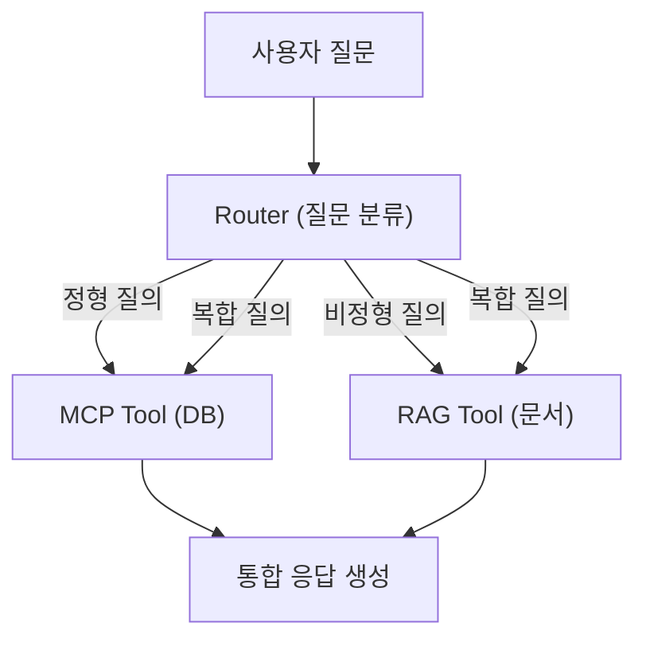

# 8장. 통합 에이전트 설계 (MCP + RAG)

이 장에서는 정형 데이터(DB)와 비정형 데이터(문서)를 동시에 처리하는 **통합 에이전트(Integrated Agent)** 를 구현합니다. 질문의 의도를 분류하는 라우터와 여러 도구를 자유롭게 선택하는 LangChain ReAct 에이전트를 결합하여, 단 하나의 질문으로 DB 조회와 문서 검색을 동시에 수행하는 시스템을 완성합니다.

---

<!-- [GEMINI PROMPT: 08_intro_scene]
path: assets/CH08/08_intro_scene.png
A young Korean woman developer (28, short black hair, professional office attire) sitting at her desk with a thoughtful, slightly overwhelmed expression. Her dual monitors show: LEFT monitor with a database table icon and SQL query, RIGHT monitor with stacked document icons (PDF, Word files). She is looking between the two monitors unsure which to use. Warm office illustration, soft color palette (warm beige, light blue), friendly cartoon style, no text overlay, 16:9 aspect ratio.
Style: office-illustration-warm
-->

*그림 8-1: 두 세계를 동시에 처리해야 하는 이서연*

---

이서연은 노트북 화면을 바라보며 멈췄습니다. 고객 지원 채널에 방금 새로운 문의가 도착했습니다.

> "김철수 씨의 이번 달 남은 연차가 몇 일인지, 그리고 연차를 특별휴가로 전환하는 조건이 무엇인지 알려주세요."

CH07에서 완성한 RAG Q&A 엔진은 사내 문서를 검색하는 데 탁월했습니다. 그러나 이 질문은 두 가지를 동시에 요구하고 있었습니다. "남은 연차"는 PostgreSQL의 연차 테이블을 조회해야 하고, "특별휴가 전환 조건"은 HR 취업규칙 문서를 검색해야 합니다.

이서연이 옆 자리 팀장 김도현에게 물었습니다.

"두 가지를 동시에 어떻게 처리하죠? RAG만 쓰면 DB 값을 모르고, DB만 쓰면 문서 내용을 모르는데요."

김도현이 간단하게 답했습니다. "질문을 먼저 분류해봐. DB 질문인지, 문서 질문인지, 아니면 둘 다인지."

이 한 마디가 이 장 전체의 설계 원칙입니다.

---

## 8.1 정형/비정형 분리 원칙

에이전트를 설계하기 전에 데이터의 성격을 이해해야 합니다. 커넥트HR 시스템에는 두 종류의 데이터가 공존합니다.

### 두 데이터 세계의 차이

**정형 데이터(Structured Data)** 는 테이블 형태로 정리된 데이터입니다. 직원 이름, 연차 잔액, 부서 매출처럼 행(Row)과 열(Column)로 구조화되어 있으며, SQL 조회로 정확한 값을 가져올 수 있습니다.

**비정형 데이터(Unstructured Data)** 는 PDF, Word 문서, Markdown 파일처럼 고정된 구조가 없는 데이터입니다. "특별휴가 전환 조건", "출산휴가 신청 절차"처럼 의미를 이해해야 검색할 수 있으며, CH06에서 구축한 ChromaDB의 벡터 유사도 검색이 필요합니다.

| 특성 | 정형 데이터 (DB) | 비정형 데이터 (문서) |
|------|----------------|-------------------|
| 예시 질문 | "이서연의 남은 연차는?" | "연차 신청 절차가 어떻게 되나요?" |
| 저장소 | PostgreSQL | ChromaDB |
| 검색 방식 | SQL 정확 조회 | 벡터 유사도 검색 |
| 결과 형태 | 수치, 정확한 값 | 텍스트 청크 + 출처 |

### 왜 분리해서 처리하는가

하나의 검색 방식으로 두 데이터를 모두 처리하려는 시도는 실패합니다. 이유는 명확합니다.

- RAG로 "이서연의 남은 연차"를 검색하면: 취업규칙에서 "연차는 매년 15일 발생한다"는 규정은 찾지만, 이서연의 실제 잔여 일수(3일)는 알 수 없습니다.
- SQL로 "특별휴가 전환 조건"을 조회하면: 조건이라는 열(Column)이 DB 테이블에 존재하지 않습니다. 규정 문서에만 있는 정보입니다.

각 데이터에 최적화된 검색 전략을 연결하고, 질문의 의도에 따라 올바른 경로로 분기하는 것이 통합 에이전트의 핵심입니다.



*그림 8-2: 통합 에이전트 전체 흐름 — 질문 유형에 따라 DB 또는 문서로 분기*

---

## 8.2 질문 라우팅 전략 (규칙 기반 → LLM 판단)

질문을 올바른 경로로 분기하는 컴포넌트를 **질문 라우터(Query Router)** 라고 합니다. 이서연이 처음 구현한 라우터는 단순한 키워드 규칙에서 시작하여, 자연어의 다양한 표현을 커버하는 LLM 기반 분류로 발전합니다.

### 8.2.1 저장소 클론 및 실행

먼저 예제 저장소를 클론합니다.

```bash
git clone https://github.com/{repo}/CH08_통합에이전트
cd CH08_통합에이전트
```

환경 변수 파일을 복사하고 PostgreSQL 컨테이너를 시작합니다.

```bash
cp .env.example .env
docker-compose up -d
```

Python 의존성을 설치하고 메인 스크립트를 실행합니다.

```bash
python -m venv venv
source venv/bin/activate        # Windows: venv\Scripts\activate
pip install -r requirements.txt
python src/main.py
```

> **참고: Ollama 없이도 실행 가능합니다**
> Ollama가 설치되지 않으면 Mock 모드로 자동 전환됩니다. Mock 모드에서는 LLM 없이 도구를 직접 호출하여 결과를 출력하므로, 에이전트 흐름 전체를 확인할 수 있습니다. 실제 자연어 답변을 보려면 `ollama pull deepseek-r1` 후 재실행하십시오.

### 8.2.2 규칙 기반 1단계 분류

`src/router.py`의 `QueryRouter` 클래스는 2단계 분류 전략을 사용합니다. 1단계는 키워드 사전과 매칭하는 **규칙 기반 분류** 입니다.

```python
# src/router.py — 키워드 사전 정의 및 규칙 기반 분류 핵심 발췌

STRUCTURED_KEYWORDS: list[str] = [
    "연차", "잔여", "남은", "사용한", "급여", "매출", "직원", "부서",
    "입사", "재직", "연봉", "월급", "목표", "달성", "분기", "실적",
]

UNSTRUCTURED_KEYWORDS: list[str] = [
    "정책", "규정", "절차", "방법", "어떻게", "안내", "가이드",
    "규칙", "기준", "조건", "원칙", "지침", "프로세스", "신청",
]

def _rule_based_classify(self, question: str) -> tuple[QueryType | None, float]:
    question_lower = question.lower()

    structured_hits = [kw for kw in STRUCTURED_KEYWORDS if kw in question_lower]
    unstructured_hits = [kw for kw in UNSTRUCTURED_KEYWORDS if kw in question_lower]

    has_structured = len(structured_hits) > 0
    has_unstructured = len(unstructured_hits) > 0

    if has_structured and has_unstructured:
        confidence = min(0.95, 0.5 + (len(structured_hits) + len(unstructured_hits)) * 0.05)
        return "hybrid", confidence
    elif has_structured:
        confidence = min(0.95, 0.6 + len(structured_hits) * 0.1)
        return "structured", confidence
    elif has_unstructured:
        confidence = min(0.95, 0.6 + len(unstructured_hits) * 0.1)
        return "unstructured", confidence

    return None, 0.0
```

#### 코드 워크플로우 (Code Workflow)

1. **입력(Input)**: 사용자 질문 문자열 (`question`)
2. **처리(Process)**: `STRUCTURED_KEYWORDS`와 `UNSTRUCTURED_KEYWORDS` 사전으로 매칭 수를 계산합니다. 두 사전 모두 매칭되면 `hybrid`, 하나만 매칭되면 해당 유형을 반환합니다. 매칭 수가 많을수록 신뢰도(`confidence`)가 높아집니다.
3. **출력(Output)**: `(유형, 신뢰도)` 튜플. 키워드가 없으면 `(None, 0.0)`을 반환하여 2단계를 호출합니다.

**신뢰도 계산의 의미**: 단순히 유형만 반환하는 것이 아니라 신뢰도를 함께 반환합니다. "남은 연차"는 STRUCTURED_KEYWORDS에서 "연차", "남은" 두 개가 매칭되므로 신뢰도가 80%입니다. 반면 "연차"만 포함된 질문은 70%입니다. 신뢰도는 로그 기록과 향후 튜닝에 활용됩니다.

### 8.2.3 LLM 기반 2단계 분류

규칙 기반으로 분류하지 못한 질문(키워드가 하나도 없는 경우)에는 LLM의 의도 분류를 사용합니다.

```python
# src/router.py — LLM 기반 의도 분류 핵심 발췌

def _llm_classify(self, question: str) -> tuple[QueryType, float]:
    prompt = f"""당신은 HR 시스템의 질문 분류기입니다.
다음 질문을 아래 세 가지 유형 중 하나로 분류하십시오.

유형 정의:
- structured: 직원 정보, 연차 잔액, 매출 등 데이터베이스(DB)에서 조회하는 질문
- unstructured: 회사 정책, 규정, 절차, 방법 등 문서에서 검색하는 질문
- hybrid: DB 조회와 문서 검색이 모두 필요한 질문

질문: {question}

반드시 아래 JSON 형식으로만 답하십시오.
{{"type": "structured" | "unstructured" | "hybrid", "reason": "짧은 이유"}}"""

    try:
        from langchain_core.messages import HumanMessage
        response = self.llm.invoke([HumanMessage(content=prompt)])
        raw_text = response.content.strip()

        json_match = re.search(r'\{[^}]+\}', raw_text, re.DOTALL)
        if json_match:
            parsed = json.loads(json_match.group())
            query_type = parsed.get("type", "unstructured")
            if query_type not in ("structured", "unstructured", "hybrid"):
                query_type = "unstructured"
            return query_type, 0.75
    except Exception as e:
        print(f"  [라우터 경고] LLM 분류 실패: {e}")

    return "unstructured", 0.5
```

#### 코드 워크플로우 (Code Workflow)

1. **입력(Input)**: 분류 기준을 포함한 프롬프트와 사용자 질문
2. **처리(Process)**: LLM에 프롬프트를 전달하고 JSON 응답을 파싱합니다. 정규식으로 JSON 블록을 추출하여 LLM이 마크다운 코드블록으로 감싸는 경우에도 올바르게 파싱합니다.
3. **출력(Output)**: `(유형, 0.75)` 튜플. LLM 분류 실패 시 `unstructured`로 기본 처리합니다.

**왜 규칙 기반을 먼저 사용하는가**: LLM 호출은 응답 시간이 걸립니다. "남은 연차"처럼 명확한 키워드가 있는 질문에 LLM을 호출하는 것은 낭비입니다. 규칙 기반으로 80% 이상을 빠르게 처리하고, 나머지 20%의 모호한 질문만 LLM에 위임합니다. 2단계 접근법으로 속도와 정확도를 모두 확보합니다.

### 8.2.4 classify() — 2단계를 조율하는 공개 메서드

`_rule_based_classify()`와 `_llm_classify()`를 조율하는 공개 메서드가 `classify()`입니다.

```python
# src/router.py — classify() 전체 흐름

def classify(self, question: str) -> dict:
    if not question or not question.strip():
        raise ValueError("질문이 비어있습니다. 질문을 입력하십시오.")

    # 1단계: 규칙 기반 분류
    query_type, confidence = self._rule_based_classify(question)

    if query_type is not None:
        return {"type": query_type, "confidence": confidence, "method": "rule"}

    # 2단계: LLM 분류 (LLM 연결 및 활성화 시)
    if self.use_llm_fallback and self.llm is not None:
        query_type, confidence = self._llm_classify(question)
        return {"type": query_type, "confidence": confidence, "method": "llm"}

    # 최종 기본값: 비정형 처리
    return {"type": "unstructured", "confidence": 0.4, "method": "default"}
```

#### 코드 워크플로우 (Code Workflow)

1. **입력(Input)**: 사용자 질문 문자열
2. **처리(Process)**: 규칙 기반 → LLM → 기본값 순으로 시도합니다. 앞 단계가 성공하면 즉시 반환하여 불필요한 처리를 생략합니다.
3. **출력(Output)**: `{"type": "...", "confidence": 0.0~1.0, "method": "rule|llm|default"}` 딕셔너리

> **팁: method 필드의 활용**
> `method` 필드는 어느 단계에서 분류되었는지 추적합니다. 운영 로그에서 `method: "default"` 비율이 높으면 키워드 사전이 부족하다는 신호입니다. `method: "llm"` 비율이 높으면 규칙을 보강해야 합니다.

<!-- [GEMINI PROMPT: 08_routing_flow]
path: assets/CH08/08_routing_flow.png
Minimalist flat-design infographic showing a 2-stage routing decision flow. TOP: "사용자 질문 입력" box. Arrow down to "1단계: 규칙 기반 분류 (키워드 매칭)". Branch: "키워드 발견" → "즉시 반환 (structured/unstructured/hybrid)". Branch: "키워드 없음" → down arrow to "2단계: LLM 의도 분류". Branch: "LLM 성공" → "반환". Branch: "LLM 실패" → "기본값 unstructured 반환". Clean decision tree style. White background, Korean labels, 16:9 aspect ratio.
Style: diagram-flat-technical
-->

*그림 8-3: 2단계 라우팅 결정 흐름 — 규칙 기반이 1차, LLM이 2차 안전망*

---

## 8.3 통합 응답 전략 (DB 조회 + 문서 검색 + LLM 합성)

질문 유형이 분류되면 에이전트가 적절한 도구를 선택하여 실행하고 통합 답변을 생성합니다. 이 과정을 담당하는 것이 `src/agent.py`의 `IntegratedAgent` 클래스입니다.

### 8.3.1 ReAct 에이전트의 도구 선택 흐름

**ReAct(Reasoning + Acting)** 는 LangChain에서 지원하는 에이전트 패턴입니다. 에이전트는 질문을 받으면 다음 순서로 동작합니다.

```
Thought: 어떤 도구를 왜 사용할지 생각합니다.
Action: 도구 이름
Action Input: 도구에 전달할 입력값
Observation: 도구 실행 결과
... (필요 시 반복)
Thought: 최종 답변을 정리합니다.
Final Answer: 통합된 최종 답변
```

에이전트는 "생각 → 행동 → 관찰"을 반복하며 필요한 도구를 스스로 결정합니다. 복합 질문이라면 DB 도구를 먼저 호출하고 결과를 확인한 뒤 문서 검색 도구를 추가로 호출합니다.

### 8.3.2 IntegratedAgent 초기화

```python
# src/agent.py — IntegratedAgent 초기화 및 ReAct 에이전트 구성

class IntegratedAgent:
    def __init__(self) -> None:
        self.router = QueryRouter(use_llm_fallback=False)
        self.is_mock_mode = False
        self.executor = None

        print(f"  Ollama 서버 연결 확인: {OLLAMA_BASE_URL}")
        if _check_ollama_available():
            try:
                self._setup_react_agent()
                print(f"  [에이전트] ReAct 에이전트 구성 완료 (모델: {OLLAMA_MODEL})")
            except Exception as e:
                print(f"  [경고] 에이전트 구성 실패: {e}")
                self.is_mock_mode = True
        else:
            print("  [경고] Ollama 미연결 — Mock 모드로 전환합니다.")
            self.is_mock_mode = True

    def _setup_react_agent(self) -> None:
        from langchain_ollama import ChatOllama
        from langchain.agents import AgentExecutor, create_react_agent
        from langchain_core.prompts import PromptTemplate

        llm = ChatOllama(
            model=OLLAMA_MODEL,
            base_url=OLLAMA_BASE_URL,
            temperature=0.1,
        )

        prompt = PromptTemplate.from_template(REACT_PROMPT_TEMPLATE)
        agent = create_react_agent(llm=llm, tools=ALL_TOOLS, prompt=prompt)
        self.executor = AgentExecutor(
            agent=agent,
            tools=ALL_TOOLS,
            verbose=True,
            max_iterations=AGENT_MAX_ITERATIONS,
            handle_parsing_errors=True,
        )
```

#### 코드 워크플로우 (Code Workflow)

1. **입력(Input)**: Ollama 서버 연결 상태, 환경 변수 (`OLLAMA_MODEL`, `OLLAMA_BASE_URL`)
2. **처리(Process)**: Ollama 연결 가능하면 `ChatOllama` + `create_react_agent`로 ReAct 에이전트를 구성합니다. 연결 불가능하면 Mock 모드로 전환합니다.
3. **출력(Output)**: `self.executor` (AgentExecutor) 또는 `self.is_mock_mode = True` 설정

**temperature=0.1로 설정하는 이유**: 에이전트가 도구를 선택하는 결정은 창의성보다 일관성이 중요합니다. temperature를 낮게 설정하면 동일한 질문에 동일한 도구를 선택하는 예측 가능한 동작을 보장합니다.

### 8.3.3 run() — 질문 처리의 전체 흐름

```python
# src/agent.py — run() 메서드 핵심 발췌

def run(self, question: str) -> dict[str, Any]:
    if not question or not question.strip():
        raise ValueError("질문이 비어있습니다. 질문을 입력하십시오.")

    # 1단계: 질문 유형 분류
    route = self.router.classify(question)
    query_type = route["type"]
    confidence = route["confidence"]
    method = route["method"]

    # 2단계: 에이전트 실행
    if self.is_mock_mode:
        answer = _mock_run(question, query_type)
        mode = "mock"
    else:
        try:
            result = self.executor.invoke({"input": question})
            answer = result.get("output", "답변을 생성하지 못했습니다.")
            mode = "ollama"
        except Exception as e:
            print(f"  [경고] 에이전트 실행 오류: {e}. Mock 모드로 재시도합니다.")
            answer = _mock_run(question, query_type)
            mode = "mock_fallback"

    return {
        "question": question,
        "query_type": query_type,
        "confidence": confidence,
        "method": method,
        "answer": answer,
        "mode": mode,
    }
```

#### 코드 워크플로우 (Code Workflow)

1. **입력(Input)**: 사용자 질문 문자열
2. **처리(Process)**: `router.classify()`로 질문 유형을 판단한 뒤, Ollama 모드면 ReAct 에이전트를 실행하고 Mock 모드면 `_mock_run()`으로 도구를 직접 호출합니다. 에이전트 실행 오류 시 Mock 모드로 자동 폴백합니다.
3. **출력(Output)**: `{"question", "query_type", "confidence", "method", "answer", "mode"}` 딕셔너리

**에이전트가 단순 체인과 다른 점**: CH07의 RAG 체인은 항상 동일한 순서(검색 → LLM)로 실행됩니다. 반면 에이전트는 질문마다 어떤 도구를 몇 번 호출할지 스스로 결정합니다. "연차 잔액과 연차 규정을 함께 알려줘"라는 복합 질문에 체인은 답할 수 없지만, 에이전트는 DB 도구와 RAG 도구를 순서대로 호출하여 통합 답변을 생성합니다.

### 8.3.4 MCP 스타일 DB 도구 구조

`src/mcp_tools.py`에는 `@tool` 데코레이터로 감싼 세 가지 DB 조회 도구가 정의되어 있습니다.

```python
# src/mcp_tools.py — MCP 스타일 도구 구조 예시 (핵심 발췌)

from langchain_core.tools import tool

@tool
def get_employee_info(name: str) -> str:
    """직원 이름으로 직원 정보를 조회합니다.
    입력: 직원 이름 (예: '이서연')
    출력: 직원 정보 JSON 문자열 (부서, 직급, 기본급 포함)
    """
    # ... PostgreSQL 조회 또는 Mock 데이터 반환

@tool
def get_leave_balance(employee_id: int) -> str:
    """직원 ID로 연차 잔액 정보를 조회합니다.
    입력: 직원 ID (정수)
    출력: 연차 정보 JSON (총 연차, 사용 연차, 잔여 연차)
    """
    # ... PostgreSQL 조회 또는 Mock 데이터 반환

@tool
def get_department_sales(department: str, year: int, month: int) -> str:
    """부서명, 연도, 월로 매출 실적을 조회합니다.
    입력: 부서명, 연도, 월
    출력: 매출 정보 JSON (매출액, 목표액, 달성률)
    """
    # ... PostgreSQL 조회 또는 Mock 데이터 반환
```

> **참고: @tool 데코레이터와 도구 설명의 중요성**
> `@tool` 데코레이터는 함수를 LangChain이 인식하는 도구로 변환합니다. 에이전트는 함수의 **docstring을 읽고** 어떤 도구를 선택할지 판단합니다. "직원 이름으로 직원 정보를 조회합니다"라는 설명이 정확해야 에이전트가 올바른 도구를 선택합니다. CH09에서 이 설명의 정확성이 얼마나 중요한지 박민준 과장의 지적을 통해 다시 확인합니다.

전체 코드는 GitHub 저장소의 `src/mcp_tools.py`와 `src/rag_tool.py`를 참고하십시오.

---

## 8.4 대표 질문 시나리오 10개 실습

`python src/main.py`를 실행하면 정형, 비정형, 복합 질문 각각의 시나리오 10개가 순서대로 실행됩니다.

<!-- [CAPTURE NEEDED: 08_main_run
  path: assets/CH08/08_main_run.png
  desc: `python src/main.py` 실행 후 터미널에 출력되는 10개 시나리오 결과 전체 화면. 각 시나리오의 질문, 분류 유형, 신뢰도, 답변이 보여야 함
] -->

*그림 8-4: 10개 시나리오 실행 결과 — 각 질문의 분류 유형과 답변*

### 8.4.1 정형 전용 질문 (4개)

DB에서 정확한 값을 조회하는 질문입니다. 라우터는 `structured`로 분류하고 MCP DB 도구를 호출합니다.

| 번호 | 질문 | 분류 | 핵심 도구 |
|------|------|------|---------|
| 01 | 이서연 씨의 이번 달 남은 연차 일수는? | structured (80%) | `get_leave_balance` |
| 02 | 영업팀의 2024년 1월 매출 실적은? | structured (80%) | `get_department_sales` |
| 03 | 개발팀에는 몇 명의 직원이 있나요? | structured (70%) | `get_employee_info` |
| 04 | 김도현 팀장의 직급과 부서를 알려줘 | structured (70%) | `get_employee_info` |

예상 실행 결과 (Mock 모드):

```
─────────────────────────────────────────────────────────────────
  시나리오 01 [정형] 직원 연차 조회
─────────────────────────────────────────────────────────────────
  질문 : 이서연 씨의 이번 달 남은 연차 일수는?
  분류 : structured (신뢰도 80%, 방법: rule)
  모드 : mock

  [답변]
  [직원 정보] 이서연: 개발팀 개발자, 기본급 3,800,000원
  [연차 정보] 이서연: 총 15일 중 12일 사용, 잔여 3일
```

### 8.4.2 비정형 전용 질문 (3개)

사내 문서에서 정책, 절차, 규정을 검색하는 질문입니다. 라우터는 `unstructured`로 분류하고 RAG 도구를 호출합니다.

| 번호 | 질문 | 분류 | 핵심 도구 |
|------|------|------|---------|
| 05 | 연차 신청은 어떻게 하나요? | unstructured (70%) | `search_company_docs` |
| 06 | 육아휴직 신청 조건이 어떻게 되나요? | unstructured (80%) | `search_company_docs` |
| 07 | 보안 정책에서 VPN 사용 규정은? | unstructured (80%) | `search_company_docs` |

예상 실행 결과 (Mock 모드):

```
─────────────────────────────────────────────────────────────────
  시나리오 05 [비정형] 연차 신청 절차 문의
─────────────────────────────────────────────────────────────────
  질문 : 연차 신청은 어떻게 하나요?
  분류 : unstructured (신뢰도 70%, 방법: rule)
  모드 : mock

  [답변]
  [문서 검색 결과]
  [문서 1] 출처: HR_취업규칙_v1.0 (유사도: 0.92)
  제3장 휴가 제도
  3.2 연차 신청 방법: 연차를 사용하려면 사용 3일 전까지
  HR 시스템에서 신청해야 합니다...
```

### 8.4.3 복합 질문 (3개)

DB 조회와 문서 검색을 모두 필요로 하는 질문입니다. 라우터는 `hybrid`로 분류하고 MCP 도구와 RAG 도구를 순서대로 호출합니다.

| 번호 | 질문 | 분류 | 핵심 도구 |
|------|------|------|---------|
| 08 | 이서연의 남은 연차와 연차 신청 절차를 함께 알려줘 | hybrid (60%) | `get_leave_balance` + `search_company_docs` |
| 09 | 영업팀 4분기 매출 실적과 목표 달성 인센티브 규정은? | hybrid (65%) | `get_department_sales` + `search_company_docs` |
| 10 | 박민준 과장의 직급과 육아휴직 신청 방법을 알려줘 | hybrid (60%) | `get_employee_info` + `search_company_docs` |

복합 질문의 통합 답변 예시 (Ollama 연결 시 실제 LLM 답변):

```
[최종 답변]
이서연 님의 잔여 연차는 총 15일 중 3일입니다.

연차 신청 절차 (HR 취업규칙 v1.0, 3.2절):
- 사용 3일 전까지 HR 시스템에서 신청해야 합니다.
- 팀장 승인 후 확정됩니다.
- 당일 긴급 연차는 팀장 유선 승인 후 사후 처리가 가능합니다.
```

이서연이 처음으로 "남은 연차 3일, 연차 신청 절차는 3.2절에 따르면..."이라는 통합 답변을 확인했을 때, 그 성취감은 CH02의 "이게 RAG구나"와는 다른 차원이었습니다. 두 세계가 하나로 연결되는 순간이었습니다.

> **주의: 복합 질문의 신뢰도가 낮은 이유**
> 복합 질문은 두 키워드 사전 모두에서 매칭됩니다. 예를 들어 "남은 연차와 연차 신청 절차"는 "남은", "연차"가 정형 사전에, "신청", "절차"가 비정형 사전에 매칭됩니다. 이처럼 양쪽에서 매칭될수록 `hybrid` 유형으로 분류되며, 초기 신뢰도는 60%에서 시작하여 매칭 수에 따라 높아집니다.

### 8.4.4 라우팅 오류 대응

라우터가 잘못 분류하는 경우도 있습니다. 실습 중 아래 상황을 직접 확인하십시오.

- "연차가 어떻게 발생하나요?" → `unstructured`가 올바른 분류이지만, "연차" 키워드가 정형 사전에도 있어 `structured`로 잘못 분류될 수 있습니다.
- 이런 경우를 줄이려면 키워드 사전을 정교하게 구분해야 합니다. CH10에서 평가 체계를 구축하면 이런 라우팅 오류를 체계적으로 측정하고 개선할 수 있습니다.

> **팁: 라우팅 오류를 줄이는 방법**
> "연차 잔여" vs "연차 규정"처럼 단어 조합으로 키워드를 구성하면 단일 단어보다 정확합니다. `STRUCTURED_KEYWORDS`에 "잔여 연차", "연차 잔액"처럼 2-gram을 추가하십시오.

---

## 8.5 정리하며

- **질문 라우팅이 통합 에이전트의 핵심입니다.** 동일한 "연차"라는 단어도 "남은 연차"는 DB, "연차 규정"은 문서로 다른 경로를 타야 합니다. 잘못된 경로는 아무리 좋은 검색 엔진도 엉뚱한 답변을 만들어냅니다.

- **규칙 기반에서 LLM 기반으로 단계적으로 발전하십시오.** 키워드 매칭으로 명확한 80%를 처리하고, 나머지 20%만 LLM에 위임합니다. 처음부터 LLM으로 모두 처리하면 속도가 느려지고 예측이 어렵습니다.

- **ReAct 에이전트는 도구 선택을 스스로 결정합니다.** "생각 → 행동 → 관찰"을 반복하며 복합 질문에 필요한 도구를 순서대로 호출합니다. 단순 체인은 이 유연성을 제공하지 않습니다.

- **@tool 데코레이터의 docstring이 에이전트 동작을 결정합니다.** 에이전트는 도구의 설명을 읽고 선택합니다. 설명이 부정확하면 잘못된 도구를 호출합니다. 이 문제는 CH09에서 박민준 과장의 지적과 함께 다시 다룹니다.

- **Mock 모드로 Ollama 없이도 전체 흐름을 학습할 수 있습니다.** 라우팅 → 도구 직접 호출 → 결과 출력의 흐름이 Mock 모드에서 동일하게 동작합니다. 실제 LLM을 연결하면 자연어 답변이 추가됩니다.

**다음 챕터 예고**: CH09에서는 이 통합 에이전트를 프로덕션 수준으로 강화합니다. 타임아웃, 재시도, 구조화된 로깅, 캐싱을 추가하고, Tool description의 정확성이 에이전트 선택에 어떤 영향을 미치는지 박민준 과장의 실제 피드백을 통해 확인합니다.

<!-- [GEMINI PROMPT: 08_before_after]
path: assets/CH08/08_before_after.png
Simple before/after comparison infographic. LEFT side labeled "통합 에이전트 도입 전": shows a developer manually searching two separate systems — one DB terminal window and one document folder — with red indicators showing "DB 수동 조회" and "문서 수동 검색", looking stressed. RIGHT side labeled "통합 에이전트 도입 후": shows a single chat input box with one question going in, and a unified answer with both DB result and document citation coming out, green indicator. Clean flat design, white background, Korean labels, 16:9 aspect ratio.
Style: before-after-infographic
-->

*그림 8-5: 통합 에이전트 도입 전후 — 수동 이중 조회에서 단일 질문 통합 답변으로*
