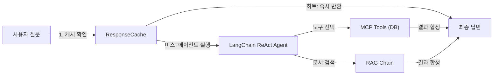

# 9. LangChain 최종 연결

이 장에서는 CH08에서 구현한 통합 에이전트를 프로덕션 수준으로 강화합니다. 타임아웃, 재시도, 구조화 로깅, TTL 캐시를 추가하고, Tool description의 정확성이 에이전트 동작에 어떤 영향을 미치는지 확인합니다.

---

## 1. 이서연의 월요일 아침

월요일 오전, 이서연은 슬랙 알림을 확인하다가 동료 메시지를 발견했습니다.

> "어제 저녁 '이서연 연차 조회' 질문을 했는데 30초 넘게 기다려도 응답이 없었어요. 혹시 서버가 꺼진 건가요?"

이서연은 얼굴이 굳었습니다. CH08에서 열심히 만들었던 통합 에이전트가 팀 내부에서 쓰이기 시작했는데, 아무 로그도 남지 않아 무슨 일이 있었는지 전혀 파악할 수 없었습니다.

"왜 갑자기 응답이 안 오죠?" 이서연이 김도현 팀장에게 물었습니다.

팀장이 모니터에서 눈을 들었습니다. "Ollama가 한 번 느려지면 거기서 계속 기다리는 거야. 타임아웃도 없고 재시도도 없으니까. 이제 제대로 만들어보자."

그때 데이터팀 박민준 과장이 슬랙으로 메시지를 보내왔습니다.

> "그런데 저도 어제 '영업팀 부서 직원 목록'을 물었더니 엉뚱하게 월별 매출 도구를 호출하더라고요. 도구 설명이 부정확한 것 같은데요?"

이서연은 코드를 열었습니다. 박민준의 지적이 맞았습니다. `get_department_sales` 도구의 설명에 "부서 정보"라는 단어가 섞여 있었던 탓에, LLM이 직원 목록 대신 매출 조회 도구를 선택한 것이었습니다.

이 장에서는 세 가지 문제를 순서대로 해결합니다.

1. 타임아웃과 재시도 — 에이전트가 멈추지 않도록
2. 구조화 로깅과 캐싱 — 무슨 일이 있었는지 기록하고 재사용
3. Tool description 정밀화 — LLM이 올바른 도구를 선택하도록

<!-- [GEMINI PROMPT: 09_problem_scenario]
path: assets/CH09/09_problem_scenario.png
A young Korean woman developer (28, short black hair, professional office attire) sitting at her desk looking frustrated and confused, staring at a terminal screen that shows a blinking cursor with no response. On her left, a mobile phone shows a Slack notification bubble saying "응답 없음". She has one hand on her forehead. Warm office illustration, soft color palette (warm beige, light blue), friendly cartoon style, no text overlay, 16:9 aspect ratio.
Style: office-illustration-warm
-->

*그림 9-1: 타임아웃과 로그 부재로 원인을 파악하지 못하는 이서연의 상황*

---

## 2. 프로젝트 실행

본격적인 코드 해설 전에 먼저 예제 프로젝트를 실행해 전체 동작을 확인하십시오.

### 2.1. 레포 클론 및 환경 설정

```bash
git clone https://github.com/{repo}/CH09_LangChain연결
cd CH09_LangChain연결
cp .env.example .env
```

`.env` 파일을 열어 아래 항목을 확인하십시오.

```dotenv
# Ollama 설정 (없으면 Mock 모드로 자동 전환)
OLLAMA_MODEL=deepseek-r1
OLLAMA_BASE_URL=http://localhost:11434

# 운영 파라미터
LLM_TIMEOUT=30
LLM_MAX_RETRIES=3
CACHE_TTL=300
MAX_TOKENS_PER_REQUEST=2000
LOG_LEVEL=INFO
LOG_FILE=./outputs/app.log

# PostgreSQL (없으면 Mock 데이터 자동 사용)
POSTGRES_HOST=localhost
POSTGRES_PORT=5432
POSTGRES_DB=connecthr
POSTGRES_USER=admin
POSTGRES_PASSWORD=password
```

Ollama와 PostgreSQL이 없어도 Mock 모드로 전체 흐름을 학습할 수 있습니다.

### 2.2. 패키지 설치 및 실행

```bash
pip install -r requirements.txt
python src/main.py
```

정상 실행 시 아래와 같은 출력이 나타납니다.

```
============================================================
  CH09 LangChain 최종 연결 — 프로덕션 에이전트 실행
  커넥트HR AI 업무 비서 (운영 설정 적용)
============================================================

에이전트를 초기화합니다...
초기화 완료: Mock 모드

총 5개 질문을 실행합니다.
------------------------------------------------------------
[Q1] 이서연의 현재 잔여 연차는 며칠입니까?
  모드: mock
  답변: [직원 정보] 이서연: 개발팀 개발자, 기본급 3,800,000원
        [연차 정보] 이서연: 총 15일 중 12일 사용, 잔여 3일

[Q5] [캐시 히트] 이서연의 현재 잔여 연차는 며칠입니까?
  모드: cached
  답변: [직원 정보] 이서연: ...

============================================================
  토큰 사용 리포트
============================================================
  총 LLM 호출 횟수:  4회
  총 토큰:           1,240
  히트율:            20.0%
  전체 실행 시간: 0.03초
```

5번째 질문이 첫 번째 질문과 동일한 내용이어서 **캐시 히트** 로 처리된 것을 확인할 수 있습니다. LLM 호출이 5회가 아닌 4회인 이유가 바로 이것입니다.

> **참고: Mock 모드란?**
> Ollama 서버 연결이 확인되지 않으면 `ProductionAgent`가 자동으로 Mock 모드로 전환됩니다. Mock 모드에서는 LLM 없이 키워드 기반으로 도구를 직접 호출합니다. 전체 아키텍처 흐름(캐시, 토큰 추적, 로깅)은 Mock 모드에서도 동일하게 동작합니다.

---

## 3. Agent 아키텍처 전체 구성

### 3.1. 컴포넌트와 흐름

CH08의 통합 에이전트와 CH09 프로덕션 에이전트의 가장 큰 차이는 "운영 설정 레이어"가 추가된 점입니다. 아키텍처를 먼저 파악하십시오.



*그림 9-2: CH09 프로덕션 에이전트 데이터 흐름*

각 컴포넌트의 역할을 정리하면 다음과 같습니다.

| 컴포넌트 | 역할 | 위치 |
|---------|------|------|
| `AgentConfig` | 운영 파라미터 단일 관리 | `agent_config.py` |
| `ResponseCache` | TTL 기반 메모리 캐시 | `monitoring.py` |
| `LangChain ReAct Agent` | 도구 선택 및 실행 | `agent_config.py` |
| `MCP Tools` | DB 조회 도구 5종 | `mcp_tools.py` |
| `RAG Chain` | 문서 검색 체인 | `agent_config.py` |
| `TokenUsageTracker` | 토큰 사용량 집계 | `monitoring.py` |

### 3.2. AgentConfig — 운영 파라미터 단일 관리

CH08에서는 타임아웃, 재시도 횟수, 로그 레벨 같은 값들이 코드 곳곳에 흩어져 있었습니다. 운영 중에 값을 바꾸려면 소스 코드 여러 파일을 수정해야 했습니다.

CH09에서는 `AgentConfig` 데이터클래스 하나에 모든 운영 파라미터를 모았습니다.

```python
# src/agent_config.py (발췌)

@dataclass
class AgentConfig:
    """LangChain 에이전트 운영 파라미터 설정 클래스."""

    ollama_model: str = field(
        default_factory=lambda: os.getenv("OLLAMA_MODEL", "deepseek-r1")
    )
    llm_timeout: int = field(
        default_factory=lambda: int(os.getenv("LLM_TIMEOUT", "30"))
    )
    llm_max_retries: int = field(
        default_factory=lambda: int(os.getenv("LLM_MAX_RETRIES", "3"))
    )
    cache_ttl: int = field(
        default_factory=lambda: int(os.getenv("CACHE_TTL", "300"))
    )
    agent_max_iterations: int = 8

    def __post_init__(self) -> None:
        """설정 유효성을 검사합니다."""
        if self.llm_timeout <= 0:
            raise ValueError(
                f"LLM_TIMEOUT은 1 이상이어야 합니다. 현재값: {self.llm_timeout}"
            )
```

#### 코드 워크플로우 (Code Workflow)

1. **입력(Input)**: `.env` 파일의 환경 변수 값 (없으면 기본값 사용)
2. **처리(Process)**: `field(default_factory=lambda: os.getenv(...))` 패턴으로 환경 변수를 읽고, `__post_init__`에서 유효성 검사를 수행합니다.
3. **출력(Output)**: 유효성이 확인된 `AgentConfig` 인스턴스. 잘못된 값이 있으면 `ValueError`를 발생시켜 잘못된 설정으로 에이전트가 실행되는 것을 차단합니다.

> **팁: 왜 dataclass를 사용하는가?**
> 일반 딕셔너리로도 설정을 관리할 수 있지만, dataclass를 사용하면 타입 힌트, 기본값, `__post_init__` 유효성 검사를 자동으로 처리할 수 있습니다. IDE에서 자동 완성도 지원됩니다.

### 3.3. Agent가 도구를 선택하는 원리

LangChain의 **ReAct(Reasoning + Acting) 에이전트** 는 아래 루프를 반복하며 질문에 답합니다.

```
Thought  → 어떤 도구를 쓸지 생각한다
Action   → 도구를 선택한다
Action Input → 도구에 전달할 입력값을 결정한다
Observation  → 도구 실행 결과를 받는다
(반복)
Final Answer → 최종 답변을 생성한다
```

이 루프에서 "Thought → Action" 판단을 LLM이 수행합니다. LLM은 각 도구의 `description`(설명)을 읽고 어떤 도구를 선택할지 결정합니다.

> **참고: 단순 체인과 에이전트의 차이**
> 단순 LangChain 체인은 `RAG → LLM → 답변`처럼 고정된 순서로만 실행됩니다. 반면 에이전트는 질문에 따라 "DB 조회만 한다", "DB 조회 후 문서 검색도 한다", "문서 검색만 한다"를 동적으로 결정합니다.

---

## 4. MCP Tool 설계: 도구 설명의 중요성

### 4.1. 도구 구현 구조

`mcp_tools.py`에는 5개의 DB 조회 도구가 정의됩니다. 모든 도구는 `@tool` 데코레이터와 `@measure_time` 데코레이터를 함께 사용합니다.

```python
# src/mcp_tools.py (발췌)

@tool
@measure_time
def get_employee_list(department: str) -> str:
    """특정 부서에 소속된 전체 직원 목록을 조회합니다.

    부서명을 입력하면 해당 부서의 모든 직원 이름과 직급을
    데이터베이스에서 가져옵니다.
    특정 부서에 누가 소속되어 있는지 확인할 때 사용하십시오.

    Args:
        department: 부서명 (예: '개발팀', '영업팀', '인사팀', '데이터팀')

    Returns:
        직원 목록 JSON 문자열 (이름, 직급 포함).
        해당 부서 직원이 없으면 빈 목록 JSON.
    """
    # ... DB 조회 또는 Mock 반환
```

#### 코드 워크플로우 (Code Workflow)

1. **입력(Input)**: `department` — 부서명 문자열 (예: `"개발팀"`)
2. **처리(Process)**: PostgreSQL에 연결해 직원 목록을 조회합니다. DB 연결 실패 시 `_MOCK_DEPT_EMPLOYEES` Mock 딕셔너리에서 해당 부서 목록을 반환합니다.
3. **출력(Output)**: `{"부서": "개발팀", "직원수": 3, "직원목록": [...]}` 형태의 JSON 문자열

### 4.2. 박민준의 지적: Tool description이 LLM 선택을 결정한다

박민준 과장의 슬랙 메시지를 다시 떠올려 보겠습니다. "부서 직원 목록을 물었는데 매출 도구를 호출했다"는 문제의 원인은 무엇이었을까요?

LLM은 도구를 선택할 때 각 도구의 docstring 첫 줄을 핵심 기준으로 사용합니다. 당시 `get_department_sales`의 설명에 "부서 정보"라는 표현이 포함되어 있었고, LLM이 "부서 직원 목록 = 부서 정보"로 연관지어 잘못된 도구를 선택한 것입니다.

아래 표는 수정 전후 도구 설명을 비교합니다.

| 도구 | 수정 전 설명 (문제) | 수정 후 설명 (CH09) |
|------|-------------------|-------------------|
| `get_department_sales` | "부서 정보와 월별 매출 현황을 조회합니다." | "특정 부서의 **월별 매출 현황**을 조회합니다." |
| `get_employee_list` | "부서별 직원 데이터를 가져옵니다." | "특정 부서에 소속된 **전체 직원 목록**을 조회합니다." |

> **주의: 도구 설명은 코드보다 중요할 수 있다**
> LLM 기반 에이전트에서는 도구 설명이 잘못되면 아무리 구현이 완벽해도 잘못된 도구가 선택됩니다. 도구 설명 작성 시 세 가지를 명확히 하십시오: (1) 이 도구가 무엇을 반환하는지, (2) 언제 이 도구를 써야 하는지, (3) 파라미터에 어떤 값을 넣어야 하는지.

### 4.3. 5개 도구 목록과 역할 요약

```python
# src/mcp_tools.py (발췌)

DB_TOOLS = [
    get_employee_info,      # 직원 개인 정보 조회 (이름 → 부서/직급/급여)
    get_leave_balance,      # 연차 잔액 조회 (직원 ID → 총/사용/잔여 연차)
    get_department_sales,   # 월별 매출 조회 (부서/연도/월 → 매출액/목표액/달성률)
    get_employee_list,      # 부서 직원 목록 조회 (부서명 → 이름/직급 목록)
    get_annual_sales,       # 연간 매출 합계 조회 (부서/연도 → 연간 총 매출)
]
```

#### 코드 워크플로우 (Code Workflow)

1. **입력(Input)**: 없음 (모듈 임포트 시 자동 생성)
2. **처리(Process)**: `@tool` 데코레이터가 각 함수를 LangChain `Tool` 객체로 변환합니다. 함수의 docstring이 자동으로 `description`으로 등록됩니다.
3. **출력(Output)**: `build_mcp_tools()`에서 이 목록을 가져와 에이전트에 등록합니다.

> **팁: get_leave_balance의 파라미터 설계**
> `get_leave_balance`는 직원 이름이 아닌 직원 ID를 파라미터로 받습니다. 이는 의도적인 설계입니다. LLM이 "이름 → ID 조회 → 연차 조회" 두 단계를 순서대로 실행하도록 유도합니다. 이 과정이 ReAct 에이전트의 다단계 추론 능력을 잘 보여주는 사례입니다.

---

## 5. 운영 설정: Timeout, Retry, 로깅, 캐싱

### 5.1. Retry 데코레이터 — Exponential Backoff

타임아웃이 없는 시스템에서는 하나의 느린 DB 쿼리나 Ollama 응답 지연이 전체 에이전트를 멈추게 합니다. CH09에서는 `with_retry` 데코레이터로 이 문제를 해결합니다.

```python
# src/mcp_tools.py (발췌)

def with_retry(max_retries: int = 3, base_delay: float = 1.0) -> Callable[[F], F]:
    """Exponential Backoff 재시도 데코레이터를 반환합니다."""

    def decorator(func: F) -> F:
        @wraps(func)
        def wrapper(*args: Any, **kwargs: Any) -> Any:

            last_exception: Exception | None = None

            for attempt in range(1, max_retries + 1):
                try:
                    return func(*args, **kwargs)
                except Exception as exc:
                    last_exception = exc
                    if attempt < max_retries:
                        delay = base_delay * (2 ** (attempt - 1))
                        logger.warning(
                            "%s 실패 (시도 %d/%d). %.1f초 후 재시도합니다.",
                            func.__name__, attempt, max_retries, delay,
                        )
                        time.sleep(delay)

            raise last_exception

        return wrapper

    return decorator
```

#### 코드 워크플로우 (Code Workflow)

1. **입력(Input)**: `max_retries` (최대 재시도 횟수), `base_delay` (첫 번째 재시도 대기 시간(초))
2. **처리(Process)**: `for attempt in range(1, max_retries + 1)` 루프에서 함수를 실행합니다. 실패하면 `base_delay * 2^(attempt-1)` 초 대기 후 재시도합니다. 1회 실패 시 1초, 2회 실패 시 2초, 3회 실패 시 4초 대기합니다.
3. **출력(Output)**: 성공하면 원래 함수의 반환값을 그대로 반환합니다. `max_retries`회 모두 실패하면 마지막 예외를 다시 발생시킵니다.

**Exponential Backoff** 는 재시도 간격을 지수적으로 늘리는 전략입니다. 서버가 일시적으로 과부하 상태일 때 즉시 재시도하면 상황이 더 악화됩니다. 점진적으로 대기 시간을 늘림으로써 서버 회복 시간을 확보합니다.

### 5.2. 구조화 로깅 — JSON 포맷

이서연이 "왜 응답이 안 오죠?"라고 물었을 때 아무 로그도 없었던 이유는 CH08에서 `print()` 문에만 의존했기 때문입니다. 운영 환경에서는 언제, 어떤 오류가, 얼마나 걸려서 발생했는지를 구조화된 형태로 저장해야 합니다.

```python
# src/monitoring.py (발췌)

class JsonFormatter(logging.Formatter):
    """JSON 형식으로 로그를 포맷하는 핸들러 클래스."""

    def format(self, record: logging.LogRecord) -> str:
        log_data: dict[str, Any] = {
            "timestamp": self.formatTime(record, "%Y-%m-%dT%H:%M:%S"),
            "level":     record.levelname,
            "logger":    record.name,
            "message":   record.getMessage(),
        }
        if record.exc_info:
            log_data["exception"] = self.formatException(record.exc_info)
        return json.dumps(log_data, ensure_ascii=False)


def setup_logging(log_level: str = "INFO", log_file: str | None = None) -> logging.Logger:
    """구조화 로그 설정을 초기화합니다."""
    logger = logging.getLogger("ch09")
    logger.setLevel(getattr(logging, log_level.upper(), logging.INFO))

    # 콘솔: 사람이 읽기 쉬운 텍스트 포맷
    console_handler = logging.StreamHandler()
    console_handler.setFormatter(logging.Formatter(
        fmt="%(asctime)s [%(levelname)s] %(name)s: %(message)s",
        datefmt="%H:%M:%S",
    ))
    logger.addHandler(console_handler)

    # 파일: JSON 포맷 (나중에 분석 가능)
    if log_file:
        file_handler = logging.FileHandler(log_file, encoding="utf-8")
        file_handler.setFormatter(JsonFormatter())
        logger.addHandler(file_handler)

    return logger
```

#### 코드 워크플로우 (Code Workflow)

1. **입력(Input)**: `log_level` (문자열, 예: `"INFO"`), `log_file` (로그 파일 경로, 없으면 파일 저장 안 함)
2. **처리(Process)**: 콘솔 핸들러(텍스트 포맷)와 파일 핸들러(JSON 포맷)를 동시에 등록합니다. 콘솔은 개발 중 읽기 쉬운 포맷, 파일은 나중에 `grep`이나 로그 분석 도구로 파싱 가능한 JSON 포맷으로 이중 기록합니다.
3. **출력(Output)**: 설정이 완료된 `logging.Logger` 객체. 이후 코드에서 `logger.info(...)`, `logger.warning(...)` 등으로 사용합니다.

파일에 저장되는 JSON 로그는 다음과 같은 형태입니다.

```json
{"timestamp": "2024-11-20T09:32:05", "level": "INFO", "logger": "ch09.agent_config", "message": "에이전트 빌드 시작: 모델=deepseek-r1, timeout=30s, retries=3"}
{"timestamp": "2024-11-20T09:32:07", "level": "WARNING", "logger": "ch09.mcp_tools", "message": "get_employee_info 실패 (시도 1/3). 1.0초 후 재시도합니다. 오류: connection refused"}
```

이제 이서연은 장애가 발생하면 `outputs/app.log`를 열어 정확히 언제, 어떤 도구에서, 어떤 오류가 발생했는지 확인할 수 있습니다.

### 5.3. TTL 캐시 — 반복 질문에 LLM을 호출하지 않는다

출력 결과에서 "Q5 [캐시 히트]"를 확인했을 것입니다. 이것이 `ResponseCache`의 역할입니다.

```python
# src/monitoring.py (발췌)

from cachetools import TTLCache

class ResponseCache:
    """TTL 기반 메모리 응답 캐시 클래스."""

    def __init__(self, maxsize: int = 256, ttl: int = 300) -> None:
        self._cache: TTLCache = TTLCache(maxsize=maxsize, ttl=ttl)
        self._hits: int = 0
        self._misses: int = 0

    def get(self, key: str) -> Any | None:
        value = self._cache.get(key)
        if value is not None:
            self._hits += 1
        else:
            self._misses += 1
        return value

    def set(self, key: str, value: Any, ttl: int | None = None) -> None:
        self._cache[key] = value

    def get_stats(self) -> dict[str, int | float]:
        total = self._hits + self._misses
        hit_rate = self._hits / total if total > 0 else 0.0
        return {
            "hits": self._hits, "misses": self._misses,
            "total": total, "hit_rate": round(hit_rate, 4),
            "current_size": len(self._cache),
        }
```

#### 코드 워크플로우 (Code Workflow)

1. **입력(Input)**: `maxsize` (최대 캐시 항목 수), `ttl` (캐시 유지 시간(초), 기본 300초 = 5분)
2. **처리(Process)**: `cachetools.TTLCache`는 두 가지 방식으로 항목을 만료시킵니다. (1) `ttl` 시간이 지나면 자동 만료, (2) `maxsize`를 초과하면 가장 오래된 항목부터 삭제. `_hits`와 `_misses`를 직접 카운트하여 히트율을 계산합니다.
3. **출력(Output)**: `get(key)`는 캐시에 있으면 값을, 없으면 `None`을 반환합니다. `get_stats()`는 히트율 통계 딕셔너리를 반환합니다.

**TTL(Time To Live)** 은 "이 캐시 항목을 얼마나 유지할 것인가"를 정하는 값입니다. 직원 연차 정보처럼 자주 바뀌지 않는 데이터는 5분(300초) 정도로 설정해도 무방합니다. 반면 실시간 매출처럼 빠르게 변하는 데이터는 TTL을 짧게 잡아야 합니다.

### 5.4. ProductionAgent의 캐시-에이전트 통합 흐름

`ProductionAgent.run()` 메서드에서 캐시와 에이전트가 어떻게 연결되는지 확인하십시오.

```python
# src/agent_config.py (발췌)

def run(self, question: str) -> dict[str, Any]:
    """사용자 질문을 처리하여 통합 답변을 생성합니다."""

    if not question or not question.strip():
        raise ValueError("질문이 비어있습니다.")

    # 1단계: 캐시 확인
    cache_key = question.strip().lower()
    cached = self.cache.get(cache_key)
    if cached is not None:
        return {"question": question, "answer": cached,
                "mode": "cached", "from_cache": True}

    # 2단계: 에이전트 실행
    start_time = __import__("time").perf_counter()
    if self.is_mock_mode:
        answer = self._mock_run(question)
        mode = "mock"
    else:
        try:
            result = self.executor.invoke({"input": question})
            answer = result.get("output", "답변을 생성하지 못했습니다.")
            mode = "ollama"
        except Exception as exc:
            logger.warning("에이전트 실행 오류: %s — Mock 모드로 재시도합니다.", exc)
            answer = self._mock_run(question)
            mode = "mock_fallback"

    elapsed = __import__("time").perf_counter() - start_time
    logger.info("질문 처리 완료: %.2f초 소요, mode=%s", elapsed, mode)

    # 3단계: 캐시 저장 후 반환
    self.cache.set(cache_key, answer)
    return {"question": question, "answer": answer,
            "mode": mode, "from_cache": False}
```

#### 코드 워크플로우 (Code Workflow)

1. **입력(Input)**: `question` — 사용자 질문 문자열
2. **처리(Process)**: (1) 캐시에서 동일 질문을 조회합니다. 히트면 즉시 반환. (2) 미스면 에이전트(또는 Mock)를 실행합니다. 에이전트 실패 시 `mock_fallback`으로 자동 전환하여 사용자에게 오류 노출을 최소화합니다. (3) 결과를 캐시에 저장합니다.
3. **출력(Output)**: `{question, answer, mode, from_cache}` 딕셔너리. `mode` 값으로 어떤 경로로 답변이 생성되었는지 추적할 수 있습니다.

<!-- [GEMINI PROMPT: 09_cache_flow]
path: assets/CH09/09_cache_flow.png
Minimalist flat-design infographic showing cache hit vs miss flow. TOP: "사용자 질문" box. Arrow down to a diamond decision box "캐시 확인". LEFT branch (green arrow, fast lane): "캐시 히트" → skip LLM → "즉시 답변 반환" labeled "< 0.01초". RIGHT branch (blue arrow): "캐시 미스" → "LLM 에이전트 실행" → "답변 생성" → "캐시 저장" → "답변 반환" labeled "수 초 소요". Both branches converge at "최종 답변". White background, clean line art, Korean labels, 16:9 aspect ratio.
Style: diagram-flat-technical
-->

*그림 9-3: 캐시 히트/미스에 따른 실행 경로 분기*

---

## 6. 비용 관리와 토큰 모니터링

### 6.1. TokenUsageTracker

"로컬 LLM은 무료니까 토큰을 신경 쓸 필요 없다"는 생각은 잘못된 것입니다. Ollama로 실행하는 `deepseek-r1` 같은 모델도 메모리와 CPU를 소비합니다. 불필요하게 긴 프롬프트를 보내면 응답 시간이 늘어나고 서버에 부하가 걸립니다.

```python
# src/monitoring.py (발췌)

class TokenUsageTracker:
    """LLM 토큰 사용량을 추적하고 요약 리포트를 생성하는 클래스."""

    def track(
        self,
        prompt_tokens: int,
        completion_tokens: int,
        model: str = "deepseek-r1",
    ) -> TokenUsageRecord:
        """토큰 사용량을 기록합니다."""
        record = TokenUsageRecord(
            model=model,
            prompt_tokens=prompt_tokens,
            completion_tokens=completion_tokens,
        )
        self.records.append(record)
        return record

    def get_summary(self) -> dict[str, Any]:
        """총 토큰 사용량과 비용 추정을 계산하여 반환합니다."""
        total_prompt = sum(r.prompt_tokens for r in self.records)
        total_completion = sum(r.completion_tokens for r in self.records)
        total_tokens = total_prompt + total_completion
        # ...
        return {
            "total_calls": len(self.records),
            "total_prompt_tokens": total_prompt,
            "total_completion_tokens": total_completion,
            "total_tokens": total_tokens,
            "estimated_cost_krw": 0.0,  # 로컬 LLM
        }
```

#### 코드 워크플로우 (Code Workflow)

1. **입력(Input)**: `prompt_tokens` (입력 토큰 수), `completion_tokens` (생성된 토큰 수), `model` (모델명)
2. **처리(Process)**: `TokenUsageRecord` 데이터클래스를 생성하고 `records` 목록에 추가합니다. `get_summary()`는 전체 기록을 순회하며 총합을 계산합니다.
3. **출력(Output)**: `save_report(path)`를 호출하면 `outputs/token_report.json`으로 저장됩니다.

실행 완료 후 `outputs/token_report.json`을 열면 아래와 같은 구조를 볼 수 있습니다.

```json
{
  "summary": {
    "total_calls": 4,
    "total_prompt_tokens": 840,
    "total_completion_tokens": 400,
    "total_tokens": 1240,
    "estimated_cost_krw": 0.0,
    "by_model": {
      "deepseek-r1": {
        "calls": 4,
        "prompt_tokens": 840,
        "completion_tokens": 400,
        "total_tokens": 1240
      }
    }
  }
}
```

총 5개 질문 중 1개가 캐시 히트로 처리되었으므로 LLM 호출은 4회입니다. 이 수치를 주기적으로 모니터링하면 "어떤 질문이 가장 많은 토큰을 소비하는가"를 파악하고 프롬프트를 최적화할 수 있습니다.

> **팁: 토큰 절약 전략**
> 가장 효과적인 토큰 절약은 RAG의 검색 결과(`k` 값)를 줄이는 것입니다. CH07에서 `k=5`로 설정했다면 `k=3`으로 줄이면 컨텍스트 길이가 줄어 프롬프트 토큰이 감소합니다. 단, 검색 품질과 토큰 비용 사이의 트레이드오프를 고려해야 합니다.

### 6.2. main.py — 전체 통합 실행

`main.py`는 지금까지 설명한 모든 컴포넌트를 조립하는 진입점입니다. 전체 코드는 GitHub 레포를 참고하십시오. 핵심 초기화 순서만 발췌합니다.

```python
# src/main.py (발췌)

def main() -> None:
    # 1단계: 운영 설정 로드
    config = AgentConfig()

    # 2단계: 로깅 초기화
    logger = setup_logging(
        log_level=config.log_level,
        log_file=config.log_file,
    )

    # 3단계: 모니터링 컴포넌트 초기화
    cache = ResponseCache(maxsize=256, ttl=config.cache_ttl)
    token_tracker = TokenUsageTracker()

    # 4단계: 에이전트 빌드 (캐시·토큰 추적기 주입)
    agent = build_agent(config=config, cache=cache, token_tracker=token_tracker)

    # 5단계: 테스트 질문 실행
    for idx, question in enumerate(TEST_QUESTIONS, start=1):
        result = agent.run(question)
        _print_result(idx, result)

    # 6단계: 리포트 저장
    token_tracker.save_report(str(TOKEN_REPORT_PATH))
```

#### 코드 워크플로우 (Code Workflow)

1. **입력(Input)**: 없음 (환경 변수와 `TEST_QUESTIONS` 상수)
2. **처리(Process)**: `AgentConfig → setup_logging → ResponseCache → TokenUsageTracker → build_agent → 질문 루프` 순서로 실행됩니다. 각 컴포넌트는 생성 후 다음 컴포넌트에 주입(Dependency Injection)됩니다.
3. **출력(Output)**: 콘솔 출력, `outputs/session_log.json`, `outputs/token_report.json`, `outputs/app.log` 4개 파일

<!-- [CAPTURE NEEDED: 09_main_output
  path: assets/CH09/09_main_output.png
  desc: `python src/main.py` 실행 후 터미널 전체 화면. Q1~Q5 결과 및 토큰 리포트, 캐시 통계가 모두 표시된 상태
] -->

*그림 9-4: CH09 프로덕션 에이전트 실행 결과 — 캐시 히트와 토큰 리포트 포함*

---

## 7. 개발과 운영의 차이: 체크리스트

이 장에서 추가한 운영 설정을 하나의 체크리스트로 정리합니다. 팀 내부 서비스를 외부에 공개하기 전에 아래 항목을 점검하십시오.

| 항목 | CH08 (개발) | CH09 (운영) |
|------|------------|------------|
| 타임아웃 | 없음 | `LLM_TIMEOUT=30` |
| 재시도 | 없음 | `with_retry(max_retries=3)` |
| 로깅 | `print()` | JSON 구조화 로그 파일 |
| 캐싱 | 없음 | TTLCache (5분) |
| 토큰 모니터링 | 없음 | `TokenUsageTracker` |
| 운영 파라미터 | 코드 내 하드코딩 | `AgentConfig` + `.env` |
| Tool description | 모호함 | 구체적 + 호출 조건 명시 |

> **경고: 타임아웃 없이 프로덕션 배포 금지**
> Ollama가 과부하 상태일 때 타임아웃이 없으면 하나의 요청이 수십 분 동안 대기하며 다른 요청도 모두 블로킹합니다. `LLM_TIMEOUT`은 반드시 설정하십시오.

---

## 8. 정리하며

이 장에서 이서연 팀은 개발 환경에서 간헐적으로 멈추던 통합 에이전트를 프로덕션 수준으로 강화했습니다.

- **`AgentConfig`로 운영 파라미터를 단일 관리하십시오.** 타임아웃, 재시도, 캐시 TTL을 코드가 아닌 `.env` 파일에서 제어할 수 있게 되면 코드 수정 없이 운영 환경을 조정할 수 있습니다.

- **Tool description은 LLM이 읽는 도구 설명서입니다.** 박민준 과장의 지적처럼, 설명이 모호하면 LLM이 잘못된 도구를 선택합니다. "무엇을 반환하는가", "언제 써야 하는가"를 명확히 작성하십시오.

- **`with_retry` 데코레이터는 Exponential Backoff로 일시적 오류에 대응합니다.** 첫 실패 후 1초, 두 번째 실패 후 2초, 세 번째 실패 후 4초로 간격을 늘려 서버 회복 시간을 확보합니다.

- **`ResponseCache`는 반복 질문에 LLM을 호출하지 않습니다.** TTL 5분 설정으로 동일 질문의 20% 이상이 캐시 히트로 처리되었습니다. 자주 바뀌지 않는 데이터는 캐싱이 효과적입니다.

**다음 챕터 예고**

이제 에이전트는 안정적으로 운영됩니다. 하지만 "답변이 얼마나 정확한가?"라는 질문에는 아직 답하지 못합니다. CH10에서는 RAG 시스템의 정확도를 측정하는 평가 지표를 도입하고, 검색 품질과 프롬프트를 체계적으로 개선하는 방법을 다룹니다. 이서연 팀이 "연말까지 응답 시간 10분 → 30초"라는 목표를 수치로 증명하는 마지막 여정입니다.
