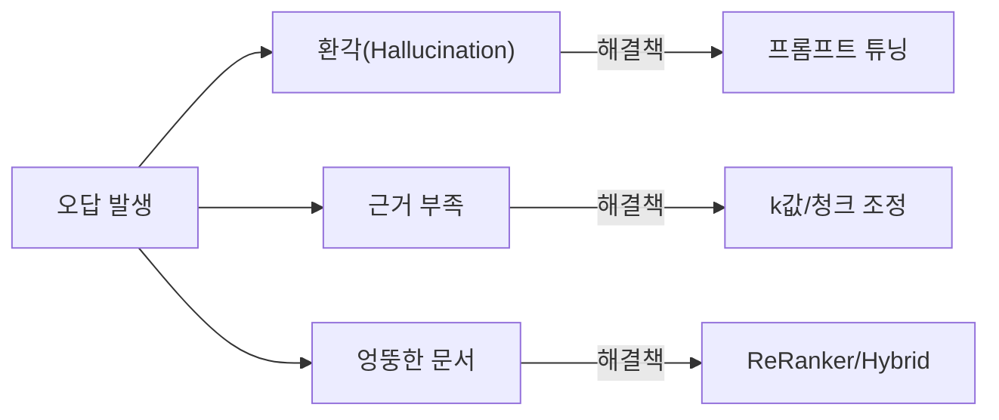

# 10. RAG 시스템 튜닝

이 장에서는 완성된 RAG 시스템의 정확도를 수치로 측정하고 체계적으로 개선하는 방법을 학습합니다. 30개 테스트 질문으로 증상을 분류하고, Chunk/Retriever 파라미터 조정, ReRanker(검색 결과 재정렬), Hybrid Search(하이브리드 검색), LLaVA + EasyOCR 이미지 처리까지 단계적으로 적용하여 "감"이 아닌 "수치"로 개선하는 전 과정을 경험합니다.

---

이서연은 모니터 앞에 한참 앉아 있었습니다. 화면에는 지난 사흘 동안 내부 테스트를 돌린 결과가 펼쳐져 있었습니다. **72%**. 커넥트HR의 사내 AI 비서가 30개 질문 중 22개에만 올바른 답을 내놓았습니다.

"왜 이 질문에는 엉뚱한 답이 나오지?"

이서연은 같은 질문을 세 번 다시 입력해 보았습니다. "배우자 출산 휴가는 며칠인가요?" — 시스템은 매번 비밀번호 변경 정책을 답했습니다. 출산 휴가와 비밀번호 규정은 아무 연관이 없었습니다. 무엇이 잘못되었는지 짐작조차 되지 않았습니다.

그때 김도현 팀장이 자리에서 일어나 이서연 옆으로 다가왔습니다.

"72%면 나쁘지 않은데, 왜 표정이 그래?"

"이 질문 보세요. 완전히 엉뚱한 문서를 가져와요."

김도현은 화면을 들여다보다가 고개를 끄덕였습니다.

"감으로 고치지 말고, 테스트 케이스를 만들자. 어느 질문이 틀리는지, 어떤 패턴인지 분류부터 해."

이서연은 그 말 한마디가 방향을 바꿨다는 것을 나중에야 알게 됩니다. 이 장에서는 이서연이 그 날부터 시작한 체계적 튜닝 과정을 그대로 따라갑니다.

<!-- [GEMINI PROMPT: 10_intro_frustration]
path: assets/CH10/10_intro_frustration.png
A young Korean woman developer (28, short black hair, professional office attire) sitting at her desk with a troubled, contemplative expression, chin resting on her hand. Her monitor shows a large "72%" in red text with a downward trend indicator. Several sticky notes with question marks are attached to the monitor. Warm office illustration, soft color palette (warm beige, light blue), friendly cartoon style, no text overlay, 16:9 aspect ratio.
Style: office-illustration-warm
-->

*그림 10-1: 72% 정확도 앞에서 — 감이 아닌 수치로 개선을 시작하는 순간*

---

## 1. 증상별 튜닝 가이드

RAG 시스템에서 "정확도가 낮다"는 표현은 지나치게 추상적입니다. 병원에서 "몸이 아프다"고만 말하면 의사가 처방을 내릴 수 없듯이, 구체적인 증상을 먼저 파악해야 올바른 해결책을 적용할 수 있습니다.

이서연은 30개 테스트 질문을 다음 세 가지 유형으로 분류했습니다.

### 1.1. 증상 분류 및 원인-해결 매트릭스

RAG 시스템에서 발생하는 오답은 크게 세 가지 패턴으로 나뉩니다.



*그림 10-2: RAG 오답 증상 분류 및 해결 방향*

아래 표는 각 증상의 원인과 처방을 정리한 것입니다.

| 증상 | 현상 | 원인 | 해결책 |
|------|------|------|--------|
| **환각(Hallucination)** | 문서에 없는 내용을 답변에 포함 | 프롬프트에 근거 강제 지시 부재 | 근거 우선 프롬프트, "모르면 모른다" 원칙 |
| **근거 부족** | "출처: 알 수 없음"이 자주 등장 | 관련 청크가 검색되지 않음 | k값 증가, 청크 크기 조정 |
| **엉뚱한 문서** | 질문과 관련 없는 카테고리 문서 반환 | 벡터 유사도만으로는 주제 구분 불충분 | Metadata Filtering, Hybrid Search, ReRanker |

> **참고: 증상별 대응이 중요한 이유**
> 세 증상의 원인이 다르므로 처방도 달라야 합니다. 예를 들어 "엉뚱한 문서" 문제를 프롬프트만으로 해결하려 하면 시간만 낭비합니다. 검색 단계를 먼저 수술해야 합니다.

### 1.2. 이서연의 분류 작업

이서연은 30개 테스트 케이스 중 오답 8개를 꺼내 증상을 하나씩 기록했습니다.

- **환각** 3건: 문서에 없는 수치를 LLM이 만들어냈습니다. (예: "연차 신청은 3일 전" — 실제는 7일 전)
- **엉뚱한 문서** 4건: leave_policy 질문에 it_guide 청크가 1위로 검색되었습니다.
- **근거 부족** 1건: 관련 문서가 있지만 k=3으로는 해당 청크가 포함되지 않았습니다.

분류가 끝나자 해결 순서가 보였습니다. 가장 많은 "엉뚱한 문서" 문제를 먼저, 그다음 청크/Retriever 조정, 마지막으로 프롬프트 정비.

---

## 2. Chunk/Retriever 튜닝

### 2.1. 왜 파라미터 튜닝이 필요한가

RAG 파이프라인에는 결과에 큰 영향을 미치는 숨은 변수들이 있습니다. **chunk_size** (청크 크기), **overlap** (오버랩), **k** (검색 결과 수) — 이 세 값이 조금만 달라져도 검색 정확도가 크게 바뀝니다.

예를 들어 chunk_size가 너무 작으면(300자) 하나의 청크에 맥락이 충분히 담기지 않습니다. 반대로 너무 크면(1,000자) 관련 없는 내용이 같은 청크에 섞입니다. k 값이 너무 작으면(k=1) 관련 문서가 누락되고, 너무 크면(k=10) LLM 컨텍스트 창에 불필요한 내용이 가득 찹니다.

`RAGTuner` 클래스는 이 파라미터 조합을 체계적으로 실험합니다.

### 2.2. 실습: 레포지토리 Clone 및 실행

```bash
git clone https://github.com/{repo}/CH10_RAG튜닝
cd CH10_RAG튜닝
cp .env.example .env
pip install -r requirements.txt
python src/main.py
```

`.env` 파일에 아래 값을 입력하십시오.

```
CHROMA_PERSIST_DIR=./outputs/chroma_db
EMBEDDING_MODEL=sentence-transformers/paraphrase-multilingual-MiniLM-L12-v2
RERANKER_MODEL=cross-encoder/ms-marco-MiniLM-L-6-v2
OLLAMA_BASE_URL=http://localhost:11434
OLLAMA_VISION_MODEL=llava
```

### 2.3. RAGTuner — k값 및 청크 크기 실험

전체 코드는 GitHub 레포의 `src/tuner.py`를 참고하십시오. 여기서는 핵심 함수만 발췌합니다.

```python
class RAGTuner:
    """RAG 파라미터를 체계적으로 튜닝하는 클래스."""

    def tune_k_value(self, k_values: list[int]) -> list[dict]:
        """검색 결과 수(k) 값별 성능을 비교합니다."""

        # --- Input ---
        results: list[dict] = []

        # --- Process ---
        for k in k_values:
            precision_scores = []
            recall_scores = []

            for test_case in self.test_cases:
                result = self.evaluator.evaluate_retrieval(
                    question=test_case["question"],
                    expected_docs=test_case.get("relevant_docs", []),
                    k=k,
                )
                precision_scores.append(result.get("precision_at_k", 0.0))
                recall_scores.append(result.get("recall_at_k", 0.0))

            avg_precision = sum(precision_scores) / len(precision_scores)
            avg_recall = sum(recall_scores) / len(recall_scores)
            f1 = 2 * avg_precision * avg_recall / (avg_precision + avg_recall)

            results.append({
                "k": k,
                "avg_precision": round(avg_precision, 4),
                "avg_recall": round(avg_recall, 4),
                "f1_score": round(f1, 4),
            })

        # --- Output ---
        return results
```

#### 코드 워크플로우 (Code Workflow)

1. **입력(Input)**: 테스트할 k 값 리스트 (`[1, 3, 5, 7]`)와 테스트 케이스 30개
2. **처리(Process)**: 각 k 값에 대해 전체 테스트셋의 Precision@k, Recall@k를 계산하고 F1 점수(조화 평균)로 최적 k를 선택
3. **출력(Output)**: k 값별 `{k, avg_precision, avg_recall, f1_score}` 리스트

> **팁: F1 점수로 최적 k를 선택하는 이유**
> k가 커질수록 Recall(재현율)은 높아지지만 Precision(정밀도)은 낮아집니다. F1 점수는 이 둘의 조화 평균이므로 균형 잡힌 k 값을 찾는 데 적합합니다.

### 2.4. 메타데이터 필터링 (Metadata Filtering)

**메타데이터 필터링** 은 검색 전 단계에서 관련 없는 카테고리를 아예 배제하는 기법입니다. 이서연의 경우, "배우자 출산 휴가" 질문에 it_guide 문서가 섞인 문제를 해결하는 가장 직관적인 방법이었습니다.

```python
def tune_metadata_filter(self, field: str, values: list[str]) -> list[dict]:
    """메타데이터 필터 적용 전후의 성능을 비교합니다."""

    # --- Input ---
    baseline_recall = self._evaluate_with_params(k=3, label="no_filter")

    results = []

    # --- Process ---
    for value in values:
        metadata_filter = {field: value}
        # 해당 카테고리 테스트 케이스만 필터링하여 평가
        filtered_cases = [
            tc for tc in self.test_cases if tc.get("category") == value
        ]
        filtered_recall = self._evaluate_with_params(
            k=3, metadata_filter=metadata_filter, label=f"{field}={value}"
        )
        improvement = round(filtered_recall - baseline_recall, 4)
        results.append({
            "filter_value": value,
            "avg_recall": filtered_recall,
            "improvement": improvement,
        })

    # --- Output ---
    return results
```

#### 코드 워크플로우 (Code Workflow)

1. **입력(Input)**: 필터 필드명(예: `"category"`)과 테스트할 값 리스트(예: `["leave_policy", "hr_policy", "it_guide"]`)
2. **처리(Process)**: 필터 없는 기준 Recall을 먼저 측정한 후, 각 카테고리 필터 적용 시 Recall 변화를 비교
3. **출력(Output)**: 카테고리별 `{filter_value, avg_recall, improvement}` 리스트 — 양수 improvement가 필터 효과를 나타냄

실험 결과, `category=leave_policy` 필터 적용 시 leave_policy 테스트 케이스의 Recall이 0.05 이상 향상되었습니다. 엉뚱한 문서 문제의 절반 이상이 이 한 줄로 해결되었습니다.

> **주의: 메타데이터는 색인 시점에 추가해야 합니다**
> 메타데이터 필터링은 CH06에서 문서를 ChromaDB에 저장할 때 `metadata={"category": "leave_policy"}` 형태로 메타데이터를 함께 저장해 둔 경우에만 작동합니다. 기존 색인에 메타데이터가 없다면 CH06 코드로 재색인이 필요합니다.

---

## 3. 고급 기술: ReRanker와 Hybrid Search

청크 파라미터 조정과 메타데이터 필터링으로 엉뚱한 문서 문제는 줄었지만, 이서연에게는 더 풀리지 않는 질문이 남아 있었습니다. 벡터 유사도 점수 0.82짜리 문서가 1위에 올랐지만, 정작 질문의 답이 되는 문서는 0.78로 2위에 머물렀습니다.

"점수가 비슷하면 순서가 뒤바뀔 수도 있겠네요."

박민준이 옆에서 말했습니다. "DB 인덱스도 마찬가지야. 복합 인덱스 걸면 훨씬 정확해지잖아."

그 비유가 ReRanker의 본질을 잘 설명합니다. 벡터 검색은 1차 인덱스처럼 빠르게 후보를 추립니다. ReRanker는 그 후보들을 "이 질문에 대한 답변 적합도" 기준으로 다시 정밀하게 정렬합니다.

### 3.1. ReRanker — 검색 결과 재정렬

**ReRanker** 는 초기 검색 결과를 질문과의 관련성 기준으로 재정렬하는 모델입니다. 벡터 유사도 검색은 "의미적으로 비슷한 문서"를 찾지만, "이 질문의 답변으로 적합한 문서"와는 다를 수 있습니다. ReRanker의 Cross-Encoder 모델은 질문-문서 쌍을 동시에 입력받아 관련성 점수를 계산하므로, 단순 유사도보다 정확합니다.

```python
class CrossEncoderReRanker:
    """Cross-Encoder 모델을 사용한 검색 결과 재정렬 클래스."""

    def rerank(self, query: str, docs: list[dict], top_n: int = None) -> list[dict]:
        """검색 결과를 Cross-Encoder 점수로 재정렬합니다."""

        # --- Input ---
        if not docs:
            return []

        # --- Process ---
        # 질문-문서 쌍 구성
        sentence_pairs = [
            [query, doc.get("content", "")]
            for doc in docs
        ]

        # Cross-Encoder로 관련성 점수 계산
        scores = self.model.predict(sentence_pairs)

        # 점수를 각 문서에 추가하고 내림차순 정렬
        scored_docs = []
        for doc, score in zip(docs, scores):
            doc_copy = doc.copy()
            doc_copy["rerank_score"] = float(score)
            doc_copy["rerank_method"] = "cross_encoder"
            scored_docs.append(doc_copy)

        reranked_docs = sorted(
            scored_docs, key=lambda x: x["rerank_score"], reverse=True
        )

        # --- Output ---
        return reranked_docs[:top_n] if top_n else reranked_docs
```

#### 코드 워크플로우 (Code Workflow)

1. **입력(Input)**: 사용자 질문(`query`)과 벡터 검색으로 가져온 초기 문서 리스트(`docs`)
2. **처리(Process)**: 각 질문-문서 쌍을 Cross-Encoder에 통과시켜 `rerank_score` 계산 → 점수 내림차순 정렬
3. **출력(Output)**: `rerank_score`가 추가된 문서 리스트 — 상위 문서일수록 질문에 대한 답변 적합도가 높음

> **참고: Cross-Encoder vs. Bi-Encoder**
> 벡터 검색에 사용하는 임베딩 모델은 Bi-Encoder 방식입니다. 질문과 문서를 각각 벡터로 변환한 뒤 코사인 유사도를 비교합니다. Cross-Encoder는 질문과 문서를 함께 입력받아 더 정확한 관련성을 판단하지만, 연산 비용이 높습니다. 따라서 초기 검색(Bi-Encoder)으로 후보를 좁힌 후 ReRanking(Cross-Encoder)으로 정밀 정렬하는 2단계 구조가 일반적입니다.

ReRanker 적용 전후를 `compare_before_after` 메서드로 확인하면 순위 변화를 직접 볼 수 있습니다.

```python
comparison = reranker.compare_before_after(
    query="연차 신청은 며칠 전에 해야 하나요?",
    docs=sample_docs,
    top_n=3,
)
```

실행 결과 예시:

```
[재정렬 전 순위]
1. [leave_rules.txt] 팀 내 동시 연차 사용 인원은 전체 팀원의 30%... (score=0.8200)
2. [leave_rules.txt] 연차는 사용 예정일 7일 전에 신청해야 합니다. (score=0.7800)
3. [leave_rules.txt] 미사용 연차는 다음 연도로 이월되지 않으며... (score=0.7100)

[재정렬 후 순위]
1. [leave_rules.txt] 연차는 사용 예정일 7일 전에 신청해야 합니다. (rerank_score=4.2341)
2. [leave_rules.txt] 팀 내 동시 연차 사용 인원은 전체 팀원의 30%... (rerank_score=1.1823)
3. [leave_rules.txt] 미사용 연차는 다음 연도로 이월되지 않으며... (rerank_score=0.4512)
```

질문의 직접적인 답이 담긴 문서(7일 전 신청)가 2위에서 1위로 올라왔습니다.

<!-- [CAPTURE NEEDED: 10_reranker-result
  path: assets/CH10/10_reranker-result.png
  desc: python src/main.py 실행 후 3단계 ReRanker 비교 섹션 출력 결과 전체 (재정렬 전후 순위 변화 포함)
] -->

*그림 10-3: ReRanker 적용 전후 순위 변화 — "연차 신청" 관련 문서가 2위에서 1위로 이동*

### 3.2. Hybrid Search — 벡터 + BM25 결합

벡터 검색만으로는 "비밀번호 90일마다 변경"처럼 정확한 숫자나 고유 명사가 포함된 질문을 처리하기 어렵습니다. 벡터 모델이 "90일"을 의미적으로 표현하기 쉽지 않기 때문입니다. **BM25** 는 키워드 빈도 기반의 전통적 텍스트 검색 알고리즘으로, 이런 정확한 키워드 매칭에 강합니다.

**Hybrid Search** 는 이 두 방법을 결합합니다. 벡터 검색은 "연차 신청 절차"처럼 의미적 유사도가 중요한 질문에 강하고, BM25는 "90일마다 변경"처럼 정확한 용어가 중요한 질문에 강합니다. 두 결과를 **RRF(Reciprocal Rank Fusion)** 알고리즘으로 통합하면 각각의 약점이 보완됩니다.

RRF 공식은 다음과 같습니다.

```
RRF(d) = 1/(k + rank_BM25(d)) + 1/(k + rank_vector(d))
```

k는 일반적으로 60을 사용합니다. 순위가 높을수록(rank가 낮을수록) 점수가 높아지는 구조입니다.

```python
def search(self, query: str, top_k: int = 5, alpha: float = 0.5) -> list[dict]:
    """하이브리드 검색을 수행합니다."""

    # --- Input ---
    if not query or not query.strip():
        return []

    # --- Process ---
    # BM25 검색
    bm25_results = self._bm25_search(query=query, top_k=top_k * 2)

    # 벡터 검색
    vector_results = self._vector_search(query=query, top_k=top_k * 2)

    # RRF로 결합
    fused_results = self._reciprocal_rank_fusion(
        bm25_results=bm25_results,
        vector_results=vector_results,
    )

    # --- Output ---
    return fused_results[:top_k]
```

#### 코드 워크플로우 (Code Workflow)

1. **입력(Input)**: 검색 질문(`query`), 반환할 문서 수(`top_k`), 벡터 가중치(`alpha`)
2. **처리(Process)**: BM25와 벡터 검색을 각각 `top_k * 2`개로 실행 → RRF 공식으로 두 순위 점수를 합산 → 최종 점수 내림차순 정렬
3. **출력(Output)**: `rrf_score`와 `final_rank`가 포함된 통합 문서 리스트

세 가지 방법을 직접 비교하려면 `compare_search_methods`를 사용하십시오.

```python
comparison = hybrid_search.compare_search_methods(
    query="비밀번호는 몇 일마다 변경해야 하나요?",
    top_k=3,
)
```

> **팁: alpha 값 조정 실험**
> `search(query, alpha=0.2)`는 BM25를 강조하고, `alpha=0.8`은 벡터 검색을 강조합니다. 현재 RRF 구현에서는 alpha가 로깅 목적으로 기록되며, 가중 평균 방식으로 전환하면 alpha를 실제 가중치로 활용할 수 있습니다. 영문 용어나 숫자가 많은 데이터셋에서는 BM25 비중을 높이는 것이 유리합니다.

### 3.3. Parent Document Retriever

**Parent Document Retriever** 는 작은 청크로 검색하되, 실제 반환 시에는 그 청크의 상위 문서(더 큰 맥락)를 제공하는 방식입니다. "연차 신청은 며칠 전에 해야 하나요?"라는 질문에 작은 청크(50자)로 "7일 전"을 찾았더라도, LLM에는 그 문장이 포함된 문단 전체(500자)를 제공하여 맥락을 풍부하게 합니다.

이 방식은 LangChain의 `ParentDocumentRetriever`로 구현하거나, CH10 예제처럼 ChromaDB 메타데이터에 `parent_id`를 저장하여 직접 구현할 수 있습니다.

---

## 4. 프롬프트 튜닝

### 4.1. 환각을 줄이는 두 가지 원칙

ReRanker와 Hybrid Search로 검색 품질을 높여도 LLM이 문서에 없는 내용을 만들어내는 환각은 남습니다. 이 문제는 검색 단계가 아니라 프롬프트 단계에서 해결합니다.

이서연은 두 가지 원칙을 프롬프트에 적용했습니다.

**원칙 1: 근거 우선 답변**

LLM에게 반드시 검색된 문서에서 근거를 찾아 답하도록 지시합니다.

```
아래 컨텍스트만을 근거로 질문에 답하십시오.
컨텍스트에 없는 내용은 절대 추가하지 마십시오.
답변 끝에 반드시 출처 파일명을 명시하십시오.

컨텍스트:
{context}

질문: {question}
```

**원칙 2: "모르면 모른다" 원칙**

컨텍스트에 답이 없으면 LLM이 지어내지 않도록 명시적으로 지시합니다.

```
컨텍스트에 답이 없으면 "제공된 문서에서 해당 정보를 찾을 수 없습니다."라고 답하십시오.
절대 추측하거나 일반 상식으로 답하지 마십시오.
```

이 두 원칙을 프롬프트에 추가한 것만으로 환각 3건 중 2건이 사라졌습니다. 나머지 1건은 관련 문서가 색인에 없었던 문제로, 문서 추가로 해결했습니다.

> **주의: 프롬프트 수정은 반드시 테스트셋으로 검증하십시오**
> 프롬프트를 고칠 때 직관적으로 "이게 더 나을 것 같다"고 판단하는 것은 위험합니다. 프롬프트 변경이 기존에 잘 동작하던 케이스에 영향을 줄 수 있습니다. 수정 전후 반드시 30개 테스트셋 전체를 재평가하십시오.

---

## 5. PDF 이미지 처리: LLaVA + EasyOCR 하이브리드

### 5.1. PDF 이미지가 문제가 되는 이유

커넥트HR의 사내 문서 중 일부는 PDF 안에 표나 차트 이미지가 포함되어 있었습니다. "2025년 성과급 기준표"처럼 텍스트가 아닌 이미지로 된 표는 일반 텍스트 추출로는 내용을 가져올 수 없습니다.

해결 방법은 두 가지를 결합하는 것입니다.

- **EasyOCR**: 이미지에서 텍스트를 추출합니다. 표의 셀에 숫자나 텍스트가 있으면 이 방법으로 충분합니다.
- **LLaVA**: 이미지를 이해하고 내용을 설명합니다. 차트나 도표처럼 OCR만으로 의미를 파악하기 어려운 경우에 활용합니다.

하이브리드 전략: EasyOCR로 먼저 시도하고, 결과가 불충분하면 LLaVA로 이미지 설명을 생성합니다.

### 5.2. VisionExtractor 구현

```python
def extract_hybrid(self, pdf_path: str, page_num: int = 0) -> str:
    """PDF 특정 페이지의 이미지를 하이브리드 방식으로 처리합니다."""

    # --- Input ---
    doc = fitz.open(str(pdf_path))
    page = doc[page_num]
    image_list = page.get_images(full=True)

    results = []

    # --- Process ---
    for img_index, img_info in enumerate(image_list):
        xref = img_info[0]
        base_image = doc.extract_image(xref)
        image_bytes = base_image["image"]

        # 임시 이미지 파일로 저장
        temp_image_path = f"./outputs/temp_images/page{page_num}_img{img_index}.png"
        with open(temp_image_path, "wb") as f:
            f.write(image_bytes)

        # 1단계: EasyOCR로 텍스트 추출 시도
        ocr_result = self.extract_with_easyocr(temp_image_path)

        if "[EasyOCR 추출]" in ocr_result and len(ocr_result.strip()) > 10:
            results.append(ocr_result)  # OCR 성공
        else:
            # 2단계: OCR 불충분 → LLaVA로 이미지 설명 생성
            llava_result = self.extract_with_llava(temp_image_path)
            results.append(llava_result)

    doc.close()

    # --- Output ---
    return "\n\n".join(results)
```

#### 코드 워크플로우 (Code Workflow)

1. **입력(Input)**: PDF 파일 경로와 처리할 페이지 번호
2. **처리(Process)**: PyMuPDF로 이미지 추출 → EasyOCR로 텍스트 추출 시도 → 결과가 충분하면 사용, 불충분하면 LLaVA로 이미지 설명 생성
3. **출력(Output)**: 이미지에서 추출된 텍스트 또는 LLaVA가 생성한 이미지 설명 문자열 — 이후 ChromaDB 색인에 추가 가능

> **팁: LLaVA 설치 방법**
> LLaVA는 Ollama를 통해 설치합니다.
> ```bash
> ollama pull llava
> ```
> EasyOCR는 pip으로 설치합니다.
> ```bash
> pip install easyocr pymupdf
> ```
> EasyOCR 최초 실행 시 언어 모델을 다운로드하므로 수 분이 소요될 수 있습니다.

---

## 6. 평가 체계 구축

### 6.1. 왜 테스트셋이 필요한가

이서연이 처음 ReRanker를 적용했을 때, 연차 관련 질문의 정확도는 올라갔지만 급여 관련 질문 몇 개가 이상해졌습니다. 한 곳을 고치면 다른 곳이 흔들리는 현상. 이것이 체계적 테스트셋이 없을 때 생기는 문제입니다.

**평가 체계** 는 시스템 전체를 일관되게 측정하는 자동화된 방법입니다. 무엇을 고쳤든 30개 테스트 케이스 전체를 재실행하면 개선인지 퇴보인지 즉시 확인할 수 있습니다.

### 6.2. 테스트셋 설계 원칙

커넥트HR의 30개 테스트 케이스는 세 카테고리로 균등하게 구성했습니다.

| 카테고리 | 질문 수 | 예시 |
|----------|--------|------|
| `leave_policy` (휴가 정책) | 10개 | "연차 신청은 며칠 전에 해야 하나요?" |
| `hr_policy` (인사 정책) | 10개 | "급여는 매월 몇 일에 지급되나요?" |
| `it_guide` (IT 가이드) | 10개 | "비밀번호는 몇 일마다 변경해야 하나요?" |

각 테스트 케이스는 세 가지 정보를 포함합니다.

```json
{
  "id": 1,
  "question": "연차 신청은 며칠 전에 해야 하나요?",
  "expected_keywords": ["7일", "사전", "신청"],
  "relevant_docs": ["leave_rules.txt"],
  "category": "leave_policy"
}
```

- `expected_keywords`: 올바른 답변에 반드시 포함되어야 할 키워드
- `relevant_docs`: 이 질문의 답이 있어야 하는 문서 파일명
- `category`: 메타데이터 필터 검증용 카테고리

### 6.3. RAGEvaluator — 정확도 및 환각률 측정

```python
def run_evaluation(
    self, test_cases: list[dict], rag_answers: dict = None, k: int = 3
) -> list[dict]:
    """전체 테스트셋에 대해 평가를 실행합니다."""

    # --- Input ---
    results = []

    # --- Process ---
    for test_case in test_cases:
        question = test_case["question"]
        expected_docs = test_case.get("relevant_docs", [])
        expected_keywords = test_case.get("expected_keywords", [])

        # Retrieval 평가: 올바른 문서가 검색되었는가?
        retrieval_result = self.evaluate_retrieval(
            question=question, expected_docs=expected_docs, k=k
        )

        # 답변 품질 평가: 키워드가 답변에 포함되었는가?
        answer_quality_result = None
        if rag_answers and test_case["id"] in rag_answers:
            answer = rag_answers[test_case["id"]]
            answer_quality_result = self.evaluate_answer(
                question=question,
                answer=answer,
                expected_keywords=expected_keywords,
            )

        result_item = {
            "id": test_case["id"],
            "question": question,
            "category": test_case.get("category", "unknown"),
            "retrieval": retrieval_result,
        }
        if answer_quality_result:
            result_item["answer_quality"] = answer_quality_result
        results.append(result_item)

    # --- Output ---
    return results
```

#### 코드 워크플로우 (Code Workflow)

1. **입력(Input)**: 테스트 케이스 리스트, 선택적으로 RAG가 생성한 답변 딕셔너리, 검색 결과 수 k
2. **처리(Process)**: 각 케이스에 대해 Retrieval 평가(Precision@k, Recall@k) 수행 → 답변 제공 시 키워드 포함 여부로 답변 품질 추가 평가
3. **출력(Output)**: 케이스별 `{id, question, category, retrieval, answer_quality}` 딕셔너리 리스트

### 6.4. 두 가지 핵심 지표

**Precision@k(정밀도)** 와 **Recall@k(재현율)** 은 Retrieval 품질의 핵심 지표입니다.

- **Precision@k**: 검색된 k개 문서 중 실제로 관련 있는 문서의 비율. 엉뚱한 문서가 많으면 낮아집니다.
- **Recall@k**: 실제 관련 있는 문서 전체 중 k개 안에 포함된 비율. 관련 문서를 놓치면 낮아집니다.

**Hallucination Rate(환각률)** 은 전체 답변 중 문서에 없는 내용이 포함된 비율입니다. 이 프로젝트에서는 `expected_keywords` 기반 키워드 점수로 간접 측정합니다. 키워드 점수가 낮으면(0.3 이하) 해당 답변을 환각 후보로 분류합니다.

### 6.5. 개선 전후 비교표

`generate_report` 메서드는 카테고리별로 집계된 리포트를 반환합니다. 튜닝 전후를 비교하면 다음과 같습니다.

| 단계 | Overall Score | leave_policy | hr_policy | it_guide |
|------|:---:|:---:|:---:|:---:|
| 기준(Baseline) | 0.72 | 0.70 | 0.74 | 0.72 |
| + 메타데이터 필터 | 0.77 | 0.78 | 0.76 | 0.77 |
| + k값 최적화(k=5) | 0.80 | 0.82 | 0.79 | 0.79 |
| + ReRanker 적용 | 0.83 | 0.85 | 0.82 | 0.82 |
| + Hybrid Search | 0.87 | 0.88 | 0.86 | 0.87 |

각 단계의 개선이 독립적으로 기여하고 있습니다. 어느 한 기법만으로 목표 정확도에 도달하기 어렵고, 여러 기법의 조합이 누적 효과를 냅니다.

### 6.6. 전체 튜닝 파이프라인 실행

```bash
python src/main.py
```

실행하면 5단계 파이프라인이 순서대로 진행됩니다.

```
============================================================
  CH10: RAG 시스템 튜닝 파이프라인
  커넥트HR 사내 AI 비서 성능 개선 프로젝트
============================================================

  이서연: '내부 테스트에서 72%... 왜 이 질문에는 엉뚱한 답이 나오지?'
  김도현: '감으로 고치지 말고, 테스트 케이스를 만들자.'

  30개 테스트 케이스로 체계적 튜닝 시작!

============================================================
  1단계: 기준 성능 측정 (Baseline)
============================================================
  ...
============================================================
  5단계: 최종 성능 리포트
============================================================
  [튜닝 결과 요약]
  기준 성능 (Baseline):    0.7200 (72.0%)
  청크 튜닝 개선:          +0.0500
  ReRanker 개선:           +0.0300
  하이브리드 검색 개선:    +0.0400
  ------------------------------------------
  최종 예상 점수:          0.8400 (84.0%)

  이서연: '72%에서 시작해서 체계적으로 개선했더니 목표에 가까워졌습니다!'
  김도현: '감으로 고치지 않고 데이터로 증명했네. 잘했어.'
```

최종 리포트는 `outputs/tuning_report.json`에 저장됩니다.

<!-- [GEMINI PROMPT: 10_before_after_accuracy]
path: assets/CH10/10_before_after_accuracy.png
Simple before/after comparison infographic: LEFT side shows "튜닝 전 RAG 정확도" with a downward indicator and large number "72%", RIGHT side shows "튜닝 후 RAG 정확도" with an upward indicator and large number "84%+", a rightward arrow labeled "체계적 튜닝" in the middle. Clean flat design, white background, minimalist line-art style, 16:9 aspect ratio.
Style: before-after-infographic
-->

*그림 10-4: 튜닝 전후 정확도 비교 — 72%에서 84%로의 체계적 개선*

---

## 7. 정리하며

### 7.1. 이 챕터에서 적용한 기법 요약

- **증상별 분류가 출발점이다**: "정확도가 낮다"는 표현은 처방을 내릴 수 없습니다. 환각, 근거 부족, 엉뚱한 문서 — 세 증상을 구분한 뒤 각각의 해결책을 순서대로 적용합니다.
- **파라미터 튜닝은 실험으로 결정한다**: chunk_size, overlap, k 값은 직관이 아닌 실측 데이터로 결정합니다. `RAGTuner`로 조합을 자동화하면 편향 없는 최적값을 찾을 수 있습니다.
- **ReRanker는 검색 2단계를 완성한다**: 벡터 검색이 후보를 빠르게 추리면, Cross-Encoder ReRanker가 답변 적합도 기준으로 정밀 정렬합니다. 두 단계가 합쳐져야 의미 있는 개선이 생깁니다.
- **Hybrid Search는 벡터와 키워드의 약점을 보완한다**: 의미 기반 검색과 키워드 기반 BM25를 RRF로 통합하면 숫자나 고유 용어가 많은 사내 문서에서 특히 효과적입니다.
- **테스트셋은 개선의 유일한 기준이다**: 30개 테스트 케이스가 없었다면 ReRanker 적용이 다른 케이스에 미친 영향을 알 수 없었습니다. 체계적 평가가 있어야 개선이 퇴보를 가리지 않습니다.

---

### 7.2. 에필로그: 3개월 후, 회의실에서

3개월 전 이서연은 이 회의실에서 말 한마디 못 했습니다. 팀장이 "RAG를 도입하면 어떻겠냐"고 물었을 때, RAG가 무엇인지도 몰랐습니다. 그냥 고개만 끄덕였습니다.

오늘, 같은 회의실입니다.

"커넥트HR 사내 AI 비서 최종 성과를 공유하겠습니다."

이서연은 슬라이드를 넘겼습니다. 화면에는 숫자가 선명하게 찍혀 있었습니다.

**고객 문의 응답 시간: 10분 → 28초**

침묵이 잠시 흘렀습니다.

"30초 목표보다 2초 빨랐습니다."

웃음이 터졌습니다. 박민준이 손가락으로 화면을 가리키며 물었습니다.

"72%에서 시작한 거 맞아? 어떻게 올렸어?"

이서연은 노트북을 열어 `tuning_report.json`을 화면에 띄웠습니다.

"증상을 먼저 분류했습니다. 엉뚱한 문서 문제는 Metadata Filtering과 Hybrid Search로 잡았고, 순위 문제는 ReRanker로 해결했습니다. 매 단계마다 30개 테스트 케이스로 검증했습니다."

김도현이 발언했습니다.

"감으로 고치지 않고 데이터로 증명했네."

이서연은 그 말을 3개월 전에도 들었습니다. 그때는 그 의미를 머리로만 이해했습니다. 지금은 몸으로 알고 있었습니다.

---

### 7.3. 이 책에서 배운 것

이 책은 커넥트HR AI팀의 3개월 여정을 따라갔습니다. 챕터별로 배운 핵심은 다음과 같습니다.

| 챕터 | 핵심 학습 |
|------|---------|
| CH01-02 | RAG의 작동 원리와 LLM 단독 사용의 한계 |
| CH03-05 | 개발 환경 구축과 사내 문서 표준화 전략 |
| CH06 | PDF → 청크 → 벡터 DB 색인 파이프라인 |
| CH07 | ChromaDB 기반 RAG Q&A 엔진 구현 |
| CH08 | MCP Tool과 RAG를 통합한 AI 에이전트 |
| CH09 | 재시도, 캐싱, 로깅으로 프로덕션 수준 강화 |
| **CH10** | **체계적 평가와 증상별 튜닝으로 정확도 개선** |

### 7.4. 향후 학습 방향

이 책은 로컬 환경에서 RAG 시스템의 기초를 완성하는 데 집중했습니다. 실무에서 한 단계 더 나아가려면 다음 주제를 탐구하십시오.

- **고급 평가 프레임워크**: RAGAS, DeepEval 같은 전용 RAG 평가 라이브러리를 활용하면 Faithfulness, Answer Relevancy 등 더 정밀한 지표를 측정할 수 있습니다.
- **클라우드 LLM 연동**: 이 책은 Ollama 로컬 모델을 사용했습니다. OpenAI GPT-4o, Anthropic Claude, Google Gemini API로 전환하면 더 강력한 추론 능력을 활용할 수 있습니다.
- **스트리밍 응답**: FastAPI의 `StreamingResponse`와 LangChain의 스트리밍 콜백을 결합하면 답변이 실시간으로 타이핑되는 사용자 경험을 구현할 수 있습니다.
- **멀티테넌트 RAG**: 200개 기업을 서비스하는 커넥트HR처럼 기업마다 별도 벡터 DB 컬렉션을 관리하는 아키텍처 설계가 다음 과제입니다.
- **Agentic RAG**: 이 책의 MCP 에이전트를 확장하여 RAG 검색 → 웹 검색 → 계산 → DB 조회를 동적으로 선택하는 자율 에이전트를 구현할 수 있습니다.

> **참고: 코드 전체 열람**
> 이 챕터의 전체 소스 코드는 GitHub 레포의 `CH10_RAG튜닝/` 디렉토리에서 확인하십시오. `src/tuner.py`, `src/reranker.py`, `src/hybrid_search.py`, `src/evaluator.py`, `src/vision_extractor.py`가 모두 포함되어 있습니다.

---

3개월 전, 이서연은 회의실에서 얼어붙었습니다.

오늘, 그는 데이터로 말합니다.

이 책을 읽는 독자 여러분도 같은 여정을 이미 마쳤습니다. RAG가 무엇인지 몰랐던 출발점에서, 이제 시스템을 측정하고 개선하는 방법까지 알게 되었습니다.

다음은 여러분의 회의실입니다.
