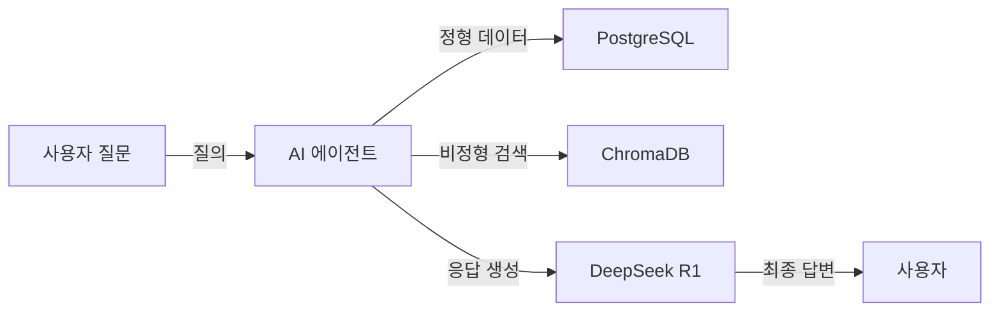

# CH01 이 책의 목표와 최종 완성본 미리보기

> AI 업무 비서 구축: RAG + MCP 실전 가이드 - 1장 실습 코드

## 목적 및 학습 목표

- 이 책에서 완성할 AI 업무 비서 시스템의 전체 아키텍처를 한눈에 파악합니다.
- 정형(PostgreSQL) + 비정형(ChromaDB) 데이터를 동시에 질의하는 최종 데모를 미리 체험합니다.
- 챕터별 학습 로드맵과 각 단계에서 구현할 기능을 확인합니다.
- 실제 LLM(Ollama) 없이도 동작하는 Mock 시뮬레이션으로 최종 Q&A 흐름을 시연합니다.

## 실행 환경

- Python 3.11+
- Ollama (선택 사항 -- 없어도 데모 실행 가능)
- DeepSeek R1 모델 (선택 사항)

> CH01은 미리보기 챕터로, Ollama가 설치되지 않아도 데모가 정상 동작합니다.

## 설치 및 실행

이 챕터의 예제 코드 저장소를 클론합니다.

```bash
git clone https://github.com/{repo}/CH01_목표와미리보기
cd CH01_목표와미리보기
```

환경 변수를 설정합니다.

```bash
cp .env.example .env
```

`.env` 파일을 열어 필요한 값을 확인합니다. CH01은 대부분의 기본값을 그대로 사용할 수 있습니다.

### macOS / Linux

```bash
python3 -m venv venv
source venv/bin/activate
pip install -r requirements.txt
```

### Windows

```bash
python -m venv venv
venv\Scripts\activate
pip install -r requirements.txt
```

## 실행

```bash
python src/demo.py
```

## 예상 결과

<!-- [캡처 사진 삽입 위치: 터미널 성공 실행 전체 화면] -->

```
============================================================
  AI 업무 비서 구축: RAG + MCP 실전 가이드
  CH01 최종 완성본 미리보기 데모
============================================================

============================================================
  Ollama 연결 상태 확인
============================================================
  서버 주소  : http://localhost:11434
  모델       : deepseek-r1
  상태       : [연결 안 됨] 오프라인 (데모 모드로 계속 진행)

  [안내] Ollama가 실행되지 않아도 이 데모는 정상 동작합니다.
  [안내] 실제 LLM 응답은 CH02부터 단계별로 구현합니다.
============================================================

  (이하 아키텍처, 로드맵, 챕터 미리보기, Q&A 시뮬레이션 출력)

  데모 실행 완료.
```

> **주의**: 위 출력은 실제 실행 결과를 그대로 복사한 것입니다. 독자의 터미널 출력과 비교하여 디버깅하십시오.

## 전체 구조



## 파일 구조

```
CH01_목표와미리보기/
├── README.md           <- 이 파일
├── requirements.txt    <- Python 의존성 (python-dotenv, requests)
├── .env.example        <- 환경 변수 템플릿
├── src/
│   ├── __init__.py
│   └── demo.py         <- 미리보기 데모 스크립트
├── data/               <- (이 챕터는 데이터 파일 없음)
└── outputs/            <- 실행 결과물 (.gitignore 대상)
```

## 데모 모드 설명

`.env` 파일의 `DEMO_MODE` 값으로 동작 방식을 제어합니다.

| 값 | 설명 |
|----|------|
| `mock` | 실제 LLM 없이 미리 준비된 응답으로 시뮬레이션 (기본값) |
| `live` | 실제 Ollama가 실행 중일 때 라이브 응답 사용 (CH02 이후 활용) |

## 다음 단계

CH01 데모를 확인했다면 CH02로 이동하십시오.

CH02에서는 DeepSeek-R1을 직접 실행하며 LLM의 한계(환각)를 체험하고, 기초 RAG를 직접 구현합니다.
