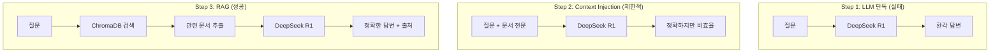

# CH02 기초 RAG

> AI 업무 비서 구축: RAG + MCP 실전 가이드 - 2장 실습 코드

## 목적 및 학습 목표

- LLM 단독 질의의 한계(환각, Hallucination)를 직접 체험합니다.
- 컨텍스트 직접 주입(Context Injection) 방식의 장단점을 이해합니다.
- ChromaDB를 활용한 기초 RAG 파이프라인(검색 → 컨텍스트 → 생성)을 구현합니다.
- DeepSeek R1의 추론 토큰(Reasoning Token) 특성과 활용법을 파악합니다.

## 실행 환경

- Python 3.11+
- Ollama (DeepSeek R1 모델 포함)
- Docker 불필요 — 이 챕터는 ChromaDB 인메모리 모드로 동작합니다.

## 사전 준비 — Ollama 설치 (최초 1회)

이 챕터는 인프라 레포 없이 Ollama와 로컬 ChromaDB만 사용합니다.

```bash
# Ollama 설치 (https://ollama.ai)
# macOS
brew install ollama

# Ollama 서버 시작
ollama serve

# DeepSeek R1 모델 다운로드 (별도 터미널에서 실행)
ollama pull deepseek-r1
```

> 메모리가 8GB 미만이라면 소형 모델을 사용하십시오.
> `ollama pull deepseek-r1:1.5b`

> Ollama 없이도 실행할 수 있습니다. Ollama 미연결 시 자동으로 Mock 모드로 전환됩니다.

## 설치 및 실행

이 챕터의 예제 코드 저장소를 클론합니다.

```bash
git clone https://github.com/{repo}/CH02_기초RAG
cd CH02_기초RAG
```

환경 변수를 설정합니다.

```bash
cp .env.example .env
# .env 파일을 열어 OLLAMA_MODEL, OLLAMA_BASE_URL 값을 확인합니다.
# 기본값으로도 동작하므로 변경이 필요 없으면 그대로 두십시오.
```

### macOS

```bash
python3 -m venv venv
source venv/bin/activate
pip install -r requirements.txt
```

### Windows

```bash
python -m venv venv
venv\Scripts\activate
pip install -r requirements.txt
```

## 실행

전체 4단계를 순서대로 실행합니다.

```bash
python src/main.py
```

특정 단계만 실행할 수 있습니다.

```bash
python src/main.py --step 1   # Step 1: LLM 단독 질의 (환각 체험)
python src/main.py --step 2   # Step 2: Context Injection (반쪽 성공)
python src/main.py --step 3   # Step 3: 기초 RAG (ChromaDB + LLM)
python src/main.py --step 4   # Step 4: DeepSeek R1 추론 모드
```

## 예상 결과

<!-- [캡처 사진 삽입 위치: Step 3 기초 RAG 성공 실행 전체 터미널 화면] -->

```
************************************************************
  AI 업무 비서 구축: RAG + MCP 실전 가이드
  CH02: DeepSeek-R1으로 시작하는 기초 RAG 정복
************************************************************

이 실습에서는 이서연의 시행착오를 따라갑니다:
  Step 1: LLM 단독 질의 → 환각 발생 (실패)
  Step 2: 컨텍스트 직접 주입 → 정확하지만 비효율 (반쪽 성공)
  Step 3: 기초 RAG → 검색 + LLM = 정확한 답변 (성공!)
  Step 4: DeepSeek R1 추론 모드 → 근거 있는 복잡한 분석 가능 (심화)

[전체 4단계를 순서대로 실행합니다]
각 단계 사이에 Enter 키를 눌러 진행합니다.

============================================================
Step 1: LLM 단독 질의 — 환각(Hallucination) 체험
============================================================
모델: deepseek-r1
서버: http://localhost:11434

[Ollama 서버 연결 시도 중...]
[Mock 모드] Ollama 서버에 연결할 수 없습니다.
  실제 Ollama 실행 방법: ollama serve && ollama pull deepseek-r1
  현재는 환각 패턴을 시뮬레이션하는 Mock 응답을 사용합니다.

[질문 1] 커넥트HR의 연차 규정에서 신입사원 1년차 연차 일수는 몇 일입니까?
----------------------------------------
[LLM 응답]
커넥트HR의 신입사원 연차는 근로기준법에 따라 15일입니다. 단, 1년차에는 월 1일씩 부여되는 월차를 포함하여 최대 11일까지 사용할 수 있습니다.

경고: 이 답변은 정확하지 않을 수 있습니다.
      LLM은 사내 규정을 학습한 적이 없으므로,
      유사한 패턴으로 추측한 내용을 사실처럼 답변합니다.
      이것이 바로 '환각(Hallucination)'입니다.
============================================================
```

> **주의**: 위 출력은 실제 실행 결과를 그대로 복사한 것입니다. 독자의 터미널 출력과 한 글자씩 비교하여 디버깅하십시오.

## 전체 구조



## 파일 구조

```
CH02_기초RAG/
├── README.md               이 파일
├── .env.example            환경 변수 템플릿
├── requirements.txt        Python 의존성 (버전 고정)
└── src/
    ├── __init__.py
    ├── main.py             진입점 — 전체 4단계 실행
    ├── llm_direct.py       Step 1: LLM 단독 질의 (환각 재현)
    ├── context_injection.py Step 2: 컨텍스트 직접 주입
    ├── simple_rag.py       Step 3: ChromaDB + LLM 기초 RAG
    └── reasoning_demo.py   Step 4: DeepSeek R1 추론 모드
```

## 트러블슈팅

| 증상 | 원인 | 해결 방법 |
|------|------|---------|
| `Mock 모드` 출력 | Ollama 미연결 | `ollama serve` 실행 후 재시도 |
| `model not found` 오류 | 모델 미다운로드 | `ollama pull deepseek-r1` 실행 |
| `chromadb` import 오류 | 패키지 미설치 | `pip install -r requirements.txt` 재실행 |
| OOM / 시스템 느려짐 | 메모리 부족 | `deepseek-r1:1.5b` 소형 모델 사용 |
