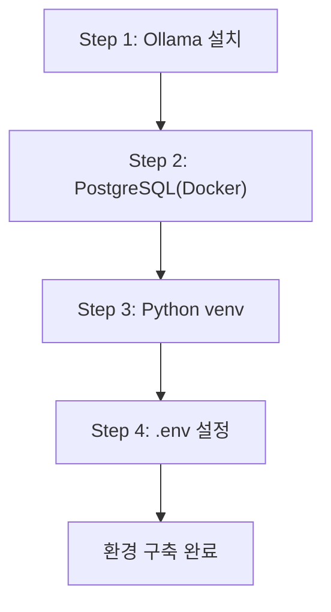

# CH03 개발 환경 구축

> AI 업무 비서 구축: RAG + MCP 실전 가이드 - 3장 실습 코드

## 목적 및 학습 목표

- Ollama와 DeepSeek R1 모델을 로컬에 설치하고 동작을 확인합니다.
- Docker Compose로 PostgreSQL 16을 한 번에 실행합니다.
- Python 3.11 가상환경을 생성하고 필수 패키지를 설치합니다.
- `.env` 파일 기반 환경 변수 설정 패턴을 이해하고 적용합니다.
- `setup_check.py`로 모든 환경 항목을 자동 점검합니다.

## 실행 환경

- Python 3.11+
- Docker Desktop (PostgreSQL 컨테이너 구동용)
- Ollama (로컬 LLM 추론 엔진)
- DeepSeek R1 모델 (Ollama로 다운로드)

## 전체 구조



## 사전 준비 — Ollama 설치 및 모델 다운로드

### macOS / Linux

```bash
# Ollama 설치
curl -fsSL https://ollama.com/install.sh | sh

# DeepSeek R1 모델 다운로드 (약 4.7GB)
ollama pull deepseek-r1

# 설치 확인
ollama list
```

### Windows

Ollama 공식 사이트(https://ollama.com/download)에서 Windows 설치 파일을 다운로드하여 실행합니다.

```bash
# PowerShell 또는 명령 프롬프트에서 실행
ollama pull deepseek-r1
ollama list
```

## 사전 준비 — PostgreSQL 컨테이너 구동

이 챕터의 `docker-compose.yml`로 PostgreSQL 16을 실행합니다.

CH03_개발환경구축 폴더로 이동한 뒤 아래 명령을 실행합니다.

```bash
docker-compose up -d
```

> PostgreSQL 16이 `connecthr` 데이터베이스와 함께 자동으로 실행됩니다.
> 데이터는 `./data/postgres` 볼륨에 영구 보존됩니다.

## 설치 및 실행

이 챕터의 예제 코드 저장소를 클론합니다.

```bash
git clone https://github.com/{repo}/CH03_개발환경구축
cd CH03_개발환경구축
```

환경 변수를 설정합니다.

```bash
cp .env.example .env
# .env 파일을 열어 필요한 값을 확인하고 수정합니다.
```

### macOS

```bash
python3 -m venv venv
source venv/bin/activate
pip install -r requirements.txt
```

### Windows

```bash
python -m venv venv
venv\Scripts\activate
pip install -r requirements.txt
```

## 실행

환경 점검 스크립트를 실행합니다.

```bash
python src/setup_check.py
```

## 예상 결과

<!-- [캡처 사진 삽입 위치: setup_check.py 실행 후 터미널 전체 화면 (모든 항목 PASS 상태)] -->

```
=== 개발 환경 점검 시작 ===

[1/5] Python 버전 확인...
  버전: 3.11.8
  결과: PASS

[2/5] Ollama 실행 여부 확인...
  URL: http://localhost:11434
  결과: PASS

[3/5] DeepSeek R1 모델 확인...
  모델: deepseek-r1
  결과: PASS

[4/5] PostgreSQL 연결 테스트...
  호스트: localhost:5432 / DB: connecthr
  결과: PASS

[5/5] ChromaDB 임포트 테스트...
  결과: PASS

=== 점검 완료 ===
PASS: 5 / 5
모든 환경 항목이 정상입니다. 다음 챕터로 진행하십시오.
```

> **주의**: 위 출력은 실제 실행 결과를 그대로 복사한 것입니다. 독자의 터미널 출력과 한 글자씩 비교하여 디버깅하십시오.

## 폴더 구조

```
CH03_개발환경구축/
├── README.md           ← 이 파일
├── requirements.txt    ← Python 패키지 목록 (버전 고정)
├── .env.example        ← 환경 변수 템플릿
├── docker-compose.yml  ← PostgreSQL 16 컨테이너 정의
├── src/
│   ├── __init__.py
│   ├── setup_check.py  ← 환경 점검 스크립트 (진입점)
│   └── env_config.py   ← .env 로딩 및 설정 검증 모듈
├── data/               ← Docker 볼륨 마운트 경로
└── outputs/            ← 실행 결과물
```

## 트러블슈팅

| 증상 | 원인 | 해결 방법 |
|------|------|---------|
| `Ollama 연결 실패` | Ollama 서비스 미실행 | `ollama serve` 명령으로 수동 시작 |
| `DeepSeek R1 모델 없음` | 모델 미다운로드 | `ollama pull deepseek-r1` 실행 |
| `PostgreSQL 연결 거부` | 컨테이너 미실행 | `docker-compose up -d` 재실행 |
| `포트 5432 충돌` | 기존 PostgreSQL 실행 중 | 기존 서비스 중지 후 재시도 |
| `pip 설치 오류` | 가상환경 미활성화 | `source venv/bin/activate` 확인 |
