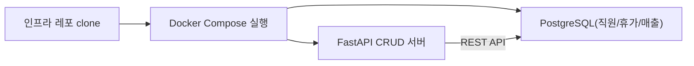

# CH04 베이스 시스템 확보

> AI 업무 비서 구축: RAG + MCP 실전 가이드 — 4장 실습 코드

## 목적 및 학습 목표

- 커넥트HR 사내 PostgreSQL DB를 Docker Compose로 구동합니다.
- `schema_viewer.py`로 테이블 구조, 컬럼, 제약조건, 레코드 수를 분석합니다.
- `crud_api.py`로 FastAPI CRUD 서버를 실행하고 Swagger UI에서 엔드포인트를 테스트합니다.
- `mcp_intro.py`로 MCP(Model Context Protocol) 도구 호출 패턴을 체험합니다.

## 실행 환경

- Python 3.11+
- Docker Desktop (PostgreSQL 16 구동용)
- Ollama + DeepSeek R1 모델 (mcp_intro.py 에이전트 데모 전용, 없어도 기본 데모는 실행됨)

## 사전 준비 — PostgreSQL 구동 (최초 1회)

이 챕터는 자체 Docker Compose 파일로 PostgreSQL을 구동합니다.

```bash
git clone https://github.com/{repo}/CH04_베이스시스템
cd CH04_베이스시스템
docker-compose up -d
```

PostgreSQL이 정상 실행되면 아래 메시지가 출력됩니다.

```
[+] Running 2/2
 Container connecthr_postgres  Healthy
```

pgAdmin(웹 DB 관리 UI)도 함께 실행하려면 아래 명령을 사용합니다.

```bash
docker-compose --profile pgadmin up -d
```

pgAdmin 주소: http://localhost:5050 (이메일: admin@connecthr.io, 비밀번호: .env의 POSTGRES_PASSWORD)

## 설치 및 실행

CH04_베이스시스템 폴더로 이동합니다.

환경 변수를 설정합니다.

```bash
cp .env.example .env
# .env 파일을 열어 필요한 값을 확인하십시오. (기본값으로 실행 가능)
```

### macOS

```bash
python3 -m venv venv
source venv/bin/activate
pip install -r requirements.txt
```

### Windows

```bash
python -m venv venv
venv\Scripts\activate
pip install -r requirements.txt
```

## 실행

### 실습 1: DB 스키마 분석 (4.2절)

```bash
python src/main.py schema
```

<!-- [캡처 사진 삽입 위치: 터미널에서 schema_viewer 실행 결과 전체 화면] -->

```
커넥트HR 데이터베이스 스키마 분석을 시작합니다...

============================================================
  테이블: employees  (레코드 수: 15건)
============================================================
컬럼명          데이터 타입        기본값                         Null 허용
--------------  -----------------  -----------------------------  -----------
id              integer            nextval('employees_id_seq'...  NO
name            character varying  -                              NO
department      character varying  -                              NO
hire_date       date               -                              NO
base_salary     numeric            -                              NO
email           character varying  -                              YES
is_active       boolean            true                           NO
created_at      timestamp with...  now()                          NO

[ 제약조건 ]
제약조건명              유형         컬럼
----------------------  -----------  ------
employees_email_key     UNIQUE        email
employees_pkey          PRIMARY KEY   id

============================================================
  테이블: leave_balance  (레코드 수: 15건)
...

리포트가 저장되었습니다: outputs/schema_report.txt
```

### 실습 2: FastAPI CRUD 서버 실행 (4.3절)

```bash
uvicorn src.crud_api:app --reload --port 8000
```

<!-- [캡처 사진 삽입 위치: Swagger UI (http://localhost:8000/docs) 화면] -->

서버가 실행되면 아래 URL에서 API를 직접 테스트할 수 있습니다.

- Swagger UI: http://localhost:8000/docs
- 직원 목록: http://localhost:8000/employees
- 이서연 연차: http://localhost:8000/leave-balance/2

### 실습 3: MCP 개념 데모 (4.4절)

```bash
python src/main.py mcp
```

<!-- [캡처 사진 삽입 위치: MCP 도구 직접 호출 결과 터미널 화면] -->

```
커넥트HR MCP(Model Context Protocol) 개념 데모

MCP 핵심 흐름:
  사용자 질문 → LLM이 도구 선택 → 도구 실행 → 결과 반환 → 최종 답변

등록된 MCP 도구 목록 (3개):
  - get_employee_info: 직원 이름으로 직원 정보를 조회합니다...
  - get_leave_balance: 직원 이름과 연도로 연차 잔액을 조회합니다...
  - get_department_sales: 부서명과 연도로 월별 매출 현황을 조회합니다...

============================================================
  [데모 1] MCP 도구 직접 호출 (LLM 없이)
============================================================

[질문] 이서연 직원 정보 조회
[도구] get_employee_info
[입력] {"employee_name": "이서연"}
[결과] {
  "id": 2,
  "name": "이서연",
  "department": "개발팀",
  "hire_date": "2022-06-15",
  "base_salary": 3600000.0,
  ...
}
```

## 전체 구조



## 파일 구조

```
CH04_베이스시스템/
├── README.md               이 파일
├── .env.example            환경 변수 템플릿
├── requirements.txt        Python 의존성 (버전 고정)
├── docker-compose.yml      PostgreSQL 16 + pgAdmin
├── docs/
│   └── schema.sql          테이블 스키마 + 샘플 데이터
├── scripts/
│   └── seed_data.py        샘플 데이터 수동 재적재 스크립트
├── src/
│   ├── __init__.py
│   ├── main.py             진입점 (schema/api/mcp 명령 분기)
│   ├── schema_viewer.py    DB 스키마 분석 도구 (4.2절)
│   ├── crud_api.py         FastAPI CRUD 서버 (4.3절)
│   └── mcp_intro.py        MCP 개념 데모 (4.4절)
└── outputs/
    └── schema_report.txt   스키마 분석 리포트 (실행 후 생성)
```

## 트러블슈팅

| 증상 | 원인 | 해결 방법 |
|------|------|---------|
| `connection refused` | PostgreSQL 미실행 | `docker-compose up -d` 재실행 |
| `ModuleNotFoundError` | 가상환경 미활성화 | `source venv/bin/activate` 후 재실행 |
| Swagger UI 접근 불가 | FastAPI 서버 미실행 | `uvicorn src.crud_api:app --reload` 실행 |
| MCP 에이전트 미동작 | Ollama 미실행 | `ollama serve` 후 `ollama pull deepseek-r1:1.5b` |
