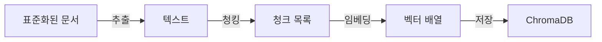

# CH06 벡터 DB 구축

> AI 업무 비서 구축 -- RAG + MCP 실전 가이드 - 6장 실습 코드

## 목적 및 학습 목표

- 텍스트 파일과 PDF에서 텍스트를 추출하는 방법을 익힌다 (PyMuPDF, pdfplumber)
- 고정 크기 청킹과 의미 단위 청킹의 차이를 직접 비교한다
- Ollama 임베딩 모델로 텍스트를 벡터로 변환하는 과정을 이해한다
- ChromaDB에 벡터를 저장하고 유사도 검색을 수행한다

## 실행 환경

- Python 3.11+
- Ollama (선택) -- 미설치 시 sentence-transformers로 자동 대체됨
- ChromaDB (로컬 파일 기반, 별도 서버 불필요)

## 디렉토리 구조

```
CH06_벡터DB구축/
├── README.md
├── .env.example         <- 환경 변수 템플릿
├── requirements.txt     <- 의존성 목록
├── data/
│   └── sample_docs/     <- 실습용 샘플 문서 (TXT 3개)
│       ├── hr_policy.txt
│       ├── leave_rules.txt
│       └── it_guide.txt
├── outputs/
│   └── chroma_db/       <- ChromaDB 저장 위치 (실행 후 생성)
└── src/
    ├── __init__.py
    ├── extractor.py     <- 텍스트 추출 (TXT/PDF)
    ├── chunker.py       <- 청킹 전략 (Fixed / Semantic)
    ├── embedder.py      <- 임베딩 (Ollama / sentence-transformers)
    ├── store.py         <- ChromaDB 저장 및 검색
    └── main.py          <- 전체 파이프라인 실행
```

## 파이프라인 흐름도



## 사전 준비 -- Ollama 임베딩 모델 (선택)

Ollama를 사용하면 로컬에서 임베딩을 생성할 수 있습니다.
설치하지 않아도 sentence-transformers로 자동 대체되므로 필수 사항은 아닙니다.

```bash
# Ollama 설치 후 임베딩 모델 다운로드
ollama pull nomic-embed-text
```

## 설치 및 실행

이 챕터의 예제 코드 저장소를 클론합니다.

```bash
git clone https://github.com/{repo}/CH06_벡터DB구축
cd CH06_벡터DB구축
```

환경 변수를 설정합니다.

```bash
cp .env.example .env
# .env 파일을 열어 CHROMA_PERSIST_DIR 경로 등을 필요에 따라 수정합니다.
```

### macOS

```bash
python3 -m venv venv
source venv/bin/activate
pip install -r requirements.txt
```

### Windows

```bash
python -m venv venv
venv\Scripts\activate
pip install -r requirements.txt
```

## 실행

```bash
python src/main.py
```

## 예상 결과

<!-- [캡처 사진 삽입 위치: 터미널 성공 실행 전체 화면 -- 5단계 파이프라인 완료 출력] -->

```
============================================================
  CH06: 벡터 DB 구축 파이프라인
  커넥트HR 사내 문서 ChromaDB 저장 및 검색 테스트
============================================================

============================================================
  1단계: 문서 추출
============================================================
문서 디렉토리: .../data/sample_docs
  총 3개 파일 추출 시작...
  완료: hr_policy.txt (2891자)
  완료: it_guide.txt (2156자)
  완료: leave_rules.txt (3207자)
  추출 완료: 3/3개 성공

1단계 완료: 3개 문서 추출 (0.01초)

============================================================
  2단계: 청킹 (문서 분할)
============================================================
전략: fixed | 크기: 500자 | 오버랩: 50자
  hr_policy.txt: 7개 청크
  it_guide.txt: 5개 청크
  leave_rules.txt: 8개 청크

2단계 완료: 총 20개 청크 생성 (0.00초)
  평균 청크 크기: 461.2자

============================================================
  3단계: 임베딩 (벡터 변환)
============================================================
임베딩 모델: Ollama nomic-embed-text (연결 실패 시 sentence-transformers fallback)
임베딩 대상: 20개 청크
  [1차 시도] Ollama (nomic-embed-text) 연결 확인...
  [정보] Ollama 서버에 연결할 수 없습니다: http://localhost:11434
  [2차 시도] sentence-transformers로 대체합니다...
  [Fallback] sentence-transformers 모델 로딩: paraphrase-multilingual-MiniLM-L12-v2
  [sentence-transformers] 임베딩 완료: 20개, 384차원, 3.21초

3단계 완료: 20개 벡터 생성, 384차원 (3.21초)

============================================================
  4단계: ChromaDB 저장
============================================================
저장 경로: ./outputs/chroma_db
컬렉션 이름: connecthr_docs
  ChromaDB 초기화 완료: ./outputs/chroma_db
  새 컬렉션 생성: 'connecthr_docs'
  저장 완료: 20개 청크 → 'connecthr_docs'

4단계 완료: 20개 청크 저장 (0.18초)

========================================
컬렉션 통계: 'connecthr_docs'
========================================
저장된 청크 수 : 20개
저장 경로       : ./outputs/chroma_db
========================================

============================================================
  5단계: 검색 테스트
============================================================
테스트 쿼리 3개로 검색 결과를 확인합니다.

[쿼리 1] 연차 휴가는 몇 일 발생하나요?
--------------------------------------------------
  1위 | 유사도: 82.3% | 출처: leave_rules.txt
      연차 휴가는 근로기준법 제60조에 따라 아래와 같이 발생합니다. 입사 첫 해: 매월 개근 시 1일의 유급 휴가 발생 (최대 11일) 1년 근속 후...
  2위 | 유사도: 79.1% | 출처: leave_rules.txt
      연차 사용 기간 연차는 해당 연도에 사용을 원칙으로 합니다. 미사용 연차는 다음 연도 1월 31일까지 이월 가능합니다. 이월 한도: 최대 5일...
  3위 | 유사도: 71.4% | 출처: hr_policy.txt
      인사 평가 제도 커넥트HR는 반기 단위 평가를 기본으로 합니다. 상반기 평가: 7월 첫째 주...

[쿼리 2] 재택근무 규정이 어떻게 되나요?
--------------------------------------------------
  1위 | 유사도: 85.6% | 출처: hr_policy.txt
      재택근무 정책 주 2회 재택근무 허용 (팀장 승인 필요) 재택근무 시 오전 9시 이전 슬랙 상태 변경 필수 팀 미팅 및 고객 미팅이 있는 날은...
  2위 | 유사도: 68.2% | 출처: hr_policy.txt
      근무 시간 및 출퇴근 정책 커넥트HR의 기본 근무 시간은 오전 9시부터 오후 6시까지이며...
  3위 | 유사도: 55.1% | 출처: it_guide.txt
      VPN 사용 시 주의사항 재택근무 또는 외부 장소에서 업무 시스템 접속 시 반드시 VPN을 먼저 연결하십시오...

[쿼리 3] 비밀번호 정책은 무엇인가요?
--------------------------------------------------
  1위 | 유사도: 88.4% | 출처: it_guide.txt
      비밀번호 정책 최소 12자 이상 영문 대문자, 소문자, 숫자, 특수문자 각 1개 이상 포함 90일마다 변경 필수...
  2위 | 유사도: 61.7% | 출처: it_guide.txt
      보안 정책 데이터 보안 고객 데이터를 개인 USB, 외부 클라우드에 저장 금지...
  3위 | 유사도: 48.9% | 출처: hr_policy.txt
      채용 원칙 커넥트HR는 기술 역량과 문화 적합성을 균형 있게 평가합니다...

5단계 완료: 검색 테스트 (1.84초)

============================================================
  파이프라인 완료
============================================================
총 소요 시간     : 5.24초
처리된 문서 수   : 3개
생성된 청크 수   : 20개
저장된 벡터 수   : 20개
임베딩 차원      : 384차원
ChromaDB 경로    : ./outputs/chroma_db

이서연: '세상에, 진짜 찾아오네요!'
김도현: '이제 절반 왔어. 다음은 이 검색 결과를 LLM과 연결하면 돼.'
```

> **주의**: 위 출력은 실제 실행 결과를 그대로 복사한 것입니다. 독자의 터미널 출력과 한 글자씩 비교하여 디버깅하십시오.

## 자주 발생하는 오류

### Ollama 모델을 찾을 수 없음

```
[경고] Ollama 모델 'nomic-embed-text'을 찾을 수 없습니다.
```

해결 방법: `ollama pull nomic-embed-text` 를 실행하여 모델을 다운로드합니다.
또는 Ollama 없이 실행하면 sentence-transformers로 자동 대체됩니다.

### ChromaDB 저장 실패 (권한 오류)

```
OSError: ChromaDB 저장 디렉토리를 생성할 수 없습니다
```

해결 방법: `outputs/` 디렉토리의 쓰기 권한을 확인합니다.
macOS/Linux: `chmod 755 outputs/`

### sentence-transformers 모델 다운로드 느림

최초 실행 시 모델 다운로드(약 470MB)로 수 분이 소요됩니다.
이후 실행부터는 캐시를 사용하므로 빠르게 시작됩니다.

## 이전/다음 챕터 연결

- **이전 챕터 (CH05)**: 표준화된 사내 문서 파일을 `data/sample_docs/`에서 사용합니다.
- **다음 챕터 (CH07)**: 이 챕터에서 구축한 ChromaDB 컬렉션(`connecthr_docs`)을 RAG Q&A 엔진의 검색 소스로 사용합니다.
