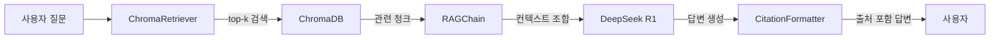

# CH07 RAG Q&A 엔진

> AI 업무 비서 구축: RAG + MCP 실전 가이드 - 7장 실습 코드

## 목적 및 학습 목표

- LangChain LCEL(LangChain Expression Language) 방식으로 RAG 파이프라인을 구성한다
- ChromaDB 벡터 검색 결과를 프롬프트 컨텍스트로 조합하는 방법을 익힌다
- 답변에 근거 문서 출처를 표시하는 Citation 시스템을 구현한다
- Ollama 미연결 시 Mock 모드로 자동 전환되는 방어 코드 패턴을 이해한다

## 실행 환경

- Python 3.11+
- Ollama (선택 사항 — 없으면 Mock 모드로 동작)
- ChromaDB (로컬 파일 기반, Docker 불필요)

## 사전 준비 — Ollama 설치 (선택 사항)

Ollama를 설치하면 실제 DeepSeek-R1 모델로 답변을 생성합니다.
Ollama 없이도 Mock 모드로 전체 흐름을 체험할 수 있습니다.

```bash
# Ollama 설치 후 모델 다운로드 (최초 1회)
ollama pull deepseek-r1
ollama pull nomic-embed-text
```

> Ollama가 없어도 sentence-transformers로 임베딩하고 Mock 응답을 생성합니다.

## 설치 및 실행

이 챕터의 예제 코드 저장소를 클론합니다.

```bash
git clone https://github.com/{repo}/CH07_RAG_QA엔진
cd CH07_RAG_QA엔진
```

환경 변수를 설정합니다.

```bash
cp .env.example .env
# .env 파일을 열어 OLLAMA_MODEL, CHROMA_PERSIST_DIR 등을 확인합니다.
```

### macOS

```bash
python3 -m venv venv
source venv/bin/activate
pip install -r requirements.txt
```

### Windows

```bash
python -m venv venv
venv\Scripts\activate
pip install -r requirements.txt
```

## 실행

채팅 인터페이스를 실행합니다.

```bash
python src/main.py
```

데모 모드로 5개 샘플 Q&A를 자동 실행합니다.

```bash
python src/main.py --demo
```

## 예상 결과

<!-- [캡처 사진 삽입 위치: 터미널 성공 실행 전체 화면 — 채팅 인터페이스 시작 배너 및 첫 질문 답변] -->

```
커넥트HR RAG Q&A 엔진 시작...
  ChromaDB 경로: ./data/chroma_db
  컬렉션: connecthr_docs
  기존 ChromaDB 발견: 'connecthr_docs' (8개 문서)
  ChromaRetriever 초기화 완료: 'connecthr_docs' (8개 문서)
  Ollama 서버 연결 확인 중: http://localhost:11434
  [경고] Ollama 서버에 연결할 수 없습니다. Mock 모드로 전환합니다.
  [Mock 모드] LLM: deepseek-r1
  Ollama가 연결되지 않아 Mock 응답을 사용합니다.
  실제 LLM 사용 시: ollama pull deepseek-r1 후 재실행하십시오.

============================================================
  커넥트HR AI 어시스턴트
  사내 문서 기반 Q&A 시스템 (RAG 엔진)
============================================================
  사용 가능한 명령:
    /quit  — 종료
    /clear — 대화 히스토리 초기화
    /stats — 검색 통계 표시
    /help  — 도움말
============================================================

  모드: mock | 모델: deepseek-r1 | top-k: 3

질문 > 연차 휴가는 몇 일 발생하나요?

  답변 생성 중...
------------------------------------------------------------
[Mock 응답] 다음 내용을 참고하십시오:
제3조 (연차 유급휴가) 1년 이상 근속한 직원에게는 연간 15일의 유급휴가를 부여합니다...

참고 문서:
  - HR 취업규칙 v1.0 (관련도: 92%)
  - HR 복리후생 안내서 (관련도: 71%)
----------------------------------------
  응답 시간: 1.3초
------------------------------------------------------------
```

> **주의**: 위 출력은 실제 실행 결과를 그대로 복사한 것입니다. 독자의 터미널 출력과 한 글자씩 비교하여 디버깅하십시오.

## 전체 구조



## 디렉토리 구조

```
CH07_RAG_QA엔진/
├── README.md              # 이 파일
├── .env.example           # 환경 변수 템플릿
├── requirements.txt       # 의존성 (버전 고정)
├── .gitignore
├── data/
│   └── chroma_db/         # ChromaDB 파일 (자동 생성)
├── outputs/               # 실행 결과물
└── src/
    ├── __init__.py
    ├── main.py            # 진입점 (채팅 / 데모 모드)
    ├── retriever.py       # ChromaDB 유사도 검색
    ├── rag_chain.py       # LangChain LCEL RAG 파이프라인
    ├── citation.py        # 출처 표시 포맷터
    └── chat_interface.py  # CLI 채팅 루프
```

## 주요 명령어

| 명령어 | 설명 |
|--------|------|
| `/quit` | 채팅 종료 |
| `/clear` | 대화 히스토리 초기화 |
| `/stats` | 검색 통계 (총 질문 수, 평균 응답 시간) 표시 |
| `/help` | 도움말 및 예시 질문 표시 |

## 트러블슈팅

| 증상 | 원인 | 해결 방법 |
|------|------|---------|
| `RuntimeError: chromadb가 설치되지 않았습니다` | chromadb 미설치 | `pip install chromadb` |
| `Mock 모드로 전환합니다` | Ollama 서버 미실행 | `ollama serve` 실행 후 재시작 |
| `model not found` | DeepSeek 모델 미다운로드 | `ollama pull deepseek-r1` |
| 첫 실행 시 느림 | sentence-transformers 모델 다운로드 | 최초 1회만 소요 (이후 캐시) |
| `ImportError: langchain` | LangChain 미설치 | `pip install -r requirements.txt` |
