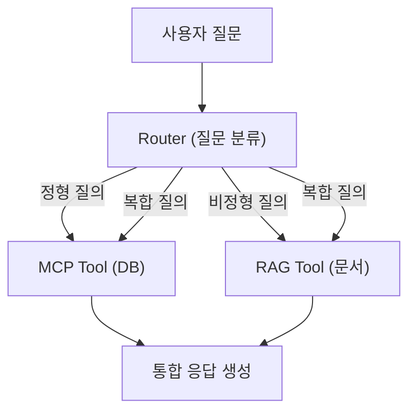

# CH08 통합 에이전트 (MCP + RAG)

> AI 업무 비서 구축 — RAG + MCP 실전 가이드 - 8장 실습 코드

## 목적 및 학습 목표

- 정형 데이터(DB)와 비정형 데이터(문서)를 하나의 에이전트로 통합하는 원리를 이해합니다.
- 규칙 기반 + LLM 기반 질문 라우팅(QueryRouter)을 직접 구현합니다.
- LangChain ReAct 에이전트에 MCP 스타일 DB 도구와 RAG 검색 도구를 연결합니다.
- 10개 대표 시나리오(정형/비정형/복합)를 실행하여 통합 답변 생성을 확인합니다.

## 전체 구조



## 실행 환경

- Python 3.11+
- Docker (PostgreSQL 구동용)
- Ollama + DeepSeek R1 모델 (선택 사항, 없으면 Mock 모드)
- ChromaDB (CH06 예제 사전 실행 권장, 없으면 Mock 문서 사용)

## 사전 준비 — PostgreSQL 구동 (최초 1회)

이 챕터는 자체 `docker-compose.yml`로 PostgreSQL을 구동합니다.

```bash
docker-compose up -d
```

Docker가 실행되면 PostgreSQL(connecthr 데이터베이스 + 샘플 데이터)이 자동으로 시작됩니다.

구동 상태 확인:

```bash
docker-compose ps
```

## 설치 및 실행

이 챕터의 예제 코드 저장소를 클론합니다.

```bash
git clone https://github.com/{repo}/CH08_통합에이전트
cd CH08_통합에이전트
```

환경 변수를 설정합니다.

```bash
cp .env.example .env
```

`.env` 파일을 열어 Ollama, PostgreSQL, ChromaDB 설정을 확인합니다. Docker Compose 기본값을 사용하면 수정 없이 실행 가능합니다.

### macOS

```bash
python3 -m venv venv
source venv/bin/activate
pip install -r requirements.txt
```

### Windows

```bash
python -m venv venv
venv\Scripts\activate
pip install -r requirements.txt
```

## 실행

```bash
python src/main.py
```

## Ollama 설치 및 모델 다운로드 (선택)

Ollama가 없으면 Mock 모드로 실행됩니다. 실제 LLM 답변을 보려면 아래 순서로 설치합니다.

```bash
# Ollama 설치 (macOS)
brew install ollama

# 모델 다운로드 (약 5~8GB, 첫 실행 시 1회)
ollama pull deepseek-r1

# Ollama 서버 실행
ollama serve
```

## 예상 결과

<!-- [캡처 사진 삽입 위치: 터미널 성공 실행 전체 화면 — 10개 시나리오 출력] -->

```
=================================================================
  CH08 통합 에이전트 — MCP + RAG 통합 시나리오 실습
  커넥트HR 사내 AI 비서 (10개 대표 질문)
=================================================================

  에이전트 구성:
  - DB 도구 (MCP): 직원 정보, 연차 잔액, 부서 매출 조회
  - RAG 도구    : 사내 문서 (정책/규정/절차) 검색
  - 라우터      : 질문 유형 자동 분류 (정형/비정형/복합)

  에이전트 초기화 중...
  [라우터] Ollama 미연결. 규칙 기반만 사용합니다.
  Ollama 서버 연결 확인: http://localhost:11434
  [경고] Ollama 미연결 — Mock 모드로 전환합니다.
  [Mock 모드] 도구를 직접 호출하여 답변을 생성합니다.
  실제 LLM 사용 시: ollama pull deepseek-r1 후 재실행하십시오.

  총 10개 시나리오를 실행합니다.

─────────────────────────────────────────────────────────────────
  시나리오 01 [정형] 직원 연차 조회
─────────────────────────────────────────────────────────────────
  질문 : 이서연 씨의 이번 달 남은 연차 일수는?
  분류 : structured (신뢰도 80%, 방법: rule)
  모드 : mock

  [답변]
  [Mock 에이전트] Ollama 미연결 — 도구 직접 호출 모드
  [Mock] PostgreSQL 미연결 — Mock 직원 데이터를 사용합니다.
  [직원 정보] 이서연: 개발팀 개발자, 기본급 3,800,000원
  [Mock] PostgreSQL 미연결 — Mock 연차 데이터를 사용합니다.
  [연차 정보] 이서연: 총 15일 중 12일 사용, 잔여 3일

─────────────────────────────────────────────────────────────────
  시나리오 03 [비정형] 연차 신청 절차 문의
─────────────────────────────────────────────────────────────────
  질문 : 연차 신청은 어떻게 하나요?
  분류 : unstructured (신뢰도 70%, 방법: rule)
  모드 : mock

  [답변]
  [문서 검색 결과]
  [문서 1] 출처: HR_취업규칙_v1.0 (유사도: 0.92)
  제3장 휴가 제도
  3.2 연차 신청 방법: 연차를 사용하려면 사용 3일 전까지 HR 시스템에서 신청해야 합니다.
  ...

=================================================================
  실행 완료: 10/10개 시나리오 성공
=================================================================

  [완료] CH08 통합 에이전트 실습이 종료되었습니다.
  다음 챕터(CH09)에서 이 에이전트를 프로덕션 수준으로 발전시킵니다.
```

> **주의**: 위 출력은 Mock 모드 실행 결과의 예시입니다. Ollama 연결 시 실제 LLM이 생성한 자연어 답변이 출력됩니다. PostgreSQL 연결 여부에 따라 "Mock" 메시지 유무가 달라집니다.

## 파일 구조

```
CH08_통합에이전트/
├── README.md             이 파일
├── .env.example          환경 변수 템플릿
├── requirements.txt      Python 의존성 (버전 고정)
├── docker-compose.yml    PostgreSQL 16 컨테이너 정의
├── data/
│   └── schema.sql        커넥트HR DB 스키마 + 샘플 데이터
└── src/
    ├── __init__.py
    ├── router.py          질문 유형 분류기 (규칙 기반 + LLM 폴백)
    ├── mcp_tools.py       MCP 스타일 DB 조회 도구 3종
    ├── rag_tool.py        ChromaDB 기반 문서 검색 도구
    ├── agent.py           LangChain ReAct 통합 에이전트
    └── main.py            10개 시나리오 실행 진입점
```

## 트러블슈팅

| 증상 | 원인 | 해결 방법 |
|------|------|---------|
| `connection refused` (DB) | PostgreSQL 미실행 | `docker-compose up -d` 실행 |
| Mock 모드로 실행됨 | Ollama 미연결 | `ollama serve` 실행 후 재시도 |
| `model not found` | 모델 미다운로드 | `ollama pull deepseek-r1` 실행 |
| ChromaDB Mock 사용 | CH06 미실행 | CH06 예제 먼저 실행하여 벡터 DB 구축 |
| `ImportError: psycopg2` | 드라이버 미설치 | `pip install psycopg2-binary` |
