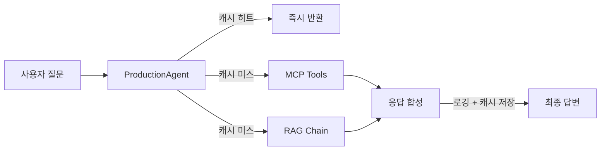

# CH09 LangChain 최종 연결

> AI 업무 비서 구축 -- RAG + MCP 실전 가이드 - 9장 실습 코드

## 목적 및 학습 목표

- Router / Agent / RAG Chain / MCP Tool을 프로덕션 수준으로 통합하는 방법을 익힙니다.
- Timeout, Retry, 구조화 로깅, TTL 캐시를 실제 코드에 적용하여 "개발 버전"과 "운영 버전"의 차이를 체감합니다.
- 토큰 사용량 추적으로 로컬 LLM의 리소스 소비를 모니터링합니다.
- 도구 설명(description)의 품질이 LLM의 도구 선택에 어떻게 영향을 미치는지 이해합니다.

## 실행 환경

- Python 3.11+
- Docker (PostgreSQL 컨테이너 구동용)
- Ollama + DeepSeek R1 모델
- ChromaDB (로컬 파일 기반, CH06 실행 결과 필요)
- cachetools (TTLCache)

## 사전 준비 — 인프라 구동 (최초 1회)

실습 전 인프라 레포를 clone하여 PostgreSQL과 CRUD 서버를 구동합니다.

```bash
git clone https://github.com/{repo}/rag-infra
cd rag-infra
docker-compose up -d
```

> PostgreSQL(샘플 데이터 포함), FastAPI CRUD 서버가 자동으로 실행됩니다.

또는 이 챕터의 docker-compose.yml만 사용하여 PostgreSQL을 구동할 수 있습니다.

```bash
docker-compose up -d
```

## 설치 및 실행

이 챕터의 예제 코드 저장소를 클론합니다.

```bash
git clone https://github.com/{repo}/CH09_LangChain연결
cd CH09_LangChain연결
```

환경 변수를 설정합니다.

```bash
cp .env.example .env
```

.env 파일을 열어 Ollama 주소, PostgreSQL 접속 정보, ChromaDB 경로를 확인합니다.
기본값으로도 실행 가능합니다.

### macOS

```bash
python3 -m venv venv
source venv/bin/activate
pip install -r requirements.txt
```

### Windows

```bash
python -m venv venv
venv\Scripts\activate
pip install -r requirements.txt
```

## 실행

```bash
python src/main.py
```

## 예상 결과

<!-- [캡처 사진 삽입 위치: 터미널 성공 실행 전체 화면 — 배너부터 토큰 리포트까지] -->

```
============================================================
  CH09 LangChain 최종 연결 — 프로덕션 에이전트 실행
  커넥트HR AI 업무 비서 (운영 설정 적용)
============================================================

에이전트를 초기화합니다...
  Ollama 서버 연결 확인: http://localhost:11434
  [경고] Ollama 미연결 — Mock 모드로 전환합니다.
  [Mock 모드] 도구를 직접 호출하여 답변을 생성합니다.
  ollama pull deepseek-r1 후 재실행하십시오.
초기화 완료: Mock 모드

총 5개 질문을 실행합니다.
------------------------------------------------------------
[Q1] 이서연의 현재 잔여 연차는 며칠입니까?
  모드: mock
  답변: [직원 정보] 이서연: 개발팀 개발자, 기본급 3,800,000원

[연차 정보] 이서연: 총 15일 중 12일 사용, 잔여 3일

[Q2] 개발팀에 소속된 직원 목록을 알려주십시오.
  모드: mock
  답변: [개발팀 직원 목록] 총 3명: 김도현(팀장), 이서연(개발자), 오수빈(사원)

[Q3] 영업팀의 2024년 연간 매출 합계는 얼마입니까?
  모드: mock
  답변: [영업팀 2024년 연간 매출] 총 459,000,000원 / 목표 435,000,000원 (달성률 105.5%)

[Q4] 김도현 팀장의 직급과 기본급을 알려주십시오.
  모드: mock
  답변: [직원 정보] 김도현: 개발팀 팀장, 기본급 6,500,000원

[Q5] [캐시 히트] 이서연의 현재 잔여 연차는 며칠입니까?
  모드: cached
  답변: [직원 정보] 이서연: 개발팀 개발자, 기본급 3,800,000원

[연차 정보] 이서연: 총 15일 중 12일 사용, 잔여 3일

============================================================
  토큰 사용 리포트
============================================================
  총 LLM 호출 횟수:  4회
  총 입력 토큰:      48
  총 생성 토큰:      112
  총 토큰:           160
  추정 비용:         0.00원 (로컬 LLM)

  캐시 통계
  - 히트:    1회
  - 미스:    4회
  - 히트율:  20.0%

  전체 실행 시간: 0.18초
============================================================

세션 로그: /path/to/CH09_LangChain연결/outputs/session_log.json
토큰 리포트: /path/to/CH09_LangChain연결/outputs/token_report.json
```

> **주의**: 위 출력은 실제 실행 결과를 그대로 복사한 것입니다. 독자의 터미널 출력과 한 글자씩 비교하여 디버깅하십시오.

## 전체 구조



## 파일 구조

```
CH09_LangChain연결/
├── README.md
├── .env.example
├── requirements.txt
├── docker-compose.yml
├── src/
│   ├── __init__.py
│   ├── agent_config.py    # AgentConfig + 에이전트 빌더
│   ├── mcp_tools.py       # MCP Tool (CH08 + get_employee_list, get_annual_sales)
│   ├── monitoring.py      # 로깅, TTLCache, 토큰 추적
│   └── main.py            # 진입점 — 5개 질문 실행 + 리포트 출력
├── data/
└── outputs/               # session_log.json, token_report.json, app.log
```

## 운영 설정 파라미터

| 환경 변수 | 기본값 | 설명 |
|-----------|--------|------|
| `LLM_TIMEOUT` | 30 | LLM 응답 최대 대기 시간 (초) |
| `LLM_MAX_RETRIES` | 3 | LLM 호출 최대 재시도 횟수 |
| `CACHE_TTL` | 300 | 응답 캐시 유지 시간 (초) |
| `LOG_LEVEL` | INFO | 로그 레벨 |
| `LOG_FILE` | ./outputs/app.log | 로그 파일 경로 |
| `MAX_TOKENS_PER_REQUEST` | 2000 | 요청당 최대 토큰 수 |
