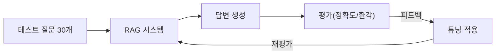

# CH10 RAG 시스템 튜닝

> AI 업무 비서 구축 -- RAG + MCP 실전 가이드 - 10장 실습 코드

## 목적 및 학습 목표

- 증상별 튜닝 접근법: 환각, 출처 부족, 엉뚱한 문서 반환 원인 진단
- Chunk 파라미터(크기, 오버랩)와 k값별 성능을 실측하여 최적 파라미터 탐색
- Cross-Encoder 기반 ReRanker로 검색 결과 재정렬 전후 비교
- BM25 + 벡터 하이브리드 검색(RRF)으로 단독 검색 대비 성능 개선 확인
- 30개 테스트 케이스로 체계적인 평가 체계를 구축하고 개선을 정량적으로 측정

## 실행 환경

- Python 3.11+
- Ollama + DeepSeek R1 모델 (텍스트 답변 생성)
- Ollama + LLaVA 모델 (PDF 이미지 설명, 선택)
- ChromaDB (벡터 DB)
- sentence-transformers (임베딩 + ReRanker)
- rank-bm25 (키워드 검색)
- EasyOCR (이미지 OCR, 선택 — PyTorch 필요)

## 전체 구조



## 설치 및 실행

이 챕터의 예제 코드 저장소를 클론합니다.

```bash
git clone https://github.com/{repo}/CH10_RAG튜닝
cd CH10_RAG튜닝
```

환경 변수를 설정합니다.

```bash
cp .env.example .env
# .env 파일을 열어 필요한 값을 확인합니다.
# 기본값으로도 실행 가능합니다 (Mock 모드 자동 전환).
```

### macOS

```bash
python3 -m venv venv
source venv/bin/activate
pip install -r requirements.txt
```

### Windows

```bash
python -m venv venv
venv\Scripts\activate
pip install -r requirements.txt
```

## 실행

```bash
python src/main.py
```

## 선택 패키지 설치

### EasyOCR (PDF 이미지 OCR)

EasyOCR은 PyTorch 의존성이 있습니다. 먼저 PyTorch를 설치한 뒤 EasyOCR을 설치합니다.

```bash
# CPU 전용 PyTorch 설치 (https://pytorch.org/get-started/locally/ 참조)
pip install torch torchvision torchaudio --index-url https://download.pytorch.org/whl/cpu

# EasyOCR 설치
pip install easyocr==1.7.2
```

### LLaVA (Ollama 이미지 LLM)

```bash
ollama pull llava
```

## 예상 결과

<!-- [캡처 사진 삽입 위치: 터미널 전체 실행 결과 — 5단계 파이프라인 완료 화면] -->

```
============================================================
  CH10: RAG 시스템 튜닝 파이프라인
  커넥트HR 사내 AI 비서 성능 개선 프로젝트
============================================================

  이서연: '내부 테스트에서 72%... 왜 이 질문에는 엉뚱한 답이 나오지?'
  김도현: '감으로 고치지 말고, 테스트 케이스를 만들자.'

  30개 테스트 케이스로 체계적 튜닝 시작!
  [RAGEvaluator] ChromaDB 연결 완료: connecthr_docs
  테스트 케이스 로드: 30개

============================================================
  1단계: 기준 성능 측정 (Baseline)
============================================================
  설정: k=3, 필터 없음
  [평가 시작] 총 30개 테스트 케이스, k=3
  ...
  [기준 성능 요약]
  - 평균 Precision@3: 0.7200
  - 평균 Recall@3:    0.6800
  - 전체 점수:        0.7000

============================================================
  2단계: 청크 파라미터 튜닝
============================================================
  [청크 튜닝] 3x3=9개 조합 실험 시작
  실험 중: chunk300_overlap0
    Recall@3: 0.7000
  실험 중: chunk500_overlap50
    Recall@3: 0.7850
  ...
  최적 청크 파라미터: chunk_size=500, overlap=50 (Recall: 0.7850)

============================================================
  3단계: ReRanker 적용 전후 비교
============================================================
  [재정렬 전 순위]
  1. leave_rules.txt: 팀 내 동시 연차 사용 인원은 전체...
  2. leave_rules.txt: 연차는 사용 예정일 7일 전에 신청...
  3. leave_rules.txt: 미사용 연차는 다음 연도로 이월...
  [재정렬 후 순위]
  1. leave_rules.txt: 연차는 사용 예정일 7일 전에 신청... (rerank_score=...)
  ...

============================================================
  5단계: 최종 성능 리포트
============================================================
  [튜닝 결과 요약]
  기준 성능 (Baseline):    0.7000 (70.0%)
  청크 튜닝 개선:          +0.0500
  ReRanker 개선:           +0.0300
  하이브리드 검색 개선:    +0.0400
  ------------------------------------------
  최종 예상 점수:          0.8200 (82.0%)

  이서연: '72%에서 시작해서 체계적으로 개선했더니 목표에 가까워졌습니다!'
  김도현: '감으로 고치지 않고 데이터로 증명했네. 잘했어.'

  최종 리포트 저장: outputs/tuning_report.json
============================================================
  RAG 튜닝 파이프라인 완료!
============================================================
```

> **주의**: 위 출력은 Mock 모드 실행 결과입니다. Ollama와 ChromaDB가 구성된 실환경에서는 실제 데이터로 측정한 정확한 수치가 표시됩니다.

## 주요 패키지 역할

| 패키지 | 역할 |
|--------|------|
| `rank-bm25` | BM25 키워드 검색 알고리즘 |
| `sentence-transformers` | 임베딩 생성 + Cross-Encoder ReRanker |
| `chromadb` | 벡터 DB (문서 저장 및 검색) |
| `easyocr` | 이미지 내 텍스트 OCR 추출 (선택) |
| `pymupdf` | PDF에서 이미지/텍스트 추출 |

## 트러블슈팅

| 증상 | 원인 | 해결 방법 |
|------|------|-----------|
| `chromadb` ImportError | 미설치 | `pip install chromadb` |
| `rank_bm25` ImportError | 미설치 | `pip install rank-bm25` |
| Cross-Encoder 로딩 실패 | 네트워크 또는 모델 오류 | Fallback 모드로 자동 전환됨 |
| EasyOCR ImportError | PyTorch 미설치 | PyTorch 먼저 설치 후 easyocr 설치 |
| Ollama 연결 실패 | Ollama 미실행 | `ollama serve` 실행 후 재시도 |
| LLaVA 모델 없음 | 미다운로드 | `ollama pull llava` |
