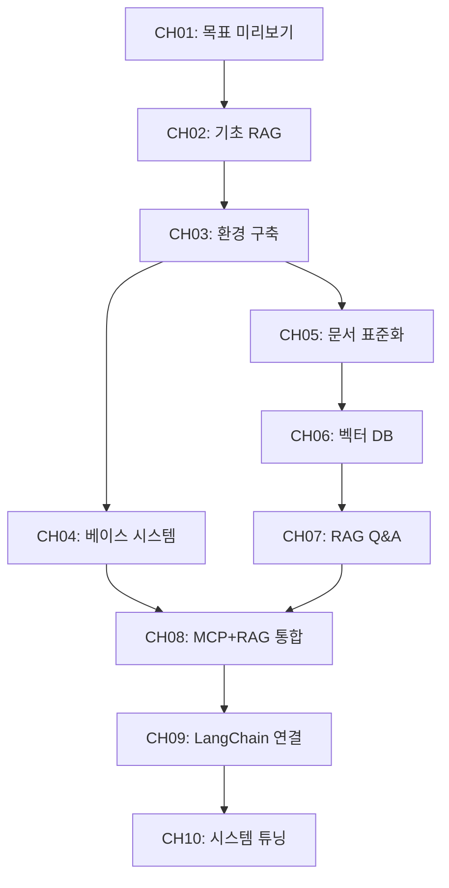

# AI 업무 비서 구축 — RAG + MCP 실전 가이드
## 사내 문서와 DB를 LLM과 연결하는 지식 엔진 설계 전 과정

---

## 이 책에 대하여

### 독자 대상

이 책은 **Python 기초 문법과 pip 사용 경험**이 있는 초급 개발자를 대상으로 합니다. LLM과 RAG는 처음이어도 괜찮습니다. SQL의 SELECT 문 정도를 알고 있다면 이 책의 모든 실습을 따라갈 수 있습니다.

| 항목 | 내용 |
|------|------|
| 대상 독자 | Python 기초 문법을 알지만 LLM/RAG 경험이 없는 초급 개발자 |
| 사전 지식 | Python 기본 문법, pip 사용 경험, SQL 기초(SELECT/INSERT) |
| 선수 환경 | macOS / Windows / Linux, Python 3.11 설치 가능, 8GB 이상 RAM |
| 기대 결과 | 사내 문서 + DB를 통합 검색하는 RAG 기반 AI 업무 비서 구축 |

### 사전 설치 체크리스트

이 책의 실습을 시작하기 전에 아래 항목을 확인하십시오.

- [ ] Python 3.11 설치 완료
- [ ] Git 설치 완료
- [ ] Docker Desktop 설치 완료 (PostgreSQL용)
- [ ] 8GB 이상 RAM (Ollama 모델 로딩용, 16GB 권장)
- [ ] 10GB 이상 디스크 여유 공간 (모델 + DB)
- [ ] 터미널/CLI 기본 사용 가능

### 실습 방법 안내

이 책의 모든 예제 코드는 GitHub 저장소에 **완성본**으로 제공됩니다. 독자는 코드를 직접 타이핑하지 않습니다. `git clone` 후 즉시 실행하는 방식으로 진행합니다.

```bash
git clone https://github.com/{repo}/CH{N}_{제목}
cd CH{N}_{제목}
cp .env.example .env
pip install -r requirements.txt
python src/main.py
```

인프라(PostgreSQL, FastAPI CRUD 서버, 샘플 데이터)는 별도 인프라 레포를 Docker Compose로 제공합니다.

---

## 전체 구성 개요

| 항목 | 값 |
|------|---|
| 총 챕터 수 | 10개 |
| 예상 총 분량 | 100페이지 |
| 이론 / 실습 비율 | 30% (30p) / 70% (70p) |
| 실습 방식 | GitHub Clone 후 실행 |

### 4 Stage 스토리 아크

이 책은 스타트업 HRTech 기업 **커넥트HR**의 AI팀이 3개월 만에 고객 문의 응답 시간을 10분에서 30초로 줄이는 과정을 따라갑니다.

| 단계 | 챕터 | 핵심 활동 | 분량 |
|------|------|---------|------|
| Stage 1. 비전 및 기초 | CH01 - CH02 | 목표 확인 + 기초 RAG 실습 | 18p |
| Stage 2. 인프라 및 표준화 | CH03 - CH05 | 환경 구축 + 시스템 확보 + 문서 표준화 | 28p |
| Stage 3. 지식 검색 엔진 | CH06 - CH07 | 벡터 DB + RAG Q&A 파이프라인 | 24p |
| Stage 4. 지능형 에이전트 | CH08 - CH10 | MCP + RAG 통합 + 프로덕션 연결 + 튜닝 | 30p |

#### 등장인물

| 이름 | 역할 | 나이 | 특징 |
|------|------|------|------|
| 이서연 | 개발자 (독자의 분신) | 28세 | Python 2년 경력 초급 개발자. 궁금한 것을 직접 묻고 시행착오를 겪는다. |
| 김도현 | 팀장 | 35세 | 백엔드 개발자, Python 5년 경력, AI는 처음. 실용적 결정을 내리는 리더. |
| 박민준 | 데이터팀 | 32세 | SQL 전문가. DB 지식은 풍부하나 LLM은 낯설다. 데이터 관점의 조언을 제공한다. |

**배경**: "커넥트HR"는 200개 기업의 HR 시스템을 관리하는 SaaS 스타트업이다. 매월 수백 건의 고객 문의가 들어오며, 팀원들은 사내 매뉴얼 3,000페이지를 뒤지며 답변을 작성한다. 김도현 팀장의 미션: "연말까지 고객 문의 응답 시간을 10분에서 30초로 줄여라."

### 전체 의존성 흐름도



---

## 기술 스택

| 역할 | 기술 | 버전 | 비고 |
|------|------|------|------|
| LLM 추론 엔진 | Ollama | 최신 안정 | 로컬 LLM 전용, 클라우드 API 없음 |
| 기본 LLM 모델 | DeepSeek R1 | 최신 | 추론(Reasoning) 특화 |
| 이미지 LLM | LLaVA | 최신 | CH10 PDF 이미지 처리용 |
| OCR | EasyOCR | 최신 | CH10 하이브리드 PDF 처리용 |
| 파이프라인 프레임워크 | LangChain | 0.3+ | langchain, langchain-community, langchain-ollama |
| 벡터 DB | ChromaDB | 최신 안정 | 로컬 파일 기반 |
| 관계형 DB | PostgreSQL | 16 | Docker Compose로 제공 |
| API 서버 | FastAPI | 0.110+ | CRUD API 제공 |
| 언어 | Python | 3.11 | 가상환경(venv) 사용 |
| PDF 처리 | PyMuPDF, pdfplumber | 최신 | 텍스트/테이블 추출 |
| 인프라 | Docker Compose | 최신 | PostgreSQL + FastAPI 서버 |

**외부 클라우드 API 없음**: 이 책의 모든 서비스는 로컬에서 실행됩니다. 추가 비용이 발생하지 않습니다.

---

## 상세 목차

---

## [Stage 1] 비전 및 기초 RAG 체험 (CH01 - CH02, 18p)

---

## CH01. 이 책의 목표와 최종 완성본 미리보기 (6p)

> **이서연의 상황**: 팀 전체 회의에서 김도현 팀장의 3개월 미션 발표를 듣는다. "응답 시간 10분을 30초로 줄여라." RAG, MCP, 벡터 DB 등 처음 듣는 기술 용어들 앞에 얼어붙지만, 최종 데모를 보고 기대감이 싹튼다.

**학습 목표**: RAG 파이프라인의 전체 아키텍처를 이해하고, 최종 결과물이 무엇인지 데모를 통해 확인한다.

**예제 코드 경로**: `examples/CH01_목표와미리보기/`

### 1. 도입 (1p)
- 챕터 개요 및 학습 목표
- 핵심 질문: 이 책을 마치면 무엇을 만들 수 있는가?
- 이서연의 첫 번째 회의실 장면: 불안과 기대의 시작

### 2. 이 책이 다루는 범위 (1p)
- 2.1. RAG vs Fine-tuning: 왜 RAG를 선택하는가
  - Fine-tuning: 대규모 데이터와 비용 필요
  - RAG: 기존 문서를 그대로 활용, 즉시 적용 가능
- 2.2. 정형 + 비정형 데이터 통합 검색: 실무에서 필요한 이유

### 3. 최종 결과물 데모 시나리오 (2p)
- 3.1. 데모 실행: `src/demo.py` 기반
  - 복합 질의 처리: "김철수의 남은 연차는?" (DB) + "특별휴가 조건은?" (문서)
  - Mock 모드: Ollama 없이도 동작하는 시뮬레이션
- 3.2. 전체 아키텍처 한 장 요약
  - [다이어그램] 사용자 질문 → AI 에이전트 → PostgreSQL / ChromaDB → DeepSeek R1 → 최종 답변
- 3.3. 사용 기술 스택 상세: 각 기술의 역할과 선택 이유

### 4. 이 책을 마치면 할 수 있는 것 (1p)
- 구체적 역량 목록: 사내 문서 벡터화, RAG Q&A 엔진 구현, MCP 기반 DB 통합 등
- 챕터별 학습 로드맵 한눈에 보기

### 5. 정리하며 (1p)
- 핵심 요약:
  - RAG는 외부 지식을 검색하여 LLM 응답에 반영하는 기법이다
  - Fine-tuning 없이 기존 문서를 그대로 지식으로 활용할 수 있다
  - 정형(DB) + 비정형(문서) 통합 검색이 실무의 핵심이다
  - 이 책의 모든 서비스는 로컬에서 무료로 실행된다
- 다음 챕터 연결: CH02에서 DeepSeek R1을 직접 실행하고, LLM 단독 질의의 한계를 체험한다

---

## CH02. DeepSeek-R1으로 시작하는 기초 RAG 정복 (12p)

> **이서연의 상황**: "LLM한테 그냥 물어보면 되지 않나요?"라고 제안한다. 직접 시도하자 존재하지 않는 연차 규정을 자신 있게 답변한다. 실패 → 반쪽 성공 → 완전한 성공의 3단계를 직접 경험한다.

**학습 목표**: LLM 단독 질의의 한계(환각)를 체험하고, RAG가 필요한 이유를 납득한 뒤 기초 RAG를 구현한다.

**예제 코드 경로**: `examples/CH02_기초RAG/`

### 1. 도입 (1p)
- 챕터 개요 및 학습 목표
- 핵심 질문: 왜 LLM에 직접 물어보면 안 되는가?
- 이서연의 첫 번째 제안과 박민준 과장의 한마디: "데이터를 직접 줘야지"

### 2. [실패] LLM 단독 질의의 한계 (3p)
- 2.1. Ollama + DeepSeek R1 직접 질의 실습: `src/llm_direct.py` 기반
  - [코드 워크플로우] 입력: 사내 규정 질문 | 처리: DeepSeek R1 직접 질의 | 출력: 환각 답변
  - 실행 명령: `python src/main.py --step 1`
- 2.2. 환각(Hallucination)의 원리
  - 왜 LLM은 사내 규정을 모르는가: 학습 데이터에 없으므로 유사 패턴으로 추측
  - 환각 답변 vs 실제 규정 비교 분석
- [다이어그램] Step 1: 질문 → DeepSeek R1 → 환각 답변 (실패 경로)

### 3. [반쪽 성공] 프롬프트 직접 주입 (3p)
- 3.1. 컨텍스트 주입(Context Injection) 구현: `src/context_injection.py` 기반
  - [코드 워크플로우] 입력: 질문 + 문서 전문 | 처리: 프롬프트 조합 후 LLM 전달 | 출력: 정확하지만 비효율적 답변
  - 실행 명령: `python src/main.py --step 2`
- 3.2. 컨텍스트 주입의 한계
  - 토큰 윈도우 제한: 긴 문서를 전부 넣을 수 없다
  - 확장성 문제: 문서가 늘어나면 비용과 지연이 급증한다

### 4. [성공] VectorDB와 RAG의 시작 (3p)
- 4.1. ChromaDB에 문서 저장 후 검색: `src/simple_rag.py` 기반
  - [코드 워크플로우] 입력: 질문 | 처리: ChromaDB 검색 → 관련 청크 추출 → LLM 전달 | 출력: 정확한 답변 + 출처
  - 실행 명령: `python src/main.py --step 3`
- 4.2. RAG 파이프라인 3단계: 검색 → 컨텍스트 구성 → 생성
  - [다이어그램] RAG 3단계 흐름도
- 4.3. 처음으로 올바른 답변을 확인하는 순간: "이게 RAG구나"

### 5. [심화] DeepSeek-R1 추론(Reasoning) 활용 (1p)
- 5.1. 추론 토큰(Reasoning Token) 특성: `src/reasoning_demo.py` 기반
  - [코드 워크플로우] 입력: 복잡한 정책 질문 | 처리: 추론 토큰 생성 → 근거 기반 답변 | 출력: 사고 과정 포함 답변
  - 실행 명령: `python src/main.py --step 4`
- 5.2. 단순 답변 vs 근거 제시 답변 비교

### 6. 정리하며 (1p)
- 핵심 요약:
  - LLM 단독 질의는 사내 규정을 알지 못하여 환각을 일으킨다
  - 컨텍스트 주입은 토큰 한계로 확장성이 없다
  - RAG는 관련 문서만 검색하여 LLM에 전달함으로써 정확도와 효율을 동시에 확보한다
  - DeepSeek R1의 추론 토큰은 근거 있는 복잡한 분석을 가능하게 한다
- 다음 챕터 연결: CH03에서 전체 개발 환경을 체계적으로 구축한다

---

## [Stage 2] 인프라 및 표준화 (CH03 - CH05, 28p)

---

## CH03. 개발 환경 구축 (8p)

> **이서연의 상황**: 본격적으로 환경 구축을 시작하지만 PostgreSQL 버전 충돌, Ollama 다운로드 에러, pip 의존성 꼬임이 연속으로 발생한다. 김도현 팀장의 제안으로 공통 설치 스크립트를 만들면서 "팀 표준 환경"의 가치를 깨닫는다.

**학습 목표**: Ollama, PostgreSQL, Python 가상환경을 설치하고, .env 기반 환경 설정을 완료한다.

**예제 코드 경로**: `examples/CH03_개발환경구축/`

### 1. 도입 (1p)
- 챕터 개요 및 학습 목표
- 핵심 질문: 왜 개발 환경 구축이 프로젝트 성패를 좌우하는가?
- 이서연의 연속 실패 장면과 팀 표준화의 결심

### 2. Ollama 설치 및 DeepSeek R1 모델 다운로드 (2p)
- 2.1. OS별 설치 가이드: `scripts/install_ollama.sh` 기반
  - macOS: `brew install ollama`
  - Linux: 공식 설치 스크립트
  - Windows: Ollama Windows 버전 설치
- 2.2. 모델 다운로드 및 설치 확인
  - `ollama pull deepseek-r1` / 소형 모델: `ollama pull deepseek-r1:1.5b`
  - `ollama serve` 로 서버 시작 확인
- [다이어그램] 4단계 환경 구축 흐름: Ollama → PostgreSQL → Python venv → .env 설정

### 3. PostgreSQL 설치 및 초기 설정 (2p)
- 3.1. Docker Compose로 PostgreSQL 16 실행: `docker-compose.yml` 기반
  - [코드 워크플로우] 입력: docker-compose.yml | 처리: Docker Compose up | 출력: PostgreSQL + FastAPI 서버 실행
  - 인프라 레포 clone 및 샘플 데이터 적재 확인
- 3.2. Docker Compose를 사용하는 이유
  - 버전 충돌 방지, "한 줄 실행"으로 동일 환경 재현

### 4. Python 3.11 가상환경 및 패키지 설치 (2p)
- 4.1. venv 생성 및 활성화: `requirements.txt` 기반
  - [코드 워크플로우] 입력: requirements.txt | 처리: pip install | 출력: 격리된 Python 환경
  - macOS/Linux와 Windows 명령어 구분
- 4.2. 주요 패키지 버전 확인
  - langchain 0.3+, chromadb, langchain-ollama 등

### 5. 환경 변수(.env) 구성 및 LLM Provider 스위칭 설계 (1p)
- 5.1. .env.example 기반 설정: `src/config.py` 기반
  - [코드 워크플로우] 입력: .env 파일 | 처리: python-dotenv 로딩 | 출력: 환경 변수 객체
  - OLLAMA_MODEL 변경으로 모델 교체 가능
- 5.2. .env 파일을 분리하는 이유: 코드 변경 없이 설정 교체 가능

### 6. 정리하며 (0p → 섹션 5에 통합)
- 핵심 요약:
  - Docker Compose로 PostgreSQL을 격리하면 환경 충돌 없이 팀 전체가 동일한 DB를 사용한다
  - .env 파일 분리로 모델명, DB 주소 등을 코드 변경 없이 교체할 수 있다
  - venv로 프로젝트별 패키지 버전을 격리하면 의존성 충돌을 방지할 수 있다
- 다음 챕터 연결: CH04에서 구동된 PostgreSQL에 어떤 데이터가 있는지 분석한다

---

## CH04. 베이스 시스템 확보 (10p)

> **이서연의 상황**: 회사 DB에 어떤 데이터가 있는지조차 모른다. "DB 구조 좀 알려줄 수 있어요?"라고 박민준 과장에게 처음 부탁하며 협업이 시작된다. 두 사람이 함께 스키마를 분석하면서 이서연은 자신감을 얻는다.

**학습 목표**: 사내 DB 스키마를 분석하고 CRUD API 구조를 이해하며, MCP 개념을 파악한다.

**예제 코드 경로**: `examples/CH04_베이스시스템확보/`

### 1. 도입 (1p)
- 챕터 개요 및 학습 목표
- 핵심 질문: AI 에이전트가 DB에 접근하려면 무엇이 필요한가?
- 이서연과 박민준의 첫 협업 장면: "이 테이블에 연차 정보가 있구나"

### 2. 사내 시스템 확보 및 인프라 실행 (2p)
- 2.1. 인프라 레포 git clone으로 확보: `docker-compose.yml`, `scripts/seed_data.py` 기반
  - [코드 워크플로우] 입력: 인프라 레포 | 처리: Docker Compose up + 샘플 데이터 적재 | 출력: PostgreSQL + FastAPI 서버
  - 직원 DB, 휴가 DB, 매출 DB 샘플 데이터 확인

### 3. 데이터베이스 스키마 분석 (3p)
- 3.1. ERD 다이어그램: `docs/schema.sql`, `src/schema_viewer.py` 기반
  - [다이어그램] employees, leaves, sales 테이블 ERD
  - [코드 워크플로우] 입력: PostgreSQL 연결 | 처리: schema_viewer 실행 | 출력: 테이블 구조 출력
- 3.2. 스키마 분석이 먼저인 이유
  - DB 구조를 모르면 어떤 질문에 어떤 테이블을 조회할지 판단할 수 없다
  - AI 에이전트도 동일한 원리로 동작한다

### 4. CRUD API 구조 이해 (2p)
- 4.1. FastAPI CRUD 서버 엔드포인트 목록: `src/crud_api.py` 기반
  - [코드 워크플로우] 입력: HTTP 요청 | 처리: FastAPI 라우팅 → PostgreSQL 조회 | 출력: JSON 응답
  - GET/POST/PUT/DELETE 각 역할
- 4.2. Swagger UI로 직접 테스트: `http://localhost:8000/docs`
- 4.3. CRUD API를 두는 이유
  - LLM이 DB에 직접 SQL을 실행하면 보안 위험이 있다
  - API 레이어를 통해 허용된 작업만 수행하도록 제한한다

### 5. MCP(Model Context Protocol) 개념 소개 (2p)
- 5.1. MCP가 무엇인지, 왜 필요한지: `src/mcp_intro.py` 기반
  - LLM이 외부 도구/데이터에 접근하는 표준 프로토콜
  - [코드 워크플로우] 입력: 도구 목록 + 질문 | 처리: LLM의 도구 선택 및 호출 | 출력: 도구 실행 결과 반환
- 5.2. CH08에서 본격 구현 예고: 라우팅 + 도구 호출의 밑그림

### 6. 정리하며 (0p → 섹션 5에 통합)
- 핵심 요약:
  - DB 스키마 분석이 AI 에이전트 설계의 출발점이다
  - CRUD API 레이어가 LLM의 직접 SQL 실행을 방지하여 보안을 확보한다
  - MCP는 LLM이 외부 도구에 접근하는 표준화된 방식이다
  - 동료와의 협업(박민준)이 시스템 이해를 가속한다
- 다음 챕터 연결: CH05에서 벡터 DB에 넣을 사내 문서를 수집하고 표준화한다

---

## CH05. 사내 문서 표준화 (10p)

> **이서연의 상황**: 사내 매뉴얼 3,000페이지를 보고 절망한다. 김도현 팀장이 "전부 넣을 필요 없어. 핵심 문서 50개를 먼저 선별하자"고 방향을 잡아준다. 직접 문서를 분류하고 전처리하면서 데이터 품질의 중요성을 체감한다.

**학습 목표**: PDF/Word/Markdown 문서를 수집, 전처리, 정규화하는 파이프라인을 구축한다.

**예제 코드 경로**: `examples/CH05_사내문서표준화/`

### 1. 도입 (1p)
- 챕터 개요 및 학습 목표
- 핵심 질문: 문서를 그냥 넣으면 안 되는 이유는 무엇인가?
- "GIGO(Garbage In, Garbage Out)" 원칙: 문서 품질이 RAG 성능의 70%를 결정한다

### 2. RAG 검색 품질을 결정하는 문서 기준 (2p)
- 2.1. 어떤 문서를 선별해야 하는가: `docs/quality_checklist.md` 기반
  - 핵심 문서 선별 기준: 정확성, 최신성, 범위 적절성
  - 모든 문서를 넣으면 오히려 정확도가 떨어지는 이유
- 2.2. 3,000페이지 중 핵심 50개 문서를 선별하는 전략

### 3. PDF, Word, Markdown 수집 전략 (2p)
- 3.1. 파일 형식별 수집기 구현: `src/collector.py` 기반
  - [코드 워크플로우] 입력: 문서 디렉토리 | 처리: 형식별 파서 적용 | 출력: 원시 텍스트 목록
  - PDF, Word (.docx), Markdown 각각의 수집 방법
- 3.2. 디렉토리 구조 설계: 부서별, 카테고리별 정리 방법

### 4. 문서 전처리 및 정규화 가이드라인 (3p)
- 4.1. 전처리 파이프라인: `src/preprocessor.py` 기반
  - [코드 워크플로우] 입력: 원시 텍스트 | 처리: 머리글/바닥글 제거, 페이지 번호 삭제, 특수문자 처리 | 출력: 정제된 텍스트
  - PDF 머리글/바닥글 제거, 표 정규화, 특수문자 처리
- 4.2. 정규화 파이프라인: `src/normalizer.py` 기반
  - [코드 워크플로우] 입력: 정제된 텍스트 | 처리: 일관된 Markdown 형식으로 변환 | 출력: 표준화된 .md 파일
  - 다양한 형식을 일관된 Markdown으로 통일
- 4.3. "이 문서는 깨끗한데, 이건 표가 깨져 있네요": 이서연이 직접 데이터 품질을 체감하는 장면

### 5. 문서 버전 관리 및 메타데이터 설계 (2p)
- 5.1. 메타데이터 추출 및 태깅: `src/metadata.py` 기반
  - [코드 워크플로우] 입력: 표준화된 문서 | 처리: 부서/버전/작성일/카테고리 추출 | 출력: 메타데이터 JSON
  - 문서별 메타데이터(부서, 버전, 작성일, 카테고리) 구조 설계
- 5.2. 메타데이터가 검색 품질에 미치는 영향
  - "HR 부서 문서에서만 검색"과 같은 필터링이 가능해지는 원리
- 5.3. 버전 관리 전략: 업데이트된 문서를 벡터 DB에 반영하는 방법

### 6. 정리하며 (0p → 섹션 5에 통합)
- 핵심 요약:
  - GIGO 원칙: 문서 품질이 RAG 검색 정확도의 70%를 결정한다
  - 3,000페이지를 전부 넣는 것보다 핵심 50개를 선별하는 것이 성능이 좋다
  - 전처리로 머리글/바닥글/페이지 번호를 제거해야 검색 노이즈가 줄어든다
  - 메타데이터(부서, 카테고리)를 추가하면 필터링 검색이 가능해진다
- 다음 챕터 연결: CH06에서 표준화된 문서를 청킹하고 ChromaDB에 벡터로 저장한다

---

## [Stage 3] 지식 검색 엔진 구축 (CH06 - CH07, 24p)

---

## CH06. 벡터 DB 구축 (12p)

> **이서연의 상황**: CH05에서 정리한 문서를 ChromaDB에 넣는다. 처음으로 "연차 규정"을 검색하자 관련 청크가 정확히 반환된다. "세상에, 진짜 찾아오네요!" 처음으로 성취감을 느끼는 순간이다.

**학습 목표**: 텍스트 추출, 청킹, 임베딩을 거쳐 ChromaDB에 문서를 저장하고 검색한다.

**예제 코드 경로**: `examples/CH06_벡터DB구축/`

### 1. 도입 (1p)
- 챕터 개요 및 학습 목표
- 핵심 질문: 문서를 어떻게 숫자(벡터)로 바꾸고, 그것이 왜 검색에 유리한가?
- [다이어그램] 전체 파이프라인: 표준화된 문서 → 추출 → 청킹 → 임베딩 → ChromaDB

### 2. 텍스트 추출 (PyMuPDF, pdfplumber) (2p)
- 2.1. PDF에서 텍스트를 추출하는 두 가지 방법: `src/extractor.py` 기반
  - [코드 워크플로우] 입력: PDF 파일 | 처리: PyMuPDF(빠른 텍스트 추출) 또는 pdfplumber(테이블 인식) | 출력: 순수 텍스트
  - 실행 명령: `python src/main.py`
- 2.2. PyMuPDF vs pdfplumber 비교: 각각의 장단점과 사용 시점
  - PyMuPDF: 속도 우선, 일반 텍스트 중심 문서에 적합
  - pdfplumber: 테이블 인식 정확도 우선, 재무/인사 문서에 적합

### 3. 청킹(Chunking) 전략 — Fixed-size vs Semantic (3p)
- 3.1. Fixed-size 청킹 구현: `src/chunker.py` 기반
  - [코드 워크플로우] 입력: 추출된 텍스트 | 처리: 500자 크기로 분할, 50자 오버랩 | 출력: 청크 목록
  - 예상 결과: 3개 문서 → 20개 청크, 평균 461.2자
- 3.2. Semantic 청킹과의 비교
  - 고정 크기: 구현 단순, 문맥 단절 가능성
  - 의미 기반: 문맥 보존, 처리 복잡
- 3.3. 오버랩(Overlap) 설정의 역할: 인접 청크 간 문맥 단절 방지
- 3.4. 청킹이 필요한 이유: 문서 전체를 하나의 벡터로 만들면 세부 정보가 희석된다

### 4. 임베딩 모델 선택 및 적용 (2p)
- 4.1. Ollama 임베딩 모델 사용: `src/embedder.py` 기반
  - [코드 워크플로우] 입력: 청크 목록 | 처리: Ollama nomic-embed-text 호출 (실패 시 sentence-transformers fallback) | 출력: 벡터 배열 (384차원)
  - `ollama pull nomic-embed-text`
- 4.2. 임베딩 차원과 성능의 관계
- 4.3. Fallback 전략: Ollama 미설치 시 sentence-transformers로 자동 대체

### 5. ChromaDB에 저장 및 컬렉션 관리 (3p)
- 5.1. 컬렉션 생성 및 문서 저장: `src/store.py`, `src/main.py` 기반
  - [코드 워크플로우] 입력: 벡터 배열 + 메타데이터 | 처리: ChromaDB 컬렉션 생성 + 저장 | 출력: 영속 저장된 벡터 DB
  - 컬렉션명: `connecthr_docs`, 저장 경로: `./outputs/chroma_db`
- 5.2. 유사도 검색 테스트
  - 쿼리 1: "연차 휴가는 몇 일 발생하나요?" → leave_rules.txt 상위 반환 (유사도 82.3%)
  - 쿼리 2: "재택근무 규정이 어떻게 되나요?" → hr_policy.txt 상위 반환 (유사도 85.6%)
  - 쿼리 3: "비밀번호 정책은 무엇인가요?" → it_guide.txt 상위 반환 (유사도 88.4%)
- 5.3. ChromaDB를 선택한 이유: pip install 한 줄, 로컬 파일 기반, LangChain 직접 통합
- 5.4. 영속 저장(persist) 설정: 재시작 후에도 벡터 유지

### 6. 정리하며 (1p)
- 핵심 요약:
  - 텍스트 추출기는 문서 유형에 따라 선택한다 (PyMuPDF vs pdfplumber)
  - 청킹은 문서를 검색 가능한 작은 단위로 분할하며, 오버랩으로 문맥 단절을 방지한다
  - 임베딩은 텍스트를 수치 벡터로 변환하여 의미 기반 검색을 가능하게 한다
  - ChromaDB는 벡터를 영속 저장하고 유사도 검색을 수행하는 핵심 인프라다
  - 청크 크기 파라미터 하나가 검색 결과를 좌우한다
- 다음 챕터 연결: CH07에서 이 ChromaDB 컬렉션을 LangChain RAG 파이프라인과 연결한다

---

## CH07. RAG Q&A 엔진 구현 (12p)

> **이서연의 상황**: 팀 내부 데모 날이다. "특별휴가 조건이 뭐예요?"라고 질문하자 HR 매뉴얼 3.2절을 인용하며 정확한 답변이 나온다. 박민준 과장이 처음으로 "이건 쓸 만하겠는데"라고 인정한다. 그러나 김도현 팀장이 "DB 질문도 처리할 수 있어야 해"라고 다음 목표를 제시한다.

**학습 목표**: LangChain 기반 RAG 파이프라인을 설계하고, 출처 표시가 포함된 Q&A 시스템을 구현한다.

**예제 코드 경로**: `examples/CH07_RAG_QA엔진/`

### 1. 도입 (1p)
- 챕터 개요 및 학습 목표
- 핵심 질문: 검색 결과를 어떻게 LLM에 연결하고, 어떻게 출처를 표시하는가?
- 이서연의 첫 번째 내부 데모와 팀의 반응

### 2. LangChain RAG 파이프라인 설계 (3p)
- 2.1. LCEL(LangChain Expression Language) 기반 파이프라인: `src/rag_chain.py` 기반
  - [코드 워크플로우] 입력: 사용자 질문 | 처리: Retriever → Prompt 조합 → LLM 호출 → Output 파싱 | 출력: 구조화된 답변
  - LangChain 체인 구성: Retriever | Prompt | LLM | StrOutputParser
- 2.2. LangChain을 사용하는 이유
  - 각 컴포넌트(Retriever, Prompt, LLM)를 표준 인터페이스로 연결
  - 컴포넌트 교체가 용이: Ollama → OpenAI 전환도 몇 줄 변경으로 가능
- [다이어그램] LangChain LCEL 체인 구조: 질문 → Retriever → ChromaDB → RAGChain → DeepSeek R1 → CitationFormatter → 사용자

### 3. 유사도 검색 및 컨텍스트 구성 (2p)
- 3.1. ChromaDB top-k 검색: `src/retriever.py` 기반
  - [코드 워크플로우] 입력: 질문 벡터 | 처리: 유사도 상위 k개 검색 | 출력: 관련 청크 목록 + 메타데이터
  - 기본 k=3 설정, 검색 결과 예시
- 3.2. 검색된 청크를 프롬프트 컨텍스트로 조합하는 방법
- 3.3. k값에 따른 결과 차이
  - k가 너무 작으면: 관련 정보를 놓침
  - k가 너무 크면: 노이즈가 섞여 답변 품질 저하

### 4. 출처 표시(Source Citation) 시스템 (3p)
- 4.1. 답변에 근거 문서와 페이지를 함께 표시: `src/citation.py` 기반
  - [코드 워크플로우] 입력: LLM 답변 + 검색 메타데이터 | 처리: 출처 포맷팅 | 출력: "HR 매뉴얼 3.2절에 따르면... (출처: HR 취업규칙 v1.0, 관련도 92%)"
  - 예상 결과: 참고 문서 + 관련도 함께 표시
- 4.2. 메타데이터를 활용한 출처 추적 방법
- 4.3. 출처 표시가 중요한 이유
  - 기업 환경에서 AI 답변은 근거가 없으면 신뢰받지 못한다
  - "HR 매뉴얼 3.2절에 따르면..."이 답변의 신뢰도를 결정한다

### 5. 기본 채팅 인터페이스 연결 (2p)
- 5.1. CLI 기반 채팅 인터페이스: `app/chat_ui.py` 기반
  - [코드 워크플로우] 입력: 사용자 터미널 입력 | 처리: RAG Chain 실행 | 출력: 답변 + 출처 + 응답 시간
  - 실행 명령: `python src/main.py` (채팅 모드) / `python src/main.py --demo` (데모 모드)
  - 명령어: `/quit`, `/clear`, `/stats`, `/help`
- 5.2. 대화 히스토리 관리: 이전 대화 맥락 유지 방법

### 6. 정리하며 (1p)
- 핵심 요약:
  - LangChain LCEL로 Retriever → Prompt → LLM → Output 체인을 표준화된 방식으로 연결한다
  - top-k 검색의 k값은 검색 정확도와 노이즈 사이의 균형을 결정한다
  - 출처 표시는 기업 환경에서 AI 답변의 신뢰도를 확보하는 필수 요소다
  - 이것으로 사내 문서 검색 시스템이 완성되었다. 다음은 DB 통합이다
- 다음 챕터 연결: CH08에서 RAG Q&A와 CRUD API(MCP)를 하나의 에이전트로 통합한다

---

## [Stage 4] 지능형 에이전트 완성 (CH08 - CH10, 30p)

---

## CH08. 통합 에이전트 설계 (MCP + RAG) (10p)

> **이서연의 상황**: 고객이 "김철수 씨의 이번 달 남은 연차는?"이라고 묻는다. DB도 뒤지고, 문서도 검색해야 한다. "두 가지를 동시에 어떻게 처리하죠?" 이서연이 직접 라우터를 구현하고, 처음으로 통합 답변을 생성하는 순간의 성취감.

**학습 목표**: 정형 DB와 비정형 문서를 동시에 질의하는 통합 에이전트를 구현한다.

**예제 코드 경로**: `examples/CH08_통합에이전트MCP_RAG/`

### 1. 도입 (1p)
- 챕터 개요 및 학습 목표
- 핵심 질문: 정형(DB)과 비정형(문서) 데이터를 어떻게 하나의 에이전트로 처리하는가?
- 이서연의 복합 질문 처리 고민과 김도현의 힌트: "질문을 먼저 분류해보자"

### 2. 정형/비정형 분리 원칙 (1p)
- 2.1. 정형 데이터(DB)와 비정형 데이터(문서)의 차이: `docs/routing_design.md` 기반
  - 정형: 구조화된 테이블, SQL로 정확한 값 조회
  - 비정형: 자유형 문서, 의미 기반 검색 필요
- 2.2. 각각에 최적화된 검색 전략
- 2.3. 왜 분리해서 처리하는 것이 효율적인지

### 3. 질문 라우팅 전략 (규칙 기반 → LLM 판단) (3p)
- 3.1. 규칙 기반 라우팅 구현: `src/router.py` 기반
  - [코드 워크플로우] 입력: 사용자 질문 | 처리: 키워드 패턴 매칭 | 출력: DB 질의 / 문서 검색 / 복합 분류
  - "남은 연차" → DB 질의, "연차 규정" → 문서 검색
- 3.2. LLM 기반 의도 분류로 발전
  - [코드 워크플로우] 입력: 질문 | 처리: LLM 의도 분류 프롬프트 | 출력: 라우팅 결정(DB / 문서 / 복합)
  - 자연어의 다양한 표현을 커버하는 이유
- [다이어그램] 라우팅 흐름: 질문 → Router → DB(MCP Tool) / 문서(RAG Chain) / 둘 다

### 4. 통합 응답 전략 (DB 조회 + 문서 검색 + LLM 합성) (3p)
- 4.1. DB 결과와 문서 검색 결과를 하나의 응답으로 합성: `src/integrator.py` 기반
  - [코드 워크플로우] 입력: DB 조회 결과 + 문서 검색 결과 | 처리: LLM 응답 합성 | 출력: "김철수의 남은 연차는 3일이며, 연차 규정에 따르면..."
- 4.2. 통합 에이전트 구조: `src/agent.py` 기반
  - Router → MCP Tool(DB) + RAG Chain(문서) → Integrator → 최종 답변

### 5. 대표 질문 시나리오 10개 실습 (2p)
- 5.1. 정형 전용 질문 (4개): "김철수의 남은 연차는 몇 일인가?" 등
- 5.2. 비정형 전용 질문 (3개): "특별휴가 신청 조건은?" 등
- 5.3. 복합 질문 (3개): "김철수의 연차 잔여일과 연차 사용 규정을 함께 알려줘" 등
  - 테스트 실행: `tests/test_scenarios.py`

### 6. 정리하며 (0p → 섹션 5에 통합)
- 핵심 요약:
  - 질문 라우팅이 통합 에이전트의 핵심이다: 잘못된 경로는 엉뚱한 답변을 만든다
  - 규칙 기반에서 LLM 판단으로 발전해야 자연어의 다양한 표현을 커버할 수 있다
  - MCP는 LLM이 외부 도구(DB API)를 표준화된 방식으로 호출하는 프로토콜이다
  - DB + 문서 통합 답변으로 "두 세계를 연결"하는 순간이 이 시스템의 핵심 가치다
- 다음 챕터 연결: CH09에서 이 에이전트를 프로덕션 수준으로 강화한다

---

## CH09. LangChain 최종 연결 (10p)

> **이서연의 상황**: 개발 버전을 팀 내부에서 쓰다 보니 가끔 튕기고, 느리고, 로그도 없다. 타임아웃, 재시도, 로깅을 추가하면서 "개발과 운영의 차이"를 체감한다. 박민준이 "도구 설명이 부정확해서 잘못 호출된다"고 지적하는 장면.

**학습 목표**: Router/Agent/RAG Chain/MCP Tool을 프로덕션 수준으로 연결하고 운영 설정을 적용한다.

**예제 코드 경로**: `examples/CH09_LangChain최종연결/`

### 1. 도입 (1p)
- 챕터 개요 및 학습 목표
- 핵심 질문: 개발 환경에서 작동하는 것과 안정적으로 운영하는 것은 무엇이 다른가?
- 이서연의 "왜 갑자기 응답이 안 오죠?" 당혹감과 김도현의 "이제 제대로 만들어보자"

### 2. Router / Agent / RAG Chain / MCP Tool 구성 (3p)
- 2.1. LangChain Agent 전체 아키텍처: `src/agent_config.py` 기반
  - [코드 워크플로우] 입력: 사용자 질문 | 처리: Agent → 도구 선택 → 도구 실행 → 응답 합성 | 출력: 최종 답변
  - Agent가 도구를 선택하고 실행하는 ReAct 흐름
- 2.2. Agent 아키텍처를 사용하는 이유
  - 단순 체인: 고정된 순서로만 실행
  - Agent: 질문에 따라 어떤 도구를 사용할지 스스로 결정
- [다이어그램] LangChain Agent 전체 구성: 질문 → Agent → MCP Tools / RAG Chain → 응답 합성 → 로깅/캐싱 → 최종 답변

### 3. MCP Tool 설계 (get_leave_balance, get_sales_sum 등) (2p)
- 3.1. FastAPI 엔드포인트를 LangChain Tool로 래핑: `src/mcp_tools.py` 기반
  - [코드 워크플로우] 입력: Tool 이름 + 파라미터 | 처리: FastAPI CRUD API 호출 | 출력: JSON 결과 → LLM 전달
  - `get_leave_balance(employee_id)`, `get_sales_sum(month)` 등
- 3.2. Tool description이 LLM 선택에 미치는 영향
  - LLM은 도구의 설명을 읽고 어떤 도구를 호출할지 판단한다
  - 설명이 부정확하면 잘못된 도구를 선택한다: 박민준의 지적 장면

### 4. 운영 설정 (Timeout, Retry, 로깅, 캐싱) (3p)
- 4.1. 타임아웃 및 재시도 로직: `src/monitoring.py` 기반
  - [코드 워크플로우] 입력: API 요청 | 처리: 타임아웃 설정 + 지수 백오프 재시도 | 출력: 성공 또는 명확한 오류 메시지
  - 타임아웃 없이 배포하면 하나의 느린 질문이 전체 시스템을 멈출 수 있는 이유
- 4.2. 구조화된 로깅: `src/monitoring.py` 기반
  - 응답 시간, 사용된 도구, 오류 추적
- 4.3. 반복 질문에 대한 캐싱: `src/cache.py` 기반
  - [코드 워크플로우] 입력: 질문 해시 | 처리: 캐시 조회 (있으면 즉시 반환, 없으면 RAG 실행 후 저장) | 출력: 캐시된 답변 또는 신규 답변

### 5. 비용 관리 및 토큰 모니터링 (1p)
- 5.1. 토큰 사용량 추적: `src/token_tracker.py` 기반
  - [코드 워크플로우] 입력: 프롬프트 + 응답 | 처리: 토큰 카운트 집계 | 출력: 누적 토큰 사용량 리포트
  - 로컬 LLM도 메모리와 CPU를 소비한다
  - 프롬프트 최적화로 응답 시간 단축

### 6. 정리하며 (0p → 섹션 5에 통합)
- 핵심 요약:
  - LangChain Agent는 도구를 스스로 선택하여 단순 체인의 한계를 극복한다
  - Tool description의 정확성이 에이전트 동작의 핵심이다
  - 타임아웃, 재시도, 로깅은 개발 단계가 아닌 운영 단계의 필수 요소다
  - 캐싱으로 반복 질문의 응답 속도를 크게 향상시킬 수 있다
- 다음 챕터 연결: CH10에서 완성된 시스템의 정확도를 측정하고 체계적으로 개선한다

---

## CH10. RAG 시스템 튜닝 (10p)

> **이서연의 상황**: 내부 테스트에서 정확도 72%. "왜 이 질문에는 엉뚱한 답이 나오지?" 김도현 팀장이 "감으로 고치지 말고, 테스트 케이스를 만들자"고 한다. 30개 테스트 질문으로 체계적으로 개선하여 3개월 미션을 달성하는 성장의 완결.

**학습 목표**: 증상별 튜닝, 고급 검색 기법(ReRanker, Hybrid Search), 평가 체계를 구축하여 정확도를 개선한다.

**예제 코드 경로**: `examples/CH10_RAG시스템튜닝/`

### 1. 도입 (1p)
- 챕터 개요 및 학습 목표
- 핵심 질문: 정확도를 체계적으로 측정하고 개선하려면 어떻게 해야 하는가?
- 이서연의 72% 정확도 좌절과 "감으로 고치지 말자"는 결심

### 2. 증상별 튜닝 가이드 (2p)
- 2.1. 증상 분류 및 원인-해결 매트릭스: `docs/tuning_guide.md` 기반
  - 환각(근거 없는 답변): 원인 및 해결 방법
  - 근거 부족(출처 미표시): 원인 및 해결 방법
  - 엉뚱한 문서(관련 없는 청크 반환): 원인 및 해결 방법
- 2.2. 증상별 접근이 필요한 이유
  - "정확도가 낮다"는 추상적이다: 구체적인 증상을 식별해야 올바른 해결책을 적용할 수 있다

### 3. Chunk/Retriever 튜닝 (2p)
- 3.1. Semantic Chunk로 변경 및 k값 조정: `src/tuner.py` 기반
  - [코드 워크플로우] 입력: 현재 설정 (fixed 500자, k=3) | 처리: 파라미터 변경 및 재색인 | 출력: 검색 결과 비교
  - 각 변경이 검색 결과에 미치는 영향을 실측
- 3.2. Metadata Filtering 적용
  - "HR 부서 문서에서만" 검색하여 노이즈 감소

### 4. 고급 기술 (ReRanker, Hybrid Search, Parent Document Retriever) (2p)
- 4.1. ReRanker로 검색 결과 재정렬: `src/reranker.py` 기반
  - [코드 워크플로우] 입력: top-k 검색 결과 | 처리: 질문-청크 관련성 재평가 | 출력: 재정렬된 결과
  - 벡터 유사도 vs 답변 적합도의 차이
- 4.2. Hybrid Search (벡터 + BM25): `src/hybrid_search.py` 기반
  - [코드 워크플로우] 입력: 질문 | 처리: 벡터 검색 결과 + BM25 키워드 검색 결과 합산 | 출력: 통합 순위
  - 벡터 검색의 의미적 강점 + BM25의 키워드 매칭 강점 결합
- 4.3. Parent Document Retriever
  - 작은 청크로 검색하되, 반환 시 더 큰 문맥 제공

### 5. 프롬프트 튜닝 (1p)
- 5.1. 튜닝된 프롬프트 템플릿: `src/prompts.py` 기반
  - [코드 워크플로우] 입력: 기본 프롬프트 | 처리: 근거 우선 답변 지시 + "모르면 모른다" 원칙 적용 | 출력: 환각 감소 답변
  - 프롬프트 엔지니어링으로 환각 감소

### 6. PDF 이미지 처리 (LLaVA + EasyOCR 하이브리드) (1p)
- 6.1. PDF 내 이미지/도표 처리: `src/vision_extractor.py` 기반
  - [코드 워크플로우] 입력: 이미지 포함 PDF | 처리: LLaVA 이미지 설명 생성 + EasyOCR 텍스트 추출 | 출력: 이미지 내용 텍스트화
  - LLaVA + EasyOCR 하이브리드의 장점: 시각적 정보까지 RAG에 활용

### 7. 평가 체계 구축 (2p)
- 7.1. 테스트셋 30개 설계 및 평가 스크립트: `src/evaluator.py`, `tests/test_set.json` 기반
  - [코드 워크플로우] 입력: 30개 테스트 질문 | 처리: RAG 시스템 실행 → 답변 생성 → 정답 비교 | 출력: Retrieval 정확도 + Hallucination Rate
  - 정형/비정형/복합 질문 각 10개씩 구성
- 7.2. 개선 전후 비교표: 72% → 목표 달성 과정
- 7.3. 평가 체계가 필요한 이유
  - 감으로 개선하면 한 곳을 고치면서 다른 곳이 망가진다
  - 체계적 테스트셋이 있어야 개선을 측정할 수 있다

### 8. 정리하며 (1p)
- 핵심 요약:
  - 증상별 접근으로 구체적인 문제를 식별해야 올바른 튜닝이 가능하다
  - ReRanker는 벡터 유사도 검색의 약점인 "답변 적합도"를 보정한다
  - Hybrid Search는 의미 검색(벡터)과 키워드 검색(BM25)의 장점을 결합한다
  - 30개 테스트셋 기반 평가 체계가 체계적 개선의 기반이다
  - 이서연은 처음 얼어붙던 회의실에서 이제 자신 있게 결과를 발표한다
- 마무리: 3개월 미션 달성 — 응답 시간 10분 → 30초 이하

---

## 자체 검증 결과

| 항목 | 확인 |
|------|------|
| 총 페이지 합계 | 100p (6+12+8+10+10+12+12+10+10+10) |
| 100p 이하 조건 | 충족 |
| 모든 예제 파일 매핑 | 완료 (CH01-CH10 전체 커버) |
| 챕터 간 연결 자연스러움 | 확인 (각 챕터 "다음 챕터 연결" 명시) |
| chapter_spec 모든 섹션 반영 | 확인 (각 챕터 섹션 구조 1:1 매핑) |
| Stage 4단계 구조 반영 | 확인 (CH01-02 / CH03-05 / CH06-07 / CH08-10) |
| 이서연 스토리 아크 포함 | 확인 (각 챕터 도입부에 배치) |
| 기술 스택 버전 명시 | 확인 (전체 구성 개요 섹션) |

---

## 예제 코드 매핑 요약

| 챕터 | 예제 경로 | 핵심 파일 |
|------|---------|---------|
| CH01 | `examples/CH01_목표와미리보기/` | `src/demo.py` |
| CH02 | `examples/CH02_기초RAG/` | `src/llm_direct.py`, `src/context_injection.py`, `src/simple_rag.py`, `src/reasoning_demo.py` |
| CH03 | `examples/CH03_개발환경구축/` | `scripts/install_ollama.sh`, `docker-compose.yml`, `requirements.txt`, `src/config.py` |
| CH04 | `examples/CH04_베이스시스템확보/` | `docker-compose.yml`, `src/schema_viewer.py`, `src/crud_api.py`, `src/mcp_intro.py` |
| CH05 | `examples/CH05_사내문서표준화/` | `src/collector.py`, `src/preprocessor.py`, `src/normalizer.py`, `src/metadata.py` |
| CH06 | `examples/CH06_벡터DB구축/` | `src/extractor.py`, `src/chunker.py`, `src/embedder.py`, `src/store.py` |
| CH07 | `examples/CH07_RAG_QA엔진/` | `src/rag_chain.py`, `src/retriever.py`, `src/citation.py`, `app/chat_ui.py` |
| CH08 | `examples/CH08_통합에이전트MCP_RAG/` | `src/router.py`, `src/integrator.py`, `src/agent.py`, `tests/test_scenarios.py` |
| CH09 | `examples/CH09_LangChain최종연결/` | `src/agent_config.py`, `src/mcp_tools.py`, `src/monitoring.py`, `src/cache.py` |
| CH10 | `examples/CH10_RAG시스템튜닝/` | `src/tuner.py`, `src/reranker.py`, `src/hybrid_search.py`, `src/evaluator.py` |
