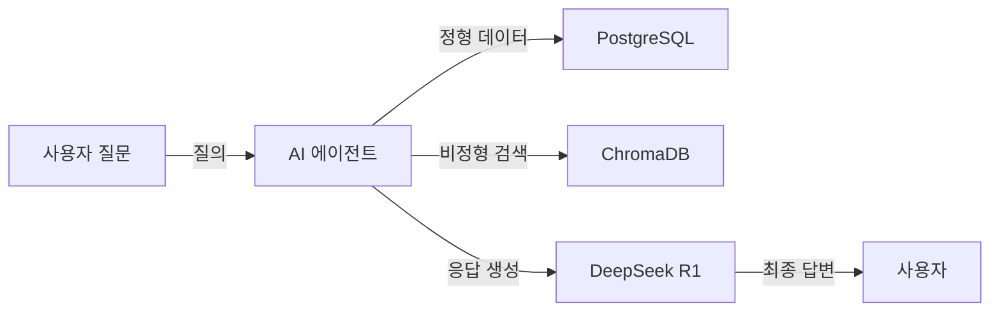

# CH01 집필 명세 -- 이 책의 목표와 최종 완성본 미리보기

## 0. 메타 정보

| 항목 | 값 |
|------|---|
| 예상 분량 | 6p |
| 유형 | 개념 중심 (프롤로그) |
| 이론/실습 | 60% / 40% |

## 1. 챕터 섹션 구조

- 1.1 이 책이 다루는 범위: Fine-tuning이 아닌 RAG 파이프라인임을 명확히. 정형+비정형 데이터 통합 검색이 목표.
- 1.2 최종 결과물 데모 시나리오: 정형(DB) + 비정형(문서) 복합 질의응답 데모를 보여준다. "김철수의 남은 연차는?"과 "연차 규정에서 특별휴가 조건은?" 동시 처리.
- 1.3 전체 아키텍처 한 장 요약: Mermaid 다이어그램으로 시스템 구성도 제시.
- 1.4 사용 기술 스택 상세: 각 기술의 역할과 선택 이유를 표로 정리.
- 1.5 이 책을 마치면 할 수 있는 것: 구체적 역량 목록 제시.

## 2. 코드-섹션 매핑

| 섹션 | 파일 | 코드 범위 |
|------|------|---------|
| 1.2 | (코드 없음) | 채팅 UI 화면 캡처 이미지로 대체 |

> **이미지 전용 섹션**: 섹션 1.2(데모 시나리오)에는 코드 실행 없이 완성된 채팅 UI 화면 캡처 1장만 삽입한다.
>
> - **캡처 방법**: Playwright로 실제 실행 중인 웹 UI 스크린샷
> - **캡처 대상**: 최종 완성본(CH08 이후)의 채팅 화면 — 질문 입력 + AI 답변 출력 + 출처 표시가 모두 보이는 상태
> - **이미지 경로**: `assets/screenshots/ch01_chat_ui_preview.png`

## 3. 개념 설명 힌트 (Why)

- RAG를 선택한 이유: Fine-tuning은 데이터와 비용이 필요하지만, RAG는 기존 문서를 그대로 활용할 수 있다.
- 정형+비정형 통합이 필요한 이유: 실무에서는 DB 데이터와 문서 데이터를 동시에 조회해야 하는 질문이 대부분이다.

## 4. 핵심 용어

- RAG(Retrieval-Augmented Generation): 검색 증강 생성. 외부 지식을 검색하여 LLM 응답에 반영하는 기법.
- MCP(Model Context Protocol): 모델이 외부 도구/데이터에 접근하는 표준 프로토콜.
- 환각(Hallucination): LLM이 사실과 다른 정보를 자신 있게 생성하는 현상.
- 파이프라인(Pipeline): 데이터 처리의 연속적 단계를 연결한 흐름.

## 5. Mermaid 다이어그램 초안

## 6. 챕터 연결

- 이전 챕터에서 가져오는 개념: (없음 -- 첫 챕터)
- 다음 챕터로 넘기는 개념: RAG의 필요성, 전체 아키텍처 구조, 기술 스택 목록

## 7. story_arc

이서연은 팀 전체 회의에서 김도현 팀장의 3개월 미션 발표를 듣는다. "응답 시간 10분을 30초로 줄여라." RAG, MCP, 벡터 DB 등 처음 듣는 기술 용어들 앞에 얼어붙지만, 최종 데모를 보고 "이걸 내가 만들 수 있다면..."이라는 기대감이 싹튼다. 불안과 기대가 공존하는 출발점이다.
